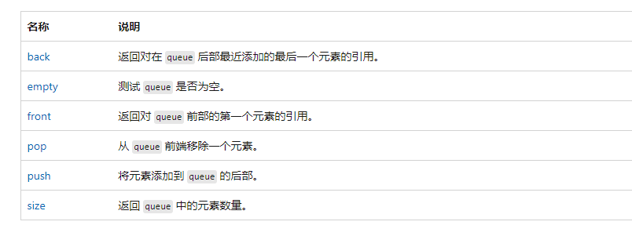
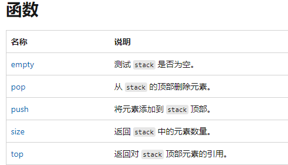
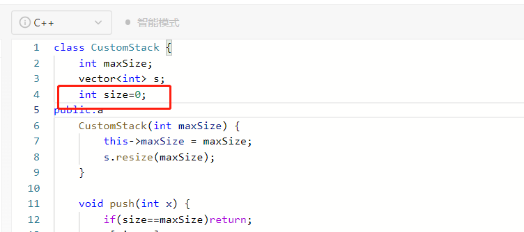

# [priority_queue](https://learn.microsoft.com/zh-cn/cpp/standard-library/priority-queue-class?view=msvc-170)

首先字母要拼写正确，

声明：

```c++
//升序队列
priority_queue <int,vector<int>,greater<int> > q; //小顶堆
//降序队列
priority_queue <int,vector<int>,less<int> >q; //大顶堆
//所有默认都是less，所有的less都是基于常识的


//插入数据，
q.push(a);
//判断是否为空
q.empty();
//原地构造数据并插入
q.empty();

//出头部数据
q.pop();
//top()：返回优先级队列中第一个元素的引用。
q.top();
//swap(priority_queue<T>& other)：和参数的元素进行交换，所包含对象的类型必须相同。
```

| 成员函数                       | 功能                                                         |
| ------------------------------ | ------------------------------------------------------------ |
| empty()                        | 如果 priority_queue 为空的话，返回 true；反之，返回 false。  |
| size()                         | 返回 priority_queue 中存储元素的个数。                       |
| top()                          | 返回 priority_queue 中第一个元素的引用形式。                 |
| push(const T& obj)             | 根据既定的排序规则，将元素 obj 的副本存储到 priority_queue 中适当的位置。 |
| push(T&& obj)                  | 根据既定的排序规则，将元素 obj 移动存储到 priority_queue 中适当的位置。 |
| emplace(Args&&... args)        | Args&&... args 表示构造一个存储类型的元素所需要的数据（对于类对象来说，可能需要多个数据构造出一个对象）。此函数的功能是根据既定的排序规则，在容器适配器适当的位置直接生成该新元素。 |
| pop()                          | 移除 priority_queue 容器适配器中第一个元素。                 |
| swap(priority_queue<T>& other) |                                                              |

```
9 struct cmp{
10     bool operator() ( Node a, Node b ){//默认是less函数
11         //返回true时，a的优先级低于b的优先级（a排在b的后面）
12         if( a.x== b.x ) return a.y> b.y;      
13         return a.x> b.x; }
14 };
15 int main(){
16     priority_queue<Node, vector<Node>, cmp> q;
}
```


## [Set](http://c.biancheng.net/view/7192.html)

底层是使用平衡二叉树实现，有排序 。不想使用排序请使用 unordered_set;

```c++
// begin	返回一个迭代器，此迭代器用于发现 set 中的第一个元素。
```

remove

| 成员方法         | 功能                                                         |
| ---------------- | ------------------------------------------------------------ |
| begin()          | 返回指向容器中第一个（注意，是已排好序的第一个）元素的双向迭代器。如果 set 容器用 const 限定，则该方法返回的是 const 类型的双向迭代器。 |
| end()            | 返回指向容器最后一个元素（注意，是已排好序的最后一个）所在位置后一个位置的双向迭代器，通常和 begin() 结合使用。如果 set 容器用 const 限定，则该方法返回的是 const 类型的双向迭代器。 |
| rbegin()         | 返回指向最后一个（注意，是已排好序的最后一个）元素的反向双向迭代器。如果 set 容器用 const 限定，则该方法返回的是 const 类型的反向双向迭代器。 |
| rend()           | 返回指向第一个（注意，是已排好序的第一个）元素所在位置前一个位置的反向双向迭代器。如果 set 容器用 const 限定，则该方法返回的是 const 类型的反向双向迭代器。 |
| cbegin()         | 和 begin() 功能相同，只不过在其基础上，增加了 const 属性，不能用于修改容器内存储的元素值。 |
| cend()           | 和 end() 功能相同，只不过在其基础上，增加了 const 属性，不能用于修改容器内存储的元素值。 |
| crbegin()        | 和 rbegin() 功能相同，只不过在其基础上，增加了 const 属性，不能用于修改容器内存储的元素值。 |
| crend()          | 和 rend() 功能相同，只不过在其基础上，增加了 const 属性，不能用于修改容器内存储的元素值。 |
| find(val)        | 在 set 容器中查找值为 val 的元素，如果成功找到，则返回指向该元素的双向迭代器；反之，则返回和 end() 方法一样的迭代器。另外，如果 set 容器用 const 限定，则该方法返回的是 const 类型的双向迭代器。 |
| lower_bound(val) | 返回一个指向当前 set 容器中第一个大于或等于 val 的元素的双向迭代器。如果 set 容器用 const 限定，则该方法返回的是 const 类型的双向迭代器。 |
| upper_bound(val) | 返回一个指向当前 set 容器中第一个大于 val 的元素的迭代器。如果 set 容器用 const 限定，则该方法返回的是 const 类型的双向迭代器。 |
| equal_range(val) | 该方法返回一个 pair 对象（包含 2 个双向迭代器），其中 pair.first 和 lower_bound() 方法的返回值等价，pair.second 和 upper_bound() 方法的返回值等价。也就是说，该方法将返回一个范围，该范围中包含的值为 val 的元素（set 容器中各个元素是唯一的，因此该范围最多包含一个元素）。 |
| empty()          | 若容器为空，则返回 true；否则 false。                        |
| size()           | 返回当前 set 容器中存有元素的个数。                          |
| max_size()       | 返回 set 容器所能容纳元素的最大个数，不同的操作系统，其返回值亦不相同。 |
| insert()         | 向 set 容器中插入元素。                                      |
| erase()          | 删除 set 容器中存储的元素。                                  |
| swap()           | 交换 2 个 set 容器中存储的所有元素。这意味着，操作的 2 个 set 容器的类型必须相同。 |
| clear()          | 清空 set 容器中所有的元素，即令 set 容器的 size() 为 0。     |
| emplace()        | 在当前 set 容器中的指定位置直接构造新元素。其效果和 insert() 一样，但效率更高。 |
| emplace_hint()   | 在本质上和 emplace() 在 set 容器中构造新元素的方式是一样的，不同之处在于，使用者必须为该方法提供一个指示新元素生成位置的迭代器，并作为该方法的第一个参数。 |
| count(val)       | 在当前 set 容器中，查找值为 val 的元素的个数，并返回。注意，由于 set 容器中各元素的值是唯一的，因此该函数的返回值最大为 1。 |

## Map

erase

初始化

```c++
unordered_map<string,unordered_set<string>> gra = {{beginWord,{}}};
```


## [Vector](https://learn.microsoft.com/zh-cn/cpp/standard-library/vector-class?view=msvc-170)

pop_back

back是引用

```c++
vector<vector<string>> ans
ans.push_back({path.rbegin(),path.rend()});
```

| 函数成员         | 函数功能                                                     |
| ---------------- | ------------------------------------------------------------ |
| begin()          | 返回指向容器中第一个元素的迭代器。                           |
| end()            | 返回指向容器最后一个元素所在位置后一个位置的迭代器，通常和 begin() 结合使用。 |
| rbegin()         | 返回指向最后一个元素的迭代器。                               |
| rend()           | 返回指向第一个元素所在位置前一个位置的迭代器。               |
| cbegin()         | 和 begin() 功能相同，只不过在其基础上，增加了 const 属性，不能用于修改元素。 |
| cend()           | 和 end() 功能相同，只不过在其基础上，增加了 const 属性，不能用于修改元素。 |
| crbegin()        | 和 rbegin() 功能相同，只不过在其基础上，增加了 const 属性，不能用于修改元素。 |
| crend()          | 和 rend() 功能相同，只不过在其基础上，增加了 const 属性，不能用于修改元素。 |
| size()           | 返回实际元素个数。                                           |
| max_size()       | 返回元素个数的最大值。这通常是一个很大的值，一般是 232-1，所以我们很少会用到这个函数。 |
| resize()         | 改变实际元素的个数。                                         |
| capacity()       | 返回当前容量。                                               |
| empty()          | 判断容器中是否有元素，若无元素，则返回 true；反之，返回 false。 |
| reserve()        | 增加容器的容量。                                             |
| shrink _to_fit() | 将内存减少到等于当前元素实际所使用的大小。                   |
| operator[ ]      | 重载了 [ ] 运算符，可以向访问数组中元素那样，通过下标即可访问甚至修改 vector 容器中的元素。 |
| at()             | 使用经过边界检查的索引访问元素。                             |
| front()          | 返回第一个元素的引用。                                       |
| back()           | 返回最后一个元素的引用。                                     |
| data()           | 返回指向容器中第一个元素的指针。                             |
| assign()         | 用新元素替换原有内容。                                       |
| push_back()      | 在序列的尾部添加一个元素。                                   |
| pop_back()       | 移出序列尾部的元素。                                         |
| insert()         | 在指定的位置插入一个或多个元素。                             |
| erase()          | 移出一个元素或一段元素。                                     |
| clear()          | 移出所有的元素，容器大小变为 0。                             |
| swap()           | 交换两个容器的所有元素。                                     |
| emplace()        | 在指定的位置直接生成一个元素。                               |
| emplace_back()   | 在序列尾部生成一个元素。                                     |


## [queue](http://c.biancheng.net/view/6978.html)

没有Top函数


| 成员函数                    | 功能                                                         |
| --------------------------- | ------------------------------------------------------------ |
| empty()                     | 如果 queue 中没有元素的话，返回 true。                       |
| size()                      | 返回 queue 中元素的个数。                                    |
| front()                     | 返回 queue 中第一个元素的引用。如果 queue 是常量，就返回一个常引用；如果 queue 为空，返回值是未定义的。 |
| back()                      | 返回 queue 中最后一个元素的引用。如果 queue 是常量，就返回一个常引用；如果 queue 为空，返回值是未定义的。 |
| push(const T& obj)          | 在 queue 的尾部添加一个元素的副本。这是通过调用底层容器的成员函数 push_back() 来完成的。 |
| emplace()                   | 在 queue 的尾部直接添加一个元素。                            |
| push(T&& obj)               | 以移动的方式在 queue 的尾部添加元素。这是通过调用底层容器的具有右值引用参数的成员函数 push_back() 来完成的。 |
| pop()                       | 删除 queue 中的第一个元素。                                  |
| swap(queue<T> &other_queue) | 将两个 queue 容器适配器中的元素进行互换，需要注意的是，进行互换的 2 个 queue 容器适配器中存储的元素类型以及底层采用的基础容器类型，都必须相同。 |



## [deque](http://c.biancheng.net/view/6860.html)

使用于BFS无代价转移 https://leetcode.cn/problems/minimum-obstacle-removal-to-reach-corner/


| 函数成员         | 函数功能                                                     |
| ---------------- | ------------------------------------------------------------ |
| begin()          | 返回指向容器中第一个元素的迭代器。                           |
| end()            | 返回指向容器最后一个元素所在位置后一个位置的迭代器，通常和 begin() 结合使用。 |
| rbegin()         | 返回指向最后一个元素的迭代器。                               |
| rend()           | 返回指向第一个元素所在位置前一个位置的迭代器。               |
| cbegin()         | 和 begin() 功能相同，只不过在其基础上，增加了 const 属性，不能用于修改元素。 |
| cend()           | 和 end() 功能相同，只不过在其基础上，增加了 const 属性，不能用于修改元素。 |
| crbegin()        | 和 rbegin() 功能相同，只不过在其基础上，增加了 const 属性，不能用于修改元素。 |
| crend()          | 和 rend() 功能相同，只不过在其基础上，增加了 const 属性，不能用于修改元素。 |
| size()           | 返回实际元素个数。                                           |
| max_size()       | 返回容器所能容纳元素个数的最大值。这通常是一个很大的值，一般是 232-1，我们很少会用到这个函数。 |
| resize()         | 改变实际元素的个数。                                         |
| empty()          | 判断容器中是否有元素，若无元素，则返回 true；反之，返回 false。 |
| shrink _to_fit() | 将内存减少到等于当前元素实际所使用的大小。                   |
| at()             | 使用经过边界检查的索引访问元素。                             |
| front()          | 返回第一个元素的引用。                                       |
| back()           | 返回最后一个元素的引用。                                     |
| assign()         | 用新元素替换原有内容。                                       |
| push_back()      | 在序列的尾部添加一个元素。                                   |
| push_front()     | 在序列的头部添加一个元素。                                   |
| pop_back()       | 移除容器尾部的元素。                                         |
| pop_front()      | 移除容器头部的元素。                                         |
| insert()         | 在指定的位置插入一个或多个元素。                             |
| erase()          | 移除一个元素或一段元素。                                     |
| clear()          | 移出所有的元素，容器大小变为 0。                             |
| swap()           | 交换两个容器的所有元素。                                     |
| emplace()        | 在指定的位置直接生成一个元素。                               |
| emplace_front()  | 在容器头部生成一个元素。和 push_front() 的区别是，该函数直接在容器头部构造元素，省去了复制移动元素的过程。 |
| emplace_back()   | 在容器尾部生成一个元素。和 push_back() 的区别是，该函数直接在容器尾部构造元素，省去了复制移动元素的过程。 |


## pair

```c++
 pair <string, string> pair2("STL教程","http://c.biancheng.net/stl/");  
stk.push(make_pair(heights[i],i));
//or
stk.emplace(1,2);
```


## 状态压缩常用操作

预备知识
首先分享一些状态压缩常用的操作(本题不一定会用到)

```c++
for (int i = 0; i < totalState; ++i) {
    cnt[i] = cnt[i >> 1] + (i & 1);
}
```

批量统计i的二进制数中1的个数


```c++
bitset<32>(num).count()
```

统计单个数num的二进制数中1的个数，32可以为其他数，取决于num的二进制数长度

**重点**

```c++
for (int subMask = state; subMask; subMask = (subMask - 1) & state) {
    operate subMask...
}
```

遍历state的子集，比如state是011，那么子集是{001, 010, 011}


```c++
int lowBit = a & -a
```


取a的最低位1，比如a = 00110100，则lowBit = 100，原理是一个数的负数是它的反码加1，即从右到左数(低位到高位)保留第一个1，其他都取反。这样一个正数与它对应负数进行&操作后，就只保留了低位的1了


(x & y) == x 
判断x是否是y的子集，表达式为true的话，说明x是y的子集，一个小技巧, 不用费力记公式, 实际用的时候，可以现场推导，比如x = 0110, y = 1111, 由于0110 & 1111 = 0110, 所以x & y = x


(x & (x >> 1)) == 0
判断x的二进制数中是否有连续的1，表达式为true的话，说明没有


1 & (x >> i)
判断x的二进制数中，第i位是否是1，从左到右数

作者：Mountain-Ocean
链接：https://leetcode.cn/problems/parallel-courses-ii/solution/cchao-qing-xi-de-si-lu-chao-xiang-xi-de-zqs3i/
来源：力扣（LeetCode）
著作权归作者所有。商业转载请联系作者获得授权，非商业转载请注明出处。

快速


## 一些函数

[srand((unsigned)time(NULL))](https://blog.csdn.net/jx232515/article/details/51510336)

[rand](https://learn.microsoft.com/zh-cn/cpp/c-runtime-library/reference/rand?view=msvc-170)

swap()


Map


## [Stack](http://c.biancheng.net/view/6971.html)

  

| 成员函数                     | 功能                                                         |
| ---------------------------- | ------------------------------------------------------------ |
| empty()                      | 当 stack 栈中没有元素时，该成员函数返回 true；反之，返回 false。 |
| size()                       | 返回 stack 栈中存储元素的个数。                              |
| top()                        | 返回一个栈顶元素的引用，类型为 T&。如果栈为空，程序会报错。  |
| push(const T& val)           | 先复制 val，再将 val 副本压入栈顶。这是通过调用底层容器的 push_back() 函数完成的。 |
| push(T&& obj)                | 以移动元素的方式将其压入栈顶。这是通过调用底层容器的有右值引用参数的 push_back() 函数完成的。 |
| pop()                        | 弹出栈顶元素。                                               |
| emplace(arg...)              | arg... 可以是一个参数，也可以是多个参数，但它们都只用于构造一个对象，并在栈顶直接生成该对象，作为新的栈顶元素。 |
| swap(stack<T> & other_stack) | 将两个 stack 适配器中的元素进行互换，需要注意的是，进行互换的 2 个 stack 适配器中存储的元素类型以及底层采用的基础容器类型，都必须相同。 |

## vector

| 成员函数  | 功能                                                         |
| --------- | ------------------------------------------------------------ |
| begin()   | 返回指向容器中第一个元素的正向迭代器；如果是 const 类型容器，在该函数返回的是常量正向迭代器。 |
| end()     | 返回指向容器最后一个元素之后一个位置的正向迭代器；如果是 const 类型容器，在该函数返回的是常量正向迭代器。此函数通常和 begin() 搭配使用。 |
| rbegin()  | 返回指向最后一个元素的反向迭代器；如果是 const 类型容器，在该函数返回的是常量反向迭代器。 |
| rend()    | 返回指向第一个元素之前一个位置的反向迭代器。如果是 const 类型容器，在该函数返回的是常量反向迭代器。此函数通常和 rbegin() 搭配使用。 |
| cbegin()  | 和 begin() 功能类似，只不过其返回的迭代器类型为常量正向迭代器，不能用于修改元素。 |
| cend()    | 和 end() 功能相同，只不过其返回的迭代器类型为常量正向迭代器，不能用于修改元素。 |
| crbegin() | 和 rbegin() 功能相同，只不过其返回的迭代器类型为常量反向迭代器，不能用于修改元素。 |
| crend()   | 和 rend() 功能相同，只不过其返回的迭代器类型为常量反向迭代器，不能用于修改元素。 |


## string

|                                                              |                                                            |
| ------------------------------------------------------------ | ---------------------------------------------------------- |
| [`substr`](https://learn.microsoft.com/zh-cn/cpp/standard-library/basic-string-class?view=msvc-170#substr) | 从字符串起始处的指定位置复制最多某个数目的字符的子字符串。 |
| find                                                         | 返回对应的索引                                             |
|                                                              |                                                            |


to_string()

string()

[`stoi`  ](https://learn.microsoft.com/zh-cn/cpp/standard-library/string-functions?view=msvc-170#stoi)将字符序列转换为整数。

[`stof`](https://learn.microsoft.com/zh-cn/cpp/standard-library/string-functions?view=msvc-170#stof) 将字符序列转换为整数。

[`stod`](https://learn.microsoft.com/zh-cn/cpp/standard-library/string-functions?view=msvc-170#stod) 将字符序列转换为 **`double`**。


## List

| 成员函数        | 功能                                                         |
| --------------- | ------------------------------------------------------------ |
| begin()         | 返回指向容器中第一个元素的双向迭代器。                       |
| end()           | 返回指向容器中最后一个元素所在位置的下一个位置的双向迭代器。 |
| rbegin()        | 返回指向最后一个元素的反向双向迭代器。                       |
| rend()          | 返回指向第一个元素所在位置前一个位置的反向双向迭代器。       |
| cbegin()        | 和 begin() 功能相同，只不过在其基础上，增加了 const 属性，不能用于修改元素。 |
| cend()          | 和 end() 功能相同，只不过在其基础上，增加了 const 属性，不能用于修改元素。 |
| crbegin()       | 和 rbegin() 功能相同，只不过在其基础上，增加了 const 属性，不能用于修改元素。 |
| crend()         | 和 rend() 功能相同，只不过在其基础上，增加了 const 属性，不能用于修改元素。 |
| empty()         | 判断容器中是否有元素，若无元素，则返回 true；反之，返回 false。 |
| size()          | 返回当前容器实际包含的元素个数。                             |
| max_size()      | 返回容器所能包含元素个数的最大值。这通常是一个很大的值，一般是 232-1，所以我们很少会用到这个函数。 |
| front()         | 返回第一个元素的引用。                                       |
| back()          | 返回最后一个元素的引用。                                     |
| assign()        | 用新元素替换容器中原有内容。                                 |
| emplace_front() | 在容器头部生成一个元素。该函数和 push_front() 的功能相同，但效率更高。 |
| push_front()    | 在容器头部插入一个元素。                                     |
| pop_front()     | 删除容器头部的一个元素。                                     |
| emplace_back()  | 在容器尾部直接生成一个元素。该函数和 push_back() 的功能相同，但效率更高。 |
| push_back()     | 在容器尾部插入一个元素。                                     |
| pop_back()      | 删除容器尾部的一个元素。                                     |
| emplace()       | 在容器中的指定位置插入元素。该函数和 insert() 功能相同，但效率更高。 |
| insert()        | 在容器中的指定位置插入元素。                                 |
| erase()         | 删除容器中一个或某区域内的元素。                             |
| swap()          | 交换两个容器中的元素，必须保证这两个容器中存储的元素类型是相同的。 |
| resize()        | 调整容器的大小。                                             |
| clear()         | 删除容器存储的所有元素。                                     |
| splice()        | 将一个 list 容器中的元素插入到另一个容器的指定位置。         |
| remove(val)     | 删除容器中所有等于 val 的元素。                              |
| remove_if()     | 删除容器中满足条件的元素。                                   |
| unique()        | 删除容器中相邻的重复元素，只保留一个。                       |
| merge()         | 合并两个事先已排好序的 list 容器，并且合并之后的 list 容器依然是有序的。 |
| sort()          | 通过更改容器中元素的位置，将它们进行排序。                   |
| reverse()       | 反转容器中元素的顺序。                                       |





要记得初始化


## 编程技巧

[map转化为vector](https://www.techiedelight.com/zh/convert-map-vector-key-value-pairs-cpp/)


`for_each`

```c++
 for_each(dic.begin(),dic.end(),[&ans](const pair<string,vector<string>> p){
            ans.emplace_back(p.second);
 });
```

```c++
struct Edge {
    int len, x, y;
    Edge(int len, int x, int y) : len(len), x(x), y(y) {
    }
};
for (auto& [len, x, y] : edges) {
    
}
```


## 常用算法

[find_if](http://c.biancheng.net/view/7493.html)

```c++
vector<int> idx(n,0);
 iota(idx.begin(),idx.end(),0); [0,1,2,3...]
```


## 番外

关键字null：nullptr

JVM的操作数栈采用了逆波兰表达式思想

c++ 的int多少个字节？


质因数是什么？

- 1没有质因子。
- 5只有1个质因子，5本身。（5是质数）
- 6的质因子是2和3。(6 = 2 × 3)
- 2、4、8、16等只有1个质因子：2。（2是质数，4 =2²，8 = 2³，如此类推）

**丑数** 就是只包含质因数 `2`、`3` 和 `5` 的正整数。

迭代器要用指针访问


选出数组的前三大的点

[nth_element](http://c.biancheng.net/view/7476.html)

```c++
vector<vector<pair<int, int>>> g(n); 
for (auto &vs : g)
    if (vs.size() > 3) {
        //（开始位置，第几小，结束位置）
        //第几大的话在后面加上排序比较函数就行
        nth_element(vs.begin(), vs.begin() + 3, vs.end());
        vs.resize(3);
    }
}
```


```java
class Solution {
public:
    int maximumGap(vector<int>& nums) {
        int n = nums.size();
        if(n==1)return 0;
        int min_val = *min_element(nums.begin(),nums.end());
        int max_val = *max_element(nums.begin(),nums.end());
        if(min_val==max_val)return 1;
        
        int d = (max_val-min_val)/(n-1);
        int bucket_size = n-1;

        vector<pair<int,int>> buckets(bucket_size,pair<int,int>(-1,-1));
        
        for(int i=0;i<n;i++){
            int idx = (nums[i]-min_val)/bucket_size;
            buckets[idx].first = min(buckets[idx].first,nums[i]);
            buckets[idx].second = max(buckets[idx].second,nums[i]);
        }

        int ans = d;
        int last = -1;
        for(auto &[_min,_max]:buckets){
            if(last==-1){
                last = _max;
            }
            if(_min==-1)continue;
            ans = max(_min-last,ans);
            last = _max;
        }

        return ans;

    }
};
```


