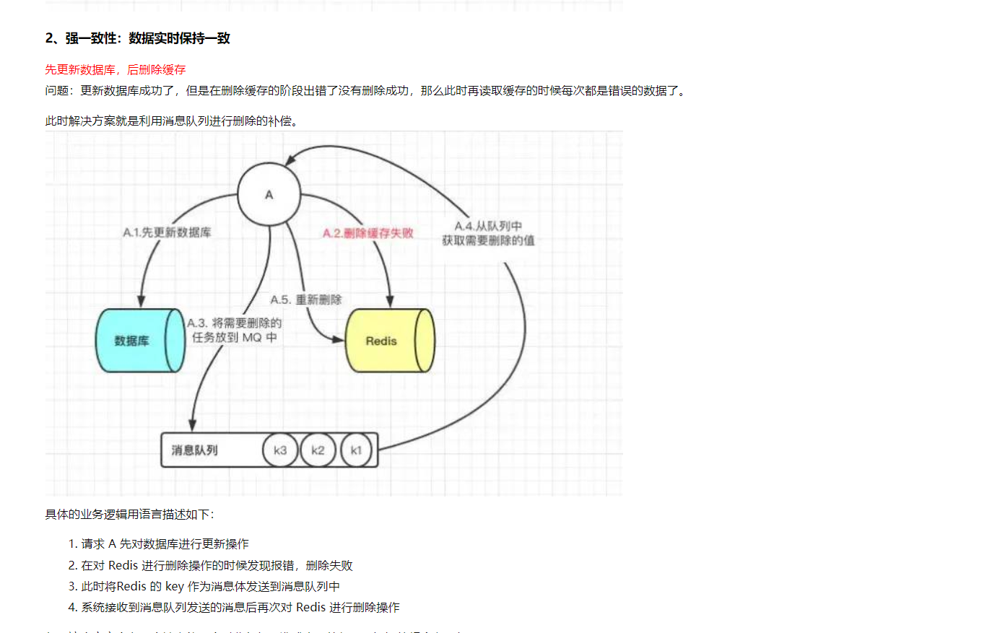
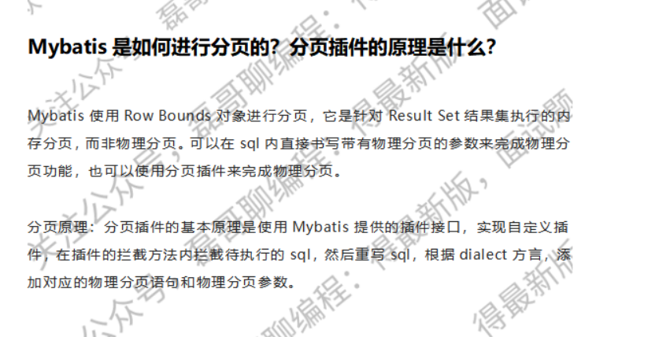

1.mysql的深度分页问题

https://blog.csdn.net/daidaineteasy/article/details/110875811

2.redis应用的实际场景 在项目里

开发平台：mock功能的配置信息

怎么做到redis和mysql数据的一致性？

3.消息队列应用在项目中

接受埋点数据到消息队列，用于削峰的处理，然后其他的服务进行处理。

需求发生更改时，发现更改时，

把更改的需求推送到消息队列中，通知到钉钉群。

4.消息队列相关的面试题

5.并发编程在项目里边的应用

我们解析需求文件的时候采用的多线程去解析的，解析成java里边的需求对象，然后再去更新数据库。

6.线程池的参数

spring还有一个自带线程池，详解部分：https://blog.csdn.net/weixin_44259233/article/details/120708174

解析需求文件，采用多线程方式进行解析：synchronizedList

7.具体springcloud的使用

8.JVM的内存模型

9.redis的分布式锁的应用

redis分布式锁redission，统计数据的展示，应用的数量和接口的数量数量及其比例，更新需求的数量，分组显示使用的是分布式锁

运维数据

+ 格式调整进入消息队列

+ 简单解析存入mongodb

+ 数据分析，可视化显示

  

都是什么样的埋点？客户端小程序初始化埋点、客户端小程序启动场景值埋点、客户端小程序关闭时埋点、分享时埋点

数据分析分析出什么？ 累计用户数、打开次数、访问次数、访问人数、新用户数、人均停留时长、次均停留时长、sharePv、shareUv

单月人数位置？前端可以展示每个省份的人数

每月定时计算分析 xxx-jobAdmin 

什么是令牌桶算法，应用在哪里？

https://maimai.cn/article/detail?fid=1739315976&efid=pBRC4EwQSUdkdijnH4AJjw

GateWay网关应用案例(跨域、限流、黑白名单)？https://blog.csdn.net/qq_42019951/article/details/109701020

Nacos 符合CAP中哪一个？https://zhuanlan.zhihu.com/p/540826145

Ribbon 里面的负载均衡算法及其使用。https://blog.csdn.net/a745233700/article/details/122916856

OpenFeign修改负载均衡策略 https://blog.csdn.net/qq_39825705/article/details/125175303

限流相关算法：https://blog.csdn.net/weixin_43318367/article/details/113785635

Redis里面的管道是什么？https://www.jianshu.com/p/ed22a29ae2a3

redis主从数据同步实现机制：https://zhuanlan.zhihu.com/p/376667932

springcloud处怎么做熔断、限流、降级：https://www.jianshu.com/p/87c5406c1ba1

保证消息队列幂等性：https://developer.aliyun.com/article/938841

mybatis的一二级缓存机制：https://blog.csdn.net/llziseweiqiu/article/details/79413130

spring中的设计模式 https://zhuanlan.zhihu.com/p/114244039

mybatis的分页插件：

分布式任务调度：xxl-job：https://blog.csdn.net/wang0907/article/details/112093316

mybatis的方言是干什么的？http://blog.souco.cc/2017/09/20/cj7sbgb6x000xwonnefynaaa3/

#{}为什么会防止sql注入？

mybatis延迟加载机制以及使用：

mysql的hash索引：https://cloud.tencent.com/developer/article/1770574

mysql的深度分页：https://blog.csdn.net/qq_37781649/article/details/111689193

rabbitMQ和kafka的各个的特点：

