# java基础

## 第一章 java基本程序设计结构

### 1.1数据类型

java数据类型和java对象的区别

|   类别   |                             区别                             |
| :------: | :----------------------------------------------------------: |
| 数据类型 |          没有引用的概念，就是表示存储在内存上的数据          |
|   对象   | 需要来用存储在栈上的引用类型来指向，对象本身存储在堆上，引用类型存储的对象的地址相当于c++的指针。（后面详细介绍jvm内存模型） |

八种基本类型

|  类别   |    存储需求    |                 | 备注                                                         |      |
| :-----: | :------------: | :-------------: | ------------------------------------------------------------ | ---- |
|   int   |     4字节      |      整型       |                                                              |      |
|  short  |     2字节      |      整型       | 常应用于底层文件的处理                                       |      |
|  long   |     8字节      |      整型       |                                                              |      |
|  byte   |     1字节      |      整型       |                                                              |      |
|  float  |     4字节      |      浮点       |                                                              |      |
| double  |     8字节      |      浮点       | 三个特殊的浮点类型：正无穷大、负无穷大、<br />、NaN(不是一个数字) |      |
|  char   |     16bit      | 表示Unicode编码 |                                                              |      |
| boolean | 1bit（不知道） |                 |                                                              |      |

### 1.2 变量

| 值得注意的几个地方                                           |
| ------------------------------------------------------------ |
| 1.不能使用未初始化的变量                                     |
| 2.变量的声明尽量靠经第一次使用的地方                         |
| 3.常量要用final关键字，常量名最好大写，一生只能被赋值一次 。static final 用来定义类常量。 |
| 4.const 目前是java的保留字还未使用，常量必须使用final来声明。 |

### 1.3运算符

+、-、*、 / % 分别表示 加、减、乘、除、取余  结果的数据类型为参数的数据类型的范围最大的那个

|      |      |      |
| ---- | ---- | ---- |
|      |      |      |
|      |      |      |
|      |      |      |

### 1.4 字符串

java无内置字符串，标准类库提供了预定义类String （官方已经定义好的,非原生）。

<font color="red" >**每个用双引号括起来的字符串都是String类实例**</font>

1. **不可变**

   根据String源码发现，String对象没有修改自己数值的方法，只有生成字符串对象的方法（不改变自身对象的值）。

2. **String 常量共享**

   什么是String常量？只要是只要是用双引好包裹表示就相当于生成一个String常量。比如 String a=new String("abc"); 其实是生成了两个字符串常量一个是“abc”字符串常量对象； 另一个是值为“abc”的String对象；虽然它们两个的值相等的，但是他们不是一个对象。

   看下面代码：

   ```java
   		String strA = "112";
           String strB = "112";
           String strC = new String("112");
           String strD = "11" + "2";
           String a="11",b="2";String strE=a+b;
           String strF=a+"2";
           System.out.println("strA==strB:"+(strA==strB));
           System.out.println("strA==strC:"+(strA==strC));
           System.out.println("strA==strD:"+(strA==strD));
           System.out.println("strA==strE:"+(strA==strE));
           System.out.println("strA==strF:"+(strA==strF));
   ```

   打印结果

   ```text
   strA==strB:true
   strA==strC:false
   strA==strD:true
   strA==strE:false
   strA==strF:false
   ```

我们先来搞清楚== 和equals

<font color="red">**值比较？地址比较？**</font>

​			== 就是值比较，不过比较的值是引用类型的值，引用类型的值是什么？就是所指向对象的地址。例如：String a= new String("abc") 就是都这个函数返回一个引用类型的值赋给了 引用类型a; 

​		equals方法是对象的方法，只不过引用类型可以调用，进而可以比较他们指向对象的值。还有一点需要注意equals比较对象之间的值是否相等是根据对象的特性来写的。

strA==strB:true  引用类型指向同一个常量String 。所以他们同一个对象。

strA==strC:false 两个不同的对象 new String()不做共享变量

strA==strD:true 通过反编译可以看到这种写法与strA strB没有任何区别

strA==strE:false String strF=a+"2"; 字符串拼接 只要里面含有一个非常量，他就会生成一个非常量的String


咱们再在探究一下 new String("123"); 先看下面这段代码。

```java
		 char [] a={'a','c','d'}; char[] b=a;
         b[0]='A';System.out.println(a[0]);
```

打印结果

```text
A
```

说明数组也是一个对象，也就是可以用引用类型来指向。

再来看一下String 的new String方法

```java
  	public String(String original) {
        this.value = original.value; // private final char value[]; 
        this.hash = original.hash;  //private int hash; 
    }
```

也就说 this.value 和original.value 引用的是同一个数组对象。 所以说original不管所表示的字符串多大，只要它存在this的生成速度是极快，和大小没有影响。

3. **String注意要点**

 contact方法

```java
public String concat(String str) {
    int otherLen = str.length();
    if (otherLen == 0) {
        return this;
    }
    int len = value.length;
    char buf[] = Arrays.copyOf(value, len + otherLen);
    str.getChars(buf, len);
    return new String(buf, true);
}
```

concat方法的本质是生成一个新的String，从两个字符串中一个一个复制。这种方法不适合使用在连续向超大型字符串上拼接字符串。因为它会一个一个字符的复制到新的字符串上，极度浪费时间。”abc................................“.concat("a")， 这样循环几次就会极度浪费时间。

```java
String a="abc......"//超大字符串
while(有限次){
    a=a.concat("a")
}
```


上面的代码在有限的时间内运行不了几次


a+b的本质什么？ StringBuilder有什么弊端？ 小心StringBuilder的扩容机制导致内存溢出

4. **码点和代码单元**


5.**常用API**

|                        签名                         |                             解释                             |
| :-------------------------------------------------: | :----------------------------------------------------------: |
|               char charAt (int index)               | 返回给定位置的代码单元。除非对底层的代码单元感兴趣，<br />否则不需要调用这个方法。 |
|             int codePointAt(int Index)              |                  返回从给定位置开始的码点。                  |
| int offsetByCodePoints(int startlndex, int cpCount) |   返回从 startlndex 代码点开始位移 cpCount 后的码点索引。    |
|            int  compareTo(String other)             | 按照字典顺序如果字符串位于 other 之前，返回一个负数；如果字符串位于 <br />other 之后，返回一个正数； 如果两个字符串相等，返回 0。 |
|               IntStream codePoints()                | 将这个字符串的码点作为一个流返回。调用 toArray 将它们放在一个数组中。 |
| new String(int[] codePoints, int offset, int count) |    用数组中从 offset 开始的 count 个码点构造一个字符串。     |
|            boolean equals(0bject other)             |             如果字符串与 other 相等，返回 true。             |
|                        ....                         |                            .....                             |
|                  查看核心技术卷一                   |                                                              |

### 1.5 输入输出

1. **读取输入**

输标准出流输出内容到控制台非常简单，System.out.println 即可。

读取标准输入流System.in，得用到Scanner对象与标准输入流相关联，例如：Scanner in = new Scanner(System.in); 然后利用Scanner类的方法进行读取

控制台读取密码不用Scanner 因为可见。用Console类来实现	

```java
//在控制台运行程序，要不Console为空
Console cons = System.console();
String username = cons.readLine("User name: ");
char[] passwd = cons.readPassword("Password:", new Object[0]);
```

输出结果：密码输入不可见

```text
User name: root   
Password:
```


> java.util.Scanner5.0 


| API                                                 | 说明                                           |
| --------------------------------------------------- | ---------------------------------------------- |
| Scanner (InputStream in)                            | 用给定的输人流创建一个 Scanner 对象            |
| String nextLine( )                                  | 读取输入的下一行内容。                         |
| String next( )                                      | 读取输入的下一个单词（以空格作为分隔符)        |
| int nextlnt( )<br />double nextDouble( )            | 读取并转换下一个表示整数或浮点数的字符序列。   |
| boolean hasNext( )                                  | 检测输人中是否还有其他单词 。                  |
| boolean hasNextInt( )<br />boolean hasNextDouble( ) | 检测是否还有表示整数或浮点数的下一个字符序列。 |

> java.Iang.System 1.0

static Console console( ) 

| API                       | 说明                                                         |
| ------------------------- | ------------------------------------------------------------ |
| static Console console( ) | 如果有可能进行交互操作，就通过控制台窗口为交互的用户返回一个<br /> Console 对象，否则返回 null。 对于任何一个通过控制台窗口启动的<br />程序，都可使用 Console 对象。否则，其可用性将与所使用的系统有关 。 |

> java.io.Console 6

| API                                                          |                             说明                             |
| ------------------------------------------------------------ | :----------------------------------------------------------: |
| static char[] readPassword(String prompt, Object...args)<br />static String readLine(String prompt, Object...args) | 显示字符串 prompt 并且读取用户输入，直到输入行结束。 args 参数可以用来提供输人格式。 |

2.**格式化输出**

System.out.printf 方法可以进行格式化输出

System . out . printf（ ”8.2f“, x);

每一个以 ％ 字符开始的格式说明符都用相应的参数替换。 格式说明符尾部的转换符将指示被格式化的数值类型：f 表示浮点数，s 表示字符串，d 表示十进制整数

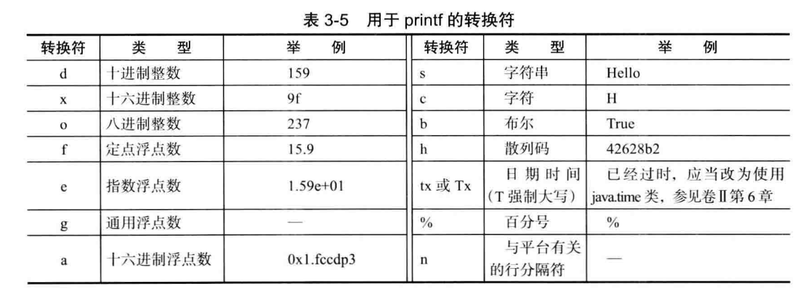

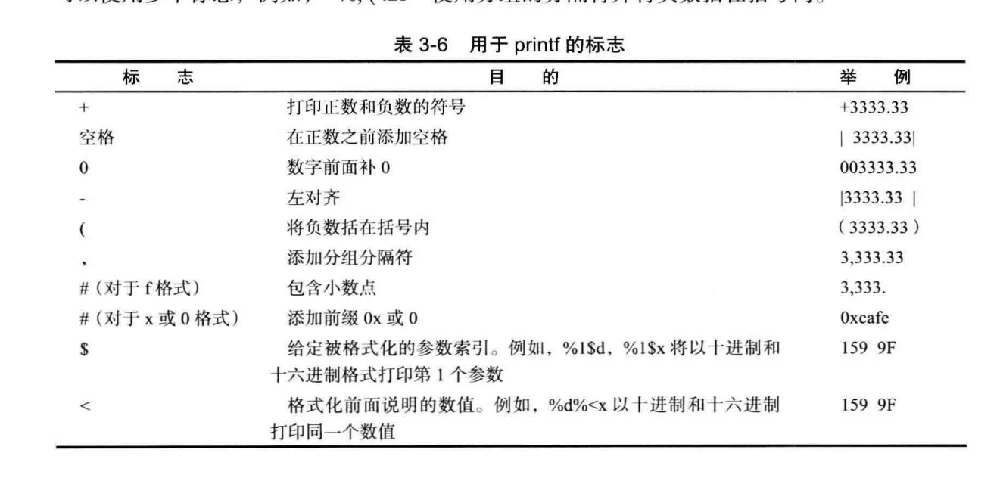

具体使用https://blog.csdn.net/jhsword/article/details/108574442


它是怎么解析这些字符串的，是通过Formatter类进行了解析，这个与String.format方法用的一个类进行的解析。我们在写程序的过程中可以适当借用这些预定义类进行功能的实现。

3.**文件的输入输出**

记住几个API

> java.util.Scanner 5.0

| API                  | 说明                                     |
| -------------------- | ---------------------------------------- |
| Scanner(File f)      | 构造一个从给定文件读取数据的 Scanner。   |
| Scanner(String data) | 构造一个从给定字符串读取数据的 Scanner。 |
|                      |                                          |

> java.io.PrintWriter 1.1

| API                              | 说明                                                      |
| -------------------------------- | --------------------------------------------------------- |
| PrintWriter(String fileName)     | 构造一个将数据写入文件的 PrintWriter。 文件名由参数指定。 |
| static Path get(String pathname) | 根据给定的路径名构造一个 Path。                           |

### 1.6 大数值

> Biglnteger 和 BigDecimaL 这两个类可以处理包含任意长度数字序列的数值。

对于c++得自己写大数值的计算，一般做算法题要求会会写简单的大数值的运算+ - * /

BigInteger 存在4000行代码，里面用到许多经典算法，值得后续研究。

### 1.7 数组

1. **支持Foreach循环**

   数组是支持foreach来遍历数组的值。实现Iterable的类对象也支foreach语法

   ```java
   for (variable : collection)  statement
   ```

   

2. **数组的初始化以及匿名数组**

   int[] a = new int[100];

   上面这种是创建了一个数组，存在了一个数组对象，被默认初始化。但是数组元素未必含有值。

   数字数组所有元素初始化为0；boolean数组初始化为false，对象数组初始化为了null

```java
Arrays.toString(a); //a为一个数组
```

若a 为基本数据类型的数组，就会以为一个数组元素的值组成字符串

若a为对象数组，就会调用对象的toString方法组成字符串

```java
new int[] { 17, 19, 23, 29, 31, 37 } //初始化匿名数组
```

```java
int [] a={17, 19, 23, 29, 31, 37 };
a=new int[] { 17, 19, 23, 29, 31, 37 }; 
a={17, 19, 23, 29, 31, 37 }; //报错
```

匿名数组的语法形式可以在不重新创建变量的情况下，可以重新初始化一个数组

与字符串一样 数组长度为0和null不相同

3.**数组拷贝**

在前面已经验证，数组也是一种object。也是需要引用类型来指向，所以拷贝数组的话不能使用"="，所以需要Arrays.copyOf()函数来进行深拷贝。

Array.copyof()可传入对象数组进行拷贝，它的原理是什么呢？

```java
@SuppressWarnings("unchecked")
public static <T> T[] copyOf(T[] original, int newLength) {
    return (T[]) copyOf(original, newLength, original.getClass());
}
```

```java
public static <T,U> T[] copyOf(U[] original, int newLength, Class<? extends T[]> newType) {
    @SuppressWarnings("unchecked")
    T[] copy = ((Object)newType == (Object)Object[].class)
        ? (T[]) new Object[newLength]
        : (T[]) Array.newInstance(newType.getComponentType(), newLength);
    System.arraycopy(original, 0, copy, 0,
                     Math.min(original.length, newLength));
    return copy;
}
```

解释 说明


Arrays一些比较有用的API

> java . util.Arrays 1.2

| API                                                          | 说明 |
| ------------------------------------------------------------ | ---- |
| static String toString(type[]a)                              |      |
| static type copyOf(type[]a, int length)<br />static type copyOfRange(type[]a , int start, int end) |      |
| static void sort(type [ ] a)                                 |      |
| static int binarySearch(type[] a , type v)<br />static int binarySearch(type[]a, int start, int end , type v) |      |
| static void fill(type[]a , type v)                           |      |
| static boolean equals(type[]a, type[]b)                      |      |

4. **多维数组**

foreach同样可以嵌套使用 来访问元素

```java
for (double row : a)
	for (double value : row)
		do something with value
```

a为一个二维数组  则a[i]表示一个一位数组

```java
int[][] odds = new int[NMAX + 1] [] ;
for (int n = 0; n <= NMAX ; n++)
	odds [n] = new int[n + 1] ;
```

表示的不规则数组为

```text
0
0 0
0 0 0
0 0 0 0
0 0 0 0 0
.....
```

## 第二章 对象和类


### 2.1 面向对象设计

1. **类**

面向对象设计即OOP

对象的一个重要概念说就是封装（encapsulation），把对象的数据和行为组装到一个包，并对对象的使用者隐藏数据的实现方式。

实例域：对象中的数据     方法：操作数据的过程

封装的关键：不能让类中的方法直接访问其他类的实例域。

继承 更加便于定义自定义类，方便扩展。

2.**类之间的关系**

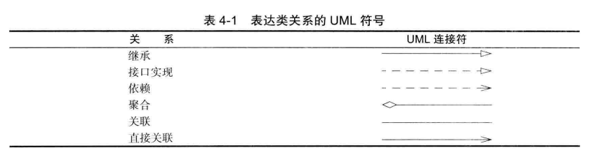

### 2.2 预定义类

1. **对象和对象变量**

对象变量不是一个对象，只是可以存储对象的引用，也就是引用一个对象。对象变量可以通过引用调用所引用的对象的方法。

局部变量不会自动地初始化为 null，而必须通过调用 new 或将它们设置为 null 进行初始化。


2. **多使用官方的自定义类**

比如

> java.time.LocalDate 8

| API                                                          | 说明                                                         |
| ------------------------------------------------------------ | ------------------------------------------------------------ |
| static Local Time now( )                                     | 构造一个表示当前日期的对象。                                 |
| static LocalTime of( int year , int month , int day )        | 构造一个表示给定日期的对象。                                 |
| int getYear( )<br />int getMonthValue( )<br />int getDayOfMonth( ) | 得到当前日期的年、月和曰。                                   |
| DayOfWeek getDayOfWeek( )                                    | 得到当前日期是星期几， 作为 DayOfWeek 类的一个实例返回。 调用 getValue 来得到<br/>1 ~ 7 之间的一个数，表示这是星期几，1 表示星期一，7 表示星期日。 |
| Local Date piusDays( int n )<br />LocalDate minusDays(int n) | 生成当前日期之后或之前 n 天的日期。                          |

### 2.3 自定义类

1. **隐式参数和显示参数**

```java
//Employee类的一个方法
public void raiseSalary(double byPercent)  
{
    double raise = salary * byPercent / 100;
    salary += raise;
}

number007.raiseSalary(5);
```

 byPercent为显示参数， number007为隐式参数，在方法中this可以表示隐式参数。（this要与关键字super使用上做好区分）

2.  **final实例域**

final修饰的变量值是不允许改变的。

修饰基本类型的变量时，他表示的值是不会改变的。当它修饰对象变量时，对象变量的引用值是不会改变的，也即是说所引用的对象（如果是可变类对象）自身的值是可以修改的。

什么是不可变类对象----类中只有final修饰的基本类型域或者不可变类型对象。  

### 2.4 静态域与静态方法

### 2.5 方法参数

方法参数是按照值传递，对象参数则传递拷贝的引用值，基本类型参数则直接传递拷贝代表的值

### 2.6 对象构造

**重载（overloading）**：一个类里相同的方法名 不同的签名（参数的个数+参数的类型）。 下面这种调用就是重载

​	     StringBuilder messages = new StringBuilder();

​		 StringBuilder todoList = new StringBuilder("To do:\n")；


**默认域初始化**

​		构造器中没有显示的对域进行初始化会被自动地赋值，数值为0 、布尔值为false、对象引用为null

**无参数构造器**

​		编写类时，如果没有编写构造方法，会自动生成一个隐式 无参数构造方法。和下面操作的效果一样

```java
public Employee(){
}
```

**显示域初始化**

在执行构造方法之前进行赋值

```java
class Employee{
    private String name ="";
}

```

```java
class Employee{
    public Employee(String name){
        this.name=name;
    }
}
```

**初始化块**

```java
class Employee
{
    private static int nextld;
    private int id;
    private String name;
    private double salary;
	// object initialization block
    {
        id = nextld;
        nextld++;
    }
    public Employee(String n, double s){
        salary = s;
        name=n;
    }
}
	
```

初始化的执行顺序

1 ) 所有数据域被初始化为默认值（0、 false 或 null )

2 ) 按照在类声明中出现的次序依次执行所有域初始化语句和初始化块。

3 ) 如果构造器第一行调用了第二个构造器，则执行第二个构造器主体

4 ) 执行这个构造器的主体。

**对象析构与 finalize 方法**

​	当回收对象的时候执行这个方法。当JVM回收一个对会判断对象是否覆盖这个方法，若没有覆盖直接回收。否则会把这个对象放入一个F-Queue队列，线程就会执行队列里面对象的finalize方法。执行后再次进行可达性分析判断是否回收。若不回收在直接复活。 finalize只会被系统调用一次


### 2.7 包

**静态导入**

**包作用域**

### 2.8文档注释

### 2.9类设计技巧

| 一定保证的数据的私有                                         |
| ------------------------------------------------------------ |
| 一定要对数据的初始化，虽然java对对象的实例进行初始化（不对局部变量的初始化），最好不要依赖系统的默认初始化，而是要显示的对数据进行初始化 |
| 不要在类中使用过多的基本类型<br />private String street;<br/>private String city;<br/>private String state; <br />可以把上面这个几个变量封装成Address类，这样便于管理。 |
| 不是所有的域需要域访问器和域更改器--最大封装性防止数据被破坏 |
| 将职责过多的类进行分解 (一副扑克牌分解为 一副扑克牌和一张扑克牌) |
| 类名和方法名要能够体现它们的职责                             |
| 优先使用不可变类                                             |

## 第三章  继承


### 3.1 超类和子类

####  定义子类

```java
public class Employee
{
    // instance fields
    private String name ;
    private double salary;
    private LocalDate hireDay;
    // constructor
    public Employee(String n , double s, int year , int month , int day)
    {
        name = n;
        salary = s;
        hireDay = LocalDate.of(year, month, day) ;
    }
    // a method
    public String getName()
    {
        return name;
    }
    public double getSalaryO
    {
   	 	return salary;
    }
}
```


```java
public class Manager extends Employee
{
	private double bonus;
    public void setBonus(double bonus)
    {
 	   this.bonus = bonus;
    }
}
```

子类将拥有父类的所有的方法和域，在设计的时候应该将通用的方法放入到父类，将特殊用途的方法放到子类中

#### 覆盖方法

​	父类的方法并不一定适用于子类的使用，所以需要我们在子类里面进行方法重写的也就是覆盖父类实现的方法。覆盖只是对外部调用而言的，子类覆盖了父类的某一方法，子类中依然可以调用这个方法（它依然继承且拥有这个方法这是只能在类内部进行调用），用super.method()调用，因为需要标识否则会调用子类中重写的方法。

> super只有标识的作用,标识出在父类中声明的方法。而this指向的是当前对象

```java
public class Manager extends Employee
{
	private double bonus;
    public void setBonus(double bonus)
    {
 	   this.bonus = bonus;
    }
    
    public double getSalaryO
    {
    	//return salary + bonus; // won't work
         return super().getSalary() + bonus; // won't work
    }
}
```

在子类里面是无法访问到salary，因为他是在父类中声明并且是私有的，子类中是不能访问。也可以这么理解子类拥有这个域，但是不能直接访问。

#### 子类构造器

由于 Manager 类的构造器不能访问 Employee 类的私有域，所以必须利用 Employee 类的构造器对这部分私有域进行初始化，我们可以通过 super 实现对超类构造器的调用

```java
//显示调用的方法
public Manager(String name, double salary, int year, int month, int day)
{
    super(name, salary, year, month, day) ;
    bonus = 0;
}
```

​		非静态类，都会有构造器。子类构造器一定会调用父类的构造器，如果不显示调用父类构造器就会隐式调用父类的默认构造器（无参数的构造器），如果父类没有默认的构造器就会报错。

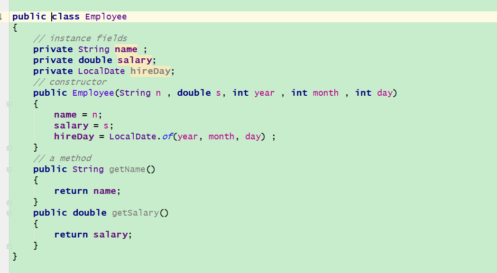

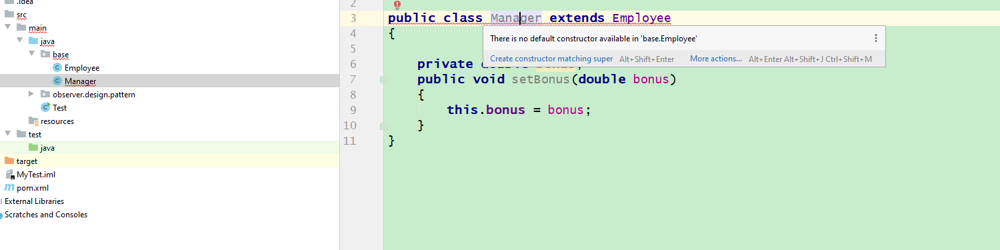


|  |  |
| ----- | ------------------------------------------ |
| this |        1.引用隐式参数<br />2.调用该类的其他构造器                                    |
| super | 1.调用超类的方法<br />2.调用超类的构造器 |

####  多态

​	对象变量是多态，父类对象变量可以引用子类对象实例。 一个 Employee 变量既可以引用一个Employee 类对象，也可以引用一个 Employee 类的任何一个子类的对象（例如：Manager）。但是不能将一个超类的引用赋给子类变量。这样会导致错误。 

#### 理解方法的调用

从编译器和虚拟机的角度解释调用x.f(args)的过程（x可能是一个声明的变量，也可能是this,或者隐式的this）

① **找出所有的候选方法：**编译器根据x的声明的类型，假设为C类型，找出C类型所有名字f的方法和父类名字为f的方法并且是public的访问权限。

② 编译器根据传入的参数的对象的类型找到适合的方法，这个过程包括参数的类型自动转化。（现在我们已经确定调用的方法的方法名和签名）-------这里只是确定将要调用的方法样式，并不是一定调用当前这个。

③如果找到的这个方法是private static finnal 那么编译器肯定会调用的是上面的找到的那个方法。

不知道大家发没发现上面是在编译期间的工作室，如果在第三步编译器就能找到确切的执行哪个方法就不用在运行的时候确定了。 所以叫**静态绑定**


④ 如果不是上面的方法修饰符，那就不一定是我们找到的那个方法。所以虚拟机只能在运行的时候去确定到底执行哪个方法。虚拟机会预先为每个类创建方法表。虚拟机直接查这个表就行。假设x指向的是D类对象（C类的子类），直接搜寻这个D类的方法表（方法表里面的方法不一定都是在D类中声明的方法也可能是在的C类中声明）

下面是Employee和Manager的方法表

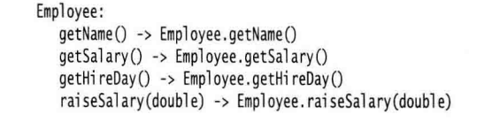

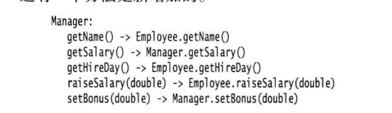


第四步是动态绑定无需现有代码进行修改就可对代码进行扩展，比如新增增一个C的子类 E    C类引用就可以指向E并且可以调用E类中的某些方法


#### final

|             |                                                              |
| ----------- | ------------------------------------------------------------ |
| final修饰类 | 这个类不能被继承                                             |
|    final方法       | 这个方法不能被子类重写                                       |
|   final修饰引用变量    | 修饰引用表示这个 引用值不能改变，也就是一直引用这个对象不能改变 |
|    final修饰基本类型     | 修饰基本类型表示这个这个变量表示值不能被改变                 |

​	final类型的数据若在定义时没有显示初始化，是没有默认初值的。 对于在定义时没有显式初始化的，应该在构造方法中进行初始化.并且final修饰的数据一生只能初始化一次

#### 强制类转换

#### 抽象类

#### 受保护的访问

### 3.2 Object所有类的超类

​		所有的类更具继承关系往上追踪都是Object对象，在java里面它是所有类的始祖。如果没有指出某个类的父类，那么这个类就继承于Object类。所以object类的变量可以引用任何类型的对象。

> **Object类是所有类的始祖，任何类都拥有Object中定义的方法**

我们现在简单看一下Object类里面定义了哪些方法

#### equals方法

> equals(Object obj)

这里值判断了两个对象引用是否具有相同的引用(this引用变量与传入的值的值比较。

```java
public boolean equals(Object obj) {
    return (this == obj);
}
```

每个对象都有一个隐式参数，一个指向自己的变量 this)因为每一个类的相等含义不相同，所以一般都会重写这个方法。但是重写的时候也不是随便的重写的，要不会造成不必要的麻烦遵循以下原则

| 准则   | 描述                                                         |
| ------ | ------------------------------------------------------------ |
| 自反性 | x.equals(x) 必须返回true                                     |
| 一致性 | x.equals(y)  x与y所指向的对象只要不被改变，并且x y 指向不改变。x.equals(y)无论被调用多少次它结果也不会被改变 |
| 传递性 | x.equals(y) 与y.equals(z)结果一致。那么 x.equals(z)的结果与他们一样 |
| 对称性 | x.equals(y) 与y.equals(x)结果一致                            |
| 其他   | x.equals（null）永远返回false；<br/>For any non-null reference value  ` x`,    `x.equals(null)`  should return  `false`. |

还有一点需要注意那就是

> 重写了equals方法必须重写hashcode方法，因为两个相等的对象hash codes
>
> ```java
> /**
> *Note that it is generally necessary to override the {@code hashCode}
> * method whenever this method is overridden, so as to maintain the
> * general contract for the {@code hashCode} method, which states
> * that equal objects must have equal hash codes.*/
> ```


#### hashcode方法

>  public native int hashCode();

```java
public native int hashCode();
```

​	顺便说一下带有native关键字的方法。这样的函数为原生函数，这个方法相当于是接口调用有其他语言实现的方法。比如c语言实现的方法。这些语言编写的方法会被编写成动态链接库文件（dll），由我们的直接去调用使用。

```java
/*As much as is reasonably practical, the hashCode method defined by
* class {@code Object} does return distinct integers for distinct
* objects. (This is typically implemented by converting the internal
* address of the object into an integer, but this implementation
* technique is not required by the
* Java&trade; programming language. */
```

 这个hashCode()方法默认是由对象的地址转换而来的

有些情况需要与系统底层进行一些交互，由于java是跨平台牺牲了一些对底层的控制。所以需要借助其他语言一些协助。详情内容参考 <a href="https://www.cnblogs.com/KingIceMou/p/7239668.html">这里</a>


hashCode()有以下通用约定，也就是我们重写这个方法需要注意的地方。为什么需要注意呢？因为有许多的地方调用了hashcode这个方法比如HashMap这个类的对象在存储的时候就利用到了要存储的对象的hashcode方法。不能影响规则。

```java
/**
* <p>
* The general contract of {@code hashCode} is:
* <ul>
* <li>Whenever it is invoked on the same object more than once during
*     an execution of a Java application, the {@code hashCode} method
*     must consistently return the same integer, provided no information
*     used in {@code equals} comparisons on the object is modified.
*     This integer need not remain consistent from one execution of an
*     application to another execution of the same application.
* <li>If two objects are equal according to the {@code equals(Object)}
*     method, then calling the {@code hashCode} method on each of
*     the two objects must produce the same integer result.
* <li>It is <em>not</em> required that if two objects are unequal
*     according to the {@link java.lang.Object#equals(java.lang.Object)}
*     method, then calling the {@code hashCode} method on each of the
*     two objects must produce distinct integer results.  However, the
*     programmer should be aware that producing distinct integer results
*     for unequal objects may improve the performance of hash tables.
* </ul>
* <p> 
*/
```

| 通用约定                                                     |
| ------------------------------------------------------------ |
| 只要equal方法中用到的信息没有被修改，不管调用多少次此方法返回的数值是不变的 |
| 两个对象通过equals返回true，两个对象的执行此方法返回的数值是一样的即hashcode一样 |
| 不相等的对象不要求一定得产生不同的数值，但是不同对象的hash值会提高hash的性能（可能减少了hash冲突） |

#### toString方法

这个方法的作用就是返回对象的一些信息。来能标识出这个对象。

```java
 /**Returns a string representation of the object. */
```

```java
public String toString() {
    return getClass().getName() + "@" + Integer.toHexString(hashCode());
}
```

根据我们的自己定义的类相应的重写这个方法再打印一些信息的时候能使我们更加认识对象的内容，尤其是在调试过程中能把关键的信息提取出来

#### clone方法

```java
//Creates and returns a copy of this object.
protected native Object clone() throws CloneNotSupportedException;
```

创建并返回一个一样对象。


| 通用约定                                                     |
| ------------------------------------------------------------ |
| x.clone() != x return                            return true |
| x.clone().getClass() == x.getClass()   return true           |
| x.clone().equals(x)                               return true |
| clone()返回的对象是靠super.clone()获得的,Object的对象除外    |
| 复制的对象要保持独立性                                       |
|                                                              |
|                                                              |
|                                                              |

怎么样复制的对象要保持独立性？

1.复制内部组成的对象，并把[**(class)super.clone]**的对象引用这些复制出的内部对象

2.如果一个对象只包含父类的字段或者是不可变对象，那么这个类的clone()方法不许修改 super.clone()返回的对象

#### wait方法

```java
public final native void wait(long timeout) throws InterruptedException;
```

```java
public final void wait() throws InterruptedException {
    wait(0);
}
```


#### notify方法


#### notifyAll方法


#### finalize方法

```java
protected void finalize() throws Throwable { }
```


| 方法名                 | 作用                                                         |
| ---------------------- | ------------------------------------------------------------ |
| Class getClass( )      | 返回包含对象信息的类对象。稍后会看到 Java 提供了类运行时的描述<br/>，它的内容被封装在 Class 类中。 |
| String getName( )      | 返回这个类的名字。                                           |
| Class getSuperclass( ) | 以 Class 对象的形式返回这个类的超类信息。                    |


### 3.3 泛型数组

JAVA虽然运行的时候可以确定数组的大小,但是无法在程序运行的时候动态更改数组的大小。

``` java
int actualSize = . . . ;
Employee[] staff = new Employee[actualSize];
```

在java中我们可以利用ArrayList添加或者删除元素，具有自动调节数组大小的作用。ArrayList 是一个采用类型参数（ type parameter ) 的泛型类（ generic class)。 

为了指定数组列表保存的元素对象类型，需要用一对尖括号将类名括起来加在后面，例如ArrayList<Employee> 。在第后面章节将可以看到如何自定义一个泛型类。

```java
ArrayList<Employee> staff = new ArrayList<Eniployee>();
ArrayList<Employee> staff = new ArrayList<>()； //1.7之后可以简略写。
```

#### ArrayList动态改变存储空间

ArrayList内部管理着一个数组，再利用add方法把数组空间用完的时候，数组列表就会自动创建一个更大的数组并将所有元素从较小的数组的中拷贝到大的数组中。

#### 定义数组的容量的大小

可以在声明的时候声明的数组的大小`ArrayList< Employee> staff = new ArrayList<>(100) ;`也可以在填充数据之前调用`staff.ensureCapacity(100);`

#### 方法总结

| 方法名                              | 作用                                                         |
| ----------------------------------- | ------------------------------------------------------------ |
| ArrayList< E >()                    | 构造一个空数组列表。                                         |
| ArrayList<E>( int  initialCapacity) | 用指定容量构造一个空数组列表。                               |
| boolean add(E obj )                 | 在数组列表的尾端添加一个元素。 永远返回 true。               |
| int size()                          | 返回存储在数组列表中的当前元素数量。（这个值将小于或等于数组列表的容量。) |
| void ensureCapacity( int capacity)  | 确保数组列表在<font color="red">**不重新分配存储空间**</font>的情况下就能够保存给定数量的元素。 |
| void trimToSize()                   | 将数组列表的存储容量削减到当前尺寸。                         |
| void set(int index，E obj)          | 设置数组列表指定位置的元素值， 这个操作将覆盖这个位置的原有内容。 |
| E get(int index)                    | 获得指定位置的元素值。                                       |
| void add(int index,E obj)           | 向后移动元素，以便插入元素。                                 |
| E removed (int index)               | 删除一个元素,并将后面的元素向前移动。被删除的元素由返回值返回。 |


### 3.4 对象包装器和自动装箱

所有的基本类型都有一个与之对应的类相对应

| 基本类型 | 类        |
| -------- | --------- |
| int      | Integer   |
| long     | Long      |
| float    | Float     |
| double   | Double    |
| short    | Short     |
| Byte     | byte      |
| char     | Character |
| void     | Void      |

泛型相关的类不可以用基本类型的，就如ArrayList<int>是不允许存在，但是我们可以利用它的包装类来进行存储。ArrayList<Integer> list = new ArrayList<>()；

list. add(3);编译器把这条语句自动装箱成list.add(Integer.value0f(3)); 我们可以用反编译查看出来。

int n = list . get(i);将会被编译器自动拆箱成 int n = list.get(i).intValue();

自动装向的时候调用了 `valueOf`方法，这个方法利用了一个缓存存储一些Integer对象

```java
/* This method will always cache values in the range -128 to 127,
 * inclusive, and may cache other values outside of this range.*/
//range [-128, 127] must be interned (JLS7 5.1.7)
public static Integer valueOf(int i) {
    if (i >= IntegerCache.low && i <= IntegerCache.high)
        return IntegerCache.cache[i + (-IntegerCache.low)];
    return new Integer(i);
}
```

所以 Integer a = 100; Integer b = 100;  a b两个引用引用的是一个对象

```java
//以 int 的形式返回 Integer 对象的值（在 Number 类中覆盖了 intValue 方法）。
int intValue( )
    
//以一个新 String 对象的形式返回给定数值 i 的十进制表示。  
static String toString(int i )

//返回数值 i 的基于给定 radix 参数进制的表示。
static String toString(int i ,int radix)
    
//返回字符串 s 表示的整型数值，
//给定字符串表示的是十进制的整数（第一种方法)，
//或者是 radix 参数进制的整数（第二种方法 )。
 static int parselnt(String s)
 static int parseInt(String s,int radix)
 
 //java.text.NumberFormat 1.1 返回数字值，假设给定的 String 表示了一个数值。
 Number parse(String s)
```


### 3.5 参数数量可变方法

在 `PrintStream`类里面有一个这样的方法，我们可以有以下方式的调用

`System.out.printf（"%d", n); `
`  System. out .printf("%d %s”,n, "widgets");` 

编译器视角

System.out . printf("%d %s”, new Object[] { new Integer(n), "widgets" } );

方法内容见下面，里面两个参数一个 格式化字符串 一个是Object数组

```java
public PrintStream printf(String format, Object ... args) {
    return format(format, args);
}
```

Object… 参数类型与 Object[ ]完全一样。并且允许将一个数组传递给可变参数方法的最后一个参数。


### 3.6 枚举类

#### 用法

我们来看下面枚举的例子

```java
public enuni Size { SMALL , MEDIUM, LARGE, EXTRAJARGE };
```

上面声明定义的就是一个类 而且他有四个实例（就是上面写出来的那四个），因此在比较两个枚举值时直接用“==”就可以了

我们来看一个更加全面的例子

```java
public enum Size
{
    SMALL("S"), MEDIUM("M"), LARGE("L"), EXTRA_LARGE("XL");
    private String abbreviation;
    private Size(String abbreviation) { this , abbreviation = abbreviation; }
    public String getAbbreviation() { return abbreviation; }
}
```

上面的例子说明枚举类型可以有方法、域和构造器。构造器在构造枚举常量才会被调用，枚举常量就是上面那四个对象。

#### Enum 类

所有的枚举类型都继承与Enum类，是它的子类

```java
public abstract class Enum<E extends Enum<E>>
        implements Comparable<E>, Serializable
```


下面是它所拥有的方法，所有的枚举类都会继承它的这些方法。

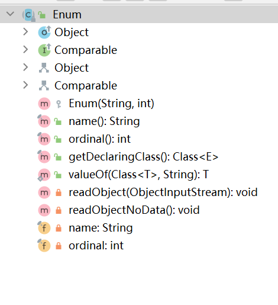

| 方法名                                              | 作用                                                         |
| --------------------------------------------------- | ------------------------------------------------------------ |
| static Enum valueOf(Class enumClass , String name ) | 返回指定名字、给定类的枚举常量。                             |
| String toString( )                                  | 返回枚举常量名                                               |
| int ordinal ()                                      | 返回枚举常量在 enum 声明中的位置，位置从 0 开始计数。        |
| int compareTo( E other )                            | 如果枚举常量出现在 Other 之前，则返回一个负值；如果 this=other，则返回 0; 否则，返回正值。枚举常量的出现次序在 enum 声明中给出。 |


### 3.7 反射

**反射库（ reflection library)** 提供了一个非常丰富且精心设计的工具集，以便编写能够动态操纵 Java 代码的程序。

> 能够分析类能力的程序称为反射（ reflective)

先说说它的作用把

+ 在运行时分析类的能力
+ 在运行时查看对象，例如编写一个toString方法供所有类使用
+ 实现通用的数组的操作代码
+ 利用Method对象。

如果你想构造工具这一节的内容非常有用，几乎所有的java工具、框架都是用到了反射实现的

#### 3.7.1 Class类

##### 三种获得Class对象的方法

​	Java 运行时系统始终为所有的对象维护一个被称为运行时的类型标识。这个信息跟踪着每个对象所属的类。这个信息（对象）所属的类是Class。每个对象的都有自己的Class类，属于同一个类的对象都会被同一个Class对象维护信息。Object 类中的 **getClass( )** 方法将会返回一个 Class 类型的实例。

```java
Employee e;
Class cl = e.getClass();
```

最常用的 Class 方法是 getName。 这个方法将返回类的名字。

利用Class静态方法来获得对应的Class对象

```java
String className = "java.util.Random";
Class cl = Class.forName(className) ;
```

className 只能是类名或者是接口名才能使用这个方法，否则会抛出异常checkedException(受检异常)

> **Class.forName的好处**。

当main方法被执行的时候，他会加载它所需要的类，这些类也就去加载他们所需要的类，对于一个大型程序来说可能需要很长的时间才能启动起来。我们可以利用Class.forName去手动的加载那些类，不显示的使用一些类，当我们需要的时候采取手动加载这些类。（一般需要多态去配合）

第三种获得Class对象的方法 **T.class** T是任意的java类型（不光是java类）或者void关键字。

```java
Class cl1 = Random.class;
Class cl2 = int.class;   //任意的java类型包括基本类型
Class cl3 = Double[].cl ass;
```

##### newlnstance 方法

返回描述类名为 className 的 Class 对象。将 forName 与 newlnstance 配合起来使用，可以根据存储在字符串中的类名创建一个对象

```java
String s = "java.util.Random";
Object m = Class.forName(s).newlnstance();
```

如果需要调用特定的带参数构造器去创建对象就需要 Constructor 类中的 newlnstance 方法。

> java.Iang.reflect.Constructor 1.1

Object newlnstance(Object[] args)
构造一个这个构造器所属类的新实例。
参数：args 这是提供给构造器的参数。有关如何提供参数的详细情况请参看 5.7.6
节的论述。

> java.Iang.Throwable 1.0

void printStackTrace()
将 Throwable 对象和栈的轨迹输出到标准错误流。

#### 3.7.2 利用反射分析类的能力

>  java. lang.Class 1.0

| 方法名                                                       | 说明                                                         |
| ------------------------------------------------------------ | ------------------------------------------------------------ |
| Field[] getFields()                                                                                                                      <br />Filed[] getDeclaredFields() | getFields 方法将返回一个包含 Field 对象的数组，这些对象记录了这个类或其超类的**公有域**。getDeclaredField 方法也将返回包含 Field 对象的数组，这些对象记录了这个类的**全部域**。 如果类中没有域，或者 Class 对象描述的是基本类型或数组类型，这些方法将返回一个长度为 0 的数组。 |
| Method[]  getMethods()                                                                                  Method[] getDeclareMethods() | 返回包含 Method 对象的数组：getMethods 将返回所有的公有方法，<br/>包括从超类继承来的公有方法；getDeclaredMethods 返回这个类或接口的全部方法，但不包括由超类继承了的方法。 |
| Constructor[] getConstructors()  Constructor [] getDeclaredConstructors() | 返回包含 Constructor 对象的数组，其中包含了 Class 对象所描述的类的所有公有构造器（getConstructors ) 或所有构造器（getDeclaredConstructors)。 |


>  java.lang.reflect    -Field - Method - Constructor 

| 方法                                                         | 说明                                                         |
| ------------------------------------------------------------ | ------------------------------------------------------------ |
| Class getDeclaringClass( )                                   | 返冋一个用于描述类中定义的构造器、方法或域的 Class 对象      |
| Class[] getExceptionTypes ( ) ( 在 Constructor 和 Method 类 中） | 返回一个用于描述方法抛出的异常类型的 Class 对象数组。        |
| int getModifiers( )                                          | 返回一个用于描述构造器、方法或域的修饰符的整型数值。使用 Modifier 类中的这个方法可以分析这个返回值。 |
| String getName( )                                            | 返冋一个用于描述构造器、方法或域名的字符串。                 |
| Class[] getParameterTypes( ) ( 在 Constructor 和 Method 类 中） | 返回一个用于描述参数类型的 Class 对象数组。                  |
| Class getReturnType( ) ( 在 Method 类 中）                   | 返回一个用于描述返H类型的 Class 对象。                       |

> java.lang.reflect.Modifier 1.1


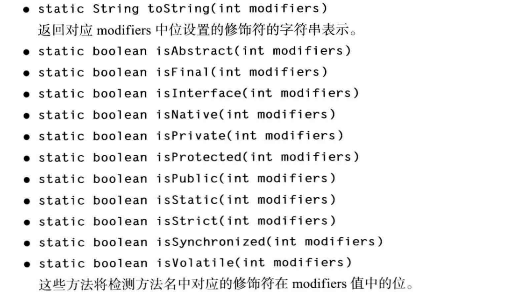

#### 3.7.3 在运行时利用反射进行分析


#### 3.7.4 使用泛型编写泛型数组


#### 3.7.5 调用任意方法

| 设计技巧                                                     |
| ------------------------------------------------------------ |
| 将公共操作和域放在超类                                       |
| 不要使用受保护的域                                           |
| 使用继承实现“ is - a” 关系  （要在逻辑上通）                 |
| 除非所有继承的方法都有意义，否则不要使用继承                 |
| 在覆盖方法时，不要改变预期的行为                             |
| 使用多态，而非类型信息                                       |
| 不要过多地使用反射（在编写应用程序的时候，尽量减少使用因为很难发现错误） |


### 3.8 继承的设计技巧

## 第四章 接口、lambda表达式和内部类

### 4.1接口

> 接口不是类，而是对类的一组需求描述

实现接口的类，必须按照接口的规定来实现方法。

举一个具体操作的例子吧

​	Arrays 类中的 sort 方法承诺可以对对象数组进行排序，但要求满足下列前提： 对象所属的类必须实现了 Comparable 接口。

```java
public interface Comparable<T> 
{
     /**
     * Compares this object with the specified object for order.  Returns a
     * negative integer, zero, or a positive integer as this object is less
     * than, equal to, or greater than the specified object.*/								 public int compareTo(T o);
    
}
```

```java
/**
 * Sorts the specified array of objects into ascending order, according
 * to the {@linkplain Comparable natural ordering} of its elements.
 * All elements in the array must implement the {@link Comparable}
 * interface.
 * @param a the array to be sorted
 * @throws ClassCastException if the array contains elements that are not
 *         <i>mutually comparable</i> (for example, strings and integers)
 * @throws IllegalArgumentException (optional) if the natural
 *         ordering of the array elements is found to violate the
 *         {@link Comparable} contract */
  public static void sort(Object[] a) {
     if (LegacyMergeSort.userRequested)
         legacyMergeSort(a);
      else
         ComparableTimSort.sort(a, 0, a.length, null, 0, 0);
   }
 
```

a的类型必须是实现Comparable 接口，才能利用此方法进行排序。

还有一点需要注意的是：实现public int compareTo(T o); 利用加减乘除等运算符返回值的时候，注意四舍五入、数值溢出导致出现含义的偏差

**接口特性**

+ 不能利用new运算符实例化一个接口

+ 声明接口变量

+ 可以instanceof检查某个对象是否实现了某个接口

+ 接口也可以在某些接口的基础上进行扩展

+ 接口中不能包含实例域或静态方法，但却可以包含常量。

  + 接口中的域将被自动设为 public static final

  ```java
  public interface Powered extends Moveable
  {
      double milesPerCallon();
      double SPEED_LIHIT = 95; // a public static final constant
      
  }
  
  ```

+ 接口中的方法都自动地被设置为 public  （和上面的一条差不多）

**接口和抽象类**

有了抽象类为什么还要有接口，每个类只能扩展一个抽象类而接口就不同他就可以扩展很多也不受限制。

java为什么没有多重继承呢？其主要原因是多继承会让语言本身变得非常复杂（如同 C++)，效率也会降低 （如同 Eiffel)。

**静态方法**

java8 允许在接口增加静态方法。

通常把静态方法放到伴随类中，在标准库里面 。比如：Collection/Collections 或 Path/Paths。 

**默认方法（作用）**

可以为接口增加一个默认方法 **default** 关键字进行修饰，以前可不允许写方法，java8后可以写静态方法和defalut修饰的方法。

```java
public interface Comparable<T>
{
	default int compareTo(T other) { return 0; }
	// B y default, all elements are the same
}
```

在以上场景写的那个compareTo方法是没什么用，因为就会被覆盖，上面只是演示怎么使用。来我们看一下以下场景。


```java
public interface MouseListener
{
    void mousedieked(MouseEvent event);
    void mousePressed(MouseEvent event);
    void mouseReleased(MouseEvent event);
    void mouseEntered(MouseEvent event);
    void mouseExited(MouseEvent event);
}
```

 ```java
public interface MouseListener
{
    default void mousedieked(MouseEvent event) {}
    default void mousePressed(MouseEvent event) {}
    default void mouseReleased(MouseEvent event) {}
    default void mouseEntered(MouseEvent event) {}
    default void mouseExited(MouseEvent event) {}
}
 ```

大多数情况下有些类只需要实现MouseListener接口里面一两个方法即可。如果用了default关键字就可以不用把每个放方法进行覆盖。这样一来程序员只关心那一两个方法怎么实现。


假设为Collection定义一个这样的便利方法，这样实现Collection的程序员就不必操心实现isEmpty方法了

```java
public interface Collection
{
    int size(); // An abstract method
    default boolean isEmptyO
    {
    	return size() = 0;
    }
}
```


如果你喜欢翻看源码你就会发现经常有这样的组合，一个接口和一个抽象的伴随类。这个伴随类实现相应的部分或者所有的方法。Collection/AbstractCollection 或 MouseListener/MouseAdapter   java8后，现在我们直接可以把通用方法的实现都合并到接口中。

上面都是在设计的时候增加了方便，现在我们说一下默认方法在维护中的好处

public class Bag implements Collection  我们定义一个类实现了Collection  ，假设Collection  在新的JDK中增加了一个方法，那么我们这个Bag原有的代码 在新的JDK就不会同编译。增加默认就不一样了，不必去实现。

**解决默认方法冲突**

|                                                              |
| ------------------------------------------------------------ |
| 1 ) 超类优先。如果超类提供了一个具体方法，同名而且有相同参数类型的默认方法会被忽略。（类优先） |
| 2）接口冲突。 如果一个超接口提供了一个默认方法，另一个接口提供了一个同名而且参数类型 （不论是否是默认参数） 相同的方法，必须覆盖这个方法来解决冲突。 |

> 千万不要让一个默认方法重新定义 Object 类中的某个方法,这样的重新定义毫无意义，因为是类优先规则

### 4.2 接口示例

**接口与回调**

回调（ callback) 是一种常见的程序设计模式。在这种模式中，可以指出某个特定事件发生时应该采取的动作。 

*参考观察者模式*

**Comparator 接口**（比较器）

与Comparable接口做好区分

**对象克隆**

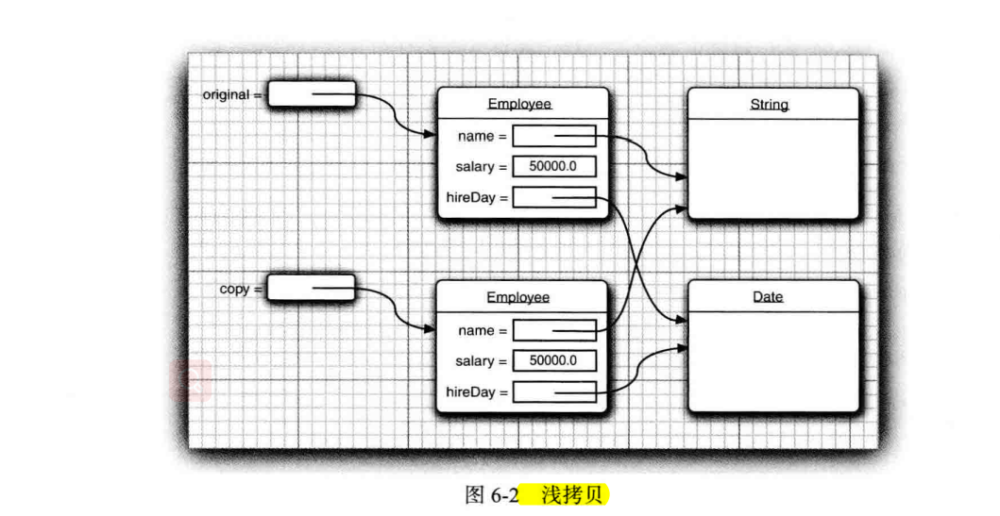

浅拷贝会引发安全问题 name是String类型，不可变类。是安全的。但是hireDay是可变的。假设copy里面的变了，original里面的必然会变。因为这个实例域本身引用的是一个。

> 如果类的数据域是基本类型或者不可变类，那么这个浅拷贝就是安全的。如果引用到了可变类那么就小心了。


>  Object 类中 clone 方法声明为 protected , 子类必须重写修饰符改为public才能使用

这说明设计者限制了这一方法的使用，除非你真的可以自己实现。重写这个方法的类还得必须实现clone接口（并没有任何方法，只是一个标志接口），若不实现调用clone方法就会抛出一个受检异常（CloneNotSupportedException）。

 所有数组类型都有一个 public 的 clone 方法，而不是 protected : 可以用这个方法建立一个新数组
，包含原数组所有元素的副本。例如:

```java
int[] luckyNumbers = { 2, 3, 5, 7, 11, 13 };
int[] cloned = luckyNumbers . doneO;
cloned[5] = 12; // doesn' t change luckyNumbers[5]
```

非基本类型呢？？？？？？？？？？？？？


### 4.3 lambda表达式

**最令人激动的变化** 

> lambda 表达式是一个可传递的代码块，可以在以后执行一次或多次。

**为什么引入 lambda 表达式**

```java
class Worker implements ActionListener
{
    public void actionPerformed(ActionEvent event)
    {
    // do some work
    }
}
```

像反复执行上面的代码，就把work对象提交到Timer 对象中，然后反复调用

```java
class LengthComparator implements Comparator<String>
{
    public int compare(String first, String second)
    {
   	 return first .length() - second.length();
    }
}
```

想利用上面的比较器（比较规则）传入到比较方法中，对String对象进行排序。

上面两个例子，都有一个共同的特点，把一段代码传入到了某个方法中，这段代码将会在未来某个时间段进行执行。是否向其他语言一样直接传入一段代码（函数式编程）而不是去实例化一个对象再去传入。

**lambda表达式的语法**

```java
(String first, String second)-> first.length() - second.length()
```

上面就是一个λ表达式，把上面**LengthComparator**的写的λ表达式。 单个表达式编译器可以知道怎么返回值，多语句就必须显示的返回值(return)。

```java
(String first, String second) ->
{
    {
        if (first . length() < second .length()) return -1;
        else if (first.length() > second.length()) return 1;
        else return 0;
    }	
}
```


无参数方法同样也必须标明出括号

```java
() -> { for (int i= 100;i>= 0;i-- ) System.out.println(i); }
```


如果我们可以推到出参数类型，就可以省略其写出参数类型

```java
Comparator<String> comp
    = (first, second) // Same as (String first, String second)
    -> first.length() - second.length();

```

如果方法只有一个参数，而且可以推导出，就可以省略出小括号

```java
ActionListener listener = event ->
System.out.println("The time is " + new Date()");
```


**函数式接口**

*对于只有一个抽象方法的接口（可以有default方法，静态方法），需要这种接口的对象时，就可以提供一个 lambda 表达式。这 种 接 口 称 为 函 数 式 接 口 （ functional interface )。*

上面的实现ActionListener和Comparator接口就属于这种函数式接口。


根据上卖弄的说明我们来写出一个例子。

```java
Arrays.sort (words,
(first, second) -> first.length() - second.length()) ;
```


介绍一个很有用的接口

```java
// Represents a predicate (boolean-valued function) of one argument.
@FunctionalInterface
public interface Predicate<T> {

    /**
     * Evaluates this predicate on the given argument.
     *
     * @param t the input argument
     * @return {@code true} if the input argument matches the predicate,
     * otherwise {@code false}
     */
    boolean test(T t);
```

检测一个参数，至于怎么检测就是需要自己实现了。


ArrayList 类有一个 removelf 方法，来移除符合规则的元素

```java
/**
 * Removes all of the elements of this collection that satisfy the given
 * predicate.  Errors or runtime exceptions thrown during iteration or by
 * the predicate are relayed to the caller.*/
@Override
public boolean removeIf(Predicate<? super E> filter) 
```


javaAPI同样提供了许多非常通用的函数式接口，比如`BiFunction`   

描述了参数类型为 T 和 U 而且返回类型为 R 的函数

```java
@FunctionalInterface
public interface BiFunction<T, U, R> {

    /**
     * Applies this function to the given arguments.
     *
     * @param t the first function argument
     * @param u the second function argument
     * @return the function result
     */
    R apply(T t, U u);
    .....
}
```

**方法引用**

就是一种lambda表的式的简略写法。

```java
Timer t = new Timer(1000, event - > System.out.println(event));
```

```java
Timer t = new Timer(1000, Systei.out::println);
```

上面两种写法是等价的。表达式 System.out::println 是一个方法引用（ method reference), 它等价于 lambda 表达式x 一> System.out.println(x)


```java
Arrays.sort(strings，String::conpareToIgnoreCase)
```

上面的String::compareToIgnoreCase 等同于 (x, y) - > x.compareToIgnoreCase(y) ;

方法引用支持三种情况，

+ object::instanceMethod

+ Class::staticMethod

+ Class::instanceMethod

  同样也支持super::instanceMethod ；this::instanceMethod 

  


**构造器应用**


<font color="red">**变量作用域**</font>


```java
public static void repeatMessage(String text , int delay)
{
    ActionListener listener = event ->
    {
        System.out.println(text):
        Toolkit.getDefaultToolkit().beep();
    };
    new Timer(delay, listener).start();
}
```


lambda表达式有三个部分 1.代码块 2.参数 3.自由的变量值，这里指非参数而且不是在代码中定义的变量。

上面的text参数就是自由的变量的值，当repeatMessage方法执行完后，text变量值不存在了lambda表达式代码块中可能还未执行。这种情况下lambda表达式里面的text怎么使用？

其实lambda 表达式捕获了text变量，也就是，lambda 表达式可以捕获外围作用域中变量的值。但是是有限制的，在 lambda 表达式中，只能引用值不会改变的变量（对于基本类型变量就是数值，对于引用变量就是引用值不能改变，指向的对象不能改变。），当然引用的对象本身可以发生改变的。

```java
public static void countDown(int start, int delay)
{
    ActionListener listener = event ->
    {
        start-- ; // Error: Can't mutate captured variable
        System.out .println(start);
    }；
    new Timer(delay, listener),start();
}
```

```java
public static void repeat(String text, int count)
{
    for (int i = 1; i <= count; i++)
    {
         ActionListener listener = event - >
        {
          System.out.println(i + ": " + text);
          // Error: Cannot refer to changing i
        }；
        new Timer(1000, listener).start();
    }
}
```

*上面两种情况都是不被允许的。*


```java
public class ApplicationO
{
    public void init()
    {
    	ActionListener listener= event - >
        {
            System.out.println(this.toString());
        }
    }
}
```


在lambda代码块里面可以引用当前对象变量this，没有什么特殊之处，this的含义和在代码块之外的方法里面使用一样。

还有一点是*lambda 表达式的体与嵌套块有相同的作用域。*

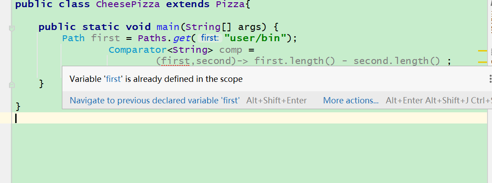


**处理Lambda表达式**

> *使用lambda表达式的重点是延迟执行（deferred excecution）*

下面几种情况

+ 在一个单独的线程中运行代码
+ 多次运行代码
+ 在算法适当的位置运行代码（例如：排序中的比较动作）
+ 发生某种情况时执行代码（例如：点击一个按钮）
+ 只在必要时才运行代码


```java
public static void repeat(int n, Runnable action)
{
	for (int i= 0; i< n; i++) action. run();
}

repeat(10, () - > System.out.println("Hello, World!"));
```

多次运行的代码例子，利用runable接口的例子。

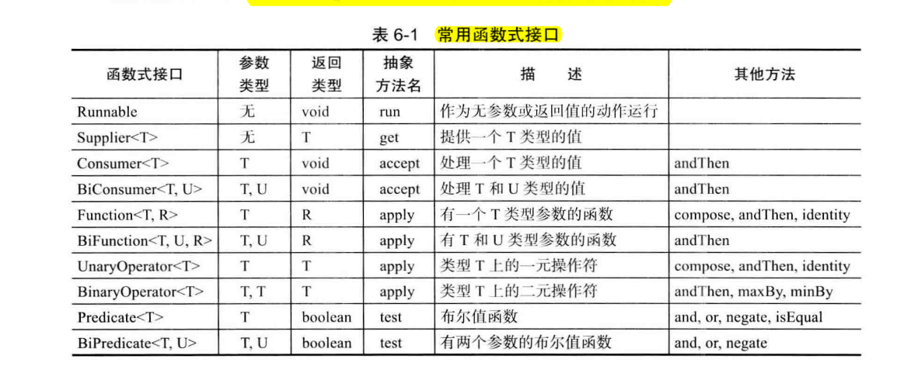

我们现在想增强一下上面的repeat方法，每次都能打印出还剩几次迭代。很明显runable接口并不适合了。现在我们来使用Consumer<T> 接口来实现。

```java
public static void repeat(int n, IntConsumer action)
{
	for (int i= 0; i< n; i++) action.accept(i);
}
repeat(10, i-> System.out.println("Countdown: " + (9 - i));
```

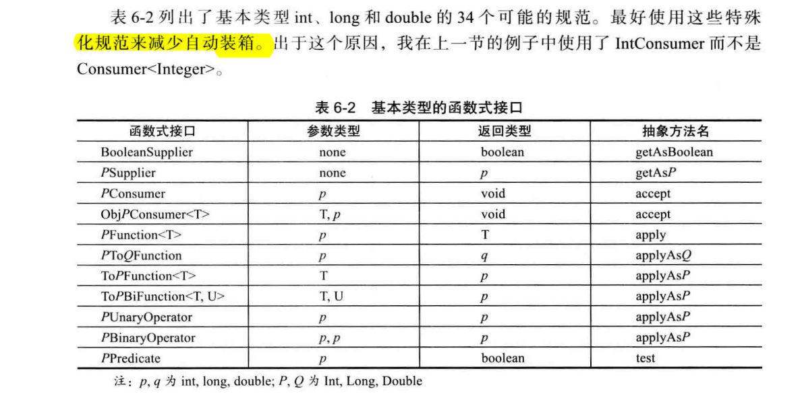

也可以自己定义一个函数接口，最好使用 @FunctionalInterface 关键字，当然也不强求.@FunctionalInterface的作用是 如果你无意中增加了另一个抽象方法， 编译器会产生一个错误消息。 另外 javadoc 页里会指出你的接口是一个函数式接口。

**再谈 Comparator**

Comparator有很多的静态方法需要我们去了解

​	静态 comparing 方法取一个“ 键提取器” 函数。它将类型 T 映射为一个可比较的类型( 如 String )。 对要比较的对象应用这个函数，然后对返回的键完成比较。

```java 
Arrays.sort(people, Comparator.comparing(Person::getName));
```


返回一个比较器，这个比较器是用对象的key（实现comparable接口）来做比较的

```java
 /**
     * Accepts a function that extracts a {@link java.lang.Comparable
     * Comparable} sort key from a type {@code T}, and returns a {@code
     * Comparator<T>} that compares by that sort key.
 */
public static <T, U extends Comparable<? super U>> Comparator<T> comparing(
        Function<? super T, ? extends U> keyExtractor)
{
    Objects.requireNonNull(keyExtractor);
    return (Comparator<T> & Serializable)
        (c1, c2) -> keyExtractor.apply(c1).compareTo(keyExtractor.apply(c2));
    //这里的c1和c2是T类型的, keyExtractor.apply(c1)返回的是类型必须实现Comparable接口
    //在上面的例子中可以发现 T就是Person类 U就是String
}
```
```java
@FunctionalInterface
public interface Function<T, R> {

    /**
     * Applies this function to the given argument.
     *
     * @param t the function argument
     * @return the function result
     */
    R apply(T t);
 }

```
比较绕，好好体会。但是我们一般知道这个方法有什么作用就好。

 *thenComparing 方法*

```java
Arrays.sort(people,Comparator.comparing(Person::getlastName)
.thenComparing(Person::getFirstName));；

```

```java
default Comparator<T> thenComparing(Comparator<? super T> other) {
    Objects.requireNonNull(other);
    return (Comparator<T> & Serializable) (c1, c2) -> {
        int res = compare(c1, c2);
        return (res != 0) ? res : other.compare(c1, c2);
    };
}
```

另外， comparing 和 thenComparing 方法都有变体形式，可以避免 int、 long 或 double 值的装箱。

### 4.4 内部类（静态内部类 普通内部类 匿名内部类）


> **内部类（ inner class) 是定义在另一个类中的类。**

存在的原因如下：

+ 内部类方法可以访问该类定义所在的作用域中的数据，包括私有的数据。
+ 内部类可以对同一个包中的其他类隐藏起来。
+ 当想要定义一个回调函数且不想编写大量代码时，使用匿名 （anonymous) 内部类比较便捷。（lambda表达式存在之前）


**使用内部类访问对象状态**

```java

public class TalkingClock
{
    private int interval:
    private boolean beep;
    public TalkingClock(int interval, boolean beep) { . . . }
    public void start()
    {
       ActionListener listener = new TimePrinterO
		Timer t = new Timer(interval, listener);
		t.start(); 
    }
    public class TimePrinter implements ActionListener
    // an inner class
    {
        System.out.println("At the tone, the time is " + new Date() )；
		if (beep)Toolkit.getDefaultToolkit.beep()；		
    }
}
```

上面思考一个问题，`TimePrinter`没有相应beep实例域，它是访问的TalkingClock的实例域？？？？？

如果他访问的是TalkingClock的实例域，那么在TimePrinter实例化之前就必须要有一个TalkingClock实例？


注意，这里的 TimePrinter 类位于 TalkingClock 类内部。**这并不意味着每个 TalkingClock都有一个 TimePrinter 实例域** ， 如前面所示，TimePrinter 对象是由 TalkingClock 类的**方法**（非静态方法）构造。也就说这个内部类的实例必须依靠一个外部类的实例来实例化的。

```java
public void actionPerformed(ActionEvent event)
{
    System.out.println("At the tone , the time is " + new Date());
    if (outer.beep)Toolkit.getDefaultToolkit().beep();
}
```


那么他是怎么访问的外部类的？我们这里可以思考一下它是怎么实现的。

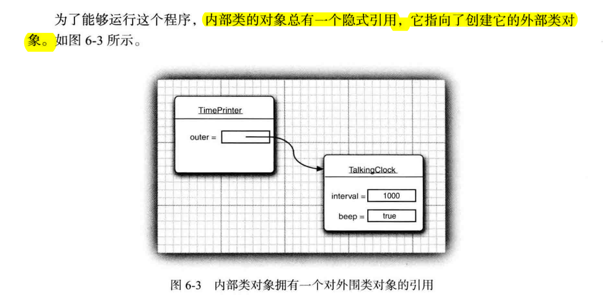


外围类的引用在构造器中设置。编译器修改了所有的内部类的构造器，添加一个外围类引用的参数。

```java
public TimePrinter(TalkingGock clock) // automatically generated code
{
	outer = clock;
}
```

外围类的方法创建内部类实例的时候也把this（当前实例）传入进去。也就是当在 start 方法中创建了 TimePrinter 对象后，编译器就会将 this 引用传递给当前的语音时钟的构造器：

```java
ActionListener listener = new TimePrinter(this); // parameter automatically added
```


不光能利用外部类的方法构造内部类的实例，也可以用下面的方法也可以用上面的方法声明内部类实例

```java

TalkingClock jabberer = new Ta1kingClock(1000, true);
TalkingOock . TiiePrinter listener = jabberer .new TimePrinterO；
```


**内部类的特殊语法规则**


### 4.4 代理


## **第五章 异 常 、 断 言 和 曰 志**


## 第六章 泛型程序设计

## 第七章 集合

### 第八章 并发基础使用

