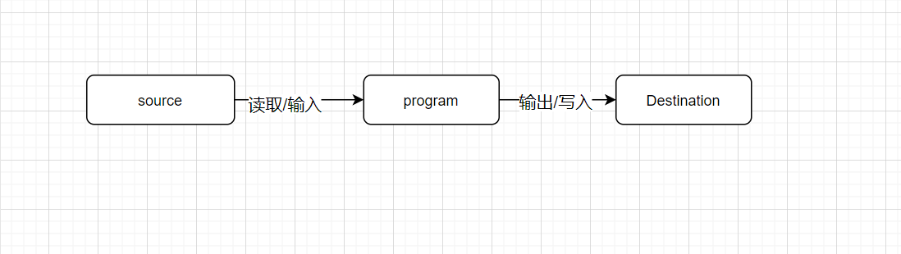
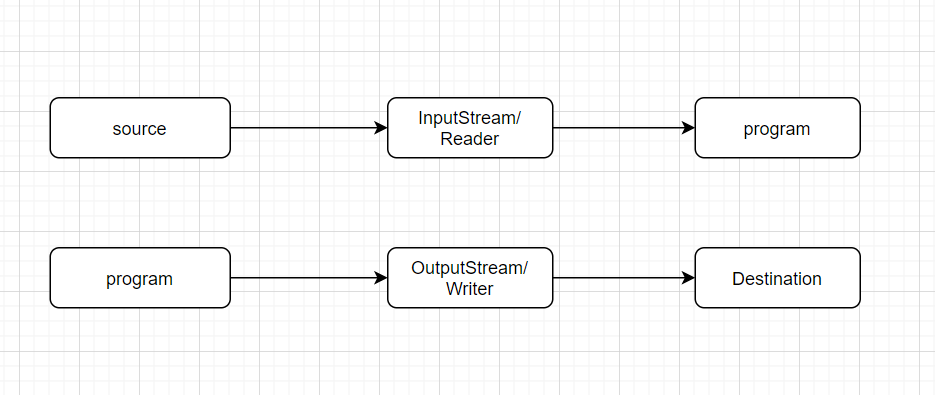
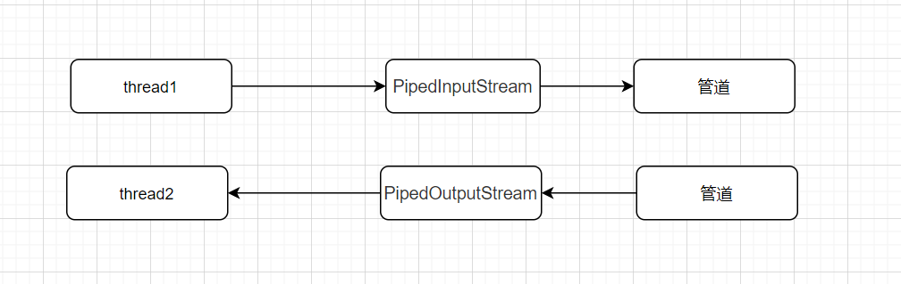
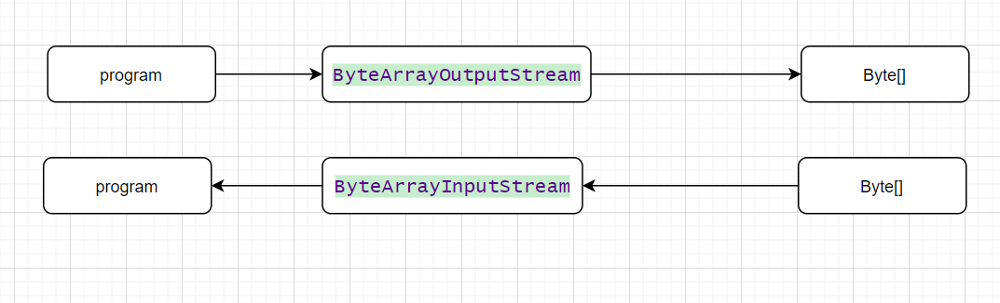

# 第1章 java se8流库

> 集合优化了对象的存储，而流和对象的处理有关。

​	流是什么？实际上java8的流可以想象为把容器里面的元素以流形式呈现方便处理（流管道），这个流类似与IO流的流，我们想处理容器中的元素通过流去指定操作即可。我们先看一下简单例子

```java
import java.util.Random;

public class Randoms {

    public static void main(String[] args) {
         new Random(47)
         .ints(5, 20)
         .distinct()
         .limit(7)
         .sorted()
         .forEach(System.out::println);
         }
}
```

​	上面是一个通过流去操作容器中的每个元素的小例子，上面的例子：假如你要随机展示 5 至 20 之间不重复的整数并进行排序。 看上面的程序可以从明了的看出代码的功能。  流的操作和方法引用结合起来使用更佳。

流的特点

1.流并不存储其元素。这些元素可能存储在底层集合中，或者是按需生成的

2.流的操作不会修改其数据源。例如，filter方法不会从流中移除元素，而是生成一个新的流。

3.流的操作是尽可能惰性执行的。例如查找5个长单词。filter方法在匹配到第5个单词后就停止过滤。


## 1.1 流支持

​	java8加入了流的支持，是通过什么怎么样加入的，怎么做到兼容之前代码的版本的呢？

​		比如在 Random 中添加更多的方法。只要不改变原有的方法，现有代码就不会受到干扰。接口部分怎么改造呢？采用了java8的新特性利用default默认方法进行对接口的改造。这样就很容易兼容以前的代码的执行。

​	

```java
long count = worlds.Stream()
    .filter(w->w.length()>12)
    .count();
```

​		流的方法的操作很全面，预制的操作基本满足我们工作中的所有要求。流的操作类型有三种：

+ 创建流-------------1.2

+ 修改流元素（中间操作，Intermediate Operations），-----------   1.3~1.5   <font color ="red">流的流动</font>

+ 消费流元素（终端操作，Terminal Operations）。最后一种类型通常意味着收集流元素（通常是到集合中）。下面一一讲解这些操作的含义。(count() 终止了谁？ worlds.Stream()这个流还是worlds.Stream()
      .filter(w->w.length()>12)这个新生成的流？后者？） 1.6


## 1.2流创建

流创建的API


**Stream.of**

`Stream.of("1","2","3")` 产生给定元素值的流

```java
//Stream.of("1","2","3")

/**
 * Returns a sequential ordered stream whose elements are the specified values.
 *
 * @param <T> the type of stream elements
 * @param values the elements of the new stream
 * @return the new stream
 */
@SafeVarargs
@SuppressWarnings("varargs") // Creating a stream from an array is safe
public static<T> Stream<T> of(T... values) {
    return Arrays.stream(values);
}


```


 **Arrays.stream();**

```java
/**
 * Returns a sequential {@link Stream} with the specified array as its
 * source.
 *
 * @param <T> The type of the array elements
 * @param array The array, assumed to be unmodified during use
 * @return a {@code Stream} for the array
 * @since 1.8
 */
 public static <T> Stream<T> stream(T[] array) {
     return stream(array, 0, array.length);
 }

/** 
* Returns a sequential {@link Stream} with the specified range of the
* specified array as its source.
*
* @param <T> the type of the array elements
* @param array the array, assumed to be unmodified during use
* @param startInclusive the first index to cover, inclusive
* @param endExclusive index immediately past the last index to cover
* @return a {@code Stream} for the array range
* @throws ArrayIndexOutOfBoundsException if {@code startInclusive} is
*         negative, {@code endExclusive} is less than
*         {@code startInclusive}, or {@code endExclusive} is greater than
*         the array size
* @since 1.8     [startInclusive,endExclusive) 范围
*/
public static <T> Stream<T> stream(T[] array, int startInclusive, int endExclusive) {
    return StreamSupport.stream(spliterator(array, startInclusive, endExclusive), false);
}
```


**Stream.generate(Supplier<T> s**)

```java
/**
 * Returns an infinite sequential unordered stream where each element is
 * generated by the provided {@code Supplier}.  This is suitable for
 * generating constant streams, streams of random elements, etc.
 *
 * @param <T> the type of stream elements
 * @param s the {@code Supplier} of generated elements
 * @return a new infinite sequential unordered {@code Stream}
 */
public static<T> Stream<T> generate(Supplier<T> s) {
    Objects.requireNonNull(s);
    return StreamSupport.stream(
            new StreamSpliterators.InfiniteSupplyingSpliterator.OfRef<>(Long.MAX_VALUE, s), false);
}
```

这个流的值是反复调用s函数而构建的

```java
/**
 * Represents a supplier of results.
 *
 * <p>There is no requirement that a new or distinct result be returned each
 * time the supplier is invoked.
 *
 * <p>This is a <a href="package-summary.html">functional interface</a>
 * whose functional method is {@link #get()}.
 *
 * @param <T> the type of results supplied by this supplier
 *
 * @since 1.8
 */

@FunctionalInterface
public interface Supplier<T> {

    /**
     * Gets a result.
     *
     * @return a result
     */
    T get();
}
```

## 1.3 从流中产生流


filter、map和flatMap都是流的方法，当然他们的流返回的也是流，这就从他们本身产生新的流。

流的转化会产生一个新的流，它的元素派生自另一个流中的元素。


**Stream<T> filter(Predicate<? super T> predicate);**

```java
 List<String> worldList= Arrays.asList("ab","cd","abcqwqwdefghigklmnopqrst");
 Stream<String> longwords=worldList.stream()
 	.filter(w->w.length()>12);
 longwords.forEach(System.out::println);
```

结果

```text
abcqwqwdefghigklmnopqrst
```

​		上面的代码就是从worldList.Stream()流里面产生新的流，新的流中的元素都是符合filter规则的。filter的函数接口就是Predicate。

```java
/**
 * Returns a stream consisting of the elements of this stream that match
 * the given predicate.
 *
 * <p>This is an <a href="package-summary.html#StreamOps">intermediate
 * operation</a>.
 *
 * @param predicate a <a href="package-summary.html#NonInterference">non-interfering</a>,
 *                  <a href="package-summary.html#Statelessness">stateless</a>
 *                  predicate to apply to each element to determine if it
 *                  should be included
 * @return the new stream
 */
Stream<T> filter(Predicate<? super T> predicate);
```


```java
@FunctionalInterface
public interface Predicate<T> {

    /**
     * Evaluates this predicate on the given argument.
     *
     * @param t the input argument
     * @return {@code true} if the input argument matches the predicate,
     * otherwise {@code false}
     */
    boolean test(T t);
```


**<R> Stream<R> map(Function<? super T, ? extends R> mapper);**

map方法的函数接口就是Function，生成一个新的流，这个新的流都是在原来的基础流上进行function处理生成的流。

看例子：

```java
List<String> worldList= Arrays.asList("AB","CD","EFG");
        worldList.stream().map(String::toLowerCase).forEach(System.out::println);
```

结果：

```text
ab
cd
efg
```


```java
/**
 * Returns a stream consisting of the results of applying the given
 * function to the elements of this stream.
 *
 * <p>This is an <a href="package-summary.html#StreamOps">intermediate
 * operation</a>.
 *
 * @param <R> The element type of the new stream
 * @param mapper a <a href="package-summary.html#NonInterference">non-interfering</a>,
 *               <a href="package-summary.html#Statelessness">stateless</a>
 *               function to apply to each element
 * @return the new stream
 */
<R> Stream<R> map(Function<? super T, ? extends R> mapper);
```


**<R> Stream<R> flatMap();**

待补充。


## 1.4 抽取自流和连接流

API


不解释

## 1.5 其他流的转换


## 1.6  Optional 类

​		在正式的学习流终端之前，咱们先来熟悉一个这个类方便理解终端操作里面的内容。（Optional, 一些终端操作的返回类型）.

​	 Optional<T>是一种包装类型，把T类型进行了包装，我们程序对T操作的更加安全，不用减少我们写一些为了安全但是与红能无关的代码。当T为null时它会有更好的表达。

```java
/**
 * A container object which may or may not contain a non-null value.
 * If a value is present, {@code isPresent()} will return {@code true} and
 * {@code get()} will return the value. */
 public final class Optional<T> {
     /**
     * Common instance for {@code empty()}.
     */
    private static final Optional<?> EMPTY = new Optional<>();

    /**
     * If non-null, the value; if null, indicates no value is present
     */
    private final T value;
     
 }
```

Optional中对T的引用是final类型的，也就意味着一旦引用，无法更换引用。而且这个类型还有静态的Optional对象。


**构造相关的API**


### of

**Optional<T> of(T value)**

```java

/**
 * Constructs an instance with the value present.
 *
 * @param value the non-null value to be present
 * @throws NullPointerException if value is null
 */
private Optional(T value) {
    this.value = Objects.requireNonNull(value);
}
/**
 * Returns an {@code Optional} with the specified present non-null value.
 *
 * @param <T> the class of the value
 * @param value the value to be present, which must be non-null
 * @return an {@code Optional} with the value present
 * @throws NullPointerException if value is null
 */
public static <T> Optional<T> of(T value) {
    return new Optional<>(value);
}
```


生成一个Option<T>的对象，传入value 如果为空，就会报异常。


我们需要一个包装一个T类型引用为空的对象怎么办。这个自带了一个T引用为空的Option对象，将返回这个静态实例。

### empty

**public static<T> Optional<T> empty()**


```java
/**
 * Returns an empty {@code Optional} instance.  No value is present for this
 * Optional.
 *
 * @apiNote Though it may be tempting to do so, avoid testing if an object
 * is empty by comparing with {@code ==} against instances returned by
 * {@code Option.empty()}. There is no guarantee that it is a singleton.
 * Instead, use {@link #isPresent()}.
 *
 * @param <T> Type of the non-existent value
 * @return an empty {@code Optional}
 */
public static<T> Optional<T> empty() {
    @SuppressWarnings("unchecked")
    Optional<T> t = (Optional<T>) EMPTY;
    return t;
}
```

### ofNullable

**public static <T> Optional<T> ofNullable(T value)** 

可以传入value为空的生成Option实例的方法。如果value为空，返回的也是类的那个静态实例和上面那个方法一样。

```java
/**
 * Returns an {@code Optional} describing the specified value, if non-null,
 * otherwise returns an empty {@code Optional}.
 *
 * @param <T> the class of the value
 * @param value the possibly-null value to describe
 * @return an {@code Optional} with a present value if the specified value
 * is non-null, otherwise an empty {@code Optional}
 */
public static <T> Optional<T> ofNullable(T value) {
    return value == null ? empty() : of(value);
}
```


### orElse

**public T orElse(T other)**


```java
/**
 * Return the value if present, otherwise return {@code other}.
 *
 * @param other the value to be returned if there is no value present, may
 * be null
 * @return the value, if present, otherwise {@code other}
 */
public T orElse(T other) {
    return value != null ? value : other;
}
```

看了源码功能就不言而喻了。如果这个Option不是value为空，就返回那个value，否则就返回other


### orElseGet

**public T orElseGet(Supplier<? extends T> other**）

如果值存在则直接返回，否则使用 Supplier 函数生成一个可替代对象。

```java
/**
 * Return the value if present, otherwise invoke {@code other} and return
 * the result of that invocation.
 *
 * @param other a {@code Supplier} whose result is returned if no value
 * is present
 * @return the value if present otherwise the result of {@code other.get()}
 * @throws NullPointerException if value is not present and {@code other} is
 * null
 */
public T orElseGet(Supplier<? extends T> other) {
    return value != null ? value : other.get();
}
```

```java
/**
 * Represents a supplier of results.
 *
 * <p>There is no requirement that a new or distinct result be returned each
 * time the supplier is invoked.
 *
 * <p>This is a <a href="package-summary.html">functional interface</a>
 * whose functional method is {@link #get()}.
 *
 * @param <T> the type of results supplied by this supplier
 *
 * @since 1.8
 */
@FunctionalInterface
public interface Supplier<T> {

    /**
     * Gets a result.
     *
     * @return a result
     */
    T get();
}
```

​	和上面的orElse差不多，上一次直接传入一个默认数据，现在传入的是一个函数接口Supplier对象直接调用这个对象，这个对象的get方法获得的数据作为默认数据。

Supplier的get方法每次调用，每次调用都会返回一个结果。每次调用的结果不需要返回一个新的或不同的结果，但是也可以这样。

---

### orElseThrow

 **orElseThrow(Supplier)**

​	如果值存在直接返回，否则使用 Supplier 函数生成一个异常。

```java
/**
 * Return the contained value, if present, otherwise throw an exception
 * to be created by the provided supplier.
 *
 * @apiNote A method reference to the exception constructor with an empty
 * argument list can be used as the supplier. For example,
 * {@code IllegalStateException::new}
 *
 * @param <X> Type of the exception to be thrown
 * @param exceptionSupplier The supplier which will return the exception to
 * be thrown
 * @return the present value
 * @throws X if there is no value present
 * @throws NullPointerException if no value is present and
 * {@code exceptionSupplier} is null
 */
public <X extends Throwable> T orElseThrow(Supplier<? extends X> exceptionSupplier) throws X {
    if (value != null) {
        return value;
    } else {
        throw exceptionSupplier.get();
    }
}
```

---

### ifPresent

**ifPresent(Consumer)**

当值存在时调用 Consumer，否则什么也不做。

```java
/**
 * If a value is present, invoke the specified consumer with the value,
 * otherwise do nothing.
 *
 * @param consumer block to be executed if a value is present
 * @throws NullPointerException if value is present and {@code consumer} is
 * null
 */
public void ifPresent(Consumer<? super T> consumer) {
    if (value != null)
        consumer.accept(value);
}
```

---

### get

**public T get()**

get()方法表示是Optional对象中获取值。

```java
/**
 * If a value is present in this {@code Optional}, returns the value,
 * otherwise throws {@code NoSuchElementException}.
 *
 * @return the non-null value held by this {@code Optional}
 * @throws NoSuchElementException if there is no value present
 *
 * @see Optional#isPresent()
 */
public T get() {
    if (value == null) {
        throw new NoSuchElementException("No value present");
    }
    return value;
}
```

获得被包装的值，如果为空就会抛出异常。

---

### filter

**public Optional<T> filter(Predicate<? super T> predicate)** 

接收一个函数式接口，当符合接口(Predicate)时，则返回一个Optional对象，否则返回一个空的Optional对象

```java
/**
 * If a value is present, and the value matches the given predicate,
 * return an {@code Optional} describing the value, otherwise return an
 * empty {@code Optional}.
 *
 * @param predicate a predicate to apply to the value, if present
 * @return an {@code Optional} describing the value of this {@code Optional}
 * if a value is present and the value matches the given predicate,
 * otherwise an empty {@code Optional}
 * @throws NullPointerException if the predicate is null
 */
public Optional<T> filter(Predicate<? super T> predicate) {
    Objects.requireNonNull(predicate);
    if (!isPresent())
        return this;
    else
        return predicate.test(value) ? this : empty();
}
```


### map

**public<U> Optional<U> map(Function<? super T, ? extends U> mapper)**

如果有值对其处理，并返回处理后的Optional，否则返回 Optional.empty()

```java
/**
 * If a value is present, apply the provided mapping function to it,
 * and if the result is non-null, return an {@code Optional} describing the
 * result.  Otherwise return an empty {@code Optional}.
 *
 * @apiNote This method supports post-processing on optional values, without
 * the need to explicitly check for a return status.  For example, the
 * following code traverses a stream of file names, selects one that has
 * not yet been processed, and then opens that file, returning an
 * {@code Optional<FileInputStream>}:
 *
 * <pre>{@code
 *     Optional<FileInputStream> fis =
 *         names.stream().filter(name -> !isProcessedYet(name))
 *                       .findFirst()
 *                       .map(name -> new FileInputStream(name));
 * }</pre>
 *
 * Here, {@code findFirst} returns an {@code Optional<String>}, and then
 * {@code map} returns an {@code Optional<FileInputStream>} for the desired
 * file if one exists.
 *
 * @param <U> The type of the result of the mapping function
 * @param mapper a mapping function to apply to the value, if present
 * @return an {@code Optional} describing the result of applying a mapping
 * function to the value of this {@code Optional}, if a value is present,
 * otherwise an empty {@code Optional}
 * @throws NullPointerException if the mapping function is null
 */
public<U> Optional<U> map(Function<? super T, ? extends U> mapper) {
    Objects.requireNonNull(mapper);
    if (!isPresent())
        return empty();
    else {
        return Optional.ofNullable(mapper.apply(value));
    }
}
```


### flatMap

public<U> Optional<U> flatMap(Function<? super T, Optional<U>> mapper)

```java
/**
 * If a value is present, apply the provided {@code Optional}-bearing
 * mapping function to it, return that result, otherwise return an empty
 * {@code Optional}.  This method is similar to {@link #map(Function)},
 * but the provided mapper is one whose result is already an {@code Optional},
 * and if invoked, {@code flatMap} does not wrap it with an additional
 * {@code Optional}.
 *
 * @param <U> The type parameter to the {@code Optional} returned by
 * @param mapper a mapping function to apply to the value, if present
 *           the mapping function
 * @return the result of applying an {@code Optional}-bearing mapping
 * function to the value of this {@code Optional}, if a value is present,
 * otherwise an empty {@code Optional}
 * @throws NullPointerException if the mapping function is null or returns
 * a null result
 */
public<U> Optional<U> flatMap(Function<? super T, Optional<U>> mapper) {
    Objects.requireNonNull(mapper);
    if (!isPresent())
        return empty();
    else {
        return Objects.requireNonNull(mapper.apply(value));
    }
}
```

与 map 类似，要求返回值必须是Optional。和上面的方法感觉一样。


## 1.7 终端操作

​	上面讲了创建流和轮换流，现在讲约简，也就是中断操作（terminal operation），具体的作用为：

他们将会流约简可以在程序中使用的非流值，然后流不在流动就会消失。

流的流动

```java
List<String> worldList= Arrays.asList("ab","cd","abcqwqwdefghigklmnopqrst");
Stream<String> base=worldList.stream();
Stream<String> longwords=base
        .filter(w->w.length()>12);
longwords.forEach(System.out::println);
base.forEach(System.out::println);//error  流已经从base流动到longwords流中
longwords.forEach(System.out::println);//error  longwords已经中断（使用完），不再能进行操作
```

上面的流从base中已经流到了longwords中所以在不能对base进行操作，流并没有消失只是流走了。

forEach已经把流使用完，所以流被截断，不在能使用。

> 中断操作将会获取流的最终结果。至此我们无法再继续往后传递流。可以说，终端操作总是我们在
> 流管道中所做的最后一件事。


参考Onjava8


# 第二章 java IO

## 2.1 java IO概述


### 2.1.1 输入和输出 – 数据源和目标媒介

我们先搞清一个重要的概念，输入/输出 、读/写。上面这两个属于是以谁的角度来说的。因为不同角度，实现的共嗯那个不同。我们在javaIO中。这两组组词都是以我们写的程序的角度述说的。程序运行在内存中，也就是以内存的角度述说的。（内存的角度不完全正确，思考System.in）

比如 输入/读 就是把内存外部的数据传输到内存中以供我们的程序进行调用，我们理解了这个就会更加容易理解java/io包里面各个类的功能。

java/io让我们程序将会有一个数据传输的功能。（当然我们的程序也可在传输的过程中对数据进行一定的处理）

这样的传输功能将会引出两个对象，一个是数据源一个是目标媒介。程序从数据源读取信息然后将信息然后将信息输出到目标媒介。（下图展示）





典型的数据源和目标媒介


| 数据源/目标媒介                                              |
| ------------------------------------------------------------ |
| 文件                                                         |
| 管道                                                         |
| 网络连接                                                     |
| 内存缓存                                                     |
| System.in, System.out, System.error(注：Java标准输入、输出、错误输出) //暂时没理解 |

### 2.1.2 流

​		从便于理解的角度可以把流想象位连续的数据流。一个流关联一个数据源/目标媒介。输入流就可以从流里面读取数据（读取数据源的数据到程序中）。输出流就可以往流里面写入数据（往里面写入数据就可以把数据写入到目标媒介中）。读取写入的单位不是按bit来操作的，而是根据流的不同，写入单位不同，可以是按照字节（字节流），也可以按照字符（字符流）。


### 2.1.3 类InputStream, OutputStream, Reader 和Writer

这些流更像一个工具，帮助program读取数据源的信息，把相关信息写出到目标媒介中。





### 2.1.4 Java IO的用途和特征

在IO包中，有许多许多InputStream、OutputStream、Reader、Writer的子类。更具不同的数据源和目的媒介使用不同的子类。


- 文件访问
- 网络访问
- 内存缓存访问
- 线程内部通信(管道)
- 缓冲
- 过滤
- 解析
- 读写文本 (Readers / Writers)
- 读写基本类型数据 (long, int etc.)
- 读写对象

### 2.1.5 Java IO类概述表


## 2.3  javaIO:文件

​		文件在编写程序的过程中经常被当作数据源或者是目标媒介，简短对它的操作进行概述

### 2.3.1 通过javaIO读取文件

​		根据文件的类别不同可以使用不同的流来进行读取，比如二进制文件使用FileInputStream流读取，文本文件用FileReader进行读取。读取的时候将会从头到尾一次顺序读取一个字节/字符，或者一次读多个字节/字符到数组里面。

​	若想要跳跃读取使用RandomAccessFile就可以实现。

### 2.3.2 通过javaIO写文件

​		根据文件的类别不同可以使用不同的流来进行写入，比如二进制文件使用FileOutputStream流读取，文本文件用FileWriter进行写入。写入的时候你可以写入一个字节/字符，或者通过数组一次写入多个字节/字符。

### 2.3.2通过javaIO随机存取文件

​		RandomAccessFile可以跳过文件的部分进行操作，并且支持同时读写，不要求特定的存取顺序。

### 2.3.4  文件和目录信息的获取

​		通过File类可以获取文件和目录的信息


## 2.2  javaIO:管道

​		java中管道为JVM下的不同进程提供了通信能力，管道同样可以作为数据源和目标媒介。通过PipedOutputStream和PipedInputStream可以创建管道并且关联上管道，进而来通过流来传输不同进程的间的数据的传输。

​		Java的管道不同于Unix/Linux系统中的管道。在Unix/Linux中，运行在不同地址空间的两个进程可以通过管道通信。在Java中，通信的双方应该是运行在同一进程中的不同线程。



### 2.2.1 通过Java IO创建管道

管道这个对象在代码中是无法体现的，但冥冥之中有一种存在的感觉。通过关联PipedOutputStream和PipedInputStream创建管道。他们两个就是操作管道的一对输入输出。（例子中管道既是数据源也是目标媒介）

两种相互关联的方法

```java
 PipedInputStream input =new PipedInputStream();
 PipedOutputStream output= new PipedOutputStream(input);
//PipedOutputStream output= new PipedOutputStream();
//PipedInputStream input =new PipedInputStream(output);
```

```java
PipedInputStream input =new PipedInputStream();
PipedOutputStream output= new PipedOutputStream();
input.connect(output);
//output.connect(input);
```

```java
public class PipeExample {


    public static void main(String[] args) throws IOException {
        final PipedInputStream input =new PipedInputStream();
        final PipedOutputStream output= new PipedOutputStream(input);

//        final PipedOutputStream output= new PipedOutputStream();
//        final PipedInputStream input =new PipedInputStream(output);
        Thread thread1=new Thread(()->{
            try {
                output.write("hello piped".getBytes());

            } catch (IOException e) {
                e.printStackTrace();
            }finally {
                try {
                    if(output!=null)
                        output.close();
                } catch (IOException e) {
                    e.printStackTrace();
                }
            }

        });

        Thread thread2=new Thread(()->{
            try {
                int data=input.read();
                while (data!=-1){
                    System.out.print((char)data);
                    data=input.read();
                }


            } catch (IOException e) {
                e.printStackTrace();
            }finally {
                try {
                  if(input!=null) {
                    input.close();
                    }
                }catch (IOException e) {
                        e.printStackTrace();
                }
            }

        });
        thread1.start();
        thread2.start();

    }
}
```

输入结果

```text
hello piped
```

> input的read方法会导致阻塞，由output的write唤醒，反之一样。所以两个相关联的管道流不能放在同一个线程因为这样可能会导致死锁


## 2.3 Java IO: 网络

网络也可以作为数据源和目标媒介。


## 2.4  字节和字符数组

java中某些对象也可以作为数据源或者目标媒介，例如：字节和字符数组。看下面的例子。

```java
public class MyClass {

    public static void main(String[] args) throws IOException {

        ByteArrayOutputStream output=new ByteArrayOutputStream();
        output.write("hello world".getBytes());
        ByteArrayInputStream input = new ByteArrayInputStream(output.toByteArray());

        int data =input.read();
        while (data!=-1){
            System.out.print((char) data);
            data =input.read();
        }

    }
}
```

数据流向




`CharArrayReader`和[`CharArrayWriter`同样可以操作字符数组。


## 2.5 System相关流

System.in, System.out, System.err。它们关联的数据源或者是数据目的媒介是控制台程序和键盘。

替换里面的流对象 println是PrintStream（一种OutputStream）一种写的方法

```java
public class SystemStream {

    public static void main(String[] args) throws FileNotFoundException {


        OutputStream output=new FileOutputStream("D:\\data\\system.out.txt");
        System.setOut(new PrintStream(output));
        System.out.println("this is system.out.data");
    }
}
```


关闭JVM必须flush，要不会导致数据的丢失。


## 2.3 I/O 中Stream具体介绍

### 2.3.1 流

​		流就像一个工具一样，通过它可以读数据源的数据，也可以通过它向目的媒介写数据。就像水管一样里面的，可以把水从一个地方引流到另一个一个地方。

​		IO流和数组不同，不能通过索引读取数字，流一个连续的数据流，流中的数据是流动的，这样就可以操作数据源中的数据，和往目的媒介中输出数据。

### 2.3.2 **InputStream**

​	InputStream是一个所有javaI/O输入流的基类，在编码的过程尽量使用InputStream变量去引用具体输入流对象，这样可以使程序具有更强大的通用性。

  **int read()** 

​		此方法是个抽象方法，由子类去实现。这个的功能是从输入流中读取数据，每次读取一个字节，将返回这这个字节（8bit）（0~255），如果已经到了流的末尾也就是数据源没有什么可以读取的了，就会返回-1。

​		还有一点需要注意的是，如果这个流关联的是外部的数据源，不是内存里面的数据源。无法利用当前执行线程直接在内存读取，这样就会在读取的时候导致线程阻塞。唤醒的条件有三个 1.流获得要读取的数据 2.数据源中的数据已经读完（即到达了流的末尾） 3.发生了异常。

**int read(byte b[], int off, int len) **

调用上面的`read()`方法把度的数据放入到b[0ff]~b[0ff+len-1]中，返回读到的数据长度（0~len)。如果在调用这个方法之前就已经到达了流的末尾 就会返回 -1；**返回0只有如果len==0返回0**

**long skip(long n)**

下次读取的时候跳过n个字节，返回的是实际跳过了几个字节，因为在跳过n个字节之前已经到达了流的末尾

 **int available()**

​		在线程不阻塞情况下还有多少数据可以读取，这数据只是存储在流中的数据，不是流关联的数据源还有多少数可以读取。这说明流是可以存储还未读取的数据。

**void close()**

​		关闭流和释放和流所占用的资源

**void mark(int readlimit)** 

​		在读的过程中标记一个位置，在调用reset方法之后流读取的位置又回到原来的标记的位置。如果输入流**从标记的位置开始算起**已经读取的字节大于`readlimit`在标记无效。不是所有的流支持这种使用方式（`markSupported`）

**reset()**

​		复位使用，结合上面的mark方法（`markSupported`返回true才能使用）

```java
/**
 * This abstract class is the superclass of all classes representing
 * an input stream of bytes.
 */

public abstract class InputStream implements Closeable {

    // MAX_SKIP_BUFFER_SIZE is used to determine the maximum buffer size to
    // use when skipping.
    private static final int MAX_SKIP_BUFFER_SIZE = 2048;

    /**
     * Reads the next byte of data from the input stream. The value byte is
     * returned as an <code>int</code> in the range <code>0</code> to
     * <code>255</code>. If no byte is available because the end of the stream
     * has been reached, the value <code>-1</code> is returned. This method
     * blocks until input data is available, the end of the stream is detected,
     * or an exception is thrown
     */
    public abstract int read() throws IOException;

    /**
     * Reads some number of bytes from the input stream and stores them into
     * the buffer array <code>b</code>. The number of bytes actually read is
     * returned as an integer.  This method blocks until input data is
     * available, end of file is detected, or an exception is thrown.
     *
     */
    public int read(byte b[]) throws IOException {
        return read(b, 0, b.length);
    }

    /**
     * Reads up to <code>len</code> bytes of data from the input stream into
     * an array of bytes.  An attempt is made to read as many as
     * <code>len</code> bytes, but a smaller number may be read.
     * The number of bytes actually read is returned as an integer.
     *
     * <p> This method blocks until input data is available, end of file is
     * detected, or an exception is thrown.
     */
    public int read(byte b[], int off, int len) throws IOException {
        if (b == null) {
            throw new NullPointerException();
        } else if (off < 0 || len < 0 || len > b.length - off) {
            throw new IndexOutOfBoundsException();
        } else if (len == 0) {
            return 0;
        }

        int c = read();
        if (c == -1) {
            return -1;
        }
        b[off] = (byte)c;

        int i = 1;
        try {
            for (; i < len ; i++) {
                c = read();
                if (c == -1) {
                    break;
                }
                b[off + i] = (byte)c;
            }
        } catch (IOException ee) {
        }
        return i;
    }

    /**
     * Skips over and discards <code>n</code> bytes of data from this input
     * stream. The <code>skip</code> method may, for a variety of reasons, end
     * up skipping over some smaller number of bytes, possibly <code>0</code>.
     * This may result from any of a number of conditions; reaching end of file
     * before <code>n</code> bytes have been skipped is only one possibility.
     * The actual number of bytes skipped is returned. If {@code n} is
     * negative, the {@code skip} method for class {@code InputStream} always
     * returns 0, and no bytes are skipped. Subclasses may handle the negative
     * value differently.
     */
    public long skip(long n) throws IOException {

        long remaining = n;
        int nr;

        if (n <= 0) {
            return 0;
        }

        int size = (int)Math.min(MAX_SKIP_BUFFER_SIZE, remaining);
        byte[] skipBuffer = new byte[size];
        while (remaining > 0) {
            nr = read(skipBuffer, 0, (int)Math.min(size, remaining));
            if (nr < 0) {
                break;
            }
            remaining -= nr;
        }

        return n - remaining;
    }

    /**
     * Returns an estimate of the number of bytes that can be read (or
     * skipped over) from this input stream without blocking by the next
     * invocation of a method for this input stream. The next invocation
     * might be the same thread or another thread.  A single read or skip of this
     * many bytes will not block, but may read or skip fewer bytes.
     *
     * <p> Note that while some implementations of {@code InputStream} will return
     * the total number of bytes in the stream, many will not.  It is
     * never correct to use the return value of this method to allocate
     * a buffer intended to hold all data in this stream.
     */
    public int available() throws IOException {
        return 0;
    }

    /**
     * Closes this input stream and releases any system resources associated
     * with the stream.
     */
    public void close() throws IOException {}

    /**
     * Marks the current position in this input stream. A subsequent call to
     * the <code>reset</code> method repositions this stream at the last marked
     * position so that subsequent reads re-read the same bytes.
     *
     * <p> The <code>readlimit</code> arguments tells this input stream to
     * allow that many bytes to be read before the mark position gets
     * invalidated.
     *
     */
    public synchronized void mark(int readlimit) {}

    /**
     * Repositions this stream to the position at the time the
     * <code>mark</code> method was last called on this input stream.
     *
     */
    public synchronized void reset() throws IOException {
        throw new IOException("mark/reset not supported");
    }

    /**
     * Tests if this input stream supports the <code>mark</code> and
     * <code>reset</code> methods. Whether or not <code>mark</code> and
     * <code>reset</code> are supported is an invariant property of a
     * particular input stream instance. The <code>markSupported</code> method
     * of <code>InputStream</code> returns <code>false</code>.
     */
    public boolean markSupported() {
        return false;
    }

}
```


### 2.3.3 OutputStream

​		OutputStream是一个所有javaI/O输出流的基类，在编码的过程尽量使用OutputStream变量去引用具体输出流对象，这样可以使程序具有更强大的通用性。


**void write(int b)**

​		写一个字节的数据。int有32bit在写的时候只取低位的8bit，忽略高位的24bit。和读取一样大多数情况下写入的时候同样会阻塞线程。

**void write(byte b[], int off, int len)**

​		通过调用上面的 `void write(int b)`方法，把b[off]~b[off+len-1]的数据写到目的媒介中。

**write(byte b[])**

​	执行write(b, 0, b.length);

**void flush()**

​	将缓存区的数据写入目的媒介，缓存区可能指的是是Stream本身存储的数据。也可能是？

这并不一定能成功写入到目的媒介。（参考BufferedOutputStream的flush方法）

**void close()**

​		关闭Stream并释放相关的资源

```java


/**
 * This abstract class is the superclass of all classes representing
 * an output stream of bytes. An output stream accepts output bytes
 * and sends them to some sink.
 */
public abstract class OutputStream implements Closeable, Flushable {
    /**
     * Writes the specified byte to this output stream. The general
     * contract for <code>write</code> is that one byte is written
     * to the output stream. The byte to be written is the eight
     * low-order bits of the argument <code>b</code>. The 24
     * high-order bits of <code>b</code> are ignored.
     */
    public abstract void write(int b) throws IOException;

    /**
     * Writes <code>b.length</code> bytes from the specified byte array
     * to this output stream. The general contract for <code>write(b)</code>
     * is that it should have exactly the same effect as the call
     * <code>write(b, 0, b.length)</code>.
     */
    public void write(byte b[]) throws IOException {
        write(b, 0, b.length);
    }

    /**
     * Writes <code>len</code> bytes from the specified byte array
     * starting at offset <code>off</code> to this output stream.
     * The general contract for <code>write(b, off, len)</code> is that
     * some of the bytes in the array <code>b</code> are written to the
     * output stream in order; element <code>b[off]</code> is the first
     * byte written and <code>b[off+len-1]</code> is the last byte written
     * by this operation.
     */
    public void write(byte b[], int off, int len) throws IOException {
        if (b == null) {
            throw new NullPointerException();
        } else if ((off < 0) || (off > b.length) || (len < 0) ||
                   ((off + len) > b.length) || ((off + len) < 0)) {
            throw new IndexOutOfBoundsException();
        } else if (len == 0) {
            return;
        }
        for (int i = 0 ; i < len ; i++) {
            write(b[off + i]);
        }
    }

    /**
     * Flushes this output stream and forces any buffered output bytes
     * to be written out. The general contract of <code>flush</code> is
     * that calling it is an indication that, if any bytes previously
     * written have been buffered by the implementation of the output
     * stream, such bytes should immediately be written to their
     * intended destination.
     * @exception  IOException  if an I/O error occurs.
     */
    public void flush() throws IOException {
    }

    /**
     * Closes this output stream and releases any system resources
     * associated with this stream. The general contract of <code>close</code>
     * is that it closes the output stream. A closed stream cannot perform
     * output operations and cannot be reopened.
     * <p>
     */
    public void close() throws IOException {
    }

}
```


### 2.3.4 FileInputStream

FileInputStream实现了文件（数据源）通过字节流读取到内存中方式，是InputStream的子类，可以作为一种InputStream来使用。


**Constructors**

​	一共有三种，说其中两种

​	---FileInputStream(String name)

​		参数是一个String参数，代表文件的路径。在输入的过程中，路径是不支持单反斜杠的 **“\”**,因为反斜杠在java的字符串中是转义符。`"D:\test\study"`这种字符串在java中是无法识别成路径的，一般都这么写`"D:\\test\\study"`。`"D:/test/study"`这种字符在大部分系统可以识别的。

​	---FileInputStream(File file)

**int read(byte[])**

**int read(byte[], int offset, int length)**

​		FileInputStream重写了这两个方法，以前的InputStream的实现是通过read（）方法一个一个字节的读取实现的填充字节数组。现在的实现是通过调用 `readBytes`方法，这个方法调用的本地方法，从本质实现了一次读取多个字节。

**读取性能**

​		通过读取以数组为单位读取，将会比一次读取一个字节大大的提高了性能。通过字节数组的读取并不是字节数组的长度越大越好，这取决于本地的操作系统，这与本地硬盘的缓存区，在读取数据的时候是通过本地硬盘的缓存区从外存读取到内存的。

```java


/**
 * A <code>FileInputStream</code> obtains input bytes
 * from a file in a file system. What files
 * are  available depends on the host environment.
 *
 * <p><code>FileInputStream</code> is meant for reading streams of raw bytes
 * such as image data. For reading streams of characters, consider using
 * <code>FileReader</code>.
 */
public
class FileInputStream extends InputStream
{
    /* File Descriptor - handle to the open file */
    private final FileDescriptor fd;

    /**
     * The path of the referenced file
     * (null if the stream is created with a file descriptor)
     */
    private final String path;

    private FileChannel channel = null;

    private final Object closeLock = new Object();
    private volatile boolean closed = false;

    /**
     * Creates a <code>FileInputStream</code> by
     * opening a connection to an actual file,
     * the file named by the path name <code>name</code>
     * in the file system.  A new <code>FileDescriptor</code>
     * object is created to represent this file
     * connection.
     * <p>
     * First, if there is a security
     * manager, its <code>checkRead</code> method
     * is called with the <code>name</code> argument
     * as its argument.
     * <p>
     * If the named file does not exist, is a directory rather than a regular
     * file, or for some other reason cannot be opened for reading then a
     * <code>FileNotFoundException</code> is thrown.
     *
     * @param      name   the system-dependent file name.
     * @exception  FileNotFoundException  if the file does not exist,
     *                   is a directory rather than a regular file,
     *                   or for some other reason cannot be opened for
     *                   reading.
     * @exception  SecurityException      if a security manager exists and its
     *               <code>checkRead</code> method denies read access
     *               to the file.
     * @see        java.lang.SecurityManager#checkRead(java.lang.String)
     */
    public FileInputStream(String name) throws FileNotFoundException {
        this(name != null ? new File(name) : null);
    }

    /**
     * Creates a <code>FileInputStream</code> by
     * opening a connection to an actual file,
     * the file named by the <code>File</code>
     * object <code>file</code> in the file system.
     * A new <code>FileDescriptor</code> object
     * is created to represent this file connection.
     * <p>
     * First, if there is a security manager,
     * its <code>checkRead</code> method  is called
     * with the path represented by the <code>file</code>
     * argument as its argument.
     * <p>
     * If the named file does not exist, is a directory rather than a regular
     * file, or for some other reason cannot be opened for reading then a
     * <code>FileNotFoundException</code> is thrown.
     *
     * @param      file   the file to be opened for reading.
     * @exception  FileNotFoundException  if the file does not exist,
     *                   is a directory rather than a regular file,
     *                   or for some other reason cannot be opened for
     *                   reading.
     * @exception  SecurityException      if a security manager exists and its
     *               <code>checkRead</code> method denies read access to the file.
     * @see        java.io.File#getPath()
     * @see        java.lang.SecurityManager#checkRead(java.lang.String)
     */
    public FileInputStream(File file) throws FileNotFoundException {
        String name = (file != null ? file.getPath() : null);
        SecurityManager security = System.getSecurityManager();
        if (security != null) {
            security.checkRead(name);
        }
        if (name == null) {
            throw new NullPointerException();
        }
        if (file.isInvalid()) {
            throw new FileNotFoundException("Invalid file path");
        }
        fd = new FileDescriptor();
        fd.attach(this);
        path = name;
        open(name);
    }

    /**
     * Creates a <code>FileInputStream</code> by using the file descriptor
     * <code>fdObj</code>, which represents an existing connection to an
     * actual file in the file system.
     * <p>
     * If there is a security manager, its <code>checkRead</code> method is
     * called with the file descriptor <code>fdObj</code> as its argument to
     * see if it's ok to read the file descriptor. If read access is denied
     * to the file descriptor a <code>SecurityException</code> is thrown.
     * <p>
     * If <code>fdObj</code> is null then a <code>NullPointerException</code>
     * is thrown.
     * <p>
     * This constructor does not throw an exception if <code>fdObj</code>
     * is {@link java.io.FileDescriptor#valid() invalid}.
     * However, if the methods are invoked on the resulting stream to attempt
     * I/O on the stream, an <code>IOException</code> is thrown.
     *
     * @param      fdObj   the file descriptor to be opened for reading.
     * @throws     SecurityException      if a security manager exists and its
     *                 <code>checkRead</code> method denies read access to the
     *                 file descriptor.
     * @see        SecurityManager#checkRead(java.io.FileDescriptor)
     */
    public FileInputStream(FileDescriptor fdObj) {
        SecurityManager security = System.getSecurityManager();
        if (fdObj == null) {
            throw new NullPointerException();
        }
        if (security != null) {
            security.checkRead(fdObj);
        }
        fd = fdObj;
        path = null;

        /*
         * FileDescriptor is being shared by streams.
         * Register this stream with FileDescriptor tracker.
         */
        fd.attach(this);
    }

    /**
     * Opens the specified file for reading.
     * @param name the name of the file
     */
    private native void open0(String name) throws FileNotFoundException;

    // wrap native call to allow instrumentation
    /**
     * Opens the specified file for reading.
     * @param name the name of the file
     */
    private void open(String name) throws FileNotFoundException {
        open0(name);
    }

    /**
     * Reads a byte of data from this input stream. This method blocks
     * if no input is yet available.
     *
     * @return     the next byte of data, or <code>-1</code> if the end of the
     *             file is reached.
     * @exception  IOException  if an I/O error occurs.
     */
    public int read() throws IOException {
        return read0();
    }

    private native int read0() throws IOException;

    /**
     * Reads a subarray as a sequence of bytes.
     * @param b the data to be written
     * @param off the start offset in the data
     * @param len the number of bytes that are written
     * @exception IOException If an I/O error has occurred.
     */
    private native int readBytes(byte b[], int off, int len) throws IOException;

    /**
     * Reads up to <code>b.length</code> bytes of data from this input
     * stream into an array of bytes. This method blocks until some input
     * is available.
     *
     * @param      b   the buffer into which the data is read.
     * @return     the total number of bytes read into the buffer, or
     *             <code>-1</code> if there is no more data because the end of
     *             the file has been reached.
     * @exception  IOException  if an I/O error occurs.
     */
    public int read(byte b[]) throws IOException {
        return readBytes(b, 0, b.length);
    }

    /**
     * Reads up to <code>len</code> bytes of data from this input stream
     * into an array of bytes. If <code>len</code> is not zero, the method
     * blocks until some input is available; otherwise, no
     * bytes are read and <code>0</code> is returned.
     *
     * @param      b     the buffer into which the data is read.
     * @param      off   the start offset in the destination array <code>b</code>
     * @param      len   the maximum number of bytes read.
     * @return     the total number of bytes read into the buffer, or
     *             <code>-1</code> if there is no more data because the end of
     *             the file has been reached.
     * @exception  NullPointerException If <code>b</code> is <code>null</code>.
     * @exception  IndexOutOfBoundsException If <code>off</code> is negative,
     * <code>len</code> is negative, or <code>len</code> is greater than
     * <code>b.length - off</code>
     * @exception  IOException  if an I/O error occurs.
     */
    public int read(byte b[], int off, int len) throws IOException {
        return readBytes(b, off, len);
    }

    /**
     * Skips over and discards <code>n</code> bytes of data from the
     * input stream.
     *
     * <p>The <code>skip</code> method may, for a variety of
     * reasons, end up skipping over some smaller number of bytes,
     * possibly <code>0</code>. If <code>n</code> is negative, the method
     * will try to skip backwards. In case the backing file does not support
     * backward skip at its current position, an <code>IOException</code> is
     * thrown. The actual number of bytes skipped is returned. If it skips
     * forwards, it returns a positive value. If it skips backwards, it
     * returns a negative value.
     *
     * <p>This method may skip more bytes than what are remaining in the
     * backing file. This produces no exception and the number of bytes skipped
     * may include some number of bytes that were beyond the EOF of the
     * backing file. Attempting to read from the stream after skipping past
     * the end will result in -1 indicating the end of the file.
     *
     * @param      n   the number of bytes to be skipped.
     * @return     the actual number of bytes skipped.
     * @exception  IOException  if n is negative, if the stream does not
     *             support seek, or if an I/O error occurs.
     */
    public long skip(long n) throws IOException {
        return skip0(n);
    }

    private native long skip0(long n) throws IOException;

    /**
     * Returns an estimate of the number of remaining bytes that can be read (or
     * skipped over) from this input stream without blocking by the next
     * invocation of a method for this input stream. Returns 0 when the file
     * position is beyond EOF. The next invocation might be the same thread
     * or another thread. A single read or skip of this many bytes will not
     * block, but may read or skip fewer bytes.
     *
     * <p> In some cases, a non-blocking read (or skip) may appear to be
     * blocked when it is merely slow, for example when reading large
     * files over slow networks.
     *
     * @return     an estimate of the number of remaining bytes that can be read
     *             (or skipped over) from this input stream without blocking.
     * @exception  IOException  if this file input stream has been closed by calling
     *             {@code close} or an I/O error occurs.
     */
    public int available() throws IOException {
        return available0();
    }

    private native int available0() throws IOException;

    /**
     * Closes this file input stream and releases any system resources
     * associated with the stream.
     *
     * <p> If this stream has an associated channel then the channel is closed
     * as well.
     *
     * @exception  IOException  if an I/O error occurs.
     *
     * @revised 1.4
     * @spec JSR-51
     */
    public void close() throws IOException {
        synchronized (closeLock) {
            if (closed) {
                return;
            }
            closed = true;
        }
        if (channel != null) {
           channel.close();
        }

        fd.closeAll(new Closeable() {
            public void close() throws IOException {
               close0();
           }
        });
    }

    /**
     * Returns the <code>FileDescriptor</code>
     * object  that represents the connection to
     * the actual file in the file system being
     * used by this <code>FileInputStream</code>.
     *
     * @return     the file descriptor object associated with this stream.
     * @exception  IOException  if an I/O error occurs.
     * @see        java.io.FileDescriptor
     */
    public final FileDescriptor getFD() throws IOException {
        if (fd != null) {
            return fd;
        }
        throw new IOException();
    }

    /**
     * Returns the unique {@link java.nio.channels.FileChannel FileChannel}
     * object associated with this file input stream.
     *
     * <p> The initial {@link java.nio.channels.FileChannel#position()
     * position} of the returned channel will be equal to the
     * number of bytes read from the file so far.  Reading bytes from this
     * stream will increment the channel's position.  Changing the channel's
     * position, either explicitly or by reading, will change this stream's
     * file position.
     *
     * @return  the file channel associated with this file input stream
     *
     * @since 1.4
     * @spec JSR-51
     */
    public FileChannel getChannel() {
        synchronized (this) {
            if (channel == null) {
                channel = FileChannelImpl.open(fd, path, true, false, this);
            }
            return channel;
        }
    }

    private static native void initIDs();

    private native void close0() throws IOException;

    static {
        initIDs();
    }

    /**
     * Ensures that the <code>close</code> method of this file input stream is
     * called when there are no more references to it.
     *
     * @exception  IOException  if an I/O error occurs.
     * @see        java.io.FileInputStream#close()
     */
    protected void finalize() throws IOException {
        if ((fd != null) &&  (fd != FileDescriptor.in)) {
            /* if fd is shared, the references in FileDescriptor
             * will ensure that finalizer is only called when
             * safe to do so. All references using the fd have
             * become unreachable. We can call close()
             */
            close();
        }
    }
}
```

# Java NIO


# 网络编程


# 脚本编译与注解处理


# 安全


