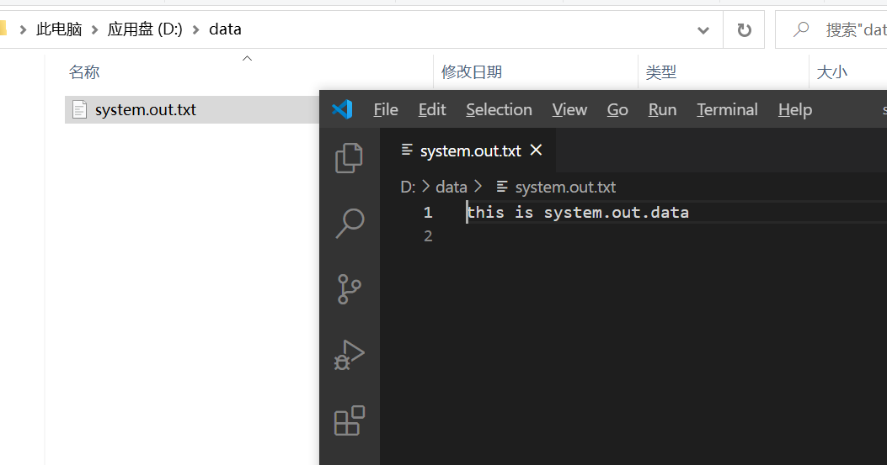
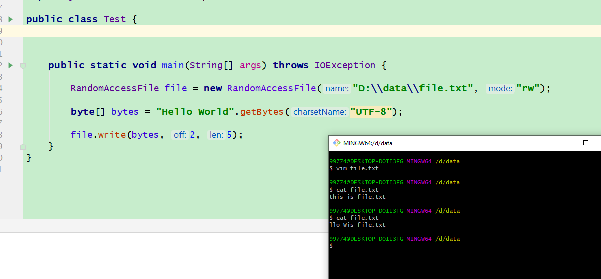
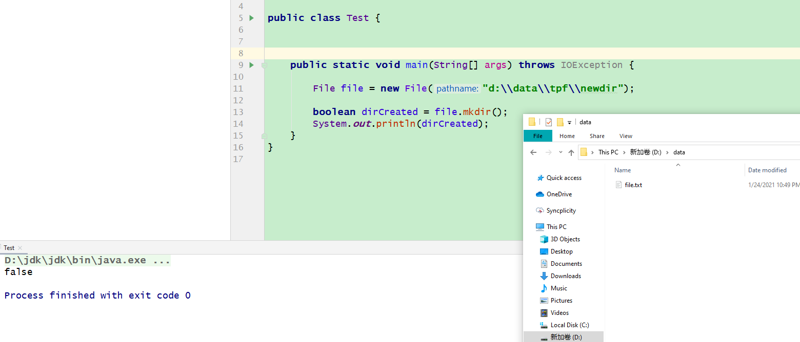
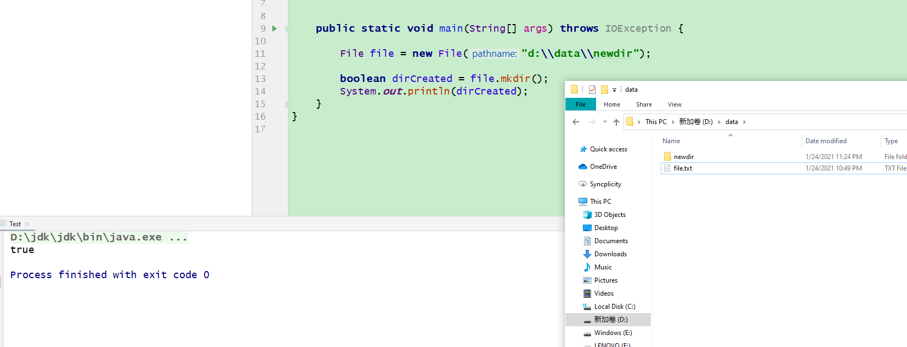
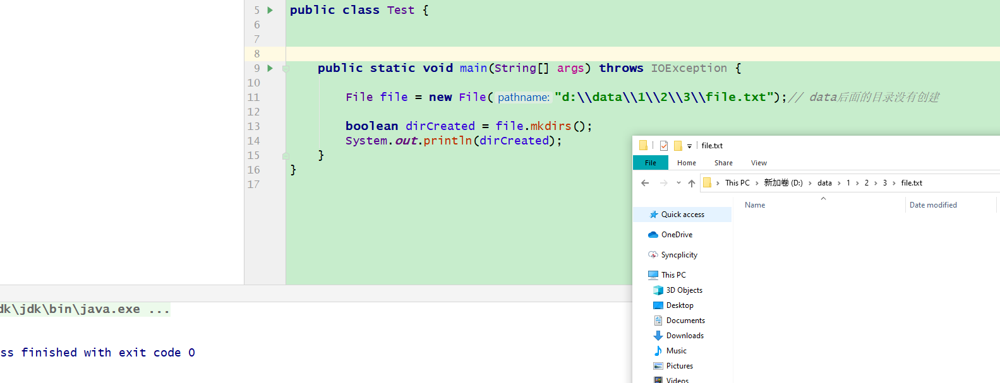
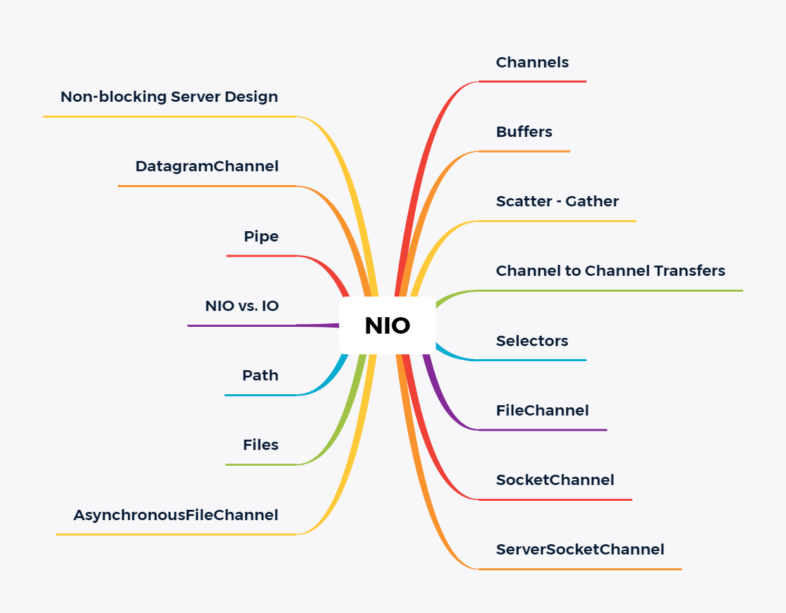
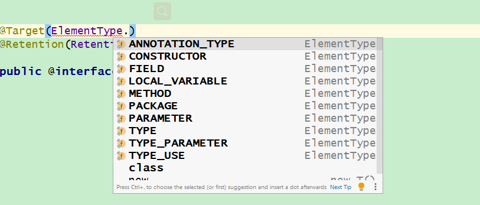
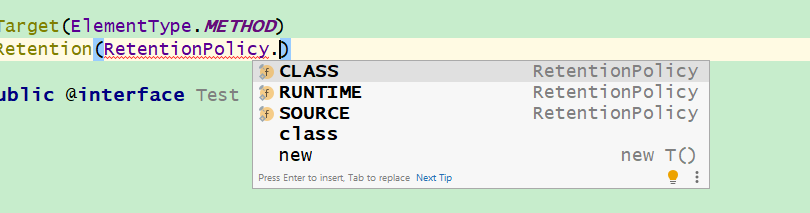

# 第1章 java se8流库

> 集合优化了对象的存储，而流和对象的处理有关。

​	流是什么？实际上java8的流可以想象为把容器里面的元素以流形式呈现方便处理（流管道），这个流类似与IO流的流，我们想处理容器中的元素通过流去指定操作即可。我们先看一下简单例子

```java
import java.util.Random;

public class Randoms {

    public static void main(String[] args) {
         new Random(47)
         .ints(5, 20)
         .distinct()
         .limit(7)
         .sorted()
         .forEach(System.out::println);
         }
}
```

​	上面是一个通过流去操作容器中的每个元素的小例子，上面的例子：假如你要随机展示 5 至 20 之间不重复的整数并进行排序。 看上面的程序可以从明了的看出代码的功能。  流的操作和方法引用结合起来使用更佳。

流的特点

1.流并不存储其元素。这些元素可能存储在底层集合中，或者是按需生成的

2.流的操作不会修改其数据源。例如，filter方法不会从流中移除元素，而是生成一个新的流。

3.流的操作是尽可能惰性执行的。例如查找5个长单词。filter方法在匹配到第5个单词后就停止过滤。


## 1.1 流支持

​	java8加入了流的支持，是通过什么怎么样加入的，怎么做到兼容之前代码的版本的呢？

​		比如在 Random 中添加更多的方法。只要不改变原有的方法，现有代码就不会受到干扰。接口部分怎么改造呢？采用了java8的新特性利用default默认方法进行对接口的改造。这样就很容易兼容以前的代码的执行。

​	

```java
long count = worlds.Stream()
    .filter(w->w.length()>12)
    .count();
```

​		流的方法的操作很全面，预制的操作基本满足我们工作中的所有要求。流的操作类型有三种：

+ 创建流-------------1.2

+ 修改流元素（中间操作，Intermediate Operations），-----------   1.3~1.5   <font color ="red">流的流动</font>

+ 消费流元素（终端操作，Terminal Operations）。最后一种类型通常意味着收集流元素（通常是到集合中）。下面一一讲解这些操作的含义。(count() 终止了谁？ worlds.Stream()这个流还是worlds.Stream()
      .filter(w->w.length()>12)这个新生成的流？后者？） 1.6


## 1.2流创建

流创建的API


**Stream.of**

`Stream.of("1","2","3")` 产生给定元素值的流

```java
//Stream.of("1","2","3")

/**
 * Returns a sequential ordered stream whose elements are the specified values.
 *
 * @param <T> the type of stream elements
 * @param values the elements of the new stream
 * @return the new stream
 */
@SafeVarargs
@SuppressWarnings("varargs") // Creating a stream from an array is safe
public static<T> Stream<T> of(T... values) {
    return Arrays.stream(values);
}


```


 **Arrays.stream();**

```java
/**
 * Returns a sequential {@link Stream} with the specified array as its
 * source.
 *
 * @param <T> The type of the array elements
 * @param array The array, assumed to be unmodified during use
 * @return a {@code Stream} for the array
 * @since 1.8
 */
 public static <T> Stream<T> stream(T[] array) {
     return stream(array, 0, array.length);
 }

/** 
* Returns a sequential {@link Stream} with the specified range of the
* specified array as its source.
*
* @param <T> the type of the array elements
* @param array the array, assumed to be unmodified during use
* @param startInclusive the first index to cover, inclusive
* @param endExclusive index immediately past the last index to cover
* @return a {@code Stream} for the array range
* @throws ArrayIndexOutOfBoundsException if {@code startInclusive} is
*         negative, {@code endExclusive} is less than
*         {@code startInclusive}, or {@code endExclusive} is greater than
*         the array size
* @since 1.8     [startInclusive,endExclusive) 范围
*/
public static <T> Stream<T> stream(T[] array, int startInclusive, int endExclusive) {
    return StreamSupport.stream(spliterator(array, startInclusive, endExclusive), false);
}
```


**Stream.generate(Supplier<T> s**)

```java
/**
 * Returns an infinite sequential unordered stream where each element is
 * generated by the provided {@code Supplier}.  This is suitable for
 * generating constant streams, streams of random elements, etc.
 *
 * @param <T> the type of stream elements
 * @param s the {@code Supplier} of generated elements
 * @return a new infinite sequential unordered {@code Stream}
 */
public static<T> Stream<T> generate(Supplier<T> s) {
    Objects.requireNonNull(s);
    return StreamSupport.stream(
            new StreamSpliterators.InfiniteSupplyingSpliterator.OfRef<>(Long.MAX_VALUE, s), false);
}
```

这个流的值是反复调用s函数而构建的

```java
/**
 * Represents a supplier of results.
 *
 * <p>There is no requirement that a new or distinct result be returned each
 * time the supplier is invoked.
 *
 * <p>This is a <a href="package-summary.html">functional interface</a>
 * whose functional method is {@link #get()}.
 *
 * @param <T> the type of results supplied by this supplier
 *
 * @since 1.8
 */

@FunctionalInterface
public interface Supplier<T> {

    /**
     * Gets a result.
     *
     * @return a result
     */
    T get();
}
```

## 1.3 从流中产生流


filter、map和flatMap都是流的方法，当然他们的流返回的也是流，这就从他们本身产生新的流。

流的转化会产生一个新的流，它的元素派生自另一个流中的元素。


**Stream<T> filter(Predicate<? super T> predicate);**

```java
 List<String> worldList= Arrays.asList("ab","cd","abcqwqwdefghigklmnopqrst");
 Stream<String> longwords=worldList.stream()
 	.filter(w->w.length()>12);
 longwords.forEach(System.out::println);
```

结果

```text
abcqwqwdefghigklmnopqrst
```

​		上面的代码就是从worldList.Stream()流里面产生新的流，新的流中的元素都是符合filter规则的。filter的函数接口就是Predicate。

```java
/**
 * Returns a stream consisting of the elements of this stream that match
 * the given predicate.
 *
 * <p>This is an <a href="package-summary.html#StreamOps">intermediate
 * operation</a>.
 *
 * @param predicate a <a href="package-summary.html#NonInterference">non-interfering</a>,
 *                  <a href="package-summary.html#Statelessness">stateless</a>
 *                  predicate to apply to each element to determine if it
 *                  should be included
 * @return the new stream
 */
Stream<T> filter(Predicate<? super T> predicate);
```


```java
@FunctionalInterface
public interface Predicate<T> {

    /**
     * Evaluates this predicate on the given argument.
     *
     * @param t the input argument
     * @return {@code true} if the input argument matches the predicate,
     * otherwise {@code false}
     */
    boolean test(T t);
```


**<R> Stream<R> map(Function<? super T, ? extends R> mapper);**

map方法的函数接口就是Function，生成一个新的流，这个新的流都是在原来的基础流上进行function处理生成的流。

看例子：

```java
List<String> worldList= Arrays.asList("AB","CD","EFG");
        worldList.stream().map(String::toLowerCase).forEach(System.out::println);
```

结果：

```text
ab
cd
efg
```


```java
/**
 * Returns a stream consisting of the results of applying the given
 * function to the elements of this stream.
 *
 * <p>This is an <a href="package-summary.html#StreamOps">intermediate
 * operation</a>.
 *
 * @param <R> The element type of the new stream
 * @param mapper a <a href="package-summary.html#NonInterference">non-interfering</a>,
 *               <a href="package-summary.html#Statelessness">stateless</a>
 *               function to apply to each element
 * @return the new stream
 */
<R> Stream<R> map(Function<? super T, ? extends R> mapper);
```


**<R> Stream<R> flatMap();**

待补充。


## 1.4 抽取自流和连接流

API


不解释

## 1.5 其他流的转换


## 1.6  Optional 类

​		在正式的学习流终端之前，咱们先来熟悉一个这个类方便理解终端操作里面的内容。（Optional, 一些终端操作的返回类型）.

​	 Optional<T>是一种包装类型，把T类型进行了包装，我们程序对T操作的更加安全，不用减少我们写一些为了安全但是与红能无关的代码。当T为null时它会有更好的表达。

```java
/**
 * A container object which may or may not contain a non-null value.
 * If a value is present, {@code isPresent()} will return {@code true} and
 * {@code get()} will return the value. */
 public final class Optional<T> {
     /**
     * Common instance for {@code empty()}.
     */
    private static final Optional<?> EMPTY = new Optional<>();

    /**
     * If non-null, the value; if null, indicates no value is present
     */
    private final T value;
     
 }
```

Optional中对T的引用是final类型的，也就意味着一旦引用，无法更换引用。而且这个类型还有静态的Optional对象。


**构造相关的API**


### of

**Optional<T> of(T value)**

```java

/**
 * Constructs an instance with the value present.
 *
 * @param value the non-null value to be present
 * @throws NullPointerException if value is null
 */
private Optional(T value) {
    this.value = Objects.requireNonNull(value);
}
/**
 * Returns an {@code Optional} with the specified present non-null value.
 *
 * @param <T> the class of the value
 * @param value the value to be present, which must be non-null
 * @return an {@code Optional} with the value present
 * @throws NullPointerException if value is null
 */
public static <T> Optional<T> of(T value) {
    return new Optional<>(value);
}
```


生成一个Option<T>的对象，传入value 如果为空，就会报异常。


我们需要一个包装一个T类型引用为空的对象怎么办。这个自带了一个T引用为空的Option对象，将返回这个静态实例。

### empty

**public static<T> Optional<T> empty()**


```java
/**
 * Returns an empty {@code Optional} instance.  No value is present for this
 * Optional.
 *
 * @apiNote Though it may be tempting to do so, avoid testing if an object
 * is empty by comparing with {@code ==} against instances returned by
 * {@code Option.empty()}. There is no guarantee that it is a singleton.
 * Instead, use {@link #isPresent()}.
 *
 * @param <T> Type of the non-existent value
 * @return an empty {@code Optional}
 */
public static<T> Optional<T> empty() {
    @SuppressWarnings("unchecked")
    Optional<T> t = (Optional<T>) EMPTY;
    return t;
}
```

### ofNullable

**public static <T> Optional<T> ofNullable(T value)** 

可以传入value为空的生成Option实例的方法。如果value为空，返回的也是类的那个静态实例和上面那个方法一样。

```java
/**
 * Returns an {@code Optional} describing the specified value, if non-null,
 * otherwise returns an empty {@code Optional}.
 *
 * @param <T> the class of the value
 * @param value the possibly-null value to describe
 * @return an {@code Optional} with a present value if the specified value
 * is non-null, otherwise an empty {@code Optional}
 */
public static <T> Optional<T> ofNullable(T value) {
    return value == null ? empty() : of(value);
}
```


### orElse

**public T orElse(T other)**


```java
/**
 * Return the value if present, otherwise return {@code other}.
 *
 * @param other the value to be returned if there is no value present, may
 * be null
 * @return the value, if present, otherwise {@code other}
 */
public T orElse(T other) {
    return value != null ? value : other;
}
```

看了源码功能就不言而喻了。如果这个Option不是value为空，就返回那个value，否则就返回other


### orElseGet

**public T orElseGet(Supplier<? extends T> other**）

如果值存在则直接返回，否则使用 Supplier 函数生成一个可替代对象。

```java
/**
 * Return the value if present, otherwise invoke {@code other} and return
 * the result of that invocation.
 *
 * @param other a {@code Supplier} whose result is returned if no value
 * is present
 * @return the value if present otherwise the result of {@code other.get()}
 * @throws NullPointerException if value is not present and {@code other} is
 * null
 */
public T orElseGet(Supplier<? extends T> other) {
    return value != null ? value : other.get();
}
```

```java
/**
 * Represents a supplier of results.
 *
 * <p>There is no requirement that a new or distinct result be returned each
 * time the supplier is invoked.
 *
 * <p>This is a <a href="package-summary.html">functional interface</a>
 * whose functional method is {@link #get()}.
 *
 * @param <T> the type of results supplied by this supplier
 *
 * @since 1.8
 */
@FunctionalInterface
public interface Supplier<T> {

    /**
     * Gets a result.
     *
     * @return a result
     */
    T get();
}
```

​	和上面的orElse差不多，上一次直接传入一个默认数据，现在传入的是一个函数接口Supplier对象直接调用这个对象，这个对象的get方法获得的数据作为默认数据。

Supplier的get方法每次调用，每次调用都会返回一个结果。每次调用的结果不需要返回一个新的或不同的结果，但是也可以这样。

---

### orElseThrow

 **orElseThrow(Supplier)**

​	如果值存在直接返回，否则使用 Supplier 函数生成一个异常。

```java
/**
 * Return the contained value, if present, otherwise throw an exception
 * to be created by the provided supplier.
 *
 * @apiNote A method reference to the exception constructor with an empty
 * argument list can be used as the supplier. For example,
 * {@code IllegalStateException::new}
 *
 * @param <X> Type of the exception to be thrown
 * @param exceptionSupplier The supplier which will return the exception to
 * be thrown
 * @return the present value
 * @throws X if there is no value present
 * @throws NullPointerException if no value is present and
 * {@code exceptionSupplier} is null
 */
public <X extends Throwable> T orElseThrow(Supplier<? extends X> exceptionSupplier) throws X {
    if (value != null) {
        return value;
    } else {
        throw exceptionSupplier.get();
    }
}
```

---

### ifPresent

**ifPresent(Consumer)**

当值存在时调用 Consumer，否则什么也不做。

```java
/**
 * If a value is present, invoke the specified consumer with the value,
 * otherwise do nothing.
 *
 * @param consumer block to be executed if a value is present
 * @throws NullPointerException if value is present and {@code consumer} is
 * null
 */
public void ifPresent(Consumer<? super T> consumer) {
    if (value != null)
        consumer.accept(value);
}
```

---

### get

**public T get()**

get()方法表示是Optional对象中获取值。

```java
/**
 * If a value is present in this {@code Optional}, returns the value,
 * otherwise throws {@code NoSuchElementException}.
 *
 * @return the non-null value held by this {@code Optional}
 * @throws NoSuchElementException if there is no value present
 *
 * @see Optional#isPresent()
 */
public T get() {
    if (value == null) {
        throw new NoSuchElementException("No value present");
    }
    return value;
}
```

获得被包装的值，如果为空就会抛出异常。

---

### filter

**public Optional<T> filter(Predicate<? super T> predicate)** 

接收一个函数式接口，当符合接口(Predicate)时，则返回一个Optional对象，否则返回一个空的Optional对象

```java
/**
 * If a value is present, and the value matches the given predicate,
 * return an {@code Optional} describing the value, otherwise return an
 * empty {@code Optional}.
 *
 * @param predicate a predicate to apply to the value, if present
 * @return an {@code Optional} describing the value of this {@code Optional}
 * if a value is present and the value matches the given predicate,
 * otherwise an empty {@code Optional}
 * @throws NullPointerException if the predicate is null
 */
public Optional<T> filter(Predicate<? super T> predicate) {
    Objects.requireNonNull(predicate);
    if (!isPresent())
        return this;
    else
        return predicate.test(value) ? this : empty();
}
```


### map

**public<U> Optional<U> map(Function<? super T, ? extends U> mapper)**

如果有值对其处理，并返回处理后的Optional，否则返回 Optional.empty()

```java
/**
 * If a value is present, apply the provided mapping function to it,
 * and if the result is non-null, return an {@code Optional} describing the
 * result.  Otherwise return an empty {@code Optional}.
 *
 * @apiNote This method supports post-processing on optional values, without
 * the need to explicitly check for a return status.  For example, the
 * following code traverses a stream of file names, selects one that has
 * not yet been processed, and then opens that file, returning an
 * {@code Optional<FileInputStream>}:
 *
 * <pre>{@code
 *     Optional<FileInputStream> fis =
 *         names.stream().filter(name -> !isProcessedYet(name))
 *                       .findFirst()
 *                       .map(name -> new FileInputStream(name));
 * }</pre>
 *
 * Here, {@code findFirst} returns an {@code Optional<String>}, and then
 * {@code map} returns an {@code Optional<FileInputStream>} for the desired
 * file if one exists.
 *
 * @param <U> The type of the result of the mapping function
 * @param mapper a mapping function to apply to the value, if present
 * @return an {@code Optional} describing the result of applying a mapping
 * function to the value of this {@code Optional}, if a value is present,
 * otherwise an empty {@code Optional}
 * @throws NullPointerException if the mapping function is null
 */
public<U> Optional<U> map(Function<? super T, ? extends U> mapper) {
    Objects.requireNonNull(mapper);
    if (!isPresent())
        return empty();
    else {
        return Optional.ofNullable(mapper.apply(value));
    }
}
```


### flatMap

public<U> Optional<U> flatMap(Function<? super T, Optional<U>> mapper)

```java
/**
 * If a value is present, apply the provided {@code Optional}-bearing
 * mapping function to it, return that result, otherwise return an empty
 * {@code Optional}.  This method is similar to {@link #map(Function)},
 * but the provided mapper is one whose result is already an {@code Optional},
 * and if invoked, {@code flatMap} does not wrap it with an additional
 * {@code Optional}.
 *
 * @param <U> The type parameter to the {@code Optional} returned by
 * @param mapper a mapping function to apply to the value, if present
 *           the mapping function
 * @return the result of applying an {@code Optional}-bearing mapping
 * function to the value of this {@code Optional}, if a value is present,
 * otherwise an empty {@code Optional}
 * @throws NullPointerException if the mapping function is null or returns
 * a null result
 */
public<U> Optional<U> flatMap(Function<? super T, Optional<U>> mapper) {
    Objects.requireNonNull(mapper);
    if (!isPresent())
        return empty();
    else {
        return Objects.requireNonNull(mapper.apply(value));
    }
}
```

与 map 类似，要求返回值必须是Optional。和上面的方法感觉一样。


## 1.7 终端操作

​	上面讲了创建流和轮换流，现在讲约简，也就是中断操作（terminal operation），具体的作用为：

他们将会流约简可以在程序中使用的非流值，然后流不在流动就会消失。

流的流动

```java
List<String> worldList= Arrays.asList("ab","cd","abcqwqwdefghigklmnopqrst");
Stream<String> base=worldList.stream();
Stream<String> longwords=base
        .filter(w->w.length()>12);
longwords.forEach(System.out::println);
base.forEach(System.out::println);//error  流已经从base流动到longwords流中
longwords.forEach(System.out::println);//error  longwords已经中断（使用完），不再能进行操作
```

上面的流从base中已经流到了longwords中所以在不能对base进行操作，流并没有消失只是流走了。

forEach已经把流使用完，所以流被截断，不在能使用。

> 中断操作将会获取流的最终结果。至此我们无法再继续往后传递流。可以说，终端操作总是我们在
> 流管道中所做的最后一件事。


参考Onjava8


# 第二章 java IO

## 2.1 java IO概述


### 2.1.1 输入和输出 – 数据源和目标媒介

我们先搞清一个重要的概念，输入/输出 、读/写。上面这两个属于是以谁的角度来说的。因为不同角度，实现的共嗯那个不同。我们在javaIO中。这两组组词都是以我们写的程序的角度述说的。程序运行在内存中，也就是以内存的角度述说的。（内存的角度不完全正确，思考System.in）

比如 输入/读 就是把内存外部的数据传输到内存中以供我们的程序进行调用，我们理解了这个就会更加容易理解java/io包里面各个类的功能。

java/io让我们程序将会有一个数据传输的功能。（当然我们的程序也可在传输的过程中对数据进行一定的处理）

这样的传输功能将会引出两个对象，一个是数据源一个是目标媒介。程序从数据源读取信息然后将信息然后将信息输出到目标媒介。（下图展示）


典型的数据源和目标媒介


| 数据源/目标媒介                                              |
| ------------------------------------------------------------ |
| 文件                                                         |
| 管道                                                         |
| 网络连接                                                     |
| 内存缓存                                                     |
| System.in, System.out, System.error(注：Java标准输入、输出、错误输出) //暂时没理解 |

### 2.1.2 流

​		从便于理解的角度可以把流想象位连续的数据流。一个流关联一个数据源/目标媒介。输入流就可以从流里面读取数据（读取数据源的数据到程序中）。输出流就可以往流里面写入数据（往里面写入数据就可以把数据写入到目标媒介中）。读取写入的单位不是按bit来操作的，而是根据流的不同，写入单位不同，可以是按照字节（字节流），也可以按照字符（字符流）。


### 2.1.3 类InputStream, OutputStream, Reader 和Writer

这些流更像一个工具，帮助program读取数据源的信息，把相关信息写出到目标媒介中。


### 2.1.4 Java IO的用途和特征

在IO包中，有许多许多InputStream、OutputStream、Reader、Writer的子类。更具不同的数据源和目的媒介使用不同的子类。


- 文件访问
- 网络访问
- 内存缓存访问
- 线程内部通信(管道)
- 缓冲
- 过滤
- 解析
- 读写文本 (Readers / Writers)
- 读写基本类型数据 (long, int etc.)
- 读写对象

### 2.1.5 Java IO类概述表


## 2.3  javaIO:文件

​		文件在编写程序的过程中经常被当作数据源或者是目标媒介，简短对它的操作进行概述

### 2.3.1 通过javaIO读取文件

​		根据文件的类别不同可以使用不同的流来进行读取，比如二进制文件使用FileInputStream流读取，文本文件用FileReader进行读取。读取的时候将会从头到尾一次顺序读取一个字节/字符，或者一次读多个字节/字符到数组里面。

​	若想要跳跃读取使用RandomAccessFile就可以实现。

### 2.3.2 通过javaIO写文件

​		根据文件的类别不同可以使用不同的流来进行写入，比如二进制文件使用FileOutputStream流读取，文本文件用FileWriter进行写入。写入的时候你可以写入一个字节/字符，或者通过数组一次写入多个字节/字符。

### 2.3.2通过javaIO随机存取文件

​		RandomAccessFile可以跳过文件的部分进行操作，并且支持同时读写，不要求特定的存取顺序。

### 2.3.4  文件和目录信息的获取

​		通过File类可以获取文件和目录的信息


## 2.2  javaIO:管道

​		java中管道为JVM下的不同进程提供了通信能力，管道同样可以作为数据源和目标媒介。通过PipedOutputStream和PipedInputStream可以创建管道并且关联上管道，进而来通过流来传输不同进程的间的数据的传输。

​		Java的管道不同于Unix/Linux系统中的管道。在Unix/Linux中，运行在不同地址空间的两个进程可以通过管道通信。在Java中，通信的双方应该是运行在同一进程中的不同线程。


### 2.2.1 通过Java IO创建管道

​		管道这个对象在代码中是无法体现的，但冥冥之中有一种存在的感觉。通过关联PipedOutputStream和PipedInputStream创建管道。他们两个就是操作管道的一对输入输出。（例子中管道既是数据源也是目标媒介）

两种相互关联的方法

```java
 PipedInputStream input =new PipedInputStream();
 PipedOutputStream output= new PipedOutputStream(input);
//PipedOutputStream output= new PipedOutputStream();
//PipedInputStream input =new PipedInputStream(output);
```

```java
PipedInputStream input =new PipedInputStream();
PipedOutputStream output= new PipedOutputStream();
input.connect(output);
//output.connect(input);
```

```java
public class PipeExample {


    public static void main(String[] args) throws IOException {
        final PipedInputStream input =new PipedInputStream();
        final PipedOutputStream output= new PipedOutputStream(input);

//        final PipedOutputStream output= new PipedOutputStream();
//        final PipedInputStream input =new PipedInputStream(output);
        Thread thread1=new Thread(()->{
            try {
                output.write("hello piped".getBytes());

            } catch (IOException e) {
                e.printStackTrace();
            }finally {
                try {
                    if(output!=null)
                        output.close();
                } catch (IOException e) {
                    e.printStackTrace();
                }
            }

        });

        Thread thread2=new Thread(()->{
            try {
                int data=input.read();
                while (data!=-1){
                    System.out.print((char)data);
                    data=input.read();
                }


            } catch (IOException e) {
                e.printStackTrace();
            }finally {
                try {
                  if(input!=null) {
                    input.close();
                    }
                }catch (IOException e) {
                        e.printStackTrace();
                }
            }

        });
        thread1.start();
        thread2.start();

    }
}
```

输入结果

```text
hello piped
```

> input的read方法会导致阻塞，由output的write唤醒，反之一样。所以两个相关联的管道流不能放在同一个线程因为这样可能会导致死锁


## 2.3 Java IO: 网络

网络也可以作为数据源和目标媒介。


## 2.4  字节和字符数组

java中某些对象也可以作为数据源或者目标媒介，例如：字节和字符数组。看下面的例子。

```java
public class MyClass {

    public static void main(String[] args) throws IOException {

        ByteArrayOutputStream output=new ByteArrayOutputStream();
        output.write("hello world".getBytes());
        ByteArrayInputStream input = new ByteArrayInputStream(output.toByteArray());

        int data =input.read();
        while (data!=-1){
            System.out.print((char) data);
            data =input.read();
        }

    }
}
```

数据流向


`CharArrayReader`和[`CharArrayWriter`同样可以操作字符数组。


## 2.5 System相关流

System.in, System.out, System.err。它们关联的数据源或者是数据目的媒介是控制台程序和键盘。

替换里面的流对象 println是PrintStream（一种OutputStream）一种写的方法

```java
public class SystemStream {

    public static void main(String[] args) throws FileNotFoundException {


        OutputStream output=new FileOutputStream("D:\\data\\system.out.txt");
        System.setOut(new PrintStream(output));
        System.out.println("this is system.out.data");
    }
}
```




关闭JVM必须flush，要不会导致数据的丢失。


## 2.3 I/O 中Stream具体介绍

### 2.3.1 流

​		流就像一个工具一样，通过它可以读数据源的数据，也可以通过它向目的媒介写数据。就像水管一样里面的，可以把水从一个地方引流到另一个一个地方。

​		IO流和数组不同，不能通过索引读取数字，流一个连续的数据流，流中的数据是流动的，这样就可以操作数据源中的数据，和往目的媒介中输出数据。

### 2.3.2 **InputStream**

​	InputStream是一个所有javaI/O输入流的基类，在编码的过程尽量使用InputStream变量去引用具体输入流对象，这样可以使程序具有更强大的通用性。

  **int read()** 

​		此方法是个抽象方法，由子类去实现。这个的功能是从输入流中读取数据，每次读取一个字节，将返回这这个字节（8bit）（0~255），如果已经到了流的末尾也就是数据源没有什么可以读取的了，就会返回-1。

​		还有一点需要注意的是，如果这个流关联的是外部的数据源，不是内存里面的数据源。无法利用当前执行线程直接在内存读取，这样就会在读取的时候导致线程阻塞。唤醒的条件有三个 1.流获得要读取的数据 2.数据源中的数据已经读完（即到达了流的末尾） 3.发生了异常。

**int read(byte b[], int off, int len) **

调用上面的`read()`方法把度的数据放入到b[0ff]~b[0ff+len-1]中，返回读到的数据长度（0~len)。如果在调用这个方法之前就已经到达了流的末尾 就会返回 -1；**返回0只有如果len==0返回0**

**long skip(long n)**

下次读取的时候跳过n个字节，返回的是实际跳过了几个字节，因为在跳过n个字节之前已经到达了流的末尾

 **int available()**

​		在线程不阻塞情况下还有多少数据可以读取，这数据只是存储在流中的数据，不是流关联的数据源还有多少数可以读取。这说明流是可以存储还未读取的数据。

**void close()**

​		关闭流和释放和流所占用的资源

**void mark(int readlimit)** 

​		在读的过程中标记一个位置，在调用reset方法之后流读取的位置又回到原来的标记的位置。如果输入流**从标记的位置开始算起**已经读取的字节大于`readlimit`在标记无效。不是所有的流支持这种使用方式（`markSupported`）

**reset()**

​		复位使用，结合上面的mark方法（`markSupported`返回true才能使用）

```java
/**
 * This abstract class is the superclass of all classes representing
 * an input stream of bytes.
 */

public abstract class InputStream implements Closeable {

    // MAX_SKIP_BUFFER_SIZE is used to determine the maximum buffer size to
    // use when skipping.
    private static final int MAX_SKIP_BUFFER_SIZE = 2048;

    /**
     * Reads the next byte of data from the input stream. The value byte is
     * returned as an <code>int</code> in the range <code>0</code> to
     * <code>255</code>. If no byte is available because the end of the stream
     * has been reached, the value <code>-1</code> is returned. This method
     * blocks until input data is available, the end of the stream is detected,
     * or an exception is thrown
     */
    public abstract int read() throws IOException;

    /**
     * Reads some number of bytes from the input stream and stores them into
     * the buffer array <code>b</code>. The number of bytes actually read is
     * returned as an integer.  This method blocks until input data is
     * available, end of file is detected, or an exception is thrown.
     *
     */
    public int read(byte b[]) throws IOException {
        return read(b, 0, b.length);
    }

    /**
     * Reads up to <code>len</code> bytes of data from the input stream into
     * an array of bytes.  An attempt is made to read as many as
     * <code>len</code> bytes, but a smaller number may be read.
     * The number of bytes actually read is returned as an integer.
     *
     * <p> This method blocks until input data is available, end of file is
     * detected, or an exception is thrown.
     */
    public int read(byte b[], int off, int len) throws IOException {
        if (b == null) {
            throw new NullPointerException();
        } else if (off < 0 || len < 0 || len > b.length - off) {
            throw new IndexOutOfBoundsException();
        } else if (len == 0) {
            return 0;
        }

        int c = read();
        if (c == -1) {
            return -1;
        }
        b[off] = (byte)c;

        int i = 1;
        try {
            for (; i < len ; i++) {
                c = read();
                if (c == -1) {
                    break;
                }
                b[off + i] = (byte)c;
            }
        } catch (IOException ee) {
        }
        return i;
    }

    /**
     * Skips over and discards <code>n</code> bytes of data from this input
     * stream. The <code>skip</code> method may, for a variety of reasons, end
     * up skipping over some smaller number of bytes, possibly <code>0</code>.
     * This may result from any of a number of conditions; reaching end of file
     * before <code>n</code> bytes have been skipped is only one possibility.
     * The actual number of bytes skipped is returned. If {@code n} is
     * negative, the {@code skip} method for class {@code InputStream} always
     * returns 0, and no bytes are skipped. Subclasses may handle the negative
     * value differently.
     */
    public long skip(long n) throws IOException {

        long remaining = n;
        int nr;

        if (n <= 0) {
            return 0;
        }

        int size = (int)Math.min(MAX_SKIP_BUFFER_SIZE, remaining);
        byte[] skipBuffer = new byte[size];
        while (remaining > 0) {
            nr = read(skipBuffer, 0, (int)Math.min(size, remaining));
            if (nr < 0) {
                break;
            }
            remaining -= nr;
        }

        return n - remaining;
    }

    /**
     * Returns an estimate of the number of bytes that can be read (or
     * skipped over) from this input stream without blocking by the next
     * invocation of a method for this input stream. The next invocation
     * might be the same thread or another thread.  A single read or skip of this
     * many bytes will not block, but may read or skip fewer bytes.
     *
     * <p> Note that while some implementations of {@code InputStream} will return
     * the total number of bytes in the stream, many will not.  It is
     * never correct to use the return value of this method to allocate
     * a buffer intended to hold all data in this stream.
     */
    public int available() throws IOException {
        return 0;
    }

    /**
     * Closes this input stream and releases any system resources associated
     * with the stream.
     */
    public void close() throws IOException {}

    /**
     * Marks the current position in this input stream. A subsequent call to
     * the <code>reset</code> method repositions this stream at the last marked
     * position so that subsequent reads re-read the same bytes.
     *
     * <p> The <code>readlimit</code> arguments tells this input stream to
     * allow that many bytes to be read before the mark position gets
     * invalidated.
     *
     */
    public synchronized void mark(int readlimit) {}

    /**
     * Repositions this stream to the position at the time the
     * <code>mark</code> method was last called on this input stream.
     *
     */
    public synchronized void reset() throws IOException {
        throw new IOException("mark/reset not supported");
    }

    /**
     * Tests if this input stream supports the <code>mark</code> and
     * <code>reset</code> methods. Whether or not <code>mark</code> and
     * <code>reset</code> are supported is an invariant property of a
     * particular input stream instance. The <code>markSupported</code> method
     * of <code>InputStream</code> returns <code>false</code>.
     */
    public boolean markSupported() {
        return false;
    }

}
```


### 2.3.3 OutputStream

​		OutputStream是一个所有javaI/O输出流的基类，在编码的过程尽量使用OutputStream变量去引用具体输出流对象，这样可以使程序具有更强大的通用性。


**void write(int b)**

​		写一个字节的数据。int有32bit在写的时候只取低位的8bit，忽略高位的24bit。和读取一样大多数情况下写入的时候同样会阻塞线程。

**void write(byte b[], int off, int len)**

​		通过调用上面的 `void write(int b)`方法，把b[off]~b[off+len-1]的数据写到目的媒介中。

**write(byte b[])**

​	执行write(b, 0, b.length);

**void flush()**

​	将缓存区的数据写入目的媒介，缓存区可能指的是是Stream本身存储的数据。也可能是？

这并不一定能成功写入到目的媒介。（参考BufferedOutputStream的flush方法）

**void close()**

​		关闭Stream并释放相关的资源

```java


/**
 * This abstract class is the superclass of all classes representing
 * an output stream of bytes. An output stream accepts output bytes
 * and sends them to some sink.
 */
public abstract class OutputStream implements Closeable, Flushable {
    /**
     * Writes the specified byte to this output stream. The general
     * contract for <code>write</code> is that one byte is written
     * to the output stream. The byte to be written is the eight
     * low-order bits of the argument <code>b</code>. The 24
     * high-order bits of <code>b</code> are ignored.
     */
    public abstract void write(int b) throws IOException;

    /**
     * Writes <code>b.length</code> bytes from the specified byte array
     * to this output stream. The general contract for <code>write(b)</code>
     * is that it should have exactly the same effect as the call
     * <code>write(b, 0, b.length)</code>.
     */
    public void write(byte b[]) throws IOException {
        write(b, 0, b.length);
    }

    /**
     * Writes <code>len</code> bytes from the specified byte array
     * starting at offset <code>off</code> to this output stream.
     * The general contract for <code>write(b, off, len)</code> is that
     * some of the bytes in the array <code>b</code> are written to the
     * output stream in order; element <code>b[off]</code> is the first
     * byte written and <code>b[off+len-1]</code> is the last byte written
     * by this operation.
     */
    public void write(byte b[], int off, int len) throws IOException {
        if (b == null) {
            throw new NullPointerException();
        } else if ((off < 0) || (off > b.length) || (len < 0) ||
                   ((off + len) > b.length) || ((off + len) < 0)) {
            throw new IndexOutOfBoundsException();
        } else if (len == 0) {
            return;
        }
        for (int i = 0 ; i < len ; i++) {
            write(b[off + i]);
        }
    }

    /**
     * Flushes this output stream and forces any buffered output bytes
     * to be written out. The general contract of <code>flush</code> is
     * that calling it is an indication that, if any bytes previously
     * written have been buffered by the implementation of the output
     * stream, such bytes should immediately be written to their
     * intended destination.
     * @exception  IOException  if an I/O error occurs.
     */
    public void flush() throws IOException {
    }

    /**
     * Closes this output stream and releases any system resources
     * associated with this stream. The general contract of <code>close</code>
     * is that it closes the output stream. A closed stream cannot perform
     * output operations and cannot be reopened.
     * <p>
     */
    public void close() throws IOException {
    }

}
```


### 2.3.4 FileInputStream

FileInputStream实现了文件（数据源）通过字节流读取到内存中方式，是InputStream的子类，可以作为一种InputStream来使用。


**Constructors**

​	一共有三种，说其中两种

​	---FileInputStream(String name)

​		参数是一个String参数，代表文件的路径。在输入的过程中，路径是不支持单反斜杠的 **“\”**,因为反斜杠在java的字符串中是转义符。`"D:\test\study"`这种字符串在java中是无法识别成路径的，一般都这么写`"D:\\test\\study"`。`"D:/test/study"`这种字符在大部分系统可以识别的。

​	---FileInputStream(File file)

**int read(byte[])**

**int read(byte[], int offset, int length)**

​		FileInputStream重写了这两个方法，以前的InputStream的实现是通过read（）方法一个一个字节的读取实现的填充字节数组。现在的实现是通过调用 `readBytes`方法，这个方法调用的本地方法，从本质实现了一次读取多个字节。

**读取性能**

​		通过读取以数组为单位读取，将会比一次读取一个字节大大的提高了性能。通过字节数组的读取并不是字节数组的长度越大越好，这取决于本地的操作系统，这与本地硬盘的缓存区，在读取数据的时候是通过本地硬盘的缓存区从外存读取到内存的。

```java


/**
 * A <code>FileInputStream</code> obtains input bytes
 * from a file in a file system. What files
 * are  available depends on the host environment.
 *
 * <p><code>FileInputStream</code> is meant for reading streams of raw bytes
 * such as image data. For reading streams of characters, consider using
 * <code>FileReader</code>.
 */
public
class FileInputStream extends InputStream
{
    /* File Descriptor - handle to the open file */
    private final FileDescriptor fd;

    /**
     * The path of the referenced file
     * (null if the stream is created with a file descriptor)
     */
    private final String path;

    private FileChannel channel = null;

    private final Object closeLock = new Object();
    private volatile boolean closed = false;

    /**
     * Creates a <code>FileInputStream</code> by
     * opening a connection to an actual file,
     * the file named by the path name <code>name</code>
     * in the file system.  A new <code>FileDescriptor</code>
     * object is created to represent this file
     * connection.
     * <p>
     * First, if there is a security
     * manager, its <code>checkRead</code> method
     * is called with the <code>name</code> argument
     * as its argument.
     * <p>
     * If the named file does not exist, is a directory rather than a regular
     * file, or for some other reason cannot be opened for reading then a
     * <code>FileNotFoundException</code> is thrown.
     *
     * @param      name   the system-dependent file name.
     * @exception  FileNotFoundException  if the file does not exist,
     *                   is a directory rather than a regular file,
     *                   or for some other reason cannot be opened for
     *                   reading.
     * @exception  SecurityException      if a security manager exists and its
     *               <code>checkRead</code> method denies read access
     *               to the file.
     * @see        java.lang.SecurityManager#checkRead(java.lang.String)
     */
    public FileInputStream(String name) throws FileNotFoundException {
        this(name != null ? new File(name) : null);
    }

    /**
     * Creates a <code>FileInputStream</code> by
     * opening a connection to an actual file,
     * the file named by the <code>File</code>
     * object <code>file</code> in the file system.
     * A new <code>FileDescriptor</code> object
     * is created to represent this file connection.
     * <p>
     * First, if there is a security manager,
     * its <code>checkRead</code> method  is called
     * with the path represented by the <code>file</code>
     * argument as its argument.
     * <p>
     * If the named file does not exist, is a directory rather than a regular
     * file, or for some other reason cannot be opened for reading then a
     * <code>FileNotFoundException</code> is thrown.
     *
     * @param      file   the file to be opened for reading.
     * @exception  FileNotFoundException  if the file does not exist,
     *                   is a directory rather than a regular file,
     *                   or for some other reason cannot be opened for
     *                   reading.
     * @exception  SecurityException      if a security manager exists and its
     *               <code>checkRead</code> method denies read access to the file.
     * @see        java.io.File#getPath()
     * @see        java.lang.SecurityManager#checkRead(java.lang.String)
     */
    public FileInputStream(File file) throws FileNotFoundException {
        String name = (file != null ? file.getPath() : null);
        SecurityManager security = System.getSecurityManager();
        if (security != null) {
            security.checkRead(name);
        }
        if (name == null) {
            throw new NullPointerException();
        }
        if (file.isInvalid()) {
            throw new FileNotFoundException("Invalid file path");
        }
        fd = new FileDescriptor();
        fd.attach(this);
        path = name;
        open(name);
    }

    /**
     * Creates a <code>FileInputStream</code> by using the file descriptor
     * <code>fdObj</code>, which represents an existing connection to an
     * actual file in the file system.
     * <p>
     * If there is a security manager, its <code>checkRead</code> method is
     * called with the file descriptor <code>fdObj</code> as its argument to
     * see if it's ok to read the file descriptor. If read access is denied
     * to the file descriptor a <code>SecurityException</code> is thrown.
     * <p>
     * If <code>fdObj</code> is null then a <code>NullPointerException</code>
     * is thrown.
     * <p>
     * This constructor does not throw an exception if <code>fdObj</code>
     * is {@link java.io.FileDescriptor#valid() invalid}.
     * However, if the methods are invoked on the resulting stream to attempt
     * I/O on the stream, an <code>IOException</code> is thrown.
     *
     * @param      fdObj   the file descriptor to be opened for reading.
     * @throws     SecurityException      if a security manager exists and its
     *                 <code>checkRead</code> method denies read access to the
     *                 file descriptor.
     * @see        SecurityManager#checkRead(java.io.FileDescriptor)
     */
    public FileInputStream(FileDescriptor fdObj) {
        SecurityManager security = System.getSecurityManager();
        if (fdObj == null) {
            throw new NullPointerException();
        }
        if (security != null) {
            security.checkRead(fdObj);
        }
        fd = fdObj;
        path = null;

        /*
         * FileDescriptor is being shared by streams.
         * Register this stream with FileDescriptor tracker.
         */
        fd.attach(this);
    }

    /**
     * Opens the specified file for reading.
     * @param name the name of the file
     */
    private native void open0(String name) throws FileNotFoundException;

    // wrap native call to allow instrumentation
    /**
     * Opens the specified file for reading.
     * @param name the name of the file
     */
    private void open(String name) throws FileNotFoundException {
        open0(name);
    }

    /**
     * Reads a byte of data from this input stream. This method blocks
     * if no input is yet available.
     *
     * @return     the next byte of data, or <code>-1</code> if the end of the
     *             file is reached.
     * @exception  IOException  if an I/O error occurs.
     */
    public int read() throws IOException {
        return read0();
    }

    private native int read0() throws IOException;

    /**
     * Reads a subarray as a sequence of bytes.
     * @param b the data to be written
     * @param off the start offset in the data
     * @param len the number of bytes that are written
     * @exception IOException If an I/O error has occurred.
     */
    private native int readBytes(byte b[], int off, int len) throws IOException;

    /**
     * Reads up to <code>b.length</code> bytes of data from this input
     * stream into an array of bytes. This method blocks until some input
     * is available.
     *
     * @param      b   the buffer into which the data is read.
     * @return     the total number of bytes read into the buffer, or
     *             <code>-1</code> if there is no more data because the end of
     *             the file has been reached.
     * @exception  IOException  if an I/O error occurs.
     */
    public int read(byte b[]) throws IOException {
        return readBytes(b, 0, b.length);
    }

    /**
     * Reads up to <code>len</code> bytes of data from this input stream
     * into an array of bytes. If <code>len</code> is not zero, the method
     * blocks until some input is available; otherwise, no
     * bytes are read and <code>0</code> is returned.
     *
     * @param      b     the buffer into which the data is read.
     * @param      off   the start offset in the destination array <code>b</code>
     * @param      len   the maximum number of bytes read.
     * @return     the total number of bytes read into the buffer, or
     *             <code>-1</code> if there is no more data because the end of
     *             the file has been reached.
     * @exception  NullPointerException If <code>b</code> is <code>null</code>.
     * @exception  IndexOutOfBoundsException If <code>off</code> is negative,
     * <code>len</code> is negative, or <code>len</code> is greater than
     * <code>b.length - off</code>
     * @exception  IOException  if an I/O error occurs.
     */
    public int read(byte b[], int off, int len) throws IOException {
        return readBytes(b, off, len);
    }

    /**
     * Skips over and discards <code>n</code> bytes of data from the
     * input stream.
     *
     * <p>The <code>skip</code> method may, for a variety of
     * reasons, end up skipping over some smaller number of bytes,
     * possibly <code>0</code>. If <code>n</code> is negative, the method
     * will try to skip backwards. In case the backing file does not support
     * backward skip at its current position, an <code>IOException</code> is
     * thrown. The actual number of bytes skipped is returned. If it skips
     * forwards, it returns a positive value. If it skips backwards, it
     * returns a negative value.
     *
     * <p>This method may skip more bytes than what are remaining in the
     * backing file. This produces no exception and the number of bytes skipped
     * may include some number of bytes that were beyond the EOF of the
     * backing file. Attempting to read from the stream after skipping past
     * the end will result in -1 indicating the end of the file.
     *
     * @param      n   the number of bytes to be skipped.
     * @return     the actual number of bytes skipped.
     * @exception  IOException  if n is negative, if the stream does not
     *             support seek, or if an I/O error occurs.
     */
    public long skip(long n) throws IOException {
        return skip0(n);
    }

    private native long skip0(long n) throws IOException;

    /**
     * Returns an estimate of the number of remaining bytes that can be read (or
     * skipped over) from this input stream without blocking by the next
     * invocation of a method for this input stream. Returns 0 when the file
     * position is beyond EOF. The next invocation might be the same thread
     * or another thread. A single read or skip of this many bytes will not
     * block, but may read or skip fewer bytes.
     *
     * <p> In some cases, a non-blocking read (or skip) may appear to be
     * blocked when it is merely slow, for example when reading large
     * files over slow networks.
     *
     * @return     an estimate of the number of remaining bytes that can be read
     *             (or skipped over) from this input stream without blocking.
     * @exception  IOException  if this file input stream has been closed by calling
     *             {@code close} or an I/O error occurs.
     */
    public int available() throws IOException {
        return available0();
    }

    private native int available0() throws IOException;

    /**
     * Closes this file input stream and releases any system resources
     * associated with the stream.
     *
     * <p> If this stream has an associated channel then the channel is closed
     * as well.
     *
     * @exception  IOException  if an I/O error occurs.
     *
     * @revised 1.4
     * @spec JSR-51
     */
    public void close() throws IOException {
        synchronized (closeLock) {
            if (closed) {
                return;
            }
            closed = true;
        }
        if (channel != null) {
           channel.close();
        }

        fd.closeAll(new Closeable() {
            public void close() throws IOException {
               close0();
           }
        });
    }

    /**
     * Returns the <code>FileDescriptor</code>
     * object  that represents the connection to
     * the actual file in the file system being
     * used by this <code>FileInputStream</code>.
     *
     * @return     the file descriptor object associated with this stream.
     * @exception  IOException  if an I/O error occurs.
     * @see        java.io.FileDescriptor
     */
    public final FileDescriptor getFD() throws IOException {
        if (fd != null) {
            return fd;
        }
        throw new IOException();
    }

    /**
     * Returns the unique {@link java.nio.channels.FileChannel FileChannel}
     * object associated with this file input stream.
     *
     * <p> The initial {@link java.nio.channels.FileChannel#position()
     * position} of the returned channel will be equal to the
     * number of bytes read from the file so far.  Reading bytes from this
     * stream will increment the channel's position.  Changing the channel's
     * position, either explicitly or by reading, will change this stream's
     * file position.
     *
     * @return  the file channel associated with this file input stream
     *
     * @since 1.4
     * @spec JSR-51
     */
    public FileChannel getChannel() {
        synchronized (this) {
            if (channel == null) {
                channel = FileChannelImpl.open(fd, path, true, false, this);
            }
            return channel;
        }
    }

    private static native void initIDs();

    private native void close0() throws IOException;

    static {
        initIDs();
    }

    /**
     * Ensures that the <code>close</code> method of this file input stream is
     * called when there are no more references to it.
     *
     * @exception  IOException  if an I/O error occurs.
     * @see        java.io.FileInputStream#close()
     */
    protected void finalize() throws IOException {
        if ((fd != null) &&  (fd != FileDescriptor.in)) {
            /* if fd is shared, the references in FileDescriptor
             * will ensure that finalizer is only called when
             * safe to do so. All references using the fd have
             * become unreachable. We can call close()
             */
            close();
        }
    }
}
```

### 2.3.5 FileOutputStream

**Constructors**

和上面的FileInputStream相似,有两个构造方法

```java
String path = "C:\\users\\jakobjenkov\\data\\datafile.txt";

FileOutputStream output = new FileOutputStream(path);
```


```java
String path = "C:\\users\\jakobjenkov\\data\\datafile.txt";
File   file = new File(path);

FileOutputStream output = new FileOutputStream(file);
```

**Overwriting vs. Appending the File**

是要重写文件还是在后面追加内容，在构造器中设置。


```java
OutputStream output = new FileOutputStream("c:\\data\\output-text.txt", true); //append

OutputStream output = new FileOutputStream("c:\\data\\output-text.txt", false); //overwrite
```


如果不设置第二个构造参数的话，默认是进行重写。


**write(int )**

这个write方法方法把一个int的低8bit写入到目的媒介中，


**Writing Byte Arrays**

也可以一次写一个byte数组到目的媒介中，这个调用的是本地方法，不在是outputstream中的利用write(int)方法一个一个进行写入。

**性能分析**

一个数组形式写入内容，比一个一个写入的速度快得多，建议使用数组进行写入。数组的内存也不是越大越好，具体的写入速度得看计算机底层硬件 缓存区的大小，磁盘的读写速度、内存的速度。


**Transparent Buffering via BufferedOutputStream**


```java
int bufferSize = 8 * 1024;
FileOutputStream output = new BufferedOutputStream(
                      new FileOutputStream("c:\\data\\output-file.txt"),
                          bufferSize
);
```

**flush()**

**Convert FileOutputStream to Writer**

```java
FileOutputStream outputStream       = new FileOutputStream("c:\\data\\output.txt");
Writer       outputStreamWriter = new OutputStreamWriter(outputStream);

outputStreamWriter.write("Hello World");
```

### 2.3.6 RandomAccessFile

RandomAccessFile对一个文件能读能写，功能不叫强大不想上面两个比较单一。

**Creating a RandomAccessFile**

```java
RandomAccessFile file = new RandomAccessFile("c:\\data\\file.txt", "rw");
```

rw代表RandomAccessFile对象对所指向文件的访问模式，rw代表的读写模式。其中一共有四种模式，其余模式就会报出异常

| mode | description                                                  |
| ---- | ------------------------------------------------------------ |
| r    | 读模式，不能对文件进行写入，否则会报错                       |
| rw   | 读写模式，对文件可以进行读写                                 |
| rwd  | 同步操作，更新的文件内容会被立即更新到存储设备。             |
| rws  | 同步操作，更新的文件内容和元数据信息会被立即更新到存储设备。 |

元数据指用来描述一个文件的特征的系统数据，诸如访问权限、文件拥有者以及文件数据块的分布信息(**inode...**)等等

**Seeking in a RandomAccessFile**

要读或者要写都必须要在文件中的某一个位置开始，利用seek方法来把这个指针指向你想要在的位置，

```java
RandomAccessFile file = new RandomAccessFile("d:\\data\\file.txt", "rw");

file.seek(200);
```

**Get File Position**

如果你想获得现在这个指针指向的位置，就利用` getFilePointer()`方法来获得。当前指针的位置所获得的数值是以字节问偏移量的。

```java
long position = file.getFilePointer();
```

**Read Byte from a RandomAccessFile**

从文件中读取字节用它的read方法

```java
RandomAccessFile file = new RandomAccessFile("c:\\data\\file.txt", "rw");

int aByte = file.read();
```

读取的是当前指针所指向的位置，调用完read方法后指针的位置自动向后移动一个字节位，接下可以继续调用这个方法进行读取。


**Read Array of Bytes from a RandomAccessFile**

可以向数组进行读入，这样可以一次读取多个字节了。

```java
RandomAccessFile randomAccessFile = new RandomAccessFile("data/data.txt", "r");

byte[] dest      = new byte[1024];
int    offset    = 0;  //写入数组的起始位置
int    length    = 1024; //从起始位置算可以写入的长度，但不一定可以写这么多
int    bytesRead = randomAccessFile.read(dest, offset, length);
```

这个方法读取字节到字节数组中，返回读入了多少个字节一般返回length但也可能比这个数值小。

**Write Byte to a RandomAccessFile**

```java
RandomAccessFile file = new RandomAccessFile("d:\\data\\file.txt", "rw");

file.write(65); // ASCII code for A
```

写入一个字节会把指针指向的字节覆盖掉，并文件指针+1（向后移动一位）

**Write Array of Bytes to a RandomAccessFile**

以数组的进行写入

```java
RandomAccessFile file = new RandomAccessFile("d:\\data\\file.txt", "rw");

byte[] bytes = "Hello World".getBytes("UTF-8");

file.write(bytes, 2, 5);
```




以数组的形式写入没写一个字节就会移动指针的位置。写入的时候会把指针当前内容进行覆盖

**close**

和其它流一样，使用完后对其进行关闭，会释放相关的资源。

可以使用    `Java Try With Resources`进行关闭

```java
try(RandomAccessFile file = new RandomAccessFile("d:\\data\\file.txt", "rw")){

    //read or write from the RandomAccessFile

}
```

### 2.3.7 Java File

​		File对象指向文件系统中的文件，如果你想对这个文件做些什么比如增加、删除、移动等等，可以利用File这个对象即可。但是这个对象不能对文件内容或者是元信息进行访问。file实例不光能代表文件还能代表目录


#### **---Create a File**

创建一个File实例，

```java
File file = new File("c:\\data\\input-file.txt");
```

​		这是一个通过路径创建一个File实例的例子，这个File实例指向对应的文件，接下来就可以对这个文件进行操作了。这个文件也可以是不存在，这样就可以利用File实例创造它了。

#### **----Check if File or Directory Exists**

可以检查File对象指向的文件或者目录是否存在

```java
File file = new File("c:\\data\\input-file.txt");

boolean fileExists = file.exists();
```

```java
File file = new File("c:\\data\\input-file.txt");

boolean fileExists = file.exists();
```

#### **---Create a Directory if it Does Not Exist**

```java
File file = new File("c:\\data\\tpf\\newdir");

boolean dirCreated = file.mkdir();

```




```java
File file = new File("c:\\users\\jakobjenkov\\newdir");

boolean dirCreated = file.mkdirs();
```



创建了newdir目录我们再调用下面这个方法。


上面是几种不同的情况，是要创造文件还是创造目录也要说清楚，mkdir只能创建最后一级目录的。file代表的是目录的情况下才能调用这个方法

我们来看看mkdires





他直接把没有目录全部都创建出来，只能在file代表目录的时候进行创建

#### **---File Length**

```java
File file = new File("d:\\data\\input-file.txt");

long length = file.length();
```

读取文件的大小，单位是字节数


#### ---Rename or Move File or Directory

```java
File file = new File("c:\\data\\input-file.txt");

boolean success = file.renameTo(new File("c:\\data\\new-file.txt"));
```


#### **---Delete File or Directory**

```java
File file = new File("c:\\data\\input-file.txt");

boolean success = file.delete();
```

#### ---Delete Directory and Subdirectories Recursively

删除目录的时候只能删除一个空目录，如果要删除的目录包含着文件或者目录只能先把包含的文件和目录先删除

```java
public static boolean deleteDir(File dir){
    File[] files = dir.listFiles();
    if(files != null){
        for(File file : files){
            if(file.isDirectory()){
                deleteDir(file);
            } else {
                file.delete();
            }
        }
    }
    return dir.delete();
}
```

#### ---Check if Path is File or Directory

```java
File file = new File("c:\\data");

boolean isDirectory = file.isDirectory();
```

#### ---Read List of Files in Directory


```java
File file = new File("c:\\data");

String[] fileNames = file.list();

File[]   files = file.listFiles();
```


# Java NIO

## 1.简约介绍

NIO （new io） 时可替代java io 和java netWorking操作的API

**Java NIO: Non-blocking IO**

非阻塞io，传统io为阻塞io 。

怎么非阻塞呢？一个线程 （thread ）可以让管道（chanel）去读取数据放到缓存区中（buffer），自己去干别的事情。当数据都被读入缓存区时，线程就可以来对这些数据进行操。同样写数据，channel 也是干这些（怎么一个过程呢？）。

**Java NIO: Channels and Buffers**

在NIO中最经常结束的两个概念，数据总是从管道（chnnel）写入缓存（buffer），或者从buffer 写入到channel

**Java NIO: Selectors**

selector 是用于监听通道（channels）的一些事件（比如，连接成功，数据到达）。一个selector对象可以监听多个通道的事件。


**Java NIO Concepts**

下面我们将要学习的NIO相关的一些概念



## 2、Java NIO Overview

 NIO最核心的三个概念

- Channels
- Buffers
- Selectors

其余的一些概念都是围绕上面这三个来展开的，想`Pipe`和`FileLock`


**Channels and Buffers**

channels 和buffers


在NIO中，Chnnel有点像流。来自channel读取的数据能够读入到buffer中。buffer里面的数据也能够通过channel写入到其他地方。

NIO里面一些Channel

- FileChannel
- DatagramChannel
- SocketChannel
- ServerSocketChanne

一些Buffer

- ByteBuffer
- CharBuffer
- DoubleBuffer
- FloatBuffer
- IntBuffer
- LongBuffer
- ShortBuffer

 `MappedByteBuffer`暂不介绍


**Selectors**

一个slelector 可以让一个线程处理多个channel，监听多个channel去进行处理。比如多个channel需要的流量很少的时候，一个线程就可以处理。


用一个Selector注册到一个Channel上，然后就可以调用selector的select方法，这个方法将会`阻塞`，直到Selector 触发事件，然后这个进程能够处理这些事件。


## 3.Java NIO Channel

Chnenel特别想传统IO中stream，但是也会有一些不同

+ 流是单向的，channel 能写又能读
+ 可以异步读和写
+ channel总是对buffer 读和写（对于使用方来说）。


当我们需要读取数据的时候，就是通过把channel把数据读取到buffer中，然后我们就可以通过buffer操作这些数据了。

当我们向某一个地方写数据的时候，我们就把数据放入到buffer中，channel读取buffer中的数据写入到我们指定的地方。

**Channel Implementations**

我们来看一下比较常用的channel实现

- FileChannel
- DatagramChannel
- SocketChannel
- ServerSocketChannel

`FileChannel` 使用于文件的读写

`DatagramChannel` 通过UDP对于远程数据的读写

`SocketChannel` 通过TCP对于远程数据的读写

`ServerSocketChannel`，向webserver一样监听TCP连接，当接收到TCP连接时，会主动创建一个`SocketChannel` ，然后进行通信。

```java
    RandomAccessFile aFile = new RandomAccessFile("data/nio-data.txt", "rw");
    FileChannel inChannel = aFile.getChannel();

    ByteBuffer buf = ByteBuffer.allocate(48);

    int bytesRead = inChannel.read(buf);
    while (bytesRead != -1) {

      System.out.println("Read " + bytesRead);
      buf.flip();   //翻转一下

      while(buf.hasRemaining()){
          System.out.print((char) buf.get());
      }

      buf.clear();
      bytesRead = inChannel.read(buf);
    }
    aFile.close();
```

这就是一般使用，后面会分析这个程序


## 4.Java NIO Buffer

buffer 本质就是一个内存块，可向里面写入数据，也已从里面取出数据，channel 和使用者之间的一个缓冲区。 NIO Buffer是NIO封装的提供了许多便利的API。


### 4.1Basic Buffer Usage

使用buffer进行读写一般进行下面四个步骤

1. 写入数据到Buffer, (可能是channel写的，也可能是当前线程写的)

2. 调用`buffer.flip()`方法

3. 从Buffer 中把数据读取出来

4. 调用`buffer.clear()` 或者 `buffer.compact()`

   ​	当写入数据到buffer的时候，buffer会记写入了多少数据。如果你需要读取这些数据的时候，必须把buffer**从写模式转换到读模式**。通过调用flip方法。在模式下你读取所有写入buffer中的数据。

   ​	当你读取完毕buffer中数据的时候，这时候就得让它再次准备写入数据。这时候就通过`clear`方法或者是`compact`方法。clear方法就清理整个buffer。compact方法之清理你读取的，这时候没有被读取的数据就会移动到buffer的开始位置。

   ```java
   RandomAccessFile aFile = new RandomAccessFile("data/nio-data.txt", "rw");
   FileChannel inChannel = aFile.getChannel();
   
   //create buffer with capacity of 48 bytes
   ByteBuffer buf = ByteBuffer.allocate(48);
   
   int bytesRead = inChannel.read(buf); //read into buffer.  这里会非阻塞吗
   while (bytesRead != -1) {
   
     buf.flip();  //make buffer ready for read
   
     while(buf.hasRemaining()){
         System.out.print((char) buf.get()); // read 1 byte at a time
     }
   
     buf.clear(); //make buffer ready for writing
     bytesRead = inChannel.read(buf);
   }
   aFile.close();
   ```

   

   

### 4.2 Buffer Capacity, Position and Limit

buffer有三个比较核心的属性

- capacity
- position
- limit


**Capacity:**

buffer容量，没什么好说的

**Position：**

当你写入数据的时候，初始位置是0，写一个往下走一个单位。当你读取数据的时候，通过调用flip后，positon会重置到0，然后再一次读取，读一个往下面移动一个单位

**Limit：**

就是你读取和写入数据的被限制再到某一个位置了，虽然容量是这么多的。限制你最多写入多少，最多读取多少。

### 4.3 Buffer Types

不同的类型有不同的buffer

- ByteBuffer
- MappedByteBuffer
- CharBuffer
- DoubleBuffer
- FloatBuffer
- IntBuffer
- LongBuffer
- ShortBuffer

`MappedByteBuffer`是一个特殊的buffer ，稍后详细讲述。

### 4.4 Allocating a Buffer

初始化 Buffer容量，使用之前必须给buffer分配容量

```java
ByteBuffer buf = ByteBuffer.allocate(48);
```

```java
CharBuffer buf = CharBuffer.allocate(1024);
```

### 4.5 Writing Data to a Buffer

两种方式向Buffer里面写入数据。

1.让Channel里面写入数据。（这其实就是从目的源读取数据）

```java
int bytesRead = inChannel.read(buf); //read into buffer.
```


2.调用Buffer的 `put()` 方法，像里面写数据。（这其实就对应的向目的源写数据是的）

```java
buf.put(127);    
```

### 4.6 flip()

转换模式。buffer从写模式转化为读模式。这时候就可以从Buffer中读取数据。

postion就会重置为0，limit就会变为positon刚才呆在的位置。也就是往里面写入多少，最多也就读取多少。

```java
limit=position;
position=0
```


### 4.7 Reading Data from a Buffer

有两种方法从Buffer读取数据。

1.让Channel从Buffer中读取数据，（其实就是向目的源，写入数据）

```java
//read from buffer into channel.
int bytesWritten = inChannel.write(buf);
```


2.主动调用get()方法进行读取Buffer里面的数据（本质就是从目的源读取数据）

```java
byte aByte = buf.get();   
```


### 4.8 rewind()

会把positon的位置重置到0的位置，limit保持不变。这样就可以重新读取数据。


### 4.9 clear() and compact()

​		

从buffer里面读取完数据，就得让它再次准备好被写入的状态。这时候就需要我们调用clear方法和compact方法了。

如果你调用clear方法了。position会重置为0，limit会重置到capacity。里面的数据其实并没有清理，只是改变了这两个标记


再来一种情况，如果你读了一部分，但是现在需要写入了，但是剩下的一部分想稍后进行读。这时候你应该调用compact的方法。

调用compact方法，就会让没有读的数据复制到buffer的其实位置，并把position移动到最后一个数据的位置（复制的）。把limit赋值为capacity。这个状态就可以接着写入。

### 4.10 mark() and reset()

mark做标记，reset把position重置到标记的位置

```java
buffer.mark();

//call buffer.get() a couple of times, e.g. during parsing.

buffer.reset();  //set position back to mark.  
```

### 4.11 equals() and compareTo()

两个buffer 可以相互比较

**equals()**

1.存储的类型相等

2.他们相等数量的剩余元素（通过属性判定剩余元素）

3.所有的剩余元素相等。

**compareTo()**

1.依次位置比较，首先能比较出大小，就是它们之间的大小

2.谁先耗尽剩余的元素谁小。

## 5.Java NIO Scatter / Gather

java nio支持 scatter和gather。它是关于channel读取数据和写入数据的一种概念。

`scattering read`指的是从channel读取的数据可去读取到多个buffer。也就说可以向多个缓存写入数据。

` gathering write`指的是多个buffer中的数据可以写入到一个channel中。

在 把一部分数据分成不同的部分（也就分成不同的buffer ），这种情况下使用scatter和gather就非常有用了。

### 5.1 Scattering Reads

channel 向多个buffer读取信息。下面是这个图。


```java
ByteBuffer header = ByteBuffer.allocate(128);
ByteBuffer body   = ByteBuffer.allocate(1024);

ByteBuffer[] bufferArray = { header, body };

channel.read(bufferArray);
```

从上面的示例的代码可以看出

channel向多个buffer中写入数据，当一个写满后就向下一个buffer，这样的话就不适合动态大小。就像上面的header就固定到了128

### 5.2 Gathering Writes

多个buffer向Channel中写入数据，这就是数据的写入。


```java
ByteBuffer header = ByteBuffer.allocate(128);
ByteBuffer body   = ByteBuffer.allocate(1024);

//write data into channel

ByteBuffer[] bufferArray = { header, body };

channel.write(bufferArray);
```

向channel写入数据，值写入 postion和limit之间的数据。因为limit可以通过buffer读入的数据+flip动态控制

## 6.Java NIO Channel to Channel Transfers

​		在java NIO 可以传输数据从一个channel到另一个channel。就拿FileChannel来说，它的chansferTo和chansferFrom方法就是做这个相关的。

### 6.1 transferFrom()

 `FileChannel.transferFrom()`方法就是 传输数据从一个资源类型 channel到`FileChannel`

```java
RandomAccessFile fromFile = new RandomAccessFile("fromFile.txt", "rw");
FileChannel      fromChannel = fromFile.getChannel();

RandomAccessFile toFile = new RandomAccessFile("toFile.txt", "rw");
FileChannel      toChannel = toFile.getChannel();

long position = 0;
long count    = fromChannel.size();

toChannel.transferFrom(fromChannel, position, count);	
```

positon 表示要从哪里开始写入。count表示最多要传输多少个bytes。


另外一些`SocketChannel`实现类，可能只传输`SocketChannel`当前暂时缓存的数据，即使随后会有更多数据缓存进来


### 6.2 transferTo()

 `FileChannel.transferFrom()`方法就是 把来自FileChannel的数据传输到其他的channel

```java
RandomAccessFile fromFile = new RandomAccessFile("fromFile.txt", "rw");
FileChannel      fromChannel = fromFile.getChannel();

RandomAccessFile toFile = new RandomAccessFile("toFile.txt", "rw");
FileChannel      toChannel = toFile.getChannel();

long position = 0;
long count    = fromChannel.size();

fromChannel.transferTo(position, count, toChannel);
```

同样SocketChannel也出现上面的问题

SocketChanne只能传输数据知道SocketChannel的缓存区满了就停止了


## 7.Java NIO Selector

###  7.1 Why Use a Selector?

​		单线程管理多个channel的优势就是对应多线程的。假如一个线程管理一个channel的话，对于CPU来说就不得不增加线程上的切换。这种线程的切换对CPU来说，比较消耗性能，二七人每一个线程也会占有的一定资源（eg. 内存。）因此在一些情况下。越少的线程越好。（多任务类型肯定多线程比较好，好钢用在刀刃上）

​		一个线程怎么做到处理多个channel？用Selector


### 7.2 Creating a Selector

```java
Selector selector = Selector.open();
```

### 7.3 Registering Channels with the Selector

​		怎么样通过seletor来管理channel呢，通过把selector注册到channel来达到绑定的效果。使用的是  `SelectableChannel.register()`方法

```java
channel.configureBlocking(false);

SelectionKey key = channel.register(selector, SelectionKey.OP_READ);
```

​	 要想使用selector对channel进行监听管理，就必须在non-bloking模式下进行。这也就是说那些不能进入非阻塞模式的channel是不能使用的selector。

register的第二个参数，是表明selector监听这个channel什么事件。

channel都会有什么样的状态（事件）呢？

1. Connect 连接其他地方成功。连接到目的源 a channel that has connected successfully to another server is "connect ready"
2. Accept  已经接受连接  A server socket channel which accepts an incoming connection is "accept" ready
3. Read  已经存入好数据，准备好被读了
4. Write 准备好被写入数据了


对应的SelectionKey有以下几个

1. SelectionKey.OP_CONNECT
2. SelectionKey.OP_ACCEPT
3. SelectionKey.OP_READ
4. SelectionKey.OP_WRITE

如果你想对某一个channel监听多个事件，可以如下操作

```java
int interestSet = SelectionKey.OP_READ | SelectionKey.OP_WRITE;    
```

### 7.4 SelectionKey

注册完之后会返回一个SelectionKey，这个`SelectionKey`会有以下几个属性

- The interest set
- The ready set
- The Channel
- The Selector
- An attached object (optional)

**Interest Set**

```java
int interestSet = selectionKey.interestOps();

boolean isInterestedInAccept  = SelectionKey.OP_ACCEPT  == (interestSet & SelectionKey.OP_ACCEPT);
boolean isInterestedInConnect = SelectionKey.OP_CONNECT == (interestSet & SelectionKey.OP_CONNECT);
boolean isInterestedInRead    = SelectionKey.OP_READ    == (interestSet & SelectionKey.OP_READ);
boolean isInterestedInWrite   = SelectionKey.OP_WRITE   == (interestSet & SelectionKey.OP_WRITE);
```

000000     000010. 原理是用这种二进制&方式来做判断的。可以通过这个来判断出selector都监听了什么事件。

**Ready Set**

在`selection`之后，就可以获得channel的ready集。也就是channel的状态集，可能selector没有监听

```java
int readySet = selectionKey.readyOps()
```

可以用上面一样的方法来获得集里面都有什么，也可以用下面封装好的方法

```java
selectionKey.isAcceptable();
selectionKey.isConnectable();
selectionKey.isReadable();
selectionKey.isWritable();
```


**Channel + Selector**

可以从SelectionKey直接访问Channel和selector

```java
Channel  channel  = selectionKey.channel();

Selector selector = selectionKey.selector();   
```


**Attaching Objects**

你可以让一个对象Object依附到SelectionKey。这对于识别Channel和储存一些Channel未来用到的信息非常有用。比如你把一个Channel将会用到Buffer依附于Key（到时候事件触发，直接使用这个Buffer）。或者其他一些集合信息。

```java
selectionKey.attach(theObject);

Object attachedObj = selectionKey.attachment();
```

也可以这么依附

```java
SelectionKey key = channel.register(selector, SelectionKey.OP_READ, theObject);
```


### 7.5 Selecting Channels via a Selector

你可以通过`select()`类的方法把把已经监听到的Selector返回出来（当然是你监听的状态事件，且selector已经触发了这个状态事件）。

都有以下的selector的方法

- int select()
- int select(long timeout)
- int selectNow()

`select() `会阻塞，直到一个channel被进监听到

`select(long timeout)`, 和上面方法一样，就是可以设置最大的阻塞事件。

`selectNow()`，不会阻塞，会立即返回。

  

**selectedKeys()**

`select()`的返回值可以表示准备好的Channel。你可以通过下面的方式访问准备好的Channel

通过

```java
Set<SelectionKey> selectedKeys = selector.selectedKeys();    
```

就和上面所演示的一样，这个selectedKey和注册返回的一样。

```java
Set<SelectionKey> selectedKeys = selector.selectedKeys();

Iterator<SelectionKey> keyIterator = selectedKeys.iterator();

while(keyIterator.hasNext()) {
    
    SelectionKey key = keyIterator.next();

    if(key.isAcceptable()) {
        // a connection was accepted by a ServerSocketChannel.

    } else if (key.isConnectable()) {
        // a connection was established with a remote server.

    } else if (key.isReadable()) {
        // a channel is ready for reading

    } else if (key.isWritable()) {
        // a channel is ready for writing
    }

    keyIterator.remove();  //处理完之后必须移除。当再次准备好之后，会自动加进的。
}
```

通过`SelectionKey.channel()`获取channel，但是要强制转换为自己需要的类型。

`Selector.wakeup()`


### 7.6 wakeUp()


调用`select()`的方法会陷入阻塞，怎么唤醒他呢，通过其他线程调用`wakeup()`的方法来进行唤醒。马上`select()`就有返回值。

`Selector.wakeup()`

### 7.7 close()

`Selector.close`,与这个Selector相关的`SelectionKey`全部会失效。Selector也会关闭。但是不会关闭Channel


### 7.8 Full Selector Example

​	来个普通且完整的例子

```java
Selector selector = Selector.open();

channel.configureBlocking(false);

SelectionKey key = channel.register(selector, SelectionKey.OP_READ);


while(true) {

  int readyChannels = selector.selectNow();

  if(readyChannels == 0) continue;


  Set<SelectionKey> selectedKeys = selector.selectedKeys();

  Iterator<SelectionKey> keyIterator = selectedKeys.iterator();

  while(keyIterator.hasNext()) {

    SelectionKey key = keyIterator.next();

    if(key.isAcceptable()) {
        // a connection was accepted by a ServerSocketChannel.

    } else if (key.isConnectable()) {
        // a connection was established with a remote server.

    } else if (key.isReadable()) {
        // a channel is ready for reading

    } else if (key.isWritable()) {
        // a channel is ready for writing
    }

    keyIterator.remove();
  }
}
```


## 8. Java NIO FileChannel

`FileChannel`是一种连接文件的Channel ，可读文件内容，可向文件写入内容。可替代传统的Java IO关于对文件的操作的API

`FileChannel`

### 8.1 Opening a FileChannel

在使用一个FileChannel之前就得去打一个FileChannel，也就是创建一个。可以通过InputStream 、OutPutStream 或者RandomAccessFile去打开一个FileChannel

```java
RandomAccessFile aFile     = new RandomAccessFile("data/nio-data.txt", "rw");
FileChannel      inChannel = aFile.getChannel();
```


### 8.2 Reading Data from a FileChannel

```java
ByteBuffer buf = ByteBuffer.allocate(48); //创建一个容量为48的Buffer

int bytesRead = inChannel.read(buf); //向buffer里面写入数据。返回写入的个数。返回-1说明已经读到这个文件的末尾
```


### 8.3Writing Data to a FileChannel

```java
String newData = "New String to write to file..." + System.currentTimeMillis();

ByteBuffer buf = ByteBuffer.allocate(48);
buf.clear();  //清空buf，重置标志，
buf.put(newData.getBytes());//向buffer里面写入数据

buf.flip();  //buf转换成读模式，可从buf中读取数据

while(buf.hasRemaining()) {
    channel.write(buf); //读取buf中数据，写入到channel
}
```

### 8.4Closing a FileChannel

使用完了就得关闭

```java
channel.close(); 
```

### 8.5FileChannel Position

当你想在特定位置读写的时候，你可通过修改position的值来达到效果

```java
long pos channel.position();

channel.position(pos +123);
```

如果你想position置到末尾，你将它置为-1即可。

在文件末尾写入chennel数据，可能导致文件空洞`file hole`？

### 8.9 FileChannel Size

```java
long fileSize = channel.size();    
```

为连接文件的大小

### 8.10 FileChannel Truncate

截断文件

```java
channel.truncate(1024);
```

This example truncates the file at 1024 bytes in length.

### 8.11 FileChannel Force

 `FileChannel.force()`会把来自Filechannel的数据，但还没有写入的，写到磁盘。操作系统在写文件的时候可能会把一部分数据缓存起来。这就不能保证把数据写入到文件。

 `force()` 方法会告诉系统文件数据是否被flush？？？

```java
channel.force(true);
```


## 9.Java NIO SocketChannel

 `SocketChannel`是一个连接TCP Socket的channel。可替代传统的API  Java Networking's Sockets

你可以主动打开建立一个`SocketChannel`，去连接网络上的任何一个服务器

或者当收到一个连接时去创建一个`SocketChannel`

### 9.1 Opening a SocketChannel

```java
SocketChannel socketChannel = SocketChannel.open();
socketChannel.connect(new InetSocketAddress("http://jenkov.com", 80));
```


### 9.2 Closing a SocketChannel

使用完了就关了

 ```java
socketChannel.close();    
 ```

### 9.3Reading from a SocketChannel

从SocketChannel读取内容

```java
ByteBuffer buf = ByteBuffer.allocate(48);

int bytesRead = socketChannel.read(buf);	
```


### 9.4 Writing to a SocketChannel

```java
String newData = "New String to write to file..." + System.currentTimeMillis();

ByteBuffer buf = ByteBuffer.allocate(48);
buf.clear();
buf.put(newData.getBytes());

buf.flip();

while(buf.hasRemaining()) {
    channel.write(buf);
}
```

### 9.10Non-blocking Mode

当你设置非阻塞模式后，就可以异步调用。connect()、read()、write()

**connect()**

```java
socketChannel.configureBlocking(false);  //设置为非阻塞模式
socketChannel.connect(new InetSocketAddress("http://jenkov.com", 80));//可能在连接上之前就会返回

while(! socketChannel.finishConnect() ){  //检查是否连接上了
    //wait, or do something else...    
}
```


**write()**

在非阻塞模式下write()方法，可能在未写入数据之前返回。

所以需要循环执行write方法？

**read()**

在非阻塞模式下，可能没有读取数据就会返回数据。因此我们时常关注返回的数据。来依次判断读取了多少数据。

**Non-blocking Mode with Selectors**

在非阻塞模式下使用Seletor来管理就会很方便，使用起来更加吸引人。

## 10 Java NIO ServerSocketChannel

`ServerSocketChannel` 是一个能够监听TCP连接的Channel，就像`ServerSocket`一样

```java
ServerSocketChannel serverSocketChannel = ServerSocketChannel.open();

serverSocketChannel.socket().bind(new InetSocketAddress(9999));

while(true){
    SocketChannel socketChannel =
            serverSocketChannel.accept();

    //do something with socketChannel...
}
```

### 10.1 Opening a ServerSocketChannel

```java
ServerSocketChannel serverSocketChannel = ServerSocketChannel.open();
```

### 10.2 Closing a ServerSocketChannel

不用了就关闭

```java
serverSocketChannel.close();
```

### 10.3  Listening for Incoming Connections

```java
while(true){
    SocketChannel socketChannel =
            serverSocketChannel.accept();

    //do something with socketChannel...
}
```

accept方法会阻塞，直到有connneticon进来，就会返回SocketChannel。

### 10.4  Non-blocking Mode

在非阻塞模式下，就会立即返回。这就需要我们去检查socketChannel。来判断是否有连接进来。

```java
ServerSocketChannel serverSocketChannel = ServerSocketChannel.open();

serverSocketChannel.socket().bind(new InetSocketAddress(9999));
serverSocketChannel.configureBlocking(false);

while(true){
    SocketChannel socketChannel =
            serverSocketChannel.accept();

    if(socketChannel != null){
        //do something with socketChannel...
        }
}
```


## 11. Java NIO: Non-blocking Server

 

## 12.Java NIO DatagramChannel


## 13.Java NIO Pipe


## 14.Java NIO vs. IO


## 15.Java NIO Path


## 16.Java NIO Files


## 17.Java NIO AsynchronousFileChannel

 


# 网络编程


# 注解

什么是注解（Annotation）？注解是放在Java源码的类、方法、字段、参数前的一种特殊“注释”：

## 基本语法

### 定义

```java
@Target(ElementType.METHOD)
@Retention(RetentionPolicy.RUNTIME)

public @interface Test {}
```


`@Targe`表示这个注解用在哪里（方法上？，字段上？类？构造方法上？）



`@Retention`  表示你的注解在哪个阶段起作用 （源代码阶段，编译class的时候，运行的时候）




不包含任何元素的注解称为标记注解（marker annotation），例如上例中的 @Test 就是标记注解。


@Target  @Retention 这些放在注解上的注解称之为元注解。

| 注解        | 解释                                                         |
| ----------- | ------------------------------------------------------------ |
| @Target     | 表示注解可以用于哪些地方。可能的 ElementType 参数包括：<br />CONSTRUCTOR：构造器的声明 <br />FIELD：字段声明（包括 enum 实例）<br />LOCAL_VARIABLE:局部变量声明   ; <br />METHOD：方法声明 <br />PACKAGE：包声明;<br /> PARAMETER：参数声明 ;<br />TYPE：类、接口（包括注解类型）或者<br/>enum 声明 |
| @Retention  | 表示注解信息保存的时长。可选的 RetentionPolicy 参数包括：<br />SOURCE：注解将被编译器丢弃<br /> CLASS：注解在 class 文件中可用，但是会被 JVM 丢弃。<br/>RUNTIME：JVM 将在运行期也保留注解，因此可以通过反射机制读取注解的信息。 |
| @Documented | 将此注解保存在 Javadoc 中                                    |
| @Inherited  | 允许子类继承父类的注解                                       |
| @Repeatable | 允许一个注解可以被使用一次或者多次（Java 8）                 |

### 注解的使用

```java
import java.lang.annotation.*;
@Target(ElementType.METHOD)
@Retention(RetentionPolicy.RUNTIME)
public @interface UseCase {
    int id();
    String description() default "no description";
}
```

我们用一个注解来表示我们的方法的特性。在后面解析的时候，我们就会通过注解了解这些方法。 id和description的定义就是注解在使用的时候一些参数。default可以规定默认值

```java
import java.util.*;
public class PasswordUtils {
    @UseCase(id = 47, description =
            "Passwords must contain at least one numeric")
    public boolean validatePassword(String passwd) {
        return (passwd.matches("\\w*\\d\\w*"));
    }
    @UseCase(id = 48)
    public String encryptPassword(String passwd) {
        return new StringBuilder(passwd)
                .reverse().toString();
    }
    @UseCase(id = 49, description ="New passwords can't equal previously used ones")
    public boolean checkForNewPassword(
            List<String> prevPasswords, String passwd) {
        return !prevPasswords.contains(passwd);
    }
}
```


### 解析注解(注解处理器)

注解写上去，我们不去解析使用便没有了意义。我写点代码解析我们自己写的注解，这段代码就叫做注解处理器.我们来写一段代码来解析上面的程序

```java
import java.util.*;
import java.util.stream.*;
import java.lang.reflect.*;
public class UseCaseTracker {
    public static void
    trackUseCases(List<Integer> useCases, Class<?> cl) {
        for(Method m : cl.getDeclaredMethods()) {
            UseCase uc = m.getAnnotation(UseCase.class);  //获得这个方法对应的注解实例
            if(uc != null) {
                System.out.println("Found Use Case " +
                        uc.id() + "\n " + uc.description());
                useCases.remove(Integer.valueOf(uc.id()));
            }
        }
        useCases.forEach(i ->
                System.out.println("Missing use case " + i));
    }
    public static void main(String[] args) {
        List<Integer> useCases = IntStream.range(47, 51).boxed().collect(Collectors.toList());
        trackUseCases(useCases, PasswordUtils.class);
    }
}
```

输出结果

```text
Found Use Case 47
 Passwords must contain at least one numeric
Found Use Case 48
 no description
Found Use Case 49
 New passwords can't equal previously used ones
Missing use case 50
```


### 注解元素

上面例子的id就是注解元素。注解元素的类型只能是下面这些

• 所有基本类型（int、float、boolean 等）
• String
• Class
• enum
• Annotation

• 以上类型的数组

### 默认值限制

元素不能有不确定的值。

任何非基本类型的元素，无论是在源代码声明时还是在注解接口中定义默认值时，都不能使用 null 作为其值。

来表示不存在状态 惯常用法

```java
 // annotations/SimulatingNull.java
 import java.lang.annotation.*;
 @Target(ElementType.METHOD)
 @Retention(RetentionPolicy.RUNTIME)
 public @interface SimulatingNull {
 	int id() default -1;
	 String description() default "";
 }
```


### 注解不支持继承


###  实现处理器


# 安全


