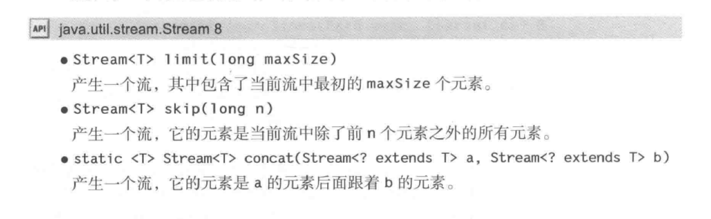

# 中级特性


## 第1章 java se8流库

> 集合优化了对象的存储，而流和对象的处理有关。

​	流是什么？实际上java8的流可以想象为把容器里面的元素以流形式呈现方便处理（流管道），这个流类似与IO流的流，我们想处理容器中的元素通过流去指定操作即可。我们先看一下简单例子

```java
import java.util.Random;

public class Randoms {

    public static void main(String[] args) {
         new Random(47)
         .ints(5, 20)
         .distinct()
         .limit(7)
         .sorted()
         .forEach(System.out::println);
         }
}
```

​	上面是一个通过流去操作容器中的每个元素的小例子，上面的例子：假如你要随机展示 5 至 20 之间不重复的整数并进行排序。 看上面的程序可以从明了的看出代码的功能。  流的操作和方法引用结合起来使用更佳。

流的特点

1.流并不存储其元素。这些元素可能存储在底层集合中，或者是按需生成的

2.流的操作不会修改其数据源。例如，filter方法不会从流中移除元素，而是生成一个新的流。

3.流的操作是尽可能惰性执行的。例如查找5个长单词。filter方法在匹配到第5个单词后就停止过滤。


### 1.1 流支持

​	java8加入了流的支持，是通过什么怎么样加入的，怎么做到兼容之前代码的版本的呢？

​		比如在 Random 中添加更多的方法。只要不改变原有的方法，现有代码就不会受到干扰。接口部分怎么改造呢？采用了java8的新特性利用default默认方法进行对接口的改造。这样就很容易兼容以前的代码的执行。

​	

```java
long count = worlds.Stream()
    .filter(w->w.length()>12)
    .count();
```

​		流的方法的操作很全面，预制的操作基本满足我们工作中的所有要求。流的操作类型有三种：

+ 创建流-------------1.2

+ 修改流元素（中间操作，Intermediate Operations），-----------   1.3~1.5   <font color ="red">流的流动</font>

+ 消费流元素（终端操作，Terminal Operations）。最后一种类型通常意味着收集流元素（通常是到集合中）。下面一一讲解这些操作的含义。(count() 终止了谁？ worlds.Stream()这个流还是worlds.Stream()
      .filter(w->w.length()>12)这个新生成的流？后者？） 1.6


### 1.2流创建

流创建的API


**Stream.of**

`Stream.of("1","2","3")` 产生给定元素值的流

```java
//Stream.of("1","2","3")

/**
 * Returns a sequential ordered stream whose elements are the specified values.
 *
 * @param <T> the type of stream elements
 * @param values the elements of the new stream
 * @return the new stream
 */
@SafeVarargs
@SuppressWarnings("varargs") // Creating a stream from an array is safe
public static<T> Stream<T> of(T... values) {
    return Arrays.stream(values);
}


```


 **Arrays.stream();**

```java
/**
 * Returns a sequential {@link Stream} with the specified array as its
 * source.
 *
 * @param <T> The type of the array elements
 * @param array The array, assumed to be unmodified during use
 * @return a {@code Stream} for the array
 * @since 1.8
 */
 public static <T> Stream<T> stream(T[] array) {
     return stream(array, 0, array.length);
 }

/** 
* Returns a sequential {@link Stream} with the specified range of the
* specified array as its source.
*
* @param <T> the type of the array elements
* @param array the array, assumed to be unmodified during use
* @param startInclusive the first index to cover, inclusive
* @param endExclusive index immediately past the last index to cover
* @return a {@code Stream} for the array range
* @throws ArrayIndexOutOfBoundsException if {@code startInclusive} is
*         negative, {@code endExclusive} is less than
*         {@code startInclusive}, or {@code endExclusive} is greater than
*         the array size
* @since 1.8     [startInclusive,endExclusive) 范围
*/
public static <T> Stream<T> stream(T[] array, int startInclusive, int endExclusive) {
    return StreamSupport.stream(spliterator(array, startInclusive, endExclusive), false);
}
```


**Stream.generate(Supplier<T> s**)

```java
/**
 * Returns an infinite sequential unordered stream where each element is
 * generated by the provided {@code Supplier}.  This is suitable for
 * generating constant streams, streams of random elements, etc.
 *
 * @param <T> the type of stream elements
 * @param s the {@code Supplier} of generated elements
 * @return a new infinite sequential unordered {@code Stream}
 */
public static<T> Stream<T> generate(Supplier<T> s) {
    Objects.requireNonNull(s);
    return StreamSupport.stream(
            new StreamSpliterators.InfiniteSupplyingSpliterator.OfRef<>(Long.MAX_VALUE, s), false);
}
```

这个流的值是反复调用s函数而构建的

```java
/**
 * Represents a supplier of results.
 *
 * <p>There is no requirement that a new or distinct result be returned each
 * time the supplier is invoked.
 *
 * <p>This is a <a href="package-summary.html">functional interface</a>
 * whose functional method is {@link #get()}.
 *
 * @param <T> the type of results supplied by this supplier
 *
 * @since 1.8
 */

@FunctionalInterface
public interface Supplier<T> {

    /**
     * Gets a result.
     *
     * @return a result
     */
    T get();
}
```

### 1.3 从流中产生流


filter、map和flatMap都是流的方法，当然他们的流返回的也是流，这就从他们本身产生新的流。

流的转化会产生一个新的流，它的元素派生自另一个流中的元素。


**Stream<T> filter(Predicate<? super T> predicate);**

```java
 List<String> worldList= Arrays.asList("ab","cd","abcqwqwdefghigklmnopqrst");
 Stream<String> longwords=worldList.stream()
 	.filter(w->w.length()>12);
 longwords.forEach(System.out::println);
```

结果

```text
abcqwqwdefghigklmnopqrst
```

​		上面的代码就是从worldList.Stream()流里面产生新的流，新的流中的元素都是符合filter规则的。filter的函数接口就是Predicate。

```java
/**
 * Returns a stream consisting of the elements of this stream that match
 * the given predicate.
 *
 * <p>This is an <a href="package-summary.html#StreamOps">intermediate
 * operation</a>.
 *
 * @param predicate a <a href="package-summary.html#NonInterference">non-interfering</a>,
 *                  <a href="package-summary.html#Statelessness">stateless</a>
 *                  predicate to apply to each element to determine if it
 *                  should be included
 * @return the new stream
 */
Stream<T> filter(Predicate<? super T> predicate);
```


```java
@FunctionalInterface
public interface Predicate<T> {

    /**
     * Evaluates this predicate on the given argument.
     *
     * @param t the input argument
     * @return {@code true} if the input argument matches the predicate,
     * otherwise {@code false}
     */
    boolean test(T t);
```


**<R> Stream<R> map(Function<? super T, ? extends R> mapper);**

map方法的函数接口就是Function，生成一个新的流，这个新的流都是在原来的基础流上进行function处理生成的流。

看例子：

```java
List<String> worldList= Arrays.asList("AB","CD","EFG");
        worldList.stream().map(String::toLowerCase).forEach(System.out::println);
```

结果：

```text
ab
cd
efg
```


```java
/**
 * Returns a stream consisting of the results of applying the given
 * function to the elements of this stream.
 *
 * <p>This is an <a href="package-summary.html#StreamOps">intermediate
 * operation</a>.
 *
 * @param <R> The element type of the new stream
 * @param mapper a <a href="package-summary.html#NonInterference">non-interfering</a>,
 *               <a href="package-summary.html#Statelessness">stateless</a>
 *               function to apply to each element
 * @return the new stream
 */
<R> Stream<R> map(Function<? super T, ? extends R> mapper);
```


**<R> Stream<R> flatMap();**

待补充。


### 1.4 抽取自流和连接流

API



不解释

### 1.5 其他流的转换


### 1.6  Optional 类

​		在正式的学习流终端之前，咱们先来熟悉一个这个类方便理解终端操作里面的内容。（Optional, 一些终端操作的返回类型）.

​	 Optional<T>是一种包装类型，把T类型进行了包装，我们程序对T操作的更加安全，不用减少我们写一些为了安全但是与红能无关的代码。当T为null时它会有更好的表达。

```java
/**
 * A container object which may or may not contain a non-null value.
 * If a value is present, {@code isPresent()} will return {@code true} and
 * {@code get()} will return the value. */
 public final class Optional<T> {
     /**
     * Common instance for {@code empty()}.
     */
    private static final Optional<?> EMPTY = new Optional<>();

    /**
     * If non-null, the value; if null, indicates no value is present
     */
    private final T value;
     
 }
```

Optional中对T的引用是final类型的，也就意味着一旦引用，无法更换引用。而且这个类型还有静态的Optional对象。


**构造相关的API**


#### of

**Optional<T> of(T value)**

```java

/**
 * Constructs an instance with the value present.
 *
 * @param value the non-null value to be present
 * @throws NullPointerException if value is null
 */
private Optional(T value) {
    this.value = Objects.requireNonNull(value);
}
/**
 * Returns an {@code Optional} with the specified present non-null value.
 *
 * @param <T> the class of the value
 * @param value the value to be present, which must be non-null
 * @return an {@code Optional} with the value present
 * @throws NullPointerException if value is null
 */
public static <T> Optional<T> of(T value) {
    return new Optional<>(value);
}
```


生成一个Option<T>的对象，传入value 如果为空，就会报异常。


我们需要一个包装一个T类型引用为空的对象怎么办。这个自带了一个T引用为空的Option对象，将返回这个静态实例。

#### empty

**public static<T> Optional<T> empty()**


```java
/**
 * Returns an empty {@code Optional} instance.  No value is present for this
 * Optional.
 *
 * @apiNote Though it may be tempting to do so, avoid testing if an object
 * is empty by comparing with {@code ==} against instances returned by
 * {@code Option.empty()}. There is no guarantee that it is a singleton.
 * Instead, use {@link #isPresent()}.
 *
 * @param <T> Type of the non-existent value
 * @return an empty {@code Optional}
 */
public static<T> Optional<T> empty() {
    @SuppressWarnings("unchecked")
    Optional<T> t = (Optional<T>) EMPTY;
    return t;
}
```

#### ofNullable

**public static <T> Optional<T> ofNullable(T value)** 

可以传入value为空的生成Option实例的方法。如果value为空，返回的也是类的那个静态实例和上面那个方法一样。

```java
/**
 * Returns an {@code Optional} describing the specified value, if non-null,
 * otherwise returns an empty {@code Optional}.
 *
 * @param <T> the class of the value
 * @param value the possibly-null value to describe
 * @return an {@code Optional} with a present value if the specified value
 * is non-null, otherwise an empty {@code Optional}
 */
public static <T> Optional<T> ofNullable(T value) {
    return value == null ? empty() : of(value);
}
```


#### orElse

**public T orElse(T other)**


```java
/**
 * Return the value if present, otherwise return {@code other}.
 *
 * @param other the value to be returned if there is no value present, may
 * be null
 * @return the value, if present, otherwise {@code other}
 */
public T orElse(T other) {
    return value != null ? value : other;
}
```

看了源码功能就不言而喻了。如果这个Option不是value为空，就返回那个value，否则就返回other


#### orElseGet

**public T orElseGet(Supplier<? extends T> other**）

如果值存在则直接返回，否则使用 Supplier 函数生成一个可替代对象。

```java
/**
 * Return the value if present, otherwise invoke {@code other} and return
 * the result of that invocation.
 *
 * @param other a {@code Supplier} whose result is returned if no value
 * is present
 * @return the value if present otherwise the result of {@code other.get()}
 * @throws NullPointerException if value is not present and {@code other} is
 * null
 */
public T orElseGet(Supplier<? extends T> other) {
    return value != null ? value : other.get();
}
```

```java
/**
 * Represents a supplier of results.
 *
 * <p>There is no requirement that a new or distinct result be returned each
 * time the supplier is invoked.
 *
 * <p>This is a <a href="package-summary.html">functional interface</a>
 * whose functional method is {@link #get()}.
 *
 * @param <T> the type of results supplied by this supplier
 *
 * @since 1.8
 */
@FunctionalInterface
public interface Supplier<T> {

    /**
     * Gets a result.
     *
     * @return a result
     */
    T get();
}
```

​	和上面的orElse差不多，上一次直接传入一个默认数据，现在传入的是一个函数接口Supplier对象直接调用这个对象，这个对象的get方法获得的数据作为默认数据。

Supplier的get方法每次调用，每次调用都会返回一个结果。每次调用的结果不需要返回一个新的或不同的结果，但是也可以这样。

---

#### orElseThrow

 **orElseThrow(Supplier)**

​	如果值存在直接返回，否则使用 Supplier 函数生成一个异常。

```java
/**
 * Return the contained value, if present, otherwise throw an exception
 * to be created by the provided supplier.
 *
 * @apiNote A method reference to the exception constructor with an empty
 * argument list can be used as the supplier. For example,
 * {@code IllegalStateException::new}
 *
 * @param <X> Type of the exception to be thrown
 * @param exceptionSupplier The supplier which will return the exception to
 * be thrown
 * @return the present value
 * @throws X if there is no value present
 * @throws NullPointerException if no value is present and
 * {@code exceptionSupplier} is null
 */
public <X extends Throwable> T orElseThrow(Supplier<? extends X> exceptionSupplier) throws X {
    if (value != null) {
        return value;
    } else {
        throw exceptionSupplier.get();
    }
}
```

---

#### ifPresent

**ifPresent(Consumer)**

当值存在时调用 Consumer，否则什么也不做。

```java
/**
 * If a value is present, invoke the specified consumer with the value,
 * otherwise do nothing.
 *
 * @param consumer block to be executed if a value is present
 * @throws NullPointerException if value is present and {@code consumer} is
 * null
 */
public void ifPresent(Consumer<? super T> consumer) {
    if (value != null)
        consumer.accept(value);
}
```

---

#### get

**public T get()**

get()方法表示是Optional对象中获取值。

```java
/**
 * If a value is present in this {@code Optional}, returns the value,
 * otherwise throws {@code NoSuchElementException}.
 *
 * @return the non-null value held by this {@code Optional}
 * @throws NoSuchElementException if there is no value present
 *
 * @see Optional#isPresent()
 */
public T get() {
    if (value == null) {
        throw new NoSuchElementException("No value present");
    }
    return value;
}
```

获得被包装的值，如果为空就会抛出异常。

---

#### filter

**public Optional<T> filter(Predicate<? super T> predicate)** 

```java
/**
 * If a value is present, and the value matches the given predicate,
 * return an {@code Optional} describing the value, otherwise return an
 * empty {@code Optional}.
 *
 * @param predicate a predicate to apply to the value, if present
 * @return an {@code Optional} describing the value of this {@code Optional}
 * if a value is present and the value matches the given predicate,
 * otherwise an empty {@code Optional}
 * @throws NullPointerException if the predicate is null
 */
public Optional<T> filter(Predicate<? super T> predicate) {
    Objects.requireNonNull(predicate);
    if (!isPresent())
        return this;
    else
        return predicate.test(value) ? this : empty();
}
```

接收一个函数式接口，当符合接口(Predicate)时，则返回一个Optional对象，否则返回一个空的Optional对象


#### map

**public<U> Optional<U> map(Function<? super T, ? extends U> mapper)**

```java
/**
 * If a value is present, apply the provided mapping function to it,
 * and if the result is non-null, return an {@code Optional} describing the
 * result.  Otherwise return an empty {@code Optional}.
 *
 * @apiNote This method supports post-processing on optional values, without
 * the need to explicitly check for a return status.  For example, the
 * following code traverses a stream of file names, selects one that has
 * not yet been processed, and then opens that file, returning an
 * {@code Optional<FileInputStream>}:
 *
 * <pre>{@code
 *     Optional<FileInputStream> fis =
 *         names.stream().filter(name -> !isProcessedYet(name))
 *                       .findFirst()
 *                       .map(name -> new FileInputStream(name));
 * }</pre>
 *
 * Here, {@code findFirst} returns an {@code Optional<String>}, and then
 * {@code map} returns an {@code Optional<FileInputStream>} for the desired
 * file if one exists.
 *
 * @param <U> The type of the result of the mapping function
 * @param mapper a mapping function to apply to the value, if present
 * @return an {@code Optional} describing the result of applying a mapping
 * function to the value of this {@code Optional}, if a value is present,
 * otherwise an empty {@code Optional}
 * @throws NullPointerException if the mapping function is null
 */
public<U> Optional<U> map(Function<? super T, ? extends U> mapper) {
    Objects.requireNonNull(mapper);
    if (!isPresent())
        return empty();
    else {
        return Optional.ofNullable(mapper.apply(value));
    }
}
```

如果有值对其处理，并返回处理后的Optional，否则返回 Optional.empty()

#### flatMap

public<U> Optional<U> flatMap(Function<? super T, Optional<U>> mapper)

```java
/**
 * If a value is present, apply the provided {@code Optional}-bearing
 * mapping function to it, return that result, otherwise return an empty
 * {@code Optional}.  This method is similar to {@link #map(Function)},
 * but the provided mapper is one whose result is already an {@code Optional},
 * and if invoked, {@code flatMap} does not wrap it with an additional
 * {@code Optional}.
 *
 * @param <U> The type parameter to the {@code Optional} returned by
 * @param mapper a mapping function to apply to the value, if present
 *           the mapping function
 * @return the result of applying an {@code Optional}-bearing mapping
 * function to the value of this {@code Optional}, if a value is present,
 * otherwise an empty {@code Optional}
 * @throws NullPointerException if the mapping function is null or returns
 * a null result
 */
public<U> Optional<U> flatMap(Function<? super T, Optional<U>> mapper) {
    Objects.requireNonNull(mapper);
    if (!isPresent())
        return empty();
    else {
        return Objects.requireNonNull(mapper.apply(value));
    }
}
```

与 map 类似，要求返回值必须是Optional。和上面的方法感觉一样。


### 1.7 终端操作

​	上面讲了创建流和轮换流，现在讲约简，也就是中断操作（terminal operation），具体的作用为：

他们将会流约简可以在程序中使用的非流值，然后流不在流动就会消失。

流的流动

```java
List<String> worldList= Arrays.asList("ab","cd","abcqwqwdefghigklmnopqrst");
Stream<String> base=worldList.stream();
Stream<String> longwords=base
        .filter(w->w.length()>12);
longwords.forEach(System.out::println);
base.forEach(System.out::println);//error  流已经从base流动到longwords流中
longwords.forEach(System.out::println);//error  longwords已经中断（使用完），不再能进行操作
```

上面的流从base中已经流到了longwords中所以在不能对base进行操作，流并没有消失只是流走了。

forEach已经把流使用完，所以流被截断，不在能使用。

> 中断操作将会获取流的最终结果。至此我们无法再继续往后传递流。可以说，终端操作总是我们在
> 流管道中所做的最后一件事。


参考Onjava8


## java IO


## Java NIO


## 网络编程


## 脚本编译与注解处理


## 安全


