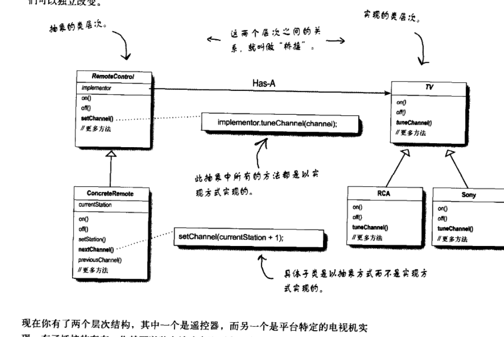

## Creating and Destroying Objects


### item1 Consider static factory methods instead of constructor


首先呢这里所提到`静态工厂方法`不是设计模式中的`静态工厂模式`，要做好区分，这里所提到就是，通过静态方法才产生实例化对象的，与构造器产生成的做对比，比如包装类型的`Boolean`的`valueof`方法。

```java
    public static Boolean valueOf(boolean b) {
        return (b ? TRUE : FALSE);
    }
```

 Boolean是不可变类有且只有两个实例（表示true，表示false），我平时引用的实例就是这两个。


都是相对于构造函数的优点

#### advantage 1 

**他们可以有专属的名字**

与构造器做对比，它可以有自己的名字，我们自定义它的名字，从它的名字上可以描述将要返回实例的特点。而 构造器名字固定，做不到这一点。例子：` BigInteger.probablePrime`,这个方法明确表示，可能返回大整数的实例。

如果通过改变构造器形参的顺序达到，可以返回不同的特点实例的做法是愚蠢的，这样会让人混淆。

遇到相同签名的情况可以通过静态工厂方法使用名字来表示他们的不同

#### advantage2

**不用每次都生成实例，提升性能**

​			它们可以做到不用每次都生成实例（与构造器做对比）,这时候我们就得提到不可变类（`immutable classes `），在java中有很多类是不可变类的,我返回的实例不可能被修改，我只预先生成一些实例或者是一边生成一边缓存就好，等调用的时候，已经实例完成，直接返回就好。极大的提升了性能。

​			String Boolean都是不可变类的，就拿Boolean来说，提供出去的实例是不可能被修改的，只会被不同的引用，而且只有两种类型的实例是true 和false。后来就会优化成了只有两种实例。而且静态工厂方法将只会返回其中一个，不必每次都会生成。

​		这样的话，对于不可变类来说没有完全相同的实例

#### advantage 3

**可以返回 方法表明类型的子类型，提供很大的灵活性和便利性**

​		这样的话可以隐藏一些子类的实现，就是返回的实例可能是内部私有类的实例，但是继承或实现需要返回的类型，在名字上指名返回实例类型的特点即可。这样的使可以提供简洁的API（使用者不用清楚太多的子类型，只知道父类或者接口类型怎么使用即可，这样便于掌握和使用），适用于基于**接口开发框架**（Item 20）。

​		java8之前，接口不允许有静态方法，接口相关的静态工厂方法一般我们会放在一个不能实例化的伴随类里面，比如 Collection和Collections,而且很多Collection的实现类很多都是内部类，我们不必去掌握，只知道其中的特性即可。例如

```java
  public static <T> List<T> singletonList(T o) {
        return new SingletonList<>(o);
    }
```

其中`SingletonList`只是一个内部类。

​	java 8，接口可以定义方法，所以我们一般我们可以将伴随类型的功能的转移到接口本身即可，但是java 8中接口的方法都还必须是共有不能是私有，这就到导致一些复杂的功能会抽离出的一些私有方法放到私有类中而不是接口中。java9支持静态的私有的方法。

#### **advantage4**

**根据不同的入参值，返回不同子类型实例**，还可以根据随着帆布版本不同的返回的子类实例也发生了变化

`EnumSet`举例来说，没有constructor方法，只有静态工厂方法，是一个抽象类，他的实现类有两个，都是隐藏的，会根据`enumType`

有多少个数返回不用的实例，<=64返回`RegularEnumSet`实例，>64 返回`JumboEnumSet`实例。

```java
    public static <E extends Enum<E>> EnumSet<E> of(E e) {
        EnumSet<E> result = noneOf(e.getDeclaringClass());
        result.add(e);
        return result;
    }
```


```java
    public static <E extends Enum<E>> EnumSet<E> noneOf(Class<E> elementType) {
        Enum<?>[] universe = getUniverse(elementType);
        if (universe == null)
            throw new ClassCastException(elementType + " not an enum");

        if (universe.length <= 64)
            return new RegularEnumSet<>(elementType, universe);
        else
            return new JumboEnumSet<>(elementType, universe);
    }
```


以后也有可能没有`JumboEnumSet`这个实现类，被他类代替了，对使用者是无关紧要的，只要是Enum的子类即可。


#### advantage5

**当我们编写所包含静态工厂方法的类说的时候，要返回的类型实现（实现类）可以不存在。---->服务提供框架**


​		静态工厂是`服务提供框架（service provider framworks）`基础，就拿JDBC来说吧，是java操作数据库API，不同的数据库有不同的实现类。当有一种新的数据库发布后，可以在编写实现类。

​		服务提供框架，是可以让多个provider同时实现的服务框架，并且各个provider之间和框架是解耦的。

服务提供框架的实现需要一下几个关键要点，

+ service interface 

  provider需要去实现的

+ provider registration api

  当provider按照规则接口实现服务了得把自己，注册到服务框架里面，这就需要服务提供框架去提供注册的api

+ service access API

  服务框架要带有可获得（access）的服务api，去实例化不同的服务实现，可以根据不同参数（规则）选择不同实现的实例。当缺少规则时就指定一个默认的实现实例，或者允许使用者获得所有的实例列表，自行去选择

+ （可选）service provider interface

  服务提供者接口，这是描述一个可以生成服务接口对应实例的工厂对象的接口。如果没有这种服务提供接者口就必须通过反射来，服务实现必须通过反射来实现。（还没理解，感觉怎么都需要反射？获得这个提供者，之后的获得真正实现的服务的时候就不用实现反射来获得）

以上的四点拿，JDBC来做类比

`Connection` ---->服务接口

在使用过程中真正需要的功能接口，连接不同的数据库有不同的实现


 `DriverManager.registerDriver`---->为服务提供者 注册接口

把已经实现的提供者注册到体系中，所需要的接口

 `DriverManager.getConnection`---->服务获得（access）接口

我总得拿到这个这个正真已经实现的服务

`Driver` 为服务提供者接口

所有的提供者要想实现自己对应的服务必须是这一个接口，并且注册进去。就可以通过服务接口框架来获得自己想要的实现，其实是一个工厂的抽象接口（当然这个工厂可以实例化，工厂方法不是静态的），提供这个必须实现这个接口来提供自己服务的实现。

```java

public interface Driver {

    //....
    Connection connect(String url, java.util.Properties info)
        throws SQLException;
    //.....

}

```

服务提供框架 其实有很多变种，桥接算一种，获取服务实例的接口有时候可以返回一个比提供者实现更丰富的接口。

提供者实现该实现，有些接口不需要provider去实现，其实就是组合已经实现的接口。




上面的电视机，遥控器包含一个抽象接口TV，provider实现这个接口就好，其他接口组合TV接口去进行实现。这就是上面所说的返回了一个更丰富 的接口。

java包含一个通用服务提供者框架，`java.util.ServiceLoader`，我们可以直接使用这个，不需要也不应该去实现自己的服务提供框架。JDBC比这个框架出现的要早，所以没用


#### shortcoming 1

**静态工厂方法如果返回的类对应的构造器不是public或者protect的话，就不能被继承实现。**

有很多很不错的类型不能被以继承的方式进行复用，是比较遗憾的。但是也还行，我们可以使用服务的方式进行复用功能。这是一个好习惯。


#### shortcoming1

静态工厂方法没有构造器方法显眼，使用者相对老说，比较难发现他们。静态工厂方法有时候不在对应返回的类中，在javadoc有时候就会很难发现

一些静态工厂方法的惯用名称来帮助大家理解其中的含义

+ form  --->一个类型转换方法

  表当的是相同，但是是不同的对象

  ```java
  Date d = Date.from(instant);
  ```

+ of-->聚合方法

  把分散的数据聚合起来，成一个对象

  ```java
  Set<Rank> faceCards = EnumSet.of(JACK, QUEEN, KING);
  ```

+ valueOf-->form+of 都可以

  ```java
  BigInteger prime = BigInteger.valueOf(Integer.MAX_VALUE);
  ```

+ instance or getInstance

  使用参数进行对要实例化的对象进行描述，然后实例出相应的实例来。

  ```java
  StackWalker luke = StackWalker.getInstance(options);
  ```

+ create  or  newInstance 和—Like  instance  or  getInstance差不多，但是这个方法名称保证了每次实例的都是新的实例，上面的不能保证。

  ```java
  Object newArray = Array.newInstance(classObject, arrayLen);
  ```

+ getType 和getIntance差不都，但是这个静态工厂方法不在要实例化的对应的类里面，这样的话就得知名要实例化的对象是什么对象

  ```java
  FileStore fs = Files.getFileStore(path);
  ```

+ newType

  Like newInstance, but used if the factory method is in a different class. Type is the type of object returned by the factory method, for example: 

  ```java
  BufferedReader br = Files.newBufferedReader(path);
  ```

+ type  `getType` + `newType` 都可代表

  ```java
  List<Complaint> litany = Collections.list(legacyLitany);
  ```

  

在设计的时候首先考虑静态工厂方法，然后在构造函数。