# 第 1 章 从c到c++

## 1.3  如何编译和运行C++程序

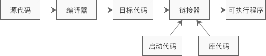

C++ 源文件的后缀则有些混乱，不同的编译器支持不同的后缀，下表是一个简单的汇总：

| 编译器 | Microsoft Visual C++ | GCC（GNU C++）       | Borland C++ | UNIX       |
| ------ | -------------------- | -------------------- | ----------- | ---------- |
| 后缀   | cpp、cxx、cc         | cpp、cxx、cc、c++、C | cpp         | C、cc、cxx |

推荐使用`.cpp`作为 C++ 源文件的后缀，这样更加通用和规范。


**Linux GCC下编译运行**

编译c语言程序

---编译单个源文件

```shell
gcc main.c
```

---编译多个源文件：

```shell
gcc main.c module.c
```

编译C++程序时，`gcc`命令也可以使用，不过要增加`-lstdc++`选项，否则会发生链接错误。

---编译单个源文件：

```shell
gcc main.cpp -lstdc++
```

---编译多个源文件

```shell
gcc main.cpp module.cpp -lstdc++
```

`gcc`命令在链接时默认使用C的库，只有添加了`-lstdc++`选项才会使用 C++ 的库。

​	

GCC 中还有一个`g++`命令，它专门用来编译 C++ 程序，广大 C++ 开发人员也都使用这个命令。

---编译单个源文件：

```shell
g++ main.cpp
```

---编译多个源文件

```shell
g++ main.cpp module.cpp
```

使用`-o`选项可以指定可执行文件的名称

```shell
g++ main.cpp -o demo
./demo
```

 

GCC 越发强大，增加了对 C++、Objective-C、Fortran、[Java](http://c.biancheng.net/java/) 等其他语言的支持，此时的 GCC 就成了一个编译器套件（套装），是所有编译器的总称。`gcj`命令用来编译 Java，`gccgo`命令用来编译Go语言。


## 1.4 C++命名空间（名字空间）详解

​		一个中大型软件往往由多名程序员共同开发，会使用大量的变量和函数，不可避免地会出现变量或函数的命名冲突。当所有人的代码都测试通过，没有问题时，将它们结合到一起就有可能会出现命名冲突。

​			例如小李和小韩都参与了一个文件管理系统的开发，它们都定义了一个全局变量 fp，用来指明当前打开的文件，将他们的代码整合在一起编译时，很明显编译器会提示 fp 重复定义（Redefinition）错误。

​		所有的程序都会编译连接到一块，可以把它想象成集成到一个文件中，函数名和变量名，如果作用范围有相交，就会要注意命名的冲突。

为了解决这个问题c++引入了命名空间

```c++
namespace Li{  //小李的变量定义
    FILE fp = NULL;
}
namespace Han{  //小韩的变量定义
    FILE fp = NULL
}
```

小李与小韩各自定义了以自己姓氏为名的命名空间，此时再将他们的 fp 变量放在一起编译就不会有任何问题。

> 命名空间有时也被称为名字空间、名称空间。

```c++
namespace name{
    //variables, functions, classes
}
```

`name`是命名空间的名字，它里面可以包含变量、函数、类、typedef、#define 等，最后由`{ }`包围。

```c++
Li::fp = fopen("one.txt", "r");  //使用小李定义的变量 fp
Han::fp = fopen("two.txt", "rb+");  //使用小韩定义的变量 fp
```

`::`是一个新符号，称为域解析操作符，在C++中用来指明要使用的命名空间。

也可以这么来操作，就不用指明，可以默认使用哪一个

```c++
using Li::fp;
fp = fopen("one.txt", "r");  //使用小李定义的变量 fp
Han :: fp = fopen("two.txt", "rb+");  //使用小韩定义的变量 fp ,如果使用小韩得默认来指明了

```

也可直接把命名空间里面的所有的定义都弄成默认的

```c++
using namespace Li;
fp = fopen("one.txt", "r");  //使用小李定义的变量 fp
Han::fp = fopen("two.txt", "rb+");  //使用小韩定义的变量 fp
```


## 1.5 C++头文件和std命名空间

早期c++是翻译成c来编译运行的，这是c++可能使用c的库(iostream.h、fstream.h、complex.h)

​	虽然 C++ 几乎完全兼容C语言，C语言的头文件在 C++ 中依然被支持，但 C++ 新增的库更加强大和灵活，请读者尽量使用这些 C++ 新增的头文件，例如 iostream、fstream、string 等。

挺重要的好好看看  http://c.biancheng.net/view/2193.html


## 1.6 C++的输入和输出

C++中可以使用原来C的，但C++自己也有一套

```c++
#include<iostream>
using namespace std;
int main(){
    int x;
    float y;
    cout<<"Please input an int number:"<<endl;
    cin>>x;
    cout<<"The int number is x= "<<x<<endl;
    cout<<"Please input a float number:"<<endl;
    cin>>y;
    cout<<"The float number is y= "<<y<<endl;   
    return 0;
}
```

```text
Please input an int number:
8↙
The int number is x= 8
Please input a float number:
7.4↙
The float number is y= 7.4
```

​		在编写 C++ 程序时，如果需要使用输入输出时，则需要包含头文件`iostream`，它包含了用于输入输出的对象，例如常见的`cin`表示标准输入、`cout`表示标准输出、`cerr`表示标准错误。

​		cout 和 cin 都是 C++ 的内置对象，而不是关键字。C++ 库定义了大量的类（Class），程序员可以使用它们来创建对象，cout 和 cin 就分别是 ostream 和 istream 类的对象，只不过它们是由标准库的开发者提前创建好的，可以直接拿来使用。这种在 C++ 中提前创建好的对象称为内置对象。

`endl`与c语言中的`\n`作用相同

```c++
#include<iostream>
using namespace std;
int main(){
    int x;
    float y;
    cout<<"Please input an int number and a float number:"<<endl;
    cin>>x>>y;
    cout<<"The int number is x= "<<x<<endl;
    cout<<"The float number is y= "<<y<<endl;   
    return 0;
}
```

```text
Please input an int number and a float number:
8 7.4↙
The int number is x= 8
The float number is y= 7.4   
```

输入运算符`>>`在读入下一个输入项前会忽略前一项后面的空格，所以数字 8 和 7.4 之间要有一个空格，当 cin 读入 8 后忽略空格，接着读取 7.4。


## 1.7 C++变量的定义位置


## 1.9 C++中的const又玩出了新花样


**C++中的 const 更像编译阶段的 #define**

```
const int m = 10;int n = m;
```

​		我们知道，变量是要占用内存的，即使被 const 修饰也不例外。m、n 两个变量占用不同的内存，`int n = m;`表示将 m 的值赋给 n，这个赋值的过程在C和C++中是有区别的。

​		在C语言中，编译器会先到 m 所在的内存取出一份数据，再将这份数据赋给 n；而在C++中，编译器会直接将 10 赋给 n，没有读取内存的过程，和`int n = 10;`的效果一样。C++ 中的常量更类似于`#define`命令，是一个值替换的过程，只不过`#define`是在预处理阶段替换，而常量是在编译阶段替换。C所以说C++的编译器更加智能


通过指针修改被const修改的变量

```c++
#include <stdio.h>
int main(){
    const int n = 10;
    int *p = (int*)&n;  //必须强制类型转换
    *p = 99;  //修改const变量的值
    printf("%d\n", n);
    return 0;
}
```

> 注意，`&n`得到的指针的类型是`const int *`，必须强制转换为`int *`后才能赋给 p，否则类型是不兼容的。

​		将代码放到`.c`文件中，以C语言的方式编译，运行结果为`99`。再将代码放到`.cpp`文件中，以C++的方式编译，运行结果就变成了`10`。这种差异正是由于C和C++对 const 的处理方式不同造成的。(C++编译器直接用数值替换，而C又重新去了一遍内存)

**C++ 对 const 的处理更像是编译时期的`#define`，是一个值替换的过程。**

​			**C和C++中全局 const 变量的作用域相同，都是当前文件，不同的是它们的可见范围：C语言中 const 全局变量的可见范围是整个程序，在其他文件中使用 extern 声明后就可以使用；而C++中 const 全局变量的可见范围仅限于当前文件，在其他文件中不可见，所以它可以定义在头文件中，多次引入后也不会出错。**


如果你使用的是 GCC，那么可以通过添加 extern 关键字来增大 C++ 全局 const 变量的可见范围，如下所示：

extern const int n = 10;

这样 n 的可见范围就变成了整个程序，在其他文件中使用 extern 声明后就可以使用了。不过这种方式只适用于 GCC，不适用于 VS/VC。

​		C++ 中的 const 变量虽然也会占用内存，也能使用`&`获取得它的地址，但是在使用时却更像编译时期的`#define`；`#define`也是值替换，可见范围也仅限于当前文件。


## 1.10 C++ new和delete运算符简介

在C语言中，动态分配内存用 malloc() 函数，释放内存用 free() 函数。

```c
int *p = (int*) malloc( sizeof(int) * 10 );  //分配10个int型的内存空间
free(p);  //释放内存
```

在[C++](http://c.biancheng.net/cplus/)中，这两个函数仍然可以使用，但是C++又新增了两个关键字，new 和 delete：new 用来动态分配内存，delete 用来释放内存。

用 new 和 delete 分配内存更加简单：

```c++
int *p = new int;  //分配1个int型的内存空间
delete p;  //释放内存
```

new 操作符会根据后面的数据类型来推断所需空间的大小。

如果希望分配一组连续的数据，可以使用 new[]：

```c++
int *p = new int[10];  //分配10个int型的内存空间
delete[] p;
```

用 new[] 分配的内存需要用 delete[] 释放，它们是一一对应的。


## 1.11 C++内联函数


​	C++程序的本质其实就是多个函数之间相互调用，形成一个简单或者复杂的调用链条。链条的起点是main函数。函数的调用需要一个准备过程。这个过程需要一定的时间和空间的开销。

​		程序在执行一个函数之前需要做一些准备工作，要将实参、局部变量、返回地址以及若干寄存器都压入栈中，然后才能执行函数体中的代码；函数体中的代码执行完毕后还要清理现场，将之前压入栈中的数据都出栈，才能接着执行函数调用位置以后的代码。

​	多以如果函数体的代码较小的情况下，那么就不值当进行函数调用了。C++提出一种函数就是内联函数。这种函数特性就是在编译时将函数调用处用函数体替换。

```c++
#include <iostream>
using namespace std;
//内联函数，交换两个数的值
inline void swap(int *a, int *b){
    int temp;
    temp = *a;
    *a = *b;
    *b = temp;
}
int main(){
    int m, n;
    cin>>m>>n;
    cout<<m<<", "<<n<<endl;
    swap(&m, &n);  //16行
    cout<<m<<", "<<n<<endl;
    return 0;
}
```

> 注意，要在函数定义处添加 inline 关键字，在函数声明处添加 inline 关键字虽然没有错，但这种做法是无效的，编译器会忽略函数声明处的 inline 关键字。

编译器遇到函数调用`swap(&m, &n)`时，会用 swap() 函数的代码替换`swap(&m, &n)`，同时用实参代替形参。这样，程序第 16 行就被置换成：

```c++
int temp;
temp = *(&m);
*(&m) = *(&n);
*(&n) = temp;
```

编译器可能会将 *(&m)、*(&n) 分别优化为 m、n。

> 对函数作 inline 声明只是程序员对编译器提出的一个建议，而不是强制性的，并非一经指定为 inline 编译器就必须这样做。编译器有自己的判断能力，它会根据具体情况决定是否这样做。


## 1.12 内联函数也可以用来代替宏

之前讲到过，宏就是简单的文本替换，宏也可以带参数，没有什么别的。回顾一下

```c++
#include <iostream>
using namespace std;
#define SQ(y) y*y
int main(){
    int n, sq;
    cin>>n;
    sq = SQ(n);
    cout<<sq<<endl;
    return 0;
}
```

当我们把`SQ(n)`修改成`SQ(n+1)`，这样情况会出现一些变化。

```c++
#include <iostream>
using namespace std;
#define SQ(y) y*y
int main(){
    int n, sq;
    cin>>n;
    sq = SQ(n+1);
    cout<<sq<<endl;
    return 0;
}
```

```text
9↙
19
```

因为就是单纯的文本替换，替换后记过就是 n+1*n+1 ，当输入9的时候结果就是19

把宏改成下面的方式就会时正确的了

`#define SQ(y) ( (y)*(y) )`

由此可见，宏的时候很容易出错，所以再c++中我们更加推荐使用内联函数

```c++
#include <iostream>
using namespace std;
inline int SQ(int y){ return y*y; }
int main(){
    int n, sq;
    cin>>n;
    //SQ(n)
    sq = SQ(n);
    cout<<sq<<endl;
    //SQ(n+1)
    sq = SQ(n+1);
    cout<<sq<<endl;
    //200 / SQ(n+1)
    sq = 200 / SQ(n+1);
    cout<<sq<<endl;
    return 0;
}
```

​	和宏一样，内联函数可以定义在头文件中（不用加 static 关键字），并且头文件被多次`#include`后也不会引发重复定义错误。这一点和非内联函数不同，非内联函数是禁止定义在头文件中的，它所在的头文件被多次`#include`后会引发重复定义错误。

​		内联函数在编译时会将函数调用处用函数体替换，编译完成后函数就不存在了，所以在链接时不会引发重复定义错误。这一点和宏很像，宏在预处理时被展开，编译时就不存在了。从这个角度讲，内联函数更像是编译期间的宏。

​		综合本节和上节的内容，可以看到内联函数主要有两个作用，一是消除函数调用时的开销，二是取代带参数的宏。


## 1.13规范使用内联函数

内联函数不应该有声明，应该将函数定义放在本应该出现函数声明的地方，这是一种良好的编程风格。

​		我们通常将函数的定义放在源文件中，将函数的声明放在头文件中，希望调用函数时，引入对应的头文件即可，我们鼓励这种将函数定义和函数声明分开的做法。但这种做法不适用于内联函数

​			内联函数看起来简单，但是有很多细节需要注意，从代码重复利用的角度讲，内联函数已经不再是函数了。我认为将内联函数作为带参宏的替代方案更为靠谱，而不是真的当做函数使用。

在多文件编程时，我建议将内联函数的定义直接放在头文件中，并且禁用内联函数的声明（声明是多此一举）。


## 1.14 函数的默认参数详解

默认参数，指的是当函数调用中省略了实参时自动使用的一个值，这个值就是给形参指定的默认值

```c++
#include<iostream>
using namespace std;
//带默认参数的函数
void func(int n, float b=1.2, char c='@'){
    cout<<n<<", "<<b<<", "<<c<<endl;
}
int main(){
    //为所有参数传值
    func(10, 3.5, '#');
    //为n、b传值，相当于调用func(20, 9.8, '@')
    func(20, 9.8);
    //只为n传值，相当于调用func(30, 1.2, '@')
    func(30);
    return 0;
}
```

```text
10, 3.5, #
20, 9.8, @
30, 1.2, @
```

C++规定，默认参数只能放在形参列表的最后，而且一旦为某个形参指定了默认值，那么它后面的所有形参都必须有默认值。


## 1.15 在声明中还是定义中指定默认参数

```c++
#include <iostream>
using namespace std;
void func(int a, int b = 10, int c = 36);
int main(){
    func(99);
    return 0;
}
void func(int a, int b = 10, int c = 36){
    cout<<a<<", "<<b<<", "<<c<<endl;
}
```

编译报错

把func() 函数的定义放到其他源文件中，就不会编译报错

> 这是因为C++ 规定，在给定的作用域中只能指定一次默认参数。


> C语言有四种作用域，分别是函数原型作用域、局部作用域（函数作用域）、块作用域、文件作用域（全局作用域），C++ 也有这几种作用域。


**多次声明同一函数**

不过有一点需要注意，在给定的作用域中一个形参只能被赋予一次默认参数。

```c++
#include <iostream>
using namespace std;
//多次声明同一个函数
void func(int a, int b, int c = 36);
void func(int a, int b = 5, int c);
int main(){
    func(99);
    return 0;
}
```

这种声明方式是正确的。第一次声明时为 c 指定了默认值，第二次声明时为 b 指定了默认值；第二次声明是添加默认参数。需要提醒的是，第二次声明时不能再次给 c 指定默认参数，否则就是重复声明同一个默认参数。

## 1.16 C++函数重载详解

注意，参数列表不同包括参数的个数不同、类型不同或顺序不同，仅仅参数名称不同是不可以的。函数返回值也不能作为重载的依据。

函数的重载的规则：

- 函数名称必须相同。
- 参数列表必须不同（个数不同、类型不同、参数排列顺序不同等）。
- 函数的返回类型可以相同也可以不相同。
- 仅仅返回类型不同不足以成为函数的重载。

**C++ 是如何做到函数重载的**

​	C++代码在编译时会根据参数列表对函数进行重命名，例如`void Swap(int a, int b)`会被重命名为`_Swap_int_int`，`void Swap(float x, float y)`会被重命名为`_Swap_float_float`。当发生函数调用时，编译器会根据传入的实参去逐个匹配，以选择对应的函数，如果匹配失败，编译器就会报错，这叫做重载决议（Overload Resolution）。

> 不同的编译器有不同的重命名方式，这里仅仅举例说明，实际情况可能并非如此。

从这个角度讲，函数重载仅仅是语法层面的，本质上它们还是不同的函数，占用不同的内存，入口地址也不一样。


## 1.17 重载过程中的二义性和类型转换

```c++
#include <iostream>
using namespace std;
//1号函数
void func(char ch){
    cout<<"#1"<<endl;
}
//2号函数
void func(int n){
    cout<<"#2"<<endl;
}
//3号函数
void func(long m){
    cout<<"#3"<<endl;
}
//4号函数
void func(double f){
    cout<<"#4"<<endl;
}
int main(){
    short s = 99;
    float f = 84.6;
   
    func('a');  //不需要类型转换，调用func(char)
    func(s);  //将short转换成int，调用func(int)
    func(49);  //不需要类型转换，调用func(int)
    func(f);  //将float转换成double，调用func(double)
    return 0;
}
```

```text
#1
#2
#2
#4
```


看下面这个怎么调用


```c++
#include <iostream>
using namespace std;
//1号函数
void func(char ch){
    cout<<"#1"<<endl;
}
//3号函数
void func(long m){
    cout<<"#3"<<endl;
}
//4号函数
void func(double f){
    cout<<"#4"<<endl;
}
int main(){
    short s = 99;
    float f = 84.6;
  
    func('a');
    func(s);
    func(49);
    func(f);
    return 0;
}


```


C++ 标准规定，在进行重载决议时编译器应该按照下面的优先级顺序来处理实参的类型：


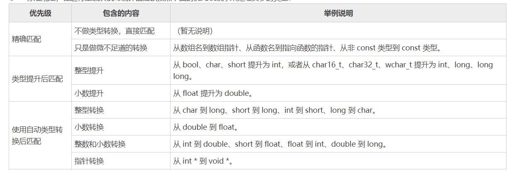


在例2中，`func(s)`、`func(49)`没有精确匹配的重载函数，将它们的类型都提升为 int 后仍然不能匹配，接下来进入自动类型转换阶段，发现 s 被转换为 char（整型转换）、long（整型转换）、double（整数和小数转换）后都有比较合适的函数，而且它们在同一个优先级中，谁也不比谁优秀，调用哪个都一样，产生了二义性，所以编译器会报错。

​		注意，类型提升和类型转换不是一码事！类型提升是积极的，是为了更加高效地利用计算机硬件，不会导致数据丢失或精度降低；而类型转换是不得已而为之，不能保证数据的正确性，也不能保证应有的精度。类型提升只有上表中列出的几种情况，其他情况都是类型转换。

**多个参数时的二义性**

- 该函数对每个实参的匹配都不劣于其他函数；
- 至少有一个实参的匹配优于其他函数。

假设现在有以下几个函数原型：

```c++
void func(int, int);  //①
void func(char, int, float);  //②
void func(char, long, double);  //③
```

我们来分析如下的调用会发生什么情况：

```c++
short n = 99;
func('@', n, 99);
func('@', n, 99.5);
```

1) 先来看第一个函数调用。如果只考虑第一个实参`'@'`，那么②③两个函数都能够精确匹配，谁也不比谁优秀，是平等的；如果只考虑第二个实参`n`，对于②，需要把 short 提升为 int（类型提升），对于③，需要把 short 转换为 long（类型转换），类型提升的优先级高于类型转换，所以②胜出；如果只考虑第三个实参`99`，②③都要进行类型转换，没有哪一个能胜出，它们是平等的。

从整体上看，②③在第一、三个实参的匹配中是平等的，但②在第二个实参的匹配中胜出，也就是说，②对每个实参的匹配都不劣于③，但有一个实参的匹配优于③，所以②最终脱颖而出，成为被调用函数。

2) 再来看第二个函数调用。只考虑第一个实参时②③是平等的，没有谁胜出；只考虑第二个实参时②胜出；只考虑第三个实参时，②需要类型转换，③能够精确匹配，精确匹配的优先级高于类型转换，所以③胜出。

从整体上看，②③在第一个实参的匹配中是平等的，②在第二个实参的匹配中胜出，③在第三个实参的匹配中胜出，它们最终“打成了平手”，分不清孰优孰劣，所以编译器不知道如何抉择，会产生二义性错误。

## 1.18 C++和C的混合编程？

​		C++ 和 C 可以进行混合编程。但需要注意的是，由于 C++ 和 C 在程序的编译、链接等方面都存在一定的差异，而这些差异往往会导致程序运行失败。

```c++
//myfun.h
void display();
//myfun.c
#include <stdio.h>
#include "myfun.h"
void display(){
   printf("C++：http://c.biancheng/net/cplus/");
}
//main.cpp
#include <iostream>
#include "myfun.h"
using namespace std;
int main(){
   display();
   return 0;
}
```

```
In function `main': undefined reference to `display()'
```

如上是调用 GCC 编译器运行此项目时给出的错误信息，指的是编译器无法找到 main.cpp 文件中 display() 函数的实现代码。导致此错误的原因，就是因为 C++ 和 C 编译程序的方式存在差异。

之所以 C++ 支持函数的重载，是因为 C++ 会在程序的编译阶段对函数的函数名进行“再次重命名”，例如：

- void Swap(int a, int b) 会被重命名为`_Swap_int_int`；
- void Swap(float x, float y) 会被重命名为`_Swap_float_float`。

显然通过重命名，可以有效避免编译器在程序链接阶段无法找到对应的函数。

​		但是，C 语言是不支持函数重载的，它不会在编译阶段对函数的名称做较大的改动。仍以 void Swap(int a, int b) 和 void Swap(float x, float y) 为例，若以 C 语言的标准对它们进行编译，两个函数的函数名将都是`_Swap`。

>  不同的编译器有不同的重命名方式，但根据 C++ 标准编译后的函数名几乎都由原有函数名和各个参数的数据类型构成，而根据 C 语言标准编译后的函数名则仅有原函数名构成。这里仅仅举例说明，实际情况可能并非如此。

​		使用 C 和 C++ 进行混合编程时，考虑到对函数名的处理方式不同，势必会造成编译器在程序链接阶段无法找到函数具体的实现，导致链接失败。

幸运的是，C++ 给出了相应的解决方案，即借助 extern "C"，就可以轻松解决 C++ 和 C 在处理代码方式上的差异性。

**extern "C"**

extern "C" 既可以修饰一句 C 代码，也可以修饰一段 C++ 代码，它的功能是让编译器以处理 C 语言代码的方式来处理修饰的 C++ 代码。

为了避免 display() 函数以不同的编译方式处理，我们应该使其在 main.cpp 文件中仍以 C 语言代码的方式处理，这样就可以解决函数名不一致的问题。因此，可以像如下这样来修改 myfun.h：

```
#ifdef __cplusplusextern "C" void display();#elsevoid display();#endif
```

可以看到，当 myfun.h 被引入到 C++ 程序中时，会选择带有 extern "C" 修饰的 display() 函数；反之如果 myfun.h 被引入到 C 语言程序中，则会选择不带 extern "C" 修饰的 display() 函数。由此，无论 display() 函数位于 C++ 程序还是 C 语言程序，都保证了 display() 函数可以按照 C 语言的标准来处理。

再次运行该项目，会发现之前的问题消失了，可以正常运行：

C++：http://c.biancheng/net/cplus/


在实际开发中，对于解决 C++ 和 C 混合编程的问题，通常在头文件中使用如下格式：

```
#ifdef __cplusplusextern "C" {#endifvoid display();#ifdef __cplusplus}#endif
```

由此可以看出，extern "C" 大致有 2 种用法，当仅修饰一句 C++ 代码时，直接将其添加到该函数代码的开头即可；如果用于修饰一段 C++ 代码，只需为 extern "C" 添加一对大括号`{}`，并将要修饰的代码囊括到括号内即可。


# 第2章 类和对象（class 和object）

## 2.1 类的定义和对象的创建详解

每一个对象都是类的一个具体实例，创建对象的过程中叫做类的实例化。

类的成员变量叫做类的属性，类的成员函数叫做类的方法。

与结构体一样，类是一种复杂类型的声明，不占有内存空间（只存放在代码区）。对象是类这种数据类型的变量。

**类的定义**

```c++
class Student{
public:
    //成员变量
    char *name;
    int age;
    float score;
    //成员函数
    void say(){
        cout<<name<<"的年龄是"<<age<<"，成绩是"<<score<<endl;
    }
};
```

注意最后面的 `;` 不能省略

**创建对象**

```c++
class Student LiLei;  //正确
Student LiLei;  //同样正确
```

创建对象数组

```c++
Student allStu[100];
```

**访问类的成员**

`.`来访问成员变量和成员函数

```c++
include <iostream>
using namespace std;
//类通常定义在函数外面
class Student{
public:
    //类包含的变量
    char *name;
    int age;
    float score;
    //类包含的函数
    void say(){
        cout<<name<<"的年龄是"<<age<<"，成绩是"<<score<<endl;
    }
};
int main(){
    //创建对象
    Student stu;
    stu.name = "小明";
    stu.age = 15;
    stu.score = 92.5f;
    stu.say();
    return 0;
}
```

**使用对象指针**

```c++
Student stu;  //在栈上分配内存
Student *pStu = &stu;
```

也可以在堆上分配内存

```c++
Student *pStu = new Student;
```

使用new 在堆上声明一个对象，是没有名字，只能用指针指向它。（new 返回地址）

栈内存是程序自动管理的（执行完对应的方法就会自动释放相应堆上的对象），堆上的内存是由程序员管理的，对象使用完之后必须手动`delete`删除对象。

```c++
#include <iostream>
using namespace std;
class Student{
public:
    char *name;
    int age;
    float score;
    void say(){
        cout<<name<<"的年龄是"<<age<<"，成绩是"<<score<<endl;
    }
};
int main(){
    Student *pStu = new Student;
    pStu -> name = "小明";
    pStu -> age = 15;
    pStu -> score = 92.5f;
    pStu -> say();
    delete pStu;  //删除对象
    return 0;
}
```

通过对象名字访问成员使用点号`.`，通过对象指针访问成员使用箭头`->`

## 2.2 类的成员变量和成员函数详解

**成员函数的定义**

```c++
class Student{
public:
    //成员变量
    char *name;
    int age;
    float score;
    //成员函数
    void say(){
        cout<<name<<"的年龄是"<<age<<"，成绩是"<<score<<endl;
    }
};
```

成员函数既可以在类中定义，也可以在类里面声明，类外定义,就像下面。

 ```c++
class Student{
public:
    //成员变量
    char *name;
    int age;
    float score;
    //成员函数
    void say();  //函数声明
};
//函数定义
void Student::say(){
    cout<<name<<"的年龄是"<<age<<"，成绩是"<<score<<endl;
}
 ```

**类体中和类体外定义成员函数的区别**

类中定义的成员函数，是默认是成为内联函数。所以类中定义函数如果加上`inline`的话，其实是多余的。

如果类外定义想成为内联函数的话,如下方式

```c++
class Student{
public:
    char *name;
    int age;
    float score;
    void say();  //内联函数声明，可以增加 inline 关键字，但编译器会忽略
};
//函数定义
inline void Student::say(){
    cout<<name<<"的年龄是"<<age<<"，成绩是"<<score<<endl;
}
```

​		 [C++](http://c.biancheng.net/cplus/) 支持将内联函数定义在类的外部，但我强烈建议将函数定义在类的内部，这样它会自动成为内联函数，何必费力不讨好地将它定义在类的外部呢，这样并没有任何优势。

## 2.3 类成员的访问权限以及类的封装

 public、protected、private 三个关键字来控制成员变量和成员函数的访问权限

> C++ 中的 public、private、protected 只能修饰类的成员，不能修饰类，C++中的类没有共有私有之分。

```c++
#include <iostream>
using namespace std;
//类的声明
class Student{
private:  //私有的
    char *m_name;
    int m_age;
    float m_score;
public:  //共有的
    void setname(char *name);
    void setage(int age);
    void setscore(float score);
    void show();
};
//成员函数的定义
void Student::setname(char *name){
    m_name = name;
}
void Student::setage(int age){
    m_age = age;
}
void Student::setscore(float score){
    m_score = score;
}
void Student::show(){
    cout<<m_name<<"的年龄是"<<m_age<<"，成绩是"<<m_score<<endl;
}
int main(){
    //在栈上创建对象
    Student stu;
    stu.setname("小明");
    stu.setage(15);
    stu.setscore(92.5f);
    stu.show();
    //在堆上创建对象
    Student *pstu = new Student;
    pstu -> setname("李华");
    pstu -> setage(16);
    pstu -> setscore(96);
    pstu -> show();
    return 0;
}
```

>  在实际开发中，我们通常将类的声明放在头文件中，而将成员函数的定义放在源文件中。


​	成员变量大都以`m_`开头，这是约定成俗的写法，不是语法规定的内容。以`m_`开头既可以一眼看出这是成员变量，又可以和成员函数中的形参名字区分开。

**简单地谈类的封装**


**对private和public的更多说明**

如果既不写 private 也不写 public，就默认为 private。


## 2.4 对象的内存模型

对象的存储结构是什么样的


成员变量在堆区或者栈区分配内存，成员函数在代码区分配内存。编译器都会表明这些事情。

```c++
#include <iostream>
using namespace std;
class Student{
private:
    char *m_name;
    int m_age;
    float m_score;
public:
    void setname(char *name);
    void setage(int age);
    void setscore(float score);
    void show();
};
void Student::setname(char *name){
    m_name = name;
}
void Student::setage(int age){
    m_age = age;
}
void Student::setscore(float score){
    m_score = score;
}
void Student::show(){
    cout<<m_name<<"的年龄是"<<m_age<<"，成绩是"<<m_score<<endl;
}
int main(){
    //在栈上创建对象
    Student stu;
    cout<<sizeof(stu)<<endl;
    //在堆上创建对象
    Student *pstu = new Student();
    cout<<sizeof(*pstu)<<endl;
    //类的大小
    cout<<sizeof(Student)<<endl;
    return 0;
}
```

```c++
12
12
12
```

可以看出来只计算了成员变量的大小，并没有把成员函数也包含在内。

对象的内存分布如下


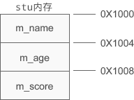


也会有内存对齐问题

## 2.5 C++函数编译原理和成员函数的实现

**函数编译**

c语言函数名字的编译的时候名字不变或者只是在最前面加上下划线，例如`func`编译成`_func`。

  C++对函数编译进行命名的时候就比较复杂，根据它所在的命名空间、它所属的类、以及它的参数列表（也叫参数签名）等信息进行重新命名，重命名的过程叫做名字编码（Name Mangling），是通过一种特殊的算法来实现的。

通过一些报错信息，我们可以发现它的重命名

 ```c++
#include <iostream>
using namespace std;
void display();
void display(int);
namespace ns{
    void display();
}
class Demo{
public:
    void display();
};
int main(){
    display();
    display(1);
    ns::display();
    Demo obj;
    obj.display();
    return 0;
}
 ```

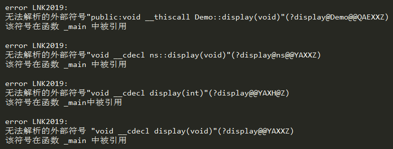


**成员函数的调用**

成员函数最终会被编译器编译成了与对象无关的全局函数。

当成员函数使用到了成员变量怎么办？ 在原来的函数加上一个参数，把当前对象通过`this`传输进去。

下面模拟一下

编译前：

```c++
void Demo::display(){
    cout<<a<<endl;
    cout<<b<<endl;
}
```

编译后：

```c++
void new_function_name(Demo * const p){
    //通过指针p来访问a、b
    cout<<p->a<<endl;
    cout<<p->b<<endl;
}
```

调用的话

编译前：

```c++
obj.display()
```

编译后

```c++
new_function_name(&obj);
```


## 2.6 构造函数详解

**构造函数**

函数名字和类名一样，没有返回值。用户不需要显式调用，创建对象的时候自动执行。有了构造函数就可以对成员变量进行批量的设置值。不用一个一个的去Set了

```c++
#include <iostream>
using namespace std;
class Student{
private:
    char *m_name;
    int m_age;
    float m_score;
public:
    //声明构造函数
    Student(char *name, int age, float score);
    //声明普通成员函数
    void show();
};
//定义构造函数
Student::Student(char *name, int age, float score){
    m_name = name;
    m_age = age;
    m_score = score;
}
//定义普通成员函数
void Student::show(){
    cout<<m_name<<"的年龄是"<<m_age<<"，成绩是"<<m_score<<endl;
}
int main(){
    //创建对象时向构造函数传参
    Student stu("小明", 15, 92.5f);
    stu.show();
    //创建对象时向构造函数传参
    Student *pstu = new Student("李华", 16, 96);
    pstu -> show();
    return 0;
}
```


怎么给构造函数传参 `Student stu("小明", 15, 92.5f)`,这个是在栈上创建对象的。在堆上创建对象`new Student("李华", 16, 96)`。

构造函数必须是 public 属性的，否则创建对象时无法调用。


**构造函数的重载**

函数可以像普通函数一样支持重载

当我们没有定义构造函数的时候，默认会为我们定义一个无参构造函数

```c++
Student(){}
```

`Student stu`或者`new Student`会调用无参构造参数，一餐我们定义了有参的构造参数，我们就不能这样来实例化对象了。


## 2.7 构造函数初始化列表

```c++
#include <iostream>
using namespace std;
class Student{
private:
    char *m_name;
    int m_age;
    float m_score;
public:
    Student(char *name, int age, float score);
    void show();
};
//采用初始化列表
Student::Student(char *name, int age, float score): m_name(name), m_age(age), m_score(score){
    //TODO:
}
void Student::show(){
    cout<<m_name<<"的年龄是"<<m_age<<"，成绩是"<<m_score<<endl;
}
int main(){
    Student stu("小明", 15, 92.5f);
    stu.show();
    Student *pstu = new Student("李华", 16, 96);
    pstu -> show();
    return 0;
}
```

也可以部分

```c++
Student::Student(char *name, int age, float score): m_name(name){
    m_age = age;
    m_score = score;
}
```

成员变量的初始化顺序与初始化列表中列出的变量的顺序无关，它只与成员变量在类中声明的顺序有关

**初始化 const 成员变量**

```c++
class VLA{
private:
    const int m_len;
    int *m_arr;
public:
    VLA(int len);
};
//必须使用初始化列表来初始化 m_len
VLA::VLA(int len): m_len(len){
    m_arr = new int[len];
}
```

下面是<font color='red'>错误</font>的

```c++
class VLA{
private:
    const int m_len;
    int *m_arr;
public:
    VLA(int len);
};
VLA::VLA(int len){
    m_len = len;
    m_arr = new int[len];
}
```

## 2.8析构函数

析构函数在对象销毁的时候自动执行，不需要显示的调用。析构函数的名字为`~类名` ，

> 析构函数没有参数，不能被重载，因此一个类只能有一个析构函数。如果用户没有定义，编译器会自动生成一个默认的析构函数。

在堆上的需要我们手动释放

```c++
#include <iostream>
using namespace std;
class VLA{
public:
    VLA(int len);  //构造函数
    ~VLA();  //析构函数
public:
    void input();  //从控制台输入数组元素
    void show();  //显示数组元素
private:
    int *at(int i);  //获取第i个元素的指针
private:
    const int m_len;  //数组长度
    int *m_arr; //数组指针
    int *m_p;  //指向数组第i个元素的指针
};
VLA::VLA(int len): m_len(len){  //使用初始化列表来给 m_len 赋值
    if(len > 0){ m_arr = new int[len];  /*分配内存*/ }
    else{ m_arr = NULL; }
}
VLA::~VLA(){
    delete[] m_arr;  //释放内存 数组销毁后，这些内存不会自动释放（在堆上），所以需要我们手动释放
}
void VLA::input(){
    for(int i=0; m_p=at(i); i++){ cin>>*at(i); }
}
void VLA::show(){
    for(int i=0; m_p=at(i); i++){
        if(i == m_len - 1){ cout<<*at(i)<<endl; }
        else{ cout<<*at(i)<<", "; }
    }
}
int * VLA::at(int i){
    if(!m_arr || i<0 || i>=m_len){ return NULL; }
    else{ return m_arr + i; }
}
int main(){
    //创建一个有n个元素的数组（对象）
    int n;
    cout<<"Input array length: ";
    cin>>n;
    VLA *parr = new VLA(n);
    //输入数组元素
    cout<<"Input "<<n<<" numbers: ";
    parr -> input();
    //输出数组元素
    cout<<"Elements: ";
    parr -> show();
    //删除数组（对象）
    delete parr;
    return 0;
}
```


**析构函数的执行时机**

执行的时机和对象所在的内存区域有关。

函数之外创建的对象是全局对象（类似与全局变量），位于内存分区中的全数据区，只有在程序执行结束的时候才调用对象的析构函数。

函数内部创建的对象是局部对象，它和局部变量类似，位于栈区，函数执行结束时会调用这些对象的析构函数。

new 创建的对象位于堆区，通过 delete 删除时才会调用析构函数；如果没有 delete，析构函数就不会被执行。

```c++
#include <iostream>
#include <string>
using namespace std;
class Demo{
public:
    Demo(string s);
    ~Demo();
private:
    string m_s;
};
Demo::Demo(string s): m_s(s){ }
Demo::~Demo(){ cout<<m_s<<endl; }
void func(){
    //局部对象
    Demo obj1("1");
}
//全局对象
Demo obj2("2");
int main(){
    //局部对象
    Demo obj3("3");
    //new创建的对象
    Demo *pobj4 = new Demo("4");
    func();
    cout<<"main"<<endl;
  
    return 0;
}
```

```text
1
main
3
2
```

## 2.9  C++对象数组（数组的每个元素都是对象）

对象数组，数组中的每一项都是对象。这些对象是怎么初始化的，调用哪些构造函数。

```c++
#include<iostream>
using namespace std;
class CSample{
public:
    CSample(){  //构造函数 1
        cout<<"Constructor 1 Called"<<endl;
    }
    CSample(int n){  //构造函数 2
        cout<<"Constructor 2 Called"<<endl;
    }
};
int main(){
    cout<<"stepl"<<endl;
    CSample arrayl[2];
    cout<<"step2"<<endl;
    CSample array2[2] = {4, 5};
    cout<<"step3"<<endl;
    CSample array3[2] = {3};
    cout<<"step4"<<endl;
    CSample* array4 = new CSample[2];
    delete [] array4;
    return 0;
}
```

输出结果

```c++
stepl
Constructor 1 Called
Constructor 1 Called
step2
Constructor 2 Called
Constructor 2 Called
step3
Constructor 2 Called
Constructor 1 Called
step4
Constructor 1 Called
Constructor 1 Called
```

构造函数含有多个参数时

```c++
class CTest{
public:
    CTest(int n){ }  //构造函数(1)
    CTest(int n, int m){ }  //构造函数(2)
    CTest(){ }  //构造函数(3)
};
int main(){
    //三个元素分别用构造函数(1)、(2)、(3) 初始化
    CTest arrayl [3] = { 1, CTest(1,2) };
    //三个元素分别用构造函数(2)、(2)、(1)初始化
    CTest array2[3] = { CTest(2,3), CTest(1,2), 1};
    //两个元素指向的对象分别用构造函数(1)、(2)初始化
    CTest* pArray[3] = { new CTest(4), new CTest(1,2) };
    return 0;
}
```

​		pArray 数组是一个指针数组，其元素不是 CTest 类的对象，而是 CTest 类的指针。第 13 行对 pArray[0] 和 pArray[1] 进行了初始化，把它们初始化为指向动态分配的 CTest 对象的指针，而这两个动态分配出来的 CTest 对象又分别是用构造函数（1）和构造函数（2）初始化的。pArray[2] 没有初始化，其值是随机的，不知道指向哪里

## 2.10 成员对象和封闭类详解

类的成员变量为某个类的对象，则称之为成员对象

**成员对象的初始化**

用初始化列表构建成员对象

```c++
类名::构造函数名(参数表): 成员变量1(参数表), 成员变量2(参数表), ...
{
    //TODO:
}
```

```c++
class Car{
public:
    Car(int price, int radius, int width);
    void show() const;
private:
    int m_price;  //价格
    Tyre m_tyre;
    Engine m_engine;
};
Car::Car(int price, int radius, int width): m_price(price), m_tyre(radius, width)/*指明m_tyre对象的初始化方式*/{ };
```

。在这种情况下，编译器就认为 m_engine 应该用 Engine 类的无参构造函数初始化。而 Engine 类确实有一个无参构造函数（因为设置了默认参数），因此，整个 car 对象的初始化问题就都解决了。

>  ，如果 Car 类的构造函数没有初始化列表，那么第 51 行就会编译出错，因为编译器不知道该如何初始化 car.m_tyre 对象，因为 Tyre 类没

**成员对象的消亡**

   封闭类对象生成时，先执行所有成员对象的构造函数，然后才执行封闭类自己的构造函数。成员对象构造函数的执行次序和成员对象在类定义中的次序一致，与它们在构造函数初始化列表中出现的次序无关。

> 当封闭类对象消亡时，先执行封闭类的析构函数，然后再执行成员对象的析构函数，成员对象析构函数的执行次序和构造函数的执行次序相反，即先构造的后析构

```c++
#include<iostream>
using namespace std;
class Tyre {
public:
    Tyre() { cout << "Tyre constructor" << endl; }
    ~Tyre() { cout << "Tyre destructor" << endl; }
};
class Engine {
public:
    Engine() { cout << "Engine constructor" << endl; }
    ~Engine() { cout << "Engine destructor" << endl; }
};
class Car {
private:
    Engine engine;
    Tyre tyre;
public:
    Car() { cout << "Car constructor" << endl; }
    ~Car() { cout << "Car destructor" << endl; }
};
int main() {
    Car car;
    return 0;
}
```

```text
Engine constructor
Tyre constructor
Car constructor
Car destructor
Tyre destructor
Engine destructor
```


## 2.11 this指针详解（精辟）

this 是 C++ 中的一个关键字，也是一个 const 指针，它指向当前对象，通过它可以访问当前对象的所有成员。

注意，this 是一个指针，要用`->`来访问成员变量或成员函数。

​		this 虽然用在类的内部，但是只有在对象被创建以后才会给 this 赋值，并且这个赋值的过程是编译器自动完成的，不需要用户干预，用户也不能显式地给 this 赋值。本例中，this 的值和 pstu 的值是相同的。

要注意的是：

几点注意：

- this 是 const 指针，它的值是不能被修改的，一切企图修改该指针的操作，如赋值、递增、递减等都是不允许的。

- this 只能在成员函数内部使用，用在其他地方没有意义，也是非法的。

- 只有当对象被创建后 this 才有意义，因此不能在 static 成员函数中使用（后续会讲到 static 成员）。

  ​	this 实际上是成员函数的一个形参，在调用成员函数时将对象的地址作为实参传递给 this。不过 this 这个形参是隐式的，它并不出现在代码中，而是在编译阶段由编译器默默地将它添加到参数列表中。


## 2.12 static静态成员变量详解

```c++
class Student{
public:
    Student(char *name, int age, float score);
    void show();
public:
    static int m_total;  //静态成员变量
private:
    char *m_name;
    int m_age;
    float m_score;
};
```

注意：static 成员变量不占用对象的内存，而是在所有对象之外开辟内存，即使不创建对象也可以访问。

既可以用类名来访问，也可以用对象来访问。

```c++
//通过类类访问 static 成员变量
Student::m_total = 10;
//通过对象来访问 static 成员变量
Student stu("小明", 15, 92.5f);
stu.m_total = 20;
```

**几点说明**

```text
1) 一个类中可以有一个或多个静态成员变量，所有的对象都共享这些静态成员变量，都可以引用它。

2) static 成员变量和普通 static 变量一样，都在内存分区中的全局数据区分配内存，到程序结束时才释放。这就意味着，static 成员变量不随对象的创建而分配内存，也不随对象的销毁而释放内存。而普通成员变量在对象创建时分配内存，在对象销毁时释放内存。

3) 静态成员变量必须初始化，而且只能在类体外进行。例如：
int Student::m_total = 10;

初始化时可以赋初值，也可以不赋值。如果不赋值，那么会被默认初始化为 0。全局数据区的变量都有默认的初始值 0，而动态数据区（堆区、栈区）变量的默认值是不确定的，一般认为是垃圾值。

4) 静态成员变量既可以通过对象名访问，也可以通过类名访问，但要遵循 private、protected 和 public 关键字的访问权限限制。当通过对象名访问时，对于不同的对象，访问的是同一份内存。
```


## 2.13 static 静态成员函数详解


静态成员函数与普通成员函数的根本区别在于：普通成员函数有 this 指针，可以访问类中的任意成员；而静态成员函数没有 this 指针，只能访问静态成员（包括静态成员变量和静态成员函数）


## 2.14 const成员变量和成员函数（常成员函数）

**const成员变量**

初始化 const 成员变量只有一种方法，就是通过构造函数的初始化列表

**const成员函数（常成员函数）**

const 成员函数可以使用类中的所有成员变量，但是不能修改它们的值。通常将 get 函数设置为常成员函数。常成员函数需要在声明和定义的时候在**函数头部的结尾**加上 const 关键字。

```c++
class Student{
public:
    Student(char *name, int age, float score);
    void show();
    //声明常成员函数
    char *getname() const;
    int getage() const;
    float getscore() const;
private:
    char *m_name;
    int m_age;
    float m_score;
};
Student::Student(char *name, int age, float score): m_name(name), m_age(age), m_score(score){ }
void Student::show(){
    cout<<m_name<<"的年龄是"<<m_age<<"，成绩是"<<m_score<<endl;
}
//定义常成员函数
char * Student::getname() const{
    return m_name;
}
int Student::getage() const{
    return m_age;
}
float Student::getscore() const{
    return m_score;
}
```


## 2.15 const对象（常对象）

​		const修饰对象为常对象，常对象只能调用对象的const成员（变量和参数）。

定义常对象的语法和定义常量的语法类似：

```c++
const class  object(params);
class const object(params);
```

当然你也可以定义 const [指针](http://c.biancheng.net/c/80/)：

```c++
const class *p = new class(params);
class const *p = new class(params);
```

```c++
#include <iostream>
using namespace std;
class Student{
public:
    Student(char *name, int age, float score);
public:
    void show();
    char *getname() const;
    int getage() const;
    float getscore() const;
private:
    char *m_name;
    int m_age;
    float m_score;
};
Student::Student(char *name, int age, float score): m_name(name), m_age(age), m_score(score){ }
void Student::show(){
    cout<<m_name<<"的年龄是"<<m_age<<"，成绩是"<<m_score<<endl;
}
char * Student::getname() const{
    return m_name;
}
int Student::getage() const{
    return m_age;
}
float Student::getscore() const{
    return m_score;
}
int main(){
    const Student stu("小明", 15, 90.6);
    //stu.show();  //error
    cout<<stu.getname()<<"的年龄是"<<stu.getage()<<"，成绩是"<<stu.getscore()<<endl;
    const Student *pstu = new Student("李磊", 16, 80.5);
    //pstu -> show();  //error
    cout<<pstu->getname()<<"的年龄是"<<pstu->getage()<<"，成绩是"<<pstu->getscore()<<endl;
    return 0;
}
```

stu、pstu 分别是常对象以及常对象指针，它们都只能调用 const 成员函数。


## 2.16 友元函数和友元类

友元（friend），可以使得其他类中的成员函数以及全局范围内的函数访问当前类的 private 成员。

**友元函数**

当前类以外定义的、不属于当前类的函数在当前类中声明，并加上friend关键字，这样就构成了友元函数。

友元函数可以访问当前类的所有成员，public 、protected、private

1) 将非成员函数声明为友元函数。

```c++
#include <iostream>
using namespace std;
class Student{
public:
    Student(char *name, int age, float score);
public:
    friend void show(Student *pstu);  //将show()声明为友元函数
private:
    char *m_name;
    int m_age;
    float m_score;
};
Student::Student(char *name, int age, float score): m_name(name), m_age(age), m_score(score){ }
//非成员函数
void show(Student *pstu){
    cout<<pstu->m_name<<"的年龄是 "<<pstu->m_age<<"，成绩是 "<<pstu->m_score<<endl;
}
int main(){
    Student stu("小明", 15, 90.6);
    show(&stu);  //调用友元函数
    Student *pstu = new Student("李磊", 16, 80.5);
    show(pstu);  //调用友元函数
    return 0;
}
```

注意，友元函数不同于类的成员函数，在友元函数中不能直接访问类的成员，必须要借助对象。下面的写法是错误的：

2) 将其他类的成员函数声明为友元函数

```c++
#include <iostream>
using namespace std;
class Address;  //提前声明Address类
//声明Student类
class Student{
public:
    Student(char *name, int age, float score);
public:
    void show(Address *addr);
private:
    char *m_name;
    int m_age;
    float m_score;
};
//声明Address类
class Address{
private:
    char *m_province;  //省份
    char *m_city;  //城市
    char *m_district;  //区（市区）
public:
    Address(char *province, char *city, char *district);
    //将Student类中的成员函数show()声明为友元函数
    friend void Student::show(Address *addr);
};
//实现Student类
Student::Student(char *name, int age, float score): m_name(name), m_age(age), m_score(score){ }
void Student::show(Address *addr){
    cout<<m_name<<"的年龄是 "<<m_age<<"，成绩是 "<<m_score<<endl;
    cout<<"家庭住址："<<addr->m_province<<"省"<<addr->m_city<<"市"<<addr->m_district<<"区"<<endl;
}
//实现Address类
Address::Address(char *province, char *city, char *district){
    m_province = province;
    m_city = city;
    m_district = district;
}
int main(){
    Student stu("小明", 16, 95.5f);
    Address addr("陕西", "西安", "雁塔");
    stu.show(&addr);
   
    Student *pstu = new Student("李磊", 16, 80.5);
    Address *paddr = new Address("河北", "衡水", "桃城");
    pstu -> show(paddr);
    return 0;
}
```

```text
运行结果：
小明的年龄是 16，成绩是 95.5
家庭住址：陕西省西安市雁塔区
李磊的年龄是 16，成绩是 80.5
家庭住址：河北省衡水市桃城区
```


 **友元类**

讲整个类成为原为某个类的友元，这个类所有的函数为那个类的友元函数

```c++
#include <iostream>
using namespace std;
class Address;  //提前声明Address类
//声明Student类
class Student{
public:
    Student(char *name, int age, float score);
public:
    void show(Address *addr);
private:
    char *m_name;
    int m_age;
    float m_score;
};
//声明Address类
class Address{
public:
    Address(char *province, char *city, char *district);
public:
    //将Student类声明为Address类的友元类
    friend class Student;
private:
    char *m_province;  //省份
    char *m_city;  //城市
    char *m_district;  //区（市区）
};
//实现Student类
Student::Student(char *name, int age, float score): m_name(name), m_age(age), m_score(score){ }
void Student::show(Address *addr){
    cout<<m_name<<"的年龄是 "<<m_age<<"，成绩是 "<<m_score<<endl;
    cout<<"家庭住址："<<addr->m_province<<"省"<<addr->m_city<<"市"<<addr->m_district<<"区"<<endl;
}
//实现Address类
Address::Address(char *province, char *city, char *district){
    m_province = province;
    m_city = city;
    m_district = district;
}
int main(){
    Student stu("小明", 16, 95.5f);
    Address addr("陕西", "西安", "雁塔");
    stu.show(&addr);
   
    Student *pstu = new Student("李磊", 16, 80.5);
    Address *paddr = new Address("河北", "衡水", "桃城");
    pstu -> show(paddr);
    return 0;
}
```

除非有必要，一般不建议把整个类声明为友元类，而只将某些成员函数声明为友元函数，这样更安全一些。

## 2.17类其实也是一种作用域

普通成员通过实例来访问

静态成员通过既可以类来访问又可以通过实例来访问

typrdef定义的类型只能通过类来访问

```c++
#include<iostream>
using namespace std;
class A{
public:
    typedef int INT;
    static void show();
    void work();
};
void A::show(){ cout<<"show()"<<endl; }
void A::work(){ cout<<"work()"<<endl; }
int main(){
    A a;
    a.work();  //通过对象访问普通成员
    a.show();  //通过对象访问静态成员
    A::show();  //通过类访问静态成员
    A::INT n = 10;  //通过类访问 typedef 定义的类型
    return 0;
}
```


## 2.18 class和struct到底有什么区别

c++保并留了c的`struct`，并且做了一定扩展，c中只能包含成员变量。c++中的struct是可以包含成员函数的。

c++中的strcut类似它的class，但是还是有一定的区别的

C++中的 struct 和 class 基本是通用的，唯有几个细节不同：

- 使用 class 时，类中的成员默认都是 private 属性的；而使用 struct 时，结构体中的成员默认都是 public 属性的。
- class 继承默认是 private 继承，而 struct 继承默认是 public 继承（
- class 可以使用模板，而 struct 不能。

> 规范使用class和struct，class来定义类，struct来定义结构体。


## 2.19 String详解，字符串详解

兼容c语言形式的字符串，有给出一个关于字符串的封装类`String`。`String`是可以替代c语言时代的字符数组，和字符串指针。

```c++
#include <iostream>
#include <string>
using namespace std;
int main(){
    string s1;
    string s2 = "c plus plus";
    string s3 = s2;
    string s4 (5, 's'); //"sssss"
    return 0;
}
```

**转换为C风格的字符串**

有些情况我们不得不使用c语言风格的字符串。比如调用打开文件函数

```c++
string path = "D:\\demo.txt";
FILE *fp = fopen(path.c_str(), "rt");
```

**string 字符串的输入输出**

重写`>>` `>>` ,可以像普通变量那样输入输出

```c++
#include <iostream>
#include <string>
using namespace std;
int main(){
    string s;
    cin>>s;  //输入字符串
    cout<<s<<endl;  //输出字符串
    return 0;
}
```

```text
hello world
hello
```

遇到空格就认为输入结束，所以最后输入的`hello`

**访问字符串中的字符**

```c++
#include <iostream>
#include <string>
using namespace std;
int main(){
    string s = "1234567890";
    for(int i=0,len=s.length(); i<len; i++){
        cout<<s[i]<<" ";
    }
    cout<<endl;
    s[5] = '5';
    cout<<s<<endl;
    return 0;
}
```

```text
1 2 3 4 5 6 7 8 9 0
1234557890
```


**字符串的拼接**

不用像以前在c语言中使用   `strcat()`、`strcpy()`、`malloc()` 

`+` 两边任意形式的字符串

```c++
#include <iostream>
#include <string>
using namespace std;
int main(){
    string s1 = "first ";
    string s2 = "second ";
    char *s3 = "third ";
    char s4[] = "fourth ";
    char ch = '@';
    string s5 = s1 + s2;
    string s6 = s1 + s3;
    string s7 = s1 + s4;
    string s8 = s1 + ch;
    
    cout<<s5<<endl<<s6<<endl<<s7<<endl<<s8<<endl;
    return 0;
}
```

```text
first second
first third
first fourth
first @
```

**字符串的增删改查**

​	插入字符串

```c++
string& insert (size_t pos, const string& str);
```

```c++
#include <iostream>
#include <string>
using namespace std;
int main(){
    string s1, s2, s3;
    s1 = s2 = "1234567890";
    s3 = "aaa";
    s1.insert(5, s3);
    cout<< s1 <<endl;
    s2.insert(5, "bbb");
    cout<< s2 <<endl;
    return 0;
}
```

```text
12345aaa67890
12345bbb67890
```

删除字符串

```c++
string& erase (size_t pos = 0, size_t len = npos);
```

pos 表示要删除的子字符串的起始下标，len 表示要删除子字符串的长度。如果不指明 len 的话，那么直接删除从 pos 到字符串结束处的所有字符（此时 len = str.length - pos）。

```c++
#include <iostream>
#include <string>
using namespace std;
int main(){
    string s1, s2, s3,s4;
    s1 = s2 = s3 = s4="1234567890";
    s2.erase(5);
    s3.erase(5, 3);
    s4.erase();
    cout<< s1 <<endl;
    cout<< s2 <<endl;
    cout<< s3 <<endl;
    cout<< s4 <<endl;
    return 0;
}
```

```text
1234567890
12345
1234590

```

只穿起始位置，那不就存在越界的可能了吗？不会的，len虽然默认是整个数组的长度，但是在执行的时候会比较 `strlen` `strlen-pos` 到最后也是取里面的较小值。

三. 提取子字符串

```c++
string substr (size_t pos = 0, size_t len = npos) const;
```

pos 为要提取的子字符串的起始下标，len 为要提取的子字符串的长度。

```c++
#include <iostream>
#include <string>
using namespace std;
int main(){
    string s1 = "first second third";
    string s2;
    s2 = s1.substr(6, 6);
    cout<< s1 <<endl;
    cout<< s2 <<endl;
    return 0;
}
```

```text
first second third
second
```

- 如果 pos 越界，会抛出异常；

- 如果 len 越界，会提取从 pos 到字符串结尾处的所有字符。

  


四. 字符串查找

1) find() 函数

```c++
size_t find (const string& str, size_t pos = 0) const;
size_t find (const char* s, size_t pos = 0) const;
```

```c++
#include <iostream>
#include <string>
using namespace std;
int main(){
    string s1 = "first second third";
    string s2 = "second";
    int index = s1.find(s2,5);
    if(index < s1.length())
        cout<<"Found at index : "<< index <<endl;
    else
        cout<<"Not found"<<endl;
    return 0;
}
```

```text
Found at index : 6
```

find() 函数最终返回的是子字符串第一次出现在字符串中的起始下标。本例最终是在下标6处找到了 s2 字符串。如果没有查找到子字符串，那么会返回一个无穷大值 4294967295。

​	) rfind() 函数

rfind() 函数则最多查找到第二个参数处，如果到了第二个参数所指定的下标还没有找到子字符串，则返回一个无穷大值4294967295。

```c++
#include <iostream>
#include <string>
using namespace std;
int main(){
    string s1 = "first second third";
    string s2 = "second";
    int index = s1.rfind(s2,6);
    if(index < s1.length())
        cout<<"Found at index : "<< index <<endl;
    else
        cout<<"Not found"<<endl;
    return 0;
}
```


```c++
Found at index : 6
```

find_first_of() 函数

```c++
#include <iostream>
#include <string>
using namespace std;
int main(){
    string s1 = "first second second third";
    string s2 = "asecond";
    int index = s1.find_first_of(s2);
    if(index < s1.length())
        cout<<"Found at index : "<< index <<endl;
    else
        cout<<"Not found"<<endl;
    return 0;
}
```

```text
Found at index : 3
```

s1 和 s2 共同具有的字符是 ’s’，该字符在 s1 中首次出现的下标是3，故查找结果返回3。	

## 2.20 String的内部是怎么样的

c语言中的字符串

+ 字符串数组 `char str[10] = "abc"`，这个是可读可写的。

+ 字符常量 `char *str = "abc"`，这样的字符串可读不可写

  都是`\0`作为结尾

String解决三种问题

- 数组越界；
- 通过未被初始化或者被赋以错误值的指针来访问数组元紊；
- 释放了数组所占内存，但是仍然保留了“悬空”指针。


```c++
#include <iostream>
#include <string>
using namespace std;
int main() {
    string s1("12345");
    string s2 = s1;   //此时s1和s2共用一块内存，
    cout << (s1 == s2) << endl;  
    s1[0] = '6';  //不一样了，就复制一份，这叫写时复制（copy-on-write）策略
    cout << "s1 = " << s1 << endl;  //62345
    cout << "s2 = " << s2 << endl;  //12345
    cout << (s1 == s2) << endl;
    return 0;
}
```


# 第3章  C++ 引用

## 3.1 引用快速总览

参数的值的传递，本质上是值的拷贝，对于基本类型，值得拷贝速度是非常的快，但对于聚合类型（也称复杂类型，---数组、结构体、对象），数据量较大，拷贝起来消耗性能。 

大多数情况下我们面对这种聚合类型我们一般使用的是引用来做传递，来避免过大数据量的拷贝。除此之外我们还有一种更加快捷的传递方式，那就是**引用**，

> ​	 **引用可以看做是数据的一个别名，通过这个别名和原来的名字都能够找到这份数据。**

引用的定义

> type &name = data;

引用再定义的时候就必须初始化，并且从一而终。

```c++
#include <iostream>
using namespace std;
int main() {
    int a = 99;
    int &r = a;
    cout << a << ", " << r << endl;
    cout << &a << ", " << &r << endl;
    return 0;
}

```

```
99, 99
0x28ff44, 0x28ff44
```


现在 a 和r 都代表某一地址上所存储的值。

注意，引用在定义时需要添加`&`，在使用时不能添加`&`，使用时添加`&`表示取地址。

**C++引用作为函数参数**

函数的形参可以指定为引用的格式，这样的话我们在执行这个函数的时候，函数体内的这个形参就代表着实参的引用。

```c++
void swap3(int &r1, int &r2) {
    int temp = r1;
    r1 = r2;
    r2 = temp;
}
swap3(num1, num2);
```

大家尽量使用引用


**C++引用作为函数返回值**

```c++
#include <iostream>
using namespace std;
int &plus10(int &r) {
    r += 10;
    return r;
}
int main() {
    int num1 = 10;
    int num2 = plus10(num1);
    cout << num1 << " " << num2 << endl;
    return 0;
}
```

函数的返回值，其实也是值的传递，也会发生数据的复制。所以我们可以利用引用的传递来减少值的复制，但是有一条需要注意的是。函数内部的局部变量，在函数执行完之后就会发生销毁。所返回的引用的时候不要返回局部变量的引用。


## 3.2 引用的本质

引用的实现，本质上是利用指针封装实现的，知道太多了不好。


## 3.3  引用不能绑定临时数据

定义的变量、创建的对象、字符串常量、函数形参、函数体本身、`new`或`malloc()`分配的内存。这些可以取地址。

但是有一些确不能，例如表达式的结果，函数的返回值。这些都是一些临时数据。这些值可能放在内存中，但是也可能放在寄存器中，当放在寄存器中的时候，就无法获取他们的地址了。

```c++
int n = 100, m = 200;
int *p1 = &(m + n);    //m + n 的结果为 300
int *p2 = &(n + 100);  //n + 100 的结果为 200
bool *p4 = &(m < n);   //m < n 的结果为 false
```


```c++
int func(){
    int n = 100;
    return n;
}
int *p = &(func());
```

上面两种情况都会放在寄存器中，所以无法获得它们的地址。

**什么样的数据会放在寄存器里？**

int、double、bool、char 等基本类型，往往不超过8个字节，这些用一两个寄存器就能存储的，这样的临时数据往往就会放在寄存器中，临时数据是对象、结构体变量，这些内存无法预测的一般就会放在内存中

````c++
#include <iostream>
using namespace std;
typedef struct{
    int a;
    int b;
} S;
//这里用到了一点新知识，叫做运算符重载，我们会在《运算符重载》一章中详细讲解
S operator+(const S &A, const S &B){
    S C;
    C.a = A.a + B.a;
    C.b = A.b + B.b;
    return C;
}
S func(){
    S a;
    a.a = 100;
    a.b = 200;
    return a;
}
int main(){
    S s1 = {23, 45};
    S s2 = {90, 75};
    S *p1 = &(s1 + s2);
    S *p2 = &(func());
    cout<<p1<<", "<<p2<<endl;
    return 0;
}
````

```
0x28ff28, 0x28ff18
```

上面程序有写编译不会给通过。

**常量表达式**

为立即数，在代码区存储，没有地址。

**引用也不能指代临时数据**

引用是指针封装的，所以也不能

**引用作为函数参数**

当引用作为函数参数的时候很用出现，传递临时数据的情况。

```c++
bool isOdd(int &n){
    if(n%2 == 0){
        return false;
    }else{
        return true;
    }
}
int main(){
    int a = 100;
    isOdd(a);  //正确
    isOdd(a + 9);  //错误
    isOdd(27);  //错误
    isOdd(23 + 55);  //错误
    return 0;
}
```

```c++
bool isOdd(int n){  //改为值传递
    if(n%2 == 0){
        return false;
    }else{
        return true;
    }
}
int main(){
    int a = 100;
    isOdd(a);  //正确
    isOdd(a + 9);  //正确
    isOdd(27);  //正确
    isOdd(23 + 55);  //正确
    return 0;
}
```


## 3.4 编译器会为const引用创建临时变量

当使用const关键字修饰引用的时候，引用就可以绑定临时数据了。看下面的演示代码

```c++
typedef struct{
    int a;
    int b;
} S;
int func_int(){
    int n = 100;
    return n;
}
S func_s(){
    S a;
    a.a = 100;
    a.b = 200;
    return a;
}
S operator+(const S &A, const S &B){
    S C;
    C.a = A.a + B.a;
    C.b = A.b + B.b;
    return C;
}
int main(){
    int m = 100, n = 36;
    const int &r1 = m + n;
    const int &r2 = m + 28;
    const int &r3 = 12 * 3;
    const int &r4 = 50;
    const int &r5 = func_int();
    S s1 = {23, 45};
    S s2 = {90, 75};
    const S &r6 = func_s();
    const S &r7 = s1 + s2;
    return 0;
}
```

编译器可以编译通过，这是因为，当常引用绑定临时数据的时候，编译器会为临时数据创建一个临时变量，存放这些临时数据，临时变量都会放在内存中。

普通引用当然不能创建临时变量，普通引用就有修改值的权力，对于临时数据，修改其值是没有意义的，临时的意思就是做一个数据的传递，就是一个过渡的过程。

```c++
void swap(int &r1, int &r2){
    int temp = r1;
    r1 = r2;
    r2 = temp;
}
```

​	如果编译器会为 r1、r2 创建临时变量，那么函数调用`swap(10, 20)`就是正确的，但是 10 不会变成 20，20 也不会变成 10，所以这种调用是毫无意义

```c++
bool isOdd(const int &n){  //改为常引用
    if(n/2 == 0){
        return false;
    }else{
        return true;
    }
}
```

在上面的情况下创建临时变量就有了意义。常引用一般就是读取值，不会对其进行更新操作。


## 3.5 const引用与转换类型

指针的类型要与它指向的数据的类型严格对应，不然会出现问题

```c++
#include <cstdio>
using namespace std;
int main(){
    int n = 100;
    float *p = (float*)&n;
    *p = 19.625;
    printf("%d\n", n);
    return 0;
}
```

运行结果：
1100808192

 int 和 float 类型都占用 4 个字节的内存，但是程序对它们的处理方式却大相径庭：

- 对于 int，程序把最高 1 位作为符号位，把剩下的 31 位作为数值位；
- 对于 float，程序把最高 1 位作为符号位，把最低的 23 位作为尾数位，把中间的 8 位作为指数位。

**const 引用与类型转换**

当对引用添加 const 限定后，情况就又发生了变化，编译器允许引用绑定到类型不一致的数据。请看下面的代码：

```c++
int n = 100;
int &r1 = n;  //正确
const float &r2 = n;  //正确
char c = '@';
char &r3 = c;  //正确
const int &r4 = c;  //正确 
```

当引用的类型和数据的类型不一致时，如果它们的类型是相近的，并且遵守「数据类型的自动转换」规则，那么编译器就会创建一个临时变量，并将数据赋值给这个临时变量（这时候会发生自动类型转换），然后再将引用绑定到这个临时的变量，这与「将 const 引用绑定到临时数据时」采用的方案是一样的。

```c++
float f = 12.45;
const int &r = f;
printf("%d", r);
```

该代码的输出结果为 12，说明临时变量和引用的类型都是 int（严格来说引用的类型是 int &），并没有变为 float。

**引用类型的函数形参请尽可能的使用 const**


# 第4章 继承与派生

##  4.1 继承和派生

继承理解为一个类获取另一个类的成员变量和成员函数的过程

被继承的类称为父类或基类，继承的类称为子类或派生类。“子类”和“父类”通常放在一起称呼，“基类”和“派生类”通常放在一起称呼。


```c++
#include<iostream>
using namespace std;
//基类 Pelple
class People{
public:
    void setname(char *name);
    void setage(int age);
    char *getname();
    int getage();
private:
    char *m_name;
    int m_age;
};
void People::setname(char *name){ m_name = name; }
void People::setage(int age){ m_age = age; }
char* People::getname(){ return m_name; }
int People::getage(){ return m_age;}
//派生类 Student
class Student: public People{
public:
    void setscore(float score);
    float getscore();
private:
    float m_score;
};
void Student::setscore(float score){ m_score = score; }
float Student::getscore(){ return m_score; }
int main(){
    Student stu;
    stu.setname("小明");
    stu.setage(16);
    stu.setscore(95.5f);
    cout<<stu.getname()<<"的年龄是 "<<stu.getage()<<"，成绩是 "<<stu.getscore()<<endl;
    return 0;
```

什么情况下适合使用继承？

+ 创建类与现有类相似，只是现有的类多出一些成员变量和成员函数。
+ 当你创建多个类的时候，这些类有相似成员函数和成员变量，可以抽象出来作为基类

> 这些继承过来的成员，可以通过子类对象访问，就像自己的一样。

语法格式：

```c++
class 派生类名:［继承方式］ 基类名{
    派生类新增加的成员
};
```


## 4.2  C++三种继承方式

```c++
class 派生类名:［继承方式］ 基类名{
    派生类新增加的成员
};
```

继承方式限定了基类在派生类的访问权限。如果不写默认的继承方式时`private`，如果有两种继承方式 `private`,

**1) public继承方式**

- 基类中所有 public 成员在派生类中为 public 属性；
- 基类中所有 protected 成员在派生类中为 protected 属性；
- 基类中所有 private 成员在派生类中不能使用。

**2) protected继承方式**

- 基类中的所有 public 成员在派生类中为 protected 属性；
- 基类中的所有 protected 成员在派生类中为 protected 属性；
- 基类中的所有 private 成员在派生类中不能使用。

**3) private继承方式**

- 基类中的所有 public 成员在派生类中均为 private 属性；
- 基类中的所有 protected 成员在派生类中均为 private 属性；
- 基类中的所有 private 成员在派生类中不能使用。

1) 基类成员在派生类中的访问权限不得高于继承方式中指定的权限.继承方式中的 public、protected、private 是用来指明基类成员在派生类中的最高访问权限的。

。实际上，基类的 private 成员是能够被继承的，并且（成员变量）会占用派生类对象的内存，它只是在派生类中不可见，导致无法使用罢了.

| 继承方式/基类成员 | public成员 | protected成员 | private成员 |
| ----------------- | ---------- | ------------- | ----------- |
| public继承        | public     | protected     | 不可见      |
| protected继承     | protected  | protected     | 不可见      |
| private继承       | private    | private       | 不可见      |

```c++
#include<iostream>
using namespace std;
//基类People
class People{
public:
    void setname(char *name);
    void setage(int age);
    void sethobby(char *hobby);
    char *gethobby();
protected:
    char *m_name;
    int m_age;
private:
    char *m_hobby;
};
void People::setname(char *name){ m_name = name; }
void People::setage(int age){ m_age = age; }
void People::sethobby(char *hobby){ m_hobby = hobby; }
char *People::gethobby(){ return m_hobby; }
//派生类Student
class Student: public People{
public:
    void setscore(float score);
protected:
    float m_score;
};
void Student::setscore(float score){ m_score = score; }
//派生类Pupil
class Pupil: public Student{
public:
    void setranking(int ranking);
    void display();
private:
    int m_ranking;
};
void Pupil::setranking(int ranking){ m_ranking = ranking; }
void Pupil::display(){
    cout<<m_name<<"的年龄是"<<m_age<<"，考试成绩为"<<m_score<<"分，班级排名第"<<m_ranking<<"，TA喜欢"<<gethobby()<<"。"<<endl;
}
int main(){
    Pupil pup;
    pup.setname("小明");
    pup.setage(15);
    pup.setscore(92.5f);
    pup.setranking(4);
    pup.sethobby("乒乓球");
    pup.display();
    return 0;
}
```

如果想访问父类中定义private的成员变量，只能使用父类定义的非私有成员函数才能访问。

**改变访问权限**

如果城的想改变父类定义的访问权限也不是没有办法，使用	`using`来使用。public 改为 private、将 protected 改为 public。

不能改变`private`的访问权限，因为在子类中是不可见的。

```c++
#include<iostream>
using namespace std;
//基类People
class People {
public:
    void show();
protected:
    char *m_name;
    int m_age;
};
void People::show() {
    cout << m_name << "的年龄是" << m_age << endl;
}
//派生类Student
class Student : public People {
public:
    void learning();
public:
    using People::m_name;  //将protected改为public
    using People::m_age;  //将protected改为public
    float m_score;
private:
    using People::show;  //将public改为private
};
void Student::learning() {
    cout << "我是" << m_name << "，今年" << m_age << "岁，这次考了" << m_score << "分！" << endl;
}
int main() {
    Student stu;
    stu.m_name = "小明";
    stu.m_age = 16;
    stu.m_score = 99.5f;
    stu.show();  //compile error
    stu.learning();
    return 0;
}
```


## 4.3 继承时的名字遮蔽问题

派生类的成员（成员函数和成员变量），如果重名，就会遮蔽基类的对应的成员。

遮蔽就是，在派生类使用的是派生类的

```c++
#include<iostream>
using namespace std;
//基类People
class People{
public:
    void show();
protected:
    char *m_name;
    int m_age;
};
void People::show(){
    cout<<"嗨，大家好，我叫"<<m_name<<"，今年"<<m_age<<"岁"<<endl;
}
//派生类Student
class Student: public People{
public:
    Student(char *name, int age, float score);
public:
    void show();  //遮蔽基类的show()
private:
    float m_score;
};
Student::Student(char *name, int age, float score){
    m_name = name;
    m_age = age;
    m_score = score;
}
void Student::show(){
    cout<<m_name<<"的年龄是"<<m_age<<"，成绩是"<<m_score<<endl;
}
int main(){
    Student stu("小明", 16, 90.5);
    //使用的是派生类新增的成员函数，而不是从基类继承的
    stu.show();
    //使用的是从基类继承来的成员函数 仍然是可以访问的
    stu.People::show();
    return 0;
}
```

**基类成员函数和派生类成员函数不构成重载**


基类成员和派生类成员的名字一样时会造成遮蔽，<font color='red'>不管它们的参数是否一样。</font>

```c++
#include<iostream>
using namespace std;
//基类Base
class Base{
public:
    void func();
    void func(int);
};
void Base::func(){ cout<<"Base::func()"<<endl; }
void Base::func(int a){ cout<<"Base::func(int)"<<endl; }
//派生类Derived
class Derived: public Base{
public:
    void func(char *);
    void func(bool);
};
void Derived::func(char *str){ cout<<"Derived::func(char *)"<<endl; }
void Derived::func(bool is){ cout<<"Derived::func(bool)"<<endl; }
int main(){
    Derived d;
    d.func("c.biancheng.net");
    d.func(true);
    d.func();  //compile error
    d.func(10);  //compile error
    d.Base::func();
    d.Base::func(100);
    return 0;
}
```

## 4.4类继承时的作用域嵌套

类其实是一种作用域，在继承关系下作用域就像下面这样

Base为基类，Derived为派生类

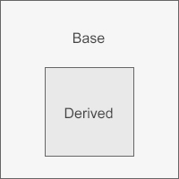


```c++
#include<iostream>
using namespace std;
class A{
public:
    void func();
public:
    int n;
};
void A::func(){ cout<<"c.biancheng.net"<<endl; }
class B: public A{
public:
    int n;
    int m;
};
class C: public B{
public:
    int n;
    int x;
};
int main(){
    C obj;
    obj.n;
    obj.func();
    cout<<sizeof(C)<<endl;
    return 0;
}
```

按照作用域的思想会是下面的情况

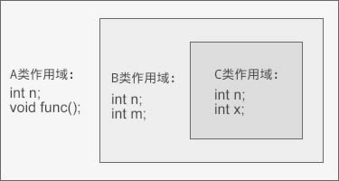

```c++
#include<iostream>
using namespace std;
//基类Base
class Base{
public:
    void func();
    void func(int);
};
void Base::func(){ cout<<"Base::func()"<<endl; }
void Base::func(int a){ cout<<"Base::func(int)"<<endl; }
//派生类Derived
class Derived: public Base{
public:
    void func(char *);
    void func(bool);
};
void Derived::func(char *str){ cout<<"Derived::func(char *)"<<endl; }
void Derived::func(bool is){ cout<<"Derived::func(bool)"<<endl; }
int main(){
    Derived d;
    d.func("c.biancheng.net");
    d.func(true);
    d.func();  //compile error
    d.func(10);  //compile error
    d.Base::func();
    d.Base::func(100);
    return 0;
}
```

虽然 Derived 类和 Base 类都有同名的 func 函数，但它们位于不同的作用域，Derived 类的 func 会遮蔽 Base 类的 func。d 是 Derived 类的对象，调用 func 函数时，编译器会先在 Derived 类中查找“func”这个名字，发现有两个，也即void func(char*)和void func(bool)，这就是一组候选函数。


## 4.5 继承时的对象内存模型

上一节是从作用域的角度分析，现在我们内存的角度进行分析,

成员变量和成员函数会分开存储

+ 对象的内存中只包含成员变量，存储在栈区或堆区（使用 new 创建对象）；
+ 成员函数与对象内存分离，存储在代码区。


```c++
#include <cstdio>
using namespace std;
//基类A
class A{
public:
    A(int a, int b);
public:
    void display();
protected:
    int m_a;
    int m_b;
};
A::A(int a, int b): m_a(a), m_b(b){}
void A::display(){
    printf("m_a=%d, m_b=%d\n", m_a, m_b);
}
//派生类B
class B: public A{
public:
    B(int a, int b, int c);
    void display();
private:
    int m_c;
};
B::B(int a, int b, int c): A(a, b), m_c(c){ }
void B::display(){
    printf("m_a=%d, m_b=%d, m_c=%d\n", m_a, m_b, m_c);
}
int main(){
    A obj_a(99, 10);
    B obj_b(84, 23, 95);
    obj_a.display();
    obj_b.display();
    return 0;
}
```

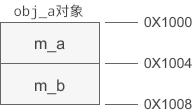

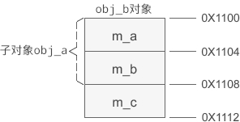


成员变量被遮蔽的情况如下

```c++
//声明并定义派生类C
class C: public B{
public:
    C(char a, int b, int c, int d);
public:
    void display();
private:
    int m_b;  //遮蔽A类的成员变量
    int m_c;  //遮蔽B类的成员变量
    int m_d;  //新增成员变量
};
C::C(char a, int b, int c, int d): B(a, b, c), m_b(b), m_c(c), m_d(d){ }
void C::display(){
    printf("A::m_a=%d, A::m_b=%d, B::m_c=%d\n", m_a, A::m_b, B::m_c);
    printf("C::m_b=%d, C::m_c=%d, C::m_d=%d\n", m_b, m_c, m_d);
}
//创建C类对象obj_c
C obj_c(84, 23, 95, 60);
obj_c.display();
```

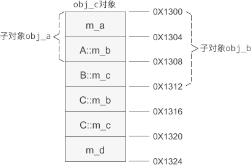

## 4.6 基类和派生类的构造函数

类的构造函数是不能被继承的，这是显而易见的。那么问题就来了，在基类声明的变量怎么对它进行初始化？

在派生类的构造函数中调用基类的构造函数。

```c++
#include<iostream>
using namespace std;
//基类People
class People{
protected:
    char *m_name;
    int m_age;
public:
    People(char*, int);
};
People::People(char *name, int age): m_name(name), m_age(age){}
//派生类Student
class Student: public People{
private:
    float m_score;
public:
    Student(char *name, int age, float score);
    void display();
};
//People(name, age)就是调用基类的构造函数
Student::Student(char *name, int age, float score): People(name, age), m_score(score){ }
void Student::display(){
    cout<<m_name<<"的年龄是"<<m_age<<"，成绩是"<<m_score<<"。"<<endl;
}
int main(){
    Student stu("小明", 16, 90.5);
    stu.display();
    return 0;
}
```

```c++
Student::Student(char *name, int age, float score): People(name, age), m_score(score){ }
```

`People(name, age)`,就是调用基类的构造函数，

```c++
Student::Student(char *name, int age, float score): m_score(score), People(name, age){ }
```

调用基类的构造函数和使用初始化列表有点类似，但是执行的顺序的化，都是先执行基类的构造函数在执行子类的构造函数

下面的调用基类的构造函数是错误的。

```c++
Student::Student(char *name, int age, float score){
    People(name, age); //无法调用，因为不参与继承无法访问
    m_score = score;
}
```

还有一点需要注意就是

> 还有一点要注意，派生类构造函数中只能调用直接基类的构造函数，不能调用间接基类的

**基类构造函数调用规则**

如果没有像上面指明调用基类哪个构造函数时，就会调用无参构造函数，如果没有无参构造函数就会报错


## 4.16基类和派生类的析构函数

在派生类的析构函数中不用显式地调用基类的析构函数，因为每个类只有一个析构函数，编译器知道如何选择，无需程序员干涉。

析构函数的执行顺序和构造函数的执行顺序也刚好相反：

```c++
#include <iostream>
using namespace std;
class A{
public:
    A(){cout<<"A constructor"<<endl;}
    ~A(){cout<<"A destructor"<<endl;}
};
class B: public A{
public:
    B(){cout<<"B constructor"<<endl;}
    ~B(){cout<<"B destructor"<<endl;}
};
class C: public B{
public:
    C(){cout<<"C constructor"<<endl;}
    ~C(){cout<<"C destructor"<<endl;}
};
int main(){
    C test;
    return 0;
}
```

```text
A constructor
B constructor
C constructor
C destructor
B destructor
A destructor
```


## 4.17   多继承

其他语言取消了多继承，这是因为多继承使用起来比较复杂。

语法

```c++
class D: public A, private B, protected C{
    //类D新增加的成员
}
```


构造函数

```c++
D(形参列表): B(实参列表), C(实参列表), A(实参列表){
    //其他操作
}
```

或者

```c++
D(形参列表): B(实参列表), C(实参列表), A(实参列表){
    //其他操作
}
```

两者效果一样，实例化的时候顺序都是 A、B、C、D 。这和最上面的声明顺序有关

```c++
#include <iostream>
using namespace std;
//基类
class BaseA{
public:
    BaseA(int a, int b);
    ~BaseA();
protected:
    int m_a;
    int m_b;
};
BaseA::BaseA(int a, int b): m_a(a), m_b(b){
    cout<<"BaseA constructor"<<endl;
}
BaseA::~BaseA(){
    cout<<"BaseA destructor"<<endl;
}
//基类
class BaseB{
public:
    BaseB(int c, int d);
    ~BaseB();
protected:
    int m_c;
    int m_d;
};
BaseB::BaseB(int c, int d): m_c(c), m_d(d){
    cout<<"BaseB constructor"<<endl;
}
BaseB::~BaseB(){
    cout<<"BaseB destructor"<<endl;
}
//派生类
class Derived: public BaseA, public BaseB{
public:
    Derived(int a, int b, int c, int d, int e);
    ~Derived();
public:
    void show();
private:
    int m_e;
};
Derived::Derived(int a, int b, int c, int d, int e): BaseA(a, b), BaseB(c, d), m_e(e){
    cout<<"Derived constructor"<<endl;
}
Derived::~Derived(){
    cout<<"Derived destructor"<<endl;
}
void Derived::show(){
    cout<<m_a<<", "<<m_b<<", "<<m_c<<", "<<m_d<<", "<<m_e<<endl;
}
int main(){
    Derived obj(1, 2, 3, 4, 5);
    obj.show();
    return 0;
}
```

```text
BaseA constructor
BaseB constructor
Derived constructor
1, 2, 3, 4, 5
Derived destructor
BaseB destructor
BaseA destructor

```

**命名冲突**

当两个或多个基类中有同名的成员时，如果直接访问该成员，就会产生命名冲突，编译器不知道使用哪个基类的成员。这个时候需要在成员名字前面加上类名和域解析符`::`，以显式地指明到底使用哪个类的成员，消除二义性。

```c++
#include <iostream>
using namespace std;
//基类
class BaseA{
public:
    BaseA(int a, int b);
    ~BaseA();
public:
    void show();
protected:
    int m_a;
    int m_b;
};
BaseA::BaseA(int a, int b): m_a(a), m_b(b){
    cout<<"BaseA constructor"<<endl;
}
BaseA::~BaseA(){
    cout<<"BaseA destructor"<<endl;
}
void BaseA::show(){
    cout<<"m_a = "<<m_a<<endl;
    cout<<"m_b = "<<m_b<<endl;
}
//基类
class BaseB{
public:
    BaseB(int c, int d);
    ~BaseB();
    void show();
protected:
    int m_c;
    int m_d;
};
BaseB::BaseB(int c, int d): m_c(c), m_d(d){
    cout<<"BaseB constructor"<<endl;
}
BaseB::~BaseB(){
    cout<<"BaseB destructor"<<endl;
}
void BaseB::show(){
    cout<<"m_c = "<<m_c<<endl;
    cout<<"m_d = "<<m_d<<endl;
}
//派生类
class Derived: public BaseA, public BaseB{
public:
    Derived(int a, int b, int c, int d, int e);
    ~Derived();
public:
    void display();
private:
    int m_e;
};
Derived::Derived(int a, int b, int c, int d, int e): BaseA(a, b), BaseB(c, d), m_e(e){
    cout<<"Derived constructor"<<endl;
}
Derived::~Derived(){
    cout<<"Derived destructor"<<endl;
}
void Derived::display(){
    BaseA::show();  //调用BaseA类的show()函数
    BaseB::show();  //调用BaseB类的show()函数
    cout<<"m_e = "<<m_e<<endl;
}
int main(){
    Derived obj(1, 2, 3, 4, 5);
    obj.display();
    return 0;
}
```


## 4.18 多继承时的对象内存模型

```c++
#include <cstdio>
using namespace std;
//基类A
class A{
public:
    A(int a, int b);
protected:
    int m_a;
    int m_b;
};
A::A(int a, int b): m_a(a), m_b(b){ }
//基类B
class B{
public:
    B(int b, int c);
protected:
    int m_b;
    int m_c;
};
B::B(int b, int c): m_b(b), m_c(c){ }
//派生类C
class C: public A, public B{
public:
    C(int a, int b, int c, int d);
public:
    void display();
private:
    int m_a;
    int m_c;
    int m_d;
};
C::C(int a, int b, int c, int d): A(a, b), B(b, c), m_a(a), m_c(c), m_d(d){ }
void C::display(){
    printf("A::m_a=%d, A::m_b=%d\n", A::m_a, A::m_b);
    printf("B::m_b=%d, B::m_c=%d\n", B::m_b, B::m_c);
    printf("C::m_a=%d, C::m_c=%d, C::m_d=%d\n", C::m_a, C::m_c, m_d);
}
int main(){
    C obj_c(10, 20, 30, 40);
    obj_c.display();
    return 0;
}
```

```text
A::m_a=10, A::m_b=20
B::m_b=20, B::m_c=30
C::m_a=10, C::m_c=30, C::m_d=40
```

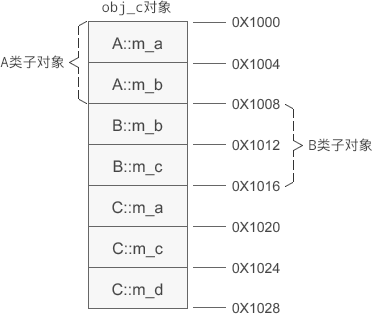

## 4.19 


## 4.20虚继承和虚基类详解

多继承会导致许多错综复杂的问题，命名冲突就是一个。

菱形继承就会导致命名冲突，看下面的图就会发现


A中的声明的变量，我们就会有两份，此时我们不知道，怎么分别使用这两份。

```c++
//间接基类A
class A{
protected:
    int m_a;
};
//直接基类B
class B: public A{
protected:
    int m_b;
};
//直接基类C
class C: public A{
protected:
    int m_c;
};
//派生类D
class D: public B, public C{
public:
    void seta(int a){ m_a = a; }  //命名冲突
    void setb(int b){ m_b = b; }  //正确
    void setc(int c){ m_c = c; }  //正确
    void setd(int d){ m_d = d; }  //正确
private:
    int m_d;
};
int main(){
    D d;
    return 0;
}
```


为了消除歧义，我们可以在 m_a 的前面指明它具体来自哪个类：

```
void seta(int a){ B::m_a = a; }
```

这样表示使用 B 类的 m_a。当然也可以使用 C 类的：

```
void seta(int a){ C::m_a = a; }
```

**虚继承（Virtual Inheritance）**


为了解决这个问题c++提出了虚继承的问题。虚继承解决了命名冲突和冗余数据问题

```c++
//间接基类A
class A{
protected:
    int m_a;
};
//直接基类B
class B: virtual public A{  //虚继承
protected:
    int m_b;
};
//直接基类C
class C: virtual public A{  //虚继承
protected:
    int m_c;
};
//派生类D
class D: public B, public C{
public:
    void seta(int a){ m_a = a; }  //正确
    void setb(int b){ m_b = b; }  //正确
    void setc(int c){ m_c = c; }  //正确
    void setd(int d){ m_d = d; }  //正确
private:
    int m_d;
};
int main(){
    D d;
    return 0;
}
```


## 4.12虚继承时的构造函数

## 4.13 虚基类下的内存模型


## 4.14 向上转型

类本质上是一种数据类型，也存在类型转换，这种类型转换存在于基类和派生类上。并且只能将派生类赋值给基类。将派生类对象赋值给基类对象、将派生类[指针](http://c.biancheng.net/c/80/)赋值给基类指针、将派生类引用赋值给基类引用。这叫做向上转型。

同样也有向下转型，这哥转型就比较有风险了。


**将派生类对象赋值给基类对象**

```c++
#include <iostream>
using namespace std;
//基类
class A{
public:
    A(int a);
public:
    void display();
public:
    int m_a;
};
A::A(int a): m_a(a){ }
void A::display(){
    cout<<"Class A: m_a="<<m_a<<endl;
}
//派生类
class B: public A{
public:
    B(int a, int b);
public:
    void display();
public:
    int m_b;
};
B::B(int a, int b): A(a), m_b(b){ }
void B::display(){
    cout<<"Class B: m_a="<<m_a<<", m_b="<<m_b<<endl;
}
int main(){
    A a(10);
    B b(66, 99);
    //赋值前
    a.display();
    b.display();
    cout<<"--------------"<<endl;
    //赋值后
    a = b;
    a.display();
    b.display();
    return 0;
}
```

```text
Class A: m_a=10
Class B: m_a=66, m_b=99
----------------------------
Class A: m_a=66
Class B: m_a=66, m_b=99
```


**将派生类指针赋值给基类指针**

```c++
#include <iostream>
using namespace std;
//基类A
class A{
public:
    A(int a);
public:
    void display();
protected:
    int m_a;
};
A::A(int a): m_a(a){ }
void A::display(){
    cout<<"Class A: m_a="<<m_a<<endl;
}
//中间派生类B
class B: public A{
public:
    B(int a, int b);
public:
    void display();
protected:
    int m_b;
};
B::B(int a, int b): A(a), m_b(b){ }
void B::display(){
    cout<<"Class B: m_a="<<m_a<<", m_b="<<m_b<<endl;
}
//基类C
class C{
public:
    C(int c);
public:
    void display();
protected:
    int m_c;
};
C::C(int c): m_c(c){ }
void C::display(){
    cout<<"Class C: m_c="<<m_c<<endl;
}
//最终派生类D
class D: public B, public C{
public:
    D(int a, int b, int c, int d);
public:
    void display();
private:
    int m_d;
};
D::D(int a, int b, int c, int d): B(a, b), C(c), m_d(d){ }
void D::display(){
    cout<<"Class D: m_a="<<m_a<<", m_b="<<m_b<<", m_c="<<m_c<<", m_d="<<m_d<<endl;
}
int main(){
    A *pa = new A(1);
    B *pb = new B(2, 20);
    C *pc = new C(3);
    D *pd = new D(4, 40, 400, 4000);
    pa = pd;
    pa -> display();
    pb = pd;
    pb -> display();
    pc = pd;
    pc -> display();
    cout<<"-----------------------"<<endl;
    cout<<"pa="<<pa<<endl;
    cout<<"pb="<<pb<<endl;
    cout<<"pc="<<pc<<endl;
    cout<<"pd="<<pd<<endl;
    return 0;
}
```

```text
Class A: m_a=4
Class B: m_a=4, m_b=40
Class C: m_c=400
-----------------------
pa=0x9b17f8
pb=0x9b17f8
pc=0x9b1800
pd=0x9b17f8
```

1) 通过基类指针访问派生类的成员

> 编译器通过指针来访问成员变量，指针指向哪个对象就使用哪个对象的数据；编译器通过指针的类型来访问成员函数，指针属于哪个类的类型就使用哪个类的函数。

2) 赋值后值不一致的情况

`pc = pd;`语句后，pc 和 pd 的值并不相等。

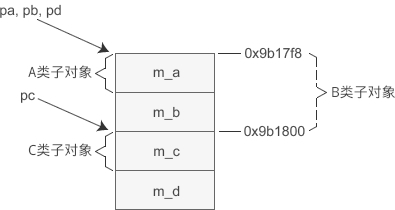

**将派生类引用赋值给基类引用**

```c++
int main(){
    D d(4, 40, 400, 4000);
   
    A &ra = d;
    B &rb = d;
    C &rc = d;
   
    ra.display();
    rb.display();
    rc.display();
    return 0;
}
```

```text
Class A: m_a=4
Class B: m_a=4, m_b=40
Class C: m_c=400

```

引用的内核就是有指针实现的

# 第五章 c++多态与虚函数


## 5.1 快速了解

基类指针可以执行派生类对象，再执行方法的时候虽然使用的是派生类对象的数据，但是使用的是基类的方法

```c++
#include <iostream>
using namespace std;
//基类People
class People{
public:
    People(char *name, int age);
    void display();
protected:
    char *m_name;
    int m_age;
};
People::People(char *name, int age): m_name(name), m_age(age){}
void People::display(){
    cout<<m_name<<"今年"<<m_age<<"岁了，是个无业游民。"<<endl;
}
//派生类Teacher
class Teacher: public People{
public:
    Teacher(char *name, int age, int salary);
    void display();
private:
    int m_salary;
};
Teacher::Teacher(char *name, int age, int salary): People(name, age), m_salary(salary){}
void Teacher::display(){
    cout<<m_name<<"今年"<<m_age<<"岁了，是一名教师，每月有"<<m_salary<<"元的收入。"<<endl;
}
int main(){
    People *p = new People("王志刚", 23);
    p -> display();
    p = new Teacher("赵宏佳", 45, 8200);
    p -> display();
    return 0;
}
```

运行结果

```text
王志刚今年23岁了，是个无业游民。
赵宏佳今年45岁了，是个无业游民。
```

**函数（Virtual Function)**

虚函数可以解决这种问题

```c++
#include <iostream>
using namespace std;
//基类People
class People{
public:
    People(char *name, int age);
    virtual void display();  //声明为虚函数
protected:
    char *m_name;
    int m_age;
};
People::People(char *name, int age): m_name(name), m_age(age){}
void People::display(){
    cout<<m_name<<"今年"<<m_age<<"岁了，是个无业游民。"<<endl;
}
//派生类Teacher
class Teacher: public People{
public:
    Teacher(char *name, int age, int salary);
    virtual void display();  //声明为虚函数
private:
    int m_salary;
};
Teacher::Teacher(char *name, int age, int salary): People(name, age), m_salary(salary){}
void Teacher::display(){
    cout<<m_name<<"今年"<<m_age<<"岁了，是一名教师，每月有"<<m_salary<<"元的收入。"<<endl;
}
int main(){
    People *p = new People("王志刚", 23);
    p -> display();
    p = new Teacher("赵宏佳", 45, 8200);
    p -> display();
    return 0;
}
```

运行结果

```text
王志刚今年23岁了，是个无业游民。
赵宏佳今年45岁了，是一名教师，每月有8200元的收入。
```

有了虚函数，基类指针指向基类对象时就使用基类的成员（包括成员函数和成员变量），指向派生类对象时就使用派生类的成员。换句话说，基类指针可以按照基类的方式来做事，也可以按照派生类的方式来做事，它有多种形态，或者说有多种表现方式，我们将这种现象称为**多态（Polymorphism）**。

**借助引用也可以实现多态**

指针和引用一样

```c++
int main(){
    People p("王志刚", 23);
    Teacher t("赵宏佳", 45, 8200);
   
    People &rp = p;
    People &rt = t;
   
    rp.display();
    rt.display();
    return 0;
}
```

```text
王志刚今年23岁了，是个无业游民。
赵宏佳今年45岁了，是一名教师，每月有8200元的收入。
```

## 5.2 虚函数注意事项

+ 只需要在函数声明处 加上 `virtual `关键字即可。
+ 只将基类中的函数声明为虚函数，这样所有派生类中具有遮蔽关系的同名函数都将自动成为虚函数
+ ) 析构函数可以声明为虚函数，而且有时候必须要声明为虚函数


## 5.3 虚析构函数的必要性

基类指针执行派生类的时候，当我们要释放在堆中生成的对象的时候，却发现执行的是基类的析构函数，这样就会导致内存泄漏，这会是一件悲伤的事情

```c++
#include <iostream>
using namespace std;
//基类
class Base{
public:
    Base();
    ~Base();
protected:
    char *str;
};
Base::Base(){
    str = new char[100];
    cout<<"Base constructor"<<endl;
}
Base::~Base(){
    delete[] str;
    cout<<"Base destructor"<<endl;
}
//派生类
class Derived: public Base{
public:
    Derived();
    ~Derived();
private:
    char *name;
};
Derived::Derived(){
    name = new char[100];
    cout<<"Derived constructor"<<endl;
}
Derived::~Derived(){
    delete[] name;
    cout<<"Derived destructor"<<endl;
}
int main(){
   Base *pb = new Derived();
   delete pb;
   cout<<"-------------------"<<endl;
   Derived *pd = new Derived();
   delete pd;
   return 0;
}
```

```text
Base constructor
Derived constructor
Base destructor
-------------------
Base constructor
Derived constructor
Derived destructor
Base destructor
```


这种情况下我们不得不将析构函数声明为虚函数

```c++
class Base{
public:
    Base();
    virtual ~Base();
protected:
    char *str;
};
```

```c++
Base constructor
Derived constructor
Derived destructor
Base destructor
-------------------
Base constructor
Derived constructor
Derived destructor
Base destructor	
```

<font color='red'>大部分情况下都应该将基类的析构函数声明为虚函数。</font>

## 5.4纯虚函数和抽象类详解

可以将虚函数声明为纯虚函数

```c++
virtual 返回值类型 函数名 (函数参数) = 0;//不用实现函数，存在于抽象函数中
```

包含纯虚函数的类称为抽象类（Abstract Class）

抽象类通常是作为基类，让派生类去实现纯虚函数。派生类必须实现纯虚函数才能被实例化。

```c++
#include <iostream>
using namespace std;
//线
class Line{
public:
    Line(float len);
    virtual float area() = 0;
    virtual float volume() = 0;
protected:
    float m_len;
};
Line::Line(float len): m_len(len){ }
//矩形
class Rec: public Line{
public:
    Rec(float len, float width);
    float area();
protected:
    float m_width;
};
Rec::Rec(float len, float width): Line(len), m_width(width){ }
float Rec::area(){ return m_len * m_width; }
//长方体
class Cuboid: public Rec{
public:
    Cuboid(float len, float width, float height);
    float area();
    float volume();
protected:
    float m_height;
};
Cuboid::Cuboid(float len, float width, float height): Rec(len, width), m_height(height){ }
float Cuboid::area(){ return 2 * ( m_len*m_width + m_len*m_height + m_width*m_height); }
float Cuboid::volume(){ return m_len * m_width * m_height; }
//正方体
class Cube: public Cuboid{
public:
    Cube(float len);
    float area();
    float volume();
};
Cube::Cube(float len): Cuboid(len, len, len){ }
float Cube::area(){ return 6 * m_len * m_len; }
float Cube::volume(){ return m_len * m_len * m_len; }
int main(){
    Line *p = new Cuboid(10, 20, 30);
    cout<<"The area of Cuboid is "<<p->area()<<endl;
    cout<<"The volume of Cuboid is "<<p->volume()<<endl;
  
    p = new Cube(15);
    cout<<"The area of Cube is "<<p->area()<<endl;
    cout<<"The volume of Cube is "<<p->volume()<<endl;
    return 0;
}
```

```text
The area of Cuboid is 2200
The volume of Cuboid is 6000
The area of Cube is 1350
The volume of Cube is 3375
```


## 5.5 虚函数表精讲教程，直戳多态的实现机制


## 5.6 typeid运算符：获取类型信息

语法：

```c++
typeid( dataType )
typeid( expression )
```

看示例程序：

```c++
#include <iostream>
#include <typeinfo>
using namespace std;
class Base{ };
struct STU{ };
int main(){
    //获取一个普通变量的类型信息
    int n = 100;
    const type_info &nInfo = typeid(n);
    cout<<nInfo.name()<<" | "<<nInfo.raw_name()<<" | "<<nInfo.hash_code()<<endl;
    //获取一个字面量的类型信息
    const type_info &dInfo = typeid(25.65);
    cout<<dInfo.name()<<" | "<<dInfo.raw_name()<<" | "<<dInfo.hash_code()<<endl;
    //获取一个对象的类型信息
    Base obj;
    const type_info &objInfo = typeid(obj);
    cout<<objInfo.name()<<" | "<<objInfo.raw_name()<<" | "<<objInfo.hash_code()<<endl;
    //获取一个类的类型信息
    const type_info &baseInfo = typeid(Base);
    cout<<baseInfo.name()<<" | "<<baseInfo.raw_name()<<" | "<<baseInfo.hash_code()<<endl;
    //获取一个结构体的类型信息
    const type_info &stuInfo = typeid(struct STU);
    cout<<stuInfo.name()<<" | "<<stuInfo.raw_name()<<" | "<<stuInfo.hash_code()<<endl;
    //获取一个普通类型的类型信息
    const type_info &charInfo = typeid(char);
    cout<<charInfo.name()<<" | "<<charInfo.raw_name()<<" | "<<charInfo.hash_code()<<endl;
    //获取一个表达式的类型信息
    const type_info &expInfo = typeid(20 * 45 / 4.5);
    cout<<expInfo.name()<<" | "<<expInfo.raw_name()<<" | "<<expInfo.hash_code()<<endl;
    return 0;
}
```

```text
int | .H | 529034928
double | .N | 667332678
class Base | .?AVBase@@ | 1035034353
class Base | .?AVBase@@ | 1035034353
struct STU | .?AUSTU@@ | 734635517
char | .D | 4140304029
double | .N | 667332678
```

- name() 用来返回类型的名称。
- raw_name() 用来返回名字编码（Name Mangling）算法产生的新名称
- hash_code() 用来返回当前类型对应的 hash 值

C++标准规定`type_info`必须有一下四个函数，其他由编译器厂商自由发挥

1) 原型：const char* name() const;

返回一个能表示类型名称的字符串。对于上面的`objInfo.name()`语句，VC/VS 下返回“class Base”，但 GCC 下返回“4Base”。

2) 原型：bool before (const type_info& rhs) const;

判断一个类型是否位于另一个类型的前面，rhs 参数是一个 type_info 对象的引用。但是C++标准并没有规定类型的排列顺序，不同的编译器有不同的排列规则，程序员也可以自定义。要特别注意的是，这个排列顺序和继承顺序没有关系，基类并不一定位于派生类的前面。

3) 原型：bool operator== (const type_info& rhs) const;

重载运算符“==”，判断两个类型是否相同，rhs 参数是一个 type_info 对象的引用。

4) 原型：bool operator!= (const type_info& rhs) const; 

重载运算符“!=”，判断两个类型是否不同，rhs 参数是一个 type_info 对象的引用。

**判断类型是否相等**

经常用来判断类型是否相等

| 类型比较                      | 结果  | 类型比较                     | 结果  |
| ----------------------------- | ----- | ---------------------------- | ----- |
| typeid(int) == typeid(int)    | true  | typeid(int) == typeid(char)  | false |
| typeid(char*) == typeid(char) | false | typeid(str) == typeid(char*) | true  |
| typeid(a) == typeid(int)      | true  | typeid(b) == typeid(int)     | true  |
| typeid(a) == typeid(a)        | true  | typeid(a) == typeid(b)       | true  |
| typeid(a) == typeid(f)        | false | typeid(a/b) == typeid(int)   | true  |

```c++
class Base{};
class Derived: public Base{};
Base obj1;
Base *p1;
Derived obj2;
Derived *p2 = new Derived;
p1 = p2;
```

| 类型比较                     | 结果  | 类型比较                       | 结果  |
| ---------------------------- | ----- | ------------------------------ | ----- |
| typeid(obj1) == typeid(p1)   | false | typeid(obj1) == typeid(*p1)    | true  |
| typeid(&obj1) == typeid(p1)  | true  | typeid(obj1) == typeid(obj2)   | false |
| typeid(obj1) == typeid(Base) | true  | typeid(*p1) == typeid(Base)    | true  |
| typeid(p1) == typeid(Base*)  | true  | typeid(p1) == typeid(Derived*) | false |


**type_info 类的声明**

```c++
class type_info {
public:
    virtual ~type_info();
    int operator==(const type_info& rhs) const;
    int operator!=(const type_info& rhs) const;
    int before(const type_info& rhs) const;
    const char* name() const;
    const char* raw_name() const;
private:
    void *_m_data;
    char _m_d_name[1];
    type_info(const type_info& rhs);
    type_info& operator=(const type_info& rhs);
};
```


## 5.7


## 5.8


## 5.9


## 第六章 运算符重载

## 6.1 运算符重载基础教程

重载的含义是赋予 新的含义。

 +的重载让不同类型进行数据加法操作，<<在cout中做了重载，既可以向控制台输出数据

同样我们自己可以实现重载

我们来显示自定义一个类型来实现+的重载

```c++
#include <iostream>
using namespace std;
class complex{
public:
    complex();
    complex(double real, double imag);
public:
    //声明运算符重载
    complex operator+(const complex &A) const;
    void display() const;
private:
    double m_real;  //实部
    double m_imag;  //虚部
};
complex::complex(): m_real(0.0), m_imag(0.0){ }
complex::complex(double real, double imag): m_real(real), m_imag(imag){ }
//实现运算符重载
complex complex::operator+(const complex &A) const{
    complex B;
    B.m_real = this->m_real + A.m_real;
    B.m_imag = this->m_imag + A.m_imag;
    return B;
}
void complex::display() const{
    cout<<m_real<<" + "<<m_imag<<"i"<<endl;
}	
int main(){
    complex c1(4.3, 5.8);
    complex c2(2.4, 3.7);
    complex c3;
    c3 = c1 + c2;
    c3.display();
    return 0;
}
```

运行结果

```text
6.7 + 9.5i
```

语法格式

```c++
返回值类型 operator 运算符名称 (形参表列){
    //TODO:
}
```

运算符重载函数除了函数名有特定的格式，其它地方和普通函数并没有区别。

简化一下上面的`

```c++
complex complex::operator+(const complex &A)const{
    return complex(this->m_real + A.m_real, this->m_imag + A.m_imag);
}
```

**在全局范围内重载运算符**

全局范围内重载，效果差不多

```c++
#include <iostream>
using namespace std;
class complex{
public:
    complex();
    complex(double real, double imag);
public:
    void display() const;
    //声明为友元函数
    friend complex operator+(const complex &A, const complex &B);
private:
    double m_real;
    double m_imag;
};
complex operator+(const complex &A, const complex &B);
complex::complex(): m_real(0.0), m_imag(0.0){ }
complex::complex(double real, double imag): m_real(real), m_imag(imag){ }
void complex::display() const{
    cout<<m_real<<" + "<<m_imag<<"i"<<endl;
}
//在全局范围内重载+
complex operator+(const complex &A, const complex &B){
    complex C;
    C.m_real = A.m_real + B.m_real;
    C.m_imag = A.m_imag + B.m_imag;
    return C;
}
int main(){
    complex c1(4.3, 5.8);
    complex c2(2.4, 3.7);
    complex c3;
    c3 = c1 + c2;
    c3.display();
    return 0;
}
```

重载函数用到complex的私有变量，所以为友元函数


<font color='red'>运算符的重载不会影响原来运算符的功能，只是一种扩展而已</font>


## 6.2 运算符的重载需要一些规则

**可以重载的运算符**：

> \+ - * / % ^ & | ~ ! = < > += -= *= /= %= ^= &= |=  << >> <<= >>= == != <= >= && || ++ -- , ->* -> () []  new new[] delete delete[]

长度运算符`sizeof`、条件运算符`: ?`、成员选择符`.`和域解析运算符`::`不能被重载。

**2) 重载不能改变运算符的优先级和结合性。**

```c++
c4 = c1 + c2 * c3;
```

```c++
c4 = c1 + ( c2 * c3 );
```

3) **重载不会改变运算符的用法**

有几个操作数，依然有几个操作数

**4) 运算符重载函数不能有默认的参数，**

**5) 运算符重载函数既可以作为类的成员函数，也可以作为全局函数。**

运算符重载函数作为类的成员函数时，二元运算符的参数只有一个，一元运算符不需要参数。之所以少一个参数，是因为这个参数是隐含的。

6) 箭头运算符`->`、下标运算符`[ ]`、函数调用运算符`( )`、赋值运算符`=`只能以成员函数的形式重载。

## 6.3 实例演示运算符的重载

```c++
#include <iostream>
#include <cmath>
using namespace std;
//复数类
class Complex{
public:  //构造函数
    Complex(double real = 0.0, double imag = 0.0): m_real(real), m_imag(imag){ }
public:  //运算符重载
    //以全局函数的形式重载
    friend Complex operator+(const Complex &c1, const Complex &c2);
    friend Complex operator-(const Complex &c1, const Complex &c2);
    friend Complex operator*(const Complex &c1, const Complex &c2);
    friend Complex operator/(const Complex &c1, const Complex &c2);
    friend bool operator==(const Complex &c1, const Complex &c2);
    friend bool operator!=(const Complex &c1, const Complex &c2);
    //以成员函数的形式重载
    Complex & operator+=(const Complex &c);
    Complex & operator-=(const Complex &c);
    Complex & operator*=(const Complex &c);
    Complex & operator/=(const Complex &c);
public:  //成员函数
    double real() const{ return m_real; }
    double imag() const{ return m_imag; }
private:
    double m_real;  //实部
    double m_imag;  //虚部
};
//重载+运算符
Complex operator+(const Complex &c1, const Complex &c2){
    Complex c;
    c.m_real = c1.m_real + c2.m_real;
    c.m_imag = c1.m_imag + c2.m_imag;
    return c;
}
//重载-运算符
Complex operator-(const Complex &c1, const Complex &c2){
    Complex c;
    c.m_real = c1.m_real - c2.m_real;
    c.m_imag = c1.m_imag - c2.m_imag;
    return c;
}
//重载*运算符  (a+bi) * (c+di) = (ac-bd) + (bc+ad)i
Complex operator*(const Complex &c1, const Complex &c2){
    Complex c;
    c.m_real = c1.m_real * c2.m_real - c1.m_imag * c2.m_imag;
    c.m_imag = c1.m_imag * c2.m_real + c1.m_real * c2.m_imag;
    return c;
}
//重载/运算符  (a+bi) / (c+di) = [(ac+bd) / (c²+d²)] + [(bc-ad) / (c²+d²)]i
Complex operator/(const Complex &c1, const Complex &c2){
    Complex c;
    c.m_real = (c1.m_real*c2.m_real + c1.m_imag*c2.m_imag) / (pow(c2.m_real, 2) + pow(c2.m_imag, 2));
    c.m_imag = (c1.m_imag*c2.m_real - c1.m_real*c2.m_imag) / (pow(c2.m_real, 2) + pow(c2.m_imag, 2));
    return c;
}
//重载==运算符
bool operator==(const Complex &c1, const Complex &c2){
    if( c1.m_real == c2.m_real && c1.m_imag == c2.m_imag ){
        return true;
    }else{
        return false;
    }
}
//重载!=运算符
bool operator!=(const Complex &c1, const Complex &c2){
    if( c1.m_real != c2.m_real || c1.m_imag != c2.m_imag ){
        return true;
    }else{
        return false;
    }
}
//重载+=运算符
Complex & Complex::operator+=(const Complex &c){
    this->m_real += c.m_real;
    this->m_imag += c.m_imag;
    return *this;
}
//重载-=运算符
Complex & Complex::operator-=(const Complex &c){
    this->m_real -= c.m_real;
    this->m_imag -= c.m_imag;
    return *this;
}
//重载*=运算符
Complex & Complex::operator*=(const Complex &c){
    this->m_real = this->m_real * c.m_real - this->m_imag * c.m_imag;
    this->m_imag = this->m_imag * c.m_real + this->m_real * c.m_imag;
    return *this;
}
//重载/=运算符
Complex & Complex::operator/=(const Complex &c){
    this->m_real = (this->m_real*c.m_real + this->m_imag*c.m_imag) / (pow(c.m_real, 2) + pow(c.m_imag, 2));
    this->m_imag = (this->m_imag*c.m_real - this->m_real*c.m_imag) / (pow(c.m_real, 2) + pow(c.m_imag, 2));
    return *this;
}
int main(){
    Complex c1(25, 35);
    Complex c2(10, 20);
    Complex c3(1, 2);
    Complex c4(4, 9);
    Complex c5(34, 6);
    Complex c6(80, 90);
   
    Complex c7 = c1 + c2;
    Complex c8 = c1 - c2;
    Complex c9 = c1 * c2;
    Complex c10 = c1 / c2;
    cout<<"c7 = "<<c7.real()<<" + "<<c7.imag()<<"i"<<endl;
    cout<<"c8 = "<<c8.real()<<" + "<<c8.imag()<<"i"<<endl;
    cout<<"c9 = "<<c9.real()<<" + "<<c9.imag()<<"i"<<endl;
    cout<<"c10 = "<<c10.real()<<" + "<<c10.imag()<<"i"<<endl;
   
    c3 += c1;
    c4 -= c2;
    c5 *= c2;
    c6 /= c2;
    cout<<"c3 = "<<c3.real()<<" + "<<c3.imag()<<"i"<<endl;
    cout<<"c4 = "<<c4.real()<<" + "<<c4.imag()<<"i"<<endl;
    cout<<"c5 = "<<c5.real()<<" + "<<c5.imag()<<"i"<<endl;
    cout<<"c6 = "<<c6.real()<<" + "<<c6.imag()<<"i"<<endl;
   
    if(c1 == c2){
        cout<<"c1 == c2"<<endl;
    }
    if(c1 != c2){
        cout<<"c1 != c2"<<endl;
    }
   
    return 0;
}
```

```text
c7 = 35 + 55i
c8 = 15 + 15i
c9 = -450 + 850i
c10 = 1.9 + -0.3i
c3 = 26 + 37i
c4 = -6 + -11i
c5 = 220 + 4460i
c6 = 5.2 + 1.592i
c1 != c2

```


## 6.4 运算符的重载，全局？成员？

什么时候用全局函数重载运算符？什么时候用成员函数重载运算符？

**转换构造函数**

我们首先来了解一下转换构造函数

就是帮助一种类型转化成另一种类型

```c++
#include <iostream>
using namespace std;
//复数类
class Complex{
public:
    Complex(): m_real(0.0), m_imag(0.0){ }
    Complex(double real, double imag): m_real(real), m_imag(imag){ }
    Complex(double real): m_real(real), m_imag(0.0){ }  //转换构造函数
public:
    friend Complex operator+(const Complex &c1, const Complex &c2);
public:
    double real() const{ return m_real; }
    double imag() const{ return m_imag; }
private:
    double m_real;  //实部
    double m_imag;  //虚部
};
//重载+运算符
Complex operator+(const Complex &c1, const Complex &c2){
    Complex c;
    c.m_real = c1.m_real + c2.m_real;
    c.m_imag = c1.m_imag + c2.m_imag;
    return c;
}
int main(){
    Complex c1(25, 35);
    Complex c2 = c1 + 15.6;
    Complex c3 = 28.23 + c1;
    cout<<c2.real()<<" + "<<c2.imag()<<"i"<<endl;
    cout<<c3.real()<<" + "<<c3.imag()<<"i"<<endl;
   
    return 0;
}
```

```text
40.6 + 35i
53.23 + 35i
```

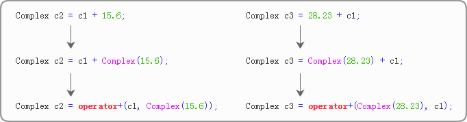

**什么时候全局重载函数**

对称的处理。15.6 在 + 的右边，第 31 行代码中，28.23 在 + 的左边，它们都能够被顺利地转换为 Complex 类型，所以不会出错。


**什么时候成员函数的形式重载函数**

全局成员函数重载是为了考虑不能对称处理，成员函数才是最符合规范的，因为运算符的某项功能是属于某个类的。优先考虑成员函数重载运算符

> C++ 规定，箭头运算符`->`、下标运算符`[ ]`、函数调用运算符`( )`、赋值运算符`=`只能以成员函数的形式重载。


## 6.5 重载>>和<<（输入和输出运算符）详解

直接看例子把

```c++
#include <iostream>
using namespace std;
class complex{
public:
    complex(double real = 0.0, double imag = 0.0): m_real(real), m_imag(imag){ };
public:
    friend complex operator+(const complex & A, const complex & B);
    friend complex operator-(const complex & A, const complex & B);
    friend complex operator*(const complex & A, const complex & B);
    friend complex operator/(const complex & A, const complex & B);
    friend istream & operator>>(istream & in, complex & A);
    friend ostream & operator<<(ostream & out, complex & A);
private:
    double m_real;  //实部
    double m_imag;  //虚部
};
//重载加法运算符
complex operator+(const complex & A, const complex &B){
    complex C;
    C.m_real = A.m_real + B.m_real;
    C.m_imag = A.m_imag + B.m_imag;
    return C;
}
//重载减法运算符
complex operator-(const complex & A, const complex &B){
    complex C;
    C.m_real = A.m_real - B.m_real;
    C.m_imag = A.m_imag - B.m_imag;
    return C;
}
//重载乘法运算符
complex operator*(const complex & A, const complex &B){
    complex C;
    C.m_real = A.m_real * B.m_real - A.m_imag * B.m_imag;
    C.m_imag = A.m_imag * B.m_real + A.m_real * B.m_imag;
    return C;
}
//重载除法运算符
complex operator/(const complex & A, const complex & B){
    complex C;
    double square = A.m_real * A.m_real + A.m_imag * A.m_imag;
    C.m_real = (A.m_real * B.m_real + A.m_imag * B.m_imag)/square;
    C.m_imag = (A.m_imag * B.m_real - A.m_real * B.m_imag)/square;
    return C;
}
//重载输入运算符
istream & operator>>(istream & in, complex & A){
    in >> A.m_real >> A.m_imag;
    return in;
}
//重载输出运算符
ostream & operator<<(ostream & out, complex & A){
    out << A.m_real <<" + "<< A.m_imag <<" i ";;
    return out;
}
int main(){
    complex c1, c2, c3;
    cin>>c1>>c2;
    c3 = c1 + c2;
    cout<<"c1 + c2 = "<<c3<<endl;
    c3 = c1 - c2;
    cout<<"c1 - c2 = "<<c3<<endl;
    c3 = c1 * c2;
    cout<<"c1 * c2 = "<<c3<<endl;
    c3 = c1 / c2;
    cout<<"c1 / c2 = "<<c3<<endl;
    return 0;
}
```

```text
2.4 3.6↙
4.8 1.7↙
c1 + c2 = 7.2 + 5.3 i
c1 - c2 = -2.4 + 1.9 i
c1 * c2 = 5.4 + 21.36 i
c1 / c2 = 0.942308 + 0.705128 i
```

## 6.6重载[]（下标运算符）详解

```C++
返回值类型 & operator[ ] (参数);
```

```c++
const 返回值类型 & operator[ ] (参数) const; 
```

直接上示例

```c++
#include <iostream>
using namespace std;
class Array{
public:
    Array(int length = 0);
    ~Array();
public:
    int & operator[](int i);
    const int & operator[](int i) const;
public:
    int length() const { return m_length; }
    void display() const;
private:
    int m_length;  //数组长度
    int *m_p;  //指向数组内存的指针
};
Array::Array(int length): m_length(length){
    if(length == 0){
        m_p = NULL;
    }else{
        m_p = new int[length];
    }
}
Array::~Array(){
    delete[] m_p;
}
int& Array::operator[](int i){
    return m_p[i];
}
const int & Array::operator[](int i) const{
    return m_p[i];
}
void Array::display() const{
    for(int i = 0; i < m_length; i++){
        if(i == m_length - 1){
            cout<<m_p[i]<<endl;
        }else{
            cout<<m_p[i]<<", ";
        }
    }
}
int main(){
    int n;
    cin>>n;
    Array A(n);
    for(int i = 0, len = A.length(); i < len; i++){
        A[i] = i * 5;
    }
    A.display();
   
    const Array B(n);
    cout<<B[n-1]<<endl;  //访问最后一个元素
   
    return 0;
}
```

```text
5↙
0, 5, 10, 15, 20
33685536
```


## 6.7重载++和--（自增和自减运算符）详解

前置 后置都能重载，直接看示例，记住前置后置的区别

```c++
#include <iostream>
#include <iomanip>
using namespace std;
//秒表类
class stopwatch{
public:
    stopwatch(): m_min(0), m_sec(0){ }
public:
    void setzero(){ m_min = 0; m_sec = 0; }
    stopwatch run();  // 运行
    stopwatch operator++();  //++i，前置形式
    stopwatch operator++(int);  //i++，后置形式
    friend ostream & operator<<( ostream &, const stopwatch &);
private:
    int m_min;  //分钟
    int m_sec;  //秒钟
};
stopwatch stopwatch::run(){
    ++m_sec;
    if(m_sec == 60){
        m_min++;
        m_sec = 0;
    }
    return *this;
}
stopwatch stopwatch::operator++(){
    return run();
}
stopwatch stopwatch::operator++(int n){
    stopwatch s = *this;
    run();
    return s;
}
ostream &operator<<( ostream & out, const stopwatch & s){
    out<<setfill('0')<<setw(2)<<s.m_min<<":"<<setw(2)<<s.m_sec;
    return out;
}
int main(){
    stopwatch s1, s2;
    s1 = s2++;
    cout << "s1: "<< s1 <<endl;
    cout << "s2: "<< s2 <<endl;
    s1.setzero();
    s2.setzero();
    s1 = ++s2;
    cout << "s1: "<< s1 <<endl;
    cout << "s2: "<< s2 <<endl;
    return 0;
}
```

运行结果

```text
s1: 00:00
s2: 00:01
s1: 00:01
s2: 00:01
```


## 6.8 new和delete运算符详解

成员函数形式

```c++
void * className::operator new( size_t size ){
    //TODO:
}
```

全局函数的形式

```c++
void * operator new( size_t size ){
    //TODO:
}
```

在重载 new 或 new[] 时，无论是作为成员函数还是作为全局函数，它的第一个参数必须是 size_t 类型。size_t 表示的是要分配空间的大小，对于 new[] 的重载函数而言，size_t 则表示所需要分配的所有空间的总和。

delete对应也有两种形式

成员函数

```c++
void className::operator delete( void *ptr){
    //TODO:
}
```

全局函数

```c++
void operator delete( void *ptr){
    //TODO:
}
```


当我们以类的成员函数的形式重载了new 和 delete 操作符，其使用方法如下：

```c++
C * c = new C;  //分配内存空间//TODO:delete c;  //释放内存空间
```

## 6.9重载()（强制类型转换运算符）

````c++
#include <iostream>
using namespace std;
class Complex
{
    double real, imag;
public:
    Complex(double r = 0, double i = 0) :real(r), imag(i) {};
    operator double() { return real; }  //重载强制类型转换运算符 double
};
int main()
{
    Complex c(1.2, 3.4);
    cout << (double)c << endl;  //输出 1.2
    double n = 2 + c;  //等价于 double n = 2 + c. operator double()
    cout << n;  //输出 3.2
}
````

```text
1.2
3.2
```

# 第七章 模板

## 7.1 函数模板快速入门

先看下面各种类型的交换函数

```c++
//交换 int 变量的值
void Swap(int *a, int *b){
    int temp = *a;
    *a = *b;
    *b = temp;
}
//交换 float 变量的值
void Swap(float *a, float *b){
    float temp = *a;
    *a = *b;
    *b = temp;
}
//交换 char 变量的值
void Swap(char *a, char *b){
    char temp = *a;
    *a = *b;
    *b = temp;
}
//交换 bool 变量的值
void Swap(bool *a, bool *b){
    char temp = *a;
    *a = *b;
    *b = temp;
}
```

这些函数除了类型不一样，其他都差不多，这样写起来代码比较重复

我们可以建立一个模板，不让它受束缚于类型。我们来看一下模板函数。

```c++
#include <iostream>
using namespace std;
template<typename T> void Swap(T *a, T *b){
    T temp = *a;
    *a = *b;
    *b = temp;
}
int main(){
    //交换 int 变量的值
    int n1 = 100, n2 = 200;
    Swap(&n1, &n2);
    cout<<n1<<", "<<n2<<endl;
   
    //交换 float 变量的值
    float f1 = 12.5, f2 = 56.93;
    Swap(&f1, &f2);
    cout<<f1<<", "<<f2<<endl;
   
    //交换 char 变量的值
    char c1 = 'A', c2 = 'B';
    Swap(&c1, &c2);
    cout<<c1<<", "<<c2<<endl;
   
    //交换 bool 变量的值
    bool b1 = false, b2 = true;
    Swap(&b1, &b2);
    cout<<b1<<", "<<b2<<endl;
    return 0;
}
```

```text
200, 100
56.93, 12.5
B, A
1, 0
```


引用实现交换函数

```c++
#include <iostream>
using namespace std;
template<typename T> void Swap(T &a, T &b){
    T temp = a;
    a = b;
    b = temp;
}
int main(){
    //交换 int 变量的值
    int n1 = 100, n2 = 200;
    Swap(n1, n2);
    cout<<n1<<", "<<n2<<endl;
   
    //交换 float 变量的值
    float f1 = 12.5, f2 = 56.93;
    Swap(f1, f2);
    cout<<f1<<", "<<f2<<endl;
   
    //交换 char 变量的值
    char c1 = 'A', c2 = 'B';
    Swap(c1, c2);
    cout<<c1<<", "<<c2<<endl;
   
    //交换 bool 变量的值
    bool b1 = false, b2 = true;
    Swap(b1, b2);
    cout<<b1<<", "<<b2<<endl;
    return 0;
}
```

语法格式

```c++
template <typename 类型参数1 , typename 类型参数2 , ...> 返回值类型  函数名(形参列表){
    //在函数体中可以使用类型参数
}
```

`typename`也可以替换成class

```c++
template<class T> void Swap(T &a, T &b){
    T temp = a;
    a = b;
    b = temp;
}
```

求三个数的最大值的例子：

```c++
#include <iostream>
using namespace std;
//声明函数模板
template<typename T> T max(T a, T b, T c);
int main( ){
    //求三个整数的最大值
    int i1, i2, i3, i_max;
    cin >> i1 >> i2 >> i3;
    i_max = max(i1,i2,i3);
    cout << "i_max=" << i_max << endl;
    //求三个浮点数的最大值
    double d1, d2, d3, d_max;
    cin >> d1 >> d2 >> d3;
    d_max = max(d1,d2,d3);
    cout << "d_max=" << d_max << endl;
    //求三个长整型数的最大值
    long g1, g2, g3, g_max;
    cin >> g1 >> g2 >> g3;
    g_max = max(g1,g2,g3);
    cout << "g_max=" << g_max << endl;
    return 0;
}
//定义函数模板
template<typename T>  //模板头，这里不能有分号
T max(T a, T b, T c){ //函数头
    T max_num = a;
    if(b > max_num) max_num = b;
    if(c > max_num) max_num = c;
    return max_num;
}
```

```text
12  34  100↙
i_max=100
73.234  90.2  878.23↙
d_max=878.23
344  900  1000↙
g_max=1000
```


## 7.2 类模板快速入门

语法

```c++
template<typename 类型参数1 , typename 类型参数2 , …> class 类名{
    //TODO:
};	
```

例子

```c++
template<typename T1, typename T2>  //这里不能有分号
class Point{
public:
    Point(T1 x, T2 y): m_x(x), m_y(y){ }
public:
    T1 getX() const;  //获取x坐标
    void setX(T1 x);  //设置x坐标
    T2 getY() const;  //获取y坐标
    void setY(T2 y);  //设置y坐标
private:
    T1 m_x;  //x坐标
    T2 m_y;  //y坐标
};
```

注意：模板头和类头是一个整体，可以换行，但是中间不能有分号。

对成员函数进行定义

```c++
template<typename T1, typename T2>  //模板头
T1 Point<T1, T2>::getX() const /*函数头*/ {
    return m_x;
}
template<typename T1, typename T2>
void Point<T1, T2>::setX(T1 x){
    m_x = x;
}
template<typename T1, typename T2>
T2 Point<T1, T2>::getY() const{
    return m_y;
}
template<typename T1, typename T2>
void Point<T1, T2>::setY(T2 y){
    m_y = y;
}
```

**使用类模板创建对象**

```c++
Point<int, int> p1(10, 20);
Point<int, float> p2(10, 15.5);
Point<float, char*> p3(12.4, "东经180度");
```

```c++
Point<float, float> *p1 = new Point<float, float>(10.6, 109.3);
Point<char*, char*> *p = new Point<char*, char*>("东经180度", "北纬210度");
```

下面是错误的写法，因为左右数据类型不一致

```c++
//赋值号两边的数据类型不一致
Point<float, float> *p = new Point<float, int>(10.6, 109);
//赋值号右边没有指明数据类型
Point<float, float> *p = new Point(10.6, 109);
```

例子1

```c++
#include <iostream>
using namespace std;
template<class T1, class T2>  //这里不能有分号
class Point{
public:
    Point(T1 x, T2 y): m_x(x), m_y(y){ }
public:
    T1 getX() const;  //获取x坐标
    void setX(T1 x);  //设置x坐标
    T2 getY() const;  //获取y坐标
    void setY(T2 y);  //设置y坐标
private:
    T1 m_x;  //x坐标
    T2 m_y;  //y坐标
};
template<class T1, class T2>  //模板头
T1 Point<T1, T2>::getX() const /*函数头*/ {
    return m_x;
}
template<class T1, class T2>
void Point<T1, T2>::setX(T1 x){
    m_x = x;
}
template<class T1, class T2>
T2 Point<T1, T2>::getY() const{
    return m_y;
}
template<class T1, class T2>
void Point<T1, T2>::setY(T2 y){
    m_y = y;
}
int main(){
    Point<int, int> p1(10, 20);
    cout<<"x="<<p1.getX()<<", y="<<p1.getY()<<endl;
    Point<int, char*> p2(10, "东经180度");
    cout<<"x="<<p2.getX()<<", y="<<p2.getY()<<endl;
    Point<char*, char*> *p3 = new Point<char*, char*>("东经180度", "北纬210度");
    cout<<"x="<<p3->getX()<<", y="<<p3->getY()<<endl;
    return 0;
}
```

输出结果

```text
x=10, y=20
x=10, y=东经180度
x=东经180度, y=北纬210度
```

例子2

```c++
#include <iostream>
#include <cstring>
using namespace std;
template <class T>
class CArray
{
    int size; //数组元素的个数
    T *ptr; //指向动态分配的数组
public:
    CArray(int s = 0);  //s代表数组元素的个数
    CArray(CArray & a);
    ~CArray();
    void push_back(const T & v); //用于在数组尾部添加一个元素v
    CArray & operator=(const CArray & a); //用于数组对象间的赋值
    T length() { return size; }
    T & operator[](int i)
    {//用以支持根据下标访问数组元素，如a[i] = 4;和n = a[i]这样的语句
        return ptr[i];
    }
};
template<class T>
CArray<T>::CArray(int s):size(s)
{
     if(s == 0)
         ptr = NULL;
    else
        ptr = new T[s];
}
template<class T>
CArray<T>::CArray(CArray & a)
{
    if(!a.ptr) {
        ptr = NULL;
        size = 0;
        return;
    }
    ptr = new T[a.size];
    memcpy(ptr, a.ptr, sizeof(T ) * a.size);
    size = a.size;
}
template <class T>
CArray<T>::~CArray()
{
     if(ptr) delete [] ptr;
}
template <class T>
CArray<T> & CArray<T>::operator=(const CArray & a)
{ //赋值号的作用是使"="左边对象里存放的数组，大小和内容都和右边的对象一样
    if(this == & a) //防止a=a这样的赋值导致出错
    return * this;
    if(a.ptr == NULL) {  //如果a里面的数组是空的
        if( ptr )
            delete [] ptr;
        ptr = NULL;
        size = 0;
        return * this;
    }
     if(size < a.size) { //如果原有空间够大，就不用分配新的空间
         if(ptr)
            delete [] ptr;
        ptr = new T[a.size];
    }
    memcpy(ptr,a.ptr,sizeof(T)*a.size);   
    size = a.size;
     return *this;
}
template <class T>
void CArray<T>::push_back(const T & v)
{  //在数组尾部添加一个元素
    if(ptr) {
        T *tmpPtr = new T[size+1]; //重新分配空间
    memcpy(tmpPtr,ptr,sizeof(T)*size); //拷贝原数组内容
    delete []ptr;
    ptr = tmpPtr;
}
    else  //数组本来是空的
        ptr = new T[1];
    ptr[size++] = v; //加入新的数组元素
}
int main()
{
    CArray<int> a;
    for(int i = 0;i < 5;++i)
        a.push_back(i);
    for(int i = 0; i < a.length(); ++i)
        cout << a[i] << " ";   
    return 0;
}
```

## 7.3 


## 7.4 函数模板的重载

```c++
#include <iostream>
using namespace std;
template<class T> void Swap(T &a, T &b);  //模板①：交换基本类型的值
template<typename T> void Swap(T a[], T b[], int len);  //模板②：交换两个数组
void printArray(int arr[], int len);  //打印数组元素
int main(){
    //交换基本类型的值
    int m = 10, n = 99;
    Swap(m, n);  //匹配模板①
    cout<<m<<", "<<n<<endl;
    //交换两个数组
    int a[5] = { 1, 2, 3, 4, 5 };
    int b[5] = { 10, 20, 30, 40, 50 };
    int len = sizeof(a) / sizeof(int);  //数组长度
    Swap(a, b, len);  //匹配模板②
    printArray(a, len);
    printArray(b, len);
    return 0;
}
template<class T> void Swap(T &a, T &b){
    T temp = a;
    a = b;
    b = temp;
}
template<typename T> void Swap(T a[], T b[], int len){
    T temp;
    for(int i=0; i<len; i++){
        temp = a[i];
        a[i] = b[i];
        b[i] = temp;
    }
}
void printArray(int arr[], int len){
    for(int i=0; i<len; i++){
        if(i == len-1){
            cout<<arr[i]<<endl;
        }else{
            cout<<arr[i]<<", ";
        }
    }
}
```

运行结果

```text
99, 10
10, 20, 30, 40, 50
1, 2, 3, 4, 5
```


## 7.5 函数模板的实参推断

```c++
template<typename T1, typename T2> class Point;

```

```c++
Point<int, int> p1(10, 20);  //在栈上创建对象
Point<char*, char*> *p = new Point<char*, char*>("东京180度", "北纬210度");  //在堆上创建对象
```

类模板，需要显示声明泛型的具体的类型


```c++
//函数声明
template<typename T> void Swap(T &a, T &b);
//函数调用
int n1 = 100, n2 = 200;
Swap(n1, n2);
float f1 = 12.5, f2 = 56.93;
Swap(f1, f2);
```

函数模板使用的时候却没有显示的指明具体的类型，这就依靠编译器去推断出具体的类型

**模板实参推断过程中的类型转换**

- 算数转换：例如 int 转换为 float，char 转换为 int，double 转换为 int 等。
- 派生类向基类的转换：也就是向上转型，
- const 转换：也即将非 const 类型转换为 const 类型，例如将 char * 转换为 const char *。
- 数组或函数指针转换：如果函数形参不是引用类型，那么数组名会转换为数组指针，函数名也会转换为函数指针。
- 用户自定的类型转换。

看下面的例子

```c++
void func1(int n, float f);
void func2(int *arr, const char *str);
```

```c++
int nums[5];
char *url = "http://c.biancheng.net";
func1(12.5, 45);
func2(nums, url);
```

> 而对于函数模板，类型转换则受到了更多的限制，仅能进行「const 转换」和「数组或函数指针转换」，其他的都不能应用于函数模板。

```c++
template<typename T> void func1(T a, T b);
template<typename T> void func2(T *buffer);
template<typename T> void func3(const T &stu);
template<typename T> void func4(T a);
template<typename T> void func5(T &a);
```

```c++
int name[20];
Student stu1("张华", 20, 96.5);  //创建一个Student类型的对象
func1(12.5, 30);  //Error 编译器不知道该将 T 实例化为 double 还是 int
func2(name);  //name的类型从 int [20] 换转换为 int *，所以 T 的真实类型为 int
func3(stu1);  //非const转换为const，T 的真实类型为 Student
func4(name);  //name的类型从 int [20] 换转换为 int *，所以 T 的真实类型为 int *
func5(name);  //name的类型依然为 int [20]，不会转换为 int *，所以 T 的真实类型为 int [20]
```

当函数形参是引用类型时，数组不会转换为指针。

这个时候读者要注意下面这样的函数模板：

```c++
template<typename T> void func(T &a, T &b);
```

如果它的具体调用形式为：

```c++
int str1[20];
int str2[10];
func(str1, str2);
```

str1、str2 的类型分别为 int [20] 和 int [10]，在函数调用过程中又不会转换为指针，所以编译器不知道应该将 T 实例化为 int [20] 还是 int [10]，导致调用失败。


**在调用的时候，指明具体的类型**

```c++
template<typename T1, typename T2> void func(T2 a){
    T1 b;
}
//函数调用
func<int>(10);  //省略 T2 的类型
func<int, int>(20);  //指明 T1、T2 的类型
```

**显式地指明实参时可以应用正常的类型转换**

```c++
template<typename T> void func(T a, T b);
```

```c++
func(10, 23.5);  //Error  不知道转换成什么类型
func<float>(20, 93.7);  //Correct  已经明确告诉编译器转换成什么类型了
```


## 7.6 模板显示的初始化

**函数模板的显示初始化**

并不是所有类型都符合模板中的代码，所有对一些不符合的我们要具体的说明怎么操作

```c++
#include <iostream>
#include <string>
using namespace std;
typedef struct{
    string name;
    int age;
    float score;
} STU;
//函数模板
template<class T> const T& Max(const T& a, const T& b);
//函数模板的显示具体化（针对STU类型的显示具体化）
template<> const STU& Max<STU>(const STU& a, const STU& b);
//重载<<
ostream & operator<<(ostream &out, const STU &stu);
int main(){
    int a = 10;
    int b = 20;
    cout<<Max(a, b)<<endl;
   
    STU stu1 = { "王明", 16, 95.5};
    STU stu2 = { "徐亮", 17, 90.0};
    cout<<Max(stu1, stu2)<<endl;
    return 0;
}
template<class T> const T& Max(const T& a, const T& b){
    return a > b ? a : b;
}
template<> const STU& Max<STU>(const STU& a, const STU& b){
    return a.score > b.score ? a : b;
}
ostream & operator<<(ostream &out, const STU &stu){
    out<<stu.name<<" , "<<stu.age <<" , "<<stu.score;
    return out;
}
```

```text
20
王明 , 16 , 95.5
```


**类模板函数的显示具体化**

上面的point来了一个新的需求，当 x 和 y 都是字符串时以`|`为分隔，是数字或者其中一个是数字时才以逗号`,`为分隔。这就不得不使用类模板的显示具体化，面同不同类型做不同的处理

```c++
#include <iostream>
using namespace std;
//类模板
template<class T1, class T2> class Point{
public:
    Point(T1 x, T2 y): m_x(x), m_y(y){ }
public:
    T1 getX() const{ return m_x; }
    void setX(T1 x){ m_x = x; }
    T2 getY() const{ return m_y; }
    void setY(T2 y){ m_y = y; }
    void display() const;
private:
    T1 m_x;
    T2 m_y;
};
template<class T1, class T2>  //这里要带上模板头
void Point<T1, T2>::display() const{
    cout<<"x="<<m_x<<", y="<<m_y<<endl;
}
//类模板的显示具体化（针对字符串类型的显示具体化）
template<> class Point<char*, char*>{
public:
    Point(char *x, char *y): m_x(x), m_y(y){ }
public:
    char *getX() const{ return m_x; }
    void setX(char *x){ m_x = x; }
    char *getY() const{ return m_y; }
    void setY(char *y){ m_y = y; }
    void display() const;
private:
    char *m_x;  //x坐标
    char *m_y;  //y坐标
};
//这里不能带模板头template<>
void Point<char*, char*>::display() const{
    cout<<"x="<<m_x<<" | y="<<m_y<<endl;
}
int main(){
    ( new Point<int, int>(10, 20) ) -> display();
    ( new Point<int, char*>(10, "东京180度") ) -> display();
    ( new Point<char*, char*>("东京180度", "北纬210度") ) -> display();
    return 0;
}
```

```text
x=10, y=20
x=10, y=东京180度
x=东京180度 | y=北纬210度
```

类的外部定义成员函数时，普通类模板的成员函数前面要带上模板头，而具体化的类模板的成员函数前面不能带模板头。

**部分显式具体化**

允许只为一部分类型参数提供实参，这称为部分显式具体化。

需求：只要横坐标 x 是字符串类型”就以`|`来分隔输出结果，而不管纵坐标 y 是什么类型，

```c++
#include <iostream>
using namespace std;
//类模板
template<class T1, class T2> class Point{
public:
    Point(T1 x, T2 y): m_x(x), m_y(y){ }
public:
    T1 getX() const{ return m_x; }
    void setX(T1 x){ m_x = x; }
    T2 getY() const{ return m_y; }
    void setY(T2 y){ m_y = y; }
    void display() const;
private:
    T1 m_x;
    T2 m_y;
};
template<class T1, class T2>  //这里需要带上模板头
void Point<T1, T2>::display() const{
    cout<<"x="<<m_x<<", y="<<m_y<<endl;
}
//类模板的部分显示具体化
template<typename T2> class Point<char*, T2>{
public:
    Point(char *x, T2 y): m_x(x), m_y(y){ }
public:
    char *getX() const{ return m_x; }
    void setX(char *x){ m_x = x; }
    T2 getY() const{ return m_y; }
    void setY(T2 y){ m_y = y; }
    void display() const;
private:
    char *m_x;  //x坐标
    T2 m_y;  //y坐标
};
template<typename T2>  //这里需要带上模板头
void Point<char*, T2>::display() const{
    cout<<"x="<<m_x<<" | y="<<m_y<<endl;
}
int main(){
    ( new Point<int, int>(10, 20) ) -> display();
    ( new Point<char*, int>("东京180度", 10) ) -> display();
    ( new Point<char*, char*>("东京180度", "北纬210度") ) -> display();
    return 0;
}
```

运行结果

```c++
x=10, y=20
x=东京180度 | y=10
x=东京180度 | y=北纬210度
```

