# 软件设计之美 （极客时间-郑烨）


## 课前必读

### 01软件设计是什么？

我们现在思考这个问题，为什么我们需要软件设计呢？

​		在开发过程中，软件不是在一段时间内集中开发，一个星期然后再也不用管了。软件开发是需要多人，长期进行开发的，还有后续新的需求加进来。就比如说初代淘宝和现在淘宝是千差万别的。一个软件就像一个生命一样，是需要慢慢成长的，是一个长期的过程。 这样就会引发一个问题？我们面对长期变化和新增的需求，我怎么才能让我们的软件面对这些变化的需求，保证更好的成长而不至于**夭折**。这就需要我们良好的**软件设计**。


#### **核心的模型**

​		在思考一个问题：我们为什么需要开发软件？答案显而易见，解决问题（需求）。淘宝解决了可以通过网络购物的问题。解决问题的最终结果是一个可运行的交付物。 

​		软件设计在这个解决问题的过程扮演了什么角色。软件设计需求和最终解决方案的一个桥梁。根据需求构建合适的软件设计，根据软件设计构建解决解决方案，这个解决方案当前需求下更加健壮。


​		在软件开发过程中设计到许多成员，这时候我们需要建了一个统一的结构，比如，一个房子的布局，哪个地方是厨房，那个地方厕所，哪里是卧室，卧室里面有哪些结构（衣柜等），厨房里面的布局结构。 项目成员看到这样一个统一的结构就会项目有一个统一的认识。对应到软件中，我们可以理解成我们的软件的结构是什么样（软件的统一结构），有哪些模块，每一个模块功能是什么，每一个模块又包含那些模块（每一个模块又变成一个统一的结构）。

​		这一个个统一的结构就是就是**模型**，**软件设计就是构建出一套合适的模型**

模型可以是描述业务的各种实体，也可以是各种功能组件。软件的核心就是模型，软件就是用模型组合而成的。高层模型也是有底层模型组合而成的。模型有大有小，不同的层次罢了，一个个类可以是模型，一个个系统也是模型。

模型是软件设计的核心是模型，好的软件设计必定是拥有的好的模型，那么什么是好的模型呢？

​		就是我们常听到的，**高内聚，低耦合**。它带来了什么？让功能抽离内聚到一个模块中，比如我们在开发功能的时候有时候需要通讯，我们就可以把通讯内聚到一个通讯的模块中，尽最大限度隐藏实现细节。这样的话一个模块的实现改动对其他模块的影响可以降到最低。也让我们更加便于扩展。

​		还能降低开发门槛，一个新的程序只需关注他所设计到模块就可以，因为相关功能都以已经内聚到这个模块了。

模型也是分层的，大的模块是由小的模块都构建的，高层模块是由下层模块进行构建的。类似于我们搭建乐高。由小的部件构建大的部件，由大的部件构建整个成品。

就是网络分层似的，应用层模型的通讯模块是由传输层提供的。

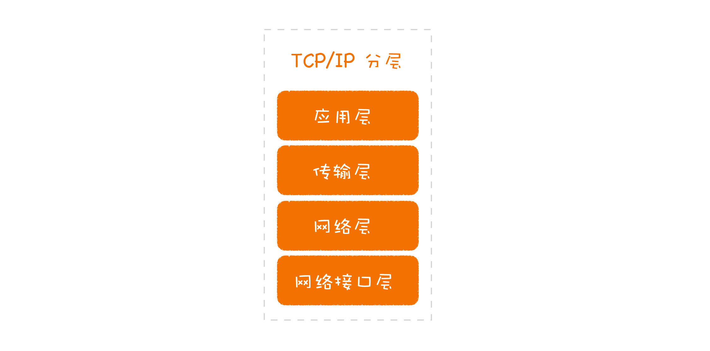

​			

在软件中，我们可以通过构建最核心的基础模型进行构建，然后通过这个模块在组合构建高层的模型。

举例：

​	交易系统---->分析交易动作---->	得到最基础的交易原语（交易动作中最基础的动作）：资产冻结、解冻、出金、入金----->交易动作可通过交易原语组合得到。

交易动作就是高层模型，交易原语就是底层模型

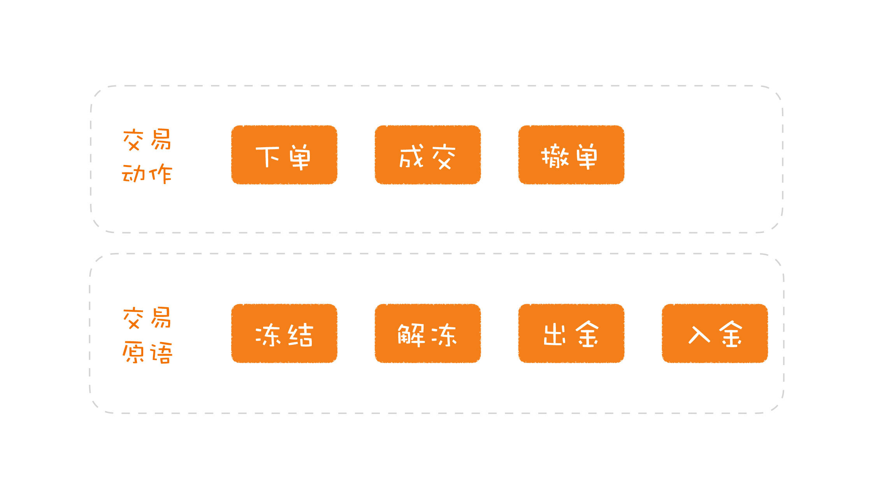

总结一下：

+ 模型是软件核心
+ 好的模型高内聚低耦合
+ 模型可以分层，底层模型提供接口，构建高层模型


#### **约束的规范**

构建模型的时候，一千个人构建的出来的都是不一样。如果一个项目里面不同一些规范，肯定是眼花缭乱的结构、各式各样的模型。

**规范，就是限定了什么样的需求应该以怎样的方式去完成**

+ 与业务处理相关的代码，应该体现在领域模型中；
+ 与网络连接相关的代码，应该写在网关里；
+ 与外部系统集成的代码，需要有防腐层；
+ 外部接口设计
+ 使用什么的操作数据库的框架


**常见规范问题：没有显示的规范**

+ 数据库访问，有用 `MyBatis` 的，有用 JDBC 的，也有用 Hibernate 的；
+ 外部接口设计，有用 REST 风格的，有用 URL 表示各种动作的；
+ 文件组织，有的按照业务功能划分（比如，产品、订单等），有的按照代码结构划分（比如，Resource、Service 等）；


**常见规范问题：规范不符合软件设计原则**

一个网关经常内存爆满，寻找原因是请求过来的JSON数据太过庞大，且有很多无用数据。转化成对象后对象太过庞大，占用过多的内存

解决方法：构建防腐层，在防腐层中吧请求的来的JSON转化成内部小对象。

这就是原来的设计规范不符合设计原则导致的

#### 模型与规范

​		那模型与规范是什么关系呢？模型与规范，二者相辅相成。一个项目最初建立起的模型，往往是要符合一定规范的，而规范的制定也有赖于模型（规范的指定也要根据模型的特点，比如上面的网关层的设计）。

#### 	总结

+ 模型：软件骨架，粒度可大可小，好的模型高内聚低耦合，模型是分层的，高层模型是由底层的模型构建的
+ 规范：构建模型得按照规范来，对于长期维护至关重要。两个常见问题：缺乏显示统一的规范、规范不和设计原则
+ 模型与规范：二者相辅相成，互相依赖

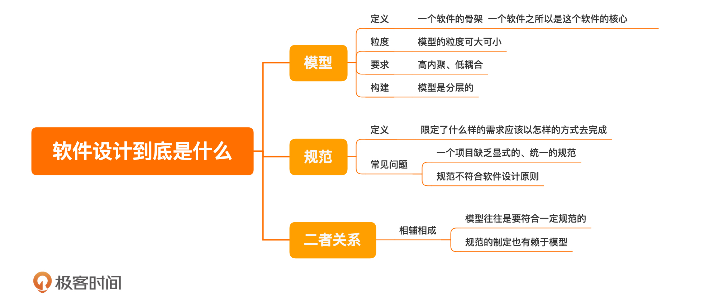


#### 精彩评论


```tex
段启超：
防腐层是模型的一个规范，分享下我对防腐层的认知：
我接触防腐层的概念是从DDD的限界上下文开始的。Eric用细胞膜的概念来解释“限界”的概念，细胞膜只让细胞需要的物质进入细胞，同样，我们的代码之间业务也存在这个样一个界限，同一个对象的业务含义在不同的上下文中是不一样的。以在网上买书为例，在购买页面，我们的关注点在于这本书的名称，作者，以及分类，库存等信息；提交订单后，这本书就成为了订单上下文中的一个订单item，我们会关注这个item 的数量以及购买他的人是谁，以及书的配送地址等； 订单提交给仓库后，仓库会关心这本书还有没有库存，以及打包状态，分拣，物流等状态。
防腐层是在限界上下文之间映射（说白了就是交互）的方式，体现在代码上就是一个对象的转换，这个转换的意义在于隔离变化，防止因为对象在一个上下文中的变化扩散到其他的上下文中。

关于规范：
规范也是团队文化中很重要的一部分，以持续集成为例子，它的执行严格依赖于团队的开发纪律文化，以为了所谓赶进度而单元测试覆盖很低或者直接不写；采用分支策略方开发，一星期都合并不了主干，类似的人到处倒是，也就因为这一点，很多团队都在持续集成这个环节上掉队了。所以开发规范真的很重要，时刻谨记：混乱始于没有规范。

作者回复: 非常好的补充！
```


```tex
西西弗与卡夫卡
业务讨论之后进行领域设计，画出出静态模型（包括子系统、模块等）和动态结构（交互等），或者先勾勒接口（内内外系统的区隔），再做模型。实际过程有很多反复，并且会进行角色代入，看模型能否支持业务，直到模型比较稳定

作者回复: 你们做得很好
```

参考规范


```tex
光明
简单一点的项目，成员相互讨论（主要讨论业务场景和流程），内心会意即可。
复杂一点的项目，设计一般落脚在粒度较粗的文档上，往往也以说明业务流程为主，很少对实现过程中的细节文档化。
所以，我们的项目设计，模型一般会被业务场景和流程替代。文中的「模型」和「规范」，更多取决于工程师了。。。

作者回复: 对，你说的确实符合大部分做设计的方式。这种设计的关注点在于实现功能，而非构建模型。
这种做法容易让人忽略掉哪个东西是核心的，是模型，还是流程。流程是容易调整的，而模型如果变了，这个软件整个就变了。做设计的关键是，找到不变的东西。
```

模型是不容易变得的东西，所以我们应该把更多关注点放到构建模型上。这样一旦发生改动对系统影响最小。


### 02 分离关注点：软件设计至关重要的第一步


设计系统的时候或者解决问题的时我们一般采用的分而治之的方法。

​		在设计的过程中，分解比组合更加重要。一般我们首先知道最终的要什么样的东西，所以我们在软件设计的过程中更加关注对这个东西是怎么分解的。分解完之后我们就会知道怎么组装的了。

​		我们一般在分解的过程就只分解：系统 ，划分各个模块，都是按照大的功能（比如只按照这个软件的客户需求业务功能进行划分，没有抽离一些细小的技术"功能"，下面例子有体现）划分。在多少的情况下，我们分解的粒度会太大，导致一个模型下混杂着不同的东西(耦合到一块了)，为日后开发埋下了隐患。

#### 失败的分解案例

现在，我们举一个失败的分解案例

清结算系统

+ 上游系统推送消息到此系统
+ 上游系统推送来的消息是由结算系统发出去的（初始数据），有记录的
+ 问题：上游系统发送到此系统会出现丢消息的情况

初始的解决方案:

设计一个补偿模式，因为本系统是含有这些消息的初始数据，在数据库里增加一个状态，表示是否收到消息了。一旦发现丢了消息就会访问上游系统，重新推送

初始版本问题：

+ 在业务量大的情况下，丢失消息概率增加，设置的补偿机制会频繁的访问数据库，业务量同时也会增加访问数据库。这样的话系统必然卡顿。
+ 什么原因导致上面的问题呢？通信层面的问题混入到了业务层面上

丢消息从模型分析的角度来说与业务是没有关系的。开发人员在分解的过程中只考虑了功能上的维度，并没有考虑到其他维度的事情。技术和业务混在一起。就会导致了无穷无尽后患。

优化后版本:

丢消息为通信层面的问题，通讯层面的问题，通信层面解决。

选择一个吞吐量大的消息队列，**通信层面的问题在通信层面解决了，业务层面也就不会受到影响了**。

#### 分离关注点

上面的案例已经体现出分解粒度过大导致的问题

我们传统上在做设计的时候，经常就会根据以软件需求功能进行分解，以树形的方式。

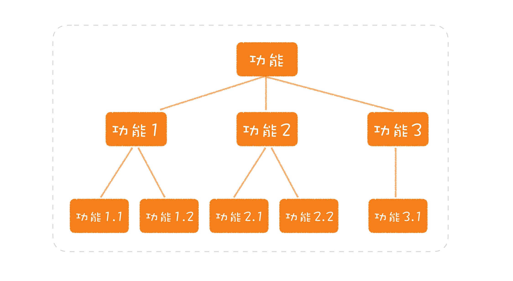

这样会忽略很多隐形的模型，上面的错误案例就是一个非常好的案例，如果想要做出一个好的分，解就不仅仅要考虑功能性的需求，还要考虑非功能性的需求。

​	这些非功能需求和业务功能不是同一维度的，我们在设计的过程中要关注这些到不同的维度，每一个维度就是一个关注点，我们要学会分离这些关注点。（当然由高层维度和底层维度，维度里还能划分不同维度）。

​	有很多的关注点，我们在设计的过程中一定要注意识别关注点，如果识别不出来就会导致混淆，把两个关注点混淆到一块。**最常见的是把业务和技术混在一起**

​	再举一个反例，当我们先提升某一块的功能，我们首先想到是多线程。就直接把多线程一系列的东西，写到了这一块相关的代码中。这样就会导致技术和业务混合。这明明两个关注点。我们应该把多线程处理和业务处理分开。到时候我们直接调用多线程的相关框架就好。

**任何试图用技术去解决其他关注点的问题，只能是陷入焦油坑之中，越挣扎，陷得越深。**上面就是用多线程的技术，解决业务执行慢的问题，直接归并为一个关注点，这是不合理的。

​		还有一个关注点比较容易造成混淆，就是**数据的变动方向**，其实不同的方向应该是不同的关注点。

使用`Sping Data JPA`好还是`Mybatis`呢？JPA适用于简单的数据库的增删改查，Mybatis比较是用于复杂的查询。当我们纠结使用哪一个的时候，可能我们软件设计出现了问题，我们没有把上面两种情况进行分离开，混淆在一起了。当我们可以分离的时候，纠结也就不复存在了。

不同的数据变动方向还有很多，比如：

+ 动静分离，就是把变和不变的内容分开；
+ 读写分离，就是把读和写分开；
+ 前面提到的高频和低频，也可以分解开；

**不同的数据变动方向，就是一个潜在的、可以分离的关注点。** 也不一定非得必须分离，根据自己项目而决定。


宏观层面我们使用到分离关注点，微观同样适用。在设计类的时候有些时候我们不必setter方法，因为在这个关注点中不包含这个。比如某个配置类只在生成的对象时候加载一个复杂配置的文件（比如pfx文件），生成对象。并不能重新设置里面属性的值。只能使用get一些解析出的值

#### 总结

**分离关注点，发现的关注点越多越好，粒度越小越好**。

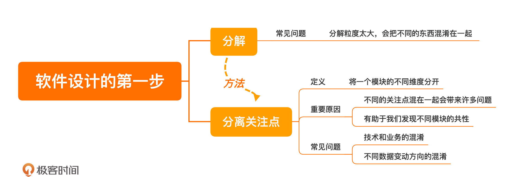


#### 思考题

CQRS（Command Query Responsibility Segregation） 分离了那些关注点，适用于那些情况使用


#### 精彩评论

```tex
Jxin
1.cqrs，命令与查询分离，最早是在ddd实战里面看到。其分离啦增删改与查询这两个关注点。

2.静态上，拆分了这两块的代码。使各自可以采用不同的技术栈，做针对性的调优。动态上，切分了流量，能够更灵活的做资源分配。

3.查询服务的实现。可以走从库，这有利于降低主库压力，也可以做到水平扩展。但需要注意数据延迟的问题。在异步同步和同步多写上要做好权衡。
也可以都走主库，这时候查询服务最好能增加缓存层，以降低主库压力，而增删改服务要做好缓存的级联操作，以保证缓存的时效性。
当然也可以走非关系型数据库，搜索引擎类的es,solr，分布式存储的tidb等等，按需选择。

作者回复: 非常棒的分享！
```

分离关注点很好的例子


```tex
想起Kent Beck 说的一句话，大致意思是：我不准备在这本书里讲高并发问题，我的做法是把高并发问题从我的程序里移出去
作者回复: 没错，就是这样。
```

分离关注点很好的比喻。


```tex
我发现大家在工作中往往不做分离，分析需求的时候把方案揉在一起。
可以怎样去练习做分离呢？
作者回复: 有一种从小事练起的方法，就是写代码时，把自己写的函数行数限定在一定的规模之下，比如，10行。超过10行的代码，你就要去仔细想想是否是有东西混在了一起。

这种方法锻炼的就是找出不同关注点的思维习惯，一旦你具备了这种思维习惯，再去看大的设计，自然也会发现不同的关注点。
```

值得借鉴的实操方法，警示自己，是否没有分离关注点。


```tex
小学一年级
郑老师  我有个需求描述下（类比）： 用户购买网站会员  
我目前的设计用了两张表 
一张表存储用户购买会员的所有记录， 
另一张表 存当前的会员信息 (主要是  开始，结束时间，没有会员等级之类)  单独设计这张表的目的是为了sql关联查询方便，不用再判断是否过期。
但有个问题：我要用定时器一直扫这表，等会员过期了要删除记录。
请问郑老师 我这么做的问题在哪？ 更好的解决方式应该是什么？如果做到更细维度的拆分？


作者回复: 首先，你的描述没有把业务和实现分清楚。

你的业务是实现一个会员系统，具体到这里，是判断用户当前是否是会员。更具体一点的话，会涉及会员购买，主要是会员时间要延长，还会涉及到会员资格的判断，也就是当前用户是否是会员。

基于这些内容的判断，可以有不同的实现。根据你当前的实现，可以这样做：
* 购买会员，如果会员信息不存在，则添加会员信息，如果会员信息存在，则修改会员结束时间。
* 会员资格判别，根据用户 ID 和当前时间是否在时间范围内查询查询，如果记录存在，则是会员，否则不是。

结合你提供的信息，可以考虑的点是：
* 购买会员时，可以产生会员购买记录，此记录仅供后续查询使用；
* 只有当会员信息表过大时，才考虑是否需要删除。

在这个实现中，把购买和会员信息分开，把会员信息是否生效与记录是否删除分开了。

以上仅仅是根据你提供的信息进行的分析，如有不当之处，欢迎继续讨论。
```


```tex
技术和业务混杂的情况，让我想起来一篇文章，大意是说要区分技术异常和业务异常的。也就是说，技术层面的异常信息不应该暴露给上层的业务人员。典型的例子就是大型网站的错误页面，而不是直接把后台的npe堆栈信息抛给用户。
作者回复: 这是一个很好的例子，确实要做区分。
```


### 03 可测试性，一个影响测试的重要元素


​		在软件开发中，那一步最浪费时间。那就是集成测试。我们整体写完代码后，才进行整体测试或和其他几个系统联合测试。往往由于一个小的bug，影响几个系统，而且排查时间比较耗费时间。这种小小简单bug，能不能在整体测试的时候避免呢？因为整体测试涉及资源众多，人员部门也较多。排查问题及其耗费时间，往往还是简单bug导致的。

​		要想解决，就得在我们自己的小功能模块完成的时候测试出来。这就需要我们进行单元测试。但是我们有时候设计的时候，没有考虑到**可测试性**，有些小的模块可能不容易进行测试。**前期设计时就埋下了隐患，根本没有考虑“可测试性”。**


#### 软件设计要考虑“可测试性”

​	软件开发是干什么解决问题，解决问题就是需求，需求分为两大类一类是功能性需求、一类是非功能需求。功能性需求就是直面这些问题的分析出来的需求。

​		非功能性需求分为两大类，一类是执行质量，比如吞吐、延迟、安全，这一类是运行的时候通过运维手段所观察到的，另一类是演化质量，内含于软件结构中	比如测试性、可维护性、可扩展性。

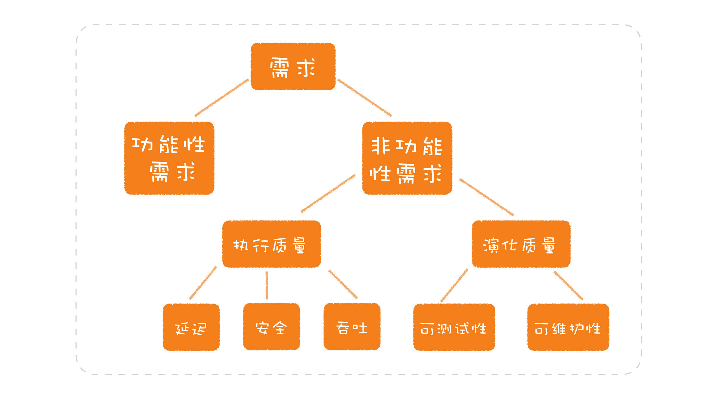

演化质量就需要我们在软件设计中进行考虑，但是我们经常忽略他，尤其是可测试性。

​		可测试性为什么如此重要？就像开头所提到的，经常由于某一个模块简单的bug导致整个测试过程重新再来一遍，成本耗费是巨大的。就像盖房子，我们首先得保证钢筋、水泥这些质量，才进行大房子的质量的保证。一步一步来的。

​		从小的模块保证正确性，来大的模块做正确性作保障，把问题解决在最初的阶段，这样就保证后面的测试成本降低，因为越到后面简单的bug会导致昂贵的成本。所以在设计过程中我们尽可能考虑可测试性。

​		如果可测试性考虑不到位，就就会引发后续问题。比如，如果是复杂的系统会增加测试难度，在集成、部署等各个环节，都有其复杂性，也会增加其难度，完成一次部署往往也需要很长时间，资源成本昂贵，如果出现问题的话，定位问题也会由昂贵的成本。

​		为什么会在集成测试的时候浪费那么多时间呢，因为一些小的简单的问题应该在前面阶段暴漏（比如单元测试阶段），但是可测性考虑的不足导致，导致这些问题暴漏在集成测试阶段，耗费成本昂贵。

​		大部分程序员因为不好测原因，把一些功能测试留到集成测试的阶段。为什么不好测呢？设计的时候，没有考虑可测试性因素。那么如何在设计中考虑可测试性呢？**其实就是要在设计时想一下，这个函数 / 模块 / 系统要怎么测。**

​		**我们在设计一个函数 / 模块 / 系统时，必须将可测试性纳入考量，以便于能够完成不同层次的测试，减少对集成环境的依赖。**

怎么做？

+ 给每一模块尽可能多的测试，减少出错误概率，使其保持稳定
+ 尽可能搭建本地系统环境，周边系统采用模拟服务的方案

软件开发过程中考虑测试，实际上是思考软件的质量问题，而把质量的思考前移到开发，甚至是设计阶段，是软件开发从传统进入到现代的重要一步。


#### 有了测试视角设计

我们使用可测试性，来评判设计模式中的单例模式，**Singleton**。构造函数私有，无法继承，无法模拟。从可测试的角度不是一个好的设计模式。

TDD，就是测试驱动开发，大多数人不知道怎么写是因为不习惯写测试，和不知道怎么写测试。

举个没有考虑测试的例子

```java

class ProductService {
  // 访问数据库的对象
  private ProduceRepository repository = new ProductRepository();
  
  public Product find(final long id) {
    return this.repository.find(id);
  }
}
```


这里我们要测试时候就需要，连接数据库。因为这个数据连接查询的在模块内部生成，无法模拟。连接数据的话这就更佳复杂没资源也就耗费变大。所以这并不是好的可测性的设计。

经过改造后

```java

class ProductService {
  // 访问数据库的对象
  private ProduceRepository repository;
  
  public ProductService(final ProduceRepository repository) {
    this.repository = repository;
  }
  
  public Product find(final long id) {
    return this.repository.find(id);
  }
}
```

这个很明显我们可以注入一个模拟数据库连接的对象，这样就大大简化测试。可以顺利的完成单元测试。这就是考虑可测试性和不考虑可测试性之间的区别。

Spring比EJB有更好的可测试性。软件的发展趋势也和可测试性有相关性

#### **总结时刻**

设计的过程中经常忽略可测试性，导致很多模块无法在单独完成测试，只能被迫在集成测试阶段，我们在设计的过程中要尽可能考虑，**这个函数 / 模块 / 系统怎么测**。在开发中尽可能多的测试某一模块，使其在集成测试前变得比较稳定。

**做软件设计，请考虑可测试性**

#### 精彩评论

```tex
Michael
最近有同事正好在做PDF的生成，也就是把业务数据从各个别的服务拉取回来 然后清洗加工成自己想要的数据 然后传递给模版引擎进行渲染 最终生成pdf文件上传s3 然后通过API把上传的文件地址返回给客户端 想请问老师 这部分逻辑应该怎么测试？因为同事在写完代码之后只做了简单的测试（也就是直接mock其他的service的服务然后mock数据返回 以及mock了s3上传 ）最后只是简单看了一下返回值是否为空就完事了。最后到环境上验证才发现好多字段的格式有问题。那像这类场景我们该怎么合理测试才能尽可能保证做到测试完整性呢？
作者回复: 之所以我们要先讲分离关注点，就是因为很多人会把东西混在一起，测试当然就会很困难了。

以你的场景为例，做 PDF 生成，这里面要拆分开几个不同的环节：
* 从别的服务器拉取数据；
* 解析外部业务数据；
* 业务数据清洗成自己的数据；
* 采用模板引擎进行渲染生成 PDF；
* 将文件上传到 S3；
* 将文件地址返回给客户端。

接下来，就是一个一个分别构建这几个不同的模块，每个模块单独测试。
* 从别的服务器拉取数据：关注数据能否正确获取，获取出错该如何处理，这里需要将拉取协议进行隔离；
* 解析外部业务数据：关注数据能否正确解析，无法解析的数据该如何处理；
* 业务数据清洗成自己的数据：关注数据能否正确转化，业务含义不正确该如何处理；
* 采用模板引擎进行渲染生成PDF：关注渲染过程能否正常进行。需要将PDF作为一个生成目标进行隔离。这一过程需要人工检查生成的PDF格式是否正确。
* 将文件上传到S3：关注文件上传是否正确，需要将文件上传目标进行隔离，S3只是一个目标。
* 将文件地址返回给客户端：关注是否能够获取到文件地址，这里要结合上一项中的上传目标，将S3隔离开来。

各个都测试好之后，再进行集成测试，这里面的关注点就是这些模块联动起来是否能够正常运行，以及检查结果的正确性。
```

很好的案例：分离关注点+可测性设计


```tex
Moonus:
比如service层有个很长，包含复杂逻辑的private方法，但我又想测试他。只能通过最顶层的public方法作为入口，这导致需要保证大量的前提条件的正确，我们需要mock很多外部依赖。
当private方法复杂并包含逻辑，其正确应当重构代码，而不是在测试做妥协，可以将需要测试的private方法转移到另一个对象中，成为一个public的方法。同时让我体会到测试驱动设计的含义。
作者回复: private 方法怎么测？其实是一个伪命题。要测 private 方法，更多的是因为这个类承担了过多的职责，才会出现层层嵌套的方法，才会不好测。

你的改进方法非常对，将这个方法移到另外一个类中，它成了 public 的，该怎么测，就怎么测
```


```tex
段启超:
    和大家分享一下我最近发现的一个问题：滥用@Autowired
    最近在给手上的代码上加测试的时候我进行了如下操作：
    1. 我在测试类中写了一个测试，因为类A中要执行的这个逻辑需要依赖另外一个对象B，于是我把这个需要依赖的对象B从全局变量中移动到构造中，作为参数放了进去，然后再构造方法上加了注解@Autowired。（注意： 原来的这个@Autowired 是在这个全局变量上的）
    2. 我在测试中mock 了这个依赖的B对象，然后给到了这个Service 的实例中去。
    3. 写业务代码实现，让测试通过。 
     
    本来以为测试已经通过，没什么问题了，结果在集成测试启动Spring 容器的时候，发现挂掉了，发生了循环依赖，查看代码，果然，在B中也@Autowired 注入了A ，他们两个就此开始循环～～～～
    结果用idea 的分析工具扫了一通，发现循环依赖不止于此，还有很多很多。。。。。
   
  从这件事儿上体现出来的问题： 
  1:  滥用@Autowired 体现出来的首先就是没有分离关注点，让一个类中做了过多的事情。 现在想过来原来写过的很多代码里头都是一大堆的@Autowired 注入 ，很多XXXService 的代码大概率的会发生这种事情。 
  2:  其实IDEA 编译器里边早就提醒过你了，当你在字段上使用@Autowired 去注入的时候，会有黄线的提示，提醒你不要这么使用，推荐你使用构造器的方式去注入。而很多人的处理方式就是对这个黄线视而不见。 
  3：如果从代码的测试性的角度来出发，你一定不会这么做，因为这么做没有办法去mock 你的依赖。 代码会丑到你自己都不想看。 
  4:  以前没想过循环依赖是怎么发生的，现在明白了：一个罪魁祸首就是滥用@Autowired  。循环依赖本身也是一个设计上的坏味道。如果有人问我说如何解决循环依赖，我会回答他： 首先不要循环依赖。 
 
作者回复: 多谢分享如此惨痛的教训，相信你已经理解了循环依赖的问题所在。

从设计的角度看，循环依赖之所以产生，一个重要的原因就是没有分清接口和实现。如果都是实现，一不小心就循环依赖了，如果分清楚接口和实现，实现依赖于接口，产生循环依赖的可能性就会大幅度降低。
```

其实也是没有分离好关注点 ，分离好关注点尽可能少的出现循环依赖。还有就是要依赖接口，不要依赖实现。

为了可测试性---->构造方法注入---->虽然通过单元测试（都是模拟的假对象，不会发现循环依赖）--->正运行项目的时候发现循环依赖，导致项目奔溃。


```TEX
西西弗与卡夫卡
曾经开发过堆场应用，其中一个步骤是从远端服务器同步到本地服务器，然后再执行本地逻辑。如果每次测试本地逻辑都要从服务端拉取数据的话，就没法自动测了。当时采用的测试方法就是先抓取接口数据生成接口文件，测试就从文件中加载，再运行，最后销毁整个数据库。如果有接口相关的bug，也同样抓取数据保存，构建一个bug号命名的测试方法测试bug。

后来做过系统高可用软件，采用的方法是将代码自动部署到多个Docker里，测试代码里依据场景（为了方便，场景还用DSL写）比如杀某个Docker来测试高可用逻辑是否正常。
作者回复: 很赞的做法！
```

## 了解一个软件的设计

### 04 三步走：如何了解一个软件的设计

我们怎么去了解一个新项目呢？怎么去看一个开源项目的呢？

大多数人看的时候，直接扎进源码debug调试，一步一步的看，不一会儿就云里雾里，痛苦不堪。也没有什么收获，对项目的理解也没增加多少。大多数项目是比较复杂的。

虽然我们必须要阅读详细的实现源码，但是我们首先应该对软件有整体的了解，然后在慢慢深入到内部实现上。我们首先第一步应该是**了解这个软件的设计**。在了解软件设计的过程中，我们也会渐渐的深入了解到实现。我们该如何了解一个软件的设计呢？

#### 模型、接口和实现

可以由三个步骤入手：**模型、接口和实现**。比如（这只是某一层面上的，也可以有一个多系统组成大系统的层面上的）

+ 看有什么类，类与类之间是什么关系。这就看模型
+ 打开一个具体的类，看每一个向外部提供了什么样的方法，作用是干什么的。这就是看接口
+ 看一个个具体的方法是怎么实现的，使用什么的技术。这就是看实现


**模型**

我们之前说过，模型（也可称为抽象）是软件的核心，如果我们了解了一个软件的模型，我们也就构建出了这个软件的整体认知。


当你知道了模型的重要性，目光甚至可以不局限在某一个软件上。如果把同一个领域不同阶段的多个模型联系起来看，你还能看到软件发展的趋势。就拿下面的分布式计算来说

+ 我们自己写分布式计算	要关注不用节点的调度计算，以及详细实现
+ 使用MapReduce时候我们只关注，把一个大的计算拆分开（Map）最后在汇总（Reduce）即可，不用关注上面那个节点作什么计算
+ Spark 来说我们就只关注，我们需要做的是什么计算。不用自己拆分计算

也许这就是发展趋势吧

**接口**

接口就是把自己能力提供出去的一个对外出口，当前模型对外需要提供什么的能力。模型之间交互的时候使用这些接口，来获取相应执行结果。

+ 一个程序库的接口就是他提供的API，同样的模型不同人会提供不同的接口。比如：Google 的 Guava 对 JDK 的一些 API 重新做了封装，其目的就是简化开发，而很多优秀的做法后来又被 JDK 学了回去。
+ 一个工具软件会提供命令式接口----Unix 命令行工具就是典型的命令行接口。
+ 一个业务系统对外提供的接口就是，供其它系统调用`RestAPI`

了解具体实现，必须要先了解这个部分实现，是为了那些接口。根据接口，我们在具体深入到具体实现中，看它是怎么实现这个接口的，接口就是风向标 。

**实现**

实现就是了解模型和接口内部什么怎么实现的。这就是真正的功能实现了。

+ 一个业务系统收到一个请求之后，是把信息写到数据库，还是转发给另外的系统。
+ 一个算法的实现，是选择调用与别人已有的程序库，还是需要自己实现一个特定的算法。
+ 一个系统中的功能，哪些应该做成分布式的，哪些应该由一个中央节点统一处理。
+ 一段业务处理，是应该做成单线程，还是多线程的。

上面就是某一层面的具体实现的。

#### 了解设计三步走

我们在讨论设计的时候，经常把这三个层面混到一块进行讨论。最后讨论越来越混乱，导致也讨论不出来什么。

讨论的时候我们一个层次一层次的进行讨论： **先模型（都需要那些模块，模型呀，做出那些抽象啊），再接口（模型之间交互需要什么的接口呀），最后是实现（采用什么技术啊等）**

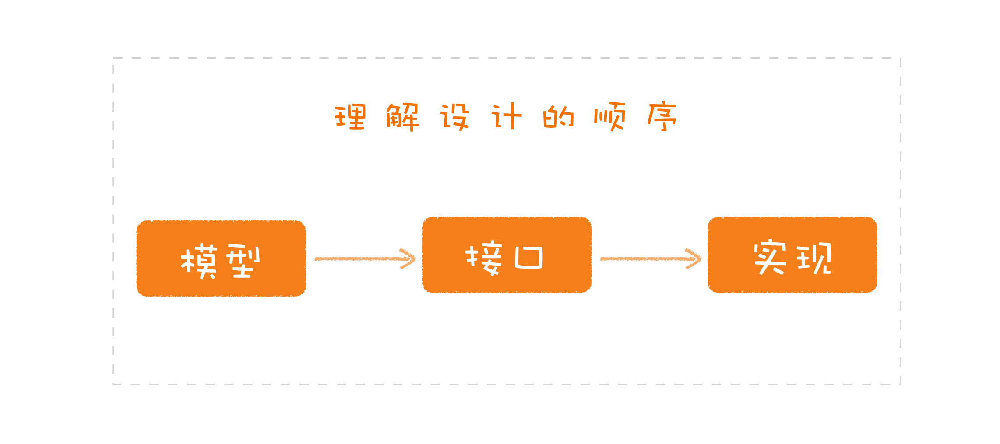


​		如果模型没有捋清楚，就直接进入细节。首先会导致整体架构在头脑中显得混乱，其实我们就很难捋清楚那些是应该可以替换的（能有不同的实现），那些东西是必须隔离的（做一层防腐层，兼容不同实现？），那些是必须保留的（技术怎么变都需要保留下来的模型）。

​		下面是错误的架构图，把模型和实现混合在一块，Kafka很明显是具体的实现方案，不能在这个架构图中

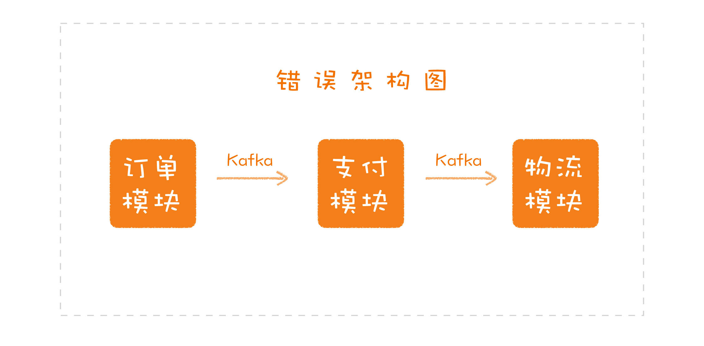

Kafka 只是实现这个功能时的一个技术选型，这也就意味着，如果随着业务的发展，它不能很好地扮演它的角色，你就可以替换掉它，而整个设计是不用变的。


​		因为软件的设计是分层的，我们在了解的时候分层的去了解软件的设计。我们要看高层的 模型接口 实现，我们在往下了深入了解的过程中，也要了解底层的模型接口实现。我们打开这个某个层次后，在这个层次上进行三步走策略。

​		进程管理为例：

+ 进程管理的核心模型就包括进程模型和调度算法；
+ 它的接口就包括，进程的创建、销毁以及调度算法的触发等；
+ 不同调度算法就是一个个具体的实现。

即便层层展开到最后，到了一个具体类，甚至是一个具体的数据结构，我们依然可以按照模型、接口和实现这个结构来理解，比如很多 Java 面试题常问到的 `HashMap`：

+ 它的模型就是我们在数据结构中学习的 `HashMap`；
+ 它定义了一些接口，比如，get、put 等；
+ 它的实现原来是用标准的 `HashMap` 实现，后来则借鉴了红黑树。


#### 总结时刻

+ 模型：软件核心，了解了它也就了解软件的整体结构
+ 接口：把模型提供的能力保留出去
+ 实现：支撑功能基础，具体如何实现的要暴漏的功能

了解设计的顺序应该是，先模型，再接口，最后是实现。了解设计，需要一层一层地展开，在每个层次都按照模型、接口和实现进行理解，在头脑中形成一棵设计树。


**了解设计，先模型，再接口，最后是实现。**

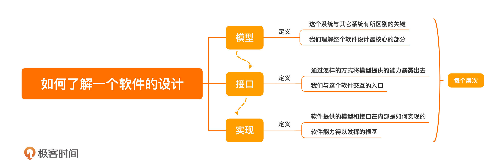


#### 精彩评论

```tex
西西弗与卡夫卡
模型，通常包含两类要素，一是基本元素，二是这些元素之间的关系。比如常见的CRM，基本元素就包括项目、客户、合同和回款，相互之间的主要关系通常是客户报备，进入立项环节（评估投入产出），再签约，最后进入回款环节。这是基本模型。

这个模型（系统）的接口，就是要为BD提供从客户报备到签约、回款的整个流程管理。

实现就是要考虑如何用消息在这些模块之间传递数据，状态控制、数据查重锁定等等。
作者回复: 赞，这个思路很清晰！
```


### 05 如何分析一个软件模型

拿到一个项目，首先分析模型。分析到什么地步呢？

首先我们得肯定要知道，都有什么模型，模型的功能是干什么的。但这是不够的。

但这是不够的，比如一个新人改变模型的实现但没改变功能。或者向模型里面添加内容。有时候会导致模型的混乱。

了解一个模型，首先要了解这个模型的解决了什么问题？是怎么解决问题的？没有这个模型的时候是怎么解决的？为什么模型这个解决这个问题？模型在解决问题方面获得怎么提升

**理解一个模型的关键在于，要了解这个模型设计的来龙去脉，知道它是如何解决相应的问题。**

下面`SpingDI`为例子，理解软件模型。


#### 耦合的依赖

Spring的根基为Spring的DI容器，DI也就是依赖注入。解决组件的创建和组装的问题。我们在设计的时候进行了拆分，我们们在实现功能必然需要我们进行组装。DI容器就解决这个这个问题。

​	举个栗子，我们有一个文件服务

```java

class ArticleService {
  //提供根据标题查询文章的服务
  Article findByTitle(final String title) {
    ...
  }
}

interface ArticleRepository {
  //在持久化存储中，根据标题查询文章
  Article findByTitle(final String title)；
}
```


在实现`ArticleService`的时候我们需要`ArticleRepository`,辅助实现。怎么做呢？增加一个字段

```java

class ArticleService {
  private ArticleRepository repository;
  
  public Article findByTitle(final String title) {
    // 做参数校验
    return this.repository.findByTitle(title);
  }
}
```


怎么初始化呢？

```java

class ArticleService {
  private ArticleRepository repository = new DBArticleRepository();
  
  public Article findByTitle(final String title) {
    // 做参数校验
    return this.repository.findByTitle(title);
  }
}
```

因为数据需要共享连接，就变成下面的代码

```java

class ArticlService {
  private ArticleRepository repository;
  
  public ArticlService(final Connection connection) {
    this.repository = new DBArticleRepository(connection);
  }
  
  public Article findByTitle(final String title) {
    // 做参数校验
    return this.repository.findByTitle(title);
  }
}
```


假设我们需要测试，上面写法，我们进行测试的话，我们必须就准备一个数据库连接了，无法模拟`ArticleRepository`组件提供的功能。要准备数据库，还得要插入数据，才能查询数据。这个时候你发现我仅仅想要测试一下服务，但是不得不还得和数据库进行联调。


#### 分离的依赖

上面来说，出现那些问题的关键是，创建对象的时候就出现了这个问题。

上面的实现的方式让`ArticlService` 依赖了实现类`DBArticleRepository`。但是对于`ArticlService`只依赖`ArticleRepository`就可以满足功能。上面的哪种方式增加不必要的依赖让`DBArticleRepository`实例化所需要的各种参数都变成了`ArticlService`的依赖。

构建对象的时候我们需要的东西还有很多，这都变成了负担。

+ 根据不同的参数，创建不同的实现类对象，你可能需要用到工厂模式。
+ 为了了解方法的执行时间，需要给被依赖的对象加上监控。
+ 依赖的对象来自于某个框架，你自己都不知道具体的实现类是什么。


由此来说，对象的创建和组装，实际上也不简单。（我们要思考在哪里创建，怎么组装）

我们把对象的创建移出去，只留下字段的关联过程（引用）。

```java

class ArticleService {
  private ArticleRepository repository;
  
  public ArticleService(final ArticleRepository repository) {
    this.repository = repository;
  }
  
  public Article findByTitle(final String title) {
    // 做参数校验
    return this.repository.findByTitle(title);
  }
}
```

这样的话就不会依赖实现类创建的时候，所需要的东西了。

我们在测试的时候，就可以模拟一个`ArticleRepository`实现类，不用连接数据库，这样就会更好的测试我们写的业务功能了。


所依依赖的对象已经分离出去了，组装也就随之分离出去了。对象的创建和组装需要有一个地方去完成的。

```java

...
ArticleRepository repository = new DBArticleRepository(connection);//对象的创建
AriticleService service = new ArticleService(repository);//对象组装成，组装成新的对象
...
```


这部分代码比较机械，但是有很重要。一个复杂项目有很多这种创建和组装，有专门的框架解决这种问题。这种问题一般被称之为容器。

```java

Container container = new Container();
container.bind(Connection.class).to(connection);
container.bind(ArticleReposistory.class).to(DBArticleRepository.class);
container.bind(ArticleService.class).to(ArticleService.class)

ArticleService service = container.getInstance(ArticleService.class);
```


`SpringDI`也就是干这个。


Martin Fowler写的文章 [《反转控制容器和依赖注入模式》](https://www.martinfowler.com/articles/injection.html)

把对象的创建和组转写到一个类里面，这就会造成大量的耦合，很多做测试。可测试性可以衡量一个设计的优劣，减少不必要的耦合


有了这个容器，我们可以更好的做到面向对象的编程，而且还可以在容器上不断增强功能，比如我们在数据库相关代码上加上时间监控，我们可以让容器在创建的时候加上时间的处理。这其实就是我们的AOP。

SPring很好的引导了我们设计的方向，这样我们项目就会相应的质量保证。我们要理解SpringDI的引导方向这样的话，我们就能更好利用它的特点。

上面的分析我们不仅了解模型的功能，他为什么这样实现这个功能的来龙去脉， 以什么思想去实现的。所以说了解模型的实现思想就会更好扩展和维护这个模型。


#### 总结时刻

了解模型

+ 要了解有什么模型，和模型提供什么的功能
+ 了解模型设计的来龙去脉

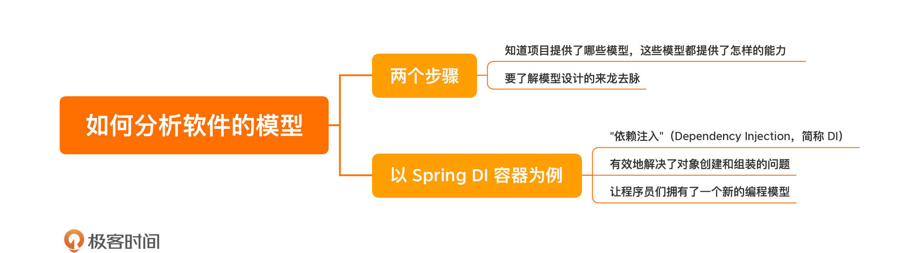


### 06  Ruby on Rails：如何分析一个软件的接口？

JDK中有很多API 接口，我想世界上没几个人所有的都知道，有些接口可能在JDK发展的过程中消亡了，甚至人们都没有发现它。

一个项目中有这么多纷繁复杂的接口，我们怎么来找出我们想要的接口，并加以分析呢？

**找主线，看风格**

​		我们选出一条核心的功能主线，沿着功能主线了解这些接口向外提供的功能以及他的用法。而不是一开始我们就直接扎进去看一个项目的多有接口的实现细节。这样会把我们绕晕，得不偿失。

​		还有一个细节就是，观察这些接口的设计风格，因为设计风格就是这个项目希望我们扩展的时候所按照的风格。接口的风格就能看出项目的品味，可以让使用清晰而又优雅的使用。

​	统一风格也便于维护，不同的风格在一个项目中 势必会造成混乱，


我们就以Ruby on Rails来为参照物，找主线，看风格。看看他的接口风格有什么特点，有什么我们值得吸收的地方。

#### Ruby on Rails 模型

Ruby on Rails 是一个基于 MVC 模型进行开发的 Web 框架，生成的接口比较优秀，比较有借鉴意义，我们从这个框架来演示一下如何分析接口。

找到项目主线的一个方法就是从起步走文档开始，因为它会把项目最基本的用法展现给你，你可以轻松地找到主线。

Rails 的起步走文档 显示一个WEB项目如何开发的流程，这就是我们要找的主线。

Rails 给我们提供的三种接口，分别

+ Web 应用对外暴露的接口：REST API；
+ 程序员写程序时用到的接口：API；
+ 程序员在开发过程中用到的接口：命令行。

通过这三种接口我们分析它的接口的风格。


#### REST 接口

REST 当年的问世是 Roy Fielding 博士为了纠正大家对 HTTP 的误用。但是当时不知道怎么落地，Rails很好落地了，对行业做了一定的贡献。


```ruby
Rails.application.routes.draw do 
    ... 
    resources :articles 
    ...
end
```


Rails 写程序的时候，你只要添加一个 resource 进去,就会生成怎么去写相应的URL

```tex

$ bin/rails routes
      Prefix Verb   URI Pattern                  Controller#Action
    articles GET    /articles(.:format)          articles#index
             POST   /articles(.:format)          articles#create
 new_article GET    /articles/new(.:format)      articles#new
edit_article GET    /articles/:id/edit(.:format) articles#edit
     article GET    /articles/:id(.:format)      articles#show
             PATCH  /articles/:id(.:format)      articles#update
             PUT    /articles/:id(.:format)      articles#update
             DELETE /articles/:id(.:format)      articles#destroy
        root GET    /                            welcome#index
```

这就是人家总结出来的接口风格，比较不错的，按着这个规则写是没有问题的。


#### API 接口

当我们查询数据的时候 ，简单查询早已经被Rails封装完善了，我们只要调用对应的方法

比如我们查询文章

```ruby
Article.find_by_title("foo")
```

 ```ruby
 Article.find_by_title_and_author("foo", "bar")
 ```

放在同时代java中，我们就不得不写一个个的sql语句，再去封装方法。这工作量的差距是巨大的。Rails设计的接口没有暴露出太多细节给使用者，如果暴漏太多就会影响增加，让使用者，参与其中就会出现，就会增加犯错概率。


Rails的API，有很好的表达性，使用者一目了然知道这些是干什么使用的。


```ruby

class Article < ApplicationRecord
  has_many :comments
  ...
end
```

传统的java风格

```java

class Article {
  private List<Comment> comments;
  ...
}
```

在传统java风格中，如果用 List ，你是无法辨别它是一个属性，还是一个关系的。

`Spring Data JPA`做了改进,这都是基于上面的影响。

```java

class Article {
  @OneToMany
  private List<Comment> comments;
  ...
}
```

```java

interface ArticleRepository extends JpaRepository<Article, Long> {
  Article findByTitle(String title);
  Article findByTitleAndAuthor(String title, String author);
}
```


使用的时候直接调用接口即可，自动帮你实现了

```java
class ArticleService { 
    private ArticleRepository repository; ... public Article findByTitle(final String title) { 
        return repository.findByTitile(title); 
    }
}
```


#### 命令行接口

我们在来看一下他的命令行接口，

创建一个新的项目

```shell
$ rails new article-app
```


命令执行的结果生成的不仅仅是源码，还有一些鼓励你去做的最佳实践，比如：

+ 它选择了 Rake 作为自动化管理的工具，生成了对应的 Rakefile；
+ 它选择了 RubyGem 作为包管理的工具，生成了对应的 Gemfile；
+ 为防止在不同的人在机器上执行命令的时间不同，导致对应的软件包有变动，生成了对应的 Gemfile.lock，锁定了软件包的版本；把对数据库的改动变成了代码；……

我们可以直接启动项目

 ```shell
 $ bin/rails server
 ```


如果想编写代码可以利用命令生成代码股价，你可以在里面进行编写

```shell
$ bin/rails generate controller Welcome index
```


#### 总结时刻

本部分，通过一个案例来了解接口相关的分析，寻找出一个主线，按照这个主线分析接口的风格。便于自己吸收，或者有机会参与扩展。

我们自己设计接口的时候也要注意接口相关的风格设计。

从 Rails 的接口设计中，我们可以看到，一个好的接口设计，无论是最佳实践的引入，亦或是 API 设计风格的引导，都可以帮助我们建立起良好的开发习惯。

**理解一个项目的接口，先找主线，再看风格。**


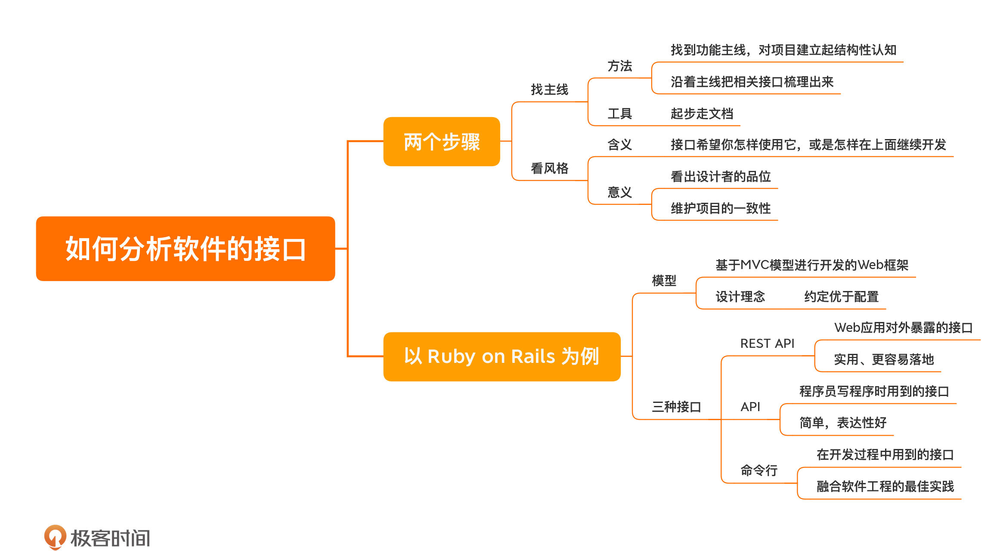


#### 精彩评论


```tex
找主线，看风格。找主线看文章，看风格看接口。从上到下，从整体到局部。不过这也是正常读源码的一个步骤。
作者回复: 太喜欢你这个评论了，这就应该是正常的步骤啊，可是很多人不知道。
```


 


### 07 Kafka：如何分析一个软件的实现？


分析一个软件的模型的实现，我们总不能看这个模型内部一点点的模型的实现。各种细节性的代码吧。这种方法势必会导致我们有迷失在其中的。

我们在分析需要用两个关键点进行分析：**软件的结构和关键的技术**。

我们以Kafka为例子来分析它的软件实现。当然我们不得不首先了解一下的他的模型和接口

#### 消息队列的模型与接口

我们应该分析的它的核心模型，kafka 的核心模型——消息队列上。

站在看模型的角度上，消息队列是很简单的，无非是生产者发消息，消费者消费消息。而且消息队列通常还会有一个 topic 的概念，用以区分发给不同目标的消息。

基本接口也很简单

生产者：

```java
producer.send(new KafkaRecord<>("topic", new Message()));
```


消费者：

```java
ConsumerRecords<String, Message> records = consumer.poll(1000);
```


#### 软件的结构


下面我们讲软件结构。软件结构是什么，软件结构其实也是上面的提到的模型，只不过他是这个模型的内部结构，不再像上面一样是封闭的，你可以透视的看到它的内部结构。其实也就是，它不是整体上的模型，而是展开实现细节之后的模型。

​		把他打开后后会发现会有很多小的模型的，不同小的模型的组合形成了这个模型。

打开一个模型后，想要了解它的实现，最好是通过一个结构图。

找到结构图后，首先呢我们肯定了解他的各个结构，还要推断出这么设计的动因。如果不容易找出，那么最好带着问题思考，要是让我设计我应该怎么设计。然后对比真正的不同之处在哪里，或者你的纠结之处在哪里，这些就是找出动因的关键。

​	 对于理解Kafka来说，我应该思考的是：**如果我来设计一个消息队列，你会怎么做呢？**


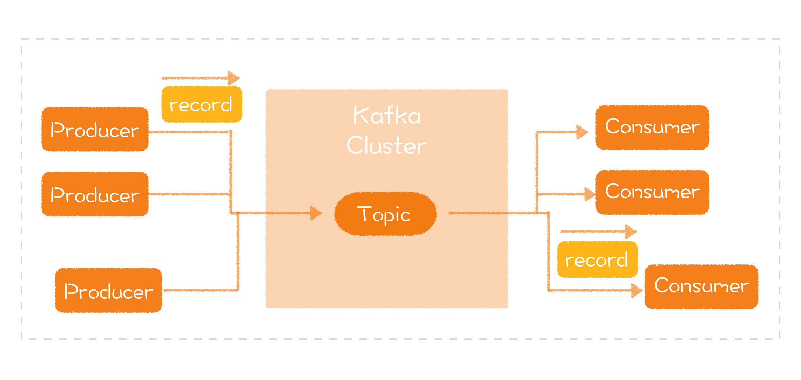

上面是Kafka的设计图，可能会和我之前想不一样，基于Kafka的设计图我们怎么能进一步的设计呢？

+ 生产者端封装出一个 SDK，负责消息的发送；
+ 消费者端封装出一个 SDK，负责消息的接收；
+ 设计一个集群系统，作为生产者和消费者之间的连接。

然后会出现更多的问题

+ 生产端如果出现网络抖动，消息没有成功发送，它要怎么重试呢？
+ 消费端处理完的消息，怎样才能保证集群不会重复发送呢？
+ 为什么要设计一个集群呢？要防止出现单点的故障，而一旦有了集群，就会牵扯到下一个问题，集群内的节点如何保证消息的同步呢？
+ 消息在集群里是怎么存储的？
+ 生产端也好，消费端也罢，如果一个节点彻底掉线，集群该怎么处理呢？

我们衍生成更多的问题，这样我们可以进一步带着这些问题去看Kafka的解决思路。

**Kafka 不是一个特别复杂的系统。所以，如果你的项目更复杂，层次更多，我建议你把各个层次逐一展开，先把整体结构放在心中，再去做细节的探索。**


#### **关键的技术**

什么算是关键技术呢？就是能够让这个软件的“实现”与众不同的地方。了解关键技术可以保证一点，就是我们对代码的调整不会使项目出现明显的劣化，好的实现优化成差的实现，就太可悲了。

以 Kafka 的写入做了优化，是整体性能表现较好。怎么做到呢？

Kafka根据**磁盘顺序读写**的特性，对写入操作进行优化：**利用内存映射文件减少用户空间到内核空间复制的开销**。，当然它的消息队列是有序，所以能支持他这么做。Kafka 的这个软件结合的思路去优化程序，是比较有借鉴意义的。

LMAX Disruptor 有一段代码来提升性能，也是软硬结合

```c++
protected long p1, p2, p3, p4, p5, p6, p7;
```

这段代码与CPU的缓存机制有关。《深入理解计算机系统》是一本不错的书籍


#### 总结时刻

软件结构和关键技术入手。这两方面在分析的时候都要带着自己的问题去思考他的设计与实现。

**理解实现，带着自己的问题，了解软件的结构和关键的技术。**

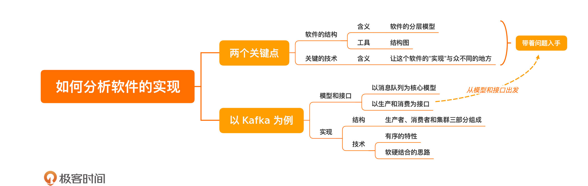


#### 精彩评论

```txt
Jxin
旁外话: 我的能力只能做到描述自己的理解。我描述自己的理解是希望能从栏主和其他学员处获得反馈，从而调整个人认知。我的身边缺少在软件设计上有追求的队友，很感谢有这个平台可以让我试错，交流，调整。

1.我认为软件的结构和核心技术应该是分开的。kafka之所以是消息队列，看的是对消息队列这个模型的实现。kafka之所以是kafka看的是其消息存储这一核心技术的实现。所以，如果我是想通过看kafka了解消息队列，那么就没必要也不该去看存储实现，我该看的是，路由信息管理,消息生产,消息消费这3块核心业务的骨干，以及其旁支功能的选择(限制消息大小,故障节点延后,延迟消费)；如果我想知道kafka为什么在mq中间件中如此突出，那么我就得了解其核心技术的实现，也就这里所说的'软硬结合的存储设计'。

2.谈谈对模型的理解。模型是一个抽象的概念，被抽象的对象可以是某个聚合实体(订单中心中的订单),也可以是某个流程或功能(java内存模型中的主存与缓存同步的规则)。分层对模型来说是实现层面的东西，是一种水平方向的拆分，是一个实现上的规范；模型的细粒度拆分（父模型,子模型），应该是一种垂直维度的拆分，子模型的功能要高内聚，其复杂性不该发散到外部。

3.protected long p1, p2, p3, p4, p5, p6, p7; 这个玩意是Disruptor的缓存行填充中的填充字段。Disruptor中的一个元素是一个volatile的long类型,占用8字节。一但一个元素被修改，则与其出于同个缓存行的所有元素的缓存都会失效。这就导致变更索引位1的元素，会导致索引位0的元素缓存也失效(操作时需要重新从主内存加载)。故而Disruptor做了一个缓存行填充的优化,在目标元素的前后都加了7个类型字段,两边都占据掉56个字节。故而保证每个元素都独占缓存行。是一种用空间换时间的优化。

4.04讲说过要拿个开源项目来分析，刚好我拿的也是mq，就借当前这个篇幅补充下。我看的是RocketMq，目前看完了路由信息管理中心，消息生产端和消息存储的逻辑。拿路由信息管理中心NameServer来说。
被抽象的模型对象是路由信息管理中心,既包含路由信息也包含路由信息的管理。路由信息由QueueData，Broker，TopicRouteData三个实体承载，路由信息管理由BrokerLiveInfo和RouteInfoManager负责。
提供了路由注册，路由发现和路由删除三个接口。
路由注册的接口触发是以Nameserver处理Broker的心跳包的方式接入的，具体代码见RouteInfoManager#registerBroker。
路由发现的接口触发Nameserver不管,由客户端定时请求获取路由信息，具体看DefaultRequestProcessor#getRouteInfoByTopic。
路由删除接口的触发是由Nameserver定时10S扫一遍brokerLiveTable。将超时120s的broker信息全部剔除。或者broker正常关闭会来调用。具体见RouteInfoManager#scanNotActiveBroker和unregisterBroker。

评价，
作为路由信息中心，功能相对简单，所以技术设计上就没太多好说的。比较突出的就是NameServer节点间不做信息同步，每个NameServer都单独接收broker的心跳维护路由信息。这样的设计无疑极大降低了NameServer实现的复杂度，毕竟集群内消息同步一直是个头疼的事情。但是这样的方式，在NameServer节点过多和broker节点过多的场景下感觉都会有性能瓶颈(单位时间心跳的次数增多和需要心跳通知的节点增多)。可是这样的设计依旧抗住了大规模集群的场景，用实践案例打了我理论感观的脸。
但作为一个apache开源项目，其代码实现风格实在令人难受。违反单一职责原则，NamesrvController做了外放接口，存储数据，启动定时等等一系列事情。且因为涵盖数据容器的职责，所以还需要再其他类中传递。违反依赖倒置原则，接口都找不到，就不用提啥基于接口而非实现编程了。如果要说这个项目的风格或者说代码设计偏好，那么就是没有原则，甚至都看不到阿里巴巴编程规范的影子。而这个问题不仅是在NameServer一个子模块中，而是在整个rocketMq模块都普遍存在。于此带来的就是，这个项目的新老交接，持续迭代，成本都会比较高。
限于篇幅，其他部分就不表了。rocketMq是个很优秀很成功的产品，但也因为它的光辉，目前其背后的代码实现才越显得格格不入。
作者回复: 感谢你的分享，其他人可以从中学习到新的知识。
```


```txt
Y024

很多开源项目都会是基于某篇论文实现的，而这篇论文也就成为该项目的灵魂。

对于 Kafka 来说，它的灵魂是：
https://engineering.linkedin.com/distributed-systems/log-what-every-software-engineer-should-know-about-real-time-datas-unifying

中文版本：https://www.kancloud.cn/kancloud/log-real-time-datas-unifying/58708
作者回复: 多谢分享
```


## 设计一个软件-程序设计语言

### 08 语言模型：如何打破单一语言局限，让设计更好的落地


程序设计语言其实就是一个软件，他也有自己的模型、接口、和实现。

程序设计语言提供给我们的是可编程功能，我们可以理解学习程序设计语言就是学习程序设计语言提供的编程模型。

不同的程序设计语言的编程的模型有不同的特点的，但是不要被语言本身所局限住，我们在编程的时候可以吸收其他编程语言的编程模型的特点。举一个例子：

+ 面向对象用来组织程序是好，但我用的是 C 语言；
+ 我用的是 C++，函数式编程的好，跟我有什么关系；
+ 动态语言那些特性很好，可惜我用的是 Java；……

这就是被自己的所使用的语言提供的编程模型所限制住了，这种思维方式会让你即便学到了更多的好东西，也只能无可奈何。

​		**你可以根据项目特点选择合适的语言，也可以将其它语言一些优秀的地方借鉴过来。**比如：不同的程序组织方式，不同的控制结构等等。因为不同的编程模型会带给你不同的思考方式。 语法、标准库、第三方库都是在提供编程模型。

举例来说 c可以利用指针模拟出多态，利用函数指针可以模拟出抽象类。不要被自己的语言所提供的固有的编程模型所局限住。

学习模型就得知道模型的来龙去脉，编程模型也不例外。


#### 程序设计语言发展简史

​		因为计算机只能识别0，1 。所以在最初的时候， 大家都是用0，1，编写出一些指令来告诉计算机来怎么使用。太麻烦了，衍生出一些操作符，类似于ADD、MOV，这就是汇编语言。

​	汇编语言，都是一些操作机器的命令，暴漏很多及其相关细节，不同机器命令好像还不太一样，不利于编写程序。就诞生高级编程语言。集大成者就是C语言。

​		程序规模有越来越大，编写出的代码越来越多，越来越不好管理。如何组织程序又成了新的挑战。c++带来了具有面向对象的特性的编程模型。为大型项目开发了提供了保证。

​		c++依然存在一个问题，就是把内存管理暴漏出来了，这就很容导致使用者错误的使用内存导致系统奔溃。由于内存管理如果屏蔽掉有可能导致性能的下降，很长一短时间能够自动管理内存的语言都没有得到广泛使用。

​		随着硬件性能提升了，内存自动管理的语言焕发新生，这一阶段最终的胜利者是java。一方面支持面向对象编程，一方面支持垃圾回收机制（一种内存管理方式）


上面的发展历程我们可以看出，**让使用者的注意力放在需要真正要解决的问题上，探索怎么更好地解决问题。**

上面就是编程模型的来龙去脉。

#### **一切语法都是语法糖**

**学习程序设计语言其实就是要学习语言提供的编程模型。**

+ C 语言提供了对汇编指令直接的封装。
+ C++ 先是提供了面向对象，后来又提供了泛型编程。
+ Java 把内存管理从开发者面前去掉了，后来引入的 Annotation 可以进行声明式编程。
+ Ruby 提供了动态类型，以及由 Ruby on Rails 引导出的 DSL 风格。
+ Scala 和 Clojure 提供了函数式编程。
+ Rust 提供了新的内存管理方式，而 Libra 提供的 Move 语言则把它进一步抽象成了资源的概念。

上面就是不同语言的提供的一些有特点的编程模型。

 **语法糖（Syntactic sugar）**：那些为了方便程序员使用的语法，它对语言的功能没有影响。


要想更好地理解程序设计语言，一种好的做法就是打开语法糖，了解一下语法是怎么实现的：

+ 类型是一种对内存的解释方式。
+ class/struct 是把有相关性的数据存放到一起的一种数据组织方式。
+ Groovy、Scala、Kotlin、Clojure 等 JVM 上的新语言，提供了一种不同于 Java 的封装 JVM 的方式。


当你手里有了足够多的“武器”时，你就可以打开思路，运用不同的方式解决问题了，甚至把其它语言的好东西，借鉴到自己使用的语言中。

#### 总结时刻

语言发展趋势，让使用更加专注于真正要解决的事情。

一切语法都是语法糖，都在现有的结构上不断添加出来的。

每天至少学习一门语言。

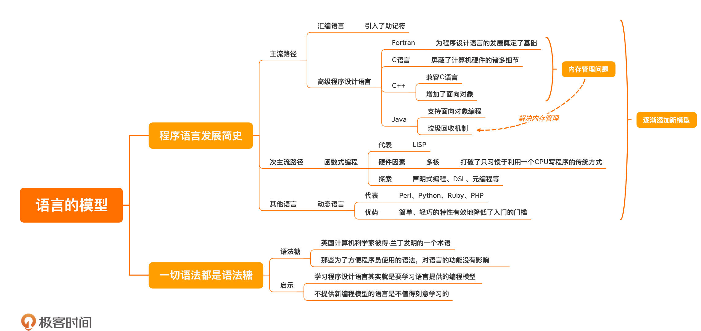


#### 精彩评论

```tex
业余爱好者
操作系统等各种软件有模型，编程语言也有模型，计算机世界里模型真是无处不在啊。模型就是一种看待世界的方式，一种模型的提出的最大的动力是为了解决某个问题。

编程语言的发展就是各种编程模型的演化。从图灵机模型到冯诺依曼的存储程序模型，机器语言，汇编，一直到千姿百态的高级语言。每种语言都提供了一个编程模型，这个模型越来越高级，越人性化，越贴近人的思维。

拿自己熟悉的java语言举例。尽管java是用c++语言写成的，但Java提供了不同于c++的内存与线程模型（Java的六种线程状态并不与os的各种线程状态一一对应，内存的划分也是如此），大大简化了开发。


每年学一门新语言，也就是每年学一个新的编程模型。
作者回复: 很好的补充，我这里只说了语言的演变，你补充的线程信息很好！

```


```tex

Jxin
1.最早了解到LISP,应该是在Paul Graham的Hacker News和Arc语言（为了证明Arc写了Hacker News，Arc没火Hacker News却火了）。
2.Paul Graham提出了著名的 Blub 论断，这个论断讨论这样一个问题：“不同的编程语言到底有什么不一样？是不是一种编程语言比另外一种编程语言更高级？”
3.为了表达观点，他引入了一个叫作 Blub 的语言。这个语言比机器上的二进制语言要高级一点，但是比市面上的任何高级语言都要低级。为什么从一个使用 Blub 语言的程序员的角度去看，机器上的二进制语言是一个更加低级的编程语言？因为它缺乏了 Blub 拥有的语言特性。但是从一个使用二进制编程语言的人的角度来看，其实两者没什么差别，因为即便有多余的特性，二进制语言编程者也不会去用那些东西，而只会用属于二进制语言的那个子集。
4.结论就是: 使用更高级语言的人知道低级语言缺乏了一些高级语言的特性，所以低级语言显得更原始，而低级语言的开发者却无法发现高级语言里面蕴含的额外的语言特性。
5.我的认知: 个人不喜欢高低之分,毕竟存在即合理,每款现存的语言都会有它高的地方和低的地方。但是Paul Graham的论断其实也反应了一些问题。就是人们往往会陷于自己的已有认知(毕竟阻力最小)。做为一个java程序员,无论是写py还是写go多多少少都有点用py和go语法写java代码的味道(也因为我在py和go的水平不够)。所以栏主所说的，学习语言是增量学习这个是对的，但已有认知也会是陷阱，这就导致我可以很快学会一门语言的语法，但很难接受其背后的编程模型。已有认知带来的偏向性会让人对新的编程模型带有抵触的情绪。外在表现就是,喜欢在其他语言中找不足来满足自己内心的偏向心理。

6.我们这次专栏是软件设计之美，重在设计。深入语言这种，感觉背景比设计理论都要重。ruby和这章感觉要理解栏主表达的意思都显得比较吃力。是只有我能力不足吗？栏主可有什么书籍推荐？
作者回复: 感谢你做出这么棒的分享！

在内容中说了，之所以要讲语言就是为了打破语言局限，在后面的内容中，你就会看到，有用 C 语言实现面向对象的，有用 Java 实现函数式编程的。做设计，拥有各种设计思想固然重要，但更重要的是，能够把它实现出来。

慢慢来，这是一个系列的内容，等这几篇之后，你再有不理解的话，我们可以来好好讨论一下。
```

一切皆是实现功能的工具，基于客观条件，合适位置写出合适的’味道‘。


### 09 语言的接口：语法和程序库，软件设计的发力点

还是按照软件设计分析的三步走，接下来就是分析编程语言的编程模型的对应接口了。

程序语言的接口：语法，程序库。

一边语言都会把一些非常非常常用的封装一个程序库供使用者使用。

我们可以封装一些自己常用的程序库。封装程序库其实就是实现编程模型。所以也是需要软件设计能力。**封装程序库，可以成为你软件设计进阶的发力点。**


#### 消除重复的程序库

程序库就是为了消除重复而出现的。而消除重复，也是软件设计的初衷。

把不变的部分，经常使用的抽离出来，供大家使用


程序库（Library）是程序员最熟悉的一项内容。学习一门新语言，首先是学习语法（Syntax），然后学习程序库（Library），之后再学习运行时（Runtime），这样，你就具备一门语言的基础了。再往后，你需要了解的就是各种惯用法（Idiom），以及如何运用到实际的工作中。

学习语言的几个步骤，非常不错，值得借鉴。

+ 学习语法
+ 学习程序库
+ 学习运行时
+ 学习惯用法

第三方程序库兴起，管理第三方包也有相应包管理器。

比如：Java 的 Maven、Node 的 NPM、Ruby 的 RubyGems

#### 语言设计就是程序库设计


**new**

虽然程序库受限于特定的程序语言，但其表达的思想却不受语言限制。（不同语言，相同的算法的实现）


就拿内存初始化来说，C语言的操作就是，分配一块内存，然后给这块内存赋值。其他语言也有这样的操作。

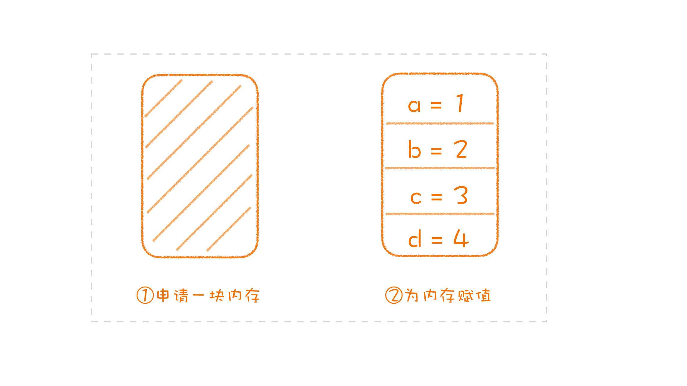

一直是这样的套路，都是重复的流程。会有程序库进行封装。比如 allocator

到了c++ java，这个套路直接就变成了语法中的一部分，`new`.成为语言的一部分。成为了一个特定的模型。

**一个经过验证的模式最终变成了语言的一部分，而它的起点只是一个常见的用法：一个程序库**。 语法的起点有可能是从程序库衍生出来的。

**synchronized**

学习并发编程，一方面要学习各种概念，比如“锁”；另一方面还要学习不同语言相应的程序库。因为这些概念太常用了。

java直接变成了语法。


#### 语言设计就是程序库设计

**new**

这个语法，解决了问题，但是引发出另一个问，实例化的时候的构造函数的名字只能是类名，这就导致一个问题。不能表达不同的逻辑的实例化。这就需要程序库来解决了。

一个更好的解决方案是利用工厂模式解决这个问题。

创建一个初始容量为 10 的 `ArrayList`,Guava程序库的做法。

```java

ArrayList<String> listWithElements = newArrayList("foo", "bar");
ArrayList<String> listWithCapacity = newArrayListWithCapacity(10);
```


**synchronized**

这个语法，粒度太大只能在方法上，用起来也不是很灵活，为了解决这个问题Java 5 推出了并发编程库（程序库），解决这个问题。

解决同一个问题，它可以用一个语法，也可以用一个程序库，二者之间是等价的。


通常是先有程序库，再有语法；如果语法不够好，新的程序库就会出现，新一轮的编程模型就开始孵化。

**语言设计就是程序库设计”和“程序库设计就是语言设计”。**


​		能够理解程序设计语言的接口不只包含语法，还有程序库。而且，学习一种程序设计语言提供的模型时，不仅仅要看语法本身有什么，还要了解有语言特性的一些程序库。

#### 总结时刻

一些经过大量实践验证过的程序库甚至会变成语言的语法，而一些语法解决得不够好的地方，又会出现新的程序库去探索新的解决方案。所以，语言设计就是程序库设计，程序库设计就是语言设计。二者相互促进，不断发展。

好好体会一下上面这句话。


**提升软件设计能力，可以从编写程序库入手。**

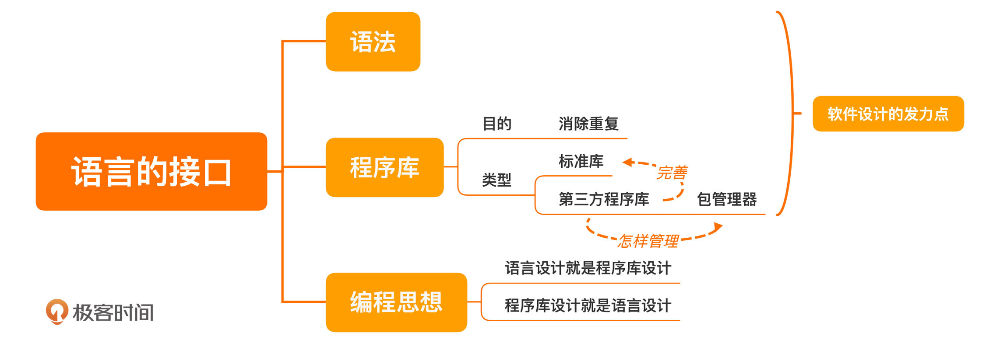


#### 精彩评论

```tex
happychap
一言不合就开车，一码不便就撸库。确实在语言发展历程上，每门好的语言都有其精华，目的还是在用不同的编程哲学适应不同的应用场景。用golang的伙伴会得意于编译出的程序内存占用少，goroutin如何方便，函数支持多返回值是多么的优雅，而用java的伙伴则乐于能用到泛型、重载、多态等特性，能用到spring等等功能异常强大的框架。编程知识大爆炸的年代，语言小巧够用感觉更环保些ʘᴗʘ
作者回复: 非常好的补充！
```


### 10 | 语言的实现：运行时，软件设计的地基

首先来说什么是运行时呢？

https://www.zhihu.com/question/20607178/answer/2133648600


对于java来说运行时可以简单理解为运行时系统（Runtime System），

 Java 的运行时是 JRE。

「运行时系统」里大概需要这些基础组件：

- 一个解释执行字节码的虚拟机，多半得带个垃圾回收器。
- 如果语言是源码解释执行，那么需要一个编译器前端做词法分析和语法分析。
- 如果运行时支持 JIT 优化，那么还得藏着个编译器后端（动态生成[机器码](https://www.zhihu.com/search?q=机器码&search_source=Entity&hybrid_search_source=Entity&hybrid_search_extra={"sourceType"%3A"answer"%2C"sourceId"%3A2133648600})）。
- IO 相关能力，比如 Node.js 的 `fs.readFile` 之类。


软件设计的基础其实斌不是程序设计语言本身，而是运行时，**运行时，是我们做软件设计的地基。**

我自己的理解就是编写出来的程序（包括程序库）在运行时依靠的环境，就是运行时。

**做设计真正的地基，并不是程序设计语言，而是运行时，有了对于运行时的理解，我们甚至可以做出语言本身不支持的设计**

对于java来说，JVM必然就是一种运行时。

#### 程序是如何运行的呢？

“程序如何运行”本身就是一条功能主线，通过这个主线我们将运行时的众多知识串联起来，来达到学习的效果。

可执行文件对应的JVM上就是类文件结构，JVM类加载器加载可执行文件到内存中。

​		加载完之后，被加载的程序放在对应i的位置上（方法区等等），这一点得学习**JVM内存布局**。程序动态申请的内存都在堆上，为了支持方法调用要有栈，还要有区域存放我们加载过来的程序，诸如方法区等等。

​		怎么执行呢?把程序计数器放置到相应的位置一条一条的进行执行。

在java中这些指令就是被编译的字节码，运行在JVM上，对于JVM来说这些字节码就相当于汇编。

接下来我们就是需要了解这些指令时怎么运行的，大部分指令的原理并不难，比如：，加法指令就是在栈上取出两个数，相加之后，再放回栈里面。

​		解析来我们就可以把语言本身打开，就能窥探它的内部是怎么实现的。打开一些被语法和程序库隐藏起来的细节。比如，synchronized 是怎样实现的，顺着这条线，我们可以走到内存模型（Java Memory Model，JMM）。

​			有了运行时的了解，我们就可以把其他语言的特性，如果需要的话就可以借鉴借鉴上来。中，比如，使用 C 语言编程时，我们可以实现多态，做法就是自己实现一个虚拟表，这就是面向对象语言实现多态的**一种方案**。你懂了运行时，你都可以设计语言了。


#### 运行时的编程接口

​		我们了解了运行时，我们开发程序的时候，就有很更大的自由度。那么我们如何把程序构建在程序运行时之上。（把运行时像成一种模型）运行时提供了编程接口（在运行时做一些操作）。

​	 在java中运行时，最简单的运行时编程接口就是运行时类型识别能力。`getClass`（思考：为什么它是运行编程时接口呢？有什么特点吗？因为他是运行时模型所提供的功能，与语言本身无法。)。

​		`getClass`。通过这个接口，我们可以获取到类的信息，一些程序库的实现就会利用类自身声明的信息。比如，之前说过，有些程序库会利用 Annotation 进行声明式编程，这样的程序库往往会在运行的过程中，以 `getClass` 为入口进行一系列操作将 Annotation 取出来，然后做相应的处理（操作运行时的类，近些一些功能的实现，属于运行时层面的。）。

​		运行时接口一部分是通过标准库的方式暴漏出来。一部分是通过规范的方式提供出来（字节码）。

我的思考：	

​		java运行时想象成一个模型，这个模型的接口通过字节码的方式提供出来，语言本身是通过使用的这些接口来实现功能。

我们怎么使用运行时接口呢？有些运行时接口是就直接通过语言本身传递出来，比如`getClass`,或者我们直接使用字节码。

​		站在可以操作运行时接口的角度就可以创造出一些语言层面没有的东西。有的程序库给 Java 语言扩展 AOP（Aspect-oriented programming，面向切面编程）的能力。这样一来，你写程序的极限就不再是语言本身了，而是变成了字节码的能力极限。

​		java7发布的时候，定义了`InvokeDynamic`这个新指令，但是java7的语言层面没有提供任何相关的语法。如果我们需要就能直接使用它来改善我们运行时的表现，`JRuby`、`Jython`、`Groovy` 等一些基于 JVM 的语言，开发者就可以利用这个指令改善自己的运行时实现。

​		操作字节码的门槛高吗?之前好像还挺高的。但是近些年来一些库（`ASM`（依然需要了解类文件结构）、`ByteBuddy`（根据上面的做了改进，便于使用））的出现，让我们操作字节码变得更加容易了。

​		

​		Java 语言的一些 Mock 框架，为什么可以只声明接口就能够执行，因为背后常常是动态生成了一个类。这就需要我们对字节码有了解，在静态语言java的基础上实现动态的效果。

#### 		总结时刻

**对于运行时的理解，我们甚至可以做出语言本身不支持的设计。所以，做设计真正的地基，并不是程序设计语言，而是运行时。**

**把运行时当作自己设计的地基，不受限于语言。**

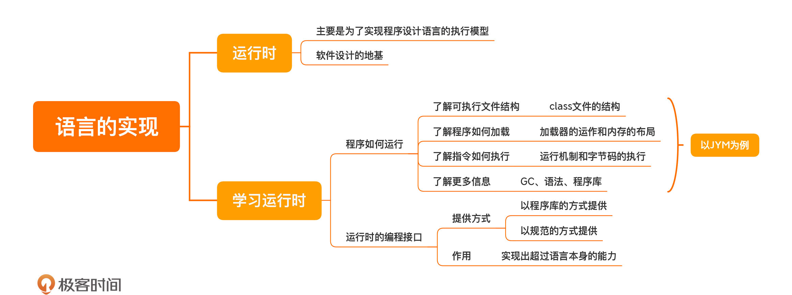
