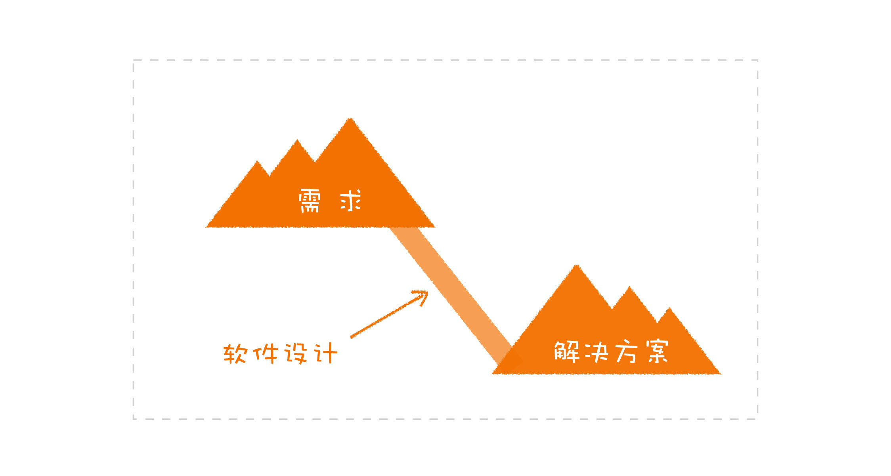

# 软件设计之美 （极客时间-郑烨）


## 课前必读

### 01软件设计是什么？

我们现在思考这个问题，为什么我们需要软件设计呢？

​		在开发过程中，软件不是在一段时间内集中开发，一个星期然后再也不用管了。软件开发是需要多人，长期进行开发的，还有后续新的需求加进来。就比如说初代淘宝和现在淘宝是千差万别的。一个软件就像一个生命一样，是需要慢慢成长的，是一个长期的过程。 这样就会引发一个问题？我们面对长期变化和新增的需求，我怎么才能让我们的软件面对这些变化的需求，保证更好的成长而不至于**夭折**。这就需要我们良好的**软件设计**。


#### **核心的模型**

​		在思考一个问题：我们为什么需要开发软件？答案显而易见，解决问题（需求）。淘宝解决了可以通过网络购物的问题。解决问题的最终结果是一个可运行的交付物。 

​		软件设计在这个解决问题的过程扮演了什么角色。软件设计需求和最终解决方案的一个桥梁。根据需求构建合适的软件设计，根据软件设计构建解决解决方案，这个解决方案当前需求下更加健壮。



​		在软件开发过程中设计到许多成员，这时候我们需要建了一个统一的结构，比如，一个房子的布局，哪个地方是厨房，那个地方厕所，哪里是卧室，卧室里面有哪些结构（衣柜等），厨房里面的布局结构。 项目成员看到这样一个统一的结构就会项目有一个统一的认识。对应到软件中，我们可以理解成我们的软件的结构是什么样（软件的统一结构），有哪些模块，每一个模块功能是什么，每一个模块又包含那些模块（每一个模块又变成一个统一的结构）。

​		这一个个统一的结构就是就是**模型**，**软件设计就是构建出一套合适的模型**

模型可以是描述业务的各种实体，也可以是各种功能组件。软件的核心就是模型，软件就是用模型组合而成的。高层模型也是有底层模型组合而成的。模型有大有小，不同的层次罢了，一个个类可以是模型，一个个系统也是模型。

模型是软件设计的核心是模型，好的软件设计必定是拥有的好的模型，那么什么是好的模型呢？

​		就是我们常听到的，**高内聚，低耦合**。它带来了什么？让功能抽离内聚到一个模块中，比如我们在开发功能的时候有时候需要通讯，我们就可以把通讯内聚到一个通讯的模块中，尽最大限度隐藏实现细节。这样的话一个模块的实现改动对其他模块的影响可以降到最低。也让我们更加便于扩展。

​		还能降低开发门槛，一个新的程序只需关注他所设计到模块就可以，因为相关功能都以已经内聚到这个模块了。

模型也是分层的，大的模块是由小的模块都构建的，高层模块是由下层模块进行构建的。类似于我们搭建乐高。由小的部件构建大的部件，由大的部件构建整个成品。

就是网络分层似的，应用层模型的通讯模块是由传输层提供的。


​			

在软件中，我们可以通过构建最核心的基础模型进行构建，然后通过这个模块在组合构建高层的模型。

举例：

​	交易系统---->分析交易动作---->	得到最基础的交易原语（交易动作中最基础的动作）：资产冻结、解冻、出金、入金----->交易动作可通过交易原语组合得到。

交易动作就是高层模型，交易原语就是底层模型


总结一下：

+ 模型是软件核心
+ 好的模型高内聚低耦合
+ 模型可以分层，底层模型提供接口，构建高层模型


#### **约束的规范**

构建模型的时候，一千个人构建的出来的都是不一样。如果一个项目里面不同一些规范，肯定是眼花缭乱的结构、各式各样的模型。

**规范，就是限定了什么样的需求应该以怎样的方式去完成**

+ 与业务处理相关的代码，应该体现在领域模型中；
+ 与网络连接相关的代码，应该写在网关里；
+ 与外部系统集成的代码，需要有防腐层；
+ 外部接口设计
+ 使用什么的操作数据库的框架


**常见规范问题：没有显示的规范**

+ 数据库访问，有用 `MyBatis` 的，有用 JDBC 的，也有用 Hibernate 的；
+ 外部接口设计，有用 REST 风格的，有用 URL 表示各种动作的；
+ 文件组织，有的按照业务功能划分（比如，产品、订单等），有的按照代码结构划分（比如，Resource、Service 等）；


**常见规范问题：规范不符合软件设计原则**

一个网关经常内存爆满，寻找原因是请求过来的JSON数据太过庞大，且有很多无用数据。转化成对象后对象太过庞大，占用过多的内存

解决方法：构建防腐层，在防腐层中吧请求的来的JSON转化成内部小对象。

这就是原来的设计规范不符合设计原则导致的

#### 模型与规范

​		那模型与规范是什么关系呢？模型与规范，二者相辅相成。一个项目最初建立起的模型，往往是要符合一定规范的，而规范的制定也有赖于模型（规范的指定也要根据模型的特点，比如上面的网关层的设计）。

#### 	总结

+ 模型：软件骨架，粒度可大可小，好的模型高内聚低耦合，模型是分层的，高层模型是由底层的模型构建的
+ 规范：构建模型得按照规范来，对于长期维护至关重要。两个常见问题：缺乏显示统一的规范、规范不和设计原则
+ 模型与规范：二者相辅相成，互相依赖


#### 精彩评论


```tex
段启超：
防腐层是模型的一个规范，分享下我对防腐层的认知：
我接触防腐层的概念是从DDD的限界上下文开始的。Eric用细胞膜的概念来解释“限界”的概念，细胞膜只让细胞需要的物质进入细胞，同样，我们的代码之间业务也存在这个样一个界限，同一个对象的业务含义在不同的上下文中是不一样的。以在网上买书为例，在购买页面，我们的关注点在于这本书的名称，作者，以及分类，库存等信息；提交订单后，这本书就成为了订单上下文中的一个订单item，我们会关注这个item 的数量以及购买他的人是谁，以及书的配送地址等； 订单提交给仓库后，仓库会关心这本书还有没有库存，以及打包状态，分拣，物流等状态。
防腐层是在限界上下文之间映射（说白了就是交互）的方式，体现在代码上就是一个对象的转换，这个转换的意义在于隔离变化，防止因为对象在一个上下文中的变化扩散到其他的上下文中。

关于规范：
规范也是团队文化中很重要的一部分，以持续集成为例子，它的执行严格依赖于团队的开发纪律文化，以为了所谓赶进度而单元测试覆盖很低或者直接不写；采用分支策略方开发，一星期都合并不了主干，类似的人到处倒是，也就因为这一点，很多团队都在持续集成这个环节上掉队了。所以开发规范真的很重要，时刻谨记：混乱始于没有规范。

作者回复: 非常好的补充！
```


```tex
西西弗与卡夫卡
业务讨论之后进行领域设计，画出出静态模型（包括子系统、模块等）和动态结构（交互等），或者先勾勒接口（内内外系统的区隔），再做模型。实际过程有很多反复，并且会进行角色代入，看模型能否支持业务，直到模型比较稳定

作者回复: 你们做得很好
```

参考规范


```tex
光明
简单一点的项目，成员相互讨论（主要讨论业务场景和流程），内心会意即可。
复杂一点的项目，设计一般落脚在粒度较粗的文档上，往往也以说明业务流程为主，很少对实现过程中的细节文档化。
所以，我们的项目设计，模型一般会被业务场景和流程替代。文中的「模型」和「规范」，更多取决于工程师了。。。

作者回复: 对，你说的确实符合大部分做设计的方式。这种设计的关注点在于实现功能，而非构建模型。
这种做法容易让人忽略掉哪个东西是核心的，是模型，还是流程。流程是容易调整的，而模型如果变了，这个软件整个就变了。做设计的关键是，找到不变的东西。
```

模型是不容易变得的东西，所以我们应该把更多关注点放到构建模型上。这样一旦发生改动对系统影响最小。


### 02 分离关注点：软件设计至关重要的第一步


设计系统的时候或者解决问题的时我们一般采用的分而治之的方法。

​		在设计的过程中，分解比组合更加重要。一般我们首先知道最终的要什么样的东西，所以我们在软件设计的过程中更加关注对这个东西是怎么分解的。分解完之后我们就会知道怎么组装的了。

​		我们一般在分解的过程就只分解：系统 ，划分各个模块，都是按照大的功能（比如只按照这个软件的客户需求业务功能进行划分，没有抽离一些细小的技术"功能"，下面例子有体现）划分。在多少的情况下，我们分解的粒度会太大，导致一个模型下混杂着不同的东西(耦合到一块了)，为日后开发埋下了隐患。

#### 失败的分解案例

现在，我们举一个失败的分解案例

清结算系统

+ 上游系统推送消息到此系统
+ 上游系统推送来的消息是由结算系统发出去的（初始数据），有记录的
+ 问题：上游系统发送到此系统会出现丢消息的情况

初始的解决方案:

设计一个补偿模式，因为本系统是含有这些消息的初始数据，在数据库里增加一个状态，表示是否收到消息了。一旦发现丢了消息就会访问上游系统，重新推送

初始版本问题：

+ 在业务量大的情况下，丢失消息概率增加，设置的补偿机制会频繁的访问数据库，业务量同时也会增加访问数据库。这样的话系统必然卡顿。
+ 什么原因导致上面的问题呢？通信层面的问题混入到了业务层面上

丢消息从模型分析的角度来说与业务是没有关系的。开发人员在分解的过程中只考虑了功能上的维度，并没有考虑到其他维度的事情。技术和业务混在一起。就会导致了无穷无尽后患。

优化后版本:

丢消息为通信层面的问题，通讯层面的问题，通信层面解决。

选择一个吞吐量大的消息队列，**通信层面的问题在通信层面解决了，业务层面也就不会受到影响了**。

#### 分离关注点

上面的案例已经体现出分解粒度过大导致的问题

我们传统上在做设计的时候，经常就会根据以软件需求功能进行分解，以树形的方式。


这样会忽略很多隐形的模型，上面的错误案例就是一个非常好的案例，如果想要做出一个好的分，解就不仅仅要考虑功能性的需求，还要考虑非功能性的需求。

​	这些非功能需求和业务功能不是同一维度的，我们在设计的过程中要关注这些到不同的维度，每一个维度就是一个关注点，我们要学会分离这些关注点。（当然由高层维度和底层维度，维度里还能划分不同维度）。

​	有很多的关注点，我们在设计的过程中一定要注意识别关注点，如果识别不出来就会导致混淆，把两个关注点混淆到一块。**最常见的是把业务和技术混在一起**

​	再举一个反例，当我们先提升某一块的功能，我们首先想到是多线程。就直接把多线程一系列的东西，写到了这一块相关的代码中。这样就会导致技术和业务混合。这明明两个关注点。我们应该把多线程处理和业务处理分开。到时候我们直接调用多线程的相关框架就好。

**任何试图用技术去解决其他关注点的问题，只能是陷入焦油坑之中，越挣扎，陷得越深。**上面就是用多线程的技术，解决业务执行慢的问题，直接归并为一个关注点，这是不合理的。

​		还有一个关注点比较容易造成混淆，就是**数据的变动方向**，其实不同的方向应该是不同的关注点。

使用`Sping Data JPA`好还是`Mybatis`呢？JPA适用于简单的数据库的增删改查，Mybatis比较是用于复杂的查询。当我们纠结使用哪一个的时候，可能我们软件设计出现了问题，我们没有把上面两种情况进行分离开，混淆在一起了。当我们可以分离的时候，纠结也就不复存在了。

不同的数据变动方向还有很多，比如：

+ 动静分离，就是把变和不变的内容分开；
+ 读写分离，就是把读和写分开；
+ 前面提到的高频和低频，也可以分解开；

**不同的数据变动方向，就是一个潜在的、可以分离的关注点。** 也不一定非得必须分离，根据自己项目而决定。


宏观层面我们使用到分离关注点，微观同样适用。在设计类的时候有些时候我们不必setter方法，因为在这个关注点中不包含这个。比如某个配置类只在生成的对象时候加载一个复杂配置的文件（比如pfx文件），生成对象。并不能重新设置里面属性的值。只能使用get一些解析出的值

#### 总结

**分离关注点，发现的关注点越多越好，粒度越小越好**。


#### 思考题

CQRS（Command Query Responsibility Segregation） 分离了那些关注点，适用于那些情况使用


#### 精彩评论

```tex
Jxin
1.cqrs，命令与查询分离，最早是在ddd实战里面看到。其分离啦增删改与查询这两个关注点。

2.静态上，拆分了这两块的代码。使各自可以采用不同的技术栈，做针对性的调优。动态上，切分了流量，能够更灵活的做资源分配。

3.查询服务的实现。可以走从库，这有利于降低主库压力，也可以做到水平扩展。但需要注意数据延迟的问题。在异步同步和同步多写上要做好权衡。
也可以都走主库，这时候查询服务最好能增加缓存层，以降低主库压力，而增删改服务要做好缓存的级联操作，以保证缓存的时效性。
当然也可以走非关系型数据库，搜索引擎类的es,solr，分布式存储的tidb等等，按需选择。

作者回复: 非常棒的分享！
```

分离关注点很好的例子


```tex
想起Kent Beck 说的一句话，大致意思是：我不准备在这本书里讲高并发问题，我的做法是把高并发问题从我的程序里移出去
作者回复: 没错，就是这样。
```

分离关注点很好的比喻。


```tex
我发现大家在工作中往往不做分离，分析需求的时候把方案揉在一起。
可以怎样去练习做分离呢？
作者回复: 有一种从小事练起的方法，就是写代码时，把自己写的函数行数限定在一定的规模之下，比如，10行。超过10行的代码，你就要去仔细想想是否是有东西混在了一起。

这种方法锻炼的就是找出不同关注点的思维习惯，一旦你具备了这种思维习惯，再去看大的设计，自然也会发现不同的关注点。
```

值得借鉴的实操方法，警示自己，是否没有分离关注点。


```tex
小学一年级
郑老师  我有个需求描述下（类比）： 用户购买网站会员  
我目前的设计用了两张表 
一张表存储用户购买会员的所有记录， 
另一张表 存当前的会员信息 (主要是  开始，结束时间，没有会员等级之类)  单独设计这张表的目的是为了sql关联查询方便，不用再判断是否过期。
但有个问题：我要用定时器一直扫这表，等会员过期了要删除记录。
请问郑老师 我这么做的问题在哪？ 更好的解决方式应该是什么？如果做到更细维度的拆分？


作者回复: 首先，你的描述没有把业务和实现分清楚。

你的业务是实现一个会员系统，具体到这里，是判断用户当前是否是会员。更具体一点的话，会涉及会员购买，主要是会员时间要延长，还会涉及到会员资格的判断，也就是当前用户是否是会员。

基于这些内容的判断，可以有不同的实现。根据你当前的实现，可以这样做：
* 购买会员，如果会员信息不存在，则添加会员信息，如果会员信息存在，则修改会员结束时间。
* 会员资格判别，根据用户 ID 和当前时间是否在时间范围内查询查询，如果记录存在，则是会员，否则不是。

结合你提供的信息，可以考虑的点是：
* 购买会员时，可以产生会员购买记录，此记录仅供后续查询使用；
* 只有当会员信息表过大时，才考虑是否需要删除。

在这个实现中，把购买和会员信息分开，把会员信息是否生效与记录是否删除分开了。

以上仅仅是根据你提供的信息进行的分析，如有不当之处，欢迎继续讨论。
```


```tex
技术和业务混杂的情况，让我想起来一篇文章，大意是说要区分技术异常和业务异常的。也就是说，技术层面的异常信息不应该暴露给上层的业务人员。典型的例子就是大型网站的错误页面，而不是直接把后台的npe堆栈信息抛给用户。
作者回复: 这是一个很好的例子，确实要做区分。
```

