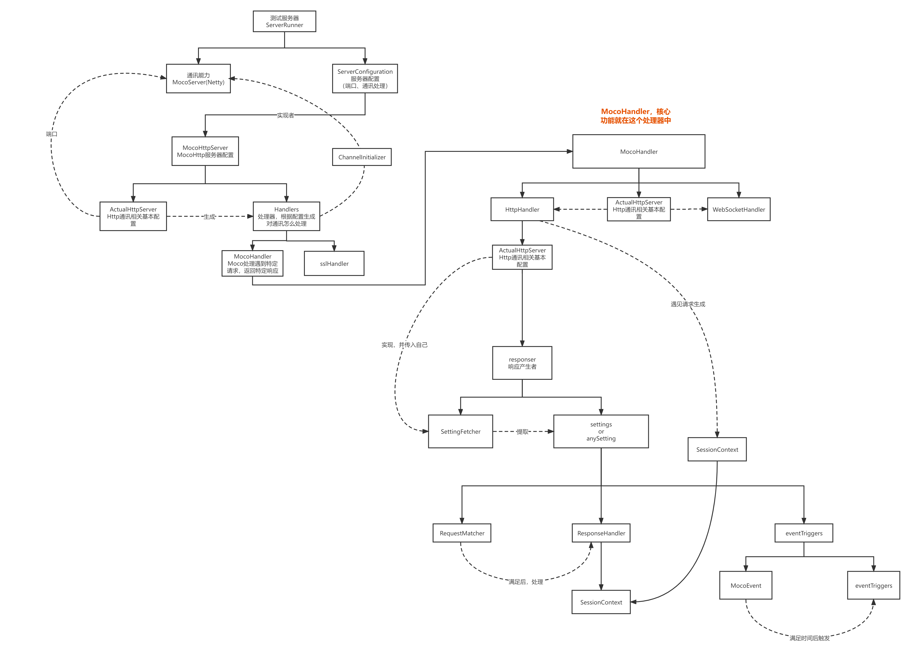
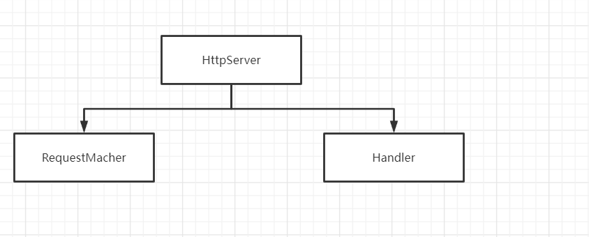

上面就是他的这个整体分析的图，Netty知识作为了一同通讯。

把netty相关的东西转换成Moco所需要进行处理。

​		netty和moco之间有一个处理的层，把他们的东西相互转化。`HttpHandler` 做了一个中间层，也可认为是防腐层，使模块之间更加独立，增加了可扩展性。

核心就是一个配置，配置什么的配置匹配什么样的请求，配置怎么处理。这个分别就是 `RequestMatcher`和 `ResponseHandler`。


Moco最出彩的地方 ，莫过于他灵活的配置，这灵活的配置是怎么实现的呢？

首先我们想清楚我们做这个东西，是干什么的。应该的接口是什么。moco是作为一个可模拟服务的这么一个功能，就是一个请求一个响应。我们需要做的就是面对什么请求，响应什么。

设计特定请求的时候就是设置条件，条件的话，我们就可以联想到各种各种的条件组合性，组合这些条件形成一个大的条件，这就与面向函数编程的特定相吻合，

响应的同样，由于http响应由不同部分组成，而且这些部分的又可以衍生出一定的组合性，这些部分我们可以看作不同的响应处理，再加上一些其他的处理，比如一些触发什么事件，也就是组合这些处理形成一个大的处理，所以我们也可以利用面向函数编程的思维。





咱们就看`RequestMatcher`的几个实现类，`AndRequestMatcher` ,`OrRequestMatcher`


`AndRequestMatcher`  里面有很多个`RequestMatcher`都是与的关系 ，当我们满足各个匹配条件的时候才算满足。

```java
  @Override
 protected boolean doMatch(final Request request, final Iterable<RequestMatcher> matchers) {
        return StreamSupport.stream(matchers.spliterator(), false)
                .allMatch(matcher -> matcher.match(request));
}
```


`OrRequestMatcher`同理，只有他这个含有的多个`RequestMatcher`任何一个满足条件就是匹配成功。

```java
@Override
protected boolean doMatch(final Request request, final Iterable<RequestMatcher> matchers) {
        return StreamSupport.stream(matchers.spliterator(), false)
                .anyMatch(requestMatcher -> requestMatcher.match(request));
}
```


还有取反的

```java
@Override
@SuppressWarnings("unchecked")
public final RequestMatcher apply(final MocoConfig config) {
    if (config.isFor(MocoConfig.REQUEST_ID)) {
        return (RequestMatcher) config.apply(this);
    }

    return doApply(config);
}
```


这写编程范式都是深受面向函数编程的思想影响，在以后的编程过程中和值得借鉴。


上面的都一个个在原有的matcher之上做的操作`requestmatcher`，是高层的，下面我们将看看底层 `requestmatcher`是怎么实现数据的匹配呢？


