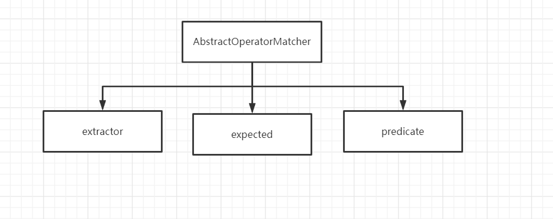
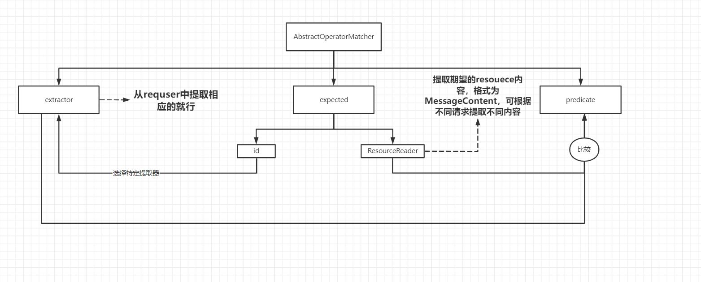

上面就是他的这个整体分析的图，Netty知识作为了一同通讯。

把netty相关的东西转换成Moco所需要进行处理。

​		netty和moco之间有一个处理的层，把他们的东西相互转化。`HttpHandler` 做了一个中间层，也可认为是防腐层，使模块之间更加独立，增加了可扩展性。

核心就是一个配置，配置什么的配置匹配什么样的请求，配置怎么处理。这个分别就是 `RequestMatcher`和 `ResponseHandler`。


Moco最出彩的地方 ，莫过于他灵活的配置，这灵活的配置是怎么实现的呢？

首先我们想清楚我们做这个东西，是干什么的。应该的接口是什么。moco是作为一个可模拟服务的这么一个功能，就是一个请求一个响应。我们需要做的就是面对什么请求，响应什么。

设计特定请求的时候就是设置条件，条件的话，我们就可以联想到各种各种的条件组合性，组合这些条件形成一个大的条件，这就与面向函数编程的特定相吻合，

响应的同样，由于http响应由不同部分组成，而且这些部分的又可以衍生出一定的组合性，这些部分我们可以看作不同的响应处理，再加上一些其他的处理，比如一些触发什么事件，也就是组合这些处理形成一个大的处理，所以我们也可以利用面向函数编程的思维。


咱们就看`RequestMatcher`的几个实现类，`AndRequestMatcher` ,`OrRequestMatcher`


`AndRequestMatcher`  里面有很多个`RequestMatcher`都是与的关系 ，当我们满足各个匹配条件的时候才算满足。

```java
  @Override
 protected boolean doMatch(final Request request, final Iterable<RequestMatcher> matchers) {
        return StreamSupport.stream(matchers.spliterator(), false)
                .allMatch(matcher -> matcher.match(request));
}
```


`OrRequestMatcher`同理，只有他这个含有的多个`RequestMatcher`任何一个满足条件就是匹配成功。

```java
@Override
protected boolean doMatch(final Request request, final Iterable<RequestMatcher> matchers) {
        return StreamSupport.stream(matchers.spliterator(), false)
                .anyMatch(requestMatcher -> requestMatcher.match(request));
}
```


还有取反的

```java
@Override
@SuppressWarnings("unchecked")
public final RequestMatcher apply(final MocoConfig config) {
    if (config.isFor(MocoConfig.REQUEST_ID)) {
        return (RequestMatcher) config.apply(this);
    }

    return doApply(config);
}
```


这写编程范式都是深受面向函数编程的思想影响，在以后的编程过程中和值得借鉴。


​		上面的都一个个在原有的matcher之上做的操作`requestmatcher`，是高层的，下面我们将看看底层 `requestmatcher`是怎么实现数据的匹配呢？

​		RequestMatcher，从面向函数的角度来看，也就是行为。我们现在对比行为进行切分，抽离职能。


我们看看怎么匹配？首先我们应该要把我们相匹配的某一部分内容提取出来，一个请求有很多内容比如URL 、请求头参数等等。

​		然后我们与期望的参数做对比，怎么对比也是一种行为，是相等啊还是大于啊，还是其他操作等等比如startwith,我们把这一步骤可分为两步期望的资源什么样的，第二步就是按照规则去进行比较。

+ 提取请求的要求的一部分
+ 获取期望的值
+ 上面两部分比较规则





这一类有操作的匹配器一般都是的步骤分为这三步骤，高层接口只能有一个匹配方法，因为还有一些高层的匹配比如，or  and 什么的


我们可以在下面进行时实现的子类，固定predicate 把常用的提供出去。


```java
public abstract class AbstractOperatorMatcher<T> extends AbstractRequestMatcher {
    protected abstract RequestMatcher newMatcher(RequestExtractor<T> extractor, Resource resource);

    private final RequestExtractor<T> extractor;
    private final Resource expected;
    private final Predicate<String> predicate;

    protected AbstractOperatorMatcher(final RequestExtractor<T> extractor,
                                      final Resource expected,
                                      final Predicate<String> predicate) {
        this.extractor = extractor;
        this.predicate = predicate;
        this.expected = expected;
    }

    @Override
    public final boolean match(final Request request) {
        Optional<T> extractContent = extractor.extract(request);
        return extractContent.filter(this::matchContent).isPresent();
    }

    private boolean matchContent(final T target) {
        if (target instanceof String) {
            return predicate.test((String) target);
        }

        if (target instanceof String[]) {
            String[] contents = (String[]) target;
            return Arrays.stream(contents).filter(Objects::nonNull).anyMatch(predicate);
        }

        if (target instanceof MessageContent) {
            MessageContent actualTarget = (MessageContent) target;
            return predicate.test(actualTarget.toString());
        }

        return false;
    }
```


```java
public class StartsWithMatcher<T> extends AbstractOperatorMatcher<T> {
    public StartsWithMatcher(final RequestExtractor<T> extractor, final Resource expected) {
        super(extractor, expected, input -> input.startsWith(expected.readFor(null).toString()));
    }

    @Override
    protected final RequestMatcher newMatcher(final RequestExtractor<T> extractor, final Resource resource) {
        return new StartsWithMatcher<>(extractor, resource);
    }
}

```


首先呢如果我们确定了要对请求的那部分做操作，那么提取器是确定的。如果把`resouce`加上是那一部分的标志，可根据标志把对应的extractor实例化出来，Resource是否能做到根据请求是动态的呢？我们可以加上一个阅读器根据不同的规则的。




跟一个测试，体验一下过程

```java
  @Test
    public void should_match_get_method_by_method_api() throws Exception {
        server.request(and(by(uri("/foo")), by(method("get")))).response("bar");

        running(server, () -> assertThat(helper.get(remoteUrl("/foo")), is("bar")));
    }
```


and就是组合requsetmatcher形成新的Matcher

```java
 public static RequestMatcher and(final RequestMatcher matcher, final RequestMatcher... matchers) {
        return new AndRequestMatcher(asIterable(
                checkNotNull(matcher, "Matcher should not be null"),
                checkNotNull(matchers, "Matcher should not be null")));
}
```


by就是相等的表明操作

```java
 public static RequestMatcher by(final Resource resource) {
        checkNotNull(resource, "Resource should not be null");
        return ApiUtils.by(extractor(resource.id()), resource);
}
```

extractor(resource.id()), resource  根据resource生成对应的`extractor`。


找到对应相等的`RequestMatcher`

```java
public static <T> RequestMatcher by(final RequestExtractor<T> extractor, final Resource expected) {
    if ("json".equalsIgnoreCase(expected.id())) {
        return new JsonContentRequestMatcher(expected, (ContentRequestExtractor) extractor);
    }

    if ("xml".equalsIgnoreCase(expected.id())) {
        return new XmlContentRequestMatcher(expected, (ContentRequestExtractor) extractor);
    }

    return new EqRequestMatcher<>(extractor, expected);
}
```


我们看一下uri函数，

```java
public static Resource uri(final String uri) {
        return uriResource(checkNotNullOrEmpty(uri, "URI should not be null"));
    }
```

```java
 public static Resource uriResource(final String uri) {
     				//	对应的Id                     配置（忽略，没啥用） ，messageContent的读取规则就是readerfor
        return resource(id(MocoConfig.URI_ID), uriConfigApplier(MocoConfig.URI_ID, uri), request -> content(uri));
    }
```


```java
 private static Resource resource(final Identifiable id, final ResourceConfigApplier applier,
                                     final ResourceReader reader) {
        return new Resource(id, applier, reader);
    }

```

