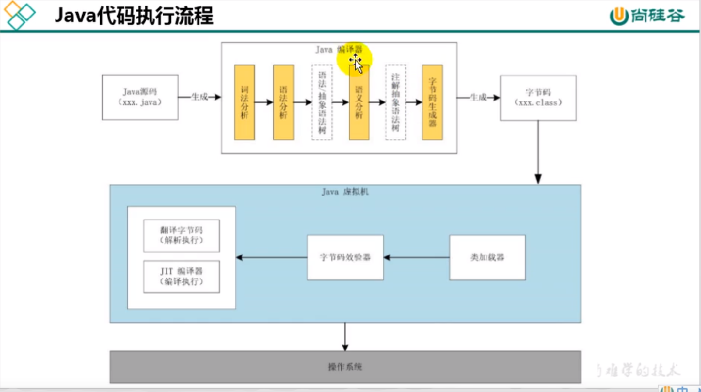

## JVM体系结构

1. 简单描述一下java代码是怎么一步一步被执行的？

   

   

   **前端编译阶段**：java源文件经过编译器编译编译成了JVM字节码文件，也就是我们经常见到的二进制.class文件，我们JVM就是执行这些文件。在编译过程中语法分析、词法分析、语义分析。这个过程也称之为前端编译。

   **加载**：我们JVM会使用类加载器把字节码文件加载到JVM中，这时候JVM会生成对应的信息和class对象。还对我们的字节码进行一些校验。

   **执行**：执行引擎使用翻译器逐行翻译执行，使用JIT编译器是把我们的热点代码进行编译成机器指令进行缓存，直接使用机器指令进行执行。

   所以说字节码可以直接翻译成机器码，也可以让JVM识别做什么。

   https://tech.meituan.com/2020/10/22/java-jit-practice-in-meituan.html

   为什么不全部翻译成机器码呢？因为JVM在加载字节码的时候是按需加载，我们加载到JVM的时候如果全部翻译成机器码这样就会导致等待时间过长，导致效果不佳，翻译的话就是一行一行的响应速度快一些。直接使用机器码的话执行速度快一些。

   

2. 了解指令集架构，现在指令集架构都有什么？JVM的指令集架构是什么？

   ​		 指令集架构指的是我们执行指令时候的操作数的来源，如果我们在设计指令的时候，肯定要考虑操作数的来源，反过来会影响我们指令的设计。

   我们按照操作数来源分：堆栈型，累加器型，寄存器-存储器型和寄存器-寄存器型。

   JVM本身就是在仿照我们CPU执行命令，JVM具有可以执行所以选择栈的指令集架构，编译后的字节码就相当于指令，我们来看一下。

   ```python
   iconst_2  #常量2入栈
   iconst_3  #常量3入栈
   idd       #常量2，3出栈，执行相加
   istore_0  #结果5入栈
   ```

   上面就是JVM基于栈作为操作数来源设计的指令，我们可以看到执行add操作不需要指定操作数来源，因为我们可以从栈的头部拿到操作数。

   

   我们再来看一下使用寄存器作为操作数来源的指令

   ```python
   mov eax 2 #将eax寄存器值设置为a
   add eax 3 #将eax寄存器的值加3
   ```

   我们看到我们直接指定对具体的寄存器进行操作。现在我们电脑上CPU一把都是使用寄存器架构指令集，还有安卓的Davlik虚拟机使用的寄存器指令架构

   JVM使用栈是因为软件容易实现，设计指令也比较简单，具有良好的可以执行。寄存器涉及到硬件了，不同的CPU可能有不用机器指令去操作寄存器。

   

3. 描述一下JVM的生命周期

   把JVM看作一个程序，JVM生命周期也就是这个程序启动起来对应进程的生命周期，

   **启动**：我们首先需要通过main方法来执行我们的java程序，我们要执行main程序之前要加载一系列的类，这时候会触发一个初始类的加载，从而要启动虚拟机。所以说我们为了要加载一个类，所以我们要启动我们的JVM。（后边看实现）

   **执行**：正在运行的JVM程序，在执行由我们写的java代码编译成的字节码。

   **退出**：正常执行结束，所有非守护线程正常执行结束，程序执行发生了异常而结束，操作系统错误导致执行异常，线程调用调用`Runtime`或者`System`的退出方法。

   （待补充）

   

4. 了解那些可执行java的程序的虚拟机，都有什么特点？

     

     

5. java虚拟机都有什么结构，简约描述一下结构

    

    

我们通过执行过程简约描述一下，

​		首先我们编译好的字节码文件加载到我们的**JVM的数据区**，这就需要我们使用我们的**类加载子系统**进行字节码的加载，具体的加载过程有，类加载器进行加载，链接和初始化阶段。

​	现在我们对数据去进行了解，数据区就是存储我们运行所需要的数据，我们加载类的数据和运行过程中生成的数据等。根据不同用途分为以下部分。

**方法区**：主要是存储我们类加载过程中生成一些数据。

**堆**：我们在执行的过程中生成的对象都在此区域。

虚拟机栈：我们执行的方法，每一个方法会形成栈帧放到栈中，执行完成弹出，调用形成栈帧栈。

本地方法栈：表示执行的是本地方法

PC寄存器：存储执行到哪里了，执行正在执行的指令的地址。

执行引擎：真正执行我们指令的地方，根据指令的地址执行我们的指令。（两种执行方式解释执行，和编译执行，有不同组件来操作），也包含了垃圾回收器，执行内存回收操作。


## 类加载子系统


1. 类加载子系统是干什么的

   

   

   ​		 JVM要想运行java的写的程序，我们首先得把编译后.class文件加载到JVM中。加载到到JVM过程中，会进行相关信息的提取和生成，为我们程序执行做准备。根据已知的信息，class对应的二进制信息，形成对应的class类对象。我们也需要对我们class文件的字节流的结构进行一些验证，还需要类信息（方法、访问修饰符，实例变量，类变量等）进行存储和初始化一些类的数据（类变量）。

   

   

2. .class文件的内容都有什么，代表什么含义

      ```tex
      ClassFile {
          u4             magic;
          u2             minor_version;
          u2             major_version;
          u2             constant_pool_count;
          cp_info        constant_pool[constant_pool_count-1];
          u2             access_flags;
          u2             this_class;
          u2             super_class;
          u2             interfaces_count;
          u2             interfaces[interfaces_count];
          u2             fields_count;
          field_info     fields[fields_count];
          u2             methods_count;
          method_info    methods[methods_count];
          u2             attributes_count;
          attribute_info attributes[attributes_count];
         }
      ```

      u4代表四个字节 u2代表两个字节。

      

      ```java
      package test;
      
      public class Test {
      
      
          private static int i=1;
      
          private int j;
      
          public static void main(String[] args) {
              System.out.println(i);
          }
      
          public void sayHello(){
              System.out.println("hello");
          }
      }
         
      ```

      

      我们javap解析一个编译好的class来查看一下,这是我们解析上面二进制格式的文件得到的，解析工具帮我们优化成了便于理解的格式

      ```java
      Classfile /D:/Working/tianpengfei/my_open_soure/GM-Kai/gmkai-core/out/test/classes/test/Test.class
        Last modified 2022-12-22; size 709 bytes
        MD5 checksum 576eb7c7deac6064124c4a06c2a957c1
        Compiled from "Test.java"
      public class test.Test
        minor version: 0
        major version: 52
        flags: ACC_PUBLIC, ACC_SUPER
      Constant pool:
         #1 = Methodref          #8.#27         // java/lang/Object."<init>":()V
         #2 = Fieldref           #28.#29        // java/lang/System.out:Ljava/io/PrintStream;
         #3 = Fieldref           #7.#30         // test/Test.i:I
         #4 = Methodref          #31.#32        // java/io/PrintStream.println:(I)V
         #5 = String             #33            // hello
         #6 = Methodref          #31.#34        // java/io/PrintStream.println:(Ljava/lang/String;)V
         #7 = Class              #35            // test/Test
         #8 = Class              #36            // java/lang/Object
         #9 = Utf8               i
        #10 = Utf8               I
        #11 = Utf8               j
        #12 = Utf8               <init>
        #13 = Utf8               ()V
        #14 = Utf8               Code
        #15 = Utf8               LineNumberTable
        #16 = Utf8               LocalVariableTable
        #17 = Utf8               this
        #18 = Utf8               Ltest/Test;
        #19 = Utf8               main
        #20 = Utf8               ([Ljava/lang/String;)V
        #21 = Utf8               args
        #22 = Utf8               [Ljava/lang/String;
        #23 = Utf8               sayHello
        #24 = Utf8               <clinit>
        #25 = Utf8               SourceFile
        #26 = Utf8               Test.java
        #27 = NameAndType        #12:#13        // "<init>":()V
        #28 = Class              #37            // java/lang/System
        #29 = NameAndType        #38:#39        // out:Ljava/io/PrintStream;
        #30 = NameAndType        #9:#10         // i:I
        #31 = Class              #40            // java/io/PrintStream
        #32 = NameAndType        #41:#42        // println:(I)V
        #33 = Utf8               hello
        #34 = NameAndType        #41:#43        // println:(Ljava/lang/String;)V
        #35 = Utf8               test/Test
        #36 = Utf8               java/lang/Object
        #37 = Utf8               java/lang/System
        #38 = Utf8               out
        #39 = Utf8               Ljava/io/PrintStream;
        #40 = Utf8               java/io/PrintStream
        #41 = Utf8               println
        #42 = Utf8               (I)V
        #43 = Utf8               (Ljava/lang/String;)V
      {
        private static int i;
          descriptor: I
          flags: ACC_PRIVATE, ACC_STATIC
      
        private int j;
          descriptor: I
          flags: ACC_PRIVATE
      
        public test.Test();
          descriptor: ()V
          flags: ACC_PUBLIC
          Code:
            stack=1, locals=1, args_size=1
               0: aload_0
               1: invokespecial #1                  // Method java/lang/Object."<init>":()V
               4: return
            LineNumberTable:
              line 3: 0
            LocalVariableTable:
              Start  Length  Slot  Name   Signature
                  0       5     0  this   Ltest/Test;
      
        public static void main(java.lang.String[]);
          descriptor: ([Ljava/lang/String;)V
          flags: ACC_PUBLIC, ACC_STATIC
          Code:
            stack=2, locals=1, args_size=1
               0: getstatic     #2                  // Field java/lang/System.out:Ljava/io/PrintStream;
               3: getstatic     #3                  // Field i:I
               6: invokevirtual #4                  // Method java/io/PrintStream.println:(I)V
               9: return
            LineNumberTable:
              line 11: 0
              line 12: 9
            LocalVariableTable:
              Start  Length  Slot  Name   Signature
                  0      10     0  args   [Ljava/lang/String;
      
        public void sayHello();
          descriptor: ()V
          flags: ACC_PUBLIC
          Code:
            stack=2, locals=1, args_size=1
               0: getstatic     #2                  // Field java/lang/System.out:Ljava/io/PrintStream;
               3: ldc           #5                  // String hello
               5: invokevirtual #6                  // Method java/io/PrintStream.println:(Ljava/lang/String;)V
               8: return
            LineNumberTable:
              line 15: 0
              line 16: 8
            LocalVariableTable:
              Start  Length  Slot  Name   Signature
                  0       9     0  this   Ltest/Test;
      
        static {};
          descriptor: ()V
          flags: ACC_STATIC
          Code:
            stack=1, locals=0, args_size=0
               0: iconst_1
               1: putstatic     #3                  // Field i:I
               4: return
            LineNumberTable:
              line 6: 0
      }
         SourceFile: "Test.java"
      ```

      

      

      

      magic：`0xCAFEBABE` 

      **minor_version, major_version**:JDK版本信息

      constant_pool_count：常量池的个数

      constant_pool：具体的常量池内容，常量池存储存储的。是一个表结构，每一项会存储一些常量内容，比如一些字面量（数字，String）, 一些其他的类或者方法的信息。

      

      这些信息在.class的code区域直接使用行号就可以直接使用。这一个的行号的表示就是**符号引用**。常量池就是一张表，字节码中虚拟机指令根据符号引用链接到这张表中，来表示要执行的类名、方法名、参数类型、字面量常量值。

      

      我们来看一下这个表 #5代表什么  -----> “hello”

      ```tex
         #5 = String             #33            // hello
        #33 = Utf8               hello
      ```

      

      

      https://docs.oracle.com/javase/specs/jvms/se8/html/jvms-4.html#jvms-4.1

      

3. 加载类的时候的加载阶段具体干了什么事情呢？

      + 加载阶段就是**类加载器**获取类的二进制字节流,并生成Class对象，获取的方式多种多样，没有做限制。我们也可以自己定义特定类加载器
      + 静态存储结构转换为方法区的运行时数据结构，就是存在文件的中的数据结构，就是把字节流按照一定格式转化存储在JVM的方法区，运行时候调用
      + 生成Class对象，Class对象直接可以访问到这个类的在方法区存储的信息。
        
         
        

4. 链接阶段具体干了什么？（待补充）

      链接阶段主要干了三件事，验证-->准备--->解析

      

      + **验证**:放我们获取到class二进制流的时候就可以进行验证了，也就是说并不需要等上面加载阶段结束我们才进行验证。我们都验证了什么呢？
        
        **文件格式验证**：（文件开头，主次版本、常量池中的常量）
        
        **元数据验证**：对字节码描述的信息进行语义分析（这个类是否有父类）
        
        **字节码验证：**通过数据流和控制流分析，确定程序语义是合法的、符合逻辑的
        
        **符号引用验证：**确保解析动作能正确执行
        
        元数据阶段的语义验证与编译后阶段的区别的是什么？符号引用是什么？
        
      + **准备阶段**
        
        为类变量分配变量设置初始值。
        
        ```java
        public static int a = 10;//初始化阶段为0
        ```
        
        static final 在编译阶段就会直接复制，也就是在文件中表明这个值是什么。
        
      + **解析**

5. 什么是加载器？什么又是自定义类加载器？

      ​			类加载器的功能是获取字节码，并生成Class对象。我们在一开始执行的时候，JVM里面任何Class相关的内容，JVM肯定会自带一个类加载器。这个类加载器就叫做JVM内部的Bootstrap Class Loader，使用C/C++实现的。

      ​		获取字节码生成Class对象，我们完全可以使用java去实现，只要这个加载器Class能加载到JVM中（由其他加载器加载），我们就可以自己实现。这类使用java实现的加载器称之为**自定义加载器**。JKD中也自带了一些自定义的加载器比如Extenstion Class Loader、App ClassLoader，这个类自定义类加载都派生于ClassLoader抽象类，这也是JVM向我们提供的接口，供我们自定义。

      

      

6. 类加载的分工是怎么做的？哪个加载器加载这个类呢？(待补充)

      类加载的分工有一个双亲委派原则，就是每一个加载器有一个父加载器，对于我们自定义加载器的时候我们可以指定一个父加载器。这样我们就会形成一个树形的结构，如下。

         

      当我们下层的类加载器要加载一个类的时候，首先会交给父加载器加载，如果父加载器无法加载就会有自己加载。 这就是双亲委派模型。

      

      我们在执行过程中是按需加载的，所以当们需要加载某一个类的时候，JVM是怎么选择使用一个类加载器去加载的呢？（待补充）

       **BootStrap Class Loader加载器**：负责加载$JAVA_HOME中jre/lib/rt.jar里面所有的class或者sun.boot.class.path路径下的内容选项执行的jar包。并且只加载包名为java、javax、sun等开头类。没有父类加载器

      **Extension ClassLoader加载器**：从系统属性中加载类库或从JDK的jre/lib/ext目录下加载类库。

       **APPClassLoader加载器：**负责加载环境变量classpath或系统属性java.class.path指定类路径下的类。java 应用程序的类默认都是由他来完成。

7. 双亲委派模型有什么好处？

      

       

      + 避免类的重复加载（父加载器加载完之后就不会下面加载了）

      + 保证程序安全，防止核心API被随意篡改（核心代码只能由JVM的类加载器去加载，也称之为沙箱安全机制）

        自定义类：java.lang.String     委派机制最后会让引导类加载器加载，引导类加载器最终加载的是JRE中而不是我们自定义的。

        自定义类：java.lang.RandomClass  这个类我们传递到引导类加载器，引导类加载器会发现这个类是核心类库报名，但是指定路径下没有就会排除异常

        

8. 自定义类加载器有什么功能？

       先看类加载器提供了什么功能，类加载器通过name去获得字节码和生成Class对象

      我们可以扩展加载源，以及源的形式，可以是加密的字节码我们去在加载时候进行解密。我们也可以破坏默认加载方式双亲委派模式，直接不向上级请求加载。类的相等有一个条件是否是同一个加载器加载的。

      + 隔离加载类（相同类路径的类同时存在项目里里面）
      + 修改类的加载方式
      + 扩展加载源（从数据库中加载）
      + 防止源码泄露（加载加密过的字节码）

9. 怎么自定义类加载器（待补充）

   ​    

   ​    

      

10. 怎么打破双亲委托机制（待补充）

       https://www.cnblogs.com/crazymakercircle/p/15554725.html

      tomcat spi 

      

      

11. 怎么判断两个Class对象是否为同一类

       + 类的完整类名必须完全一致
       + 加载这个类的ClassLoader必须相同

       所以说即使两个类对象使用同一份class字节码，但是不是用一个类加载器加载的这两个class对象也是不相等的。

       

12. 类的主动使用和被动使用是什么？有什么不同结果吗？（待补充）

    ​    

       

    ​    


## 运行时数据区

1. 运行时数据区是干什么的？

   ​		我们编译后的字节码文件里面会有很多命令，需要我们执行引擎去执行。首先呢，我们加载的到JVM的class需要存储，我们执行的时候会需要一些数据和生成一些数据需要存储。我们执行的位置等等，在执行的过程中我们需要很多东西去存储这就需要JVM有一块需要存储的区域，这块区域就称之为**运行时数据区**。

   我们类比我们的计算机就是**内存和一些寄存器**，CPU执行所需要的数据都来自这里。

    

   

2. 运行时数据区都有什么？

   方法区：加载类的字节码后转化成的数据都会在这里（常量池，方法元信息，类元信息)--->java8移除JVM直接存储外部在内存中叫做元数据区和CodeCache.堆：在执行过程中生成的对象都会在这里存储

   程序计数器：当前线程该执行的位置，线程私有

   虚拟机栈：里面含有栈帧，一个栈桢代表一个方法，最上面栈帧表示当前正在执行的方法。两个相邻的栈帧代表下面的栈帧代表的方法调用上面的方法。栈帧里面存储一些内容，执行引擎执行的时候会使用到里面的数据，线程私有。

   一遍一个JVM启动起来以后会有Runtime实例，可以认为代表着运行时数据区。

   

3. java中的线程和操作操作系统的线程有什么关系吗？

   java中的线程每个线程都与本地线程做映射，java线程做好做好准备以后，（线程私有的数据区），操作系统就会开始执行java线程中run方法，也就是执行引擎当前执行操作在那个线程上。

   


## 程序计数器


1. 存储的是什么

   就是存储的下一条执行引擎要执行的命令的地址。程序引擎根据这个地址找到相应命令去执行。

   

    我们执行要执行的时候根据我们的PC寄存器里面的指令的地址找到，操作指令。把相应的操作指令进行翻译，翻译成机器指令然后再交给CPU去执行。

    

   

2. 为什么需要程序计数器

   因为我们需要告诉执行引擎当前执行到那里了，执行引擎自己记录一下？实际上是不能的，因为我们在不断切换线程执行，如果当我们切换回来某一线程我们需要知道我们当前线程执行到了哪里。


## 虚拟机栈


1. 描述一下虚拟机栈

   ​		 JVM视角看java程序本质的执行就是执行一个方法，方法内部回去调用另外的方法。在我们的JVM中每个线程的执行方法时，会把方法形成栈帧放入到虚拟机栈中，我们执行引擎会根据当前操作和栈帧的数据去执行。我们操作的一些对象数据，会在栈帧中存储相应的引用地址，对于操作的基本类型会存储在栈帧中。这个存储的操作数就是栈帧的局部变量表（操作数来源，可放到操作数栈中）和操作数栈。执行完当前方法，就会弹出栈帧接着执行下面栈帧代表的方法（接着上次执行的位置）。如果调用新的方法就会形成新的栈帧入栈执行新的方法。

   ​		如果设置栈的大小为固定的，如果太多的栈帧就会抛出StackOverflow异常，如果是允许动态申请的没有足够的内存的话就会抛出OutOfMemory异常。根据他的作用就可以看出不用回收内存。

   

   

2. 什么时候方法结束？什么时候栈帧弹出

   + 正常执行结束，放回结果给前一个栈桢
   + 抛出异常，把异常交给前一个栈帧处理

   

3. 栈帧里面是什么的结构的呢？（待补充）

   

    **局部变量表**：是操作指令的操作数来源，我们方法中定义局部变量都在这个里边，如果是非静态方法当前类的引用值也会在这个表中（这样的话静态方法和非静态变成统一的了😄，在JVM中）

   **操作数栈**（表达式栈）：当前执行操作的操作数 ，这里面操作数从常量池获取或者局部表中获取。操作指令从这里面获取操作数。

   **动态链接：（常量池方法引用）**：

   **方法返回地址：**

   

4. 局部变量存储着什么？

   **局部变量表存储着方法参数定义在方法体的局部变量**。这样的话我们的存储数据类型就知道是基本数据类型和对象引用。

   我们在编译期间就可以确定局部变量表的大小。我们来看一下我们编译的结果。

   这个是我们的java代码

   ```java
      public static int add(int a){
           int b =12;
           int c = a+b;
           Test e= new Test();
           return c;
       }
   ```

   

   编译后通过javap进行解析，里面的locals表示本方法下的局部变量表的最大大小，LocalVariableTable表示局部变量表的内容

   ```java
   public static int add(int);
       descriptor: (I)I
       flags: ACC_PUBLIC, ACC_STATIC
       Code:
         stack=2, locals=4, args_size=1
            0: bipush        12
            2: istore_1
            3: iload_0
            4: iload_1
            5: iadd
            6: istore_2
            7: new           #7                  // class test/Test
           10: dup
           11: invokespecial #8                  // Method "<init>":()V
           14: astore_3
           15: iload_2
           16: ireturn
         LineNumberTable:
           line 19: 0
           line 20: 3
           line 21: 7
           line 22: 15
         LocalVariableTable:
           Start  Length  Slot  Name   Signature
               0      17     0     a   I
               3      14     1     b   I
               7      10     2     c   I
              15       2     3     e   Ltest/Test;
   ```

   上面的`LocalVariableTable`代表的局部变量表的静态，我们字节码就会告诉JVM我们的局部变量表的存储内容。

   我们编译的时候通过代码分析我们就可以得出此方法使用到了哪些变量，这个局部变量什么时候不再可以使用（哪一行之后不再可以使用一般是方法的最后，但是也会存在局部代码块，也就是作用域）。由此我们可以把局部变量表的存储进行复用，所以可以确定局部变量表的最大的size

   

5. 可以详细说明一下字节码中的方法的静态的局部变量表吗？

   为了更好的查看我们字节码，我是用更好的翻译工具`jclasslib`

   首先堆方法一下描述的解析结果：名字、返回类型、描述符（就是返回标志）、还有访问权限、

   

    

   

   然后还可以解析出具体的字节码指令，也是我们运行的时候执行的具体指令。

   

   

   LineNumber指的是java文件代码的行号与字节码指令对应的关系

   

   

   根据上面的两图我们可以动得出0行的字节码指令对应的java文件代码的19行

   我们在查看一下LocalVaricalTable

   

   startPC代表的是，变量生效为的位置，也就是字节码指令的行号，对应到java代码也就是声明的下一行 ，length长度就是失效的位置从其实位置到失效的位置的偏移量。

   **描述符**就是去他的类型，使用符号引用来表述.

   ​	拿b来举例生效的位置是字节码指令3行对应java代码20，也就是我们声明变量的下一行，失效的位置 3+14=17，就是codelength的长度，也就是字节码最后的位置。所以他的有效区域是全方法。

   

   ​	

    

6. 局部变量表的单位是什么？

   

   局部变量的单位我们称之为slot(槽),每一个槽的大小32位,我们的slot都通过索引访问到。 每一个局部变量最小占一个槽。long double类型的因为是64位会占用两个槽位置。

   

   多于占用两个槽位的数据，我们访问的时候使用它其实的槽索引。

   查看我们静态变量表演示

   

   

   我们e表变量在表中的位置索引位置是5，与d差值是两个所以说，double类型的d占用了两个槽位。

   

7. 静态方法和实例方法的局部变量表的有什么不同？

   静态方法是不能访问到实例变量的，实例方法方法是可以访问到实例变量，因为字节码指令的数据来源是局部变量表的。区别就是局部变量不同。非静态的方法的局部变量中含有this的引用。

   

    

    

   

8. 槽位可以复用吗？什么时候可以复用。

   方法中可以出现代码块，代码块结束后，变量的作用域也就是结束了，这时候后面就可以使用原来的槽位了。

   

    

   很明显e占用了d的槽位，e和d的有效作用域没有交叉可以复用原来的槽位，虽然有五个局部变量但是最大槽的深度为4

   

   

9. 局部变量表还有什么作用‘

    + 虚拟机使用局部变量表完成方法的传递
    + 垃圾回收的时候是垃圾回收的重要的根节点，局部变量表直接间接的引用的对象都不会被回收


## 操作数栈


1. 操作数栈是什么？

   ​		操作数栈是在我们方法执行的过程中，根据栈的指令，往栈中写入数据或者提取数据的。（入栈、出栈），我们也称之为表达式栈。

   ​		我们的字节码指令都是依靠栈来实现的，这也就是说是解析引擎是基于栈的解释引擎，我们来一个字节码的命令的例子。`iadd`表示的是从操作数栈中取出两个数据进行相加操作，再把相加的结果放入到栈中。

   ​		因为方法中的字节码的生成在编译时期就可以生成，有了方法中的字节码我们就可以分析这个方法在运行的时候栈最大需要的深度。所以栈的最大深度在编译完成之后也就给出了。

   ​		操作数栈的方法的是操作数，但是操作数所占的存储空间是不同，和局部变量表相似，32bit的类型占用一个栈的深度，64bit占用两个栈的深度。

   ​		还有一点是方法的返回值，如果你调用了一个方法，这个方法的返回值就会压入到当前方法的操作栈里面

    

   

2. 你能使用代码案例来演示一下吗？

   ```java
   public void testAddOperate(){
       int i = 13;
       int j = 14;
       int k = i + j;
   }
   ```

   

   对应的部分的字节码

   ```python
    Code:
         stack=2, locals=4, args_size=1 # stack=2表示操作数栈的最大深度为2
            0: bipush        13  # 13 压入到操作数栈
            2: istore_1          # 栈数据取出放入局部变量的1位置，0是this引用
            3: bipush        14  # 14 压入栈中
            5: istore_2          # 栈数据取出放入局部变量的2位置
            6: iload_1           # 加载局部变量1位置数据，放入栈中
            7: iload_2			  # 加载局部变量1位置数据，放入栈中
            8: iadd              # 取出栈中两个数据进行相加，结果放入栈中
            9: istore_3          # 栈数据取出放入局部变量的3位置
           10: return
   ```

   图示操作

   

   

   

    

	
	
	
	
	
	
	
	
	
	
	
	
    ```python
     0 aload_0
     1 invokevirtual #2 <test/OperateStackTest.getSum1 : ()I>
     4 istore_1
     5 iconst_1
     6 istore_2
     7 iload_1
     8 iload_2
     9 iadd
    10 istore_3
    11 return
    ```

	`aload_0`表示就是把getSum1方法结果放入栈中。


## 栈顶缓存

1. 什么是栈顶缓存技术

   ​		因为我们基于栈实现的零地址指令，我们的操作数都在操作数栈中，我们执行时候就会频繁的出栈入栈操作，而我们的栈又是软件实现，一般也是会落在内存中。所以在执行命令的时候就会导致大量的读写操作，这样必然会影响我们的读写速度。

   ​		HotSpot为了解决这个问题就把栈顶元素全部混存到寄存器中，以此来降低对内存的读写，提高执行引擎的效率


## 常量池的方法引用


​	在栈帧中会有一个地址执行常量池（class文件中的静态常量池加载后会形成方法区的常量池）中当前方法的引用。


## 方法调用


存的是对当前类常量池的引用

1. 什么是动态链接和静态链接

   ​		我们在调用方法的时候使用的是方法的直接引用，我们编译完成之后的字节码文件方法的调用里面都是一个个符号引用。

   +  静态链接

     静态链接指的是字节码文件装在进JVM的时候对有些方法调用我们可以确定调用的具体方法（编译期间其实我们已经确定），这时候我们就直接把符号引用转化为直接引用。这个过程称之为静态链接

   + 动态链接

      动态链接指的是，比如有一些方法我们无法在编译期间确定是调用的那些方法，这时候转载时候并不能引用转换，这时候只能在运行期间把符号引用转化为直接引用，具有动态性，这个过程中称之为动态链接。

2. 什么是早期绑定和晚期绑定

   什么是绑定，就是在我们的字节码文件中可以看到，类型、字段、方法等都是使用一个符号引用进行表示。绑定就是把符号引用替换为直接引用（具体的）的过程

   + 早期绑定

     编译期间可确定，运行期间也不变，就使用进行静态连接的方式进行了绑定

   + 晚期绑定

     调用的方法无法在编译器经进行确定，只能根据程序的实际运行进行中使用动态链接的方式进行绑定，这就称之为动态绑定。

3. 什么是虚方法？什么是非虚方法？

   首先来说在编译期间确定的方法就称之为非虚方法，在运行的时候才能确定的方法才能称之为非虚方法。

   静态方法、私有方法、final方法、实例构造器、父类方法都是非虚方法，其他方都是虚方法。

   

4. 字节码指令层面他们有什么区别？能展开说说吗？   

   对于非虚方法和虚方法字节码文件中使用调用指令也是有所不用的，我们先来看一下都有什么方法的调用指令，并且他们有什么不同

   + invokestatic：调用静态方法，解析阶段确定唯一版本

   + invokespecial：调用<init>（构造器方法）方法、私有及父类方法，解析阶段确定唯一版本。

   + invokevirtual:  调用虚方法和final修饰的非虚方法
   + invokeinterface：调用接口方法（也是非虚方法）
   + invokedynamic：动态解析出需要调用的指令，然后执行

   invokestaic指令和invokespecial指令调用方法称之为非虚方法，其余的（final修饰除外）称之为虚方法

    我们从字节面层面查看我们写的例子程序的对应的方法的调用使用的字节码指令

   ```
   class Father {
       public Father() {
           System.out.println("father的构造器");
       }
   
       public static void showStatic(String str) {
           System.out.println("father " + str);
       }
   
       public final void showFinal() {
           System.out.println("father show final");
       }
   
       public void showCommon() {
           System.out.println("father 普通方法");
       }
   }
   
   
   public class Son extends Father {
       public Son() {
           //invokespecial
           super();
       }
       public Son(int age) {
           //invokespecial
           this();
       }
       //不是重写的父类的静态方法，因为静态方法不能被重写！
       public static void showStatic(String str) {
           System.out.println("son " + str);
       }
       private void showPrivate(String str) {
           System.out.println("son private" + str);
       }
   
       public void show() {
           //invokestatic
           showStatic("atguigu.com");
           //invokestatic
           super.showStatic("good!");
           //invokespecial
           showPrivate("hello!");
           //invokespecial
           super.showCommon();
   
           //invokevirtual
           showFinal();//因为此方法声明有final，不能被子类重写，所以也认为此方法是非虚方法。
           //虚方法如下：
           //invokevirtual
           showCommon();
           info();
   
           MethodInterface in = null;
           //invokeinterface
           in.methodA();
       }
   
       public void info(){
       }
   
       public void display(Father f){
           f.showCommon();
       }
   
       public static void main(String[] args) {
           Son so = new Son();
           so.show();
       }
   } 
   ```

    

   ```java
    Son()
   	 0: aload_0
    	 1: invokespecial #1                  // Method test/Father."<init>":()V
    	 4: return
    Son(int)
        0: aload_0
        1: invokespecial #2                  // Method "<init>":()V
        4: return 
    show()
         0: ldc           #11                 // String atguigu.com
         2: invokestatic  #12                 // Method showStatic:(Ljava/lang/String;)V
         5: ldc           #13                 // String good!
         7: invokestatic  #14                 // Method test/Father.showStatic:(Ljava/lang/String;)V
         10: aload_0
         11: ldc           #15                 // String hello!
         13: invokespecial #16                 // Method showPrivate:(Ljava/lang/String;)V
         16: aload_0
         17: invokespecial #17                 // Method test/Father.showCommon:()V
         20: aload_0
         21: invokevirtual #18                 // Method showFinal:()V
         24: aload_0
         25: invokevirtual #19                 // Method showCommon:()V
         28: aload_0
         29: invokevirtual #20                 // Method info:()V
         32: aconst_null
         33: astore_1
         34: aload_1
         35: invokeinterface #21,  1           // InterfaceMethod test/MethodInterface.methodA:()V
         40: return   
   ```

    

   

5. invokedynamic是干什么的？有什么作用？

   了解这个字节码指令之前我们先了解，关于编程语言的分类：动态类型语言和静态类型语言

   ​		就是对于类型的检查在是在编译器期间还是在运行期间，如果是在编译期间的话。我们声明变量的时候必须得把类型确定下来。

   如果类型检查在运行期间，也就是我们在编译的时候比不确定在书写代码的时候，也用非得知名变量的类型。也就是静态类型语言是判断变量自身来确定变量值的类型，而动态类型语言通过变量值的信息来确定变量值的类型。

   ```js
   var a=1;
   var b=12.0 //在运行时候根据变量值确定具体类型来进行检查
   ```

   ```java
   int a = 12;
   String b = "hello"; //编译时就根据变量的类型做出检查
   ```

   ```java
   //静态语言编译都通不过，动态语言就可以做到，因为我们只有在运行期间才知道funtion存不存在
   Object obj = ...
   obj.function();
   ```

   

   `invokedynamic`使JVM具有了成为动态编程语言解析器的可能。

   `invokedynamic`在java7版本中增加了这个字节码指令，但是java语言本身当时并没有使用是，其他在JVM上运行的语言反而更早进行采用。

   java8中的lambda表达式的实现采用此指令进行实现，我们来看一下字节码。

   ```java
   public class Lambda {
       public void lambda(Func func) {
           return;
       }
   
       public static void main(String[] args) {
           Lambda lambda = new Lambda();
   
           Func func = s -> {
               return true;
           };
   
           lambda.lambda(func);
   
           lambda.lambda(s -> {
               return true;
           });
       }
   }
   ```

   

   

   郑大晔校的文章：[java的Lambda是怎么实现的？](https://mp.weixin.qq.com/mp/appmsgalbum?__biz=Mzg4ODYwNDkwMQ==&action=getalbum&album_id=2095154841298796544&scene=173&from_msgid=2247483783&from_itemidx=1&count=3&nolastread=1#wechat_redirect)

   

6. 什么是虚拟方法表?为什么会存在？

   对于虚方法，我们只能在运行的时候进行确定，到底是哪一个具体的方法。

   我们来想一下虚方法执行的时候是怎么执行的呢

   + 找到操作数栈的第一个元素所执行的对象的实际类型C
   + 在类型C中找到与要执行的方法描述相同的方法，找到则判断是否有访问权限，如果通过则返回相应的方法的直接引用，如果没有权限抛出IllegalAccessError异常，
   + 在这个当前类C中找不到就向父类找,一直没有找到就会抛出java.lang.AbstractMethodError.

   由于这个工作经常会重复调用，所以JVM设计了一个虚方法表一个类对应一个，也就是明确了，若把调用当前类的虚方法，则会调用具体的方法是什么。

   这个建表并初始化（也就上面查找的过程），在类的加载阶段进行，类的变量初始值准备完成之后，JVM会把该类的放发表也初始化完毕。

   

   


## 方法返回地址

1. 执行完一个方法之后，发生了什么？

    		方法执行完成之后，肯定是要出栈，出栈之后，就要继续执行下一个栈帧对应的方法。执行完成之后的方法会返回一个地址，也就是上一个方法调用此方法位置后面的指令的地址，返回给执行器，设置PC寄存器继续执行。还有方法返回的结果也就是压入下个方法栈中的操作数栈中。

2. 如果发生一场结束呢？

   遇到异常之后就会查询当前方法的异常表，查询是否存在匹配的异常处理，如果没有处理方法就会退出。


## 一些附加信息

栈帧中还允许携带与Java虚拟机实现相关的一些附加信息，例如：对程序调试提供的支持信息。

## 本地方法栈

​			和虚拟机栈所发挥的作用非常相似，区别是： 虚拟机栈为虚拟机执行 Java 方法 （也就是字节码）服务，而本地方法栈则为虚拟机使用到的 Native 方法服务。 在 HotSpot 虚拟机中和 Java 虚拟机栈合二为一。本地方法被执行的时候，在本地方法栈也会创建一个栈帧，用于存放该本地方法的局部变量表、操作数栈、动态链接、出口信息。方法执行完毕后相应的栈帧也会出栈并释放内存空间，也会出现 StackOverFlowError 和 OutOfMemoryError 两种错误


## 堆

1. 堆里面都有什么？

   java7在逻辑上分为三部分：新生区+养老区+永久区。

   其中永久区的落地为方法区实现。但也可认为是堆的一部分。

   在java8中逻辑上也分为三部分：新生区+ 养老区+原空间。

   原空间也只是在逻辑上认为是对的一部分。

   

   

    

    -Xmx方法我们只能设置新生区和养老区的大大小

   

2. 怎么设置和查看堆的大小？

   设置的话使用

   ```
   -Xms 用来设置堆空间（年轻代+老年代）的初始内存大小
         -X 是jvm的运行参数
         ms 是memory start
   -Xmx 用来设置堆空间（年轻代+老年代）的最大内存大小
   ```

    通常的话我们把-Xms和-Xmx设置为相同的，因为如果有一个调整的内存范围JVM可能就会发生频繁调整的情况，当小的时候可能会发生频繁的GC的情况这样的话就会损失性能，所以一般设置为相同`-Xms600m -Xmx600m`

   默认情况为：

   初始内存大小：物理电脑内存大小 / 64

   最大内存大小：物理电脑内存大小 / 4 

   由于操作系统会占用一部分，和新生代中的有一部分是不存储内容的，所以我们查询出来堆空间的大小的结果并不是我们设想的

   ```java
   public static void main(String[] args) {
   
           //返回Java虚拟机中的堆内存总量
           long initialMemory = Runtime.getRuntime().totalMemory() / 1024 / 1024;
           //返回Java虚拟机试图使用的最大堆内存量
           long maxMemory = Runtime.getRuntime().maxMemory() / 1024 / 1024;
   
           System.out.println("-Xms : " + initialMemory + "M");
           System.out.println("-Xmx : " + maxMemory + "M");
   
           System.out.println("系统内存大小为：" + initialMemory * 64.0 / 1024 + "G");
           System.out.println("系统内存大小为：" + maxMemory * 4.0 / 1024 + "G");
        	try {
               Thread.sleep(1000000);
           } catch (InterruptedException e) {
               e.printStackTrace();
           }
       }
   ```

   ```tex
   -Xms : 243M
   -Xmx : 3591M
   系统内存大小为：15.1875G
   系统内存大小为：14.02734375G
   ```

    结果：当前可用/64-新能带的一个一Survivor的大小

   查看我们设置的参数，比如我们设置`-Xms600m -Xmx600m`，还是上面的程序，我们来运行一下

   ```tex
   -Xms : 575M
   -Xmx : 575M
   ```

   

   使用jstat命令

   

   2.使用-XX:+PrintGCDetails会打印相应日志

   

   ```tex
   Heap
    PSYoungGen      total 179200K, used 12296K [0x00000000f3800000, 0x0000000100000000, 0x0000000100000000)
     eden space 153600K, 8% used [0x00000000f3800000,0x00000000f44021b0,0x00000000fce00000)
     from space 25600K, 0% used [0x00000000fe700000,0x00000000fe700000,0x0000000100000000)
     to   space 25600K, 0% used [0x00000000fce00000,0x00000000fce00000,0x00000000fe700000)
    ParOldGen       total 409600K, used 0K [0x00000000da800000, 0x00000000f3800000, 0x00000000f3800000)
     object space 409600K, 0% used [0x00000000da800000,0x00000000da800000,0x00000000f3800000)
    Metaspace       used 3323K, capacity 4496K, committed 4864K, reserved 1056768K
     class space    used 352K, capacity 388K, committed 512K, reserved 1048576K
   ```

   

   409600K+153600K+25600K = 575M+25600K = 600M

3. OutOfMemoryError

   堆空间没有空间发生的错误

4. 堆里面都有什么，里面的内存是怎么划分的？

   因为声明的对象几乎都在堆里面生成，根据对象存活的时间可分为两类的对象，一类是生命周期较短的瞬时对象，这列对象的创建和消亡都比较迅速。另一类对象的生命周期较长，在某些情况下能够与JVM的生命周期保持一致

    

    在堆中分为了年轻代和老年代，年轻代又分为eden、Survivor 0、 Survivor1

   

   ​	一般默认情况下新生代占我们实际堆空间的1/3，老年代2/3。新生代中Eden:Survivor0:Survivor1=8:1:1,

   我们使用`-Xms600m -Xmx600m`设置了堆总共的大小，

   `-XX:NewRatio=2`,  老年代:新生代 = 2：1 =2；这种情况也是默认情况。

   

   Eden:Survivor0:Survivor1 的比例怎么调整的呢：使用`-XX:SurvivorRatio `进行比例的调整，

   -XX:SurvivorRatio = 8 ==> 8:1:1.

   

5. 

