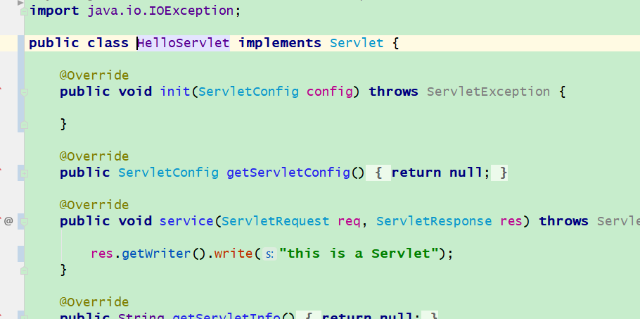

# 第一章  Servlet

将会对servlet进行详细分析，更加容易知道其中的来龙去脉

## 1.1 Servlet&JSP概述

​		我们来思考一下网站通讯的过程，当客户端的浏览器接受发出一个Http请求（request），从底层来说服务器肯定收到的是一堆二进制。我们服务端的程序收到这一堆消息，肯定要对这些请求做一些处理，然后再给请求方一个回应(response)。客户端对这些回应的信息然后做一些处理。（客户端最开始收到也是一些二进制）。


​			我们暂且忽略底层怎么解析这些传输的的信息怎么转化为传递到对应的程序里面，忽略这些后我们现在只关注服务端程序拿到这些信息后怎么回应客户端。在我们的web服务器应用中有一种特殊的类会对客户端的请求做一些处理，把处理的结果返回给客户端。这就会引入我们今天的主角Servlet。servlet将完成以上的操作。


看下面的例子我们看Servlet的使用方式

```java

@WebServlet("/hello")
public class HelloServlet implements Servlet {

    @Override
    public void init(ServletConfig config) throws ServletException {

    }

    @Override
    public ServletConfig getServletConfig() {
        return null;
    }

    @Override
    public void service(ServletRequest req, ServletResponse res) throws ServletException, IOException {

        res.setContentType("text/html;charset=UTF-8"); //防止浏览器乱码
        res.getOutputStream().write("<html><h1>你好哇</h1></html>".getBytes("UTF-8"));
    }

    @Override
    public String getServletInfo() {
        return null;
    }

    @Override
    public void destroy() {

    }
}
```

上面的代码是实现继承了`HttpServlet`，其实实现Servlet接口同样可以达到效果。HttpServlet只是替我们实现一些方法。

我们看一下执行效果


​	不同的访问链接，执行不同的servlet。`WebServlet`注解里面定义的就是哪一个路径访问这个Servlet。如果Get请求执行`doGet`方法，如果是Post请求执行`doPost`方法。还可以根据XML来配置哪个链接访问哪个servlet

​		方法的参数`req`就是客户端发过来的请求信息（应用层面符合HTTP协议的信息）转成的对象，客户端将会收到的信息也用一个对象来表示`resp`,这个对象会被处理成符合HTTP协议的相关信息发送给客户端。

## 1.2 Servlet容器

​	我们好像只用关心处理根据`reques`对象携带信息去填充response对象即可，其余的一些事情都不用我们关心。其余操作都是回来完成的呢？servlet里面的方法不能平白无故的被执行，是谁调用它的呢？？

我们现在来猜想一下大致都有哪些操作

+ 生成response对象request对象。

+ 根据请求的类别调用servlet的对象的某一个方法。

+ 把request和response对象传递进去

+ 把response对象转化成相关格式的信息传送给客户端

  下图大致画一下servlet容易的功能


servlet容器到底干了什么呢？

+ **通信支持**。servlet容器会监听处理来自客户端的消息，怎么解析传过来的数据，怎么接受数据，怎么解析数据在，怎么返回给客户端的数据这些我们都不用关心，我们只需关心怎么实现servlet即可。
+ **生命周期的管理**。要想调用Servlet里面我们定义的方法我们必须对他实例化，使用完servlet实例将会被回收。servlet容器掌管着servlet实例的生与死。也就是对它的生命周期的管理。我们不用在考虑资源管理了。
+ **多线程的支持** 同时有多个请求访问同一个servlet，容器就会创建多个java线程来访问servlet实例。但是我们在编码的过程中也要注意servlet里卖弄的方法对非局部生成的实例要注意多线程安全。
+ **声明方式实现安全** 可以在XML文件里面设置一些servlet的属性。而不必硬编码到java的源文件里面。方便我们的修改
+ **JSP支持 **  JSP是一种servlet（快被淘汰了）

## 1.3 Servlet的生命周期

​	从下面展示的Servlet接口的定义我们就可以看出Servlet 声明周期


```java
public interface Servlet {

    /**
     * Called by the servlet container to indicate to a servlet that the 
     * servlet is being placed into service.
     */

    public void init(ServletConfig config) throws ServletException;

    
    /**
     *
     * Returns a {@link ServletConfig} object, which contains
     * initialization and startup parameters for this servlet.
     * The <code>ServletConfig</code> object returned is the one 
     * passed to the <code>init</code> method. 
     */

    public ServletConfig getServletConfig();
    
    

    /**
     * Called by the servlet container to allow the servlet to respond to 
     * a request.
     *
     */

    public void service(ServletRequest req, ServletResponse res) throws ServletException, IOException;
   
   

    /**
     * Returns information about the servlet, such
     * as author, version, and copyright.
     *
     */

    public String getServletInfo();
    
    

    /**
     *
     * Called by the servlet container to indicate to a servlet that the
     * servlet is being taken out of service.
     *
     */

    public void destroy();
}
```


再加上类的加载和实例化，一共有5个状态。


### 1.3.1 加载servlet 类

​		在默认情况下，当容器第一次收到访问这个Servlet的请求时，就会加载这个类。但是我可以通过配置让容器在它自己启动的时候加载这个servlet。配置可以分为在web.xml里面配置和用注解进行配置。

### 1.3.2 实例化

​		在容器被加载之后，就会被容器实例化。也可以说容器想要实例化之前必须去加载这个类，这是一般java程序实例化的步骤。一般情况下，某一个Servlet类只会被容器创建一个Servlet实例（当然这是有Servlet容器决定的），关于这个Servlet的访问就只会访问那一个实例。

### 1.3.3 初始化

​		容器会在实例化后第一次Servlet被访问之前会进行调用Servlet的`init()`方法，当Servlet被实例化后不能算真正的Servlet，只能算一个普通对象。因为它没有Servlet的一些特权，比如从`ServletContext`或者`ServletConfig`中获得信息、能够记录事件的记录日志、得到其他资源的引用。**所以我们不能在构造函数中做有关Servlet功能的事情会导致失败（比如访问`ServletContext`）**。

​		`init`方法我们可以重写，初始化一些我们认为这个Servlet在成为真正的Servlet时所应该具备条件或者需要在服务请求之前所要做的一些事情，比如配置连接数据。`init`方法一生只会被调用一次好好利用。

### 1.3.4 service()

```java
  public void service(ServletRequest req, ServletResponse res)
```

​			当servlet容器接受到来自客户端的请求的时候创建两个对象（response和request），其中request里面存放着请求的相关信息。然后调用对应Servlet的Service方法并传递这两个参数。下面是`HttpServlet`的重写的Servlet

```java
 /**
  * Dispatches client requests to the protected
  * <code>service</code> method. There's no need to
  * override this method.
  */
	 @Override
    public void service(ServletRequest req, ServletResponse res)
        throws ServletException, IOException
    {
        HttpServletRequest  request;
        HttpServletResponse response;
        
        if (!(req instanceof HttpServletRequest &&
                res instanceof HttpServletResponse)) {
            throw new ServletException("non-HTTP request or response");
        }

        request = (HttpServletRequest) req;
        response = (HttpServletResponse) res;

        service(request, response);
    }
/**
  * Receives standard HTTP requests from the public
  * <code>service</code> method and dispatches
  * them to the <code>do</code><i>XXX</i> methods defined in 
  * this class. This method is an HTTP-specific version of the 
  * {@link javax.servlet.Servlet#service} method. There's no
  * need to override this method.
  */
protected void service(HttpServletRequest req, HttpServletResponse resp)
    throws ServletException, IOException
{
    String method = req.getMethod();

    if (method.equals(METHOD_GET)) {
        long lastModified = getLastModified(req);
        if (lastModified == -1) {
            // servlet doesn't support if-modified-since, no reason
            // to go through further expensive logic
            doGet(req, resp);
        } else {
            long ifModifiedSince = req.getDateHeader(HEADER_IFMODSINCE);
            if (ifModifiedSince < lastModified) {
                // If the servlet mod time is later, call doGet()
                // Round down to the nearest second for a proper compare
                // A ifModifiedSince of -1 will always be less
                maybeSetLastModified(resp, lastModified);
                doGet(req, resp);
            } else {
                resp.setStatus(HttpServletResponse.SC_NOT_MODIFIED);
            }
        }

    } else if (method.equals(METHOD_HEAD)) {
        long lastModified = getLastModified(req);
        maybeSetLastModified(resp, lastModified);
        doHead(req, resp);

    } else if (method.equals(METHOD_POST)) {
        doPost(req, resp);
        
    } else if (method.equals(METHOD_PUT)) {
        doPut(req, resp);
        
    } else if (method.equals(METHOD_DELETE)) {
        doDelete(req, resp);
        
    } else if (method.equals(METHOD_OPTIONS)) {
        doOptions(req,resp);
        
    } else if (method.equals(METHOD_TRACE)) {
        doTrace(req,resp);
        
    } else {
        //
        // Note that this means NO servlet supports whatever
        // method was requested, anywhere on this server.
        //

        String errMsg = lStrings.getString("http.method_not_implemented");
        Object[] errArgs = new Object[1];
        errArgs[0] = method;
        errMsg = MessageFormat.format(errMsg, errArgs);
        
        resp.sendError(HttpServletResponse.SC_NOT_IMPLEMENTED, errMsg);
    }
}
```

​		我们在使用Servlet过程中，我们大部分都是使用的`HttpServlet`，所以我们拿出它的源码来简单看一下。上面有两个service方法容器在接收到请求的时候会调用第一个Service方法。第一个Service方法会调用第二个Service方法。第二个Service方法会根据请求的不同类型去访问不同的方法。如下图


​		

​		所以我们在写继承`HttpServlet`子类时候只专注实现`doXxx()`方法即可,这其中doGet和doPost最常用其他不怎么使用。（两个Service为为什么不冲突，看前面基础部分的方法调用过程的原理）

### 1.3.5 destroy()

​		当servlet从容器中卸载时候会调用这个方法。因为一个servlet只会卸载一次所以这个destroy方法也只会使用一次。什么时候会对servlet卸载呢？当servlet容器关闭的时候和重新启动的时候都会对servlet进行卸载。、

## 1.4 HttpServlet

上面介绍过了就不介绍了

## 1.5HttpServletRequest

`HttpServletRequest`是`HttpServlet`处理方法的两个参数之一，也对应着`servlet`的`ServletRequest`参数。

`HttpServletRequest`代表着浏览器向服务器发送过来的请求，无论浏览器向服务器发送什么样的信息都会转化成这个对象

### 1.5.1 Parameters

Request parameters 可以在请求头(url)里面也可以在请求体里面，看下面参数在url链接里面的情况


参数在Body里面的情况


### 1.5.1 Header

request对象的请求头就对应着HTTP协请求的时候的请求头，请求头对象里面都包含着一个一个的name-value的键值对。里面的信息比如有客户端正在使用的浏览器，浏览器支持接收文件的类型

```java
String contentLength = request.getHeader("Content-Length");    
```

浏览器会告诉服务端它要传递的请求体的内容的长度，下面就是获得请求内容长度的方法。对于get请求来说`Content-Length`将不会被用到，因为没有请求体。


如果Header不存在，`getHeader`将会返回null

### 1.5.3 InputStream

```java
InputStream requestBodyInput = request.getInputStream();    
```

上面这个InputStream对应着HTTP的post请求的请求体，我们可以用流形式访问请求体里面的内容。

如果你在调用获得流的方法之前调用了getParameter方法就会导致，Servlet引擎把请求体里面的内容进行解析，一旦解析就不能用流的形式访问请求体了（原生字节流）。也就是说Servlet引擎支持几种不同类型（约定好的格式）的请求体内容的解析。


### 1.5.4 Session

Session对象保存着一些信息，这个对象在相同用户的请求里面是共用的，也就是说每一个用户拥有着一个Seesion对象，这样的话极大方便了我们一些信息的处理

```java
HttpSession session = request.getSession();
```

### 1.5.5 ServletContext

```java
ServletContext context = request.getSession().getServletContext();     
```

正如上面所示首先获得ServletContext对象首先获得Session对象

ServletContext对象存储着关于Web Application相关信息。比如在web.xml里面设置的一些参数。也可以把请求转发给其他的Servlet

## 1.6 HttpResponse

`HttpResponse`是`HttpServlet`处理方法的两个参数之一，也对应着`servlet`的`ServletResponse`参数。

`HttpResponse`代表着服务器像浏览器发送的回应，servlet容器最后会通过HTTP协议传送给客户端。


### 1.6.1Writing HTML

```java
PrintWriter writer = response.getWriter();

writer.write("<html><body>GET/POST response</body></html>");
```

通过Response对象去向发出访问浏览器返回HTML信息


### 1.6.2 Headers

```java
response.setHeader("Header-Name", "Header Value");
```

去请求一样也会有头部信息，可以称之为响应头，同样是一个name和value的键值对，里面存储着一些关于告诉浏览器的一些信息。比如发送的信息是什么样信息。

### 1.6.3 Content-Type


```java
response.setHeader("Content-Type", "text/html");
```


告诉浏览器发送的是什么信息，比如你想发送html就用上面的test/html,如果是纯文本，那就设置text/plain这个格式就好。

### 1.6.4 Writing Text

```java
response.setHeader("Content-Type", "text/plain");

PrintWriter writer = response.getWriter();
writer.write("This is just plain text");
```


### 1.6.5 Content-Length


Content-Length的header就是告诉浏览器你将返回的信息的字节数（包不包含响应头呢？），如果你想返回给浏览器一些二进制信息你需设置这个头部信息

```java
response.setHeader("Content-Length", "31642");
```

### 1.6.6 Writing Binary Data

​		有时候我们需要传送二进制数据给浏览器，什么情况呢？比如你需要传输一张图片 Pdf文件 flash文件等等，这时候我们不得不用二进制的时候进行传输，不能使用writer了。	

​	这和传输下载文件还有些不同，这些文件是要在浏览器上显示出来的，所以要指明类型。这就用到了头部信息的来帮我们传递。 用这个`Content-Type`响应头部属性来设置。如果传输的是png格式的图片那么久设置为	image/png


```java
protected void doGet(HttpServletRequest req, HttpServletResponse resp) throws ServletException, IOException {

    OutputStream outputStream = resp.getOutputStream();

    String path = this.getServletContext().getRealPath("/example.jpg");
    InputStream inputStream = new FileInputStream(path);
    resp.setHeader("Content-Type","image/jpg");
    byte a[]=new byte[1024];
    while(inputStream.read(a)>0){
        outputStream.write(a);
    }

}
```


### 1.6.7 Redirecting to a Different URL

告诉浏览器去访问其他的url

```
response.sendRedirect("http://www.baidu.com");
```


## 1.7HttpSession


​		HttpSession存储一个用户相关的信息，一个用户多个请求，可能用到一些共有的信息，这些存储的位置Seesion是一个好的对象。

当用户第一次访问某一个服务器的时候，用户会被分发一个ID，这个ID是查找对应用Seesion的ID，这个ID一般存储在cookies里面或者请求参数里面


获得session对象

```java
  HttpSession session = request.getSession();
```

在session对象存储内容

```java
session.setAttribute("userName", "theUserName");
```


获得seesion对象里面的内容

```java
String userName = (String) session.getAttribute("userName");
```


**Sessions and Clusters**

如果服务器是一个集群的话，seesion是存储在服务器上的。用户访问服务器的时候不光只会访问其中一个服务器，可能是随机访问的，在其中一个服务器上存储了session和在访问别的服务器的时候怎么做到数据共享。

1.不用seesion属性

2.使用seesion数据库，不同服务器在写入其中相关的seesion信息和查询相关的信息来做到数据共享。

3.在一个访问过程中，一个用户总当问其中一个服务器。这就需要其中算法了。比如根据IP来确定集群中哪一个服务器

## 1.8 RequestDispatcher--请求转发

转发就是客户端访问到了其中一个servlet后，通过这个servlet转发给了其他的Servlet。也可以转发给JSP是，JSP也是一个servlet。


转发给servlet


转发给jsp


除了上面用forward方法进行转发，还能用include的方法进行转发。

```java
requestDispatcher.forward(request, response);

requestDispatcher.include(request, response);
```

两个方法有什么区别呢

forward


include 和 sendRediect 之后，后面的语句会继续执行，所以应该在合适的位置写上return;forward的不会


## 1.9 `ServletContext`

`ServletContext`就代表web application，里面存储的元信息，通过request获得这个对象。所有的servlet可以共享其中的信息。

```java
ServletContext context = request.getSession().getServletContext();
```


## 1.10 web.xml Servlet Configuration


### 1.10.1 Configuring and Mapping a Servlet


上面的那个访问链接访问到哪一个servlet是通过注解的方式的访问到的，其实我们也可以通过配置文件访问到的。这就需要在web.xml中进行配置，也可以叫做配置servlet的映射。




### 1.10.2 Servlet Init Parameters


也可以通过web.xml传递给servlet一些参数，这样就可以相当于配置servlet了。


### 1.10.3  Servlet Load-on-Startup

这是一个Servlet里面的下面一个标签，来告诉servlet容器什么时候加载这个serlvet，这个数据越小加载的时机就越靠前。如果是负数和或者是未指定就会在第一次请求的时候加载（实例化）。	现在我们这个参数设置为1，在Tomcat容器启动时候就会创建这servlet


### 1.10.4 Context Parameters

也可以向servletContext对象里面放参数

## 1.11 Cookies 


## 1.12 Servlet Filters

Servlet filter 能够拦截请求servlet JSP html文件或者其他静态文件的请求都能都拦截。


​		为什么要拦截呢？在某些情况下输入的链接暂时不能访问，比如一个网站你在没有登陆的情况下就进行访问一些个人相关的信息。还有的输入的参数不和规范就会给拦截住。下面我们看一下是怎么拦截住的。

首先我们自己定义一个拦截器，必须得实现`javax.servlet.Filter`接口，然后利用注解或者在xml里面进行配置。

对于一个请求可能满足多个filter的拦截要求。这样的话filter对于一个请求来说就会形成一个拦截，这个链的末尾是请求想要访问的对象。通过`FilterChain`的`dofilter`方法向后传递，如下图。


## 1.13 GZip Servlet Filter


用于压缩响应的内容

## 1.14GZip Servlet Filter


每个请求都会有一个线程，对于servlet里面的service方法用到公用的对象就会引发线程安全的问题，需要我们做一些处理。