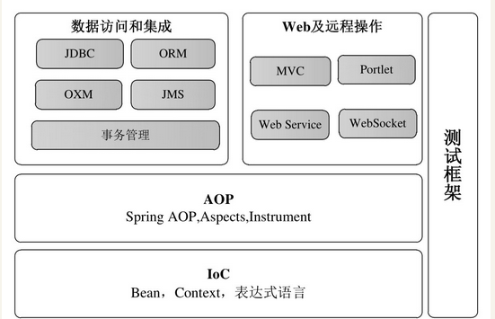
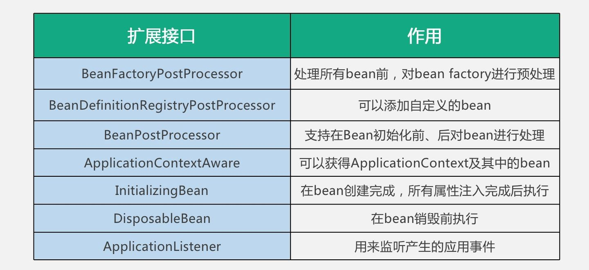
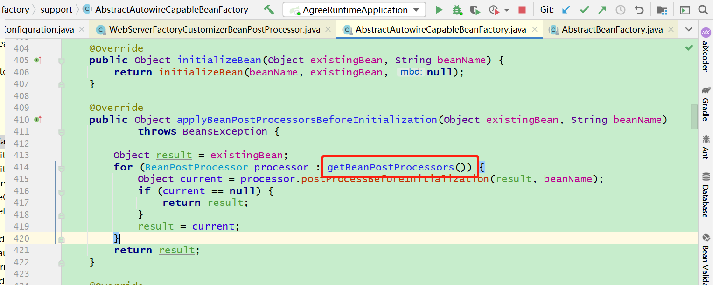
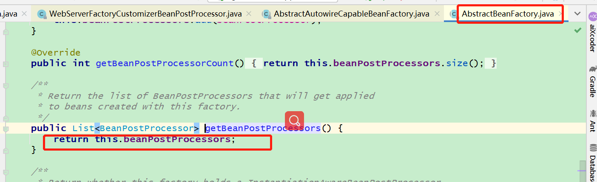
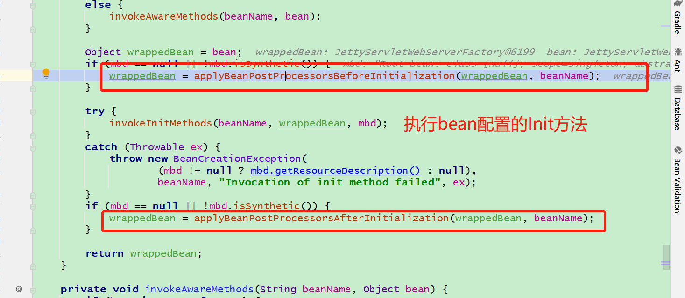

# Spring概述

https://www.zhihu.com/question/48427693/answer/723146648

BeanPostProcessor会对每一个Bean生效。

postProcessBeforeInitialization和postProcessAfterInitialization分别执行在Bean执行配置的init的方法前后

AbstractAutowireCapableBeanFactory.java 

postProcess也是一种bean，会在registerBeanPostProcessors的方法中加载进来