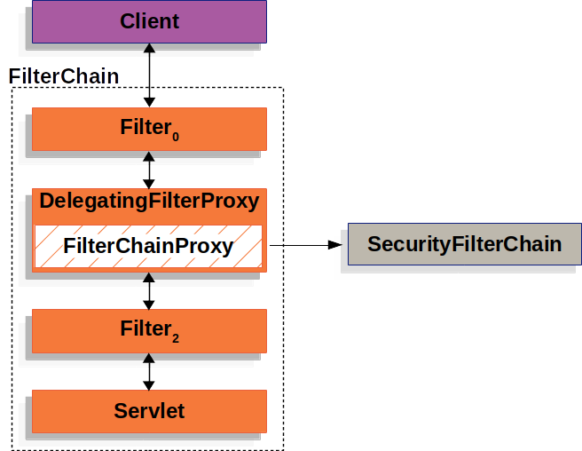
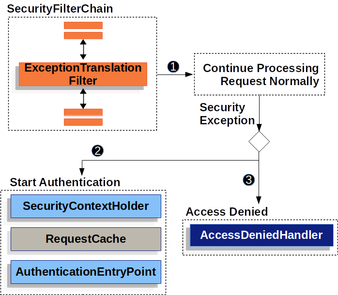

DelegatingFileter0是一个过滤器，放在在了链表的队列中。它通过IOC获取某个特定Bean，这个Bean就是FilterChainProxy。

FilterChainProxy根据不同配置加载不同的SercrityFilterChain,这样Springsecrtiy成功进入过滤器链


怎么到达的授权？



当在过滤连中发现没有权限，被ExceptionTranslationFilter捕获发现到（必须是AccessDeniedException或者AuthenticationException）。然后就会开启授权之旅。

```java
try {
    filterChain.doFilter(request, response); 
} catch (AccessDeniedException | AuthenticationException e) {
    if (!authenticated || e instanceof AuthenticationException) {
        startAuthentication(); 
    } else {
        accessDenied(); 
    }
}
```


怎么授权

**Architecture Components**

为授权增加的组件

- [SecurityContextHolder](https://docs.spring.io/spring-security/site/docs/5.3.9.RELEASE/reference/html5/#servlet-authentication-securitycontextholder) - The `SecurityContextHolder` is where Spring Security stores the details of who is [authenticated](https://docs.spring.io/spring-security/site/docs/5.3.9.RELEASE/reference/html5/#authentication).
- [SecurityContext](https://docs.spring.io/spring-security/site/docs/5.3.9.RELEASE/reference/html5/#servlet-authentication-securitycontext) - is obtained from the `SecurityContextHolder` and contains the `Authentication` of the currently authenticated user.
- [Authentication](https://docs.spring.io/spring-security/site/docs/5.3.9.RELEASE/reference/html5/#servlet-authentication-authentication) - Can be the input to `AuthenticationManager` to provide the credentials a user has provided to authenticate or the current user from the `SecurityContext`.
- [GrantedAuthority](https://docs.spring.io/spring-security/site/docs/5.3.9.RELEASE/reference/html5/#servlet-authentication-granted-authority) - An authority that is granted to the principal on the `Authentication` (i.e. roles, scopes, etc.)
- [AuthenticationManager](https://docs.spring.io/spring-security/site/docs/5.3.9.RELEASE/reference/html5/#servlet-authentication-authenticationmanager) - the API that defines how Spring Security’s Filters perform [authentication](https://docs.spring.io/spring-security/site/docs/5.3.9.RELEASE/reference/html5/#authentication).
- [ProviderManager](https://docs.spring.io/spring-security/site/docs/5.3.9.RELEASE/reference/html5/#servlet-authentication-providermanager) - the most common implementation of `AuthenticationManager`.
- [AuthenticationProvider](https://docs.spring.io/spring-security/site/docs/5.3.9.RELEASE/reference/html5/#servlet-authentication-authenticationprovider) - used by `ProviderManager` to perform a specific type of authentication.
- [Request Credentials with `AuthenticationEntryPoint`](https://docs.spring.io/spring-security/site/docs/5.3.9.RELEASE/reference/html5/#servlet-authentication-authenticationentrypoint) - used for requesting credentials from a client (i.e. redirecting to a log in page, sending a `WWW-Authenticate` response, etc.)
- [AbstractAuthenticationProcessingFilter](https://docs.spring.io/spring-security/site/docs/5.3.9.RELEASE/reference/html5/#servlet-authentication-abstractprocessingfilter) - a base `Filter` used for authentication. This also gives a good idea of the high level flow of authentication and how pieces work together.

**Authentication Mechanisms**

都有什么样的授权机制

- [Username and Password](https://docs.spring.io/spring-security/site/docs/5.3.9.RELEASE/reference/html5/#servlet-authentication-unpwd) - how to authenticate with a username/password
- [OAuth 2.0 Login](https://docs.spring.io/spring-security/site/docs/5.3.9.RELEASE/reference/html5/#oauth2login) - OAuth 2.0 Log In with OpenID Connect and non-standard OAuth 2.0 Login (i.e. GitHub)
- [SAML 2.0 Login](https://docs.spring.io/spring-security/site/docs/5.3.9.RELEASE/reference/html5/#servlet-saml2) - SAML 2.0 Log In
- [Central Authentication Server (CAS)](https://docs.spring.io/spring-security/site/docs/5.3.9.RELEASE/reference/html5/#servlet-cas) - Central Authentication Server (CAS) Support
- [Remember Me](https://docs.spring.io/spring-security/site/docs/5.3.9.RELEASE/reference/html5/#servlet-rememberme) - How to remember a user past session expiration
- [JAAS Authentication](https://docs.spring.io/spring-security/site/docs/5.3.9.RELEASE/reference/html5/#servlet-jaas) - Authenticate with JAAS
- [OpenID](https://docs.spring.io/spring-security/site/docs/5.3.9.RELEASE/reference/html5/#servlet-openid) - OpenID Authentication (not to be confused with OpenID Connect)
- [Pre-Authentication Scenarios](https://docs.spring.io/spring-security/site/docs/5.3.9.RELEASE/reference/html5/#servlet-preauth) - Authenticate with an external mechanism such as [SiteMinder](https://www.siteminder.com/) or Java EE security but still use Spring Security for authorization and protection against common exploits.
- [X509 Authentication](https://docs.spring.io/spring-security/site/docs/5.3.9.RELEASE/reference/html5/#servlet-x509) - X509 Authentication


### SecurityContextHolder


SecurityContextHolder存储着一些被认证用户的详细信息。（一般是从数据库加载进去的），以此信息来进行验证


填充SecurityContextHolder

```java
SecurityContext context = SecurityContextHolder.createEmptyContext(); //1
Authentication authentication =
    new TestingAuthenticationToken("username", "password", "ROLE_USER");  //2
context.setAuthentication(authentication);

SecurityContextHolder.setContext(context);  //3
```

1. 创建一个`SecurityContext`，没有用 `SecurityContextHolder.getContext().setAuthentication(authentication)`

是为了避免多线程造成竞争。

2. 用一个简单的Authentication实现类
3. 最后把SecurityContext放到SecurityContextHolder中，这样就可以框架就可以利用里面的信息进行授权


**Access Currently Authenticated User**

访问当前已经被授权的用户

```java
SecurityContext context = SecurityContextHolder.getContext();
Authentication authentication = context.getAuthentication();
String username = authentication.getName();
Object principal = authentication.getPrincipal();
Collection<? extends GrantedAuthority> authorities = authentication.getAuthorities();
```


`SecurityContextHolder` 用ThreadLoca来存储相关的信息。当客户的请求执行完毕的时候 FilterChainProxy 会把ThreadLocal里面 的数据清除

```
public void doFilter(ServletRequest request, ServletResponse response,
      FilterChain chain) throws IOException, ServletException {
   boolean clearContext = request.getAttribute(FILTER_APPLIED) == null;
   if (clearContext) {
      try {
         request.setAttribute(FILTER_APPLIED, Boolean.TRUE);
         doFilterInternal(request, response, chain);
      }
      finally {
         SecurityContextHolder.clearContext(); //清除当前线程的SecurityContext
         request.removeAttribute(FILTER_APPLIED);
      }
   }
   else {
      doFilterInternal(request, response, chain);
   }
}
```

###  

### 10.3. Authentication

它主要有两个作用在此框架中

1. 当`isAuthenticated()`  返回false时候，它就会被用来当作AuthenticationManager的一个证书（用户提供）的输入。
2. 当被认证过后，就可以用它获取当前用户认证相关信息


Authentication包含下面三个对象

​		principal：用于识别用户。当我们用username/password的校验方式的时候，它对应的实例一般是UserDetails

​		credentials：通常是一个密码

​		authorities：GrantedAuthority对象，就是用户被授予高级权限。主要用于一些访问的权限控制


### 10.4. GrantedAuthority


 `Authentication.getAuthorities()` 获得认证用户的权限。是一个Collection。类似于`ROLE_ADMINISTRATOR` or `ROLE_HR_SUPERVISOR` 这样的权限。通常基于用户密码的验证，权限的加载是在[`UserDetailsService`](https://docs.spring.io/spring-security/site/docs/5.3.9.RELEASE/reference/html5/#servlet-authentication-userdetailsservice)中进行的。

### 10.5. AuthenticationManager

定义认证的API，是一个接口。通用的实现是[`ProviderManager`](https://docs.spring.io/spring-security/site/docs/current/api/org/springframework/security/authentication/ProviderManager.html).校验Authentication，成功就会返回Authentication

```

/**
 * Processes an {@link Authentication} request.
 */
public interface AuthenticationManager {
/**
  * Attempts to authenticate the passed {@link Authentication} object, returning a
  * fully populated <code>Authentication</code> object (including granted authorities)
  * if successful.
  * <p>
  */
   Authentication authenticate(Authentication authentication)
         throws AuthenticationException;
}
```

### 10.6. ProviderManager


ProviderManager是AuthenticationManager的通用实现，他会把认证任务委托 一个由`AuthenticationProvider`的队列，每一个Authentication都会有机会进行认证，决定成功与失败或者是不能做决定交给下一个AuthentiacationProvider。


在这个队列中，顺序的执行过程中，只要其中一个能决定，就会使最终结果

```java
for (AuthenticationProvider provider : getProviders()) {
   if (!provider.supports(toTest)) {
      continue;
   }

   if (debug) {
      logger.debug("Authentication attempt using "
            + provider.getClass().getName());
   }

   try {
      result = provider.authenticate(authentication);

      if (result != null) {
         copyDetails(authentication, result);
         break;
      }
   }
}

```


ProviderManager会有一个父节点，这个节点是AuthenticationManager，当ProviderManager委托的队列都无法校验的时候，就会委托给parent校验。


```java
private AuthenticationManager parent;
```

```
if (result == null && parent != null) {
   // Allow the parent to try.
   try {
      result = parentResult = parent.authenticate(authentication);
   }	
   catch (ProviderNotFoundException e) {  //ProviderNotFoundException是AuthenticationException的子类
				// ignore as we will throw below if no other exception occurred prior to
				// calling parent and the parent
				// may throw ProviderNotFound even though a provider in the child already
				// handled the request
	}
	
	catch (AuthenticationException e) {
				lastException = parentException = e;
	}
   
}
```


### 10.7. AuthenticationProvider


​		大多的AuthenticationProvider的实现类都能注入到[`ProviderManager`]中，来代理认证的事情。每一个来代理AuthenticationProvider都会是特定的认证。比如[`DaoAuthenticationProvider`](https://docs.spring.io/spring-security/site/docs/5.3.9.RELEASE/reference/html5/#servlet-authentication-daoauthenticationprovider) 支持用户密码认证，JwtAuthenticationProvider支持JWT Token相关的认证。

### 10.8. Request Credentials with `AuthenticationEntryPoint`

当未认证的请求发送来的时候，服务端就会请求客户端的凭证（用于认证）。`AuthenticationEntryPoint`实现的这个功能。

AuthenticationEntryPoint的实现类很可能会让客户端重定向登录请求。它会回复给客户端的reponse的请求头有里面带一个"WWW-Authenticate"的属性


### 10.9. AbstractAuthenticationProcessingFilter

在springSercrity提供的一系列的过滤器中，此过滤器主要的作用是担任认证的任务。当客户端发来了认证的请求的时候，AbstractAuthenticationProcessingFilter（不同的认证就会有它的不同实现类去操作）就会去执行认证相关的操作。


分析一下这几个步骤

1. AbstractAuthenticationProcessingFilter。根据客户端提交的证书credential（在请求里面获得）生成[`Authentication`]。
2. 拿着这个`Authentication`去让[`AuthenticationManager`]认证去。（然后进行了之前的讲的认证过程）
3. 如果认证失败 
   + 清空[SecurityContextHolder](https://docs.spring.io/spring-security/site/docs/5.3.9.RELEASE/reference/html5/#servlet-authentication-securitycontextholder) 。（上面讲过这里面存储的信息）
   + `RememberMeServices.loginFail` 将会被执行 。若没有配置 remeberme，则是一个空执行
   + `AuthenticationFailureHandler` is invoked. 
4. 如果授权成功
   	+ 通知`SessionAuthenticationStrategy`一个新的登陆
   	+ The [Authentication](https://docs.spring.io/spring-security/site/docs/5.3.9.RELEASE/reference/html5/#servlet-authentication-authentication) is set on the [SecurityContextHolder](https://docs.spring.io/spring-security/site/docs/5.3.9.RELEASE/reference/html5/#servlet-authentication-securitycontextholder). Later the `SecurityContextPersistenceFilter` saves the `SecurityContext` to the `HttpSession`.
   	+ 把 Authentication 一些授权信息存储到SecurityContextHolder中。稍后`SecurityContextPersistenceFilter` 把里面的SercurityContext保存到HttpSession中
   	+ `RememberMeServices.loginSuccess将会被执行 。若没有配置 remeberme，则是一个空执行
   	+ `ApplicationEventPublisher` publishes an `InteractiveAuthenticationSuccessEvent`. 触发登陆成功的事件

###  10.10. Username/Password Authentication

这一部分主要讲的是基于用户密码的认证。基于用户名和密码的认证，是最平常的认证

**读取用户名和密码**

springSercrity的用户名和密码主要有以下方式

+ [Form Login](https://docs.spring.io/spring-security/site/docs/5.3.9.RELEASE/reference/html5/#servlet-authentication-form)表单登陆来过去
+ [Basic Authentication](https://docs.spring.io/spring-security/site/docs/5.3.9.RELEASE/reference/html5/#servlet-authentication-basic)
+ [Digest Authentication](https://docs.spring.io/spring-security/site/docs/5.3.9.RELEASE/reference/html5/#servlet-authentication-digest)

**Storage Mechanisms 存储机制**

- Simple Storage with [In-Memory Authentication](https://docs.spring.io/spring-security/site/docs/5.3.9.RELEASE/reference/html5/#servlet-authentication-inmemory) 
- Relational Databases with [JDBC Authentication](https://docs.spring.io/spring-security/site/docs/5.3.9.RELEASE/reference/html5/#servlet-authentication-jdbc)
- Custom data stores with [UserDetailsService](https://docs.spring.io/spring-security/site/docs/5.3.9.RELEASE/reference/html5/#servlet-authentication-userdetailsservice)
- LDAP storage with [LDAP Authentication](https://docs.spring.io/spring-security/site/docs/5.3.9.RELEASE/reference/html5/#servlet-authentication-ldap)

#### 10.10.1. Form Login

Spring Security 提供了对登陆界面的支持


前面讲到过，对于未授权的会重定向的登陆的界面，当然

1. 发送了一个未授权的请求
2.  [`FilterSecurityInterceptor`]会把拦截未授权的请求，并抛出一个异常，AccessDeniedException。
3. [`ExceptionTranslationFilter`]捕获的未授权异常后就会调用 [`AuthenticationEntryPoint`]，让它给客户端返回请求证书的response，大多数情况下AuthenticationEntryPoint是一个[`LoginUrlAuthenticationEntryPoint`](https://docs.spring.io/spring-security/site/docs/current/api/org/springframework/security/web/authentication/LoginUrlAuthenticationEntryPoint.html).实例(<font color='red'>什么情况是这个，什么情况是别的</font>)
4. 客户端（浏览器）就会重定向请求到登陆页面。
5. 返回给浏览器一个渲染后的登陆界面

当我们采用的用户密码的方式去认证的时候，就会用AbstractAuthenticationProcessingFilter的实现类UsernamePasswordAuthenticationFilter去担任过滤功能。上面基于它们接口父类层次介绍过这个过滤认证功能。下面我们基于种方式来说明一下。


**Figure 7. Authenticating Username and Password**

上面两张图标一个是基于抽象层次的，一个是基于具体层次的（面对不同的情况有不同的具体，这次是基于用户密码模式的认证）。

 When the user submits their username and password, the `UsernamePasswordAuthenticationFilter` creates a `UsernamePasswordAuthenticationToken` which is a type of [`Authentication`](https://docs.spring.io/spring-security/site/docs/5.3.9.RELEASE/reference/html5/#servlet-authentication-authentication) by extracting the username and password from the `HttpServletRequest`.

 Next, the `UsernamePasswordAuthenticationToken` is passed into the `AuthenticationManager` to be authenticated. The details of what `AuthenticationManager` look like depend on how the [user information is stored](https://docs.spring.io/spring-security/site/docs/5.3.9.RELEASE/reference/html5/#servlet-authentication-unpwd-storage).

 If authentication fails, then *Failure*

- The [SecurityContextHolder](https://docs.spring.io/spring-security/site/docs/5.3.9.RELEASE/reference/html5/#servlet-authentication-securitycontextholder) is cleared out.
- `RememberMeServices.loginFail` is invoked. If remember me is not configured, this is a no-op.
- `AuthenticationFailureHandler` is invoked.

 If authentication is successful, then *Success*.

- `SessionAuthenticationStrategy` is notified of a new log in.
- The [Authentication](https://docs.spring.io/spring-security/site/docs/5.3.9.RELEASE/reference/html5/#servlet-authentication-authentication) is set on the [SecurityContextHolder](https://docs.spring.io/spring-security/site/docs/5.3.9.RELEASE/reference/html5/#servlet-authentication-securitycontextholder).
- `RememberMeServices.loginSuccess` is invoked. If remember me is not configured, this is a no-op.
- `ApplicationEventPublisher` publishes an `InteractiveAuthenticationSuccessEvent`.
- The `AuthenticationSuccessHandler` is invoked. Typically this is a `SimpleUrlAuthenticationSuccessHandler` which will redirect to a request saved by [`ExceptionTranslationFilter`](https://docs.spring.io/spring-security/site/docs/5.3.9.RELEASE/reference/html5/#servlet-exceptiontranslationfilter) when we redirect to the log in page.（之前由于未认证的请求会存储在[`ExceptionTranslationFilter`]中，当认证完毕后，会重定向到这个里面）


**Form Log In**

在啥也不配的情况下会使用表单登录的默认配置，但只要由基于configuration 的servlet配置的时候就必须显示配置FormLogin。（也不知道真假，没试过）

```java
protected void configure(HttpSecurity http) {
    http
        // ...
        .formLogin(withDefaults()); //使用默认的方式
}
```


**.Custom LogIn Form Configuration**

有时候也想定制化界面，

```java
protected void configure(HttpSecurity http) throws Exception {
    http
        // ...
        .formLogin(form -> form
            .loginPage("/login")
            .permitAll()
        );
}
```


> **src/main/resources/templates/login.html**   这个路径是可已找到的？。

```html
<!DOCTYPE html>
<html xmlns="http://www.w3.org/1999/xhtml" xmlns:th="https://www.thymeleaf.org">
    <head>
        <title>Please Log In</title>
    </head>
    <body>
        <h1>Please Log In</h1>
        <div th:if="${param.error}">
            Invalid username and password.</div>
        <div th:if="${param.logout}">
            You have been logged out.</div>
        <form th:action="@{/login}" method="post">
            <div>
            <input type="text" name="username" placeholder="Username"/>
            </div>
            <div>
            <input type="password" name="password" placeholder="Password"/>
            </div>
            <input type="submit" value="Log in" />
        </form>
    </body>
</html>
```

对于自己写的Formlogin也是有一些要求的

- The form should perform a `post` to `/login`
- The form will need to include a [CSRF Token](https://docs.spring.io/spring-security/site/docs/5.3.9.RELEASE/reference/html5/#servlet-csrf) which is [automatically included](https://docs.spring.io/spring-security/site/docs/5.3.9.RELEASE/reference/html5/#servlet-csrf-include-form-auto) by Thymeleaf.
- The form should specify the username in a parameter named `username`
- The form should specify the password in a parameter named `password`
- If the HTTP parameter error is found, it indicates the user failed to provide a valid username / password
- If the HTTP parameter logout is found, it indicates the user has logged out successfully

Many users will not need much more than to customize the log in page. However, if needed everything above can be customized with additional configuration.（啥都好商量，上面的要求也是可以修改的， 比如不想用username，password 这样的名词 /login这个名字的请求）

**LoginController**

如果想用SpringSecurity的登陆模板，直接下面的方式使用即可

```java
@Controller
class LoginController {
    @GetMapping("/login")
    String login() {
        return "login";
    }
}
```

####  10.10.2. Basic Authentication


与上面不一样的是[`AuthenticationEntryPoint`](https://docs.spring.io/spring-security/site/docs/5.3.9.RELEASE/reference/html5/#servlet-authentication-authenticationentrypoint) 的实现类，这个是BasicAuthenticationEntryPoint 其余部分与上面相似。


When the user submits their username and password, the `BasicAuthenticationFilter` creates a `UsernamePasswordAuthenticationToken` which is a type of [`Authentication`](https://docs.spring.io/spring-security/site/docs/5.3.9.RELEASE/reference/html5/#servlet-authentication-authentication) by extracting the username and password from the `HttpServletRequest`.

 Next, the `UsernamePasswordAuthenticationToken` is passed into the `AuthenticationManager` to be authenticated. The details of what `AuthenticationManager` look like depend on how the [user information is stored](https://docs.spring.io/spring-security/site/docs/5.3.9.RELEASE/reference/html5/#servlet-authentication-unpwd-storage).

 If authentication fails, then *Failure*

- The [SecurityContextHolder](https://docs.spring.io/spring-security/site/docs/5.3.9.RELEASE/reference/html5/#servlet-authentication-securitycontextholder) is cleared out.
- `RememberMeServices.loginFail` is invoked. If remember me is not configured, this is a no-op.
- `AuthenticationEntryPoint` is invoked to trigger the WWW-Authenticate to be sent again.

 If authentication is successful, then *Success*.

- The [Authentication](https://docs.spring.io/spring-security/site/docs/5.3.9.RELEASE/reference/html5/#servlet-authentication-authentication) is set on the [SecurityContextHolder](https://docs.spring.io/spring-security/site/docs/5.3.9.RELEASE/reference/html5/#servlet-authentication-securitycontextholder).
- `RememberMeServices.loginSuccess` is invoked. If remember me is not configured, this is a no-op.
- The `BasicAuthenticationFilter` invokes `FilterChain.doFilter(request,response)` to continue with the rest of the application logic.

在啥也不配的情况下会使用 HTTP Basic Authentication 的默认配置，但只要有基于configuration 的servlet配置的时候就必须显示配置HTTP Basic。（也不知道真假，没试过）

```java
protected void configure(HttpSecurity http) {
    http
        // ...
        .httpBasic(withDefaults());
}
```

#### 10.10.3. Digest Authentication

略

