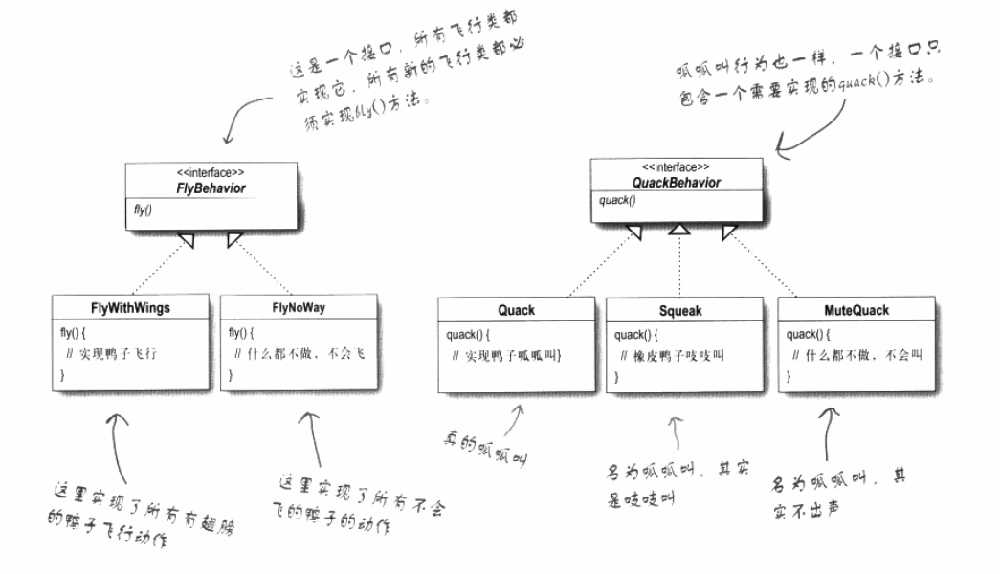

#                                 ·			设计模式

参考书籍：<a href="https://item.jd.com/10100236.html">headFirst 设计模式</a>     <a herf="https://www.runoob.com/design-pattern/design-pattern-tutorial.html">菜鸟教程</a>

好的设计模式对于程序的后续维护和系统运行的稳定性至关重要。

## 第一章 策略模式


从一个基础的代码的开始

  

​	上面是一个很普通的设计。假设上面是一个完成的程序的代码，现在后期要增加会飞的鸭子。怎么增加这个会飞的方法。

**方案一：在Duck类里面增加fly方法**

这样会导致什么问题呢，有些鸭子并不会飞，这就会导致一些并不会飞的鸭子也会飞。

**方案二：增加flyable接口，会飞的子类去实现它**

这样会导致什么问题呢，每一个会飞的鸭子都得实现这个方法，，没有很好的重用代码。而且修改某一个某个行为时，必须找到每一个实现此行为的类中去修改他。无形中增加了工作量，还容易出错。所以不是一个好方法。

**方案三：**		

> 设计原则：找出应用中可能需要变化的部分，把它们独立出来不要和那些不需要变化的代码混合在一起


经过观察鸭子类中，fly()方法和quack()可能经常需要变化或者修改。所以把他们独立出来。


这两个行为方法，经常根据Duck的不同经常发生变化，所以我们需要独立出来建立一组新类代表某个行为。

那么我们怎么样设计这两个类呢


> 设计原则：针对接口编程而不是针对实现编程

要利用java多态进行编程，多态在编程中的重要性不言而喻。

不可能每个Duck子类都添加一个这个行为的引用对象，这样一样特别复杂而麻烦不宜维护。在父类中引用两个这样的行为对象，然后每一个类的相同行为的内容又不尽相同，所以我们利用以上的设计原则，面向接口编程。在父类中引用两个接口对象（抽象超类对象引用和接口对象引用都可以认为时面接口编程）。

​	以下是我们设计的类



这样的设计可以让后期维护更加方便，有以下优点：

这样的设计，可以让飞行和呱呱叫的动作被其它对象复用，因为这些行为与鸭子类无关了。

我们新增一些行为，不会影响的既有的行为类，也不会影像使用飞行行为的鸭子类。

**动态设定行为**

> 设计原则：多用组合，少用继承

如果某一个duck实现类突然变成哑巴了，那之前quack的行为方法就不适用，所以就要更替，怎么在运行的过程替换这个行为？采用组合的模式不用继承，而且设置相应的setter方法。其实前面已经谈到用组合的方式了

​									*整体代码生成的uml图----------待写（用自己写的代码生成）* 


​          


以上就是策略模式。来一个总结：**策略模式定义了算法族，分别封装起来。让他们之间可以相互替换，此模式让算法的变化独立于使用算法的客户。**

## 第二章 观察者模式

先来一个需求，然后给出一下解决方案。 下图就是需求


就是有一个WeatherData对象，负责存储数据。当WeatherData数据更新时，**面板**就能根据数据更新面板的内容。我们一般会怎么给出解决方案呢？

方案一：

我一般都会采用这种方案，这种方案会带来什么问题呢？


​		假如有一天我们不需要其中一个面板了怎么办？貌似只能手动删除这个代码。假如我们需要新增一个新的面板，同样需要手动的更改代码。这样很很不灵活，耦合性很高，后期难以维护。


> **为了交互对象之间的松耦合设计而努力**


由上面的方案一将引出我们的设计模式---观察者模式。

观察者模式=出版者+订阅者。

​	出版者当把报纸印出来后需要向每一个订阅者分发报纸，订阅者可以取消订阅者的身份，非订阅者也可以成为订阅者。出版者厂商把报纸送到订阅者的手里，就不管订阅者是怎么处理这份报纸了。由以上的场景我们来分析一下这个出版订阅的例子。这样就正好的解决了方案一遇到的问题，不过我们先分析这个例子。

​	出版商（Publisher）怎么知道发送给谁呢，出版商肯定会存有存储订阅者（Subscriber）的数据，所以出版商会根据这些数据（**List<Subscriber>  subscribers**）把这些报纸送给他们。虽然每一个订阅者都可以被认为获得了新的这一份报纸（**统一接口** Subscriber），但是每一个订阅者对这份报纸都会不同的处理方式（**不同实现**）。消费者还要有 取消增加订阅的权利，这怎么办？他肯定需要有出版商的联系方式（引用），才能告诉出版商把自己从数据里面添加进去或者删除掉。

经过上面的分析如果还是糊里糊涂，让就看下面的实现。 先画一个简略的uml图，然后进行了代码的实现。


根据上面的图我进行了代码的实现，但是在实现的过程中慢慢考虑的事情越来越多，变得比上面复杂了一点。下面我把具体的代码放到下面，下面代码就不解释了，耐下心肯定会能看下去的。


```java
public interface Product {
}
```

```java
public interface Publisher {

    void addsubscriber(Subscriber subscriber);

    void removeSubscriber(Subscriber subscriber);

    void sendProduct();
}
```

```java
public interface Subscriber {

    void acquireProduct(Product product);
    void subscribe();
    void unsubscribe();
}
```

```java
public interface UseProduct {

    void use();

}
```

```java
public class NewsPaper implements  Product {

    String id;
    String info;

    NewsPaper(String id, String info){
        this.id=id;
        this.info=info;
    }
    public String getId() {
        return id;
    }
    public String getInfo() {
        return info;
    }

}
```

```java
public class NewsPaperPublisher implements Publisher {

    List<Subscriber> subscribers;
    NewsPaper newsPaper;

    @Override
    public void addsubscriber(Subscriber subscriber) {
        subscribers.add(subscriber);
    }

    @Override
    public void removeSubscriber(Subscriber subscriber) {
        subscribers.remove(subscriber);
    }

    @Override
    public void sendProduct() {
        for (Subscriber subscriber:subscribers){
            subscriber.acquireProduct(newsPaper);
        }
    }

    public void createNewsPaper(String id,String info){

        this.newsPaper=new NewsPaper(id,info);
    }

}
```

```java
public class ASubscriber implements Subscriber,UseProduct{
    NewsPaper newsPaper;
    Publisher publisher;

    ASubscriber(Publisher publisher){
        this.publisher=publisher;
    }
    @Override
    public void acquireProduct(Product product) {
        this.newsPaper=(NewsPaper)product;
        use();
    }
    @Override
    public void use() {
        System.out.println("我要更换宣传栏报纸，这次报纸id为" + newsPaper.getId());
        //更换宣传栏报纸
    }
    @Override
    public void subscribe() {
        publisher.addsubscriber(this);
    }

    @Override
    public void unsubscribe() {
        publisher.removeSubscriber(this);
    }
}
```

```java
public class BSubscriber implements Subscriber,UseProduct{
    NewsPaper newsPaper;
    Publisher publisher;
    BSubscriber(Publisher publisher){
        this.publisher=publisher;
    }

    @Override
    public void acquireProduct(Product product) {
        this.newsPaper=(NewsPaper)product;
        use();
    }

    @Override
    public void use() {
        System.out.println("我要在id为"+newsPaper.getId()+"的报纸上找工作");
        //查看招聘信息
    }
    @Override
    public void subscribe() {
        publisher.addsubscriber(this);
    }

    @Override
    public void unsubscribe() {
        publisher.removeSubscriber(this);
    }

}
```

我们分析实现完这个出版订阅的例子后，那么本章开始要的那个解决方案就呼之欲出了。我们来看headfirst是怎么解决的


​	是不是实现的和你想的一样，如果和你想的在思想上差不多，那么就基本上掌握了这个设计模式。同样java内置也有观察者模式(Observable--Observer)，更加具有通用性，但并不一定适合你设计的程序。但并不非常切合你设计的程序的时候你也可以自己设计适合自己的程序的观察者模式。（Observable是一个类不是一个接口，根据java单继承无法继承别的类，可能会影响到你设计的类的实现。Observable保护一些关键方法可能会影响Observer调用），如果适合你设计的程序还是很不错的。

在swt中也有观察者模式的例子。比如Button和Lisener，一个button可以触发（通知）多个Listener。


## 第三章  装饰者模式

​		继承对于编程语言来说是一个很不错的特性，但有时候一味的使用继承就会导致后期难以维护，比如新增功能、减少一个功能都会对原有的代码进行更改。还有一点继承是静态的，就是你提前编写好代码，无论某个行为对某子类是否需要他都存在，有些时候并不是那么适合（第一章已经看到），如果把适合大部分子类的方法拿掉子类去重写那么代码的复用性又会大大的降低。但是组合就可以在运行的时候实现对某个一个对象的行为的扩展，而且又能可以避免对代码的修改。

和以前一样用一个例子来引入装饰着模式：更新星巴克的订单系统。

首先来阐述一个概念，不同的真正拿到消费者手上的饮品是：饮料+调料，怎么样才能设计出一个能有各种组合的订单。

方案一


可以看到上面包含了各种组合的饮品，这样设计的话我想编写代码的程序员和后期维护的程序员得疯掉。大量的重复代码逻辑而且如果新增一种调料，按这种逻辑来写代码，我估计都得疯掉。

方案二：


​	这种只需要这五个类就可以了，明显比方案一好了很多。但是这样会引发一个问题，如果我们新增一种调料或者删除一种调料，我还是不得不修改Beverage类，而且某一种调料并不一定适合某一种特定的饮料（子类）。很明显扩展性不是很好。


> 设计原则：类应该对扩展开放，对修改关闭。

**我们的目标是允许类容易扩展，在不修改现有的代码的情况下，就可以搭配新的行为。如果实现这样的目标，有什么好处呢？这样的设计具有弹性可以应对改变，可以接受新的功能来应对改变的需求。**


上面两种方案，一种是类的数量爆炸，设计死板；另一种是加入新的功能并不一定适合所有的子类。

现在我们来了解以下装饰者和被装饰者，装饰者把需要被装饰的包裹了一层，拿上面的饮品举例可以是饮料包裹了一层调料。来看我们下面的一层一层的包裹，体会装饰者的含义。


上面就是我们需要实现的结果，根据上面的设计我们可以分析具体代码的实现。

* 装饰者与被装饰者具有相同的超类型
* 你可以用一个或者多个装饰者包装一个对象
* 既然装饰者与被装饰者有相同的超类型，所以在任何需要原始对象（被包装的）的场合，可以用装饰过的对象代替它。
* 装饰者可以在所委托被装饰者的行为之前与/或者之后，加上自己的行为，以达到特定的目的。
* 对象可以在任何时候被装饰，所以在运行时动态地，不限量地用你喜欢的装饰者来装饰对象。


> 装饰者模式动态将责任附加到对象上。若要扩展功能，装饰者提供了比继承更有弹性的扩展方案


适配一下我们开始的例子，也就是方案三


java I/O 中的装饰者模式的简单叙述


有些情况并不适合装饰者模式


## 第四章工厂模式

​	这一章我们讲的是披萨店的故事，在披萨店里面了解工厂模式，很快啊很快你就掌握了这个设计模式了，尽管它有些绕。

看一下原有披萨店的订单流程的大致代码。

```java
public class PizzaStore {
   
    public Pizza orderPizza(String type){
        Pizza pizza=new Pizza();
        pizza.bake();
        pizza.cut();
        pizza.box();
        return pizza;
    }
}
```

现在由于我们的披萨店周围又开了几家披萨店，由于口味单一竞争力较弱。于是老板想增加几种口味来提高竞争力。所以需要我们更改订单系统的代码。于是我们进行了第一次尝试。

```java
public class PizzaStore {
    
    public Pizza orderPizza(String type){
        Pizza pizza=new Pizza();
        if(type.equals("cheese")){
            pizza=new CheesePizza();
        }else if(type.equals("greek")){
            pizza=new GreekPizza();
        }else if(type.equals("pepperoni")){
            pizza=new PepperoniPizza();
        }else if(type.equals("veggle")){
            pizza=new VegglePizza();
        }
        pizza.prepare();
        pizza.bake();
        pizza.cut();
        pizza.box();
        return pizza;
    }

}
```

上面有什么问题呀？orderPizza()用到了pizza实例，但是其他方法也可能用到pizza实例，我们每次都得写一大堆判断来确定生成哪一种pizza实例，而且如果增加一种pizza类型，减少一种pizza类型。每一处都得修改。甚是麻烦。


### 简单工厂

> 解决办法：把变化的部分提取出来

​	把生成对象的代码抽离出来转移到一个对象中，这个对象（SimplePizzaFactory）管理如何创建披萨。创建pizza的时候这个对象就行。这样把代码写到一个代码便于管理，遇到修改的情况修改一处就可以了


```java
public class SimplePizzaFactory {

    public Pizza CreatePizza(String type){
        Pizza pizza=null;
        if(type.equals("cheese")){
            pizza=new CheesePizza();
        }else if(type.equals("greek")){
            pizza=new GreekPizza();
        }else if(type.equals("pepperoni")){
            pizza=new PepperoniPizza();
        }else if(type.equals("veggle")){
            pizza=new VegglePizza();
        }
        return pizza;
    }
}
```

```
public class PizzaStore {
    SimplePizzaFactory  factory;
    public PizzaStore(SimplePizzaFactory factory){
        this.factory=factory;
    }
    public Pizza orderPizza(String type){
        Pizza pizza=factory.CreatePizza(type);
        pizza.prepare();
        pizza.bake();
        pizza.cut();
        pizza.box();
        return pizza;
    }

}
```

​	`SimplePizzaFactory`不仅orderPizza可以使用而且在其它方法如果需要实例化这个Pizza这个类的时候也可以使用。这就是**简单工厂**，简单工厂不算一种设计模式而是一种不可忽略的编程技巧。如果把创建实例的方法改为静态方法就会不用声明工厂实例就能使用创建Pizza实例方法（**静态工厂**），但是这样会带来不能通过继承改变创建方法的行为。

### 工厂方法模式

​	由于老板策略的成功，我们的披萨店大火。有了资本我们的资本家老板就想着扩大经营想挣更多的money，他想在几个地方开分店，由于各地的口味、饮食习惯不同，这样我们需要对我们的订单系统做一些修改。


​		你会发现这样做的话，各地加盟店没有自己主权，制作Pizza的流程都是一样，但是有点Pizza加盟店更根据当地的需求特点制作pizza的流程并不是和其他地方统一的（例如Pizza中多放些番茄酱，不要切片，烘烤的方式不同）。另外工厂还那么多，模式不在简单。

​		这一次我们不用简单工厂模式，换一种解决方法。把制作Pizza的活动局限在PizzaStore中同时让各地加盟店自由的制作当地的风味（允许子类做决定）。我们这样做，把createPizza方法放回到Pizza中，并且设置为抽象方法（这个其实就是工厂方法，后面就会理解更深）。


​		既复用了代码（其他不用重写的方法）又给子类的主动权（重写方法）。工厂方法强调的是方法，生产实例的方法根据不同的情况生产不同的实例。这种方法很好的利用的父类的订单处理，而且自己定义制作方式制作适合本地风味的Pizza。来我们看下面代码实现。


​	我们简单来总结一下简单工厂模式:工厂模式通过让子类决定决定创建的对象是什么，来达到对象创建的过程封装的目的。（把对象创建的过程都封装到了createPizza的这个方法中）


> **工厂方法模式定义了一个创建对象的接口，但由子类决定要实例化的类是哪一个。工厂方法让类的实例化推迟到子类。**


​	**依赖倒置**

​	现在讲一下我们的依赖倒置，由于我们的设计模式会导致依赖倒置，这是一种好的特性。如果没有以上的设计模式我们大概率会这么设计代码。


他的依赖图如下：

​	

但采用我们上面的工厂方法模式会导致依赖关系发生什么样的变化呢？


​		倒置在了哪里？倒置在了思考方式。就拿上面设计方式(一种普通方法设计，一种工厂方法模式设计)，第一种在思考的时候先思考的是PizzaStore这个顶层的类，然后再思考这个具体的类。第二种在设计的时候首先是思考的Pizza，思考它是否能抽象化，然后再思考用Pizza抽象类设计PizzaStore这个类。

让你更加靠近依赖倒置的几个原则（尽量去满足）：

* 变量不可以持有具体类的引用。（会依赖具体的类）
* 不要让类派生具体的类    （如果派生具体的类你就会依赖具体的类，这样不利于依赖倒置）
* 不要覆盖基类中已经实现的方法 （基类中实现的方法最好能设计成有子类都能使用的方法）

### 抽象工厂模式

​	抽象工厂=多个工厂方法（生成不同的东西）组合起来的放在抽象接口中。

​	现在是工厂生产制作pizza的原料，不同类型的Pizza需要不同的原料，我们应该怎么实现的？


抽象工厂定义：**抽象工厂模式提供一个接口。用于创建相关或依赖对象的家族，而不需要明确指定具体类。**


我们来讲一下本章要点

+ 所有工厂都是用来封装对象的创建
+ 简单工厂虽不是真正的设计模式，但可以将客户程序解耦，不失为一个好的办法
+ 工厂方法使用继承：把对象的创建委托给了子类，子类来实现工厂方法来创建对象
+ 抽象工厂使用对象组合：对象的创建被实现在工厂接口所暴露出的方法中
+ 所有的工厂模式都通过减少应用程序和具体类之间的依赖促进松耦合。
+ 工厂方法允许类将实例化延迟到子类进行
+ 抽象工厂创建相关对象家族，而不需要以来他们的具体类
+ 依赖倒置原则，指导我们避免具体类型，而要尽量以来抽象
+ 工厂是很有威力 的技巧帮助我们针对抽象编程，而不针对具体类编程


## 第五章单例模式

单例模式：用来创建唯一的对象，某一个类只允许存在一个实例对象。

为什么要单例模式？

* 有些类的对象我们确实需要一个，线程池、缓存....
* 全局变量不容易释放资源，如果对象很大很耗费资源，但没有被使用到就不容易被释放，影响程序的性能
* 单例模式在我们需要的时候才创建对象也给了我们一个全局的一个访问点。


来我们先定义一下单例模式：**确保一个类只有一个实例，并提供一个全局的访问点。**


为了防止在程序中被随便实例化把构造方法设置为private，只允许在类中使用。

 这就会引发一个问题（不考虑静态），这样构造方法被调用必须得有对象当前提，有对象前提必须得调用构造方法。所以这个方法只能在静态方法中调用或者静态代码块中调用。

来我们看看下面的单例模式

方案一：

```java
public class Singleton {
    private static  Singleton uniqueSingleton =new Singleton();
    private Singleton(){}

    public static Singleton getInstance(){

        return uniqueSingleton;
    }
}
```

这种单例模式属于饿汉的单例模式，在加载类的时候就进行对对象的实例化，这种方法会引起如果暂时没有用到这个对象他会一直呆在内存里面，导致内存的浪费。（如果这个对象特别大，带来的问题会更加明显）。

方案二：

```java
public class Singleton {
    private static Singleton uniqueSingleton;
    private Singleton(){}

    public static Singleton getInstance(){
        if(uniqueSingleton==null) //A线程执行完这个句话，切换到B线程执行，也执行到这句话。
            uniqueSingleton=new Singleton();
        return uniqueSingleton;
    }
}
```

​	上面注释对应的那句代码，如果A线程执行完这句代码，切换到B线程执行，也执行完到这句代码，会导致生成两个这样的对象，不仅会浪费空间，还导致了对象引用的混乱。


方案三：

```java
public class Singleton {
    private static Singleton uniqueSingleton =new Singleton();
    private Singleton(){}

    public static synchronized  Singleton getInstance(){
        if(uniqueSingleton==null)
            uniqueSingleton=new Singleton();
        return uniqueSingleton;
    }
}
```

​		根据方案二导致的问题，我们进行了优化，现在我们看方案三。加了一把锁这样对于多线程就是安全的了，但是这样会变得特别慢，当我们这个对象实例化后这把锁好像就有点多余了,加锁是一件耗费时间的操作，如果执行频繁会影响程序的效率。

方案四：


```java
public class Singleton {
    private static volatile Singleton uniqueSingleton =new Singleton();
    private Singleton(){}

    public static  Singleton getInstance(){
        if(uniqueSingleton==null){              
            synchronized (Singleton.class){     
                if (uniqueSingleton == null) {  
                    uniqueSingleton = new Singleton(); 
                }
            }
        }
        return uniqueSingleton;
    }
}

```


方案四是根据上面影响执行效率的问题进行的优化，把锁加到判断后面这样就不会每次执行这个方法进行加锁了。

**为什么还需要判断呢？**

​		防止出现上面方案二那种情况，两个或多个线程”同时“执行到判断的后面。

**什么是指令重排序？**

​		**编译器优化的重排序。**编译器在不改变单线程程序语义的前提下，可以重新安排语句
的执行顺序。

​		**指令级并行的重排序。**现代处理器采用了指令级并行技术（Instruction-Level
Parallelism，ILP）来将多条指令重叠执行。如果不存在数据依赖性，处理器可以改变语句对应
机器指令的执行顺序。

​		**内存系统的重排序。**由于处理器使用缓存和读/写缓冲区，这使得加载和存储操作看上
去可能是在乱序执行。

​																															--------《java并发编程的艺术》

**为什么uniqueSingleton要加上volatile关键字？**（<a href="https://www.infoq.cn/article/double-checked-locking-with-delay-initialization/">参考</a>）

​		指令重排序会导致返回一个不完整的单例，所以我们会加上volatile关键字防止指令重排序。现在我们看一下我们上面的如果不加volatile怎么导致指令重排序。

​	

```java
public class Singleton {
    private static Singleton uniqueSingleton =new Singleton();
    private Singleton(){}

    public static  Singleton getInstance(){
        if(uniqueSingleton==null){              //第一次检查对象(不受锁的约束)
            synchronized (Singleton.class){     //加锁
                if (uniqueSingleton == null) {  //第二次检查
                    uniqueSingleton = new Singleton(); //生成对象
                }
            }
        }
        return uniqueSingleton;
    }
}

```

` uniqueSingleton = new Singleton();`。

上面的这一行语句经过对class文件的反汇编生成以下的代码

```java
// javap
  public static void main(java.lang.String[]);
    Code:
       0: new           #3                  // class pattern/design/singleton/Singleton
       3: dup
       4: invokespecial #4                  // Method "<init>":()V
       7: putstatic     #2                  // Field uniqueSingleton:Lpattern/design/singleton/Singleton;
      10: return

```


其实执行了三件事情

```java

memory = allocate();   //1：分配对象的内存空间
ctorInstance(memory);  //2：初始化对象 (构造方法构造，同样不是原子操作)
instance = memory;     //3：设置 instance 指向刚分配的内存地址

```


假设有两个A,B线程，A线程在执行的时候上面的2，3发生了互换（符合指令重排序的原则）。那么当执行完 `instance = memory;`操作的时候。切换到了B线程执行，<font color="red">这是B线程在执行”第一次检查对象“的时候不受锁的约束，这时对象虽然已经没有初始化完毕，但是对象已经分配了空间，uniqueSingleton也分配了引用值所以不会判断为空。</font>这样就会逃过第一次判断，直接返回uniqueSingleton，就会导致返回的对象不完整。


## 第六章 命令模式


## 第七章适配器与外观模式


## 第八章 模板方法模式


## 第九章迭代器与外观模式


## 第十章状态模式


## 第十一章 代理模式


## 第十二章 复合模式


