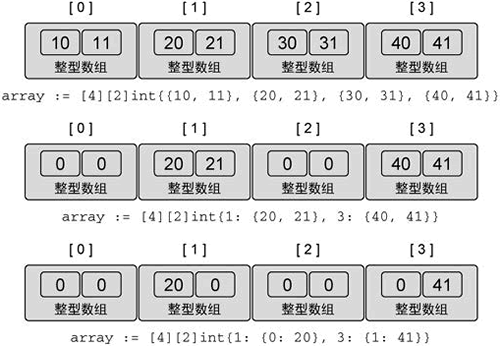
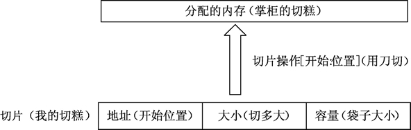
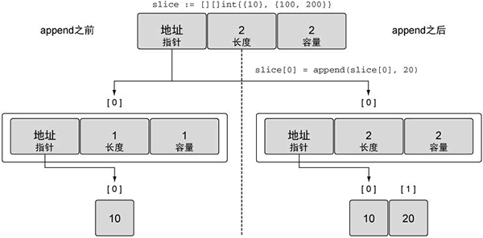
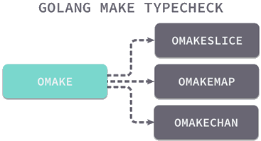

## GO基本语法

### 声明变量

> var name type

 var a, b *int  两个都是指针类型。在C语言中 `int *a,b`指的是a为int *   ,b为int类型

Go都有哪些类型呢

+ bool
+ string
+ int int8 int16 int32 int64
+ uint、uint8、uint16、uint32、uint64、uintptr

+ byte // uint8 的别名

+ rune // int32 的别名 代表一个 Unicode 码

+ float32、float64

+ complex64、complex128

   变量被声明后自动会赋值(注意默认值)

可批量声明

```go

var (
    a int
    b string
    c []float32
    d func() bool
    e struct {
        x int
    }
)
```

简短声明初始化

> 名字 := 表达式

限制：

+ 定义变量，同时显式初始化。
+ 不能提供数据类型。
+ 只能用在函数内部。

```go
i, j := 0, 1 //i=0 j=1 并且i j之间没有声明过

```


### 初始化

**标准格式**

> var 变量名 类型 = 表达式

 var hp int = 100

**推导格式类型**

> var 变量名 = 表达式

 var hp = 100  推到hp为int

```go
var attack = 40   //推到为int
var defence  = 40   //推到为int
var damageRate2 = 0.17 //推导问float64
var damageRate float32 = 0.17 //指定为float32
var damage = float32(attack-defence) * damageRate  //结果为float32
```

**短变量并初始化**

>  名字 := 表达式

:= 只能用在没有声明过的变量上，上面已经提到过

```go
// 声明 hp 变量
var hp int
// 再次声明并赋值
hp := 10 //error-----no new variables on left side of :=

```

```go
conn, err := net.Dial("tcp","127.0.0.1:8080")//函数返回两个值可以这么接收 
```

左值有多个的时候至少有一个是没有被声明过的

```go
conn, err := net.Dial("tcp", "127.0.0.1:8080")
conn2, err := net.Dial("tcp", "127.0.0.1:8080") //no error

```

### Go语言多个变量同时赋值

一个go中交换数值的例子，利用了go语言中多重赋值的属性

```go
	var a int = 100
	var b int = 200
	b, a = a, b
	fmt.Println(a, b)
```

### 匿名变量（无名字的变量）

`_` 来表示匿名变量，任何值都可以赋，只不过赋值完之后被抛弃不能使用。在接收函数的返回值的时候可占位

```go
func GetData() (int, int) {
    return 100, 200
}
func main(){
    a, _ := GetData()
    _, b := GetData()
    fmt.Println(a, b)
}
```

```text
100 200
```

> 匿名变量不占用内存空间，不会分配内存。匿名变量与匿名变量之间也不会因为多次声明而无法使用。

### Go语言变量的作用域

三种变量

+ 局部变量 ：函数内定义
+ 全局变量：函数外定义
+ 形        参：函数头中定义的变量

### Go语言整型

int8、int16、int32 和 int64   四种有符号整型

 uint8、uint16、uint32 和 uint64  四种无符号整型 

数字代表它们所占的位数

int 和 uint  会根据CPU平台的字长来确定（字长所占的字节在不同位数的机器下不同）

Unicode 字符的 rune 类型和 int32 类型是等价的

byte 和 uint8 也是等价类型      byte一般强调存储的数值   uint8 强调的是整数

还有一种无符号的整数类型   uintptr 存储指针

int 和 uint的使用需要注意会受到平台字长的影响，在有些情况（二进制传输，文件的描述结构）是不合适使用的

### GO语言浮点类型

两种精度的浮点数 float32 和 float64.符合IEEE754

float32 误差大，已扩散，精确表达的整数较小

```go
var f float32 = 16777216 // 1 << 24
fmt.Println(f == f+1)    // "true"!
```

声明可以只写整数或小数部分

```go
const e = .71828 // 0.71828
const f = 1.     // 1
```

很大或很小的数，用科学计数法较好

```go
const Avogadro = 6.02214129e23  // 阿伏伽德罗常数
const Planck   = 6.62606957e-34 // 普朗克常数
```

 Printf 函数用“%f“ 标识打印位数

```go
 fmt.Printf("%f\n", math.Pi)	//3.141593
 fmt.Printf("%.2f\n", math.Pi)	//3.14
```

### GO语言复数


​	语法声明

```go
var name complex128 = complex(x, y)
```


### Go语言输出正弦函数（Sin）图像

作业

```go
package main    // 声明 main 包

import (
   "image"
   "image/color"
   _ "image/color"
   "image/png"
   _ "image/png"
   "log"
   _ "log"
   "math"
   _ "math"
   "os"
   _ "os"
)
func main() {   // 声明 main 主函数
   const  size =  300
   pic:=image.NewGray(image.Rect(0,0,size,size))
   for x:=0;x<size;x++ {
      for y:=0;y<size;y++ {
         pic.SetGray(x,y,color.Gray{255})
      }
   }
   for x:=0;x<size;x++ {

       x2:=float64(x)*2*math.Pi/300
       y:=math.Sin(-x2)*150+150

       pic.SetGray(x,int(y),color.Gray{0})


   }

   file,err:=os.Create("sin.png");
   if err!=nil{
      log.Fatal(err)
   }
   png.Encode(file,pic)
   file.Close()


}
```


### Go语言的bool类型

只有两种值true false


比较操作会产生bool值，只有两个相同类型的值才可以进行比较,   && ||比较运算符有短路行为。`&&`（类似乘法）的优先级比`||`（类似加法）高   

```go
var a int=5
var b float64=5
fmt.Print(a==b) //complier error:Invalid operation: a==b (mismatched types int and float64)
```

bool值和int值不会隐式转化，下面封装函数进行转化

```go
// 如果b为真，btoi返回1；如果为假，btoi返回0
func btoi(b bool) int {
    if b {
        return 1
    }
    return 0
}
```

```go
func itob(i int) bool { return i != 0 }
```

Go语言中不允许将整型强制转换为布尔型，反过来也不行。

### Go语言字符串

字符串是一种值类型，且值不可变，即创建某个文本后将无法再次修改这个文本的内容，更深入地讲，字符串是字节的定长数组。

**定义字符串**

`""`，这种定义和java一样


> ## 字符串实现基于 UTF-8 编码


**定义多行字符串**

``有点像js。多行字符串一般用于内嵌源码和内嵌数据等


写什么是什么

默认UTF-8,计算长度按照字节数

****


### Go语言字符类型（byte和rune）


Go语言的字符有以下两种：

- 一种是 uint8 类型，或者叫 byte 型，代表了 ASCII 码的一个字符。
- 另一种是 rune 类型，代表一个 UTF-8 字符，当需要处理中文、日文或者其他复合字符时，则需要用到 rune 类型。rune 类型等价于 int32 类型。


**UTF-8 和 Unicode 有何区别？**


### Go语言数据类型转换

GO不存在隐式转换，转换必须把显示

指针，就是存储地址的类型。在32和64位机器上，地址的长分别为4 8个字节。指针被定义未初始化时的，值为nil(好比 java null)


每个**变量**在运行时都拥有一个地址，这个地址代表变量在内存中的位置。为什么代码中的常量没有地址？

因为最终转化成名的时候常量是什么就是什么，变量在命令中会转化成地址。


### Go语言指针详解


```go 
ptr := &v    // v 的类型为 T     ptr的类型为*T  取这个地址
```

```go 
a:= *ptr    //a的值就是v的值   *取地址上的值
```


**使用指针修改值**


**创建指针的另一种方法——new() 函数**


这个地址上怎么可以放这么大的字符串？

因为不止在这个地址上放，他也向后排列。


### Go语言变量逃逸分析

栈（Stack）是一种拥有特殊规则的线性表数据结构。LIFO，Last InFirst Out。不详述


 **变量和栈有什么关系**

​	

```go
func calc(a, b int) int {
    var c int
    c = a * b
    var x int
    x = c * 10
    return x
}
```

- 第 1 行，传入 a、b 两个整型参数。
- 第 2 行，声明整型变量 c，运行时，c 会分配一段内存用以存储 c 的数值。
- 第 3 行，将 a 和 b 相乘后赋值给 c。
- 第 5 行，声明整型变量 x，x 也会被分配一段内存。
- 第 6 行，让 c 乘以 10 后赋值给变量 x。
- 第 8 行，返回 x 的值。

Go语言默认情况下会将 c 和 x 分配在栈上，这两个变量在 calc() 函数退出时就不再使用，函数结束时，保存 c 和 x 的栈内存再出栈释放内存，整个分配内存的过程通过栈的分配和回收都会非常迅速。（不知道a,b会不会在栈上分配）

**什么是堆**

略


**变量逃逸（Escape Analysis）——自动决定变量分配方式，提高运行效率**


```go
package main
import "fmt"
// 声明空结构体测试结构体逃逸情况
type Data struct {
}
func dummy() *Data {
    // 实例化c为Data类型
    var c Data
    //返回函数局部变量地址
    return &c
}
func main() {
    fmt.Println(dummy())
}
```


c 的 Data 结构分配在堆上,因为分配到栈上会被，执行完函数会被释放掉，但是返回的这个地址就无法再使用了。


编译器觉得变量应该分配在堆和栈上的原则是：

- 变量是否被取地址；
- 变量是否发生逃逸。


### Go语言的声明周期

变量的作用域和声明周期有关系

- 全局变量：它的生命周期和整个程序的运行周期是一致的；
- 局部变量：它的生命周期则是动态的，从创建这个变量的声明语句开始，到这个变量不再被引用为止；
- 形式参数和函数返回值：它们都属于局部变量，在函数被调用的时候创建，函数调用结束后被销毁。


- 堆（heap）：堆是用于存放进程执行中被动态分配的内存段。它的大小并不固定，可动态扩张或缩减。当进程调用 malloc 等函数分配内存时，新分配的内存就被动态加入到堆上（堆被扩张）。当利用 free 等函数释放内存时，被释放的内存从堆中被剔除（堆被缩减）；
- 栈(stack)：栈又称堆栈， 用来存放程序暂时创建的局部变量，也就是我们函数的大括号`{ }`中定义的局部变量。


编译器会根据实际情况自动选择在栈或者堆上分配局部变量的存储空间，不论使用 var 还是 new 关键字声明变量都不会影响编译器的选择。

```go
var global *int
func f() {
    var x int
    x = 1
    global = &x   //逃逸到堆上
}
func g() {
    y := new(int) //在栈上分配 
    *y = 1  
}
```


变量逃逸需要分配额外的内存


### Go语言常量和const关键字

```go
const c1 = 2/3
const c2 = getNumber() // 量的值必须是能够在编译时就能够确定的.因为编译完就是命令了
```

另外 所有常量的运算都可以在编译期完成

常量间的所有算术运算、逻辑运算和比较运算的结果也是常量，对常量的类型转换操作或以下函数调用都是返回常量结果：len、cap、real、imag、complex 和 unsafe.Sizeof。

批量常量声明

```go
const (
    a = 1
    b
    c = 2
    d
)
```

**iota 常量生成器**


在一个 const 声明语句中，在第一个声明的常量所在的行，iota 将会被置为 0，然后在每一个有常量声明的行加一。

**无类型常量**


### Go语言模拟枚举（const和iota模拟枚举）


```go
type Weekday int

func main() {

   const (
      FlagNone Weekday = 1 << iota  //向左移动一位 ,接下来都会是向左移动一位，其他操作也一样。乘以1好像没变
      FlagRed
      FlagGreen
      FlagBlue
   )
   fmt.Printf("%d %d %d\n", FlagRed, FlagGreen, FlagBlue)
   fmt.Printf("%b %b %b\n", FlagRed, FlagGreen, FlagBlue)  //二进制输出
}
```


**将枚举值转换为字符串**

```go
type ChipType int
const (
   None ChipType = iota
   CPU    // 中央处理器
   GPU    // 图形处理器
)
func (c ChipType) String() string {   //定义 ChipType 类型的方法 String()，返回值为字符串类型。Go语言会自动寻找 String() 方法并进行调用。
   switch c {
   case None:
      return "None"
   case CPU:
      return "CPU"
   case GPU:
      return "GPU"
   }
   return "N/A"
}
func main() {
   // 输出CPU的值并以整型格式显示
   fmt.Printf("%s %d", CPU, CPU)
}
```


### Go语言type关键字（类型别名）

**type关键字主要用来类型别名与类型定义**

```go

// 将NewInt定义为int类型
type NewInt int
// 将int取一个别名叫IntAlias
type IntAlias = int
```

这两个的区别

```go
package main
import (
   "fmt"
)
// 将NewInt定义为int类型
type NewInt int
// 将int取一个别名叫IntAlias
type IntAlias = int
func main() {
   // 将a声明为NewInt类型
   var a NewInt
   // 查看a的类型名
   fmt.Printf("a type: %T\n", a)
   // 将a2声明为IntAlias类型
   var a2 IntAlias
   // 查看a2的类型名
   fmt.Printf("a2 type: %T\n", a2)
}
```

```text
a type: main.NewInt
a2 type: int
```

**非本地类型不能定义方法**


### 在结构体成员嵌入时使用别名


### Go语言注释的定义及使用（godoc工具提取注释内容）


### Go语言关键字与标识符简述

**----关键字**

| ---      | ---         | ---    | ---       | ---    |
| -------- | ----------- | ------ | --------- | ------ |
| break    | default     | func   | interface | select |
| case     | defer       | go     | map       | struct |
| chan     | else        | goto   | package   | switch |
| const    | fallthrough | if     | range     | type   |
| continue | for         | import | return    | var    |

---**标识符**

变量名就叫标识符  ‘ `_`’ 是一个特殊的标识符----空白标识符。

> 规则:标识符由若干个字母、下划线`_`、和数字组成，且第一个字符必须是字母。


**标识符的命名需要遵守以下规则：**

- 由 26 个英文字母、0~9、`_`组成；
- 不能以数字开头，例如 var 1num int 是错误的；
- Go语言中严格区分大小写；
- 标识符不能包含空格；
- 不能以系统保留关键字作为标识符，比如 break，if 等等。

**命名标识符时还需要注意以下几点：**

- 标识符的命名要尽量采取简短且有意义；
- 不能和标准库中的包名重复；
- 为变量、函数、常量命名时采用驼峰命名法，例如 stuName、getVal；

**---预定义标识符**

| ------ | ------- | ------- | ------- | ------ | ------- | --------- | ---------- | ------- |
| ------ | ------- | ------- | ------- | ------ | ------- | --------- | ---------- | ------- |
| append | bool    | byte    | cap     | close  | complex | complex64 | complex128 | uint16  |
| copy   | false   | float32 | float64 | imag   | int     | int8      | int16      | uint32  |
| int32  | int64   | iota    | len     | make   | new     | nil       | panic      | uint64  |
| print  | println | real    | recover | string | true    | uint      | uint8      | uintptr |


### Go语言运算符的优先级


| 优先级 | 分类           | 运算符                                         | 结合性   |
| ------ | -------------- | ---------------------------------------------- | -------- |
| 1      | 逗号运算符     | ,                                              | 从左到右 |
| 2      | 赋值运算符     | =、+=、-=、*=、/=、 %=、 >=、 <<=、&=、^=、\|= | 从右到左 |
| 3      | 逻辑或         | \|\|                                           | 从左到右 |
| 4      | 逻辑与         | &&                                             | 从左到右 |
| 5      | 按位或         | \|                                             | 从左到右 |
| 6      | 按位异或       | ^                                              | 从左到右 |
| 7      | 按位与         | &                                              | 从左到右 |
| 8      | 相等/不等      | ==、!=                                         | 从左到右 |
| 9      | 关系运算符     | <、<=、>、>=                                   | 从左到右 |
| 10     | 位移运算符     | <<、>>                                         | 从左到右 |
| 11     | 加法/减法      | +、-                                           | 从左到右 |
| 12     | 乘法/除法/取余 | *（乘号）、/、%                                | 从左到右 |
| 13     | 单目运算符     | !、*（指针）、& 、++、--、+（正号）、-（负号） | 从右到左 |
| 14     | 后缀运算符     | ( )、[ ]、->                                   | 从左到右 |

优先级值越大，表示优先级越高


### Go语言strconv包：字符串和数值类型的相互转换


Go语言中的 strconv包，主要用来数据类型之间的转换


**----string 与 int 类型之间的转换**

**Itoa()：整型转字符串**

> func Itoa(i int) string

```go
func main(){

   a:=100
   b:=strconv.Itoa(a)
   fmt.Printf("类型是%T，值是%#v",b,b)

}
```

```text
类型是string，值是"100"
```

**Atoi()：字符串转整型**

> func Atoi(s string) (i int, err error)

```go
func main() {
    str1 := "110"
    str2 := "s100"
    num1, err := strconv.Atoi(str1)
    if err != nil {
        fmt.Printf("%v 转换失败！", str1)
    } else {
        fmt.Printf("type:%T value:%#v\n", num1, num1)
    }
    num2, err := strconv.Atoi(str2)
    if err != nil {
        fmt.Printf("%v 转换失败！", str2)
    } else {
        fmt.Printf("type:%T value:%#v\n", num2, num2)
    }
}
```

```text
type:int value:110
s100 转换失败！
```

**---Parse 系列函数**

ParseBool()、ParseFloat()、ParseInt()、ParseUint()。

**ParseBool()**

>  func ParseBool(str string) (value bool, err error)

只能接受 1、0、t、f、T、F、true、false、True、False、TRUE、FALSE，其它的值均返回错误，

**ParseInt()**

> func ParseInt(s string, base int, bitSize int) (i int64, err error)

参数说明：

- base 指定进制，取值范围是 2 到 36。如果 base 为 0，则会从字符串前置判断，“0x”是 16 进制，“0”是 8 进制，否则是 10 进制。
- bitSize 指定结果必须能无溢出赋值的整数类型，0、8、16、32、64 分别代表 int、int8、int16、int32、int64。
- 返回的 err 是 *NumErr 类型的，如果语法有误，err.Error = ErrSyntax，如果结果超出类型范围 err.Error = ErrRange

**ParseUnit()**

ParseUint() 函数的功能类似于 ParseInt() 函数，但 ParseUint() 函数不接受正负号，用于无符号整型.

> func ParseFloat(s string, bitSize int) (f float64, err error)

**ParseFloat()**

参数说明：

- 如果 s 合乎语法规则，函数会返回最为接近 s 表示值的一个浮点数（使用 IEEE754 规范舍入）。
- bitSize 指定了返回值的类型，32 表示 float32，64 表示 float64；
- 返回值 err 是 *NumErr 类型的，如果语法有误 err.Error=ErrSyntax，如果返回值超出表示范围，返回值 f 为 ±Inf，err.Error= ErrRange。

**----Format 系列函数**

Format 系列函数实现了将给定类型数据格式化为字符串类型的功能，其中包括 FormatBool()、FormatInt()、FormatUint()、FormatFloat()。

**---Append 系列函数**

Append 系列函数用于将指定类型转换成字符串后追加到一个切片中，其中包含 AppendBool()、AppendFloat()、AppendInt()、AppendUint()。

Append 系列函数和 Format 系列函数的使用方法类似，只不过是将转换后的结果追加到一个切片中。


## Go语言容器（container）


容器：能够存储一系列值的数据结构


### Go语言数组详解

**---定义**

>  var 数组变量名 [元素数量]Type

数组的每个元素都可以通过索引下标来访问,开始下标为0

```go
func main(){

   var a [3]int
   for i,v:=range a{
      fmt.Println(a[i],v,i)

   }

}
```

```text
0 0 0
0 0 1
0 0 2
```

**---初始化数组**：

```go
var q [3]int = [3]int{1, 2, 3}
var r [3]int = [3]int{1, 2}
fmt.Println(r[2]) // "0"
```

**----比较两个数组是否相等**

```go
a := [2]int{1, 2}
b := [...]int{1, 2}
c := [2]int{1, 3}
fmt.Println(a == b, a == c, b == c) // "true false false"
d := [3]int{1, 2}
fmt.Println(a == d) // 编译错误：无法比较 [2]int == [3]int
```

**---遍历数组——访问每一个数组元素**

定义讲过


### Go语言多维数组简述


> var array_name [size1] [size2]...[sizen] array_type


```go
// 声明一个二维整型数组，两个维度的长度分别是 4 和 2
var array [4][2]int
// 使用数组字面量来声明并初始化一个二维整型数组
array = [4][2]int{{10, 11}, {20, 21}, {30, 31}, {40, 41}}
// 声明并初始化数组中索引为 1 和 3 的元素
array = [4][2]int{1: {20, 21}, 3: {40, 41}}
// 声明并初始化数组中指定的元素
array = [4][2]int{1: {0: 20}, 3: {1: 41}}
```




```go
// 声明两个二维整型数组
var array1 [2][2]int
var array2 [2][2]int
// 为array2的每个元素赋值
array2[0][0] = 10
array2[0][1] = 20
array2[1][0] = 30
array2[1][1] = 40
// 将 array2 的值复制给 array1
array1 = array2
```


```go
// 将 array1 的索引为 1 的维度复制到一个同类型的新数组里
var array3 [2]int = array1[1]
// 将数组中指定的整型值复制到新的整型变量里
var value int = array1[1][0]

```


### Go语言切片详解

​		切片（slice）是对数组的一个连续片段的引用，所以切片是一个引用类型（因此更类似于 C/[C++](http://c.biancheng.net/cplus/) 中的数组类型，或者 [Python](http://c.biancheng.net/python/) 中的 list 类型），这个片段可以是整个数组，也可以是由起始和终止索引标识的一些项的子集，需要注意的是，终止索引标识的项不包括在切片内(**[开始位置,结束位置)**,左闭右开。




**-----从数组或切片生成新的切片**

> 切片默认指向一段连续内存区域，可以是数组，也可以是切片本身。


> slice [开始位置 : 结束位置]


语法说明如下：

- slice：表示目标切片对象；
- 开始位置：对应目标切片对象的索引；
- 结束位置：对应目标切片的结束索引。


```go
func main(){

   var a=[3]int {1,2,3}
   fmt.Print(a,a[1:2])
}
```


```text
[1 2 3] [2]
```


从数组或切片生成新的切片拥有如下特性：

- 取出的元素数量为：结束位置 - 开始位置；
- 取出元素不包含结束位置对应的索引，切片最后一个元素使用 slice[len(slice)] 获取；
- 当缺省开始位置时，表示从连续区域开头到结束位置；
- 当缺省结束位置时，表示从开始位置到整个连续区域末尾；
- 两者同时缺省时，与切片本身等效；
- 两者同时为 0 时，等效于空切片，一般用于切片复位。


```go
func main(){
 	var a=[3]int {1,2,3}
	b:=a[1:3]
	b[0]=100
	fmt.Println(b,a)
	fmt.Printf("类型为%T,类型为%T",b,a)
}
```


```text
[100 3] [1 100 3]
类型为[]int,类型为[3]int
```

切片有点像C++的数组，数组名直接就是可以当指针使用

要区分好数组和切片，切片有指向性，上面那张图也说明切片的结构。


**-----从指定范围中生成切片**

```go
var highRiseBuilding [30]int
for i := 0; i < 30; i++ {
        highRiseBuilding[i] = i + 1
}
// 区间
fmt.Println(highRiseBuilding[10:15])
// 中间到尾部的所有元素
fmt.Println(highRiseBuilding[20:])
// 开头到中间指定位置的所有元素
fmt.Println(highRiseBuilding[:2])
```

```text
[11 12 13 14 15]
[21 22 23 24 25 26 27 28 29 30]
[1 2]
```

​		切片有点像C语言里的指针，指针可以做运算，但代价是内存操作越界，切片在指针的基础上增加了大小，约束了切片对应的内存区域，切片使用中无法对切片内部的地址和大小进行手动调整，因此切片比指针更安全、强大。

 


**----表示原有的切片**

生成切片的格式中，当开始和结束位置都被忽略时，生成的切片将表示和原切片一致的切片，并且生成的切片与原切片在数据内容上也是一致的，代码如下：

```
a := []int{1, 2, 3}   //a是一个切片，
fmt.Println(a[:])
```

```text
[1 2 3]
```


**重置切片，清空拥有的元素**

把切片的开始和结束位置都设为 0 时，生成的切片将变空，代码如下：

```text
a := []int{1, 2, 3}
fmt.Println(a[0:0])
```


```text
[]
```


**直接声明新的切片**

​	除了可以从原有的数组或者切片中生成切片外，也可以声明一个新的切片，每一种类型都可以拥有其切片类型，表示多个相同类型元素的连续集合，因此切片类型也可以被声明，切片类型声明格式如下：

> var name []Type


```go
// 声明字符串切片
var strList []string
// 声明整型切片
var numList []int
// 声明一个空切片
var numListEmpty = []int{}
// 输出3个切片
fmt.Println(strList, numList, numListEmpty)
// 输出3个切片大小
fmt.Println(len(strList), len(numList), len(numListEmpty))
// 切片判定空的结果
fmt.Println(strList == nil)
fmt.Println(numList == nil)
fmt.Println(numListEmpty == nil)
```

```text
[] [] []
0 0 0
true
true
false
```

切片是动态结构，只能与 nil 判定相等，不能互相判定相等。声明新的切片后，可以使用 [append()](http://c.biancheng.net/view/28.html) 函数向切片中添加元素。


**----使用 make() 函数构造切片**

如果需要动态地创建一个切片，可以使用 make() 内建函数，格式如下：

``` go
make( []Type, size, cap )
```

其中 Type 是指切片的元素类型，size 指的是为这个类型分配多少个元素，cap 为预分配的元素数量，这个值设定后不影响 size，只是能提前分配空间，降低多次分配空间造成的性能问题。


```go
a := make([]int, 2)
b := make([]int, 2, 10)
fmt.Println(a, b)
fmt.Println(len(a), len(b))
```

```text
[0 0] [0 0]
2 2
```


使用 make() 函数生成的切片一定发生了内存分配操作，但给定开始与结束位置（包括切片复位）的切片只是将新的切片结构指向已经分配好的内存区域，设定开始与结束位置，不会发生内存分配操作。


### Go语言append()为切片添加元素

Go语言的内建函数 append() 可以为切片动态添加元素，代码如下所示：

```go
var a []int
a = append(a, 1) // 追加1个元素
a = append(a, 1, 2, 3) // 追加多个元素, 手写解包方式
a = append(a, []int{1,2,3}...) // 追加一个切片, 切片需要解包  不能是数组只能是切片

```


切片在扩容时，容量的扩展规律是按容量的 2 倍数进行扩充，例如 1、2、4、8、16……，代码如下：

```go
var numbers []int
for i := 0; i < 10; i++ {
    numbers = append(numbers, i)
    fmt.Printf("len: %d  cap: %d pointer: %p\n", len(numbers), cap(numbers), numbers)
}
```

```text
len: 1  cap: 1 pointer: 0xc00000a0b8
len: 2  cap: 2 pointer: 0xc00000a110
len: 3  cap: 4 pointer: 0xc0000103c0
len: 4  cap: 4 pointer: 0xc0000103c0
len: 5  cap: 8 pointer: 0xc00000e2c0
len: 6  cap: 8 pointer: 0xc00000e2c0
len: 7  cap: 8 pointer: 0xc00000e2c0
len: 8  cap: 8 pointer: 0xc00000e2c0
len: 9  cap: 16 pointer: 0xc00007a000
len: 10  cap: 16 pointer: 0xc00007a000
```


```go
var a []int
a = append(a, 1)
b:= append(a, 1, 2)
d:=append(b,4)
b[0]=0
fmt.Print(a,b,d)
```

输出:

```text
[1] [0 1 2] [0 1 2 4]
```

```go
var a []int
a = append(a, 1)
b:= append(a, 1, 2,3)
d:=append(b,4)
b[0]=0
fmt.Print(a,b,d)
```

输出：

```text
[1] [0 1 2 3] [1 1 2 3 4]
```

第一次修改b[0],d生效，第二次没有生效。。从这里可以看出，切片操作的是一片内存，当无法存储的时候就会，就会扩容，存储内容地方也就换了地址。


除了在切片的尾部追加，我们还可以在切片的开头添加元素：

```go
var a = []int{1,2,3}
a = append([]int{0}, a...) // 在开头添加1个元素
a = append([]int{-3,-2,-1}, a...) // 在开头添加1个切片
```

支持链式操作

```go
var a []int
a = append(a[:i], append([]int{x}, a[i:]...)...) // 在第i个位置插入x
a = append(a[:i], append([]int{1,2,3}, a[i:]...)...) // 在第i个位置插入切片
```


### Go语言copy()：切片复制（切片拷贝）

Go语言的内置函数 copy() 可以将一个数组切片复制到另一个数组切片中，如果加入的两个数组切片不一样大，就会按照其中较小的那个数组切片的元素个数进行复制。

copy() 函数的使用格式如下：

> copy( destSlice, srcSlice []T) int

```go
slice1 := []int{1, 2, 3, 4, 5}
slice2 := []int{5, 4, 3}
copy(slice2, slice1) // 只会复制slice1的前3个元素到slice2中
copy(slice1, slice2) // 只会复制slice2的3个元素到slice1的前3个位置
```


```go
package main
import "fmt"
func main() {
    // 设置元素数量为1000
    const elementCount = 1000
    // 预分配足够多的元素切片
    srcData := make([]int, elementCount)
    // 将切片赋值
    for i := 0; i < elementCount; i++ {
        srcData[i] = i
    }
    // 引用切片数据
    refData := srcData
    // 预分配足够多的元素切片
    copyData := make([]int, elementCount)
    // 将数据复制到新的切片空间中
    copy(copyData, srcData)
    // 修改原始数据的第一个元素
    srcData[0] = 999
    // 打印引用切片的第一个元素
    fmt.Println(refData[0])
    // 打印复制切片的第一个和最后一个元素
    fmt.Println(copyData[0], copyData[elementCount-1])
    // 复制原始数据从4到6(不包含)
    copy(copyData, srcData[4:6])
    for i := 0; i < 5; i++ {
        fmt.Printf("%d ", copyData[i])
    }
}
```

引用的是共享数据的，复制的是相互之间不会产生影响


### Go语言从切片中删除元素


**----从开头位置删除**

删除开头的元素可以直接移动数据指针

```go
a = []int{1, 2, 3}
a = a[1:] // 删除开头1个元素
a = a[N:] // 删除开头N个元素
```


也可以不移动数据指针，但是将后面的数据向开头移动，可以用 append 原地完成（所谓原地完成是指在原有的切片数据对应的内存区间内完成，不会导致内存空间结构的变化）：

```go
a = []int{1, 2, 3}
a = append(a[:0], a[1:]...) // 删除开头1个元素
a = append(a[:0], a[N:]...) // 删除开头N个元素
```


还可以用 copy() 函数来删除开头的元素：

```go
a = []int{1, 2, 3}
a = a[:copy(a, a[1:])] // 删除开头1个元素
a = a[:copy(a, a[N:])] // 删除开头N个元素
```


**----从中间位置删除**

于删除中间的元素，需要对剩余的元素进行一次整体挪动，同样可以用 append 或 copy 原地完成：

```go
a = []int{1, 2, 3, ...}
a = append(a[:i], a[i+1:]...) // 删除中间1个元素
a = append(a[:i], a[i+N:]...) // 删除中间N个元素
a = a[:i+copy(a[i:], a[i+1:])] // 删除中间1个元素
a = a[:i+copy(a[i:], a[i+N:])] // 删除中间N个元素
```

**----从尾部删除**

```go
a = []int{1, 2, 3}
a = a[:len(a)-1] // 删除尾部1个元素
a = a[:len(a)-N] // 删除尾部N个元素
```


示例：（可以从内存从角度观察一下）

```go
    seq := []string{"a", "b", "c", "d", "e"}
   // 指定删除位置
   index := 2
   // 查看删除位置之前的元素和之后的元素
   fmt.Println(seq[:index], seq[index+1:])
   // 将删除点前后的元素连接起来
   a:= append(seq[:index], seq[index+1:]...)
   fmt.Println(seq,a)
}
```

输出结果：

```go
[a b] [d e]
[a b d e e] [a b d e]
```

​		连续容器的元素删除无论在任何语言中，都要将删除点前后的元素移动到新的位置，随着元素的增加，这个过程将会变得极为耗时，因此，当业务需要大量、频繁地从一个切片中删除元素时，如果对性能要求较高的话，就需要考虑更换其他的容器了（如双链表等能快速从删除点删除元素）。


### Go语言range关键字：循环迭代切片


切片也是一种集合，也可以用range函数来进行迭代

```go
// 创建一个整型切片，并赋值
slice := []int{10, 20, 30, 40}
// 迭代每一个元素，并显示其值
for index, value := range slice {
    fmt.Printf("Index: %d Value: %d\n", index, value)
}
```


 index, value 是副本，修改它无效。


### Go语言多维切片简述

Go语言中同样允许使用多维切片，声明一个多维切片的语法格式如下：

> var sliceName [][]...[]sliceType

```go
//声明一个二维切片
var slice [][]int
//为二维切片赋值
slice = [][]int{{10}, {100, 200}}
```

简写如下：

```go
// 声明一个二维整型切片并赋值
slice := [][]int{{10}, {100, 200}}
```


组合切片的切片

```go
// 声明一个二维整型切片并赋值
slice := [][]int{{10}, {100, 200}}
slice2 := slice

fmt.Println(&slice[0][0])
fmt.Println(&slice2[0][0])
// 为第一个切片追加值为 20 的元素
slice[0] = append(slice[0], 20)
fmt.Println(&slice[0][0])
fmt.Println(&slice2[0][0])
slice[0][0]=11
fmt.Println(slice,slice2)
```


```text
0xc00000a0b8
0xc00000a0b8
0xc00000a100
0xc00000a100
[[11 20] [100 200]] [[11 20] [100 200]]
```


Go语言里使用 append() 函数处理追加的方式很简明，先增长切片(需要扩容所以搬家了，换了地址)，再将新的整型切片赋值给外层切片的第一个元素，当上面代码中的操作完成后，再将切片复制到外层切片的索引为 0 的元素，如下图所示。




### Go语言map（Go语言映射）

map 是引用类型，可以使用如下方式声明：(jav里面大部分都是引用类型)

> var mapname map[keytype] valuetype

- mapname 为 map 的变量名。
- keytype 为键类型。
- valuetype 是键对应的值类型。

在声明的时候不需要知道 map 的长度，因为 map 是可以动态增长的，未初始化的 map 的值是 nil，使用函数 len() 可以获取 map 中 pair 的数目。 

```go
var mapLit map[string]int
//var mapCreated map[string]float32
var mapAssigned map[string]int
mapLit = map[string]int{"one": 1, "two": 2}
mapCreated := make(map[string]float32)
mapAssigned = mapLit
mapCreated["key1"] = 4.5
mapCreated["key2"] = 3.14159
mapAssigned["two"] = 3
fmt.Printf("Map literal at \"one\" is: %d\n", mapLit["one"])
fmt.Printf("Map created at \"key2\" is: %f\n", mapCreated["key2"])
fmt.Printf("Map assigned at \"two\" is: %d\n", mapLit["two"])
fmt.Printf("Map literal at \"ten\" is: %d\n", mapLit["ten"])
```


输出结果

```text

Map literal at "one" is: 1
Map created at "key2" is: 3.14159
Map assigned at "two" is: 3
Map literal at "ten" is: 0
```


>  注意：可以使用 make()，但不能使用 new() 来构造 map，如果错误的使用 new() 分配了一个引用对象，会获得一个空引用的指针，相当于声明了一个未初始化的变量并且取了它的地址：

指针类型不允许这么操作


两者类型的区别

```go
mapCreated := new(map[string]float64)
mapCreated2 := make(map[string]float64)
fmt.Printf("%T-----%T",mapCreated,mapCreated2)
```


```text
*map[string]float64-----map[string]float64
```


**———容量**

> make(map[keytype]valuetype, cap)

当 map 增长到容量上限的时候，如果再增加新的 key-value，map 的大小会自动加 1，所以出于性能的考虑，对于大的 map 或者会快速扩张的 map，即使只是大概知道容量，也最好先标明。

**———用切片作为 map 的值**

应用场景：一个 key 要对应多个值

```go
mp1 := make(map[int][]int)
mp2 := make(map[int]*[]int)s
```


### Go语言遍历map（访问map中的每一个键值对）


```go
for k, v := range scene {
    fmt.Println(k, v)
}
```


遍历对于Go语言的很多对象来说都是差不多的，直接使用 for range 语法即可，遍历时，可以同时获得键和值，如只遍历值，可以使用下面的形式

```go
for _, v := range scene {
```


只遍历键时，使用下面的形式：

```go
for k := range scene {
```


### Go语言map元素的删除和清空


**-----使用 delete() 函数从 map 中删除键值对**

> delete(map, 键)

**----清空 map 中的所有元素**

Go语言中并没有为 map 提供任何清空所有元素的函数、方法，清空 map 的唯一办法就是重新 make 一个新的 map,并指向它。


### Go语言map的多键索引——多个数值条件可以同时查询

```go
// 人员档案
type Profile struct {
    Name    string   // 名字
    Age     int      // 年龄
    Married bool     // 已婚
}
```

以后在看吧


### Go语言sync.Map（在并发环境中使用的map）


```go
// 创建一个int到int的映射
m := make(map[int]int)
// 开启一段并发代码
go func() {
   // 不停地对map进行写入
   for {
      m[1] = 1
   }
}()
// 开启一段并发代码
go func() {
   // 不停地对map进行读取
   for {
      _ = m[1]
   }
}()
// 无限循环, 让并发程序在后台执行
for {
}
```


> fatal error: concurrent map read and map write


并发的 map 读和 map 写，也就是说使用了两个并发函数不断地对 map 进行读和写而发生了竞态问题，map 内部会对这种并发操作进行检查并提前发现。


需要并发读写时，一般的做法是加锁，但这样性能并不高，Go语言在 1.9 版本中提供了一种效率较高的并发安全的 sync.Map，sync.Map 和 map 不同，不是以语言原生形态提供，而是在 sync 包下的特殊结构。


sync.Map 有以下特性：

- 无须初始化，直接声明即可。
- sync.Map 不能使用 map 的方式进行取值和设置等操作，而是使用 sync.Map 的方法进行调用，Store 表示存储，Load 表示获取，Delete 表示删除。
- 使用 Range 配合一个回调函数进行遍历操作，通过回调函数返回内部遍历出来的值，Range 参数中回调函数的返回值在需要继续迭代遍历时，返回 true，终止迭代遍历时，返回 false
- sync.Map 不能使用 make 创建。


```go
package main
import (
      "fmt"
      "sync"
)
func main() {
    var scene sync.Map
    // 将键值对保存到sync.Map
    scene.Store("greece", 97)
    scene.Store("london", 100)
    scene.Store("egypt", 200)
    // 从sync.Map中根据键取值
    fmt.Println(scene.Load("london"))
    // 根据键删除对应的键值对
    scene.Delete("london")
    // 遍历所有sync.Map中的键值对
    scene.Range(func(k, v interface{}) bool {
        fmt.Println("iterate:", k, v)
        return true
    })
}
```


```text
100 true
iterate: egypt 200
iterate: greece 97
```

​		sync.Map 没有提供获取 map 数量的方法，替代方法是在获取 sync.Map 时遍历自行计算数量，sync.Map 为了保证并发安全有一些性能损失，因此在非并发情况下，使用 map 相比使用 sync.Map 会有更好的性能。


### Go语言list（列表）

​		列表是一种非连续的存储容器，由多个节点组成，节点通过一些变量记录彼此之间的关系，列表有多种实现方法，如单链表、双链表等。（有点像java的LinkedList）

在Go语言中，列表使用 container/list 包来实现，内部的实现原理是双链表，列表能够高效地进行任意位置的元素插入和删除操作。


**-----初始化列表**

1) 通过 container/list 包的 New() 函数初始化 list


> 变量名 := list.New()


2) 通过 var 关键字声明初始化 list

> var 变量名 list.List


列表与切片和 map 不同的是，列表并没有具体元素类型的限制，因此，列表的元素可以是任意类型，这既带来了便利，也引来一些问题，例如给列表中放入了一个 interface{} 类型的值，取出值后，如果要将 interface{} 转换为其他类型将会发生宕机。


**-----在列表中插入元素**

给list 添加元素：

```go
l := list.New()  //实例化一个列表 l为 ----------- *list 类型
l.PushBack("fist") //在列表的尾部插入一个元素   返回一个*(list.element)类型
l.PushFront(67)   //在列表的头部插入一个元素 
```


| 方  法                                                | 功  能                                            |
| ----------------------------------------------------- | ------------------------------------------------- |
| InsertAfter(v interface {}, mark * Element) * Element | 在 mark 点之后插入元素，mark 点由其他插入函数提供 |
| InsertBefore(v interface {}, mark * Element) *Element | 在 mark 点之前插入元素，mark 点由其他插入函数提供 |
| PushBackList(other *List)                             | 添加 other 列表元素到尾部                         |
| PushFrontList(other *List)                            | 添加 other 列表元素到头部                         |


**------从列表中删除元素**

​		列表插入函数的返回值会提供一个 *list.Element 结构，这个结构记录着列表元素的值以及与其他节点之间的关系等信息，从列表中删除元素时，需要用到这个结构进行快速删除。

也就是通过它的地址去删除，感觉这样会大大提高删除的效率

```go
package main
import "container/list"
func main() {
    l := list.New()
    // 尾部添加
    l.PushBack("canon")
    // 头部添加
    l.PushFront(67)
    // 尾部添加后保存元素句柄
    element := l.PushBack("fist")
    // 在fist之后添加high
    l.InsertAfter("high", element)
    // 在fist之前添加noon
    l.InsertBefore("noon", element)
    // 使用
    l.Remove(element)
}
```


​																									整个过程

| 操作内容                        | 列表元素                    |
| ------------------------------- | --------------------------- |
| l.PushBack("canon")             | canon                       |
| l.PushFront(67)                 | 67, canon                   |
| element := l.PushBack("fist")   | 67, canon, fist             |
| l.InsertAfter("high", element)  | 67, canon, fist, high       |
| l.InsertBefore("noon", element) | 67, canon, noon, fist, high |
| l.Remove(element)               | 67, canon, noon, high       |


**-----遍历列表——访问列表的每一个元素**

```go
l := list.New()
// 尾部添加
l.PushBack("canon")
// 头部添加
l.PushFront(67)
for i := l.Front(); i != nil; i = i.Next() {
    fmt.Println(i.Value)
}
```


```go
67
canon
```


### Go语言nil：空值/零值

在Go语言中，布尔类型的零值（初始值）为 false，数值类型的零值为 0，字符串类型的零值为空字符串`""`，而指针、切片、映射、通道、函数和接口的零值则是 nil。

nil 是Go语言中一个预定义好的标识符，有过其他编程语言开发经验的开发者也许会把 nil 看作其他语言中的 null（NULL），其实这并不是完全正确的，因为Go语言中的 nil 和其他语言中的 null 有很多不同点。


**-----nil 标识符是不能比较的**

```go
fmt.Println(nil==nil)  //error invalid operation: nil == nil (operator == not defined on nil)
```


**----nil 不是关键字或保留字**

nil 并不是Go语言的关键字或者保留字，也就是说我们可以定义一个名称为 nil 的变量，比如下面这样：

```go
var nil = errors.New("my god") //不提倡这么做
```


**----nil 没有默认类型**

```go
  	fmt.Printf("%T", nil)
    print(nil)  //use of untyped nil
```


**----不同类型 nil 的指针是一样的**


```go
	var arr []int
    var num *int
    fmt.Printf("%p\n", arr)
    fmt.Printf("%p", num)
```

```text
0x0
0x0
```


**-----不同类型的 nil 是不能比较的**


**-----两个相同类型的 nil 值也可能无法比较**


**----nil 是 map、slice、pointer、channel、func、interface 的零值**

```go
  	var m map[int]string
    var ptr *int
    var c chan int
    var sl []int
    var f func()
    var i interface{}
    fmt.Printf("%#v\n", m)
    fmt.Printf("%#v\n", ptr)
    fmt.Printf("%#v\n", c)
    fmt.Printf("%#v\n", sl)
    fmt.Printf("%#v\n", f)
    fmt.Printf("%#v\n", i)
```

```text
map[int]string(nil)
(*int)(nil)
(chan int)(nil)
[]int(nil)
(func())(nil)
<nil>
```


**-----不同类型的 nil 值占用的内存大小可能是不一样的**

```go
 	var p *struct{}
    fmt.Println( unsafe.Sizeof( p ) ) // 8
    var s []int
    fmt.Println( unsafe.Sizeof( s ) ) // 24
    var m map[int]bool
    fmt.Println( unsafe.Sizeof( m ) ) // 8
    var c chan string
    fmt.Println( unsafe.Sizeof( c ) ) // 8
    var f func()
    fmt.Println( unsafe.Sizeof( f ) ) // 8
    var i interface{}
    fmt.Println( unsafe.Sizeof( i ) ) // 16
```

具体的大小取决于编译器和架构，上面打印的结果是在 64 位架构和标准编译器下完成的，对应 32 位的架构的，打印的大小将减半。	


### Go语言make和new关键字的区别及实现原理

 new 和 make 是两个内置函数，主要用来创建并分配类型的内存。

new 只分配内存，而 make 只能用于 slice、map 和 channel 的初始化，下面我们就来具体介绍一下。

**------new**

```go
// The new built-in function allocates memory. The first argument is a type,
// not a value, and the value returned is a pointer to a newly
// allocated zero value of that type.
func new(Type) *Type
```

new 函数只接受一个参数，这个参数是一个类型，并且返回一个指向该类型内存地址的指针。同时 new 函数会把分配的内存置为零，也就是类型的零值。

```go
	var sum *int
	fmt.Println(sum)
	sum = new(int) //分配空间
	fmt.Println(*sum)
	*sum = 98
	fmt.Println(*sum)
```

```go
<nil>
0
98
```


```go
var s *Student
s = new(Student) //分配空间
fmt.Println(s)
s.name ="dequan"
fmt.Println(s)
```

```text
&{ 0}
&{dequan 0}
```


**----make**

make 也是用于内存分配的，但是和 new 不同，它只用于 chan、map 以及 slice 的内存创建，而且它返回的类型就是这三个类型本身，而不是他们的指针类型，因为这三种类型就是引用类型，所以就没有必要返回他们的指针了。 

引用类型（和java一样？？？？）

```go
// The make built-in function allocates and initializes an object of type
// slice, map, or chan (only). Like new, the first argument is a type, not a
// value. Unlike new, make's return type is the same as the type of its
// argument, not a pointer to it. The specification of the result depends on
// the type:
// Slice: The size specifies the length. The capacity of the slice is
// equal to its length. A second integer argument may be provided to
// specify a different capacity; it must be no smaller than the
// length, so make([]int, 0, 10) allocates a slice of length 0 and
// capacity 10.
// Map: An empty map is allocated with enough space to hold the
// specified number of elements. The size may be omitted, in which case
// a small starting size is allocated.
// Channel: The channel's buffer is initialized with the specified
// buffer capacity. If zero, or the size is omitted, the channel is
// unbuffered.
func make(t Type, size ...IntegerType) Type
```

```go
注意：make 函数只用于 map，slice 和 channel，并且不返回指针。如果想要获得一个显式的指针，可以使用 new 函数进行分配，或者显式地使用一个变量的地址。
```


Go语言中的 new 和 make 主要区别如下：

- make 只能用来分配及初始化类型为 slice、map、chan 的数据。new 可以分配任意类型的数据；
- new 分配返回的是指针，即类型 *Type。make 返回引用，即 Type；
- new 分配的空间被清零。make 分配空间后，会进行初始化。


**----实现原理**

​		**----make**



在编译期的类型检查阶段，Go语言其实就将代表 make 关键字的 OMAKE 节点根据参数类型的不同转换成了 OMAKESLICE、OMAKEMAP 和 OMAKECHAN 三种不同类型的节点，这些节点最终也会调用不同的运行时函数来初始化数据结构。


​			**---new**

​						内置函数 new 会在编译期的 SSA 代码生成阶段经过 callnew 函数的处理，如果请求创建的类型大小是 0，那么就会返回一个表示空指针的 				      zerobase 变量，在遇到其他情况时会将关键字转换成 newobject：

```go
func callnew(t *types.Type) *Node {
    if t.NotInHeap() {
        yyerror("%v is go:notinheap; heap allocation disallowed", t)
    }
    dowidth(t)
    if t.Size() == 0 {
        z := newname(Runtimepkg.Lookup("zerobase"))
        z.SetClass(PEXTERN)
        z.Type = t
        return typecheck(nod(OADDR, z, nil), ctxExpr)
    }
    fn := syslook("newobject")
    fn = substArgTypes(fn, t)
    v := mkcall1(fn, types.NewPtr(t), nil, typename(t))
    v.SetNonNil(true)
    return v
}
```

需要提到的是，哪怕当前变量是使用 var 进行初始化，在这一阶段也可能会被转换成 newobject 的函数调用并在堆上申请内存：

```go
func walkstmt(n *Node) *Node {
    switch n.Op {
    case ODCL:
        v := n.Left
        if v.Class() == PAUTOHEAP {
            if prealloc[v] == nil {
                prealloc[v] = callnew(v.Type)
            }
            nn := nod(OAS, v.Name.Param.Heapaddr, prealloc[v])
            nn.SetColas(true)
            nn = typecheck(nn, ctxStmt)
            return walkstmt(nn)
        }
    case ONEW:
        if n.Esc == EscNone {
            r := temp(n.Type.Elem())
            r = nod(OAS, r, nil)
            r = typecheck(r, ctxStmt)
            init.Append(r)
            r = nod(OADDR, r.Left, nil)
            r = typecheck(r, ctxExpr)
            n = r
        } else {
            n = callnew(n.Type.Elem())
        }
    }
}
```

当然这也不是绝对的，如果当前声明的变量或者参数不需要在当前作用域外生存，那么其实就不会被初始化在堆上，而是会初始化在当前函数的栈中并随着函数调用的结束而被销毁。

newobject 函数的工作就是获取传入类型的大小并调用 mallocgc 在堆上申请一片大小合适的内存空间并返回指向这片内存空间的指针：

```go
func newobject(typ *_type) unsafe.Pointer {
    return mallocgc(typ.size, typ, true)
}
```

**----总结**

​		最后，简单总结一下Go语言中 make 和 new 关键字的实现原理，make 关键字的主要作用是创建 slice、map 和 Channel 等内置的数据结构，而 new 的主要作用是为类型申请一片内存空间，并返回指向这片内存的指针。

**指针和引用有什么区别呢？**

https://www.php.cn/be/go/439923.html

感觉和c++的指针和引用差不多


## Go语言流程控制

### Go语言if else（分支结构）


```go
if condition {
    // do something
}
```


```go
if condition {
    // do something
} else {
    // do something
}
```


```go
if condition1 {
    // do something
} else if condition2 {
    // do something else
}else {
    // catch-all or default
}
```

​		关键字 if 和 else 之后的左大括号`{`必须和关键字在同一行，如果你使用了 else if 结构，则前段代码块的右大括号`}`必须和 else if 关键字在同一行，这两条规则都是被编译器强制规定的。


**----特殊写法**

```go
if err := Connect(); err != nil {
    fmt.Println(err)
    return
}
```


### Go语言for（循环结构）

>  Go语言中的循环语句只支持 for 关键字

一般用法

```go
sum := 0
for i := 0; i < 10; i++ {
    sum += i
}
```


无限循环写法

```go
sum := 0
for {
    sum++
    if sum > 100 {
        break
    }
}
```


注意事项

- 左花括号`{`必须与 for 处于同一行。
- Go语言不支持以逗号为间隔的多个赋值语句，必须使用平行赋值的方式来初始化多个变量。
- go的beak可以决定中止哪个循环


```go
JLoop:for j := 0; j < 5; j++ {
   for i := 0; i < 10; i++ {
         if i > 5 {
            break JLoop  //利用了标签，中止了外层循环 
         }
         fmt.Println(i)
      }
   }
```


**只有一个循环条件的循环**

```go
var i int
for i <= 10 {
    i++
}
```


### Go语言for range（键值循环）

for range 结构是Go语言特有的一种的迭代结构,for range 可以遍历数组、切片、字符串、map 及通道（channel）.类似于java的foreach

```go
for key, val := range coll {
    ...
}
```


key, val 是拷贝过来的无法修改，被遍历的数据

```go
for pos, char := range str {
    ...
}
```


一个字符串是 Unicode 编码的字符（或称之为 rune ）集合,也可以遍历

```go
for pos, char := range str {
    ...
}
```


规律：

- 数组、切片、字符串返回索引和值。
- map 返回键和值。
- 通道（channel）只返回通道内的值。


**遍历通道（channel）——接收通道数据**

只总结一下通道

```go
c := make(chan int)
go func() {
    c <- 1
    c <- 2
    c <- 3
    close(c)
}()
for v := range c {
    fmt.Println(v)
}
```


- 第 1 行创建了一个整型类型的通道。
- 第 3 行启动了一个 goroutine，其逻辑的实现体现在第 5～8 行，实现功能是往通道中推送数据 1、2、3，然后结束并关闭通道。
- 这段 goroutine 在声明结束后，在第 9 行马上被执行。
- 从第 11 行开始，使用 for range 对通道 c 进行遍历，其实就是不断地从通道中取数据，直到通道被关闭。


### Go语言switch case语句


**----基本写法**

不用在每一个写beak

```go
var a = "hello"
switch a {
case "hello":
    fmt.Println(1)
case "world":
    fmt.Println(2)
default:
    fmt.Println(0)
}
```

**-----一分支多值**

```go
var a = "mum"
switch a {
case "mum", "daddy":
    fmt.Println("family")
}
```


####  **-----分支表达式**

```go
var r int = 11
switch {
case r > 10 && r < 20:
    fmt.Println(r)
}
```


**跨越 case 的 fallthrough——兼容C语言的 case 设计**

```go
var s = "hello"
switch {
case s == "hello":
    fmt.Println("hello")
    fallthrough
case s != "world":
    fmt.Println("world")
}
```

fallthrough相当于break ，可能就是为了兼容这种风格吧


### Go语言goto语句——跳转到指定的标签


**----使用 goto 退出多层循环**


```go
    for x := 0; x < 10; x++ {
        for y := 0; y < 10; y++ {
            if y == 2 {
                // 跳转到标签
                goto breakHere
            }
        }
    }
    // 手动返回, 避免执行进入标签
    return
    // 标签
breakHere:
    fmt.Println("done")
```

```text
done
```


**-----使用 goto 集中处理错误**


```go
 err := firstCheckError()
    if err != nil {
        goto onExit
    }
    err = secondCheckError()
    if err != nil {
        goto onExit
    }
    fmt.Println("done")
    return
onExit:
    fmt.Println(err)
    exitProcess()
```


### Go语言break（跳出循环）

退出某个标签对应的代码块，标签要求必须定义在对应的 for、switch 和 select 的代码块上。


```go
OuterLoop:
    for i := 0; i < 2; i++ {
        for j := 0; j < 5; j++ {
            switch j {
            case 2:
                fmt.Println(i, j)
                break OuterLoop
            case 3:
                fmt.Println(i, j)
                break OuterLoop
            }
        }
    }
```


```text
0 2
```


### Go语言continue  

同样可以使用标签

```go
OuterLoop:
    for i := 0; i < 2; i++ {
        for j := 0; j < 5; j++ {
            switch j {
            case 2:
                fmt.Println(i, j)
                continue OuterLoop
            }
        }
    }
```

```go
0 2
1 2
```


## Go语言函数


Go 语言的函数属于“一等公民”（first-class），也就是说：

- 函数本身可以作为值进行传递。
- 支持匿名函数和闭包（closure）。
- 函数可以满足接口。


### Go语言函数声明

函数的基本组成为：关键字 func、函数名、参数列表、返回值、函数体和返回语句

最好把 main() 函数写在文件的前面，其他函数按照一定逻辑顺序进行编写


return 语句可以带有零个或多个参数,简单的 return 语句也可以用来结束 for 的死循环，或者结束一个协程（goroutine）。(后面有示例)

Go语言里面拥三种类型的函数：

- 普通的带有名字的函数
- 匿名函数或者 lambda 函数
- 方法  ？？？？？


**普通函数声明（定义）**

```go
func 函数名(形式参数列表)(返回值列表){
    函数体
}
```


两个等价的声明，（注意简写方法）

```go
func f(i, j, k int, s, t string) { /* ... */ }
func f(i int, j int, k int, s string, t string) { /* ... */ }
```


**----函数的返回值**

Go语言支持多返回值，go语言经常使用多返回值中的最后一个返回参数返回函数执行中可能发生的错误。

```go
conn, err := connectToNetwork()
```

1) 同一种类型返回值

如果返回值是同一种类型，则用括号将多个返回值类型括起来，用逗号分隔每个返回值的类型。

使用 return 语句返回时，值列表的顺序需要与函数声明的返回值类型一致，示例代码如下：


 ```go
func typedTwoValues() (int, int) {
    return 1, 2
}
func main() {
    a, b := typedTwoValues()
    fmt.Println(a, b)
}
 ```

```go
1 2
```

2) 带有变量名的返回值

```go
func namedRetValues() (a, b int) {
    a = 1
    b = 2
    return
}
```

上面代码中的函数拥有两个整型返回值，**函数声明时将返回值命名为 a 和 b，**因此可以在函数体中直接对函数返回值进行赋值，在命名的返回值方式的函数体中，在函数结束前需要显式地使用 return 语句进行返回


当函数使用命名返回值时，可以在 return 中不填写返回值列表，如果填写也是可行的，下面代码的执行效果和上面代码的效果一样

```go
func namedRetValues() (a, b int) {
    a = 1
    return a, 2
}
```


**-----调用函数**

​		

### Go语言函数中的参数传递

​		Go语言中传入与返回参数在调用和返回时都使用**值传递**，这里需要注意的是指针、切片和 map 等引用型对象在参数传递中不会发生复制，而是将指针进行复制，类似于创建一次引用(也是值传递，值是指针而已)。


### Go语言函数变量——把函数作为值保存到变量中

，函数也是一种类型，可以和其他类型一样保存在变量中


```go
func fire() {
	fmt.Println("fire")
}
func main() {
	var f func()
	f = fire
	f()
}
```

```text
fire
```


### Go语言字符串的链式处理——操作与数据分离的设计技巧

函数可以作为变量，变量也可以存储一个函数数组， 遍历这个函数，传入想要处理的内容

```go
package main
import (
    "fmt"
    "strings"
)
// 字符串处理函数，传入字符串切片和处理链
func StringProccess(list []string, chain []func(string) string) {
    // 遍历每一个字符串
    for index, str := range list {
        // 第一个需要处理的字符串
        result := str
        // 遍历每一个处理链
        for _, proc := range chain {
            // 输入一个字符串进行处理，返回数据作为下一个处理链的输入。
            result = proc(result)
        }
        // 将结果放回切片
        list[index] = result
    }
}
// 自定义的移除前缀的处理函数
func removePrefix(str string) string {
    return strings.TrimPrefix(str, "go")
}
func main() {
    // 待处理的字符串列表
    list := []string{
        "go scanner",
        "go parser",
        "go compiler",
        "go printer",
        "go formater",
    }
    // 处理函数链
    chain := []func(string) string{
        removePrefix,
        strings.TrimSpace,
        strings.ToUpper,
    }
    // 处理字符串
    StringProccess(list, chain)
    // 输出处理好的字符串
    for _, str := range list {
        fmt.Println(str)
    }
}
```


### Go语言匿名函数——没有函数名字的函数

Go语言支持匿名函数，即在需要使用函数时再定义函数，匿名函数没有函数名只有函数体。体，函数可以作为一种类型被赋值给函数类型的变量，

匿名函数的定义格式如下：

```go
func(参数列表)(返回参数列表){
    函数体
}
```

```go
// 将匿名函数体保存到f()中
f := func(data int) {
    fmt.Println("hello", data)
}
// 使用f()调用
f(100)
```


### Go语言函数类型实现接口——把函数作为接口来调用

 学完接口在看这里


### Go语言闭包（Closure）——引用了外部变量的匿名函数

