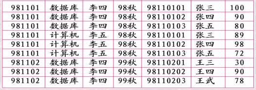
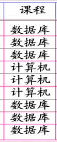
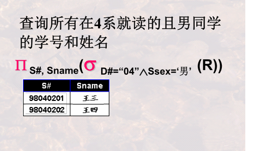

# 初步认识数据库系统

## 什么是数据库？

​		数据库指的就是一堆数据，现在数据库（关系型数据库）中的数据都是表的形式存在的，数据库也就是表的集合。

表的认识

​	表描述一批又相互有关联关系的数据

​	下图为一个表，依次来认识表中的一些概念

 表名

 表的标题（格式）

 表的内容（值）

 行 元组 记录（row tuple record）

 列 /字段属性/ 数据项/（column/filed/attribude/data item）

 列名 

 列值

表名+表标题= 关系模式     表名+表标题+表内容=表/关系

数据库是由相互之间有关联关系的table集合     （表之间也可能有关系，表中元素也可能有关系【一行数据可能是某个人的数据】，）

## 什么是数据库系统？

数据库系统包括五个部分：数据库（Database）、数据库管理系统（DBMS）、数据库应用、数据库管理员、计算机系统

数据库：上面已经详细说过了，就是一堆关系表的集合

数据库管理系统：对数据库也就是对表进行操作的系统软件，比如：mysql 、oracle等等

数据库应用：QQ

计算机操作系统：window Linux

数据库管理员：操作数据库管理系统的管理员（对数据管理系统操作上比一般用户有较大的权限）

## 从用户的角度看数据库管理系统

主要是从数据库角度观察数据库管理系统有哪些功能？

### 数据库定义

定义数据库中Table的名称、标题(内含的属性名称及对该属性的值的要求)等

数据库管理系统提供一套数据定义语言DDL，用户可根据DDL创建数据库及其中的Table

### 数据库操纵

向数据库的Table中增加/删除/更新数据及对数据进行查询、检索、统计等

数据库管理系统提供一套数数据操纵语言(DML:Data Manipulation Language)给用户，用户可使用DML可对数据库进行增删改查

### 数据库控制

 DBMS提供一套数据控制语言(DCL:Data Control Language)给用户（管理员用户）

 管理员通过DCL语言控制数据库中数据的使用---哪些用户（一般用户）可以使用,哪些不可以

### 数据库维护

 转储/恢复/重组/性能监测/分析…

数据库管理系统提供一系列程序，用户可使用这些程序对数据库进行一些维护操作

DDL+DML+DCL=SQL

## 从系统的角度看数据库管理系统

简单描述就是解析语言并执行，来对数据库进行操作

DBMS为完成DB管理，在后台运行着一系列程序

+ 语言编译器：将用数据库语言书写的内容，翻译成DBMS可执行的命令。例如: DDL编译器, DML编译器, DCL编译器等;

+ 查询优化(执行引擎)与查询实现(基本命令的不同执行算法)：提高数据库检索速度的手段；例如贯穿于数据存取各个阶段的优化程序; 

+ 数据存取与索引：提供数据在磁盘、磁带等上的高效存取手段。例如:存储管理器，缓冲区管理器，索引/文件和记录管理器等;

+ 通信控制：提供网络环境下数据库操作与数据传输的手段
+ 事务管理：提供提高可靠性并避免并发操作错误的手段
+ 故障恢复：使数据库自动恢复到故障发生前正确状态的手段，例如提供了备份、运行日志操控等实用程序
+ 安全性控制：提供合法性检验，避免非授权非法用户访问数据库的手段
+ 完整性控制：提供数据及数据操作正确性检查的手段

# 数据库系统的结构抽象与演变

## 数据库系统的标准结构

### 数据库系统的分层抽象

下图为一个数据库系统

根据上图我们从三个层次抽象数据

用户看到的数据

外部层次（用户层次）：某一用户能够看到与处理的数据,   全局数据中的某一部分。

概念层次（逻辑层）：从全局角度理解/管理的数据, 含相应的关联约束

内部层次（概念层）：存储在介质上的数据，含存储路径、存储方式 、索引方式等

### 数据(视图)与模式

两个概念数据（视图）和模式

---模式(Schema) 

对数据库中数据所进行的一种结构性的描述所观察到数据的结构信息。就是描述一下数据，解释一下数据是什么、。下面的语句就可以。（好似一种规则）

---视图/数据

某一种表现形式下表现出来的数据库中的数据。视图是根据模式来展现数据内容。（好似规则执行结果）

### 三级模式两层映像

​		上面从数据的分层看到有三层数据，这是三层数据有不同的视图形式。所以这三层数据也有对应的三层模式。相邻的两个层次之间的都一层映像，通过这层映像来进行数据的映射或者也可以理解为转换。

---三层模式

External Schema   ---- (External) View

​	某一用户能够看到与处理的数据的结构描述

(Conceptual) Schema     ---- Conceptual View

​	从全局角度理解/管理的数据的结构描述, 含相应的关联约束体现在数据之间的内在本质联系

Internal Schema     ---- Internal  View

​	存储在介质上的数据的结构描述，含存储路径、存储方式 、索引方式等

----两层映像

E-C Mapping：External Schema-Conceptual Schema Mapping 
		----将外模式映射为概念模式，从而支持实现数据概念视图向外部视图的转换
		----便于用户观察和使用

C-I Mapping：Conceptual Schema-Internal Schema Mapping 
		----将概念模式映射为内模式，从而支持实现数据概念视图向内部视图的转换
		----便于计算机进行存储和处理

### 数据系统的标准结构

现在我们从全局的角度来看一下

上图是对前面讲的从全局的角度进行了结构化的展示。

### 两个独立性

上面我们全局的角看了一下标准结构，

+ 逻辑数据独立性

  ​	当概念模式变化时，可以不改变外部模式(只需改变E-C Mapping)，从而无需改变应用程序 

+ 物理数据独立性

  ​	当内部模式变化时，可以不改变概念模式(只需改变C-I Mapping) ，从而不改变外部模式

  

  举个例子 不同的数据库管理系统（mysql oracle ）的内部视图（物理层的）是不同的，但是并不影响全局视图

  > 下层模式发生变化相邻的上层模式不许修改，主要修改他们之间的映射就可以

## 什么是数据模型

### 模式和模式的结构（数据模型）

​		模式是数据的结构的抽象，模型是模式的结构的抽象。

+ 数据模型
  +  规定模式统一描述方式的模型，包括：数据结构、操作和约束
  + 数据模型是对模式本身结构的抽象，模式是对数据本身结构形式的抽象

关系模型：所有模式都可为抽象表(Table)的形式[数据结构]，而每一个具体的模式都是拥有不同列名的具体的表。对这种表形式的数据有哪些[操作]和[约束]

### 三大经典数据模型

+ 关系模型： 表 的形式组织数据

+  层次模型： 树 的形式组织数据

+ 网状模型： 图 的形式组织数据

  上面特别容易让人混淆，下面举例来说明

  **关系模型**

  

  **层次模型**

  

**网状模型的例子**

# 关系模型的基本概念

## 关系模型简述

### 关系模型研究什么

一个关系(relation)就是一个Table。

这里的关系要与后面的实体之间的联系做区分，这里的关系指的是数据的结构、层次、含义，有一定的抽象意义。

关系模型就是处理Table的，它由三个部分组成：

+ 描述DB各种数据的基本结构形式(Table/Relation)
+ 描述Table与Table之间所可能发生的各种操作(关系运算)
+  描述这些操作所应遵循的约束条件(完整性约束)

得学习：Table如何描述 有哪些操作 结果是什么 有哪些约束

### 关系模型的三要素

### 关系模型与关系数据库语言的关系

关系运算：关系代数和关系演算；关系演算：元组演算和域演算。

​         

关系代数主要是指集合的运算，操作的对象和结果都是结合，可用数学符号表示

元组演算：基于逻辑的演算  操作的对象是数组

域演算： 操作对象是域，也就是范围

### 为什么要学习关系模型与关系数据库语言

数据管理系统就是从上面的思路来的。  做一些操作（软件的本质）（可以数学描述）------>设计用户可以使用的语言（操作起来得方便顺手）---->最后会根据这些语言把系统开发出来，系统可以使用这些语言。

## 什么是关系

### “表”的基本构成要素

一个关系就是一个表，我们看一下表的具体结构

### “表”的严格定义--关系?

列的取值范围为**域（Domain）**

域可以是：整数的集合、字符串的集合、全体学生的集合、某个学校的全体学生、世间所有的人。

集合中元素的个数称为域的 **基数(Cardinality)**

**元组**就是表的一行

某一个表可能有哪几行是无法说清楚的，但是这个表所有可能的行我们是可以说清楚的：**笛卡尔积。**

一组域`D1, D2,…, Dn`的笛卡尔积为:

`D1×D2×…×Dn= { (d1, d2, … , dn) | di∈Di, i=1,…,n }` 

笛卡尔积的每个元素（含n个小元素）我们称为**n元组**

`(d1, d2, … , dn)`中的每一个di也是**分量**

n元组的个数，也就是笛卡尔积的基数为：m1*m2 * …*m

**关系**：一组域`D1, D2,…, Dn`的笛卡尔积的子集

由于关系的不同列可能来自同一个域，为区分，需要为每一列起一个名字，该名字即为 属性名 。

关系可用`R(A1:D1, A2:D2, … , An:Dn)`表示，可简记为`R(A1, A2, … , An)`，这种描述又被称为 **关系模式 (Schema)或表标题(head)**

A1是属性名 D1为域名R是关系的名字, Ai是属性, Di是属性所对应的域, n是关系的 度 或 目(degree), 关系中元组的数目称为关系的 基数 (Cardinality)

用sql语句描述关系模式

简而言之 蓝的是关系名 黑的是属性名 红的域

**关系模式与关系**

关系模式就是一结构，关系（表）遵循这种结构，

关系模式是稳定的；而关系是某一时刻的值（说明可以增删改查），是随时间可能变化的。

### 关系的特性

属性不可再分特性:又被称为关系第一范式

复合属性两种方法：只要name 或者只要Iname 和fname

多值属性：只能要cno major

还有一种情况

### 候选码/候选键

**候选码**：关系中的一个属性组，其值能唯一标识一个元组，若从该属性组中去掉任何一个属性，它就不具有这一性质了，这样的属性组称作候选码。

学生(S#, Sname, Sage, Sclass)”，S#（学号）就是一个候选码

选课(S#, C#, Sname, Cname, Grade)  (S#,C#)联合起来是一个候选码

(S#, Sname, Sage, Sclass, Saddress)  S#是候选码，属性组(Sname, Saddress)也是候选码

### 主码/主键

当有多个候选码时，可以选定一个作为**主码**。

DBMS以主码为主要线索管理关系中的各个元组。

### 主属性与非主属性

包含在任何一个候选码中的属性被称作主属性，而其他属性被称作**非主属性**

所有属性构成这个关系的候选码，称为**全码(All-Key)**。

### 外码(Foreign Key)/外键

关系R中的一个属性组，它不是R的候选码，但它与另一个关系S的候选码相对应，则称这个属性组为R的 外码 或 **外键**

## 关系模型的完整性

也就是前面讲的关系完整性约束规则

### 实体完整性

 关系的主码中的属性值不能为空值；

 空值：不知道或无意义的值；

### 参照完整性

外键，要么是空值，要么是在它放主键表里面的所对应含有的值

### 用户自定义完整性

 用户针对具体的应用环境定义的完整性约束条件

取值别超过定义的域。

### 总结

# 关系模型之关系代数

## 关系代数概述

+ 基于集合，提供了一系列的关系代数操作：并、差、笛卡尔积(广义积)、选择、投影和更名等基本操作。

+ 关系(表)可以看作元组的集合。所以集合的一些操作也可以应用在关系上。

+ 关系基于自身的特点也扩展出一些操作

+ 关系代数操作以一个或多个关系为输入，结果是一个新的关系。

数学表达

## 关系代数之基本操作

### 关系代数运算的约束

某些关系代数操作，如并、差、交等，需满足“并相容性”

### **并相容性**

参与运算的两个关系及其相关属性之间有一定的对应性、可比性或意义关联性

 定义：关系R与关系S存在相容性

(1) 关系R和关系S的属性数目必须相同；
(2) 对于任意i，关系R的第i个属性的域必须和关系S的第i个属性的域相同

数学描述： RUS ={ t | t∈R V t∈S } ，其中t是元组   

R ∪S 与 S ∪R 运算的结果是同一个关系。

###  **“差”操作** 

### **广义笛卡尔积 (Cartesian Product)**

 R x S, 它由关系R中的元组与关系S的元组进行所有可能的拼接(或串接)构成。

### “选择”操作

 定义：给定一个关系R, 同时给定一个选择的条件condition(简记con), 选择运算结果也是一个关系，记作 con con (R) (R) , 它从关系R中选择出满足给定条件
condition的元组构成

，

在书写数学描述的时候，先写关系R,接下来写 选择操作符然后再写条件 A3>0

**操作符的优先顺序**

在写条件的时候 会运用到运算操作符，操作符之间有优先级，就像加减乘除

上面的图两个语句代表不同的涵义

###  “投影”操作

 定义：给定一个关系R, 投影运算结果也是一个关系，记作  A (R) (R) , 它从
关系R中选出属性包含在A中的列构成。

>  **投影操作从给定关系中选出某些列组成新的关系, 而选择操作是从给定关系中选出某些行组成新的关系**

直接看下图去理解

 **投影与选择操作一起使用的示例**

## IDEF1x建模之案例讲解

需要的时候再看

