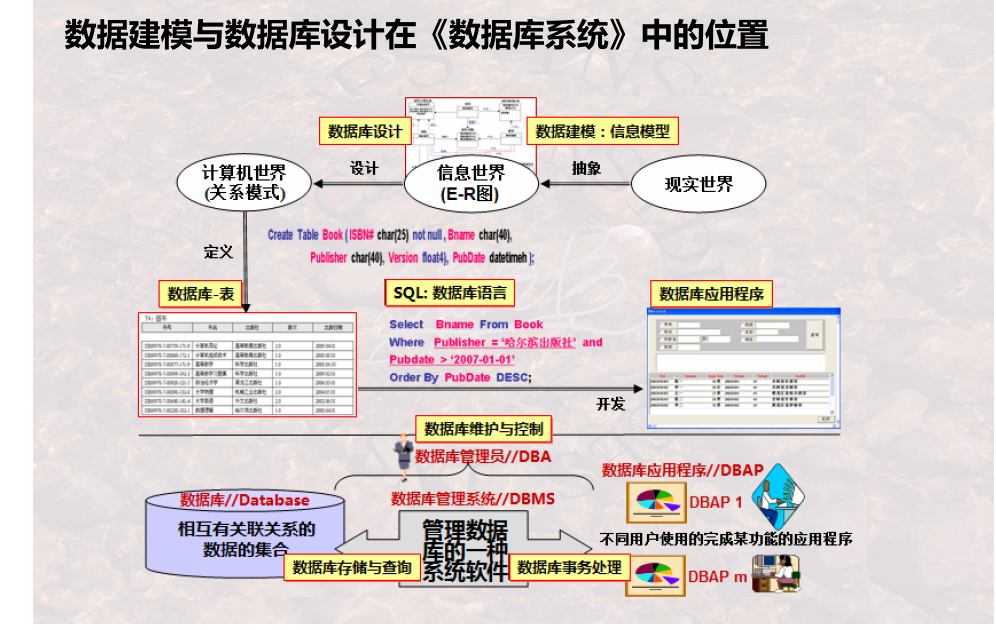
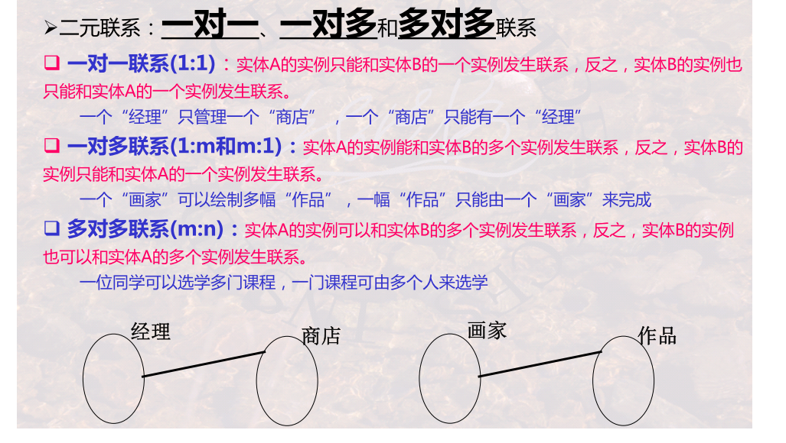
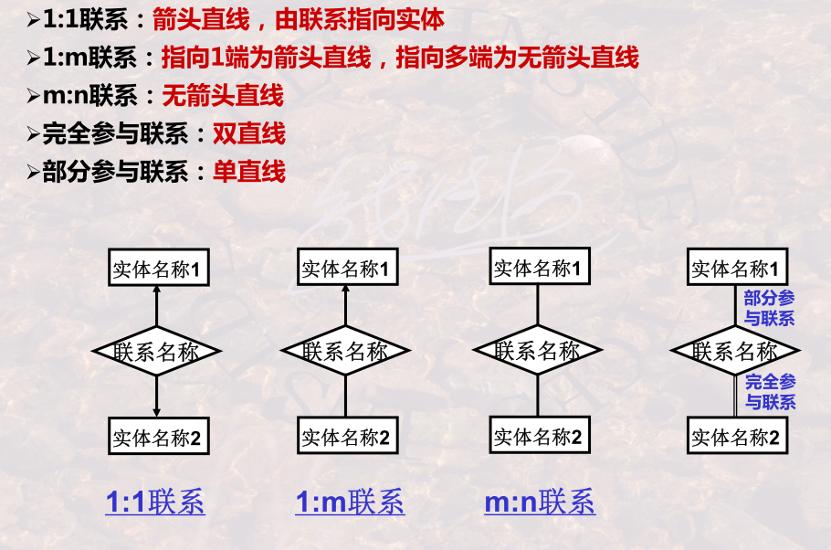
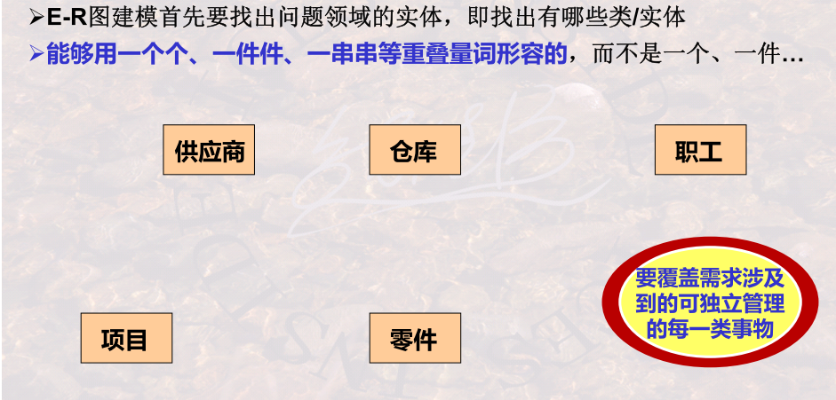
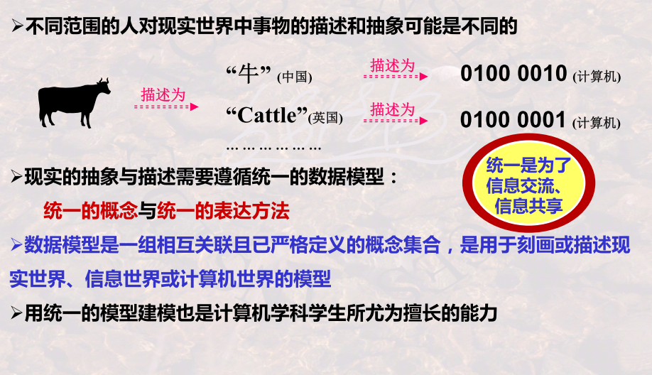

主要讲的内容是，怎么设计数据库

上图中 从现实世界到数据库的表就是主要讲的内容

# 思想和方法

## 为什么要数据建模与数据库设计

### 为什么要数据建模与数据库设计

看上面的图，如果不能理解用户的需求就是设计不好软件导致产品的开发失败。理解最好就是预判用户的需求从而超出用户的期望获得产品开发的成功

对于需求的理解大部分是对数据的理解和数据的关系的理解，所以需求理解到位就数据库的设计的越优秀

### 数据模型与概念模型

​	表达计算机世界的模型称**数据模型**；表达信息世界的模型称概念数据模型，
简称**概念模型**，信息世界是对现实世界的理解与抽象

## 怎么抽象

抽象的前提是对现实世界的理解。怎么样才算理解？--》区分（上图已经介绍）--》怎么样才算区分---》民命   

## 什么是E-R模型

### E-R模型首先是一种数据建模的思想

> **世界是由一组称作实体实体的基本对象和这些对象之间的联系联系构成的**

### E-R模型的基本概念

**实体**
**属性**
**联系**
**关键字/码**

### 实体是什么?实体与实例的差别是什么

 实体：客观存在并可相互区分的事物

实例:具体的实例

实体:学生  实例:五年级三班的小明

### 怎样刻画实体呢?

**实体用属性来刻画**

属性 ，实体所具有的某一方面特性

### 关键字有什么用呢? 

**关键字/码** ，实体中能够用其值唯一区分开每一实例的属性或属性组合

**这是特殊并关键的属性，每一实体都必须给出关键字**

### 实体之间充满了联系

联系 ，指一个实体的实例和其他实体实例之间所可能发生的联系

如，哪位《读者》借阅了哪本《图书》，哪本《图书》放在哪个《书架》上

### 有什么样的联系需要区分呢? 

参与发生联系的实体的数目，称为联系的 度 或 元 。

联系有一元联系、二元联系和多元联系

实体之间的联系有很多种类

二元联系： 一对一 、 一对多 和 多对多 联系

多对多联系需要重新增加一个关系表。

上面粉红色箭头代表部分参与联系，就是可以在联系中里面可以为空值。绿色箭头代表完全参与联系，在联系表里面不可以为空值，必须有值

## ER模型-表达方法之chen方法

### Chen方法的基本图元及其含义

上面是ER图中的一些图形形式的含义，有助于后面学习与理解

### Chen方法中不同“联系”的区分方法

上面是一种表示方法，其实还有下图的一种表示方法

## E-R模型-建模案例讲解(chen方法)

仓储管理的E-R Diagram

需求理解：

+  管理零件
+  管理零件的来源—哪些零件来自于哪些供应商
+ 管理零件的去向—哪个零件供应给哪一个项目使用
+ 管理多个仓库---哪个零件存在哪个仓库中
+ 管理职工---哪个职工管理哪个仓库

五步解决来画出一个完整的ER图

**Step1  理解需求，寻找实体**

**Step2 用属性刻画每一个实体**

**Step3 确定每一个实体的关键字 / 码**

**Step4 数据建模的重点是分析实体之间的联系**

**Step4 数据建模的重点是分析实体之间的联系**

**Step5 检查是否覆盖了需求**

## E-R模型表达方法之Crow’s foot方法

暂时不学

## 数据库设计中的抽象

### 如何看待信息

对现实中的一些事物信息进行抽象，

认真分析，过滤出有用的信息，放弃一些没有用的信息

### 三个世界?

显示世界--》概念世界--》计算机世界

### “型”与“值”?

型就是对一系列值的抽象。

我们还可以对型进行再次抽象，比如上面的型还可以向上抽象一层型-----属性

所以我们在抽象的过程中可能抽象多次，到达我们最终需要的型

### 不同层次的“型”与“值”?

这种对值进行抽象的思维模式在有很多，上图陈述在不同的领域内的名称，其实内核就是对具体的进行抽象

### 不同层次的抽象

通过这种抽象--还原的方法来验证自己抽象的正确性，不断修正自己的抽象来尽力达到合理的抽象

### 数据模型及其作用(????)

> **数据模型是一组相互关联且已严格定义的概念集合，是用于刻画或描述现实世界、信息世界或计算机世界的模型**

表达计算机世界的模型称**数据模型**；表达信息世界的模型称**概念数据模型**，简称**概念模型**，信息世界是对现实世界的理解与抽象

模型我认为就是那些ER图

### 抽象层次?(???)

### )建模层次?

现实-----（抽象）--->模型-----（抽象）--->元模型(也可以说是模型的模型)-----（抽象）--->MOF

判断理解：是否区分概念

判断区分：是否可以命名

最后在表达出来，语句 表达式

### 小结

+ 用ER图表达现实世界就是建模
+ ER图的建模步骤（四步骤）
+ 要清楚联系中那些概念

# 工程化方法及案例

## IDEF1x概述

IDEF1x是一种比`chen`方法更加详细的ER图便表示方法

是一种进行数据建模或数据库设计的工程化的方法

起源于美国航空

### IDEF1x对E-R图概念的细分

把实体 联系 属性 做了更加详细的划分

### 示例

## IDEF1x-两种实体的区分

 

实体分为独立实体和从属实体

### 独立实体

我不依靠外来的属性来标识我自己，标识我自己的都是我自身所带属性

上图用**直角**的这种图形来表示这种独立实体，图形的上半部分用来放主关键字

一个关键字可以是一个属性，也可以是多个属性

### 从属实体

需要从其他的实体来继承一些属性来标识自己，独立实体不用去继承其，他实体来标识自己，自己就能都标识自己

用上图的**圆角**图形来标识从属实体，FK标识关键字是继承其他实体的关键字

### 一些规则

### 关于属性和关键字

姓名+生日构成次关键字，也是候选键

### 关于外码-外来关键字

## IDEF1x的标定联系与非标定联系

### IDEF1x的联系分类

子实体上面提到过 是存在外来关键字的

实体之间是存在联系的，有一种关系是连接关系

### 标定联系

>  **标定联系 ：子实体的实例都是由它与父实体的联系而确定。父实体的主关键字是子实体主关键字的一部分**

联系由上面的实线画出，带圆圈的那一端称为多端

### 非标定联系

> 非标定联系 ：子实体的实例能够被唯一标识而无需依赖与其实体的联系。父实体的主关键字不是子实体的主关键字。

## IDEF1x的不确定联系

### 什么是非确定性联系?

**非确定联系 ：即实体之间的多对多的联系**

**非确定联系必须分解为若干个一对多的联系来表达**

因为上面的表达不被允许，所以我们需要引入一个实体来像上面那些确定联系来表示

**这个实体就叫做相交实体,其实也就是chen方法表达的关系**

### 怎样处理非确定联系?

### IDEF1x对联系的两种处理机制

上图的蓝字很重要，便于理解IDEF1x对**联系**的表达。在这个IDEF1x表达中实体之间的联系，不再像chen方法的用一个图形来表示，而是用线来表示，当遇见多对多就会生成一个相交实体来表示这种关系。在某种层面上说，有几个实体就会建几个表。

### )一些规则

## IDEF1x的分类联系

### 分类联系

分类联系 ：一个实体实例是由一个一般实体实例及多个分类实体实例构成的

零件相当于对自制件和外购件的抽象，自制件和外购件也是对具体实例的抽象

### 泛化与具体化

**具体化(Specialization)**

在银行账号的实例里面我们根据一些特性 分为存款账号和贷款账号，这个过程就是对银行账号的具体化，在某些情况下这个具体化的基础上我们还可以向下进行具体化，比如下面的学生具体化--》研究生具体化--》硕士

**泛化(Generalization)**

与上面具体化是一个相反过程中。

ER图表示具体化和泛化

Crow's foot表达分类联系的符号

**属性继承**

### 完全分类联系与非完全分类联系

自制件和外购件是零件的全集就是完全分类联系标识。

产品和零件就不是零部件的全集就是非完全分类联系标识

### 一些规则

分类联系和分类要区分好。

