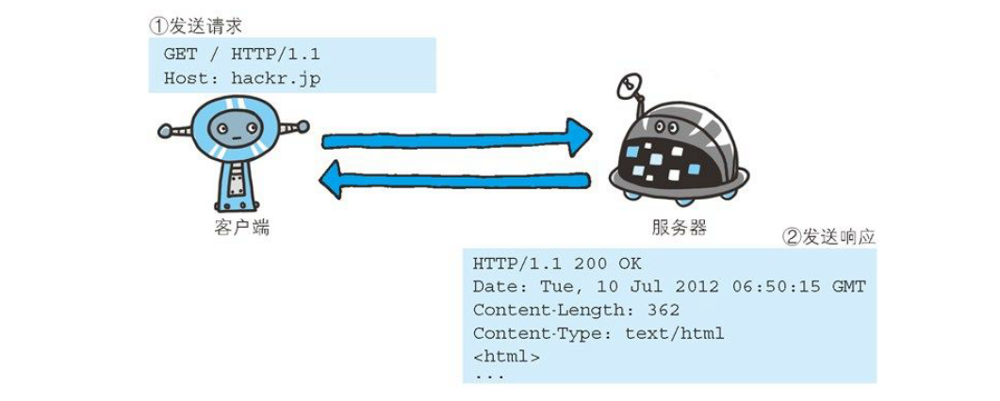
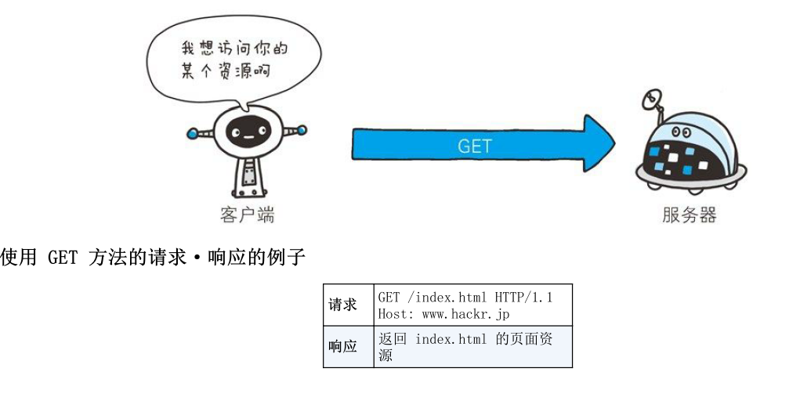
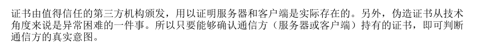

# 第二章 简单的HTTP协议

## 2.1 HTTP 客户端与服务端通信的协议（规则、算法）

请求、访问文本或图像等资源的一段称之为客户端，而提供资源称之为服务端。

角色在某一时刻可能发生互换。

发生一次通信都是一来一回，起初发送的一方，发送就是请求（Request），另一方回复请求而发送的内容就是响应（Response）

来从上面的信息，观察一下它们是怎么交流的，请求的一方中的Get为请求的方法（Method），也可以称之为访问服务器的类型。

/index.html,是要访问的资源对象，也叫URI（request-URI），后面的HTTP/1.1为HTTP的版本号。

从上面可以看出一个请求的组成：请求方法+请求URI+协议版本+首部字段（可选）+内容实体

下面我们在简单了解一下响应

首先看到协议版本，然后200为协议状态码（status code）和后面的原因短语(reason-phrase)。在下面为响应的创建日期是首部字段属性。

组成：协议版本+状态码+原因短语+可选的响应首部字段+实体主体 。上面分为三个部分。

## 2.3 HTTP是不保存状态的协议

协议本身不对大宋的请求响应不错持久化处理。Cookie技术的引入增加了保存状态这一功能。

## 2.4 请求URI定位资源。

URI可以定位互联网上的资源，所以URI可以找到任何唯一资源

在请求中不同写入方式

对服务器发送请求，不是对特定资源

## 2.5 告知服务器意图的HTTP方法

**GET：获取资源**

**POST：传输实体主体**

Get方法也能传输实体主体，但是一般使用Post去传输

PUT：传输文件

DELETE：删除文件

于PUT方法相反，DELETE主要是按照指定的URI删除指定资源

**OPTION：询问支持的方法**

CONNECT：要用隧道协议建立连接

## 2.6 使用方法下达命令

方法名支持大小写

## 2.7 持久连接节省通信量

HTTP的初始版本里面中，每进行一次HTTP通信就要断开一次TCP连接

### 2.7.1 持久连接

只要任意一端没有明确提出断开连接，则保持TCP连接状态

### 2.7.2 管线化

可以一次性发送多个请求不用一个一个发送了

## 2.8 使用Cookie进行状态管理

**请求行**：

请求的方法，请求的URI和HTTP版本

**状态行**

包含响应结果的状态码、原因短语和HTTP版本

**首部字段**

通用首部、请求首部、响应首部和实体首部

**其他**

HTTP的RFC里未定义的首部（Cookie等）

## 3.3 编码提升传输效率

通过压缩传输数据来提升传输速率。编码需要消耗更多的CPU资源来完成

### 3.3.1 报文主体和实体主体的差异

+ 报文（message）

  是HTTP通信中的基本单位，由字节流组成，通过HTTP通信传输

+ 实体（entity）

  由实体首部（在请求头或者响应头）和实体主体（在请求体或者响应体）组成

### 3.3.2 压缩传输的内容的编码

都有什么 压缩编码

+ gzip（GUN zip）
+ compress （UNIX 系统的标准压缩）
+ deflate(zlib)
+ identity(不进行编码)

### 3.3.3 分割发送的分块传输编码

## 3.4 发送多种数据的多部分对象的集合

HTTP传输也支持多种类型

举例

当使用多部份对象要在首部告诉内容类型，Content-type

多部分对应有专门的字符作为分界线，例如（--AaB03x、--THIS STRING_SEPARATES--）

## 3.5 获取部分内容的范围请求

以前网速慢、带宽小，请求大文件吃力而且容易中断只能从头下载，所以只能一部分一部分请求。

## 3.6 内容协商返回最合适的内容

内容协商就是客户端和服务端就响应的资源进行交涉，然后提供给客户端最为合适的资源。

协商的内容包括资源的语言、字符集、编码方式等内容

+ Aceept
+ Accept-Charset
+ Accept-Encoding
+ Accept-Language
+ Content-language

这些协商的内容一版会在首部字段中（头部字段）

内容协商技术有以下三种

+ 服务器驱动协商

由服务器端内容进行协商，以请求的首部字段为参考，在服务端自动处理。对用户来说，以浏览器发送的信息作为判断依据，并不一定能筛选出最优内容，（客户端说了不算）

+ 客户端驱动协商

  客户端说了算

+ 透明协商

  各自进行内容协商，都有点权力吧

# 第四章 返回结果的HTTP状态码

通过状态啊来告诉服务端的处理结果

## 4.1 状态码告知从服务器端返回的请求结果

## 4.2 2xx成功

2xx 的响应结果，表明请求被正常处理了

### 4.2.1 200 OK

在响应报文内，随状态码一起返回的信息会因方法不同而发生改变。例如： GET 方法对应请求的资源会返回，HEAD不会把请求的资源实体返回（即 在响应中只返回首部，不会返回实体的主体部分）

### 4.2.2 204 No Content

# 第五章

# 第六章 HTTP首部

HTTP协议的请求和响应报文中必定包含HTTP首部

## 6.1 HTTP 报文首部

# 第七章 确保WEB的安全

## 7.1 HTTP的缺点

+ 通信使用明文（不加密），内容可能会被窃听
+ 不验证通信方的身份，因此有能遭遇伪装
+ 无法证明报文的完整性，所以有可能造成篡改

### 7.1.1 通信使用明文，可能会被窃听

+ TCP/IP 是可能会被窃听的

+ 加密处理防止被窃听

  + 通信的加密

    HTTP没有加密机制，但是可以通过SSL或者TLS组合使用进行加密。加密HTTP的通信内容

    用SSL家里安全链路之后，就可以在这条链路上进行通信了  这两个组合起来被称之为HTTPS

    

  + 内容的加密

这种方式内容有被篡改的风险

### 7.1.2 不验证通信方和身份就可能遭遇伪装

+ 任何人都可以发起请求

+ 查明对手的证书

  如果HTTP使用SSL的话，SSL不仅可以提供加密处理，而且还有一种证书的手段来确认对方的身份

### 7.1.3 无法证明报文的完整性，可能已经造成篡改

+ 接收到的内容可能有误

  HTTP并不能保证报文是否有没有被别人篡改过

如果在线交易被 别人篡改了消息，那就麻烦可能会打入到其他人的账户。

+ 如何防止篡改

  在HTTP中使用md5 SHA-1虽然可以大大提升保护，但是它们本身也有可能被修改，所以他们并不是特别安全的。

  关键还得使用SSL 来保证，下面详细讲到

## 7.2 HTTP+加密+认证+完整性保护=HTTPS

### 7.2.1 HTTPS

进行HTTPS访问时

