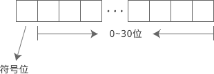
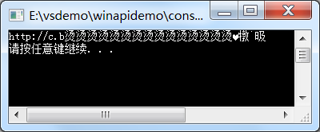

****所有语言的都只是一种中间工具**，它们最终都会变为计算机所认识的指令被CPU所执行。**


# 1 C 语言初探

```c
#include <stdio.h>

int main() {
    printf("Hello, World!\n");
    return 0;
}
```

分析一下上面的程序

C语言规定，一个程序必须有且只有一个main函数，main是程序的入口函数，程序从main函数开始，也从main函数结束。

**头文件：**

C语言开发者们编写了很多常用函数，并分门别类的放在了不同的文件，这些文件就称为头文件（header file）。每个头文件中都包含了若干个功能类似的函数，调用某个函数时，要引入对应的头文件，否则编译器找不到函数。

引入头文件使用`#include`命令，并将文件名放在`< >`中，#include 和 < > 之间可以有空格，也可以没有。

头文件以`.h`为后缀，而C语言代码文件以`.c`为后缀，它们都是文本文件，没有本质上的区别，#include 命令的作用也仅仅是将头文件中的文本复制到当前文件，然后和当前文件一起编译

`.h`中代码的语法规则和`.c`中是一样的，你也可以#include <xxx.c>，这是完全正确的。不过实际开发中没有人会这样做，这样看起来非常不专业，也不规范。

```c
#include <stdio.h>
#include <windows.h>
int main(){
    HANDLE hConsole = GetStdHandle(STD_OUTPUT_HANDLE);
    SetConsoleTextAttribute(hConsole, 0xC );
    puts("红色文字");
    SetConsoleTextAttribute(hConsole, 0xF );
    puts("白色文字");
    SetConsoleTextAttribute(hConsole, 2 );
    puts("淡绿色文字");
    return 0;
}
```


# 第二章 C语言变量和数据类型


## 2.1 C语言变量和数据类型

**变量（Variable）**

```c
int a;
```

这句话的意思是在内存中找一块区域，命名为a,用它来存放整数

```c
a=123
```

在a这块内存中写入123数值。 重复赋值就会把之前的覆盖掉


**数据类型（Data Type）**


数字、文字、视频信息、图片信息等都会以二进制的形式存储在内存中，没有本质区别。这些数据看起来都是一样的，我们在使用的时候就必须要指明数据是什么类型的。上面的int就是一个数据类型。顾名思义，数据类型用来说明数据的类型，确定了数据的解释方式，让计算机和程序员不会产生歧义。


| 说  明   | 字符型 | 短整型 | 整型 | 长整型 | 单精度浮点型 | 双精度浮点型 | 无类型 |
| -------- | ------ | ------ | ---- | ------ | ------------ | ------------ | ------ |
| 数据类型 | char   | short  | int  | long   | float        | double       | void   |

```c
int a, b, c;
```

逗号分隔，可以连续声明。

**数据的长度（Length）**

数据长度指的是数据占了多少个字节（一个字节8bit）。

在32位系统的情况下，C语言中的数据类型分别的所占的长度

| 说  明   | 字符型 | 短整型 | 整型 | 长整型 | 单精度浮点型 | 双精度浮点型 |
| -------- | ------ | ------ | ---- | ------ | ------------ | ------------ |
| 数据类型 | char   | short  | int  | long   | float        | double       |
| 长  度   | 1      | 2      | 4    | 4      | 4            | 8            |


## 2.2 在屏幕上输出各种类型的数据

`puts` 是 output string的缩写，只能用来输出字符串

` printf `是很强大的函数，可以输出多种数据类型的数据而且可以自定义输出格式


```c
int abc=999;
printf("%d", abc);
```

`%d` 会以十进制形式输出 ，用abc的十进制替换%d，然后输出


## 2.3 C语言中的整数（short int long）

> 一种数据类型占用的字节数，称为该数据类型的长度。例如，short 占用 2 个字节的内存，那么它的长度就是 2。


C语言并没有严格规定 short、int、long 的长度，只做了宽泛的限制：

- short 至少占用 2 个字节。
- int 建议为一个机器字长。32 位环境下机器字长为 4 字节，64 位环境下机器字长为 8 字节。
- short 的长度不能大于 int，long 的长度不能小于 int。


在 64 位环境下，不同的操作系统会有不同的结果，如下所示：

| 操作系统                                                | short | int  | long |
| ------------------------------------------------------- | ----- | ---- | ---- |
| Win64（64位 Windows）                                   | 2     | 4    | 4    |
| 类Unix系统（包括 Unix、Linux、Mac OS、BSD、Solaris 等） | 2     | 4    | 8    |

**sizeof 操作符**

来获取数据类型的长度（以字节为单位）

sizeof不是函数而是C语言操作符,可以不带（）

```c
#include <stdio.h>
int main()
{
    short a = 10;
    int b = 100;
   
    int short_length = sizeof a;
    int int_length = sizeof(b);
    int long_length = sizeof(long);
    int char_length = sizeof(char);
   
    printf("short=%d, int=%d, long=%d, char=%d\n", short_length, int_length, long_length, char_length);
   
    return 0;
}
```

在 32 位环境以及 Win64 环境下的运行结果为：

```text
short=2, int=4, long=4, char=1
```

在 64 位 Linux 和 Mac OS 下的运行结果为：

```text
short=2, int=4, long=8, char=1
```

## 2.4 C 语言中的二进制、八进制和十六进制

**1）二进制**

以`0B`或`0b`开头

```c
int a = 0b101;  //换算成十进制为 5
int b = -0b110010;  //换算成十进制为 -50
//非法的二进制
int n = 0B410;  //4不是有效的二进制数字
```

标准的C语言并不支持上面的二进制写法，只是有些编译器自己进行了扩展，才支持二进制数字。换句话说，并不是所有的编译器都支持二进制数字2) 八进制

**1)八进制**

由 0~7 八个数字组成，使用时必须以`0`开头（注意是数字 0，不是字母 o），例如：，只有一部分编译器支持，并且跟编译器的版本有关系。

```c
int a = 015;  //换算成十进制为 13
int b = -0101;  //换算成十进制为 -65
```

**3) 十六进制**

十六进制由数字 0~9、字母 A~F 或 a~f（不区分大小写）组成，使用时必须以`0x`或`0X`（不区分大小写）开头，例如：

```c
int a = 0X2A;  //换算成十进制为 42
int b = -0XA0;  //换算成十进制为 -160
```


print函数支持数据以不同进制输出显示

|          | short        | int        | long         |
| -------- | ------------ | ---------- | ------------ |
| 八进制   | %ho          | %o         | %lo          |
| 十进制   | %hd          | %d         | %ld          |
| 十六进制 | %hx 或者 %hX | %x 或者 %X | %lx 或者 %lX |

- %hx、%x 和 %lx 中的`x`小写，表明以小写字母的形式输出十六进制数；

- %hx、%x 和 %lx 中的`x`小写，表明以小写字母的形式输出十六进制数；


输出增加前缀 %后面加上一个#.

```c
#include <stdio.h>
int main()
{
    short a = 0b1010110;  //二进制数字
    int b = 02713;  //八进制数字
    long c = 0X1DAB83;  //十六进制数字
   
    printf("a=%#ho, b=%#o, c=%#lo\n", a, b, c);  //以八进制形似输出
    printf("a=%hd, b=%d, c=%ld\n", a, b, c);  //以十进制形式输出
    printf("a=%#hx, b=%#x, c=%#lx\n", a, b, c);  //以十六进制形式输出（字母小写）
    printf("a=%#hX, b=%#X, c=%#lX\n", a, b, c);  //以十六进制形式输出（字母大写）
   
    return 0;
}
```

```text
a=0126, b=02713, c=07325603
a=86, b=1483, c=1944451
a=0x56, b=0x5cb, c=0x1dab83
a=0X56, b=0X5CB, c=0X1DAB83
```

## 2.5 C语言正负数输出

short、int、long 在C语言中都可以带上正负号，来表示数字的正负。C语言规定，把内存的最高位作为符号位



如果不希望设置符号位，可以在数据类型前面加上 **unsigned** 关键字，例如：

```c
unsigned short a = 12;
unsigned int b = 1002;
unsigned long c = 9892320;
```

如果没有符号位，取值范围更大了，是以前两倍。

如果是`unsigned int`类型，那么可以省略 int ，只写 unsigned，

```c
unsigned n = 100;// 和unsigned int n = 100;一样
```

以不同进制的形式输出时对应的格式控制符（`--`表示没有对应的格式控制符）。

|          | short | int  | long | unsigned short | unsigned int | unsigned long |
| -------- | ----- | ---- | ---- | -------------- | ------------ | ------------- |
| 八进制   | --    | --   | --   | %ho            | %o           | %lo           |
| 十进制   | %hd   | %d   | %ld  | %hu            | %u           | %lu           |
| 十六进制 | --    | --   | --   | %hx 或者 %hX   | %x 或者 %X   | %lx 或者 %lX  |

## 2.8 C语言中的小数

两种书写方式，一个是一般的书写方式1.234，另一种是指数的书写方式

```c
aEn 或 aen
```

- 2.1E5 = 2.1×105，其中 2.1 是尾数，5 是指数。
- 3.7E-2 = 3.7×10-2，其中 3.7 是尾数，-2 是指数。
- 0.5E7 = 0.5×107，其中 0.5 是尾数，7 是指数。

小数有两种类型 double float,float始终占4个字节，double占8字节。任何情况下都是这样的。

**小数的输出**

 

**数字的后缀**

直接写在代码里面的数字也有默认类型，对于整数默认是 int 类型；对于小数，默认是 double 类型

```c
long a = 100; //int -->long
int b = 294; //不做转化
float x = 52.55; //double--->double
double y = 18.6; //不做转化
```

- 在整数后面紧跟 l 或者 L（不区分大小写）表明该数字是 long 类型；
- 在小数后面紧跟 f 或者 F（不区分大小写）表明该数字是 float 类型。

**小数和整数相互赋值**

可能丢失精度

## 2.9小数在内存中是如何存储


## 2.10 C语言中使用英文字符

字符串十多个字符的集合，`""`来表示，`"hello the world"` 。字符串在内存中，按照顺序，紧挨排列。


char 只能存储 ASCII中的字符

**字符的表示**

```c
//错误的写法
char x = '中';  //char 类型不能包含 ASCII 编码之外的字符
char y = 'Ａ';  // Ａ是一个全角字符 Ａ（全角）A（半角）  
char z = "t";  //字符类型应该由单引号包围
```


**字符与整数**

​		所有数据在计算机中都是以二进制进行存储，字符也不例外。所以我么可以将一个整数赋值给字符，可以以字符的形式输出。字符的 ASCII 码为整数。同样也可以将字符赋值给整数，实际上就会把这个字符代表的ASCII码值了整数。


```c
	char a = 'E';
    char b = 70;
    int c = 71;
    int d = 'H';
    printf("a: %c, %d\n", a, a);
    printf("b: %c, %d\n", b, b);
    printf("c: %c, %d\n", c, c);
    printf("d: %c, %d\n", d, d);
```


```text
a: E, 69
b: F, 70
c: G, 71
d: H, 72
```


**字符串**

C语言中没有专门存储字符串的类型，只能利用字符数组或者指针来存字符串

```c
char str1[] = "http://c.biancheng.net";
char *str2 = "C语言中文网";
```

打印：

```c
 puts(str1);
 puts(str2);
 printf("%s\n%s\n", str1, str2);
```

## 2.11 在C语言中使用中文字符

**存储中文字符**

**----1) 足够长的数据类型**

怎么才能存储中文字符呢，因为中文字符较多，必须要与足够字节足够长数据类型才能把所有的汉字代表全。

<font color='red'>**一个字符在存储之前会转换成它在字符集中的编号**</font>。我们可以用一个整型来存储这个编号，这样我们就可以做到汉字的存储了

**----2）选择包含中文的字符集，用基本类型来存储码值遇见的问题--->引出宽字符**

我们肯定得选择一个包含中文的字符集。

+ 常见字符集以及存储所需长度

  ​	常见的宽字符编码有 UTF-16 （两个字节存储一个字符）和 UTF-32（4个字节存储一个字符），它们都是基于 Unicode 字符集的，能够支持全球的语言文化。

+ 用基本类型来存储

  因为一些类型在不同编译器下容量是不同的，，不同的编译器可以使用不同的整数类型。如果我们的代码使用 unsigned int 来存储宽字符，那么在微软编译器下就是一种浪费；如果我们的代码使用 unsigned short 来存储宽字符，那么在 GCC、LLVM/Clang 下就不够。

+ 解决内存浪费引出新的类型

     为了解决这个问题，C语言有一种新的类型 wchar_t   w--wide t--type -->宽字符类型（wchar_t 其实是用 typedef 定义的一个别名）

  wchar_t 类型位于 <wchar.h> 头文件中，它使得代码在具有良好移植性的同时，也节省了不少内存，以后我们就用它来存储宽字符。

  加上`L`前缀后，所有的字符都将成为宽字符，占用 2 个字节或者 4 个字节的内存，包括 ASCII 中的英文字符。

```c
wchar_t a = L'A';  //英文字符（基本拉丁字符）
wchar_t b = L'9';  //英文数字（阿拉伯数字）
wchar_t c = L'中';  //中文汉字
wchar_t d = L'国';  //中文汉字
wchar_t e = L'。';  //中文标点
wchar_t f = L'ヅ';  //日文片假名
wchar_t g = L'♥';  //特殊符号
wchar_t h = L'༄';  //藏文
```


**宽字符的输出**

putchar、printf 不能输出宽字符。wchar.h提供输出方法。在输出之前还需要做一些本地化设置（暂不解释）。```

```c
#include <wchar.h>
#include <locale.h>
int main(){
    wchar_t a = L'A';  //英文字符（基本拉丁字符）
    wchar_t b = L'9';  //英文数字（阿拉伯数字）
    wchar_t c = L'中';  //中文汉字
    wchar_t d = L'国';  //中文汉字
    wchar_t e = L'。';  //中文标点
    wchar_t f = L'ヅ';  //日文片假名
    wchar_t g = L'♥';  //特殊符号
    wchar_t h = L'༄';  //藏文
   
    //将本地环境设置为简体中文
    setlocale(LC_ALL, "zh_CN");
    //使用专门的 putwchar 输出宽字符
    putwchar(a);  putwchar(b);  putwchar(c);  putwchar(d);
    putwchar(e);  putwchar(f);  putwchar(g);  putwchar(h);
    putwchar(L'\n');  //只能使用宽字符
   
    //使用通用的 wprintf 输出宽字符
    wprintf(
        L"Wide chars: %lc %lc %lc %lc %lc %lc %lc %lc\n",  //必须使用宽字符串
        a, b, c, d, e, f, g, h
    );
   
   
    return 0;
}
```

```text
A9中国。ヅ♥༄
Wide chars: A 9 中 国 。 ヅ ♥ ༄
```

**宽字符串**

​		给字符串加上`L`前缀就变成了宽字符串，它包含的每个字符都是宽字符，一律采用 UTF-16 或者 UTF-32 编码。输出宽字符串可以使用 <wchar.h> 头文件中的 wprintf 函数，对应的格式控制符是`%ls`。

```c
#include <wchar.h>
#include <locale.h>
int main(){
    wchar_t web_url[] = L"http://c.biancheng.net";
    wchar_t *web_name = L"C语言中文网";
   
    //将本地环境设置为简体中文
    setlocale(LC_ALL, "zh_CN");
    //使用通用的 wprintf 输出宽字符
    wprintf(L"web_url: %ls \nweb_name: %ls\n", web_url, web_name);
    return 0;
}
```

```text
web_url: http://c.biancheng.net
web_name: C语言中文网
```


## 2.12 C语言到底使用什么编码？

C语言中的字符采用什么编码集？

```c
#include <stdio.h>
int main()
{
    char *a="你好吗";
    printf("%s",a);
    return 0;
}
```

```text
你好吗
```

​	c语言的char可能不代表一个字符，char 可以根据本地的系统来使用不同的编码集 。比如根据你本地的环境来使用UTF-8编码.

这时一个char就能代表一个字符了。起码得两个char

**源文件使用什么编码**

​		首先我们的初始的代码以源文件形存在的，就是一堆文件。能显示就使用编码，编译器需要识别不同编码的文件来进行翻译，翻译成二进制计算机能都够识别的指令，所以编译器必须支持多种编码格式的源文件来进行编译。

**指令中的编码**

​		文件的编码，和C语言运行的时候字符的编码是两种不同的。'a',就那这个字符a来说吧，他在文件中的编码和在c语言中运行的时候的编码可能是不同的。**文件的编码和c语言（指令运行）使用的编码不同，可以做好相互转换吗 ？(待探究)**

**总结**


+ 对于 char 类型的窄字符，始终使用 ASCII 编码。

  ```c
  char a='a'
  ```

  

+ 对于 wchar_t 类型的宽字符和宽字符串，使用 UTF-16 或者 UTF-32 编码，它们都是基于 Unicode 字符集的。

+ 对于 char 类型的窄字符串，微软编译器使用本地编码，GCC、LLVM/Clang 使用和源文件编码相同的编码。

  ```c
  char *a="我爱你"
      
  ```

  

**编码字符集和运行字符集**

源文件使用的字符集被称为编码字符集，也就是写代码的时候使用的字符集；程序中的字符或者字符串使用的字符集被称为运行字符集，也就是程序运行后使用的字符集。

编码字符集是站在存储和传输的角度，运行字符集是站在处理或者操作的角度，所以它们并不一定相同。


## 2.13 C语言转义字符

字符集为每一个字符分配了编号，c语言中不仅可以用字符的本体来表示字符，还可以用这个字符集中的编码来表示

```c
char a = '\61';  //字符1
char b = '\141';  //字符a
char c = '\x31';  //字符1
char d = '\x61';  //字符a
char *str1 = "\x31\x32\x33\x61\x62\x63";  //字符串"123abc"
char *str2 = "\61\62\63\141\142\143";  //字符串"123abc"
char *str3 = "The string is: \61\62\63\x61\x62\x63"  //混用八进制和十六进制形式
```


码值不容易记忆，有一种简写的方式

| 转义字符 | 意义                                | ASCII码值（十进制） |
| -------- | ----------------------------------- | ------------------- |
| \a       | 响铃(BEL)                           | 007                 |
| \b       | 退格(BS) ，将当前位置移到前一列     | 008                 |
| \f       | 换页(FF)，将当前位置移到下页开头    | 012                 |
| \n       | 换行(LF) ，将当前位置移到下一行开头 | 010                 |
| \r       | 回车(CR) ，将当前位置移到本行开头   | 013                 |
| \t       | 水平制表(HT)                        | 009                 |
| \v       | 垂直制表(VT)                        | 011                 |
| \'       | 单引号                              | 039                 |
| \"       | 双引号                              | 034                 |
| \\       | 反斜杠                              | 092                 |


## 2.14 C语言中几个重要概念

**标识符**  变量名 函数名 宏名等各种程序员去命名的

是非法的标识符：不能以数字开头、不能出现非法字符（*、-）  


**关键字**：int 。。。。

注释

表达式和语句

## 2.15 加减乘除

略


## 2.16 自增自减


## 2.17 变量定义

数外部定义的变量叫做全局变量（Global Variable），在函数内部定义的变量叫做局部变量（Local Variable）


**默认初始值**

定义一个变量即使不给它赋值，他也会有自己的初始值的

​		对于**全局变量**，它的默认初始值始终是 0，因为全局变量存储在内存分区中的全局数据区（我们将在《[C语言内存精讲](http://c.biancheng.net/c/140/)》中讲解），这个区域中的数据在程序载入内存后会被初始化为 0。

​		对于**局部变量**，C语言并没有规定它的默认初始值是什么，所以不同的编译器进行了不同的扩展，有的编译器会初始化为 0，有的编译器放任不管，爱是什么就是什么

```c
#include <stdio.h>
int main(){
    int a;
    float f;
    char c;
    printf("a=%d, f=%f, c=%d\n", a, f, c);
    return 0;
}
```

在 VS2010 下的运行结果：

a=1323060, f=0.000000, c=115

在 VS2015 下的运行结果：

a=0, f=0.000000, c=109

在 Linux GCC 下的运行结果：

a=32767, f=0.000000, c=0

在 Xcode 下的运行结果：

a=24630, f=0.000000, c=95

在 [iOS 手机编译器](http://c.biancheng.net/view/vip_1741.html)下的运行结果：

a=0, f=0.000000, c=0

差别很大，一定要赋予初始值

## 2.16 C语言运算符的优先级和结合性

略


2.17 类型转换


类型转化分为 隐式类型转化强制类型转换

隐式：

`float f = 100;`将int类型转化为float类型 

`int n = f;` 将float转化为int类型

强制类型转换：

程序员也可以自己在代码中明确地提出要进行类型转换，这称为强制类型转换。


```c
    int sum = 103;  //总数
    int count = 7;  //数目
    double average;  //平均数
    average = (double) sum / count;
```

类似这种情况就得提前干预，sum是int count是int ，如果不管他就会吧小数部分舍弃，然后在赋值到average上，导致了失真

**类型转换只是临时性的**

为了把某一个变量的值赋值给另一个变量而进行类型转换是不会影响原来的变量的值得。

转换的结果也会保存到临时的内存空间，不会改变数据本来的类型或者值

```c
#include <stdio.h>
int main(){
    double total = 400.8;  //总价
    int count = 5;  //数目
    double unit;  //单价
    int total_int = (int)total;
    unit = total / count;
    printf("total=%lf, total_int=%d, unit=%lf\n", total, total_int, unit);
    return 0;
}
```


**自动类型转换 VS 强制类型转换**

有些类型既可以自动转换，也可以强制转换，例如 int 到 double，float 到 int 等；而有些类型只能强制转换，不能自动转换，例如以后将要学到的 void * 到 int *，int 到 char * 等。

# 第三章 C语言输入输出

输出输出既是用户和程序交互的过程

## 3.1 输入输出汇总

printf函数的讲解

| 格式控制符                      | 说明                                                         |
| ------------------------------- | ------------------------------------------------------------ |
| %c                              | 输出一个单一的字符                                           |
| %hd、%d、%ld                    | 以十进制、有符号的形式输出 short、int、long 类型的整数       |
| %hu、%u、%lu                    | 以十进制、无符号的形式输出 short、int、long 类型的整数       |
| %ho、%o、%lo                    | 以八进制、不带前缀、无符号的形式输出 short、int、long 类型的整数 |
| %#ho、%#o、%#lo                 | 以八进制、带前缀、无符号的形式输出 short、int、long 类型的整数 |
| %hx、%x、%lx %hX、%X、%lX       | 以十六进制、不带前缀、无符号的形式输出 short、int、long 类型的整数。如果 x 小写，那么输出的十六进制数字也小写；如果 X 大写，那么输出的十六进制数字也大写。 |
| %#hx、%#x、%#lx %#hX、%#X、%#lX | 以十六进制、带前缀、无符号的形式输出 short、int、long 类型的整数。如果 x 小写，那么输出的十六进制数字和前缀都小写；如果 X 大写，那么输出的十六进制数字和前缀都大写。 |
| %f、%lf                         | 以十进制的形式输出 float、double 类型的小数                  |
| %e、%le %E、%lE                 | 以指数的形式输出 float、double 类型的小数。如果 e 小写，那么输出结果中的 e 也小写；如果 E 大写，那么输出结果中的 E 也大写。 |
| %g、%lg %G、%lG                 | 以十进制和指数中较短的形式输出 float、double 类型的小数，并且小数部分的最后不会添加多余的 0。如果 g 小写，那么当以指数形式输出时 e 也小写；如果 G 大写，那么当以指数形式输出时 E 也大写。 |
| %s                              | 输出一个字符串                                               |

```c
#include <stdio.h>
int main()
{
    int a1=20, a2=345, a3=700, a4=22;
    int b1=56720, b2=9999, b3=20098, b4=2;
    int c1=233, c2=205, c3=1, c4=6666;
    int d1=34, d2=0, d3=23, d4=23006783;
    printf("%-9d %-9d %-9d %-9d\n", a1, a2, a3, a4);
    printf("%-9d %-9d %-9d %-9d\n", b1, b2, b3, b4);
    printf("%-9d %-9d %-9d %-9d\n", c1, c2, c3, c4);
    printf("%-9d %-9d %-9d %-9d\n", d1, d2, d3, d4);
    return 0;
}
```

```text
20        345       700       22
56720     9999      20098     2
233       205       1         6666
34        0         23        23006783
```

`%-9d`中，`d`表示以十进制输出，`9`表示最少占9个字符的宽度，宽度不足以空格补齐，`-`表示左对齐。

printf() 格式控制符的完整形式如下：

```
%[flag][width][.precision]type
```

1) type 表示输出类型

2) width 表示最小输出宽度，

3) .precision 表示输出精度，也就是小数的位数。

4) flag 是标志字符。例如，`%#x`中 flag 对应 #，`%-9d`中 flags 对应`-`。下表列出了 printf() 可以用的 flag：

| 标志字符 | 含  义                                                       |
| -------- | ------------------------------------------------------------ |
| -        | `-`表示左对齐。如果没有，就按照默认的对齐方式，默认一般为右对齐。 |
| +        | 用于整数或者小数，表示输出符号（正负号）。如果没有，那么只有负数才会输出符号。 |
| 空格     | 用于整数或者小数，输出值为正时冠以空格，为负时冠以负号。     |
| #        | 对于八进制（%o）和十六进制（%x / %X）整数，# 表示在输出时添加前缀；八进制的前缀是 0，十六进制的前缀是 0x / 0X。对于小数（%f / %e / %g），# 表示强迫输出小数点。如果没有小数部分，默认是不输出小数点的，加上 # 以后，即使没有小数部分也会带上小数点。 |

**延迟输出---缓存区的存在**

```c
#include<stdio.h>
#include<unistd.h>
int main()
{
    printf("C语言中文网"); //1
    Sleep(5000);  //2 程序暂停5秒钟
    printf("http://c.biancheng.net\n"); //3
    return 0;
}
```

  1.不能立即输出，因为输出的数据不能被立即输出，被放入到了缓存区，只能和3 一块输出。 缓存区中的数据遇见\n才会立即输出

Linux、Mac OS 才会有这种情况，window又有不太一样是可以立即输出的，这是因为缓存机制的不同


## 3.2 在特定位置输出特定字符

```c
#include <stdio.h>
#include <windows.h>
int main(){
    //定义光标位置
    COORD coord;
    coord.X = 3;  //第3行
    coord.Y = 3;  //第3列
    //获取控制台缓冲区句柄
    HANDLE ConsoleHandle = GetStdHandle(STD_OUTPUT_HANDLE);
    //设置光标位置
    SetConsoleCursorPosition(ConsoleHandle, coord);
   
    printf("http://c.biancheng.net\n");
    return 0;
}
```

```text


   http://c.biancheng.net
```

升级一下

```c
#include <stdio.h>
#include <windows.h>
//设置光标位置
void setCursorPosition(int x, int y);
//设置文字颜色
void setColor(int color);
int main(){
    setColor(3);
    setCursorPosition(3, 3);
    puts("★");
    setColor(0XC);
    setCursorPosition(1, 1);
    puts("◆");
    setColor(6);
    setCursorPosition(6, 6);
    puts("■");
    return 0;
}
//自定义的光标定位函数
void setCursorPosition(int x, int y){
    COORD coord;
    coord.X = x;
    coord.Y = y;
    SetConsoleCursorPosition(GetStdHandle(STD_OUTPUT_HANDLE), coord);
}
//自定义的文字颜色函数
void setColor(int color){
    SetConsoleTextAttribute(GetStdHandle(STD_OUTPUT_HANDLE), color) ;
}
```


## 3.3 scanf：读取从键盘输入的数据

+ scanf()： 能够读取各种字符 功能强大
+ getchar()、getche()、getch()：这三个函数都用于输入单个字符。

- gets()：获取一行数据，并作为字符串处理。


scanf:

```c
#include <stdio.h>
int main()
{
    int a = 0, b = 0, c = 0, d = 0;
    scanf("%d", &a);  //输入整数并赋值给变量a
    scanf("%d", &b);  //输入整数并赋值给变量b
    printf("a+b=%d\n", a+b);  //计算a+b的值并输出
    scanf("%d %d", &c, &d);  //输入两个整数并分别赋值给c、d
    printf("c*d=%d\n", c*d);  //计算c*d的值并输出
    return 0;
}
```

 ```text
12↙
60↙
a+b=72
10 23↙
c*d=230
 ```

& 是取地址，程序得知道这个地址，才能把值放到这里

**对输入格式的要求**

 ```c
#include <stdio.h>
int main()
{
    int a, b, c;
    scanf("%d %d", &a, &b);
    printf("a+b=%d\n", a+b);
    scanf("%d   %d", &a, &b);
    printf("a+b=%d\n", a+b);
    scanf("%d, %d, %d", &a, &b, &c);
    printf("a+b+c=%d\n", a+b+c);
   
    scanf("%d is bigger than %d", &a, &b);
    printf("a-b=%d\n", a-b);
    return 0;
}
 ```

```text
10    20↙
a+b=30
100 200↙
a+b=300
56,45,78↙
a+b+c=179
25 is bigger than 11↙
a-b=14
```

**输入其它数据**

```c
#include <stdio.h>
int main()
{
    char letter;
    int age;
    char url[30];
    float price;
   
    scanf("%c", &letter);
    scanf("%d", &age);
    scanf("%s", url); //可以加&也可以不加& 字符串的名字会自动转化为地址
    scanf("%f", &price);
   
    printf("26个英文字母的最后一个是 %c。\n", letter);
    printf("C语言中文网已经成立%d年了，网址是 %s，开通VIP会员的价格是%g。\n", age, url, price);
    return 0;
}
```

**对读取字符串的说明**

```c
char str1[] = "http://c.biancheng.net";
char *str2 = "C语言中文网";
```

第一种既有读取的权限又有写的权限。

第二种只有读取的权限。

第一种必须指明所需空间，也就是最大长度。直接赋值的可以被推算出来，但是没有直接赋值的情况下就必须指明	

**scanf() 读取字符串时以空格为分隔，遇到空格就认为当前字符串结束了，所以无法读取含有空格的字符串**

**scanf() 格式控制符汇总**

| 格式控制符   | 说明                                                         |
| ------------ | ------------------------------------------------------------ |
| %c           | 读取一个单一的字符                                           |
| %hd、%d、%ld | 读取一个十进制整数，并分别赋值给 short、int、long 类型       |
| %ho、%o、%lo | 读取一个八进制整数（可带前缀也可不带），并分别赋值给 short、int、long 类型 |
| %hx、%x、%lx | 读取一个十六进制整数（可带前缀也可不带），并分别赋值给 short、int、long 类型 |
| %hu、%u、%lu | 读取一个无符号整数，并分别赋值给 unsigned short、unsigned int、unsigned long 类型 |
| %f、%lf      | 读取一个十进制形式的小数，并分别赋值给 float、double 类型    |
| %e、%le      | 读取一个指数形式的小数，并分别赋值给 float、double 类型      |
| %g、%lg      | 既可以读取一个十进制形式的小数，也可以读取一个指数形式的小数，并分别赋值给 float、double 类型 |
| %s           | 读取一个字符串（以空白符为结束）                             |


## 3.4 C语言输入字符和字符串

- getchar()、getche()、getch()：这三个函数都用于输入单个字符。

**1) getchar()**

```c
#include <stdio.h>
int main()
{
    char c;
    c = getchar();
    printf("c: %c\n", c);
    return 0;
}
```

```text
@↙
c: @
```

**2) getche()**

有缓冲区，输入一个字符后会立即读取

```c
#include <stdio.h>
#include <conio.h>
int main()
{
    char c = getche();
    printf("c: %c\n", c);
    return 0;
}
```

```text
@c: @
```

**3) getch()**

和getche只有一点区别就是，输入的不显示，可以防止偷窥


| 函数      | 缓冲区 | 头文件  | 回显 | 适用平台                          |
| --------- | ------ | ------- | ---- | --------------------------------- |
| getchar() | 有     | stdio.h | 有   | Windows、Linux、Mac OS 等所有平台 |
| getche()  | 无     | conio.h | 有   | Windows                           |
| getch()   | 无     | conio.h | 无   | Windows                           |

**gets()** 

gets()：获取一行数据，并作为字符串处理。

- scanf() 读取字符串时以空格为分隔，遇到空格就认为当前字符串结束了，所以无法读取含有空格的字符串。
- gets() 认为空格也是字符串的一部分，只有遇到回车键时才认为字符串输入结束，所以，不管输入了多少个空格，只要不按下回车键，对 gets() 来说就是一个完整的字符串。


## 3.5 缓冲区

缓冲区（Buffer）又称为缓存（Cache）

计算机不可能一只等待外设输入，因为读取一次外设的输入是需要耗费很大的性能的。所有有一个缓存区，写的差不多了我才读取信息。


**缓冲区的类型**

​	**1) 全缓冲**

缓存区有相应的大小，当缓存区读取满的时候，才清空缓存区（被系统所读取）

​	**2) 行缓冲**

当遇见换行的时候才清空缓存区，数据被读取。当然慢了也会清空

​	**3) 不带缓冲**

​	getche()、getch() 就不带缓冲区，输入一个字符后立即就执行了，根本不用按下回车键。


**缓冲区的刷新（清空）**

- 不管是行缓冲还是全缓冲，缓冲区满时会自动刷新；
- 行缓冲遇到换行符`\n`时会刷新；
- 关闭文件时会刷新缓冲区；
- 程序关闭时一般也会刷新缓冲区，这个是由标准库来保障的；
- 使用特定的函数也可以手动刷新缓冲区。


**总结**

​	缓冲区位于用户程序和硬件设备之间，用来缓存数据，目的是让快速的 CPU 不必等待慢速的输入输出设备，同时减少操作硬件的次数。对于 IO 密集型的网络应用程序，比如网站、数据库、DNS、CDN 等，缓冲区的设计至关重要，它能十倍甚至一百倍得提高程序性能。

## 3.6 用缓冲区来解释scan一些现象


程序遇到scan函数的时候会检查缓存区有无数据进行输入

**scanf() 读取失败：**

```c
#include <stdio.h>
int main()
{
    int a, b=999;
    char str[30];
    printf("b=%d\n", b);
    scanf("%d", &a);
    scanf("%d", &b);
    scanf("%s", str);
    printf("a=%d, b=%d, str=%s\n", a, b, str);
    return 0;
}
```

```text
b=999
100 http://c.biancheng.net↙
a=100, b=999, str=http://c.biancheng.net
```


程序执行到第一个 scanf() 时等待用户输入，从键盘输入`100 http://c.biancheng.net`，按下回车键，scanf() 匹配到 100，赋值给变量a，同时将内部的位置指针移动到 100 后面。

到了第二个 scanf()，缓冲区中有数据，会直接读取。此时缓冲区中的内容为`http://c.biancheng.net↙`，即使忽略开头的空格也不是 scanf() 想要的整数，所以匹配失败了，不会给变量 b 赋值，b 的值保持不变，这就是两次输出变量 b 的值相同的原因。

匹配失败意味着不会移动内部的位置指针，此时缓冲区中的内容仍然是`http://c.biancheng.net↙`。执行到底三个 scanf() 时，它想要一个字符串，这不是正好捡漏吗，把`http://c.biancheng.net`赋值给 str 就好了。

> 注意，scanf()、gets() 在读取字符串时会忽略换行符，不会把换行符作为字符串的内容。


**【实例3】不能忽略空白符的情形**

```c
#include <stdio.h>
int main()
{
    int a = 1, b = 2;
    scanf("a=%d", &a);
    scanf("b=%d", &b);
    printf("a=%d, b=%d\n", a, b);
    return 0;
}
```

```text
a=99↙
a=99, b=2
```

输入`a=99`，按下回车键，程序竟然运行结束了，只有第一个 scanf() 成功读取了数据，第二个 scanf() 仿佛没有执行一样，根本没有给用户任何机会去输入数据。这是为什么呢？

第一个 scanf() 执行完后，将 99 赋值给了 a，缓冲区中只剩下一个换行符`\n`；到了第二个 scanf()，发现缓冲区中有内容，但是又不符合控制字符串的格式，于是尝试忽略这个空白符。注意，这个时候的空白符是不能忽略的，所以就没有办法了，只能读取失败了。

实测发现，空白符在大部分情况下都可以忽略，前面的两个例子就是这样。但是当控制字符串不是以格式控制符 %d、%c、%f 等开头时，空白符就不能忽略了，它会参与匹配过程，如果匹配失败，就意味着 scanf() 读取失败了。

本例中，第二个 scanf() 的开头并不是格式控制符，而是写死的`b`字符，所以不会忽略换行符，而换行符和`b`又不匹配，怎么办呢？没办法，只能读取失败了。


## 3.7 消除上面的一些奇怪现象

输入输出之前清空（刷新）缓冲区即可

**清空输出缓冲区**

> fflush(stdout);

Windows 平台下的 printf()、puts()、putchar() 等输出函数都是不带缓冲区的，所以不用清空，下面的代码演示了如何在 Linux 和 Mac OS 平台下清空缓冲区：


```c
#include<stdio.h>
#include<unistd.h>
int main()
{
    printf("C语言中文网");
    fflush(stdout);  //本次输出结束后立即清空缓冲区
    sleep(5);
    printf("http://c.biancheng.net\n");
   
    return 0;
}
```


**清空输入缓冲区**

只有一种很蹩脚的方案能适用于所有平台，那就是将输入缓冲区中的数据都读取出来，但是却不使用。

**1) 使用 getchar() 清空缓冲区**

```c
int c;
while((c = getchar()) != '\n' && c != EOF);
```

这种方案的关键之处在于，getchar() 是带有缓冲区的，并且一切字符通吃，或者说一切字符都会读取，不会忽略。不过这种方案有个缺点，就是要额外定义一个变量 c，对于有强迫症的读者来说可能有点难受。

**2) 使用 scanf() 清空缓冲区**

可以利用类似正则表达式的通配符，告诉scanf 读取缓冲区的一些空白符（空格、换行符、制表符）

```c
scanf("%*[^\n]"); scanf("%*c");
```

第一个 scanf() 将逐个读取缓冲区中`\n`之前的其它字符，% 后面的 * 表示将读取的这些字符丢弃，遇到`\n`字符时便停止读取。此时，缓冲区中尚有一个`\n`遗留，第二个 scanf() 再将这个`\n`读取并丢弃，这里的星号和第一个 scanf() 的星号作用相同。由于所有从键盘的输入都是以回车结束的，而回车会产生一个`\n`字符，所以将`\n`连同它之前的字符全部读取并丢弃之后，也就相当于清除了输入缓冲区。

```c

#include <stdio.h>
int main()
{
    int a = 1, b = 2;
   
    scanf("a=%d", &a);
    scanf("%*[^\n]"); scanf("%*c"); //在下次读取前清空缓冲区
    scanf("b=%d", &b);
    printf("a=%d, b=%d\n", a, b);
   
    return 0;
}
```

在不同系统下可能显示效果不一样


## 3.8 scanf的高级用法

**1) 指定读取长度**

都是按照字符来计算的。

```c
#include <stdio.h>
int main(){
    int n;
    float f;
    char str[23];
    scanf("%2d", &n);
    scanf("%*[^\n]"); scanf("%*c");  //清空缓冲区
    scanf("%5f", &f);
    scanf("%*[^\n]"); scanf("%*c");  //清空缓冲区
    scanf("%22s", str);
    printf("n=%d, f=%g, str=%s\n", n, f, str);
    return 0;
}
```

```c
2345
10.2345
nihaoya
n=23, f=10.23, str=nihaoya
```

**2) 匹配特定的字符**

%s 控制符会匹配除空白符以外的所有字符，它有两个缺点：

- %s 不能读取特定的字符，比如只想读取小写字母，或者十进制数字等，%s 就无能为力；
- %s 读取到的字符串中不能包含空白符，有些情况会比较尴尬，例如，无法将多个单词存放到一个字符串中，因为单词之间就是以空格为分隔的，%s 遇到空格就读取结束了。

`%[xxx]`:指定匹配字符，`%[abcd]`表示只读取字符`abcd`，不强调字符的顺序，只要字符在 abcd 范围内都可以匹配成功

```c
#include <stdio.h>
int main(){
    char str[30];
    scanf("%[abcd]", str);
    printf("%s\n", str);
    return 0;
}
```

```text
baccbaxyz↙
baccba
```

使用连接符

- `%[a-z]`表示读取 abc...xyz 范围内的字符，也即小写字母；
- `%[A-Z]`表示读取 ABC...XYZ 范围内的字符，也即大写字母；
- `%[0-9]`表示读取 012...789 范围内的字符，也即十进制数字。

- `%[a-zA-Z]`表示读取大写字母和小写字母，也即所有英文字母；
- `%[a-z-A-Z0-9]`表示读取所有的英文字母和十进制数字；
- `%[0-9a-f]`表示读取十六进制数字。

**不匹配某些字符**

在不匹配的字符前面加上`^`，例如：

- `%[^\n]`表示匹配除换行符以外的所有字符，遇到换行符就停止读取；
- `%[^0-9]`表示匹配除十进制数字以外的所有字符，遇到十进制数字就停止读取

**丢弃读取到的字符**

，scanf() 允许把读取到的数据直接丢弃，不往变量中存放，具体方法就是在 % 后面加一个`*`，例如：

- `%*d`表示读取一个整数并丢弃；
- `%*[a-z]`表示读取小写字母并丢弃；
- `%*[^\n]`表示将换行符以外的字符全部丢弃。

**总结**

scanf() 控制字符串的完整写法为：

>  %{*} {width} type

其中，{ } 表示可有可无。各个部分的具体含义是：

- `type`表示读取什么类型的数据，例如 %d、%s、%[a-z]、%[^\n] 等；type 必须有。
- `width`表示最大读取宽度，可有可无。
- `*`表示丢弃读取到的数据，可有可无。

## 3.9 C语言模拟密码输入（显示星号）

思路

每接收一个字符就存储起来，并打印一个*号

我们通过`printf("\b \b");`来删除前面的星号。`\b`表示退格，也就是光标向后移动一个位置。

```c
#include <stdio.h>
#include <conio.h>
#include <ctype.h>
#define PWDLEN 20

void getpwd(char *pwd, int pwdlen);

int main(){
    char pwd[PWDLEN+1];
    printf("Input password: ");
    getpwd(pwd, PWDLEN);
    printf("The password is: %s\n", pwd);
    return 0;
}

/**
* 获取用户输入的密码
* @param  pwd     char*  保存密码的内存的首地址
* @param  pwdlen  int    密码的最大长度
**/
void getpwd(char *pwd, int pwdlen){
    char ch = 0;
    int i = 0;
    while(i<pwdlen){
        ch = getch();

        if(ch == '\r'){  //回车结束输入
            printf("\n");
            break;
        }
       
        if(ch=='\b' && i>0){  //按下删除键
            i--;
            printf("\b \b");
        }else if(isprint(ch)){  //输入可打印字符
            pwd[i] = ch;
            printf("*");
            i++;
        }
    }
    pwd[i] = 0;
}
```

CLion 默认输出框影响演示效果，可以通过命令框来达到演示效果


## 3.10 非阻塞式键盘监听


在 Windows 系统中，`conio.h`头文件中的`kbhit()`函数就可以用来实现非阻塞式键盘监听。

> conio.h 是 Windows 下特有的头文件，所以 kbhit() 也只适用于 Windows，不适用于 Linux 和 Mac OS。

```c
#include <stdio.h>
#include <windows.h>
#include <conio.h>
int main(){
    char ch;
    int i = 0;
    //循环监听，直到按Esc键退出
    while(1){
        if(kbhit()){  //检测缓冲区中是否有数据
            ch = getch();  //将缓冲区中的数据以字符的形式读出
            if(ch == 27){
                break;
            }
        }
        printf("Number: %d\n", ++i);
        Sleep(1000);  //暂停1秒
    }
    return 0;
}
```

每次循环，kbhit() 会检测用户是否按下某个键（也就是检测缓冲区中是否有数据），没有的话继续执行后面的语句，有的话就通过 getch() 读取，并判断是否是 Esc，是的话就退出循环，否则继续循环。

CLion的输出框会影响演示效果，最好使用cmd演示


# 第四章 C语言数组

## 4.1 数组的基本概念

为了便于操作一组数据

```c
int a[4];
```

这样就分配了四个内存空间。

数组是一个整体，它的内存是连续的；也就是说，数组元素之间是相互挨着的，彼此之间没有一点点缝隙


## 4.2 二维数组的定义、初始化、赋值

**定义：**

```c
dataType arrayName[length1][length2];
```

在概念是二维的，可以把它想象成Execel表格。实际上二维数组中的元素还是连续存储的互相挨着。c语言的数组是按行排列（排列完一行在排列另一行）


**二维数组的初始化（赋值）**

```c
int a[5][3]={ {80,75,92}, {61,65,71}, {59,63,70}, {85,87,90}, {76,77,85} };
```


```c
int a[5][3]={80, 75, 92, 61, 65, 71, 59, 63, 70, 85, 87, 90, 76, 77, 85};
```


```text
80 75 92
61 65 71
59 63 70
85 87 90
76 77 85
```

```c
int a[3][3] = {{1}, {2}, {3}};
```

```text
1  0  0
2  0  0
3  0  0
```

```c
int a[3][3] = {{0,1}, {0,0,2}, {3}};
```

```text
0  1  0
0  0  2
3  0  0
```

2) 如果对全部元素赋值，那么第一维的长度可以不给出。例如：

```
int a[3][3] = {1, 2, 3, 4, 5, 6, 7, 8, 9};
```

可以写为：

```
int a[][3] = {1, 2, 3, 4, 5, 6, 7, 8, 9};
```

二维数组`a[3][4]`可分解为三个一维数组，它们的数组名分别为 a[0]、a[1]、a[2]。


## 4.3 判断数组中是否包含某个元素

**对无序数组的查询**

穷举

**对有序数组的查询**

没有什么好说的

## 4.4 C语言字符数组和字符串详解

字符数组本质就是字符串

```c
char c[20]={'c', '  ', 'p', 'r', 'o', 'g', 'r', 'a','m'};  // 给部分数组元素赋值
char str[30] = {"c.biancheng.net"}; //C语言可以直接这样赋值
char str[30] = "c.biancheng.net";  //这种形式更加简洁，实际开发中常用
```

字符数组只有在定义时才能将整个字符串一次性地赋值给它，一旦定义完了，就只能一个字符一个字符地赋值了

```c
char str[7];
str = "abc123";  //错误
//正确
str[0] = 'a'; str[1] = 'b'; str[2] = 'c';
str[3] = '1'; str[4] = '2'; str[5] = '3';
```


**字符串结束标志（划重点,当指明内存的数组的时候记得留位置）**

在C语言中，字符串总是以`'\0'`作为结尾，所以`'\0'`也被称为字符串结束标志，或者字符串结束符。

> `'\0'`是 ASCII 码表中的第 0 个字符，英文称为 NUL，中文称为“空字符”。该字符既不能显示，也没有控制功能，输出该字符不会有任何效果，它在C语言中唯一的作用就是作为字符串结束标志。

`"abc123"`从表面看起来只包含了 6 个字符，其实不然，C语言会在最后隐式地添加一个`'\0'`，这个过程是在后台默默地进行的，所以我们感受不到。

`"C program"`在内存中的存储情形：


当用字符数组存储字符串时，要特别注意`'\0'`，要为`'\0'`留个位置；这意味着，字符数组的长度至少要比字符串的长度大 1。请看下面的例子：

```
char str[7] = "abc123";
```

```c
#include <stdio.h>
int main(){
    char str[30];
    char c;
    int i;
    for(c=65,i=0; c<=90; c++,i++){
        str[i] = c;
    }
    printf("%s\n", str);
    return 0;
}
```

在 VS2015 下的运行结果：

>  ABCDEFGHIJKLMNOPQRSTUVWXYZ口口口口i口口0 ?

`口`表示无法显示的特殊字符。

​	在函数内部定义的变量、数组、结构体、共用体等都称为局部数据。在很多编译器下，局部数据的初始值都是随机的、无意义的，而不是我们通常认为的“零”值。这一点非常重要，大家一定要谨记，否则后面会遇到很多奇葩的错误。

**printf() 输出字符串时，会从第 0 个元素开始往后检索，直到遇见`'\0'`才停止**

一次修改

```c
#include <stdio.h>
int main(){
    char str[30];
    char c;
    int i;
    for(c=65,i=0; c<=90; c++,i++){
        str[i] = c;
    }
    str[i] = 0;  //此处为添加的代码，也可以写作 str[i] = '\0';
    printf("%s\n", str);
   
    return 0;
}
```

二次修改

```c
#include <stdio.h>
int main(){
    char str[30] = {0};  //将所有元素都初始化为 0，或者说 '\0'
    char c;
    int i;
    for(c=65,i=0; c<=90; c++,i++){
        str[i] = c;
    }
    printf("%s\n", str);
   
    return 0;
}
```

**字符串长度**

就是字符串包含了多少个字符（不包括最后的结束符`'\0'`）

使用`string.h`头文件中的 strlen() 函数来求字符串的长度，它的用法为：

>  length strlen(strname);

```c
#include <stdio.h>
#include <string.h>  //记得引入该头文件
int main(){
    char str[] = "http://c.biancheng.net/c/";
    long len = strlen(str);
    printf("The lenth of the string is %ld.\n", len);
   
    return 0;
}
```


```c
The lenth of the string is 25.
```

```c
#include <stdio.h>
#include <string.h>  //记得引入该头文件
int main(){
    char str[] = "你好呀";
    long len = strlen(str);
    printf("The lenth of the string is %ld.\n", len);

    return 0;
}
```

```c
The lenth of the string is 6.
```

<font color='red'>`你`算一个字符吗？ </font> 个人认为它是一个字符，但是它占了两位。 1个char 并不能代表一个字符，在某些情况下只能代表半个字符。


## 4.5 C语言字符串的输入和输出

在C语言中，有两个函数可以在控制台（显示器）上输出字符串，它们分别是：

- puts()：输出字符串并自动换行，该函数只能输出字符串。
- printf()：通过格式控制符`%s`输出字符串，不能自动换行。除了字符串，printf() 还能输出其他类型的数据。

，输出字符串时只需要给出名字，不能带后边的`[ ]`，例如，下面的两种写法都是错误的：

```c
printf("%s\n", str[]);
puts(str[10]);
```

略

## 4.6 字符串处理函数

都在string.h的包里面呢。以下说一些常用的函数

**字符串连接函数 strcat()**

string catenate

```c
strcat(arrayName1, arrayName2);
```

​		strcat() 将把 arrayName2 连接到 arrayName1 后面，并删除原来 arrayName1 最后的结束标志`'\0'`。这意味着，arrayName1 必须足够长，要能够同时容纳 arrayName1 和 arrayName2，否则会越界（超出范围）。


**字符串复制函数 strcpy()**

```c
strcpy(arrayName1, arrayName2);
```

```c
#include <stdio.h>
#include <string.h>
int main(){
    char str1[50] = "《C语言变怪兽》";
    char str2[50] = "http://c.biancheng.net/cpp/u/jiaocheng/";
    strcpy(str1, str2);
    printf("str1: %s\n", str1);
    return 0;
}
```

strcpy() 会把 arrayName2 中的字符串拷贝到 arrayName1 中，字符串结束标志`'\0'`也一同拷贝。请看下面的例子：

```
#include <stdio.h>
#include <string.h>
int main(){
    char str1[50] = "《C语言变怪兽》";
    char str2[50] = "http://c.biancheng.net/cpp/u/jiaocheng/";
    strcpy(str1, str2);
    printf("str1: %s\n", str1);
    return 0;
}
```

```text
str1: http://c.biancheng.net/cpp/u/jiaocheng/
```


**字符串比较函数 strcmp()**

```c
strcmp(arrayName1, arrayName2);
```

若 arrayName1 和 arrayName2 相同，则返回0；若 arrayName1 大于 arrayName2，则返回大于 0 的值；若 arrayName1 小于 arrayName2，则返回小于0 的值。

## 4.7 数组是静态的，不能插入或删除元素

数组一旦被定义后，占用的内存空间就是固定的，容量就是不可改变的。

## 4.8 C语言数组的越界和溢出

C语言为了提高效率，保证操作的灵活性，并不会对越界行为进行检查，即使越界了，也能够正常编译，只有在运行期间才可能会发生问题。

```c
#include <stdio.h>
int main()
{
    int a[3] = {10, 20, 30}, i;
    for(i=-2; i<=4; i++){
        printf("a[%d]=%d\n", i, a[i]);
    }
    return 0;
}
```


由于C语言的”放任“，我们访问数组时必须非常小心，要确保不会发生越界。每个C语言程序员的生涯中都遇到过越界错误，我拿项上人头作保证，所以千万不要大意，因为越界错误有时候不容易发现，也不容易复现。

​		当发生数组越界时，如果我们对该内存有使用权限，那么程序将正常运行，但会出现不可控的结果（如上例所示）；如果我们对该内存没有使用权限，或者该内存压根就没有被分配，那么程序将会崩溃。

**数组溢出**

```c
int a[3] = {1, 2, 3, 4, 5};
```

后面元素将会被丢弃

```c
[1,2,3]
```


```c
#include <stdio.h>
int main()
{
    char str[10] = "http://c.biancheng.net";
    puts(str);
    return 0;
}
```



存储字符串的时候没有位置存储  `/0`,就会导致这种结果就会一直向后输出。

## 4.9 变长数组

​		变长数组是说数组的长度在**定义之前**可以改变，一旦定义了，就不能再改变了，所以变长数组的容量也是不能扩大或缩小的，它仍然是静态数组。

```c
int n;
scanf("%d", &n);
int arr[n];
```


## 4.10C语言对数组元素进行排序（冒泡排序法）

略


# 第五章 C语言函数详解

## 5.2 函数的自定义

```c
dataType  functionName(){
    //body
}
```

略

## 5.3 C语言形参和实参的区别

**形参（形式参数）**

在函数定义中出现的参数可以看做是一个占位符，它没有数据，只能等到函数被调用时接收传递进来的数据，所以称为**形式参数**，简称**形参**。

**实参（实际参数）**

函数被调用时给出的参数包含了实实在在的数据，会被函数内部的代码使用，所以称为**实际参数**，简称**实参**。


1) 形参变量只有在函数被调用时才会分配内存，调用结束后，立刻释放内存，所以形参变量只有在函数内部有效，不能在函数外部使用。

2) 实参可以是常量、变量、表达式、函数等，无论实参是何种类型的数据，在进行函数调用时，它们都必须有确定的值，以便把这些值传送给形参，所以应该提前用赋值、输入等办法使实参获得确定值。

3) 实参和形参在数量上、类型上、顺序上必须严格一致，否则会发生“类型不匹配”的错误。当然，如果能够进行自动类型转换，或者进行了强制类型转换，那么实参类型也可以不同于形参类型。

4) 函数调用中发生的数据传递是单向的，只能把实参的值传递给形参，而不能把形参的值反向地传递给实参；换句话说，一旦完成数据的传递，实参和形参就再也没有瓜葛了，所以，在函数调用过程中，形参的值发生改变并不会影响实参。


## 5.4 C语言return

return 返回的对象，是不是多了一层数据的复制？


## 5.5 函数的调用


## 5.6 函数的声明以及函数原型

**声明（Declaration）**，就是告诉编译器我要使用这个函数，你现在没有找到它的定义不要紧，请不要报错，稍后我会把定义补上。

```c
dataType functionName( dataType1 param1, dataType2 param2 ... );
```

也可以不写形参，只写数据类型：

```c
dataType functionName( dataType1, dataType2 ... );
```

函数声明给出了函数名、返回值类型、参数列表（重点是参数类型）等与该函数有关的信息，称为**函数原型（Function Prototype）**

​		在实际开发中，往往都是几千行、上万行、百万行的代码，将这些代码都放在一个源文件中简直是灾难，不但检索麻烦，而且打开文件也很慢，所以必须将这些代码分散到多个文件中。对于多个文件的程序，通常是将函数定义放到源文件（`.c`文件）中，将函数的声明放到头文件（`.h`文件）中，使用函数时引入对应的头文件就可以，编译器会在链接阶段找到函数体。

**函数参考手册**

[www.cplusplus.com](http://www.cplusplus.com/reference/clibrary/)


## 5.7 全局变量和局部变量

作用域（Scope），就是变量的有效范围。

**局部变量**

定义在函数内部的变量称为**局部变量（Local Variable）**，它的作用域仅限于函数内部， 离开该函数后就是无效的，再使用就会报错

+ main 函数中定义的变量也是局部变量，只能在 main 函数中使用；
+ 形参变量、在函数体内定义的变量都是局部变量。实参给形参传值的过程也就是给局部变量赋值的过程。
+  在语句块中也可定义变量，它的作用域只限于当前语句块。

**全局变量**

在所有函数外部定义的变量称为**全局变量（Global Variable）**，它的作用域默认是**整个程序**，也就是**所有的源文件**，包括 .c 和 .h 文件


## 5.9 在代码块内部定义的变量

​		C语言允许在代码块内部定义变量，这样的变量具有块级作用域；换句话说，在代码块内部定义的变量只能在代码块内部使用，出了代码块就无效了。


## 5.10 递归函数

不讲

## 5.11 中间递归

不讲


## 5.12 多层递归

不讲


## 第六章 预处理命令（宏定义和条件编译）

## 6.1 预处理命令是什么？


使用库函数之前，应该用`#include`引入对应的**头文件**（头文件即可）。这种以`#`号开头的命令称为预处理命令。


C语言源文件要经过编译、链接才能生成可执行程序：
1) 编译（Compile）会将源文件（`.c`文件）转换为目标文件。对于 VC/VS，目标文件后缀为`.obj`；对于[GCC](http://c.biancheng.net/gcc/)，目标文件后缀为`.o`。

> 编译是针对单个源文件的，一次编译操作只能编译一个源文件，如果程序中有多个源文件，就需要多次编译操作。

2) 链接（Link）是针对多个文件的，它会将编译生成的多个目标文件以及系统中的库、组件等合并成一个可执行程序。


**为什么需要预处理?**

举一种情况吧。就拿之前想要想让程序谁睡眠几秒来说吧？在linux（）和在window（`Sleep()`）上使用的函数试了有不同的。但是我们想让我们的程序在两种系统上都能运行。这时候在编译之前我们需要对我们的程序进行一些处理。（根据不同环境编译不同的函数）。如果检测到是 VS，就保留 a() 删除 b()；如果检测到是 GCC，就保留 b() 删除 a()。

这些在编译之前对源文件进行简单加工的过程，就称为**预处理**（即预先处理、提前处理）。


预处理由**预处理程序**完成，

​		编译器会将预处理的结果保存到和源文件同名的`.i`文件中，例如 main.c 的预处理结果在 main.i 中。和`.c`一样，`.i`也是文本文件，可以用编辑器打开直接查看内容。

宏定义、文件包含、条件编译等都属于预处理功能

我们实际举例：

```c
#include <stdio.h>
//不同的平台下引入不同的头文件
#if _WIN32  //识别windows平台
#include <windows.h>
#elif __linux__  //识别linux平台
#include <unistd.h>
#endif
int main() {
    //不同的平台下调用不同的函数
    #if _WIN32  //识别windows平台
    Sleep(5000);
    #elif __linux__  //识别linux平台
    sleep(5);
    #endif
    puts("http://c.biancheng.net/");
    return 0;
}
```

\#if、#elif、#endif 就是预处理命令，它们都是在编译之前由预处理程序来执行的。


## 6.2 #include的用法详解

`#include`叫做文件包含命令，用来引入对应的头文件（`.h`文件）。#include 也是C语言预处理命令的一种。

使用尖括号`< >`和双引号`" "`的区别在于头文件的搜索路径不同：

- 使用尖括号`< >`，编译器会到系统路径下查找头文件；
- 而使用双引号`" "`，编译器首先在当前目录下查找头文件，如果没有找到，再到系统路径下查找。

**「在头文件中定义定义函数和全局变量」这种认知是原则性的错误！不管是标准头文件，还是自定义头文件，都只能包含变量和函数的声明，不能包含定义，否则在多次引入时会引起重复定义错误**。

## 6.3 #define的用法，C语言宏定义

是用一个标识符来表示一个数据，如果在后面的代码中出现了该标识符，那么就全部替换成指定的数据。(要时刻考虑预处理，是在编译之前执行的)

```c
#include <stdio.h>
#define N 100
int main(){
    int sum = 20 + N;
    printf("%d\n", sum);
    return 0;
}
```

```c
#define  宏名  数据

```


```c
#include <stdio.h>
#define M (n*n+3*n)
int main(){
    int sum, n;
    printf("Input a number: ");
    scanf("%d", &n);
    sum = 3*M+4*M+5*M;
    printf("sum=%d\n", sum);
    return 0;
}
```

宏定义必须写在函数之外，其作用域为宏定义命令起到源程序结束。如要终止其作用域可使用`#undef`命令。例如：

```c
#define PI 3.14159
int main(){
    // Code
    return 0;
}
#undef PI
void func(){
    // Code PI在这里无效
}
```

**宏定义允许嵌套**

```c
#define PI 3.1415926
#define S PI*y*y    /* PI是已定义的宏名*/
```

 **习惯上宏名用大写字母表示，以便于与变量区别。但也允许用小写字母。**


**宏定义和typedef做好区别**

宏定义只是简单的数据替换，由预处理器来处理；而 typedef 是在编译阶段由编译器处理的，它并不是简单的数据替换，而给原有的数据类型起一个新的名字，将它作为一种新的数据类型。


```c
#define PIN1 int *
typedef int *PIN2;  //也可以写作typedef int (*PIN2);
```

```c
PIN1 a, b; //等同于 int * a,b   a 是指向整型的指针变量，而 b 是整型变量。
```

```c
PIN2 a,b; //a、b 都是指向整型的指针变量
```


## 6.4 带参数的宏定义

> \#define 宏名(形参列表) 字符串

```c
#include <stdio.h>
#define MAX(a,b) (a>b) ? a : b
int main(){
    int x , y, max;
    printf("input two numbers: ");
    scanf("%d %d", &x, &y);
    max = MAX(x, y);
    printf("max=%d\n", max);
    return 0;
}
```


```text
input two numbers: 10 20
max=20
```

## 6.5 C语言带参宏定义和函数的区别

宏展开仅仅是字符串的替换，不会对表达式进行计算；宏在编译之前就被处理掉了，它没有机会参与编译，也不会占用内存。而函数是一段可以重复使用的代码，会被编译，会给它分配内存，每次调用函数，就是执行这块内存中的代码。


## 6.6 参数的字符串化和宏参数的连接

`#`用来将宏参数转换为字符串，也就是在宏参数的开头和末尾添加引号。例如有如下宏定义：

```
#define STR(s) #s
```

那么：

```
printf("%s", STR(c.biancheng.net));
printf("%s", STR("c.biancheng.net"));
```

运行结果

```text
c.biancheng.net
"c.biancheng.net"
```

**##的用法**

拼接数据

```
#define CON1(a, b) a##e##b
#define CON2(a, b) a##b##00
```

那么：

```
printf("%f\n", CON1(8.5, 2));
printf("%d\n", CON2(12, 34));
```

将被展开为：

```
printf("%f\n", 8.5e2);
printf("%d\n", 123400);
```

运行结果

```text
850.000000
123400
```


6.7

ANSI C 规定了以下几个预定义宏，它们在各个编译器下都可以使用：

- __LINE__：表示当前源代码的行号；
- __FILE__：表示当前源文件的名称；
- __DATE__：表示当前的编译日期；
- __TIME__：表示当前的编译时间；
- __STDC__：当要求程序严格遵循ANSI C标准时该标识被赋值为1；
- __cplusplus：当编写C++程序时该标识符被定义。

```c
#include <stdio.h>
#include <stdlib.h>
int main() {
    printf("Date : %s\n", __DATE__);
    printf("Time : %s\n", __TIME__);
    printf("File : %s\n", __FILE__);
    printf("Line : %d\n", __LINE__);
    system("pause");
    return 0;
}

```

```text
Date : Jun 13 2021
Time : 22:34:23
File : F:\Study_example\C\demo1\main.c
Line : 7
```

## 6.7 #if、##ifdef、#ifndef的用法详解

开发一个C语言程序，让它输出红色的文字，并且要求跨平台，在 Windows 和 Linux 下都能运行。

Windows 有专有的宏`_WIN32`，Linux 有专有的宏`__linux__`，以现有的知识，我们很容易就想到了 [if else](http://c.biancheng.net/c/if_else/)，请看下面的代码：

```c
#include <stdio.h>
int main(){
    if(_WIN32){
        system("color 0c");
        printf("http://c.biancheng.net\n");
    }else if(__linux__){
        printf("\033[22;31mhttp://c.biancheng.net\n\033[22;30m");
    }else{
        printf("http://c.biancheng.net\n");
    }
    return 0;
}
```

这段代码是错误的，在 Windows 下提示 __linux__ 是未定义的标识符，在 Linux 下提示 _Win32 是未定义的标识符。对上面的代码进行改进：

```c
#include <stdio.h>
int main(){
    #if _WIN32   
        system("color 0c");
        printf("http://c.biancheng.net\n");
    #elif __linux__
        printf("\033[22;31mhttp://c.biancheng.net\n\033[22;30m");
    #else
        printf("http://c.biancheng.net\n");
    #endif
    return 0;
}
```

\#if、#elif、#else 和 #endif 都是预处理命令，整段代码的意思是：如果宏 _WIN32 的值为真，就保留第 4、5 行代码，删除第 7、9 行代码；如果宏 __linux__ 的值为真，就保留第 7 行代码；如果所有的宏都为假，就保留第 9 行代码。

这种能够根据不同情况编译不同代码、产生不同目标文件的机制，称为条件编译。条件编译是预处理程序的功能，不是编译器的功能。

**#if 的用法**

```c
#if 整型常量表达式1
    程序段1
#elif 整型常量表达式2
    程序段2
#elif 整型常量表达式3
    程序段3
#else
    程序段4
#endif
```

如常“表达式1”的值为真（非0），就对“程序段1”进行编译

**#ifdef 的用法**

```c
#ifdef  宏名
    程序段1
#else
    程序段2
#endif
```

它的意思是，如果当前的宏已被定义过，则对“程序段1”进行编译，否则对“程序段2”进行编译。

VS/VC 有两种编译模式，Debug 和 Release。在学习过程中，我们通常使用 Debug 模式，这样便于程序的调试；而最终发布的程序，要使用 Release 模式，这样编译器会进行很多优化，提高程序运行效率，删除冗余信息。

```c
#include <stdio.h>
#include <stdlib.h>
int main(){
    #ifdef _DEBUG
        printf("正在使用 Debug 模式编译程序...\n");
    #else
        printf("正在使用 Release 模式编译程序...\n");
    #endif
    system("pause");
    return 0;
}
```

**#ifndef 的用法**

```c
ifndef 宏名
    程序段1 
#else 
    程序段2 
#endif
```

，如果当前的宏未被定义，则对“程序段1”进行编译，否则对“程序段2”进行编译，这与 #ifdef 的功能正好相反。

**三者之间的区别**

\#if 后面跟的是“整型常量表达式”，而 #ifdef 和 #ifndef 后面跟的只能是一个宏名，不能是其他的。


## 6.8 #error命令，阻止程序编译

```c
#error error_message
```

我们的程序针对 Linux 编写，不保证兼容 Windows，那么可以这样做：

```c
#ifdef WIN32
#error This programme cannot compile at Windows Platform#endif
```


6.9 预处理命令总结

| 指令     | 说明                                                      |
| -------- | --------------------------------------------------------- |
| #        | 空指令，无任何效果                                        |
| #include | 包含一个源代码文件                                        |
| #define  | 定义宏                                                    |
| #undef   | 取消已定义的宏                                            |
| #if      | 如果给定条件为真，则编译下面代码                          |
| #ifdef   | 如果宏已经定义，则编译下面代码                            |
| #ifndef  | 如果宏没有定义，则编译下面代码                            |
| #elif    | 如果前面的#if给定条件不为真，当前条件为真，则编译下面代码 |
| #endif   | 结束一个#if……#else条件编译块                              |

# 第六章 指针

## 6.1 C语言指针是什么？

**指针的本质？**

 指针的本质就是地址，指针变量所表示的那块内存区域存储的就是地址。


**一切都是地址**

我们在代码里面写的时候，那些变量名和函数名在编译成计算机所识别的指令的时候就会变成这个变量所指的地址或者是函数所在的地址。

```c
c = a + b;
```

```c
0X3000 = (0X1000) + (0X2000);
```


## 6.2 C语言指针变量的定义和使用（精华）

数据在内存中的地址也称为指针，如果一个变量存储了一份数据的指针，我们就称它为**指针变量**。

**定义指针变量**

```c
datatype *name;
```

或者

```c
datatype *name = value;
```

```c
int a = 100;
int *p_a = &a;
```

`&`为取地址符。

**通过指针变量取得数据**

```c
*pointer;
```

使用指针是间接获取数据，使用变量名是直接获取数据，前者比后者的代价要高。

```c
#include <stdio.h>
int main(){
    int a = 15, b = 99, c = 222;
    int *p = &a;  //定义指针变量
    *p = b;  //通过指针变量修改内存上的数据
    c = *p;  //通过指针变量获取内存上的数据
    printf("%d, %d, %d, %d\n", a, b, c, *p);
    return 0;
}
```

运行结果：

```text
99, 99, 99, 99
```

*p可以更改a所代表的内存的区域的值

`*`两个作用，1.表明为指针类型。2.去指针变量所指向的内存所存储的值 3.表示乘法


## 6.3 指针变量的运算

地址（门牌号）本质也是一个整数，故也可以进行加减运算。

```c
#include <stdio.h>
int main(){
    int    a = 10,   *pa = &a, *paa = &a;
    double b = 99.9, *pb = &b;
    char   c = '@',  *pc = &c;
    //最初的值
    printf("&a=%#X, &b=%#X, &c=%#X\n", &a, &b, &c);
    printf("pa=%#X, pb=%#X, pc=%#X\n", pa, pb, pc);
    //加法运算
    pa++; pb++; pc++;
    printf("pa=%#X, pb=%#X, pc=%#X\n", pa, pb, pc);
    //减法运算
    pa -= 2; pb -= 2; pc -= 2;
    printf("pa=%#X, pb=%#X, pc=%#X\n", pa, pb, pc);
    //比较运算
    if(pa == paa){
        printf("%d\n", *paa);
    }else{
        printf("%d\n", *pa);
    }
    return 0;
}
```

```c
&a=0X28FF44, &b=0X28FF30, &c=0X28FF2B
pa=0X28FF44, pb=0X28FF30, pc=0X28FF2B
pa=0X28FF48, pb=0X28FF38, pc=0X28FF2C
pa=0X28FF40, pb=0X28FF28, pc=0X28FF2A
2686784
```

指针每次增加+1 所代表的数字就会增加所代表的类型的容量（字节数）。这样的话指针存所指向的地址才会有实际意义。减也一样。

## 6.4 数组指针（指向数组的指针）详解

数组名可认为是指向数组中第一个元素的指针，可以先这么认为。

```c
int arr[] = { 99, 15, 100, 888, 252 };
```


利用指针遍历数组

```c
#include <stdio.h>
int main(){
    int arr[] = { 99, 15, 100, 888, 252 };
    int len = sizeof(arr) / sizeof(int);  //求数组长度
    int i;
    for(i=0; i<len; i++){
        printf("%d  ", *(arr+i) );  //*(arr+i)等价于arr[i]
    }
    printf("\n");
    return 0;
}
```

```c
99  15  100  888  252
```

```c
#include <stdio.h>
int main(){
    int arr[] = { 99, 15, 100, 888, 252 };
    int *p = &arr[2];  //也可以写作 int *p = arr + 2;
    printf("%d, %d, %d, %d, %d\n", *(p-2), *(p-1), *p, *(p+1), *(p+2) );
    return 0
```

```c
99, 15, 100, 888, 252
```

**1) 使用下标**

也就是采用 arr[i] 的形式访问数组元素。如果 p 是指向数组 arr 的指针，那么也可以使用 p[i] 来访问数组元素，它等价于 arr[i]。

**2) 使用指针**

也就是使用 *(p+i) 的形式访问数组元素。另外数组名本身也是指针，也可以使用 *(arr+i) 来访问数组元素，它等价于 *(p+**i)。**


**一些容易让人迷惑的**

​	假设 p 是指向数组 arr 中第 n 个元素的指针，那么 *p++、*++p、(*p)++ 分别是什么意思呢？

*p++ 等价于 *(p++)，表示先取得第 n 个元素的值，再将 p 指向下一个元素，上面已经进行了详细讲解。

*++p 等价于 *(++p)，会先进行 ++p 运算，使得 p 的值增加，指向下一个元素，整体上相当于 *(p+1)，所以会获得第 n+1 个数组元素的值。


## 6.5 字符串指针详解

字符串本质就是字符数组，也可以利用指针就行操作

```c
#include <stdio.h>
#include <string.h>
int main(){
    char str[] = "http://c.biancheng.net";
    int len = strlen(str), i;
    //直接输出字符串
    printf("%s\n", str);
    //每次输出一个字符
    for(i=0; i<len; i++){
        printf("%c", str[i]);
    }
    printf("\n");
    return 0;
}
```

运行结果

```text
http://c.biancheng.net
http://c.biancheng.net
```


利用指针就行操作

```c
#include <stdio.h>
#include <string.h>
int main(){
    char str[] = "http://c.biancheng.net";
    char *pstr = str;
    int len = strlen(str), i;
    //使用*(pstr+i)
    for(i=0; i<len; i++){
        printf("%c", *(pstr+i));
    }
    printf("\n");
    //使用pstr[i]
    for(i=0; i<len; i++){
        printf("%c", pstr[i]);
    }
    printf("\n");
    //使用*(str+i)
    for(i=0; i<len; i++){
        printf("%c", *(str+i));
    }
    printf("\n");
    return 0;
}
```

```text
http://c.biancheng.net
http://c.biancheng.net
http://c.biancheng.net
```

C语言还支持另外一种表示字符串的方法

```c
char *str = "http://c.biancheng.net";
```

字符串中的所有字符在内存中是连续排列的，str 指向的是字符串的第 0 个字符.这种利用指针变量来声明的字符串和利用数组来声明字符串的时候，两者有些区别。

第一种（数组方式声明）

字符数组存储在全局数据区或栈区，可以对这些字符串进行修改


第二种，指针的方式

字符串存储在常量区，只有读取的权限没有写入的权限

```c
#include <stdio.h>
int main(){
    char *str = "Hello World!";
    str = "I love C!";  //正确,并没有修改原来，只是改变指针的执指向
    str[3] = 'P';  //错误
    return 0;
}
```

```text
Process finished with exit code -1073741819 (0xC0000005)
```

## 6.6 灵活使用

```c
#include <stdio.h>
int main(){
    char str[20] = "c.biancheng.net";
   
    char *s1 = str;
    char *s2 = str+2;
   
    char c1 = str[4];
    char c2 = *str;
    char c3 = *(str+4);
    char c4 = *str+2;
    char c5 = (str+1)[5];
   
    int num1 = *str+2;
    long num2 = (long)str;
    long num3 = (long)(str+2);
    printf("  s1 = %s\n", s1);
    printf("  s2 = %s\n", s2);
    printf("  c1 = %c\n", c1);
    printf("  c2 = %c\n", c2);
    printf("  c3 = %c\n", c3);
    printf("  c4 = %c\n", c4);
    printf("  c5 = %c\n", c5);
   
    printf("num1 = %d\n", num1);
    printf("num2 = %ld\n", num2);
    printf("num3 = %ld\n", num3);
    return 0;
}
```

```text
  s1 = c.biancheng.net
  s2 = biancheng.net
  c1 = a
  c2 = c
  c3 = a
  c4 = e
  c5 = c
num1 = 101
num2 = 2686736
num3 = 2686738
```


```c
#include <stdio.h>
#include <stdlib.h>
int main(){
    char str[20] = {0};
    int i;
    for(i=0; i<10; i++){
        *(str+i) = 97+i;  // 97为字符a的ASCII码值
    }
   
    printf("%s\n", str);
    printf("%s\n", str+2);
    printf("%c\n", str[2]);
    printf("%c\n", (str+2)[2]);
   
    return 0;
}
```

```text
abcdefghij
cdefghij
c
e
```


## 6.7 指针变量作为函数参数


参数的传递本质上是一次赋值的过程，赋值就是对内存进行拷贝。所谓内存拷贝，是指将一块内存上的数据复制到另一块内存上。

交换数值函数可以通过指针来实现。


## 6.8 指针作为函数返回值

​		不要使用局部变量作为返回值，函数运行结束后会销毁在它内部定义的所有局部数据，包括局部变量、局部数组和形式参数。不要返回指向这些数据的指针，会引发错误

```c
#include <stdio.h>
int *func(){
    int n = 100;
    return &n;
}
int main(){
    int *p = func(), n;
    n = *p;
    printf("value = %d\n", n);
    return 0;
}
```

结果

```text
value = 100
```


```c
#include <stdio.h>
int *func(){
    int n = 100;
    return &n;
}
int main(){
    int *p = func(), n;
    printf("c.biancheng.net\n");
    n = *p;
    printf("value = %d\n", n);
    return 0;
}
```

```text
c.biancheng.net
value = -2
```

​	这里所谓的销毁并不是将局部数据所占用的内存全部抹掉，而是程序放弃对它的使用权限，弃之不理，后面的代码可以随意使用这块内存。对于上面的两个例子，func() 运行结束后 n 的内存依然保持原样，值还是 100，如果使用及时也能够得到正确的数据，如果有其它函数被调用就会覆盖这块内存，得到的数据就失去了意义。

​		第一个例子在调用其他函数之前使用 *p 抢先获得了 n 的值并将它保存起来，第二个例子显然没有抓住机会，

## 6.9二级指针（指向指针的指针）详解

如题


## 6.10 C语言空指针NULL以及void指针


**NULL**

```c
#include <stdio.h>
int main(){
    char *str;
    gets(str);
    printf("%s\n", str);
    return 0;
}
```


如果不对指针初始化，指针不一定指向哪里，这便是非常危险的。这是c语言的自由所带来的一种隐患。程序员所以自己管理好。

我们一开始对它置为NULL

```c
char *str = NULL;
```

> 注意区分大小写，null 没有任何特殊含义，只是一个普通的标识符。

在标准库里面其实是一个宏 `#define NULL ((void *)0)`,NULL 指向了地址为 0 的内存，而不是前面说的不指向任何数据。

​		进程的虚拟地址空间中，最低地址处有一段内存区域被称为保留区，这个区域不存储有效数据，也不能被用户程序访问，将 NULL 指向这块区域很容易检测到违规指针。

C语言没有规定 NULL 的指向，只是大部分标准库约定成俗地将 NULL 指向 0，所以不要将 NULL 和 0 等同起来，例如下面的写法是不专业的：

>  int *p = 0;

而应该坚持写为：

> int *p = NULL;

> NULL 和 NUL 的区别：NULL 表示空指针，是一个宏定义，可以在代码中直接使用。而 NUL 表示字符串的结束标志 '\0'，它是ASCII码表中的第 0 个字符。NUL 没有在C语言中定义，仅仅是对 '\0' 的称呼，不能在代码中直接使用。

**void 指针**

`void *`表示一个有效指针，它确实指向实实在在的数据，只是数据的类型尚未确定，在后续使用过程中一般要进行强制类型转换。

malloc() 的返回值就是`void *`类型，在使用时要进行强制类型转换，请看下面的例子：

```c
纯文本复制
#include <stdio.h>int main(){    //分配可以保存30个字符的内存，并把返回的指针转换为
    char *str = (char *)malloc(sizeof(char) * 30);    
	gets(str);    
	printf("%s\n", str);
	return 0;
}
```

运行结果：

```text
运行结果：
c.biancheng.net↙
c.biancheng.net
```


## 6.11 数组和指针不是等价的

**数组名表示数组的首地址是错误**

证据：

```c
#include <stdio.h>
int main(){
    int a[6] = {0, 1, 2, 3, 4, 5};
    int *p = a;
    int len_a = sizeof(a) / sizeof(int);
    int len_p = sizeof(p) / sizeof(int);
    printf("len_a = %d, len_p = %d\n", len_a, len_p);
    return 0;
}
```

运行结果

```text
len_a = 6, len_p = 1
```

p 仅仅是一个指向 int 类型的指针，编译器不知道它指向的是一个整数还是一堆整数，对 p 使用 sizeof 求得的是指针变量本身的长度。

​		变量名、数组名都是一种符号，它们最终都要和数据绑定起来。变量名用来指代一份数据，数组名用来指代一组数据（数据集合），它们都是有类型的，以便推断出所指代的数据的长度。

​		数组也有类型 ,我们可以将 int、float、char 等理解为基本类型，将数组理解为由基本类型派生得到的稍微复杂一些的类型。sizeof 就是根据符号的类型来计算长度的。

​	**数组 a，它的类型是`int [6]`，表示这是一个拥有 6 个 int 数据的集合，1 个 int 的长度为 4，6 个 int 的长度为 4×6 = 24，sizeof 很容易求得。**

​			二维数组，也是类似的道理，例如`int a[3][3]={1, 2, 3, 4, 5, 6, 7, 8, 9};`，它的类型是`int [3][3]`，长度是 4×3×3 = 36.

## 6.12 数组到底在什么时候会转换为指针

​		数组名的本意是表示一组数据的集合，它和普通变量一样，都用来指代一块内存，但在使用过程中，数组名有时候会转换为指向数据集合的指针（地址），而不是表示数据集合本身。

**数组下标**

C语言标准还规定，数组下标与指针的偏移量相同。通俗地理解，就是对数组下标的引用总是可以写成“一个指向数组的起始地址的指针加上偏移量”。假设现在有一个数组 a 和指针变量 p，它们的定义形式为：

```
int a = {1, 2, 3, 4, 5}, *p, i = 2;
```

读者可以通过以下任何一种方式来访问 a[i]：

| p = a; <br />p[i]; | p = a; <br />*(p + i); | p = a + i;<br /> *p; |
| ------------------ | ---------------------- | -------------------- |
|                    |                        |                      |

 a[i] 在编译时总是被编译器改写成`*(a+i)`的形式

>  a[3] 等价于 *(a + 3)，3[a]（主要用来迷惑开发者） 等价于 *(3 + a)，仅仅是把加法的两个操作数调换了位置。

**数组作函数参数**

​	C语言标准规定，作为“类型的数组”的形参应该调整为“类型的指针”。在函数形参定义这个特殊情况下，编译器必须把数组形式改写成指向数组第 0 个元素的指针形式。编译器只向函数传递数组的地址，而不是整个数组的拷贝。

```c
void func(int *parr){ ...... }
void func(int arr[]){ ...... }
void func(int arr[5]){ ...... }
```

arr 会被转换成一个指针变量，编译器为 arr 分配 4 个字节的内存，用 sizeof(arr) 求得的是指针变量的长度，而不是数组长度

​	 当希望向函数传递数组时，可以把函数参数定义为数组形式（可以指定长度也可以不指定长度），也可以定义为指针。不管哪种形式，在函数内部都要作为指针变量对待。

## 6.13C语言指针数组

一个数组中的所有元素保存的都是指针成为指针数组

```c
dataType *arrayName[length];
```

`[ ]`的优先级高于`*`，该定义形式应该理解为：

```c
dataType *(arrayName[length]);
```

指针数组和普通数组都是一样的

```c
#include <stdio.h>
int main(){
    int a = 16, b = 932, c = 100;
    //定义一个指针数组
    int *arr[3] = {&a, &b, &c};//也可以不指定长度，直接写作 int *arr[]
    //定义一个指向指针数组的指针
    int **parr = arr;
    printf("%d, %d, %d\n", *arr[0], *arr[1], *arr[2]);
    printf("%d, %d, %d\n", **(parr+0), **(parr+1), **(parr+2));
    return 0;
}
```

运行结果：

```text
16, 932, 100
16, 932, 100
```

```c
#include <stdio.h>
int main(){
    char *str[3] = {
        "c.biancheng.net",
        "C语言中文网",
        "C Language"
    };
    printf("%s\n%s\n%s\n", str[0], str[1], str[2]);
    return 0;
}
```

运行结果：

```text
c.biancheng.net
C语言中文网
C Language
```

等同于

```c
#include <stdio.h>
int main(){
    char *str0 = "c.biancheng.net";
    char *str1 = "C语言中文网";
    char *str2 = "C Language";
    char *str[3] = {str0, str1, str2};
    printf("%s\n%s\n%s\n", str[0], str[1], str[2]);
    return 0;
}
```


## 6.14 二维数组指针（指向二维数组的指针）详解

```c
int a[3][4] = { {0, 1, 2, 3}, {4, 5, 6, 7}, {8, 9, 10, 11} };
```

从概念上理解，a 的分布像一个矩阵：

```text
0   1   2   3
4   5   6   7
8   9  10  11
```

但在内存中，a 的分布是一维线性的，整个数组占用一块连续的内存：


```c
int (*p)[4] = a;


```


括号中的`*`表明 p 是一个指针，它指向一个数组，数组的类型为`int [4]`，这正是 a 所包含的每个一维数组的类型。

数组名 a 在表达式中也会被转换为和 p 等价的指针！

**指针数组和二维数组指针的区别**

指针数组和二维数组指针在定义时非常相似，只是括号的位置不同：

```c
int *(p1[5]);  //指针数组，可以去掉括号直接写作 数组存储的是指针（地址）
int *p1[5];int (*p2)[5];  //二维数组指针，不能去掉括号 数组存储的是int 
```

指针数组和二维数组指针有着本质上的区别：指针数组是一个数组，只是每个元素保存的都是指针，以上面的 p1 为例，在32位环境下它占用 4×5 = 20 个字节的内存。二维数组指针是一个指针，它指向一个二维数组，以上面的 p2 为例，它占用 4 个字节的内存。


## 6.15 函数指针

函数最终也会存储在内存中的一块连续的区域，也可以用指针来指向，这种指针称之为函数指针。

函数指针的定义形式为：

```c
returnType (*pointerName)(param list);
```

​		`( )`的优先级高于`*`，第一个括号不能省略，如果写作`returnType *pointerName(param list);`就成了函数原型，它表明函数的返回值类型为`returnType *`。

```c
#include <stdio.h>
//返回两个数中较大的一个
int max(int a, int b){
    return a>b ? a : b;
}
int main(){
    int x, y, maxval;
    //定义函数指针
    int (*pmax)(int, int) = max;  //也可以写作int (*pmax)(int a, int b)
    printf("Input two numbers:");
    scanf("%d %d", &x, &y);
    maxval = (*pmax)(x, y);
    printf("Max value: %d\n", maxval);
    return 0;
}
```


## 6.16  了解编译器解析类型过程

了解了这个过程，再复杂的指针，也能够理解了。

​		C语言标准规定，对于一个符号的定义，编译器总是从它的名字开始读取，然后按照优先级顺序依次从头解析。对，从名字开始，不是从开头也不是从末尾，这是理解复杂指针的关键！

有几种运算符的优先级非常容易混淆，它们的优先级从高到低依次是：（后缀前缀是从它的名字来区分的）

- 定义中被括号`( )`括起来的那部分。
- 后缀操作符：括号`( )`表示这是一个函数，方括号`[ ]`表示这是一个数组。
- 前缀操作符：星号`*`表示“指向xxx的指针”。

**1) int *p1[6];**

从 p1 开始理解，它的左边是 *，右边是 [ ]，[ ] 的优先级高于 *，所以编译器先解析`p1[6]`，p1 首先是一个拥有 6 个元素的数组，然后再解析`int *`，它用来说明数组元素的类型。从整体上讲，p1 是一个拥有 6 个 int * 元素的数组，也即指针数组。


**2) int (*p3)[6];**

从 p3 开始理解，( ) 的优先级最高，编译器先解析`(*p3)`，p3 首先是一个指针，剩下的`int [6]`是 p3 指向的数据的类型，它是一个拥有 6 个元素的一维数组。从整体上讲，p3 是一个指向拥有 6 个 int 元素数组的指针，也即二维数组指针。

**3) int (*p4)(int, int);**

从 p4 开始理解，( ) 的优先级最高，编译器先解析`(*p4)`，p4 首先是一个指针，它后边的 ( ) 说明 p4 指向的是一个函数，括号中的`int, int`是参数列表，开头的`int`用来说明函数的返回值类型。整体来看，p4 是一个指向原型为`int func(int, int);`的函数的指针。


**5) int (*(*(*pfunc)(int *))[5])(int *);**

累了 不看了


## 	6.17 main高级用法，启动时输入参数

main函数在c语言中，其实有两种形式

```c
int main();
int main(int argc, char *argv[]);
```

## 6.18 指针总结

学好优先级

| 定  义       | 含  义                                                       |
| ------------ | ------------------------------------------------------------ |
| int *p;      | p 可以指向 int 类型的数据，也可以指向类似 int arr[n] 的数组。 |
| int **p;     | p 为二级指针，指向 int * 类型的数据。                        |
| int *p[n];   | p 为指针数组。[ ] 的优先级高于 *，所以应该理解为 int *(p[n]); |
| int (*p)[n]; | p 为[二维数组](http://c.biancheng.net/c/array/)指针。        |
| int *p();    | p 是一个函数，它的返回值类型为 int *。 （就是一个函数被学蒙了） |
| int (*p)();  | p 是一个函数指针，指向原型为 int func() 的函数。             |


# 第七章 结构体

## 7.1 struct用法详解

数组（Array），它是一组具有相同类型的数据的集合。当我们使用不同类型的数组合的集合时，就受限所以产生了结构体。

```c
struct 结构体名{
    结构体所包含的变量或数组
};
```


实例：

```c
struct stu{
    char *name;  //姓名
    int num;  //学号
    int age;  //年龄
    char group;  //所在学习小组
    float score;  //成绩
};
```

```c
struct stu stu1, stu2;
```

定义了两个变量 stu1 和 stu2，它们都是 stu 类型，都由 5 个成员组成。注意关键字`struct`不能少。

可以在定义结构体的同时定义结构体变量：

```c
struct stu{
    char *name;  //姓名
    int num;  //学号
    int age;  //年龄
    char group;  //所在学习小组
    float score;  //成绩
} stu1, stu2;
```

如果只需要 stu1、stu2 两个变量，后面不需要再使用结构体名定义其他变量，那么在定义时也可以不给出结构体名，如下所示：

```c
struct{  //没有写 stu
    char *name;  //姓名
    int num;  //学号
    int age;  //年龄
    char group;  //所在学习小组
    float score;  //成绩
} stu1, stu2;
```

我以为存储结构


事实的存储结构：


会出现存储裂缝


访问里面的数据

```c
结构体变量名.成员名;
```

声明时候即可复制

```c
1. **struct**{
2.     char *name;  //姓名
3.     int num;  //学号
4.     int age;  //年龄
5.     char group;  //所在小组
6.     float score;  //成绩
7. } stu1, stu2 = { "Tom", 12, 18, 'A', 136.5 };
```


## 7.2 结构体数组

```c
struct stu{
    char *name;  //姓名
    int num;  //学号
    int age;  //年龄
    char group;  //所在小组 
    float score;  //成绩
}class[5];
```


```c
struct stu{
    char *name;  //姓名
    int num;  //学号
    int age;  //年龄
    char group;  //所在小组 
    float score;  //成绩
}class[5] = {
    {"Li ping", 5, 18, 'C', 145.0},
    {"Zhang ping", 4, 19, 'A', 130.5},
    {"He fang", 1, 18, 'A', 148.5},
    {"Cheng ling", 2, 17, 'F', 139.0},
    {"Wang ming", 3, 17, 'B', 144.5}
};
```

不给出数组长度

```c
struct stu{
    char *name;  //姓名
    int num;  //学号
    int age;  //年龄
    char group;  //所在小组 
    float score;  //成绩
}class[] = {
    {"Li ping", 5, 18, 'C', 145.0},
    {"Zhang ping", 4, 19, 'A', 130.5},
    {"He fang", 1, 18, 'A', 148.5},
    {"Cheng ling", 2, 17, 'F', 139.0},
    {"Wang ming", 3, 17, 'B', 144.5}
};
```


## 7.3 结构体指针

```c
struct 结构体名 *变量名;
```

```c
struct stu{
    char *name;  //姓名
    int num;  //学号
    int age;  //年龄
    char group;  //所在小组
    float score;  //成绩
} stu1 = { "Tom", 12, 18, 'A', 136.5 }, *pstu = &stu1;
```


## 7.4 枚举类型

好像只能是数字


从 0开始

```c
enum week{ Mon, Tues, Wed, Thurs, Fri, Sat, Sun };
```


从1开始

```c
enum week{ Mon = 1, Tues = 2, Wed = 3, Thurs = 4, Fri = 5, Sat = 6, Sun = 7 };
```


```c
#include <stdio.h>
int main(){
    enum week{ Mon = 1, Tues, Wed, Thurs, Fri, Sat, Sun } day;
    scanf("%d", &day);
    switch(day){
        case 1: puts("Monday"); break;
        case 2: puts("Tuesday"); break;
        case 3: puts("Wednesday"); break;
        case 4: puts("Thursday"); break;
        case 5: puts("Friday"); break;
        case 6: puts("Saturday"); break;
        case 7: puts("Sunday"); break;
        default: puts("Error!");
    }
    return 0;
}
```


​	Mon、Tues、Wed 这些名字都被替换成了对应的数字。这意味着，Mon、Tues、Wed 等都不是变量，它们不占用数据区（常量区、全局数据区、栈区和堆区）的内存，而是直接被编译到命令里面，放到代码区，所以不能用`&`取得它们的地址。这就是枚举的本质。

## 7.5 共用体

感觉没什么用，用到的时候再学吧


## 7.6 大小端判断方式

略


大端和小端是指数据在内存中的存储模式，它由 CPU 决定：
1) 大端模式（Big-endian）是指将数据的低位（比如 1234 中的 34 就是低位）放在内存的高地址上，而数据的高位（比如 1234 中的 12 就是高位）放在内存的低地址上。这种存储模式有点儿类似于把数据当作字符串顺序处理，地址由小到大增加，而数据从高位往低位存放。

2) 小端模式（Little-endian）是指将数据的低位放在内存的低地址上，而数据的高位放在内存的高地址上。这种存储模式将地址的高低和数据的大小结合起来，高地址存放数值较大的部分，低地址存放数值较小的部分，这和我们的思维习惯是一致，比较容易理解。


## 7.7 位域

在结构体定义时，我们可以指定某个成员变量所占用的二进制位数（Bit），这就是位域。请看下面的例子：

```c
struct bs{
    unsigned m;
    unsigned n: 4;
    unsigned char ch: 6;
};
```

`:`后面的数字用来限定成员变量占用的位数。成员 m 没有限制，根据数据类型即可推算出它占用 4 个字节（Byte）的内存。成员 n、ch 被`:`后面的数字限制，不能再根据数据类型计算长度，它们分别占用 4、6 位（Bit）的内存。

​		C语言标准规定，位域的宽度不能超过它所依附的数据类型的长度。通俗地讲，成员变量都是有类型的，这个类型限制了成员变量的最大长度，`:`后面的数字不能超过这个长度。

​		C语言标准还规定，只有有限的几种数据类型可以用于位域。在 ANSI C 中，这几种数据类型是 int、signed int 和 unsigned int（int 默认就是 signed int）；到了 C99，_Bool 也被支持了。

**无名位域**

```c
struct bs{
    int m: 12;
    int  : 20;  //该位域成员不能使用
    int n: 4;
};
```


## 7.8 位运算

略


## 7.9 位运算用于加解密

这就是加密的关键技术：

- 通过一次异或运算，生成密文，密文没有可读性，与原文风马牛不相及，这就是加密；
- 密文再经过一次异或运算，就会还原成原文，这就是解密的过程；
- 加密和解密需要相同的密钥，如果密钥不对，是无法成功解密的。


上面的加密算法称为对称加密算法，加密和解密使用同一个密钥。

如果加密和解密的密钥不同，则称为非对称加密算法。在非对称算法中，加密的密钥称为公钥，解密的密钥称为私钥，只知道公钥是无法解密的，还必须知道私钥。


有时间补充不可逆加密


# 第八章 补充

## 8.1 typedef的用法详解

```c
struct stu stu1;
```

上面写起来比较麻烦，可以为 struct stu 起了一个别名 STU，


```c
typedef  oldName  newName;
```

newName 相当于 oldName的别名

```c
typedef int INTEGER;
INTEGER a, b;
a = 1;
b = 2
```


```c
typedef struct stu{
    char name[20];
    int age;
    char sex;
} STU;
STU body1,body2;
```

需要强调的是，typedef 是赋予现有类型一个新的名字，而不是创建新的类型。为了“见名知意”，请尽量使用含义明确的标识符，并且尽量大写。


**typedef 和 #define 的区别**

预定义符，就是机械的代码替换，由预处理程序来操作。

```c
#define INTERGE int
unsigned INTERGE n;  //没问题

typedef int INTERGE;
unsigned INTERGE n;  //错误，不能在 INTERGE 前面添加 unsigned
```

```c
#define PTR_INT int *
PTR_INT p1, p2; //经过宏替换后int *p1, p2; p1和p2是两种不同的类型
```

```c
typedef int * PTR_INT
PTR_INT p1, p2;// p1 p2 类型相同
```


## 8.2  const的用法详解，常量定义详解

```c
const int MaxNum = 100;  //班级的最大人数 const的值不能改变
```


**const和指针**

```c
const int *p1;  //做指向的数据不能被修改
int const *p2;  // 指向的数据不能被修改
int * const p3; //不能更改指向的数据
```

​		const 离变量名近就是用来修饰指针变量的，离变量名远就是用来修饰指针指向的数据，如果近的和远的都有，那么就同时修饰指针变量以及它指向的数据。(**前定值，后定向**)


当我们希望某个函数对这个数据只有只读的权限，定值就很有必要了。


**const 和非 const 类型转换**

const转非const很危险，非const转const 被允许。


## 8.3 rand和srand用法详解

生成随机数需要种子，电脑开机后生成的种子被固定下来了，所需我们要每次生成随机数的时候要更改种子

http://c.biancheng.net/view/2043.html

​	