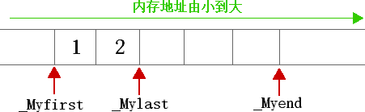

## 序列式容器

### 2.1`STL`序列容器

容器就是可以存储一系列模板类的集合 ，但是在容器上的它们有特殊的组织方法（数据结构）。

`STL`一共提供了三种容器：序列容器、排序容器、哈希容器。后两者属于关联容器。<font color='red'>**为什么称之为关联容器呢？**</font>

| 容器种          类 | 功能                                                         |
| ------------------ | ------------------------------------------------------------ |
| 序列容器           | 主要包括 vector 向量容器、list 列表容器以及 deque 双端队列容器。之所以被称为序列容器，是因为元素在容器中的位置同元素的值无关，即容器不是排序的。将元素插入容器时，指定在什么位置，元素就会位于什么位置。 |
| 排序容器           | 包括 set 集合容器、multiset多重集合容器、map映射容器以及 multimap 多重映射容器。排序容器中的元素默认是由小到大排序好的，即便是插入元素，元素也会插入到适当位置。所以关联容器在查找时具有非常好的性能。 |
| 哈希容器           | [C++](http://c.biancheng.net/cplus/) 11 新加入 4 种关联式容器，分别是 unordered_set 哈希集合、unordered_multiset 哈希多重集合、unordered_map 哈希映射以及 unordered_multimap 哈希多重映射。和排序容器不同，哈希容器中的元素是未排序的，元素的位置由哈希函数确定。 |


### 2.2迭代器

​	容器，都是一些列数据，最频繁的操作就是遍历数据。容器的遍历数据的方法都是类似的，我们基于泛型编程的思维。引出迭代器（便于对容器中的数据进行便利，而又统一格式）。迭代器有点类似于c++中的指针。

#### 	迭代器类别

[STL](http://c.biancheng.net/stl/) 标准库为每一种标准容器定义了一种迭代器类型（只能是以下五种迭代器的一种），这意味着，不同容器的迭代器也不同，其功能强弱也有所不同。

> 容器的迭代器的功能强弱，决定了该容器是否支持 STL 中的某种算法。

迭代器按照功能强弱划分为：输入迭代器、输出迭代器、前向迭代器、双向迭代器、随机访问迭代器 


输入迭代器和输出迭代器比较特殊，它们不是把数组或容器当做操作对象，而是把输入流/输出流作为操作对象

1) 前向迭代器（forward iterator）
   假设 p 是一个前向迭代器，则 p 支持 ++p，p++，*p 操作，还可以被复制或赋值，可以用 == 和 != 运算符进行比较。此外，两个正向迭代器可以互相赋值。

2) 双向迭代器（bidirectional iterator）
   双向迭代器具有正向迭代器的全部功能，除此之外，假设 p 是一个双向迭代器，则还可以进行 --p 或者 p-- 操作（即一次向后移动一个位置）。

3) 随机访问迭代器（random access iterator）
   随机访问迭代器具有双向迭代器的全部功能。除此之外，假设 p 是一个随机访问迭代器，i 是一个整型变量或常量，则 p 还支持以下操作：

   - p+=i：使得 p 往后移动 i 个元素。
   - p-=i：使得 p 往前移动 i 个元素。
   - p+i：返回 p 后面第 i 个元素的迭代器。
   - p-i：返回 p 前面第 i 个元素的迭代器。
   - p[i]：返回 p 后面第 i 个元素的引用。
   - 此外，两个随机访问迭代器 p1、p2 还可以用 <、>、<=、>= 运算符进行比较。另外，表达式 p2-p1 也是有定义的，其返回值表示 p2 所指向元素和 p1 所指向元素的序号之差（也可以说是 p2 和 p1 之间的元素个数减一）。

   

#### 不同容器所对应的迭代器

   | 容器                               | 对应的迭代器类型 |
   | ---------------------------------- | ---------------- |
   | array                              | 随机访问迭代器   |
   | vector                             | 随机访问迭代器   |
   | deque                              | 随机访问迭代器   |
   | list                               | 双向迭代器       |
   | set / multiset                     | 双向迭代器       |
   | map / multimap                     | 双向迭代器       |
   | forward_list                       | 前向迭代器       |
   | unordered_map / unordered_multimap | 前向迭代器       |
   | unordered_set / unordered_multiset | 前向迭代器       |
   | stack                              | 不支持迭代器     |
   | queue                              | 不支持迭代器     |


#### 迭代器的定义方式

| 迭代器定义方式 | 具体格式                                   |
| -------------- | ------------------------------------------ |
| 正向迭代器     | 容器类名::iterator 迭代器名;               |
| 常量正向迭代器 | 容器类名::const_iterator 迭代器名;         |
| 反向迭代器     | 容器类名::reverse_iterator 迭代器名;       |
| 常量反向迭代器 | 容器类名::const_reverse_iterator 迭代器名; |

- 对正向迭代器进行 ++ 操作时，迭代器会指向容器中的后一个元素；
- 而对反向迭代器进行 ++ 操作时，迭代器会指向容器中的前一个元素。

与上面的迭代器分类不是冲突的，只是可以组合的特征

注意，以上 4 种定义迭代器的方式，并不是每个容器都适用。有一部分容器同时支持以上 4 种方式，比如 array、deque、vector；而有些容器只支持其中部分的定义方式，例如 forward_list 容器只支持定义正向迭代器，不支持定义反向迭代器。

>  具体容器支持定义迭代器的方式，讲具体容器时会详细说明。另外，读者也可以通过 [C++ STL标准手册](http://www.cplusplus.com/reference/stl/)，查询具体容器迭代器支持的定义方式。

```c++
//遍历 vector 容器。
#include <iostream>
//需要引入 vector 头文件
#include <vector>
using namespace std;
int main()
{
    vector<int> v{1,2,3,4,5,6,7,8,9,10}; //v被初始化成有10个元素
    cout << "第一种遍历方法：" << endl;
    //size返回元素个数
    for (int i = 0; i < v.size(); ++i)
        cout << v[i] <<" "; //像普通数组一样使用vector容器
    //创建一个正向迭代器，当然，vector也支持其他 3 种定义迭代器的方式
    
       cout << endl << "第二种遍历方法：" << endl;
       vector<int>::iterator i;
    //用 != 比较两个迭代器
    for (i = v.begin(); i != v.end(); ++i)
        cout << *i << " ";
    
       cout << endl << "第三种遍历方法：" << endl;
    for (i = v.begin(); i < v.end(); ++i) //用 < 比较两个迭代器
        cout << *i << " ";
   
       cout << endl << "第四种遍历方法：" << endl;
    i = v.begin();
    while (i < v.end()) { //间隔一个输出
        cout << *i << " ";
        i += 2; // 随机访问迭代器支持 "+= 整数"  的操作
    }
}
```

运行结果：

```text
第一种遍历方法：
1 2 3 4 5 6 7 8 9 10
第二种遍历方法：
1 2 3 4 5 6 7 8 9 10
第三种遍历方法：
1 2 3 4 5 6 7 8 9 10
第四种遍历方法：
1 3 5 7 9
```

list 容器的迭代器是双向迭代器。假设 v 和 i 的定义如下：

```c++
//创建一个 v list容器
list<int> v;
//创建一个常量正向迭代器，同样，list也支持其他三种定义迭代器的方式。
list<int>::const_iterator i;
```

则以下代码是合法的：

```c++
for(i = v.begin(); i != v.end(); ++i)
	cout << *i;
```

以下代码则不合法，因为双向迭代器不支持用“<”进行比较：

```c++
for(i = v.begin(); i < v.end(); ++i)  
	cout << *i;
```

以下代码也不合法，因为双向迭代器不支持用下标随机访问元素：

```c++
for(int i=0; i<v.size(); ++i)
    cout << v[i];
```


### 2.3序列式容器

#### 简述各个容器

序列式容器，数据是以线性的方式进行排列。（不一定内存紧密排列）

+ array<T,N>（数组容器）。 表示可以存储 N 个 T 类型的元素，是 [C++](http://c.biancheng.net/cplus/) 本身提供的一种容器。一旦建立，长度不变，不能增加删除，只能修改值。内存紧密排列可随机访问。
+ vector<T>（向量容器）：放T类型长度可变。空间改变都是从尾部增加或者删除。尾部增加删除效率最高O(1)。其他位置O(n)。内存紧密排列可随机访问
+ deque<T>（双端队列容器）：和 vector 非常相似，区别在于使用该容器不仅尾部插入和删除元素高效，在头部插入或删除元素也同样高效，时间复杂度都是 O(1) 常数阶，但是在容器中某一位置处插入或删除元素，时间复杂度为 O(n) 线性阶；
+ list<T>（链表容器）：是一个长度可变的、由 T 类型元素组成的序列，它以双向链表的形式组织元素，在这个序列的任何地方都可以高效地增加或删除元素（时间复杂度都为常数阶 O(1)），但访问容器中任意元素的速度要比前三种容器慢，这是因为 list<T> 必须从第一个元素或最后一个元素开始访问，需要沿着链表移动，直到到达想要的元素。
+ forward_list<T>（正向链表容器）：和 list 容器非常类似，只不过它以单链表的形式组织元素，它内部的元素只能从第一个元素开始访问，是一类比链表容器快、更节省内存的容器。

> 注意，其实除此之外，stack<T> 和 queue<T> 本质上也属于序列容器，只不过它们都是在 deque 容器的基础上改头换面而成，通常更习惯称它们为容器适配器，有关它们的介绍，会放到后续章节中。


#### 容器中常见的函数成员

| 函数成员         | 函数功能                                                     | array<T,N> | vector<T> | deque<T> |
| ---------------- | ------------------------------------------------------------ | ---------- | --------- | -------- |
| begin()          | 返回指向容器中第一个元素的迭代器。                           | 是         | 是        | 是       |
| end()            | 返回指向容器最后一个元素所在位置后一个位置的迭代器，通常和 begin() 结合使用。 | 是         | 是        | 是       |
| rbegin()         | 返回指向最后一个元素的迭代器。                               | 是         | 是        | 是       |
| rend()           | 返回指向第一个元素所在位置前一个位置的迭代器。               | 是         | 是        | 是       |
| cbegin()         | 和 begin() 功能相同，只不过在其基础上，增加了 const 属性，不能用于修改元素。 | 是         | 是        | 是       |
| cend()           | 和 end() 功能相同，只不过在其基础上，增加了 const 属性，不能用于修改元素。 | 是         | 是        | 是       |
| crbegin()        | 和 rbegin() 功能相同，只不过在其基础上，增加了 const 属性，不能用于修改元素。 | 是         | 是        | 是       |
| crend()          | 和 rend() 功能相同，只不过在其基础上，增加了 const 属性，不能用于修改元素。 | 是         | 是        | 是       |
| assign()         | 用新元素替换原有内容。                                       | -          | 是        | 是       |
| operator=()      | 复制同类型容器的元素，或者用初始化列表替换现有内容。         | 是         | 是        | 是       |
| size()           | 返回实际元素个数。                                           | 是         | 是        | 是       |
| max_size()       | 返回元素个数的最大值。这通常是一个很大的值，一般是 232-1，所以我们很少会用到这个函数。 | 是         | 是        | 是       |
| capacity()       | 返回当前容量。                                               | -          | 是        | -        |
| empty()          | 判断容器中是否有元素，若无元素，则返回 true；反之，返回 false。 | 是         | 是        | 是       |
| resize()         | 改变实际元素的个数。                                         | -          | 是        | 是       |
| shrink _to_fit() | 将内存减少到等于当前元素实际所使用的大小。                   | -          | 是        | 是       |
| front()          | 返回第一个元素的引用。                                       | 是         | 是        | 是       |
| back()           | 返回最后一个元素的引用。                                     | 是         | 是        | 是       |
| operator[]()     | 使用索引访问元素。                                           | 是         | 是        | 是       |
| at()             | 使用经过边界检査的索引访问元素。                             | 是         | 是        | 是       |
| push_back()      | 在序列的尾部添加一个元素。                                   | -          | 是        | 是       |
| insert()         | 在指定的位置插入一个或多个元素。                             | -          | 是        | 是       |
| emplace()        | 在指定的位置直接生成一个元素。                               | -          | 是        | 是       |
| emplace_back()   | 在序列尾部生成一个元素。                                     | -          | 是        | 是       |
| pop_back()       | 移出序列尾部的元素。                                         | -          | 是        | 是       |
| erase()          | 移出一个元素或一段元素。                                     | -          | 是        | 是       |
| clear()          | 移出所有的元素，容器大小变为 0。                             | -          | 是        | 是       |
| swap()           | 交换两个容器的所有元素。                                     | 是         | 是        | 是       |
| data()           | 返回指向容器中第一个元素的[指针](http://c.biancheng.net/c/80/)。 | 是         | 是        | -        |

> 列表中 - 表明对应的容器并没有定义这个函数。

list 和 forward_list 容器彼此非常相似，forward_list 中包含了 list 的大部分成员函数，而未包含那些需要反向遍历的函数。表 3 展示了 list 和 forward_list 的函数成员。


| 函数成员        | 函数功能                                                     | list<T> | forward_list<T> |
| --------------- | ------------------------------------------------------------ | ------- | --------------- |
| begin()         | 返回指向容器中第一个元素的迭代器。                           | 是      | 是              |
| end()           | 返回指向容器最后一个元素所在位置后一个位置的迭代器。         | 是      | 是              |
| rbegin()        | 返回指向最后一个元素的迭代器。                               | 是      | -               |
| rend()          | 返回指向第一个元素所在位置前一个位置的迭代器。               | 是      | -               |
| cbegin()        | 和 begin() 功能相同，只不过在其基础上，增加了 const 属性，不能用于修改元素。 | 是      | 是              |
| before_begin()  | 返回指向第一个元素前一个位置的迭代器。                       | -       | 是              |
| cbefore_begin() | 和 before_begin() 功能相同，只不过在其基础上，增加了 const 属性，即不能用该指针修改元素的值。 | -       | 是              |
| cend()          | 和 end() 功能相同，只不过在其基础上，增加了 const 属性，不能用于修改元素。 | 是      | 是              |
| crbegin()       | 和 rbegin() 功能相同，只不过在其基础上，增加了 const 属性，不能用于修改元素。 | 是      | -               |
| crend()         | 和 rend() 功能相同，只不过在其基础上，增加了 const 属性，不能用于修改元素。 | 是      | -               |
| assign()        | 用新元素替换原有内容。                                       | 是      | 是              |
| operator=()     | 复制同类型容器的元素，或者用初始化列表替换现有内容。         | 是      | 是              |
| size()          | 返回实际元素个数。                                           | 是      | -               |
| max_size()      | 返回元素个数的最大值，这通常是一个很大的值，一般是 232-1，所以我们很少会用到这个函数。 | 是      | 是              |
| resize()        | 改变实际元素的个数。                                         | 是      | 是              |
| empty()         | 判断容器中是否有元素，若无元素，则返回 true；反之，返回 false。 | 是      | 是              |
| front()         | 返回容器中第一个元素的引用。                                 | 是      | 是              |
| back()          | 返回容器中最后一个元素的引用。                               | 是      | -               |
| push_back()     | 在序列的尾部添加一个元素。                                   | 是      | -               |
| push_front()    | 在序列的起始位置添加一个元素。                               | 是      | 是              |
| emplace()       | 在指定位置直接生成一个元素。                                 | 是      | -               |
| emplace_after() | 在指定位置的后面直接生成一个元素。                           | -       | 是              |
| emplace_back()  | 在序列尾部生成一个元素。                                     | 是      | -               |
| cmplacc_front() | 在序列的起始位生成一个元索。                                 | 是      | 是              |
| insert()        | 在指定的位置插入一个或多个元素。                             | 是      | -               |
| insert_after()  | 在指定位置的后面插入一个或多个元素。                         | -       | 是              |
| pop_back()      | 移除序列尾部的元素。                                         | 是      | -               |
| pop_front()     | 移除序列头部的元素。                                         | 是      | 是              |
| reverse()       | 反转容器中某一段的元素。                                     | 是      | 是              |
| erase()         | 移除指定位置的一个元素或一段元素。                           | 是      | -               |
| erase_after()   | 移除指定位置后面的一个元素或一段元素。                       | -       | 是              |
| remove()        | 移除所有和参数匹配的元素。                                   | 是      | 是              |
| remove_if()     | 移除满足一元函数条件的所有元素。                             | 是      | 是              |
| unique()        | 移除所有连续重复的元素。                                     | 是      | 是              |
| clear()         | 移除所有的元素，容器大小变为 0。                             | 是      | 是              |
| swap()          | 交换两个容器的所有元素。                                     | 是      | 是              |
| sort()          | 对元素进行排序。                                             | 是      | 是              |
| merge()         | 合并两个有序容器。                                           | 是      | 是              |
| splice()        | 移动指定位置前面的所有元素到另一个同类型的 list 中。         | 是      | -               |
| splice_after()  | 移动指定位置后面的所有元素到另一个同类型的 list 中。         |         |                 |


### 2.4 C++ array(STL array)容器用法详解


array是在普通数组的基础上添加一些成员函数和全局函数。所以和数组一样无法改变长度


array的定义

```c++
namespace std{
    template <typename T, size_t N>
    class array;
}
```

怎么使用该容器

```java
#include <array>
using namespace std;
```

创建具有10个double类型元素的array容器

```c++
array<double, 10> values;
```

创建 array 容器的方式，可以将所有的元素初始化为 0 或者和默认元素类型等效的值：

```c++
std::array<double, 10> values {};
```

容器中所有的元素都会被初始化为 0.0。

创建 array 容器的实例时，也可以像创建常规数组那样对元素进行初始化：

```c++
std::array<double, 10> values {0.5,1.0,1.5,,2.0};
```

可以看到，这里只初始化了前 4 个元素，剩余的元素都会被初始化为 0.0


> 表 2 array容器成员函数汇总

| 成员函数            | 功能                                                         |
| ------------------- | ------------------------------------------------------------ |
| begin()             | 返回指向容器中第一个元素的随机访问迭代器。                   |
| end()               | 返回指向容器最后一个元素之后一个位置的随机访问迭代器，通常和 begin() 结合使用。 |
| rbegin()            | 返回指向最后一个元素的随机访问迭代器。                       |
| rend()              | 返回指向第一个元素之前一个位置的随机访问迭代器。             |
| cbegin()            | 和 begin() 功能相同，只不过在其基础上增加了 const 属性，不能用于修改元素。 |
| cend()              | 和 end() 功能相同，只不过在其基础上，增加了 const 属性，不能用于修改元素。 |
| crbegin()           | 和 rbegin() 功能相同，只不过在其基础上，增加了 const 属性，不能用于修改元素。 |
| crend()             | 和 rend() 功能相同，只不过在其基础上，增加了 const 属性，不能用于修改元素。 |
| size()              | 返回容器中当前元素的数量，其值始终等于初始化 array 类的第二个模板参数 N。 |
| max_size()          | 返回容器可容纳元素的最大数量，其值始终等于初始化 array 类的第二个模板参数 N。 |
| empty()             | 判断容器是否为空，和通过 size()==0 的判断条件功能相同，但其效率可能更快。 |
| at(n)               | 返回容器中 n 位置处元素的引用，该函数自动检查 n 是否在有效的范围内，如果不是则抛出 out_of_range 异常。 |
| front()             | 返回容器中第一个元素的直接引用，该函数不适用于空的 array 容器。 |
| back()              | 返回容器中最后一个元素的直接应用，该函数同样不适用于空的 array 容器。 |
| data()              | 返回一个指向容器首个元素的[指针](http://c.biancheng.net/c/80/)。利用该指针，可实现复制容器中所有元素等类似功能。 |
| fill(val)           | 将 val 这个值赋值给容器中的每个元素。                        |
| array1.swap(array2) | 交换 array1 和 array2 容器中的所有元素，但前提是它们具有相同的长度和类型。 |


```c++
#include <iostream>
//需要引入 array 头文件
#include <array>
using namespace std;
int main()
{
    std::array<int, 4> values{};
    //初始化 values 容器为 {0,1,2,3}
    for (int i = 0; i < values.size(); i++) {
        values.at(i) = i;
    }
    //使用 get() 重载函数输出指定位置元素
    cout << get<3>(values) << endl;
    //如果容器不为空，则输出容器中所有的元素
    if (!values.empty()) {
        for (auto val = values.begin(); val < values.end(); val++) {
            cout << *val << " ";
        }
    }
}
```

```text
3
0 1 2 3
```

### 2.5 C++ STL array随机访问迭代器（精讲版）

表 1 array 支持迭代器的成员函数

| 成员函数  | 功能                                                         |
| --------- | ------------------------------------------------------------ |
| begin()   | 返回指向容器中第一个元素的正向迭代器；如果是 const 类型容器，在该函数返回的是常量正向迭代器。 |
| end()     | 返回指向容器最后一个元素之后一个位置的正向迭代器；如果是 const 类型容器，在该函数返回的是常量正向迭代器。此函数通常和 begin() 搭配使用。 |
| rbegin()  | 返回指向最后一个元素的反向迭代器；如果是 const 类型容器，在该函数返回的是常量反向迭代器。 |
| rend()    | 返回指向第一个元素之前一个位置的反向迭代器。如果是 const 类型容器，在该函数返回的是常量反向迭代器。此函数通常和 rbegin() 搭配使用。 |
| cbegin()  | 和 begin() 功能类似，只不过其返回的迭代器类型为常量正向迭代器，不能用于修改元素。 |
| cend()    | 和 end() 功能相同，只不过其返回的迭代器类型为常量正向迭代器，不能用于修改元素。 |
| crbegin() | 和 rbegin() 功能相同，只不过其返回的迭代器类型为常量反向迭代器，不能用于修改元素。 |
| crend()   | 和 rend() 功能相同，只不过其返回的迭代器类型为常量反向迭代器，不能用于修改元素。 |

> 除此之外，[C++](http://c.biancheng.net/cplus/) 11 标准新增的 begin() 和 end() 函数，当操作对象为 array 容器时，也和迭代器有关，其功能分别和表 1 中的 begin()、end() 成员函数相同，具有用法本节后续会做详细介绍。


r-->方向 c-->常量

*end函数都返回的是一个超出 原容器边界位置 +1（按照自己的方向）

#### begin()/end() 和 cbegin()/cend()

 begin() 和 end()  都是正向迭代器。分别指向首元素，和尾元素+1.可以参考上面图画

```c++
#include <iostream>
//需要引入 array 头文件
#include <array>
using namespace std;
int main()
{
    array<int, 5>values;
    int h = 1;
    auto first = values.begin();
    auto last = values.end();
    //初始化 values 容器为{1,2,3,4,5}
    while (first != last)
    {
        *first = h;
        ++first;
        h++;
    }
  
    first = values.begin();
    while (first != last)
    {
        cout << *first << " ";
        ++first;
    }
    return 0; 
}
```

```text
1 2 3 4 5
```

我们还可以利用全局函数来获得迭代器

```c++
auto first = std::begin(values);
auto last = std::end (values);
```


> 需要注意的是，STL 标准库，不是只有 array 容器，当迭代器指向容器中的一个特定元素时，它们不会保留任何关于容器本身的信息，所以我们无法从迭代器中判断，它是指向 array 容器还是指向 vector 容器（该容器后续会讲）。


 cbegin() 和 cend() 成员函数返回的迭代器，可以用来遍历容器内的元素，也可以访问元素，但是不能对所存储的元素进行修改。

```c++
#include <iostream>
//需要引入 array 头文件
#include <array>
using namespace std;
int main()
{
    array<int, 5>values{1,2,3,4,5};
    int h = 1;
    auto first = values.cbegin();
    auto last = values.cend();
   
    //由于 *first 为 const 类型，不能用来修改元素
    //*first = 10;
   
    //遍历容器并输出容器中所有元素
    while (first != last)
    {
        //可以使用 const 类型迭代器访问元素
        cout << *first << " ";
        ++first;
    }
    return 0;
}
```

#### **rbegin()/rend() 和 crbegin()/crend()**

```c++
#include <iostream>
//需要引入 array 头文件
#include <array>
using namespace std;
int main()
{
    array<int, 5>values;
    int h = 1;
    auto first = values.rbegin();
    auto last = values.rend(); 
    //初始化 values 容器为 {5,4,3,2,1}
    while (first != last)
    {
        *first = h;
        ++first;
        h++;
    }
    //重新遍历容器，并输入各个元素
    first = values.rbegin();
    while (first != last)
    {
        cout << *first << " ";
        ++first;
    }
    return 0;
}
```

l利用for循环

```c++
for (auto first = values.rbegin(); first != values.rend(); ++first) {
    cout << *first << " ";
}
```


### 2.6 C++ STL array容器访问元素的几种方式

**访问array中单个元素**

+ `容器名[]`  

```c++
values[4] = values[3] + 2.O*values[1];
```

缺点：越界了也不知道，会返回脏数据。由于没有做任何边界检查，所以即便使用越界的索引值去访问或存储元素，也不会被检测到。

+ 利用array的at函数来访问，越界了会报出异常。

```c++
values.at (4) = values.at(3) + 2.O*values.at(1);
```

+ array 容器还提供了 get<n> 模板函数，它是一个辅助函数，能够获取到容器的第 n 个元素。**模板函数中，参数的实参必须是一个在编译时可以确定的常量表达式，**

```c++
#include <iostream>
#include <array>
#include <string>
using namespace std;
int main()
{
    array<string, 5> words{ "one","two","three","four","five" };
    cout << get<3>(words) << endl; // Output words[3]
    //cout << get<6>(words) << std::endl; //越界，会发生编译错误
    return 0;
}
```

```c++
four
```

array的data函数可获得指向首个元素的指针

```c++
#include <iostream>
#include <array>
using namespace std;
int main()
{
    array<int, 5> words{1,2,3,4,5};
    cout << *( words.data()+1);
    return 0;
}
```

```c++
2
```

**访问array容器中多个元素**

array 容器提供的 size() 函数能够返回容器中元素的个数（函数返回值为 size_t 类型）

```c++
double total = 0;
for(size_t i = 0 ; i < values.size() ; ++i)
{
    total += values[i];
}
```

还有empty函数，可判断容器是否为空，array的一旦定义它的大小就是固定的。empty函数在其他可变大小的容器中可能更有意义

```c++
f(values.empty())
    std::cout << "The container has no elements.\n";
else
    std::cout << "The container has "<< values.size()<<"elements.\n";
```


使用迭代器简介循环

```c++
double total = 0;
for(auto&& value : values)
    total += value;
```

```c++
#include <iostream>
#include <iomanip> 
#include <array>
using namespace std;
int main()
{
    array<int, 5> values1;
    array<int, 5> values2;
    //初始化 values1 为 {0,1,2,3,4}
    for (size_t i = 0; i < values1.size(); ++i)
    {
        values1.at(i) = i;
    }
    cout << "values1[0] is : " << values1[0] << endl;
    cout << "values1[1] is : " << values1.at(1) << endl;
    cout << "values1[2] is : " << get<2>(values1) << endl;
    //初始化 values2 为{10，11，12，13，14}
    int initvalue = 10;
    for (auto& value : values2)
    {
        value = initvalue;
        initvalue++;
    }
    cout <<  "Values1 is : ";
    for (auto i = values1.begin(); i < values1.end(); i++) {
        cout << *i << " ";
    }
    cout << endl << "Values2 is : ";
    for (auto i = values2.begin(); i < values2.end(); i++) {
        cout << *i << " ";
    }
    return 0;
}
```

```text
values1[0] is : 0
values1[1] is : 1
values1[2] is : 2
Values1 is : 0 1 2 3 4
Values2 is : 10 11 12 13 14
```

### 2. 7 C++ array容器：普通数组的“升级版”

和c++中普通数组一样，都是在底层相邻存储。

```C++
#include <iostream>
#include <array>
using namespace std;
int main()
{
    array<int, 5>a{1,2,3};
    cout << &a[2] << " " << &a[0] + 2 << endl;
    return 0;
}
```

```text
004FFD58 004FFD58
```

> 用 array 容器替换普通数组的好处是，array 模板类中已经封装好了大量实用的方法，在提高开发效率的同时，代码的运行效率也会大幅提高。


使用 array 容器去存储 char* 或 const char* 类型的字符串：

```c++
#include <iostream>
#include <array>
#include<cstring>
using namespace std;
int main()
{
    array<char, 50>a{1,2,3};
    strcpy(&a[0], "http://c.biancheng.net/stl");
    printf("%s \r\n", &a[0]);
    printf("%s", &a[1]);
    return 0;
}
```

```c++
http://c.biancheng.net/stl
ttp://c.biancheng.net/stl
```

array 容器的大小必须保证能够容纳复制进来的数据，而且如果是存储字符串的话，还要保证在存储整个字符串的同时，在其最后放置一个`\0`作为字符串的结束符。此程序中，strcpy() 在拷贝字符串的同时，会自动在最后添加`\0`。

&a[0] 还可以用 array 模板类提供的 data() 成员函数来替换：

```c++
#include <iostream>
#include <array>
using namespace std;
int main()
{
    array<char, 50>a{1,2,3};
    strcpy(a.data(), "http://c.biancheng.net/stl");
    printf("%s", a.data());
    return 0;
}
```

> 容器的迭代器和指针是不能混用的，即上面代码中不能用 a.begin() 来代替 &a[0] 或者 a.data[]，这可能会引发错误。

**实用的api**

交换两个array的值

```c++
#include <iostream>
#include <array>
using namespace std;
int main()
{
    array<char, 50>addr1{"http://c.biancheng.net"};
    array<char, 50>addr2{ "http://c.biancheng.net/stl" };
    addr1.swap(addr2);
    printf("addr1 is：%s\n", addr1.data());
    printf("addr2 is：%s\n", addr2.data());
    return 0;
}
```

赋值

```c++
#include <iostream>
#include <array>
using namespace std;
int main()
{
    array<char, 50>addr1{ "http://c.biancheng.net" };
    array<char, 50>addr2{ "http://c.biancheng.net/stl" };
    addr1 = addr2;
    printf("%s", addr1.data());
    return 0;
}
```

```text
http://c.biancheng.net/stl
```

比较两个数组

```c++
#include <iostream>
#include <array>
using namespace std;
int main()
{
    array<char, 50>addr1{ "http://c.biancheng.net" };
    array<char, 50>addr2{ "http://c.biancheng.net/stl" };
    if (addr1 == addr2) {
        std::cout << "addr1 == addr2" << std::endl;
    }
    if (addr1 < addr2) {
        std::cout << "addr1 < addr2" << std::endl;
    }
    if (addr1 > addr2) {
        std::cout << "addr1 > addr2" << std::endl;
    }
    return 0;
}
```

```text
addr1 < addr2
```

### 2.8 C++ STL vector容器详解

vector的容量是可变的，不象array终身容量不变

他在尾部插入删除元素，时间复杂度O(1),在中部和尾部插入和删除元素的时间复杂度就是O（n）

vector 容器以类模板 vector<T>（ T 表示存储元素的类型）的形式定义在 <vector> 头文件中，并位于 std 命名空间中。因此，在创建该容器之前，代码中需包含如下内容：

```c++
#include <vector>using namespace std;
```

**创建vector容器的几种方式**

1. 直接创建空的

```c++
std::vector<double> values;

```

这是一个空的 vector 容器，因为容器中没有元素，所以没有为其分配空间。当添加第一个元素（比如使用 push_back() 函数）时，vector 会自动分配内存。

增加vector的容量

```c++
values.reserve(20);
```

至少可以容纳 20 个元素。注意，如果 vector 的容量在执行此语句之前，已经大于或等于 20 个元素，那么这条语句什么也不做；另外，调用 reserve() 不会影响已存储的元素，也不会生成任何元素，即 values 容器内此时仍然没有任何元素。

> 还需注意的是，如果调用 reserve() 来增加容器容量，之前创建好的任何迭代器（例如开始迭代器和结束迭代器）都可能会失效，这是因为，为了增加容器的容量，vector<T> 容器的元素可能已经被复制或移到了新的内存地址。所以后续再使用这些迭代器时，最好重新生成一下。

2. 除了创建空 vector 容器外，还可以在创建的同时指定初始值以及元素个数，比如：

```c++
std::vector<int> primes {2, 3, 5, 7, 11, 13, 17, 19};
```

在创建的时候指定大小和值

3. 只指定元素个数

```c++
std::vector<double> values(20);
```

values 容器开始时就有 20 个元素，它们的默认初始值都为 0。

> 圆括号 () 和大括号 {} 是有区别的，前者（例如 (20) ）表示元素的个数，而后者（例如 {20} ） 则表示 vector 容器中只有一个元素 20。

指定默认值

> 1. std::vector<double> values(20, 1.0);

也可以使用变量来表示

```c++
int num=20;
double value =1.0;
std::vector<double> values(num, value);
```

4. 通过已有创建新的

   ```c++
   std::vector<char>value1(5, 'c');
   std::vector<char>value2(value1);
   
   ```

   `value2` 容器中也具有 5 个字符 'c'。在此基础上，如果不想复制其它容器中所有的元素，可以用一对[指针](http://c.biancheng.net/c/80/)或者迭代器来指定初始值的范围

   ```c++
   int array[]={1,2,3};
   std::vector<int>values(array, array+2);//values 将保存{1,2}
   std::vector<int>value1{1,2,3,4,5};
   std::vector<int>value2(std::begin(value1),std::begin(value1)+3);//value2保存{1,2,3}
   ```

**vector容器包含的成员函数**

| 函数成员         | 函数功能                                                     |
| ---------------- | ------------------------------------------------------------ |
| begin()          | 返回指向容器中第一个元素的迭代器。                           |
| end()            | 返回指向容器最后一个元素所在位置后一个位置的迭代器，通常和 begin() 结合使用。 |
| rbegin()         | 返回指向最后一个元素的迭代器。                               |
| rend()           | 返回指向第一个元素所在位置前一个位置的迭代器。               |
| cbegin()         | 和 begin() 功能相同，只不过在其基础上，增加了 const 属性，不能用于修改元素。 |
| cend()           | 和 end() 功能相同，只不过在其基础上，增加了 const 属性，不能用于修改元素。 |
| crbegin()        | 和 rbegin() 功能相同，只不过在其基础上，增加了 const 属性，不能用于修改元素。 |
| crend()          | 和 rend() 功能相同，只不过在其基础上，增加了 const 属性，不能用于修改元素。 |
| size()           | 返回实际元素个数。                                           |
| max_size()       | 返回元素个数的最大值。这通常是一个很大的值，一般是 232-1，所以我们很少会用到这个函数。 |
| resize()         | 改变实际元素的个数。                                         |
| capacity()       | 返回当前容量。                                               |
| empty()          | 判断容器中是否有元素，若无元素，则返回 true；反之，返回 false。 |
| reserve()        | 增加容器的容量。                                             |
| shrink _to_fit() | 将内存减少到等于当前元素实际所使用的大小。                   |
| operator[ ]      | 重载了 [ ] 运算符，可以向访问数组中元素那样，通过下标即可访问甚至修改 vector 容器中的元素。 |
| at()             | 使用经过边界检查的索引访问元素。                             |
| front()          | 返回第一个元素的引用。                                       |
| back()           | 返回最后一个元素的引用。                                     |
| data()           | 返回指向容器中第一个元素的指针。                             |
| assign()         | 用新元素替换原有内容。                                       |
| push_back()      | 在序列的尾部添加一个元素。                                   |
| pop_back()       | 移出序列尾部的元素。                                         |
| insert()         | 在指定的位置插入一个或多个元素。                             |
| erase()          | 移出一个元素或一段元素。                                     |
| clear()          | 移出所有的元素，容器大小变为 0。                             |
| swap()           | 交换两个容器的所有元素。                                     |
| emplace()        | 在指定的位置直接生成一个元素。                               |
| emplace_back()   | 在序列尾部生成一个元素。                                     |

来个例子

```c++
#include <iostream>
#include <vector>
using namespace std;
int main()
{
    //初始化一个空vector容量
    vector<char>value;
    //向value容器中的尾部依次添加 S、T、L 字符
    value.push_back('S');
    value.push_back('T');
    value.push_back('L');
    //调用 size() 成员函数容器中的元素个数
    printf("元素个数为：%d\n", value.size());
    //使用迭代器遍历容器
    for (auto i = value.begin(); i < value.end(); i++) {
        cout << *i << " ";
    }
    cout << endl;
    //向容器开头插入字符
    value.insert(value.begin(), 'C');
    cout << "首个元素为：" << value.at(0) << endl;
    return 0;
}
```

```text
元素个数为：3
S T L
首个元素为：C
```

### 2.9 STL vector容器迭代器用法详解

 **vector 支持迭代器的成员函数**

| 成员函数  | 功能                                                         |
| --------- | ------------------------------------------------------------ |
| begin()   | 返回指向容器中第一个元素的正向迭代器；如果是 const 类型容器，在该函数返回的是常量正向迭代器。 |
| end()     | 返回指向容器最后一个元素之后一个位置的正向迭代器；如果是 const 类型容器，在该函数返回的是常量正向迭代器。此函数通常和 begin() 搭配使用。 |
| rbegin()  | 返回指向最后一个元素的反向迭代器；如果是 const 类型容器，在该函数返回的是常量反向迭代器。 |
| rend()    | 返回指向第一个元素之前一个位置的反向迭代器。如果是 const 类型容器，在该函数返回的是常量反向迭代器。此函数通常和 rbegin() 搭配使用。 |
| cbegin()  | 和 begin() 功能类似，只不过其返回的迭代器类型为常量正向迭代器，不能用于修改元素。 |
| cend()    | 和 end() 功能相同，只不过其返回的迭代器类型为常量正向迭代器，不能用于修改元素。 |
| crbegin() | 和 rbegin() 功能相同，只不过其返回的迭代器类型为常量反向迭代器，不能用于修改元素。 |
| crend()   | 和 rend() 功能相同，只不过其返回的迭代器类型为常量反向迭代器，不能用于修改元素。 |

vector容器迭代器的基本用法和array差不多不再详述

**vector容器迭代器的独特之处**

和 array 容器不同，vector 容器可以随着存储元素的增加，自行申请更多的存储空间。但是在初始化空的 vector 容器时，不能使用迭代器。也就是说，如下初始化 vector 容器的方法是不行的：

```c++
#include <iostream>
#include <vector>
using namespace std;
int main()
{
    vector<int>values;
    int val = 1;
    for (auto first = values.begin(); first < values.end(); ++first, val++) {
        *first = val;
        //初始化的同时输出值
        cout << *first;
    }
    return 0;
}
```

上面的程序什么也不会输出

所以，对于空的 vector 容器来说，可以通过调用 push_back() 或者借助 resize() 成员函数实现初始化容器的目的。


>  vector 容器在申请更多内存的同时，容器中的所有元素可能会被复制或移动到新的内存地址，这会导致之前创建的迭代器失效。

vecor：这里放不下我那庞大的身体了，我得再去找一个地方去

```c++
#include <iostream>
#include <vector>
using namespace std;
int main()
{
    vector<int>values{1,2,3};
    cout << "values 容器首个元素的地址：" << values.data() << endl;
    auto first = values.begin();
    auto end = values.end();
    //增加 values 的容量
    values.reserve(20);
    cout << "values 容器首个元素的地址：" << values.data() << endl;
    while (first != end) {
        cout << *first;
        ++first;
    }
    return 0;
}
```

```text
values 容器首个元素的地址：0096DFE8
values 容器首个元素的地址：00965560
```

values 容器在增加容量之后，首个元素的存储地址发生了改变，此时再使用先前创建的迭代器，显然是错误的。因此，为了保险起见，**每当 vector 容器的容量发生变化时，我们都要对之前创建的迭代器重新初始化一遍**：

```c++
#include <iostream>
#include <vector>
using namespace std;
int main()
{
    vector<int>values{1,2,3};
    cout << "values 容器首个元素的地址：" << values.data() << endl;
    auto first = values.begin();
    auto end = values.end();
    //增加 values 的容量
    values.reserve(20);
    cout << "values 容器首个元素的地址：" << values.data() << endl;
    first = values.begin();
    end = values.end();
    while (first != end) {
        cout << *first ;
        ++first;
    }
    return 0;
}
```

```text
values 容器首个元素的地址：0164DBE8
values 容器首个元素的地址：01645560
123
```

###  2.10 STL vector容器访问元素的几种方式

**访问单个元素**

+ 支持 `容器名[n]`同样没有校验越位

+ at（）方法

+ data()返回首个元素的指针

+ front() 和 back()，它们分别返回 vector 容器中第一个和最后一个元素的引用。

  ```c++
  #include <iostream>
  #include <vector>
  using namespace std;
  int main()
  {
      vector<int> values{1,2,3,4,5};
      cout << "values 首元素为：" << values.front() << endl;
      cout << "values 尾元素为：" << values.back() << endl;
      //修改首元素
      values.front() = 10;
      cout <<"values 新的首元素为：" << values.front() << endl;
      //修改尾元素
      values.back() = 20;
      cout << "values 新的尾元素为：" << values.back() << endl;
      return 0;
  }
  ```

  结果为

  ```text
  values 首元素为：1
  values 尾元素为：5
  values 新的首元素为：10
  values 新的尾元素为：20
  ```

  

**访问vector容器中多个元素**

```c++
#include <iostream>
#include <vector>
using namespace std;
int main()
{
    vector<int> values{1,2,3,4,5};
    //从下标 0 一直遍历到 size()-1 处
    for (int i = 0; i < values.size(); i++) {
        cout << values[i] << " ";
    }
    return 0;
}
```

迭代器循环

```c++
#include <iostream>
#include <vector>
using namespace std;
int main()
{
    vector<int> values{1,2,3,4,5};
    for (auto&& value : values)
        cout << value << " ";
    return 0;
}
```

```c++
#include <iostream>
#include <vector>
using namespace std;
int main()
{
    vector<int> values{1,2,3,4,5};
    for (auto first = values.begin(); first < values.end(); ++first) {
        cout << *first << " ";
    }
    return 0;
}
```

### 2.11 vector容量（capacity）和大小（size）的区别

>  vector 容器的容量（用 capacity 表示），指的是在不分配更多内存的情况下，容器可以保存的最多元素个数；而 vector 容器的大小（用 size 表示），指的是它实际所包含的元素个数。

```c++
#include <iostream>
#include <vector>
using namespace std;
int main()
{
    std::vector<int>value{ 2,3,5,7,11,13,17,19,23,29,31,37,41,43,47 };
    value.reserve(20);
    cout << "value 容量是：" << value.capacity() << endl;
    cout << "value 大小是：" << value.size() << endl;
    return 0;
}
```

```text
value 容量是：20
value 大小是：15
```


​	vector 容器的大小不能超出它的容量，在大小等于容量的基础上，只要增加一个元素，就必须分配更多的内存。注意，这里的“更多”并不是 1 个。换句话说，当 vector 容器的大小和容量相等时，如果再向其添加（或者插入）一个元素，vector 往往会申请多个存储空间，而不仅仅只申请 1 个。

> 一旦 vector 容器的内存被重新分配，则和 vector 容器中元素相关的所有引用、指针以及迭代器，都可能会失效，最稳妥的方法就是重新生成。

```c++
#include <iostream>
#include <vector>
using namespace std;
int main()
{
    vector<int>value{ 2,3,5,7,11,13,17,19,23,29,31,37,41,43,47 };
    cout << "value 容量是：" << value.capacity() << endl;
    cout << "value 大小是：" << value.size() << endl;
    printf("value首地址：%p\n", value.data());
    value.push_back(53);
    cout << "value 容量是(2)：" << value.capacity() << endl;
    cout << "value 大小是(2)：" << value.size() << endl;
    printf("value首地址： %p", value.data());
    return 0;
}
```

```text
value 容量是：15
value 大小是：15
value首地址：01254D40
value 容量是(2)：22
value 大小是(2)：16
value首地址： 01254E80
```

> 因此，对于 vector 容器而言，当增加新的元素时，有可能很快完成（即直接存在预留空间中）；也有可能会慢一些（扩容之后再放新元素）。

**修改vector容器的容量和大小**

```c++
#include <iostream>
#include <vector>
using namespace std;
int main()
{
    vector<int>value{ 2,3,5,7,11,13,17,19,23,29,31,37,41,43,47 };
    cout << "value 容量是：" << value.capacity() << endl;
    cout << "value 大小是：" << value.size() << endl;
    value.reserve(20);
    cout << "value 容量是(2)：" << value.capacity() << endl;
    cout << "value 大小是(2)：" << value.size() << endl;
    //将元素个数改变为 21 个，所以会增加 6 个默认初始化的元素
    value.resize(21);
    //将元素个数改变为 21 个，新增加的 6 个元素默认值为 99。
    //value.resize(21,99);
    //当需要减小容器的大小时，会移除多余的元素。
    //value.resize(20);
    cout << "value 容量是(3)：" << value.capacity() << endl;
    cout << "value 大小是(3)：" << value.size() << endl;
    return 0;
}
```

```text
value 容量是：15
value 大小是：15
value 容量是(2)：20
value 大小是(2)：15
value 容量是(3)：30
value 大小是(3)：21
```


**vector容器容量和大小的数据类型**

vector<T> 对象的容量和大小类型都是 vector<T>::size_type 类型

```c++
vector<int>::size_type cap = value.capacity();
vector<int>::size_type size = value.size();
```

size_type 类型是定义在由 vector 类模板生成的 vecotr 类中的，它表示的真实类型和操作系统有关，在 32 位架构下普遍表示的是 unsigned int 类型，而在 64 位架构下普通表示 unsigned long 类型。

```c++
auto cap = value.capacity();
auto size = value.size();
```

### 2.12 深度剖析C++ vector容器的底层实现机制

```c++
//_Alloc 表示内存分配器，此参数几乎不需要我们关心
template <class _Ty, class _Alloc = allocator<_Ty>>
class vector{
    ...
protected:
    pointer _Myfirst;
    pointer _Mylast;
    pointer _Myend;
};
```

vector 容器的源代码不难发现，它就是使用 3 个迭代器（可以理解成指针）来表示的.



- _Myfirst 和 _Mylast 可以用来表示 vector 容器中目前已被使用的内存空间；
- _Mylast 和 _Myend 可以用来表示 vector 容器目前空闲的内存空间；
- _Myfirst 和 _Myend 可以用表示 vector 容器的容量。

有了这三个迭代器，以下的方法实现起来就比较简单了。

```c++
template <class _Ty, class _Alloc = allocator<_Ty>>
class vector{
public：
    iterator begin() {return _Myfirst;}
    iterator end() {return _Mylast;}
    size_type size() const {return size_type(end() - begin());}
    size_type capacity() const {return size_type(_Myend - begin());}
    bool empty() const {return begin() == end();}
    reference operator[] (size_type n) {return *(begin() + n);}
    reference front() { return *begin();}
    reference back() {return *(end()-1);}
    ...
};
```

**vector扩大容量的本质**

1. 完全弃用现有的内存空间，重新申请更大的内存空间；
2. 将旧内存空间中的数据，按原有顺序移动到新的内存空间中；
3. 最后将旧的内存空间释放。

这也就解释了，为什么 vector 容器在进行扩容后，与其相关的指针、引用以及迭代器可能会失效的原因。

vector 容器扩容时，不同的编译器申请更多内存空间的量是不同的。以 VS 为例，它会扩容现有容器容量的 50%。不同编译器不尽相同。

### 2.13 STL vector添加元素


**push_back()**

向vector末尾添加一个元素

```c++
#include <iostream>
#include <vector>
using namespace std;
int main()
{
    vector<int> values{};
    values.push_back(1);
    values.push_back(2);
    for (int i = 0; i < values.size(); i++) {
        cout << values[i] << " ";
    }
    return 0;
}
```

```text
1 2
```


**emplace_back()**

该函数是 [C++](http://c.biancheng.net/cplus/) 11 新增加的，其功能和 push_back() 相同，都是在 vector 容器的尾部添加一个元素。

```c++
#include <iostream>
#include <vector>
using namespace std;
int main()
{
    vector<int> values{};
    values.emplace_back(1);
    values.emplace_back(2);
    for (int i = 0; i < values.size(); i++) {
        cout << values[i] << " ";
    }
    return 0;
}
```

```text
1 2
```

**emplace_back()和push_back()的区别**

​	emplace_back() 和 push_back() 的区别，就在于底层实现的机制不同。push_back() 向容器尾部添加元素时，首先会创建这个元素，然后再将这个元素拷贝或者移动到容器中（如果是拷贝的话，事后会自行销毁先前创建的这个元素）；而 emplace_back() 在实现时，则是直接在容器尾部创建这个元素，省去了拷贝或移动元素的过程。

```c++
#include <vector> 
#include <iostream> 
using namespace std;
class testDemo
{
public:
    testDemo(int num):num(num){
        std::cout << "调用构造函数" << endl;
    }
    testDemo(const testDemo& other) :num(other.num) {
        std::cout << "调用拷贝构造函数" << endl;
    }
    testDemo(testDemo&& other) :num(other.num) {
        std::cout << "调用移动构造函数" << endl;
    }
private:
    int num;
};
int main()
{
    cout << "emplace_back:" << endl;
    std::vector<testDemo> demo1;
    demo1.emplace_back(2);  
    cout << "push_back:" << endl;
    std::vector<testDemo> demo2;
    demo2.push_back(2);
}
```

```text
emplace_back:
调用构造函数
push_back:
调用构造函数
调用移动构造函数
```

读者可尝试将 testDemo 类中的移动构造函数注释掉，再运行程序会发现，运行结果变为：

```text
emplace_back:
调用构造函数
push_back:
调用构造函数
调用拷贝构造函数
```

> 由于 emplace_back() 是 C++ 11 标准新增加的，如果程序要兼顾之前的版本，还是应该使用 push_back()。

### 2.14 vector插入元素（insert()和emplace()）详解

向指定位置插入元素，

**insert**()

insert() 函数的功能是在 vector 容器的指定位置插入一个或多个元素。该函数的语法格式有多种，如表 1 所示。


| 语法格式                        | 用法说明                                                     |
| ------------------------------- | ------------------------------------------------------------ |
| iterator insert(pos,elem)       | 在迭代器 pos 指定的位置之前插入一个新元素elem，并返回表示新插入元素位置的迭代器。 |
| iterator insert(pos,n,elem)     | 在迭代器 pos 指定的位置之前插入 n 个元素 elem，并返回表示第一个新插入元素位置的迭代器。 |
| iterator insert(pos,first,last) | 在迭代器 pos 指定的位置之前，插入其他容器（不仅限于vector）中位于 [first,last) 区域的所有元素，并返回表示第一个新插入元素位置的迭代器。 |
| iterator insert(pos,initlist)   | 在迭代器 pos 指定的位置之前，插入初始化列表（用大括号{}括起来的多个元素，中间有逗号隔开）中所有的元素，并返回表示第一个新插入元素位置的迭代器。 |

用程序演示

```c++
#include <iostream> 
#include <vector> 
#include <array> 
using namespace std;
int main()
{
    std::vector<int> demo{1,2};
    //第一种格式用法
    demo.insert(demo.begin() + 1, 3);//{1,3,2}
    //第二种格式用法
    demo.insert(demo.end(), 2, 5);//{1,3,2,5,5}
    //第三种格式用法
    std::array<int,3>test{ 7,8,9 };
    demo.insert(demo.end(), test.begin(), test.end());//{1,3,2,5,5,7,8,9}
    //第四种格式用法
    demo.insert(demo.end(), { 10,11 });//{1,3,2,5,5,7,8,9,10,11}
    for (int i = 0; i < demo.size(); i++) {
        cout << demo[i] << " ";
    }
    return 0;
}
```

```text
1 3 2 5 5 7 8 9 10 11
```

**emplace()**

emplace() 是 [C++](http://c.biancheng.net/cplus/) 11 标准新增加的成员函数，用于在 vector 容器指定位置**之前**插入一个新的元素。

> emplace() 每次只能插入一个元素，而不是多个。

> iterator emplace (const_iterator pos, args...);

**args... 表示与新插入元素的构造函数相对应的多个参数，不是插入多个**,；该函数会返回表示新插入元素位置的迭代器。

```c++
#include <vector>
#include <iostream>
using namespace std;
int main()
{
    std::vector<int> demo1{1,2};
    //emplace() 每次只能插入一个 int 类型元素
    demo1.emplace(demo1.begin(), 3);
    for (int i = 0; i < demo1.size(); i++) {
        cout << demo1[i] << " ";
    }
    return 0;
}
```

```text
3 1 2
```

谁的效率高

```c++
#include <vector>
#include <iostream>
using namespace std;
class testDemo
{
public:
    testDemo(int num) :num(num) {
        std::cout << "调用构造函数" << endl;
    }
    testDemo(const testDemo& other) :num(other.num) {
        std::cout << "调用拷贝构造函数" << endl;
    }
    testDemo(testDemo&& other) :num(other.num) {
        std::cout << "调用移动构造函数" << endl;
    }
    testDemo& operator=(const testDemo& other);
private:
    int num;
};
testDemo& testDemo::operator=(const testDemo& other) {
    this->num = other.num;
    return *this;
}
int main()
{
    cout << "insert:" << endl;
    std::vector<testDemo> demo2{};
    demo2.insert(demo2.begin(), testDemo(1));
    cout << "emplace:" << endl;
    std::vector<testDemo> demo1{};
    demo1.emplace(demo1.begin(), 1);
    return 0;
}
```

```text
insert:
调用构造函数
调用移动构造函数
emplace:
调用构造函数
```

通过 insert() 函数向 vector 容器中插入 testDemo 类对象，需要调用类的构造函数和移动构造函数（或拷贝构造函数）；而通过 emplace() 函数实现同样的功能，只需要调用构造函数即可。

简单的理解，就是 emplace() 在插入元素时，是在容器的指定位置直接构造元素，而不是先单独生成，再将其复制（或移动）到容器中。因此，在实际使用中，推荐大家优先使用 emplace()。

知道为什么要传入构造参数的参数了吗？？？？？

### 2.15 STL vector删除元素的几种方式（超级详细）

删除vector中的元素不仅可以利用成员函数，还可以利用全局函数

​																					表 1 删除 vector 容器元素的几种方式

| 函数                  | 功能                                                         |
| --------------------- | ------------------------------------------------------------ |
| pop_back()            | 删除 vector 容器中最后一个元素，该容器的大小（size）会减 1，但容量（capacity）不会发生改变。 |
| erase(pos)            | 删除 vector 容器中 pos 迭代器指定位置处的元素，并返回指向被删除元素下一个位置元素的迭代器。该容器的大小（size）会减 1，但容量（capacity）不会发生改变。 |
| swap(beg)、pop_back() | 先调用 swap() 函数交换要删除的目标元素和容器最后一个元素的位置，然后使用 pop_back() 删除该目标元素。 |
| erase(beg,end)        | 删除 vector 容器中位于迭代器 [beg,end)指定区域内的所有元素，并返回指向被删除区域下一个位置元素的迭代器。该容器的大小（size）会减小，但容量（capacity）不会发生改变。 |
| remove()              | 删除容器中所有和指定元素值相等的元素，并返回指向最后一个元素下一个位置的迭代器。值得一提的是，调用该函数不会改变容器的大小和容量。 |
| clear()               | 删除 vector 容器中所有的元素，使其变成空的 vector 容器。该函数会改变 vector 的大小（变为 0），但不是改变其容量。 |

**pop_back**

```c++
#include <vector>
#include <iostream>
using namespace std;
int main()
{
    vector<int>demo{ 1,2,3,4,5 };
    demo.pop_back();
    //输出 dmeo 容器新的size
    cout << "size is :" << demo.size() << endl;
    //输出 demo 容器新的容量
    cout << "capacity is :" << demo.capacity() << endl;
    for (int i = 0; i < demo.size(); i++) {
        cout << demo[i] << " ";
    }
    return 0;
}
```

运行结果为

```c++
size is :4
capacity is :5
1 2 3 4
```

**erase **

```c++
iterator erase (pos);
```


pos 为指定被删除元素位置的迭代器，同时该函数会返回一个指向删除元素所在位置下一个位置的迭代器。

```c++
#include <vector>
#include <iostream>
using namespace std;
int main()
{
    vector<int>demo{ 1,2,3,4,5 };
    auto iter = demo.erase(demo.begin() + 1);//删除元素 2
    //输出 dmeo 容器新的size
    cout << "size is :" << demo.size() << endl;
    //输出 demo 容器新的容量
    cout << "capacity is :" << demo.capacity() << endl;
    for (int i = 0; i < demo.size(); i++) {
        cout << demo[i] << " ";
    }
    //iter迭代器指向元素 3
    cout << endl << *iter << endl;
    return 0;
}
```

输出

```text
size is :4
capacity is :5
1 3 4 5
3
```

可以结合 swap() 和 pop_back() 函数，同样可以实现删除容器中指定位置元素的目的。

```c++
#include <vector>
#include <iostream>
#include <algorithm>
using namespace std;
int main()
{
    vector<int>demo{ 1,2,3,4,5 };
    //交换要删除元素和最后一个元素的位置
    swap(*(std::begin(demo)+1),*(std::end(demo)-1));//等同于 swap(demo[1],demo[4])
   
    //交换位置后的demo容器
    for (int i = 0; i < demo.size(); i++) {
        cout << demo[i] << " ";
    }
    demo.pop_back();
    cout << endl << "size is :" << demo.size() << endl;
    cout << "capacity is :" << demo.capacity() << endl;
    //输出demo 容器中剩余的元素
    for (int i = 0; i < demo.size(); i++) {
        cout << demo[i] << " ";
    }
    return 0;
}
```

```text
1 5 3 4 2
size is :4
capacity is :5
1 5 3 4
```

删除指定区域元素

```c++
iterator erase (iterator first, iterator last); [first,last)
```

```c++
#include <vector>
#include <iostream>
using namespace std;
int main()
{
    std::vector<int> demo{ 1,2,3,4,5 };
    //删除 2、3
    auto iter = demo.erase(demo.begin()+1, demo.end() - 2);
    cout << "size is :" << demo.size() << endl;
    cout << "capacity is :" << demo.capacity() << endl;
    for (int i = 0; i < demo.size(); i++) {
        cout << demo[i] << " ";
    }
    return 0;
}
```

```text
size is :3
capacity is :5
1 4 5
```

删除容器中和指定元素值相同的所有元素，可以使用 remove() 函数,该函数定义在 `<algorithm>` 头文件中

```c++
#include <vector>
#include <iostream>
#include <algorithm>
using namespace std;
int main()
{
    vector<int>demo{ 1,3,3,4,3,5 };
    //交换要删除元素和最后一个元素的位置
    auto iter = std::remove(demo.begin(), demo.end(), 3);
    cout << "size is :" << demo.size() << endl;
    cout << "capacity is :" << demo.capacity() << endl;
    //输出剩余的元素
    for (auto first = demo.begin(); first < iter;++first) {
        cout << *first << " ";
    }
    return 0;
}
```

```tex
size is :6
capacity is :6
1 4 5
```

> remove() 的实现原理是，在遍历容器中的元素时，一旦遇到目标元素，就做上标记，然后继续遍历，直到找到一个非目标元素，即用此元素将最先做标记的位置覆盖掉，同时将此非目标元素所在的位置也做上标记，等待找到新的非目标元素将其覆盖。因此，如果将上面程序中 demo 容器的元素全部输出，得到的结果为 `1 4 5 4 3 5` 我们可以利用 erase() 成员函数删掉这些 "无用" 的元素。

```c++
#include <vector>
#include <iostream>
#include <algorithm>
using namespace std;
int main()
{
    vector<int>demo{ 1,3,3,4,3,5 };
    //交换要删除元素和最后一个元素的位置
    auto iter = std::remove(demo.begin(), demo.end(), 3);
    demo.erase(iter, demo.end());
    cout << "size is :" << demo.size() << endl;
    cout << "capacity is :" << demo.capacity() << endl;
    //输出剩余的元素
    for (int i = 0; i < demo.size();i++) {
        cout << demo[i] << " ";
    }
    return 0;
}
```

```tex
size is :3
capacity is :6
1 4 5
```

删除容器中所有的元素，则可以使用 clear() 成员函数

```c++
#include <vector>
#include <iostream>
#include <algorithm>
using namespace std;
int main()
{
    vector<int>demo{ 1,3,3,4,3,5 };
    //交换要删除元素和最后一个元素的位置
    demo.clear();
    cout << "size is :" << demo.size() << endl;
    cout << "capacity is :" << demo.capacity() << endl;
    return 0;
}
```

```tex
size is :0
capacity is :6
```


### 2.16 如何避免vector容器进行不必要的扩容？

扩容的步骤和 realloc() 函数的实现方法类似，大致分为以下 4 个步骤：

1. 分配一块大小是当前 vector 容量几倍的新存储空间。注意，多数 STL 版本中的 vector 容器，其容器都会以 2 的倍数增长，也就是说，每次 vector 容器扩容，它们的容量都会提高到之前的 2 倍；
2. 将 vector 容器存储的所有元素，依照原有次序从旧的存储空间复制到新的存储空间中；
3. 析构掉旧存储空间中存储的所有元素；
4. 释放旧的存储空间。

vector 容器的扩容过程是非常耗时的，并且当容器进行扩容后，之前和该容器相关的所有指针、迭代器以及引用都会失效。因此在使用 vector 容器过程中，我们应尽量避免执行不必要的扩容操作。


| 成员方法   | 功能                                                         |
| ---------- | ------------------------------------------------------------ |
| size()     | 告诉我们当前 vector 容器中已经存有多少个元素，但仅通过此方法，无法得知 vector 容器有多少存储空间。 |
| capacity() | 告诉我们当前 vector 容器总共可以容纳多少个元素。如果想知道当前 vector 容器有多少未被使用的存储空间，可以通过 capacity()-size() 得知。注意，如果 size() 和 capacity() 返回的值相同，则表明当前 vector 容器中没有可用存储空间了，这意味着，下一次向 vector 容器中添加新元素，将导致 vector 容器扩容。 |
| resize(n)  | 强制 vector 容器必须存储 n 个元素，注意，如果 n 比 size() 的返回值小，则容器尾部多出的元素将会被析构（删除）；如果 n 比 size() 大，则 vector 会借助默认构造函数创建出更多的默认值元素，并将它们存储到容器末尾；如果 n 比 capacity() 的返回值还要大，则 vector 会先扩增，在添加一些默认值元素。 |
| reserve(n) | 强制 vector 容器的容量至少为 n。注意，如果 n 比当前 vector 容器的容量小，则该方法什么也不会做；反之如果 n 比当前 vector 容器的容量大，则 vector 容器就会扩容。 |

只要有新元素要添加到 vector 容器中而恰好此时 vector 容器的容量不足时，该容器就会自动扩容。

```c++
vector<int>myvector;
for (int i = 1; i <= 1000; i++) {
    myvector.push_back(i);
}
```

上面的代码经历了多次扩容。


写代码的时候尽量一步到位，避免发生多从口扩容，导致程序运行较慢

```c++
vector<int>myvector;
myvector.reserve(1000);
cout << myvector.capacity();
for (int i = 1; i <= 1000; i++) {
    myvector.push_back(i);
}
```


### 2.17 swap()方法去除vector多余容量

vector可以自动扩容，但没有自动缩小容量。利用swap可以实现

```c++
vector<T>(x).swap(x);
```

指当前要操作的容器，T 为该容器存储元素的类型。

```c++
#include <iostream>
#include <vector>
using namespace std;
int main()
{
    vector<int>myvector;
    //手动为 myvector 扩容
    myvector.reserve(1000);
    cout << "1、当前 myvector 拥有 " << myvector.size() << " 个元素，容量为 " << myvector.capacity() << endl;
    //利用 myvector 容器存储 10 个元素
    for (int i = 1; i <= 10; i++) {
        myvector.push_back(i);
    }
    //将 myvector 容量缩减至 10
    vector<int>(myvector).swap(myvector);
    cout << "2、当前 myvector 拥有 " << myvector.size() << " 个元素，容量为 " << myvector.capacity() << endl;
    return 0;
}
```

```tex
1、当前 myvector 拥有 0 个元素，容量为 1000
2、当前 myvector 拥有 10 个元素，容量为 10
```

1) 先执行 vector<int>(myvector)，此表达式会调用 vector 模板类中的拷贝构造函数，从而创建出一个临时的 vector 容器（后续称其为 tempvector）。

值得一提的是，tempvector 临时容器并不为空，因为我们将 myvector 作为参数传递给了复制构造函数，该函数会将 myvector 容器中的所有元素拷贝一份，并存储到 tempvector 临时容器中。

> 注意，vector 模板类中的拷贝构造函数只会为拷贝的元素分配存储空间。换句话说，tempvector 临时容器中没有空闲的存储空间，其容量等于存储元素的个数。


2) 然后借助 swap() 成员方法对 tempvector 临时容器和 myvector 容器进行调换，此过程不仅会交换 2 个容器存储的元素，还会交换它们的容量。换句话说经过 swap() 操作，myvetor 容器具有了 tempvector 临时容器存储的所有元素和容量，同时 tempvector 也具有了原 myvector 容器存储的所有元素和容量。

3) 当整条语句执行结束时，临时的 tempvector 容器会被销毁，其占据的存储空间都会被释放。注意，这里释放的其实是原 myvector 容器占用的存储空间。

经过以上 3 个步骤，就成功的将 myvector 容器的容量由 100 缩减至 10。

利用swap()方法清空vector容器

```c++
vector<T>().swap(x);
```

```c++
#include <iostream>
#include <vector>
using namespace std;
int main()
{
    vector<int>myvector;
    //手动为 myvector 扩容
    myvector.reserve(1000);
    cout << "1、当前 myvector 拥有 " << myvector.size() << " 个元素，容量为 " << myvector.capacity() << endl;
    //利用 myvector 容器存储 10 个元素
    for (int i = 1; i <= 10; i++) {
        myvector.push_back(i);
    }
    //清空 myvector 容器
    vector<int>().swap(myvector);
    cout << "2、当前 myvector 拥有 " << myvector.size() << " 个元素，容量为 " << myvector.capacity() << endl;
    return 0;
}
```

```tex
1、当前 myvector 拥有 0 个元素，容量为 1000
2、当前 myvector 拥有 0 个元素，容量为 0
```


### 2.18 vector<bool>不是存储bool类型元素的vector容器！


不推荐使用vector<bool>。原因如下

+ vector<bool> 严格意义上并不是一个STL容器
+ vector<bool> 底层存储并不是bool类型的值


**vector<bool>不是容器**

对于是否为 STL 容器，C++ 标准库中有明确的判断条件：如果 cont 是包含对象 T 的 STL 容器，且该容器中重载了 [ ] 运算符（即支持 operator[]），则以下代码必须能够被编译：

```
T *p = &cont[0];
```

支持[]运算符的话，说明有地址概念。vector<bool>为了节省空间，每一个bool值都是使用一个比特位来表示，这样的话无法用地址来表示bool，所以上面是无法成立的。地址的最小单位是字节


**如何避免使用vector<bool>**

​	可以使用 deque<bool> 或者 bitset 来替代 vector<bool>

deque 容器几乎具有 vecotr 容器全部的功能（拥有的成员方法也仅差 reserve() 和 capacity()），而且更重要的是，deque 容器可以正常存储 bool 类型元素

​	还可以考虑用 bitset 代替 vector<bool>，其本质是一个模板类，可以看做是一种类似数组的存储结构。和后者一样，bitset 只能用来存储 bool 类型值，且底层存储机制也采用的是用一个比特位来存储一个 bool 值。

和 vector 容器不同的是，bitset 的大小在一开始就确定了，因此不支持插入和删除元素；另外 bitset 不是容器，所以不支持使用迭代器。


### 2.19 STL deque容器（详解版）

deque 是 double-ended queue 的缩写，又称双端队列容器。

比vector厉害的地方是在头部添加元素删除元素，时间复杂度也是O(1). <font color='red'>deque 容器中存储元素并不能保证所有元素都存储到连续的内存空间中</font>.

好像还没有`capacity`

>  当需要向序列两端频繁的添加或删除元素时，应首选 deque 容器。

使用之前包含以下代码

```c++
#include <deque>
using namespace std;
```


**创建deque容器的几种方式**

+ 创建一个空的deque

  ```c++
  std::deque<int> d;
  ```

  和array不一样可直接删除添加元素

+  创建一个具有 n 个元素的 deque 容器，其中每个元素都采用对应类型的默认值：

  ```c++
  std::deque<int> d(10);
  ```

  这种默认值为0

+ 创建一个具有 n 个元素的 deque 容器，并为每个元素都指定初始值.

  ```c++
  std::deque<int> d(10, 5)
  ```

  容器中创建10个里面初始值都是5

+ 在已有 deque 容器的情况下，可以通过拷贝该容器创建一个新的 deque 容器

  ```c++
  std::deque<int> d1(5);
  std::deque<int> d2(d1);
  ```

  前提是d1和d2都是用一种类型

+ 通过拷贝其他类型容器中指定区域内的元素（也可以是普通数组），可以创建一个新容器

  ```c++
  //拷贝普通数组，创建deque容器
  int a[] = { 1,2,3,4,5 };
  std::deque<int>d(a, a + 5);
  //适用于所有类型的容器
  std::array<int, 5>arr{ 11,12,13,14,15 };
  std::deque<int>d(arr.begin()+2, arr.end());//拷贝arr容器中的{13,14,15}
  ```

  

**deque容器经常使用的成员函数**


| 函数成员         | 函数功能                                                     |
| ---------------- | ------------------------------------------------------------ |
| begin()          | 返回指向容器中第一个元素的迭代器。                           |
| end()            | 返回指向容器最后一个元素所在位置后一个位置的迭代器，通常和 begin() 结合使用。 |
| rbegin()         | 返回指向最后一个元素的迭代器。                               |
| rend()           | 返回指向第一个元素所在位置前一个位置的迭代器。               |
| cbegin()         | 和 begin() 功能相同，只不过在其基础上，增加了 const 属性，不能用于修改元素。 |
| cend()           | 和 end() 功能相同，只不过在其基础上，增加了 const 属性，不能用于修改元素。 |
| crbegin()        | 和 rbegin() 功能相同，只不过在其基础上，增加了 const 属性，不能用于修改元素。 |
| crend()          | 和 rend() 功能相同，只不过在其基础上，增加了 const 属性，不能用于修改元素。 |
| size()           | 返回实际元素个数。                                           |
| max_size()       | 返回容器所能容纳元素个数的最大值。这通常是一个很大的值，一般是 232-1，我们很少会用到这个函数。 |
| resize()         | 改变实际元素的个数。                                         |
| empty()          | 判断容器中是否有元素，若无元素，则返回 true；反之，返回 false。 |
| shrink _to_fit() | 将内存减少到等于当前元素实际所使用的大小。                   |
| at()             | 使用经过边界检查的索引访问元素。                             |
| front()          | 返回第一个元素的引用。                                       |
| back()           | 返回最后一个元素的引用。                                     |
| assign()         | 用新元素替换原有内容。                                       |
| push_back()      | 在序列的尾部添加一个元素。                                   |
| push_front()     | 在序列的头部添加一个元素。                                   |
| pop_back()       | 移除容器尾部的元素。                                         |
| pop_front()      | 移除容器头部的元素。                                         |
| insert()         | 在指定的位置插入一个或多个元素。                             |
| erase()          | 移除一个元素或一段元素。                                     |
| clear()          | 移出所有的元素，容器大小变为 0。                             |
| swap()           | 交换两个容器的所有元素。                                     |
| emplace()        | 在指定的位置直接生成一个元素。                               |
| emplace_front()  | 在容器头部生成一个元素。和 push_front() 的区别是，该函数直接在容器头部构造元素，省去了复制移动元素的过程。 |
| emplace_back()   | 在容器尾部生成一个元素。和 push_back() 的区别是，该函数直接在容器尾部构造元素，省去了复制移动元素的过程。 |

> 和 vector 相比，额外增加了实现在容器头部添加和删除元素的成员函数，同时删除了 capacity()、reserve() 和 data() 成员函数。


​	和 array、vector 相同，[C++](http://c.biancheng.net/cplus/) 11 标准库新增的 begin() 和 end() 这 2 个全局函数也适用于 deque 容器。这 2 个函数的操作对象既可以是容器，也可以是普通数	组。当操作对象是容器时，它和容器包含的 begin() 和 end() 成员函数的功能完全相同；如果操作对象是普通数组，则 begin() 函数返回的是指向数组第一个元素的[指针](http://c.biancheng.net/c/80/)，同样 end() 返回指向数组中最后一个元素之后一个位置的指针（注意不是最后一个元素）。

deque 容器还有一个`std::swap(x , y)` 非成员函数（其中 x 和 y 是存储相同类型元素的 deque 容器），它和 swap() 成员函数的功能完全相同

```c++
#include <iostream>
#include <deque>
using namespace std;
int main()
{
    //初始化一个空deque容量
    deque<int>d;
    //向d容器中的尾部依次添加 1，2,3
    d.push_back(1); //{1}
    d.push_back(2); //{1,2}
    d.push_back(3); //{1,2,3}
    //向d容器的头部添加 0 
    d.push_front(0); //{0,1,2,3}
    //调用 size() 成员函数输出该容器存储的字符个数。
    printf("元素个数为：%d\n", d.size());
   
    //使用迭代器遍历容器
    for (auto i = d.begin(); i < d.end(); i++) {
        cout << *i << " ";
    }
    cout << endl;
    return 0;
}
```

```tex
元素个数为：4
0 1 2 3
```


### 2.20 C++ STL deque容器迭代器用法详解

​																					表 1 deque 支持迭代器的成员函数

| 成员函数  | 功能                                                         |
| --------- | ------------------------------------------------------------ |
| begin()   | 返回指向容器中第一个元素的正向迭代器；如果是 const 类型容器，在该函数返回的是常量正向迭代器。 |
| end()     | 返回指向容器最后一个元素之后一个位置的正向迭代器；如果是 const 类型容器，在该函数返回的是常量正向迭代器。此函数通常和 begin() 搭配使用。 |
| rbegin()  | 返回指向最后一个元素的反向迭代器；如果是 const 类型容器，在该函数返回的是常量反向迭代器。 |
| rend()    | 返回指向第一个元素之前一个位置的反向迭代器。如果是 const 类型容器，在该函数返回的是常量反向迭代器。此函数通常和 rbegin() 搭配使用。 |
| cbegin()  | 和 begin() 功能类似，只不过其返回的迭代器类型为常量正向迭代器，不能用于修改元素。 |
| cend()    | 和 end() 功能相同，只不过其返回的迭代器类型为常量正向迭代器，不能用于修改元素。 |
| crbegin() | 和 rbegin() 功能相同，只不过其返回的迭代器类型为常量反向迭代器，不能用于修改元素。 |
| crend()   | 和 rend() 功能相同，只不过其返回的迭代器类型为常量反向迭代器，不能用于修改元素。 |


**deque容器迭代器的基本用法**

```c++
#include <iostream>
#include <deque>
using namespace std;
int main()
{
    deque<int>d{1,2,3,4,5};
    //从容器首元素，遍历至最后一个元素
    for (auto i = d.begin(); i < d.end(); i++) {
        cout << *i << " ";
    }
    return 0;
}
```

结果

```text
1 2 3 4 5
```


[STL](http://c.biancheng.net/stl/) 还提供有全局的 begin() 和 end() 函数，功能和成员数差不多

```c++
for (auto i = begin(d); i < end(d); i++) {
    cout << *i << " ";
}
```


```c++
#include <iostream>
#include <deque>
using namespace std;
int main()
{
    deque<int>d{1,2,3,4,5};
    auto first = d.cbegin();
    auto end = d.cend();
    //常量迭代器不能用来修改容器中的元素值
    //*(first + 1) = 6;//尝试修改容器中元素 2 的值 error
    //*(end - 1) = 10;//尝试修改容器中元素 5 的值  error
    //常量迭代器可以用来遍历容器、访问容器中的元素
    while(first<end){
        cout << *first << " ";
        ++first;
    }
    return 0;
}
```

```tex
1 2 3 4 5
```


```c++
#include <iostream>
#include <deque>
using namespace std;
int main()
{
    deque<int>d{1,2,3,4,5};
    for (auto i = d.rbegin(); i < d.rend(); i++) {
        cout << *i << " ";
    }
    return 0;
}
```

```tex
5 4 3 2 1
```


**deque容器迭代器的使用注意事项**

遍历的同时可以访问（甚至修改）容器中的元素，但迭代器不能用来初始化空的 deque 容器。

```c++
#include <iostream>
#include <vector>
using namespace std;
int main()
{
    vector<int>values;
    auto first = values.begin();
    //*first = 1;
    return 0;
}
```

> 对于空的 deque 容器来说，可以通过 push_back()、push_front() 或者 resize() 成员函数实现向（空）deque 容器中添加元素。


向里面添加元素的时候如果涉及到扩容那么就有可能更换存储的位置。这就有可能导致之前的迭代器失效

 ```c++
 #include <iostream>
 #include <deque>
 using namespace std;
 int main()
 {
     deque<int>d;
     d.push_back(1);
     auto first = d.begin();
     cout << *first << endl;
     //添加元素，会导致 first 失效
     d.push_back(1);
     cout << *first << endl;
     return 0;
 }
 ```

> 在对容器做添加元素的操作之后，如果仍需要使用之前以创建好的迭代器，为了保险起见，一定要重新生成。


### 2.21深度剖析deque容器底层实现原理


为什么所有的元素不是连续存储？这一节我们就看看他的底层是怎么存储的？

