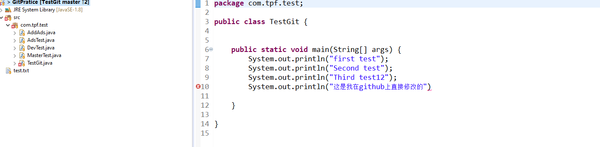

# git使用

由于学了忘了，忘了学，所以打算好好总结一下，代码很重要，担心把项目弄出问题所以必须好好学习总结一下。

参考<a href="https://www.runoob.com/git/git-tutorial.html">菜鸟教程</a>、<a href="https://www.liaoxuefeng.com/wiki/896043488029600">廖雪峰git教程</a>

创建版本库 git init

## Git 工作区、暂存区和版本库（提交过程）

首先我们先搞清楚这个存储空间的概念

**工作区：** 就是你在电脑里能看到的目录。就是你可以不经过git直接操作修改的                                                                                                                                                                                                                                                                                                                                                                                                                                                                                                                                                                                                                                                                                                                                                                                                                                                                                                                                                                                                                                                                                                                                                                                                                                                                                                                                                                                                                                                                                                                                                                                                                                                                                                                                                                                                                                                                                                                                                                                                                                                                                                                                                                                                                                                                                                                                                                                                                                                                                                                                                                                                                                                                                                                                                                                                                                                                                                                                                                                                                                                                                                                                                                                                                                                                                                                                                                                                                                                                                                                                                                                                                                                                                                                                                                                                                                                                                                                                                                       


 **暂存区：** 英文叫 stage 或 index。一般存放在  .git 目录下的 index 文件（.git/index）中，所以我们把暂存区有时也叫作索引（index）。

一般提交到版本库之前从工作区复制一份放到先放到这里。


**本地版本库:**   工作区有一个隐藏目录 .git，这个不算工作区，而是 Git 的版本库。也就是分支上哪些内容。

版本库上的分支与工作区间可以想象成两套文件，git实现的效果反正是这样，至于怎么样实现的咱们就不必关心。


图中我们可以看出此时 "HEAD" 实际是指向 master 分支的一个"游标"。所以图示的命令中出现 HEAD 的地方可以用 master 来替换。

我们用命令现在模拟一下，这文件在这几个空间传递。

现在我只是修改工作区间内容，未加到暂存区间上，也没有提交到本地仓库，看一下是什么状态（git status）


本地与工作空间的对比：git.md发生了更改，也未提交到缓存区  2.未跟踪的文件说明版本库没有这个文件的信息，也就是新增。然后我们在执行 git add . 把发生改变加到暂存区。然后再查一下拆状态。


这是加到暂存区的文件后查看状态情况。（之所以多了一个文件，是我上面写文档的时候又添加了一个图片）

changes to be commited----------顾名思义将要提交的改变，这就是加到暂存区后 git的状态。

下面我们看一下提交之后的状态。见下图。


## 撤销修改

```bash
git checkout -- file
```

两种不同情况下这个命令，会发生不同的操作

​			一种是`file`修改后还没有被放到暂存区，现在，撤销修改就回到和版本库一模一样的状态；

​			另一种是`file`已经添加到暂存区后，又对工作区间对应的文件做出了修改，现在，撤销修改就回到添加到暂存区后修改文件前的状态，也就是说就丢失了加到暂存区后工作区间文件的修改（很危险的）。（**一句话就是：会用暂存区全部或指定的文件替换工作区的文件**）

（也就是暂存区的文件与工作区间对应的文件一致）


```bash
git reset HEAD <file>
```

在暂存区有文件时，使用此命令就会把暂存区的文件修改回退到工作区，就相当于恢复到add到暂存区**之前**的状态


```shell
git rm --cached <file>
```

直接删除暂存区的文件，工作区间不会做任何修改，就和加暂存区的状态一样。下边我们用命令来演示一下。


```shell
git checkout HEAD <file>
```

下面几个图是我演示的


修改文件：

恢复到与版本库一致（命令展示）：


展示效果：


## 版本回退

```shell
git reset [--soft | --mixed | --hard] [HEAD]
```


实践的过程中理解更深，下面三句话我写到一个test.txt文件中，当然这个文件在我的仓库的工作区中。我每写一句，就会提交到本地。


上面这三句话我每写一句话就提交到了本地版本库中，我们怎么查看记录呢？这就用到了 下面的命令

```shell
git log 
```

 这个命令有很多参数，具体使用可查看 <a herf="https://www.runoob.com/git/git-commit-history.html#git-log">git log</a>

我么用这个命令来查看一下，我们刚才提交的`git log --pretty=oneline ` 下图就是我们刚才提交的log


很明显前三个是我们上面对应提交的，下面我们画一个图来表示一下现在的状态。（HEAD就是分支上的一个指针）

```code
┌────┐
│HEAD│
└────┘
   │
   └──> ○ I LOVE YOU !
        │
        ○ You're great!
        │
        ○ You are beautiful!     
```

现在我们把文件改成这样


#### hard参数的回退

现在我们让HEAD指针 指向到 You're great!这个节点怎么做呢 用这个下面这个命令

```shell
git reset --hard HEAD^
```

执行完后是下面的效果。

​													 


```ascii
┌────┐
│HEAD│
└────┘
   │
   │    ○ I LOVE YOU !
   │    │
   └──> ○ You're great!
        │
        ○ You are beautiful!
```

HEAD指针会指向前一条记录，顺便更新工作区间的文件，修改的未提交的将会丢失。

咱们再来看一下这个命令的`git reflog`的效果与`git log`有什么不同？


由此说明`git log`是提交记录而 `git reflog`是命令记录

现在我们又想吧把HEAD指针还原到原来的位置也就是 我们提交 I LOVE YOU！ 的位置，该怎么办?

先别着急我们先在test.txt文件中写点东西


执行下面命令(后面的字母数字，是commit id ,虽然没有写全但是足以标识这个提交)

```shell
git reset --hard  c8d2382
```


```ascii
┌────┐
│HEAD│
└────┘
   │
   └──> ○ I LOVE YOU !
        │
        ○ You're great!
        │
        ○ You are beautiful!   
```


顺便会把工作区间同步到这个`8d2382`版本,工作区间修改未提交的将会被丢失。

上面展示的是带hard指令的回退，咱们总结一下：

​			**--hard 参数撤销工作区中所有未提交的修改内容，将暂存区与工作区都回到上一次版本，并删除之前的所有信息提交**


#### mixed参数的回退

mixed是默认参数，是可以不用写出来的。

咱们先展示游戏啊test.txt文件的状态，看下图


现在咱们先试一下下面这两个命令的其中一个吧

```shell
git reset HEAD^ 
git reset 3d38af80  //我自己这边的上一个版本号
```

我们先把 test.txt加到暂存区在执行这个命令看看会发生什么。


在执行 `git reset HEAD^`命令后**暂存区被清空**，分支上并且回退到 `You'are great`这个节点


然后我们仿照上一节讲的，看是否能够让分支回到`I LOVE YOU!`的节点，顺便观察一下工作区是否改变。


我们可以看出工作区自始至终都没有发生改变，这个命令在工作中很有用的。


再看菜鸟教程的收对单个文件的回退，感觉很好奇，如果这样可以执行，那么版本库不就乱套了吗？下载我们试一下这个命令。

```
 git reset HEAD^ <File>
```

现在咱们尝试一下。


在执行` git reset c8d2382`后我们看一下


回退单个文件的时候HEAD指针并没有发生变化，但是版本库中文件内容确实改变了，我们再看一下`relog` ，见下图只看前两个即可。效果呢就是这么个效果。


总结一下把：**回退分支上的文件版本和清空暂存区的内容而且工作区文件不发生改变。**


#### soft参数的回退

文件test.txt状态跟前面一样，不多赘述。话不多说，我们来试一下面命令吧。

```shell
git reset --soft HEAD^ 
```


和mixed命令的区别很明显的是，暂存区没有被清空。所以咱们直接总结一下吧

总结一下把：**回退分支上的文件版本并且暂存区文件和工作区文件不发生改变**

#### 一些知识

* HEAD 表示当前版本

* HEAD^ 上一个版本

* HEAD^^ 上上一个版本

* HEAD^^^ 上上上一个版本

* HEAD~0 表示当前版本

* HEAD~1 上一个版本

* HEAD^2 上上一个版本

* HEAD^3 上上上一个版本

* git reset HEAD 清空暂存区

## 增加分支

当前节点建造分支 `git checkout -b dev`


head指针表示当前操作的位置，整个分支就是版本库的信息。打分支就是建造了另一条路（在哪个节点打的分支就相当于 岔路口），每一个节点相当于版本。


在一个分支上修改提交后。可把当前分支的内容合并到原来的分支上。


打分支的好处就是可以让你在一个分支大胆的实验的自己的思想，不用害怕破坏原有分支的数据，等你是把代码写好并测试完美提交到分支上很好。

下面我们看一下相关的操作命令


查看分支

```shell
git branch
```

建立分支

```shell
git branch (branchname)
```


切换分支命令:

```shell
git checkout -b <branchname>或者git switch -c <branchname>
```


当前分支合并到主分支上

```shell
git merge
```


创建分支并切换创建分支上

```shell
git checkout -b <branchname> 或者git branch -d <branchname>
```

删除分支

```shell
git branch -d <name>
```


后面会统一讲合并

## 第四个储存空间（缓存）

​		除了工作空间、分支、暂存区。还有一个地方可以存储，那就是stash。不过它保存的是当前工作空间的状态，主要的作用是防止丢失工作工作间修改单位提交的内容。比如你正在修改内容，突然需要切换分支来一件事情，以往情况下，如果你不把当前分支上修改的内容提交了你就无法切换分支。咱么下面来尝试一下使用吧。

这是我现在的状态

​																			 																			

下面我们要增加分支，并在分支上做出修改但不提交。


接下来要做就是保存工作空间，在切换到master在切换回dev在做，然后还原工作空间。


工作空间里面文件又还原了，这是多么方便，这里只提到了它的简单使用。详细使用参考这里<a href="https://git-scm.com/docs/git-stash">git-stash</a>


## 远程仓库

​	怎么样才能合作写代码，这就依靠到了远程仓库。我们把自己做的那部分提交到远程分支，从而大大提高了开发效率，让工作人员专注于开发。

有了远程分支git才完整的，让我们来看一下我们工作中git使用整体图。


我们接下来看一下远程仓库怎么使用。

第一种情况：远程空仓库，想把本地仓库更新到远程仓库上

```shell
git remote add [remoteRepositoryName] [remoteUrl]  //就会生成一个remoteRepositoryName名字的仓库 仓库的名字和分支的名字要分清楚
```

就会把本地仓库更新到了远程仓库。用`git remote -v`查看远程仓库。


把本地库所有内容推动到远程库

```shell
git push -u origin master
```


本地作了提交，把提交内容推送到远程仓库的命令

```
git push origin master
```


第二种情况：远程有仓库，我想把远程仓库拉下来建立一个本地仓库（新来的员工）

```
 git clone [url]
```


这个url可以是上面的https 和ssh链接。只要你有权限就可以在本地复制出一个和远程一样的仓库。

查看关联的远程库的详细信息。


让本地库增加关联的远程库（比如你想在gitee和GitHub都想发布并更新项目）

```shell
git remote add [shortname] [url]
```

shortname 为本地的版本库

```
git remote rm name  # 删除远程仓库
git remote rename old_name new_name  # 修改仓库名
```


现在我们在本地仓库里面增加了一个文件像提交上去。我们需要怎样操作呢？


我现在首先在github直接修改一个文件


我在本地仓库新增了一个文件test.txt并且提交了，但没提交到远程。（借用egit便于查看）


现在条件都准备好了，我们来看看怎么同步代码。首先远程更新的代码下载下来用命令 `git fetch origin` ,然后把下载下来代码合并到本地用命令

`git merge origin/master`。然后我们吧本地仓库提交到远程来更新远程仓库的代码`git push origin master`。这样我们就可以做到远程和本地同步代码。 origin--仓库名（其实是仓库的url  `git remote -v` 可以查看）  master代表仓库里面的分支。

现在我们来具体的操作一下


查看文件，合并成功（忘了写分号了......）



但是本地仓库修改还没有同步到远程仓库，我们接着执行。


我们再来查看github上面


我们再来说一个命令`git pull`

```
git pull <远程主机名> <远程分支名>:<本地分支名>
```

**git pull** 其实就是 git fetch 和 git merge FETCH_HEAD 合并起来执行。


命令的详细使用查看官方网站。

现在整体流程就是这样的，这就是我们在开发中的大致流程。


## 合并

​	这个应该是最关键的一章了，合并，无论是远程代码的合并，本地两个分支之间合并都非常重要。在前面没有讲合并，在本章将会对合并遇到的情况进行详细的讲解。