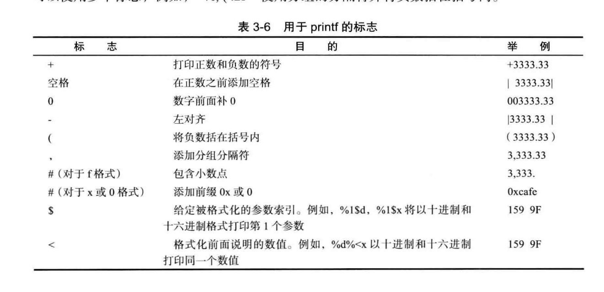

# java基础

## 第一章 java基本程序设计结构

### 1.1数据类型

java数据类型和java对象的区别

|   类别   |                             区别                             |
| :------: | :----------------------------------------------------------: |
| 数据类型 |          没有引用的概念，就是表示存储在内存上的数据          |
|   对象   | 需要来用存储在栈上的引用类型来指向，对象本身存储在堆上，引用类型存储的对象的地址相当于c++的指针。（后面详细介绍jvm内存模型） |

八种基本类型

|  类别   |    存储需求    |                 | 备注                                                         |      |
| :-----: | :------------: | :-------------: | ------------------------------------------------------------ | ---- |
|   int   |     4字节      |      整型       |                                                              |      |
|  short  |     2字节      |      整型       | 常应用于底层文件的处理                                       |      |
|  long   |     8字节      |      整型       |                                                              |      |
|  byte   |     1字节      |      整型       |                                                              |      |
|  float  |     4字节      |      浮点       |                                                              |      |
| double  |     8字节      |      浮点       | 三个特殊的浮点类型：正无穷大、负无穷大、<br />、NaN(不是一个数字) |      |
|  char   |     16bit      | 表示Unicode编码 |                                                              |      |
| boolean | 1bit（不知道） |                 |                                                              |      |

### 1.2 变量

| 值得注意的几个地方                                           |
| ------------------------------------------------------------ |
| 1.不能使用未初始化的变量                                     |
| 2.变量的声明尽量靠经第一次使用的地方                         |
| 3.常量要用final关键字，常量名最好大写，一生只能被赋值一次 。static final 用来定义类常量。 |
| 4.const 目前是java的保留字还未使用，常量必须使用final来声明。 |

### 1.3运算符

+、-、*、 / % 分别表示 加、减、乘、除、取余  结果的数据类型为参数的数据类型的范围最大的那个

|      |      |      |
| ---- | ---- | ---- |
|      |      |      |
|      |      |      |
|      |      |      |

### 1.4 字符串

java无内置字符串，标准类库提供了预定义类String （官方已经定义好的,非原生）。

<font color="red" >**每个用双引号括起来的字符串都是String类实例**</font>

1. **不可变**

   根据String源码发现，String对象没有修改自己数值的方法，只有生成字符串对象的方法（不改变自身对象的值）。

2. **String 常量共享**

   什么是String常量？只要是只要是用双引好包裹表示就相当于生成一个String常量。比如 String a=new String("abc"); 其实是生成了两个字符串常量一个是“abc”字符串常量对象； 另一个是值为“abc”的String对象；虽然它们两个的值相等的，但是他们不是一个对象。

   看下面代码：

   ```java
   		String strA = "112";
           String strB = "112";
           String strC = new String("112");
           String strD = "11" + "2";
           String a="11",b="2";String strE=a+b;
           String strF=a+"2";
           System.out.println("strA==strB:"+(strA==strB));
           System.out.println("strA==strC:"+(strA==strC));
           System.out.println("strA==strD:"+(strA==strD));
           System.out.println("strA==strE:"+(strA==strE));
           System.out.println("strA==strF:"+(strA==strF));
   ```

   打印结果

   ```text
   strA==strB:true
   strA==strC:false
   strA==strD:true
   strA==strE:false
   strA==strF:false
   ```

我们先来搞清楚== 和equals

<font color="red">**值比较？地址比较？**</font>

​			== 就是值比较，不过比较的值是引用类型的值，引用类型的值是什么？就是所指向对象的地址。例如：String a= new String("abc") 就是都这个函数返回一个引用类型的值赋给了 引用类型a; 

​		equals方法是对象的方法，只不过引用类型可以调用，进而可以比较他们指向对象的值。还有一点需要注意equals比较对象之间的值是否相等是根据对象的特性来写的。

strA==strB:true  引用类型指向同一个常量String 。所以他们同一个对象。

strA==strC:false 两个不同的对象 new String()不做共享变量

strA==strD:true 通过反编译可以看到这种写法与strA strB没有任何区别

strA==strE:false String strF=a+"2"; 字符串拼接 只要里面含有一个非常量，他就会生成一个非常量的String


咱们再在探究一下 new String("123"); 先看下面这段代码。

```java
		 char [] a={'a','c','d'}; char[] b=a;
         b[0]='A';System.out.println(a[0]);
```

打印结果

```text
A
```

说明数组也是一个对象，也就是可以用引用类型来指向。

再来看一下String 的new String方法

```java
  	public String(String original) {
        this.value = original.value; // private final char value[]; 
        this.hash = original.hash;  //private int hash; 
    }
```

也就说 this.value 和original.value 引用的是同一个数组对象。 所以说original不管所表示的字符串多大，只要它存在this的生成速度是极快，和大小没有影响。

3. **String注意要点**

 contact方法

```java
public String concat(String str) {
    int otherLen = str.length();
    if (otherLen == 0) {
        return this;
    }
    int len = value.length;
    char buf[] = Arrays.copyOf(value, len + otherLen);
    str.getChars(buf, len);
    return new String(buf, true);
}
```

concat方法的本质是生成一个新的String，从两个字符串中一个一个复制。这种方法不适合使用在连续向超大型字符串上拼接字符串。因为它会一个一个字符的复制到新的字符串上，极度浪费时间。”abc................................“.concat("a")， 这样循环几次就会极度浪费时间。

```java
String a="abc......"//超大字符串
while(有限次){
    a=a.concat("a")
}
```


上面的代码在有限的时间内运行不了几次


a+b的本质什么？ StringBuilder有什么弊端？ 小心StringBuilder的扩容机制导致内存溢出

4. **码点和代码单元**


5.**常用API**

|                        签名                         |                             解释                             |
| :-------------------------------------------------: | :----------------------------------------------------------: |
|               char charAt (int index)               | 返回给定位置的代码单元。除非对底层的代码单元感兴趣，<br />否则不需要调用这个方法。 |
|             int codePointAt(int Index)              |                  返回从给定位置开始的码点。                  |
| int offsetByCodePoints(int startlndex, int cpCount) |   返回从 startlndex 代码点开始位移 cpCount 后的码点索引。    |
|            int  compareTo(String other)             | 按照字典顺序如果字符串位于 other 之前，返回一个负数；如果字符串位于 <br />other 之后，返回一个正数； 如果两个字符串相等，返回 0。 |
|               IntStream codePoints()                | 将这个字符串的码点作为一个流返回。调用 toArray 将它们放在一个数组中。 |
| new String(int[] codePoints, int offset, int count) |    用数组中从 offset 开始的 count 个码点构造一个字符串。     |
|            boolean equals(0bject other)             |             如果字符串与 other 相等，返回 true。             |
|                        ....                         |                            .....                             |
|                  查看核心技术卷一                   |                                                              |

### 1.5 输入输出

1. **读取输入**

输标准出流输出内容到控制台非常简单，System.out.println 即可。

读取标准输入流System.in，得用到Scanner对象与标准输入流相关联，例如：Scanner in = new Scanner(System.in); 然后利用Scanner类的方法进行读取

控制台读取密码不用Scanner 因为可见。用Console类来实现	

```java
//在控制台运行程序，要不Console为空
Console cons = System.console();
String username = cons.readLine("User name: ");
char[] passwd = cons.readPassword("Password:", new Object[0]);
```

输出结果：密码输入不可见

```text
User name: root   
Password:
```


> java.util.Scanner5.0 


| API                                                 | 说明                                           |
| --------------------------------------------------- | ---------------------------------------------- |
| Scanner (InputStream in)                            | 用给定的输人流创建一个 Scanner 对象            |
| String nextLine( )                                  | 读取输入的下一行内容。                         |
| String next( )                                      | 读取输入的下一个单词（以空格作为分隔符)        |
| int nextlnt( )<br />double nextDouble( )            | 读取并转换下一个表示整数或浮点数的字符序列。   |
| boolean hasNext( )                                  | 检测输人中是否还有其他单词 。                  |
| boolean hasNextInt( )<br />boolean hasNextDouble( ) | 检测是否还有表示整数或浮点数的下一个字符序列。 |

> java.Iang.System 1.0

static Console console( ) 

| API                       | 说明                                                         |
| ------------------------- | ------------------------------------------------------------ |
| static Console console( ) | 如果有可能进行交互操作，就通过控制台窗口为交互的用户返回一个<br /> Console 对象，否则返回 null。 对于任何一个通过控制台窗口启动的<br />程序，都可使用 Console 对象。否则，其可用性将与所使用的系统有关 。 |

> java.io.Console 6

| API                                                          |                             说明                             |
| ------------------------------------------------------------ | :----------------------------------------------------------: |
| static char[] readPassword(String prompt, Object...args)<br />static String readLine(String prompt, Object...args) | 显示字符串 prompt 并且读取用户输入，直到输入行结束。 args 参数可以用来提供输人格式。 |

2.**格式化输出**

System.out.printf 方法可以进行格式化输出

System . out . printf（ ”8.2f“, x);

每一个以 ％ 字符开始的格式说明符都用相应的参数替换。 格式说明符尾部的转换符将指示被格式化的数值类型：f 表示浮点数，s 表示字符串，d 表示十进制整数




具体使用https://blog.csdn.net/jhsword/article/details/108574442


它是怎么解析这些字符串的，是通过Formatter类进行了解析，这个与String.format方法用的一个类进行的解析。我们在写程序的过程中可以适当借用这些预定义类进行功能的实现。

3.**文件的输入输出**

记住几个API

> java.util.Scanner 5.0

| API                  | 说明                                     |
| -------------------- | ---------------------------------------- |
| Scanner(File f)      | 构造一个从给定文件读取数据的 Scanner。   |
| Scanner(String data) | 构造一个从给定字符串读取数据的 Scanner。 |
|                      |                                          |

> java.io.PrintWriter 1.1

| API                              | 说明                                                      |
| -------------------------------- | --------------------------------------------------------- |
| PrintWriter(String fileName)     | 构造一个将数据写入文件的 PrintWriter。 文件名由参数指定。 |
| static Path get(String pathname) | 根据给定的路径名构造一个 Path。                           |

### 1.6 大数值

> Biglnteger 和 BigDecimaL 这两个类可以处理包含任意长度数字序列的数值。

对于c++得自己写大数值的计算，一般做算法题要求会会写简单的大数值的运算+ - * /

BigInteger 存在4000行代码，里面用到许多经典算法，值得后续研究。

### 1.7 数组

1. **支持Foreach循环**

   数组是支持foreach来遍历数组的值。实现Iterable的类对象也支foreach语法

   ```java
   for (variable : collection)  statement
   ```

   

2. **数组的初始化以及匿名数组**

   int[] a = new int[100];

   上面这种是创建了一个数组，存在了一个数组对象，被默认初始化。但是数组元素未必含有值。

   数字数组所有元素初始化为0；boolean数组初始化为false，对象数组初始化为了null

```java
Arrays.toString(a); //a为一个数组
```

若a 为基本数据类型的数组，就会以为一个数组元素的值组成字符串

若a为对象数组，就会调用对象的toString方法组成字符串

```java
new int[] { 17, 19, 23, 29, 31, 37 } //初始化匿名数组
```

```java
int [] a={17, 19, 23, 29, 31, 37 };
a=new int[] { 17, 19, 23, 29, 31, 37 }; 
a={17, 19, 23, 29, 31, 37 }; //报错
```

匿名数组的语法形式可以在不重新创建变量的情况下，可以重新初始化一个数组

与字符串一样 数组长度为0和null不相同

3.**数组拷贝**

在前面已经验证，数组也是一种object。也是需要引用类型来指向，所以拷贝数组的话不能使用"="，所以需要Arrays.copyOf()函数来进行深拷贝。

Array.copyof()可传入对象数组进行拷贝，它的原理是什么呢？

```java
@SuppressWarnings("unchecked")
public static <T> T[] copyOf(T[] original, int newLength) {
    return (T[]) copyOf(original, newLength, original.getClass());
}
```

```java
public static <T,U> T[] copyOf(U[] original, int newLength, Class<? extends T[]> newType) {
    @SuppressWarnings("unchecked")
    T[] copy = ((Object)newType == (Object)Object[].class)
        ? (T[]) new Object[newLength]
        : (T[]) Array.newInstance(newType.getComponentType(), newLength);
    System.arraycopy(original, 0, copy, 0,
                     Math.min(original.length, newLength));
    return copy;
}
```

解释 说明


Arrays一些比较有用的API

> java . util.Arrays 1.2

| API                                                          | 说明 |
| ------------------------------------------------------------ | ---- |
| static String toString(type[]a)                              |      |
| static type copyOf(type[]a, int length)<br />static type copyOfRange(type[]a , int start, int end) |      |
| static void sort(type [ ] a)                                 |      |
| static int binarySearch(type[] a , type v)<br />static int binarySearch(type[]a, int start, int end , type v) |      |
| static void fill(type[]a , type v)                           |      |
| static boolean equals(type[]a, type[]b)                      |      |

4. **多维数组**

foreach同样可以嵌套使用 来访问元素

```java
for (double row : a)
	for (double value : row)
		do something with value
```

a为一个二维数组  则a[i]表示一个一位数组

```java
int[][] odds = new int[NMAX + 1] [] ;
for (int n = 0; n <= NMAX ; n++)
	odds [n] = new int[n + 1] ;
```

表示的不规则数组为

```text
0
0 0
0 0 0
0 0 0 0
0 0 0 0 0
.....
```

## 第二章 对象和类


### 2.1 面向对象设计

1. **类**

面向对象设计即OOP

对象的一个重要概念说就是封装（encapsulation），把对象的数据和行为组装到一个包，并对对象的使用者隐藏数据的实现方式。

实例域：对象中的数据     方法：操作数据的过程

封装的关键：不能让类中的方法直接访问其他类的实例域。

继承 更加便于定义自定义类，方便扩展。

2.**类之间的关系**


### 2.2 预定义类

1. **对象和对象变量**

对象变量不是一个对象，只是可以存储对象的引用，也就是引用一个对象。对象变量可以通过引用调用所引用的对象的方法。

局部变量不会自动地初始化为 null，而必须通过调用 new 或将它们设置为 null 进行初始化。


2. **多使用官方的自定义类**

比如

> java.time.LocalDate 8

| API                                                          | 说明                                                         |
| ------------------------------------------------------------ | ------------------------------------------------------------ |
| static Local Time now( )                                     | 构造一个表示当前日期的对象。                                 |
| static LocalTime of( int year , int month , int day )        | 构造一个表示给定日期的对象。                                 |
| int getYear( )<br />int getMonthValue( )<br />int getDayOfMonth( ) | 得到当前日期的年、月和曰。                                   |
| DayOfWeek getDayOfWeek( )                                    | 得到当前日期是星期几， 作为 DayOfWeek 类的一个实例返回。 调用 getValue 来得到<br/>1 ~ 7 之间的一个数，表示这是星期几，1 表示星期一，7 表示星期日。 |
| Local Date piusDays( int n )<br />LocalDate minusDays(int n) | 生成当前日期之后或之前 n 天的日期。                          |

### 2.3 自定义类

1. **隐式参数和显示参数**

```java
//Employee类的一个方法
public void raiseSalary(double byPercent)  
{
    double raise = salary * byPercent / 100;
    salary += raise;
}

number007.raiseSalary(5);
```

 byPercent为显示参数， number007为隐式参数，在方法中this可以表示隐式参数。（this要与关键字super使用上做好区分）

2.  **final实例域**

final修饰的变量值是不允许改变的。

修饰基本类型的变量时，他表示的值是不会改变的。当它修饰对象变量时，对象变量的引用值是不会改变的，也即是说所引用的对象（如果是可变类对象）自身的值是可以修改的。

什么是不可变类对象----类中只有final修饰的基本类型域或者不可变类型对象。  

### 2.4 静态域与静态方法

### 2.5 方法参数

方法参数是按照值传递，对象参数则传递拷贝的引用值，基本类型参数则直接传递拷贝代表的值

### 2.6 对象构造

