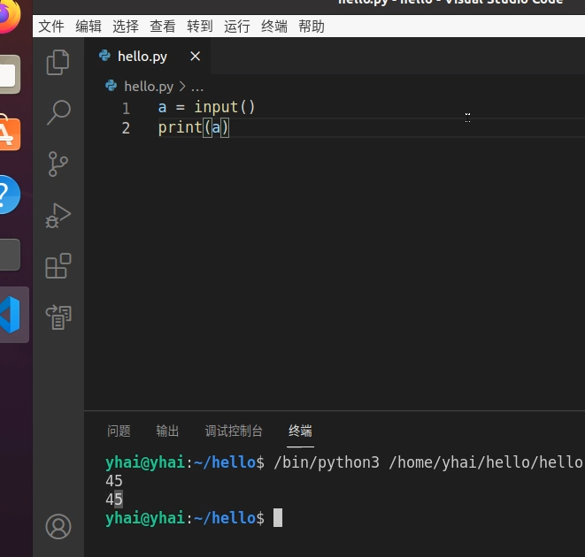

## 初识

```python
from time import sleep,ctime  #导入第三方的库函数
    
fire='大火'  #变量赋值
def do_xcr():   #定义函数（完成做一件事）
    print("准备食材")
    print("-----开始炒菜------")
    pot = "油"
    pot = pot+ 'pork'
    print('锅里有:'+pot)
    if(fire == '大火'): #分支判断
        count=0
        while(count<10):  #循环控制
            count = count+1	
            print('翻炒'+str(count))
    else:       
        print('翻炒40下')
    pot = pot+ '辣椒'+'盐'+'花椒'
    print('锅里有:'+pot)
    sleep(2)  #调用第三方的函数
    print("装盘完成")
    print(ctime())  #显示当前的时间

print("============做小炒肉=============")
do_xcr()  #调用函数
print("============做小炒肉=============")
do_xcr()  #调用函数（避免代码重复）
```


### hello

pyhton 解析器--> 解析python文件,输出结果

> 命令方式

```python
$ python
>>> print("hello")
hello
>>> 3+5  
8
>> a ="hello"
>> b =" baby"
>> a+b
hello baby
>>> print("out:"+a+b)
>> quit()    //退出
```

> 脚本方式

```python
print("Hello, world ")  #//输出显示 
x=2  #//变量x 赋值为2
y=5
print(x+y)  #//输入 x+y的结果显示
```

运行程序

```shell
$ python3 hello.py
```

### 数据类型和变量

```python
字符串(string) //‘pork’    ‘辣椒’
数字(number)   // 0.5        5
列表           //['盐','芝麻','花椒'] 	
字典           //{'name':'王伟','age':25,'school':'新东方'}
逻辑(Bool)     //True(真)   False(假)

变量   //变量可以变化，存放不同的东西
       //pot   = ‘辣椒’    listBox   =  ['盐','芝麻', '花椒']
```

### 流程控制

**分支（条件判断）**

```python
if(fire == '大火'):  #注意有冒号
  print('翻炒10下')  #注意冒号下的分支程序要 Tab键缩进
else:       
  print('翻炒20下')	
```

```python
count=0
while(count<10): 
  count = count+1	
  print('翻炒'+str(count))
```

### 函数

```python
def do_xcr():
    print("hello world")
    print("准备食材")
    print("炒菜完成")
```

调用函数

```python
do_xcr()
do_xcr()
```

### 类

```python
class Person:     #//定义类(只是想法)
  name = 'lili'   #//类属性
  def talk(self): #//类行为(方法)：形参self必须有，代表类的实例,相当于java中的this
    print("can talk,my name is:",self.name);

p = Person()      #//新建类的实例对象
p.talk()          #//调用对象的方法（无参，但其实有参，它是隐藏的第一个实参，为类的实例)
print("name is",p.name)  #//访问对象的属性	
p.age=30          #//可动态添加(python是动态语言）
print("new age is",p.age)
```

### 库

封装好功能，只需导入调用。pyhton库是python的快速的原因

```python
#//官方文档  https://docs.python.org/zh-cn/3/ 
import random #//随机数库
print(random.random())

import time; #//时间的库
print(time.ctime())
     
import math; #//数学库
print(math.gcd(4,12));
```

### 输入输出


```python
a = input("请输入: ")
print(a, type(a))

print('%s %d %c %x'%('ivan',10,65,15))  #//老版本格式化输出： 字符串 整型 字符 16进制

i = 2
j = 5
print('{}*{}={} '.format(i, j, i * j))	

#//新版格式化输出: 0指format的第一个对象(如3),1指format的第二个对象(如10), 
#//                {1:x} 冒号前指对象，冒号后指定输出类型(b:二进制，x:16进制)	
print('{0}二进制:{0:4b} {1}十进制:{1:d} 16进制:{1:x}'.format(3,10))  
```




```python
a = input("请输入: ")
print(a, type(a))
```

结果

```text
请输入: 1
1 <class 'str'>
```

---


```python
print('%s %d %c %x'%('ivan',10,65,15)) 
```

结果

```text
ivan 10 A f
```


---

```python
i = 2
j = 5
print('{}*{}={} '.format(i, j, i * j))	
```

结果：

```text
2*5=10
```


---

```python
print('{0}二进制:{0:4b} {1}十进制:{1:d} 16进制:{1:x}'.format(3,10))  
```


```text
3二进制:  11 10十进制:10 16进制:a
```

**例子--猜大小**

```python
import random

def guess():
    num = int(input("请输入你猜测：小(0), 大(1)\n"))
    computer = random.randint(0, 1) //生成0 或者1
    print("computer is ",computer)
    if (num == computer):
        print("你赢了")
    else:
        print("你输了")

guess();
guess();
guess();
```

**九九算法表**

```python
for i in range(1, 10):
    for j in range(1, i + 1):
        print('{}*{}={} '.format(i, j, i * j), end='')  #//end指定结束方式，如不指定，将默认换行
    print('') 
```

**异常**

```python
x=3
y=0
try:    #//如无异常判断将终止退出，不能继续往下执行
    print(x/y)
except : 
    print("can not be zero")	
print("go go go")
```

**语法识别**

```python
#//---关键字（保留字）   -->  保留字不能用作常数或变数，或任何其他标识符名称 ,python 关键字全小写 
print  pass assert
if else  return for while continue break
class try   
def with 	import from is finally lambda 
= + - * %	  
#//---语句
counter = 100;  #//语句:把整型数据100赋值给变量counter (;表示语句结束,可省略).  
name = "John"   #//字符串类型
price = 2+3+5;  #//表达式语句 
Price = 8;      #//区分大小写(price 和Price不是同一个）
#//---注释
#                   #//单行注释 
'''  多行注释 '''    #//多行注释：三个单引号或双引号
"""  多行注释 """     

#//---字面量（直接量)  -->  直接用的数据值(如 print(34+5))
34 'ivan' True False #//基础类型： 数字 字符串 bool值。  
[2,3,'ivan',5]       #//列表 train= [2,5,'ivan',False]   
                     #//print(train)  train[2]=55 print(train) 
```

