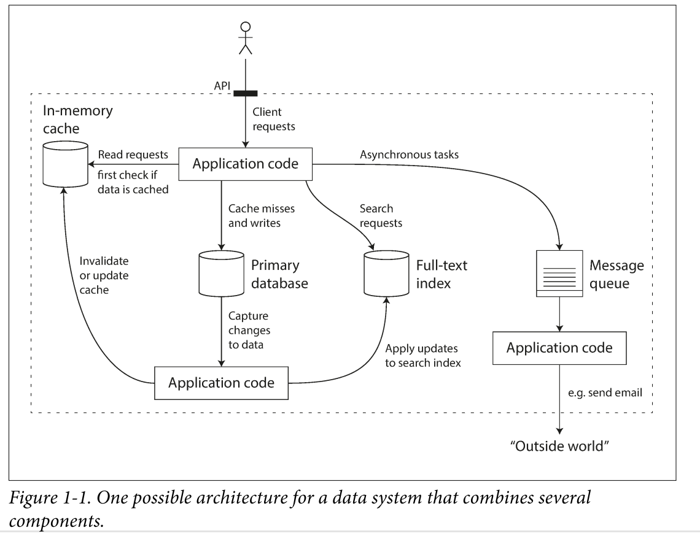

# 数据应用基础

## 可靠性高、易扩展、易维护的应用

当今所需应用，相对于计算密集型应用来说，数据密集型应用较多。对于这类型数据密集型应用来说，CPU不是制约它运行、发展的主要条件，这类应用主要面对的问题是，复杂多变的数据。	

构建这类应用一般需要下面几个模：

+ 存储数据---> 数据库
+ 记住复杂操作结果-->缓存
+ 允许用户用关键字查询和过滤数据-->索引
+ 向其他进程发消息，异步处理（流处理）
+ 定期清理积累，大批量数据

### 数据据系统的思考

​		曾经没有这么多的数据系统，只有一种传统的数据库。随着业务的数据的复杂和量的提升。出现应对不同场景的数据存储工具。它们不能在归为一个传统数据库工具了。他们的访问方式不尽相同，进而他们的实现也不同。

​		因为现在的应用的数据的复杂和庞大。单独一个工具无法满足应用的需求。我们必须把任务量分割起来。把任务分配给适合的工具。分割任务，调度工具并把这些工具组合起来就要依靠我们书写的应用代码。本质就是我们用代码组建一个数据库系统

当我们组合工具的时候应该注意：

+ 给客户端提供API的时候，隐藏这些实现细节
+ 这个组合的数据库系统必须保证符合逻辑的正确执行
+ 把自己当成数据库系统设计成员，不再仅仅是开发人员

设计数据库系统时，将要面对的问题

+ 当发生错误时，怎么保证存储的数据的正确性
+ 当部分系统退化降级，怎么保证系统还有良好的表现
+ 负载增加后怎么扩容
+ 怎么样才算一个好的API

影响数据库的设计的一些因素

+ 参与人员的经验
+ 遗留下来的问题
+ 交付日期
+ 公司的风险承受程度

接下来 我们聚焦 系统可靠性、扩展性、维护性进行讲解。接下来我们将用到一些技术、结构、算法来解决上面的问题

### Reliability

对于应用来说的稳定性

+ 按照用户的期望正确执行功能
+ 经得住用户的错误操作。（鲁棒性）
+ 经得住合理的负载和数据量
+ 防止未经授权的访问

可靠性可总结为应用正确的工作着。

发生错误的原因为**故障**，自动能够处理这样**故障**，称之为**容错性**或者**鲁棒性**。故障不等于系统**崩溃**(停止向用户提供服务)。故障不能避免到0，因此防止故障导致系统崩溃便是最好的方法

​	在一些容错系统中，经常故意提高一些错误率来触发系统的错误处理。例如：没有警告的随机杀掉一个进程。这么做是由于大多严重的漏洞都是由于没有很好的进行错误处理。故意出发故障，能够充分检测错误处理，在面对自然而然的错误时，能够增加信心处理这些错误。（例如网飞的`Chaos Monkey`）

有些错误是不能被治愈的（处理的），只能从预防的角度来避免错误。比如安全问题。例如一个黑客破解了一个系统，并获得了访问权限。这个无法被治愈只能预防。

#### 硬件故障

硬件故障有哪些：硬盘崩溃、内存出错、机房停电、拔错网线。大型数据中心硬件故障很常见

硬盘的平均故障时间（MTTF）大约10-50年。上万个硬盘集群。每天都有硬盘报销很正常

解决方法：对单个硬件增加冗余（RAID）、服务器双路电源、热插拔CPU、备用电源（电池、柴油发电机）

数据量增加和计算需求的增加，就会需要更多的集器，所以出现硬件故障的概率也会增加。云平台上的服务器因为优先设计扩容性和弹性。往往忽略稳定性。所以往往宕机都没有提示信息。

​		如果可以利用软件容错（比如，软件直接可以选择没有宕机的节点）来对抗硬件的出错，那么这个系统将是更加进一步的系统。单个服务器系统如果要更新补丁，得计划好什么时候停机重启。允许机器失效的系统就可以逐步更新，一次更新一个节点，不用把整个系统停掉

#### 软件错误

​		硬件错误是随机和独立的，一个机器故障了不太会表明其他机器也发生故障，之间有特别小的关联性（温度升高导致所有机器宕机，这种情况是很少的情况）。

​	另一种错误就是系统内部错误，这种错误是不好被预测，因为他们跨节点的，各个节点有相互关系。它们会比硬件导致更多的系统错误