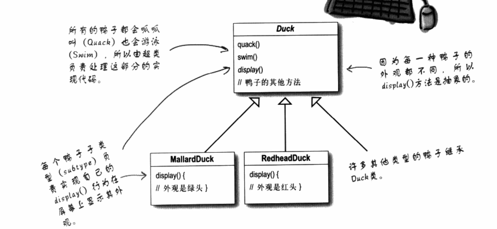
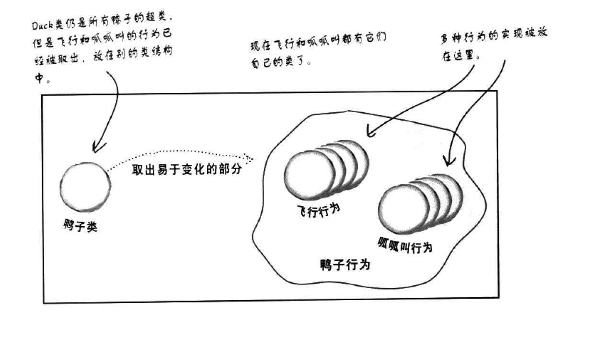
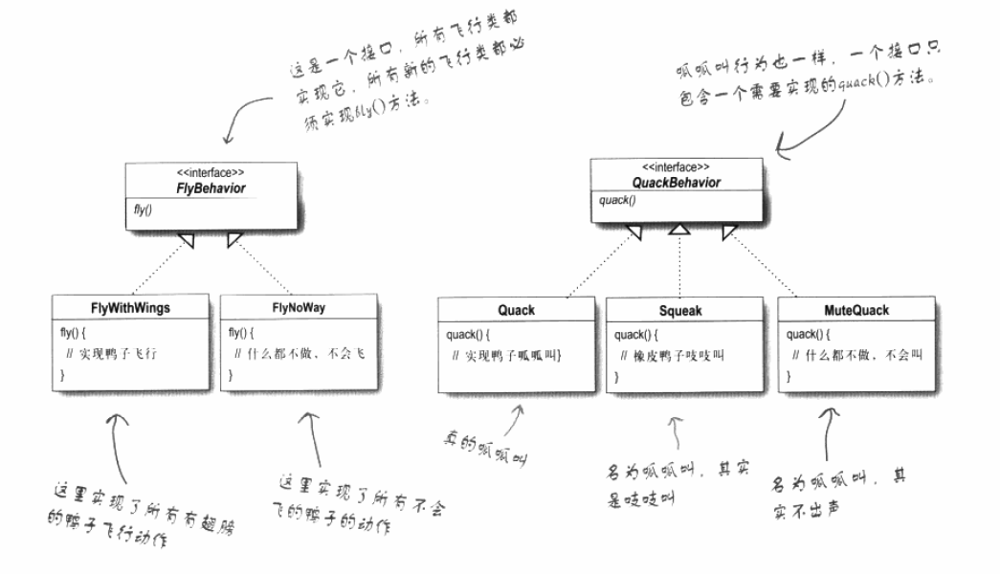

#                               设计模式

参考书籍：headFirst 设计模式

好的设计模式对于程序的后续维护和系统运行的稳定性至关重要。

## 第一章 策略模式

从一个基础的代码的开始

​	上面是一个很普通的设计。假设上面是一个完成的程序的代码，现在后期要增加会飞的鸭子。怎么增加这个会飞的方法。

**方案一：在Duck类里面增加fly方法**

这样会导致什么问题呢，有些鸭子并不会飞，这就会导致一些并不会飞的鸭子也会飞。

**方案二：增加flyable接口，会飞的子类去实现它**

这样会导致什么问题呢，每一个会飞的鸭子都得实现这个方法，，没有很好的重用代码。而且修改某一个某个行为时，必须找到每一个实现此行为的类中去修改他。无形中增加了工作量，还容易出错。所以不是一个好方法。

> 设计原则：找出应用中可能需要变化的部分，把它们独立出来不要和那些不需要变化的代码混合在一起

经过观察鸭子类中，fly()方法和quack()可能经常需要变化或者修改。所以把他们独立出来。

这两个行为方法，经常根据Duck的不同经常发生变化，所以我们需要独立出来建立一组新类代表某个行为。

那么我们怎么样设计这两个类呢

> 设计原则：针对接口编程而不是针对实现编程

要利用java多态进行编程，多态在编程中的重要性不言而喻。

不可能每个Duck子类都添加一个这个行为的引用对象，这样一样特别复杂而麻烦不宜维护。在父类中引用两个这样的行为对象，然后每一个类的相同行为的内容又不尽相同，所以我们利用以上的设计原则，面向接口编程。在父类中引用两个接口对象（抽象超类对象引用和接口对象引用都可以认为时面接口编程）。

​	以下是我们设计的类

这样的设计可以让后期维护更加方便，有以下优点：

这样的设计，可以让飞行和呱呱叫的动作被其它对象复用，因为这些行为与鸭子类无关了。

我们新增一些行为，不会影响的既有的行为类，也不会影像使用飞行行为的鸭子类。

**动态设定行为**

> 设计原则：多用组合，少用继承

如果某一个duck实现类突然变成哑巴了，那之前quack的行为方法就不适用，所以就要更替，怎么在运行的过程替换这个行为？采用组合的模式不用继承，而且设置相应的setter方法。其实前面已经谈到用组合的方式了

方案三：		

​									*整体代码生成的uml图----------待写（用自己写的代码生成）* 

以上就是策略模式。来一个总结：**策略模式定义了算法族，分别封装起来。让他们之间可以相互替换，此模式让算法的变化独立于使用算法的客户。**

