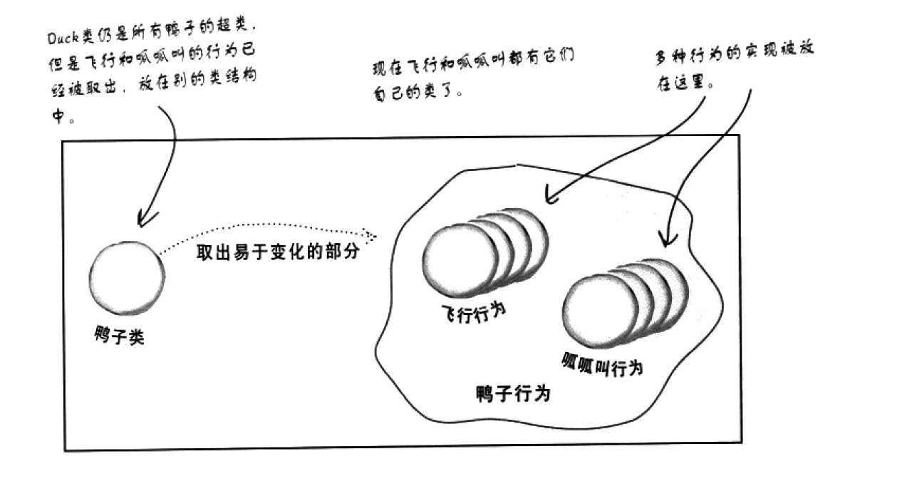
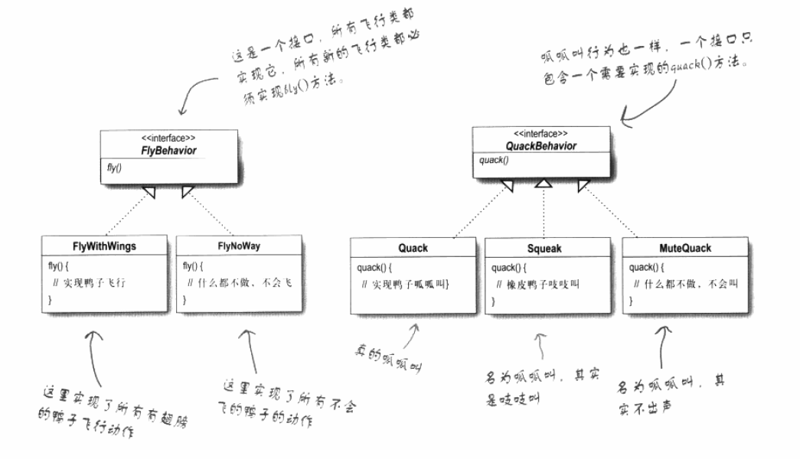
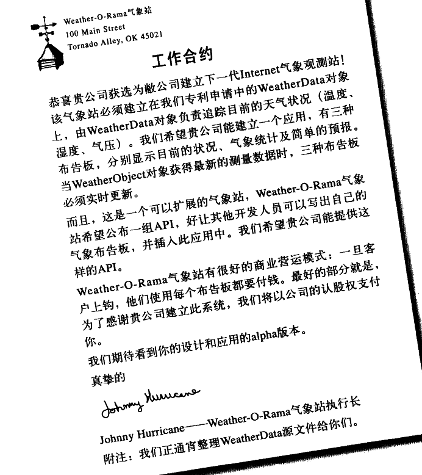
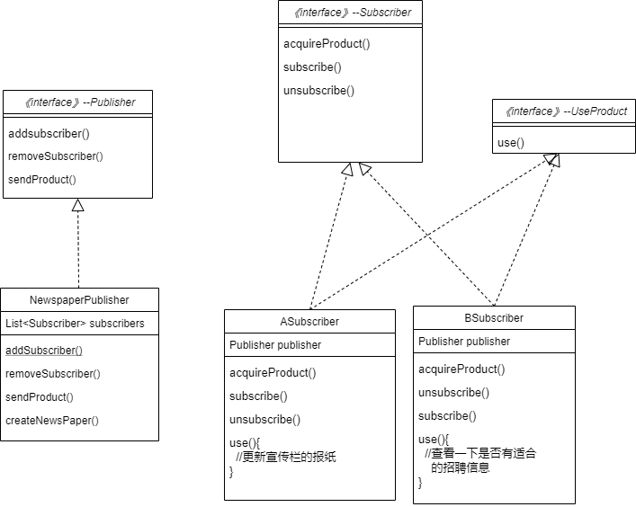
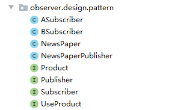
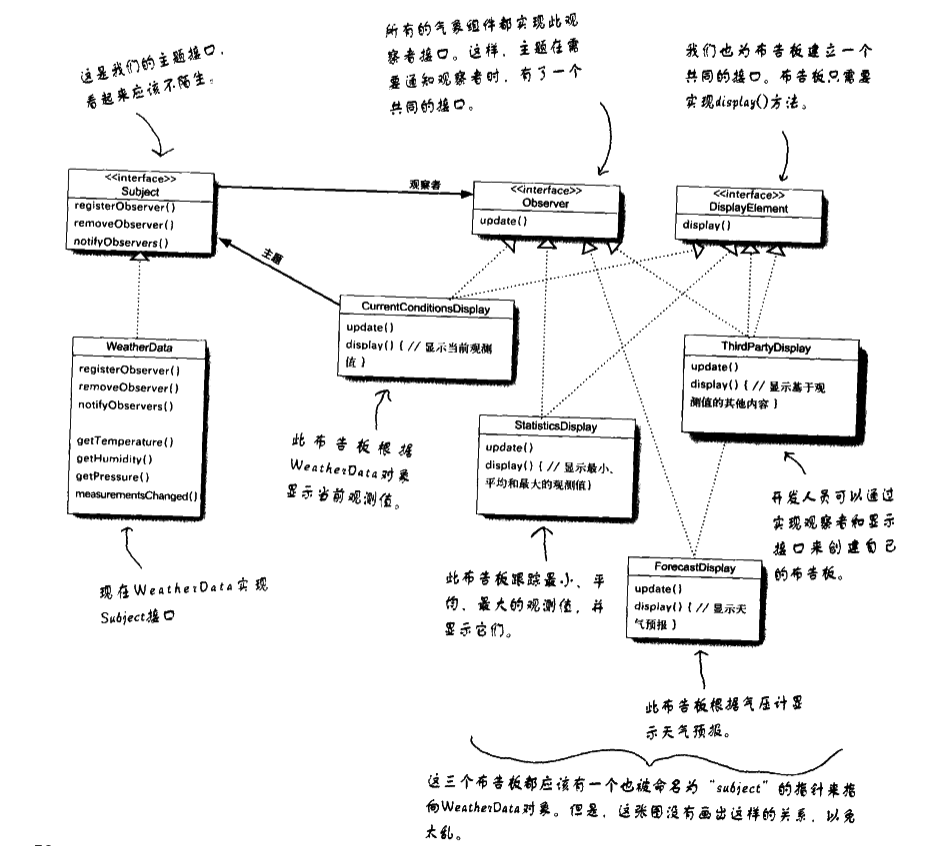
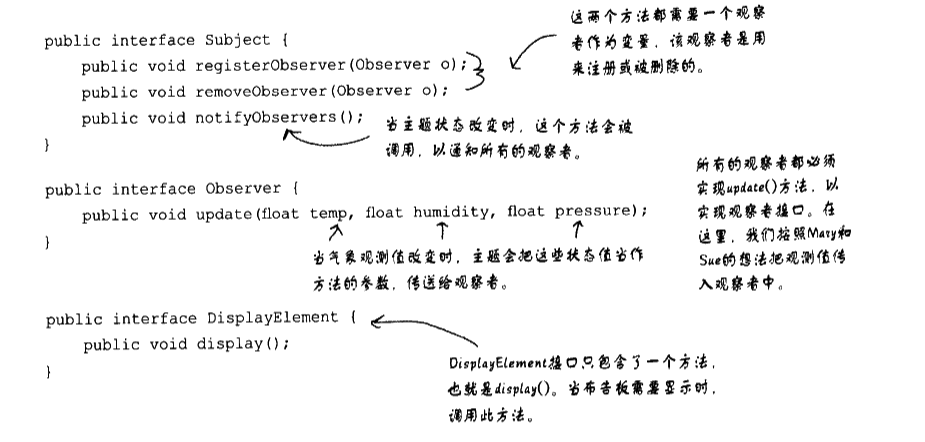
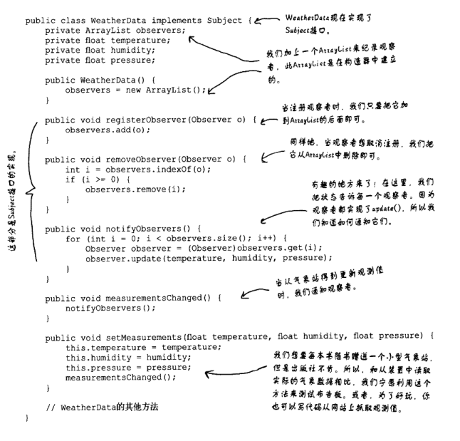
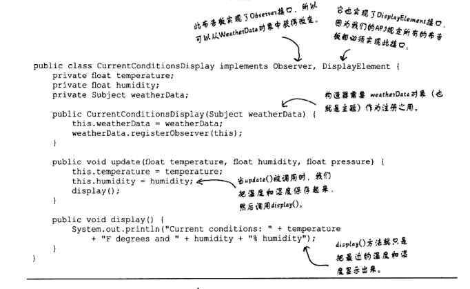

#                                 ·			设计模式

参考书籍：<a href="https://item.jd.com/10100236.html">headFirst 设计模式</a>

好的设计模式对于程序的后续维护和系统运行的稳定性至关重要。

## 第一章 策略模式


从一个基础的代码的开始

  

​	上面是一个很普通的设计。假设上面是一个完成的程序的代码，现在后期要增加会飞的鸭子。怎么增加这个会飞的方法。

**方案一：在Duck类里面增加fly方法**

这样会导致什么问题呢，有些鸭子并不会飞，这就会导致一些并不会飞的鸭子也会飞。

**方案二：增加flyable接口，会飞的子类去实现它**

这样会导致什么问题呢，每一个会飞的鸭子都得实现这个方法，，没有很好的重用代码。而且修改某一个某个行为时，必须找到每一个实现此行为的类中去修改他。无形中增加了工作量，还容易出错。所以不是一个好方法。

**方案三：**		

> 设计原则：找出应用中可能需要变化的部分，把它们独立出来不要和那些不需要变化的代码混合在一起


经过观察鸭子类中，fly()方法和quack()可能经常需要变化或者修改。所以把他们独立出来。




这两个行为方法，经常根据Duck的不同经常发生变化，所以我们需要独立出来建立一组新类代表某个行为。

那么我们怎么样设计这两个类呢


> 设计原则：针对接口编程而不是针对实现编程

要利用java多态进行编程，多态在编程中的重要性不言而喻。

不可能每个Duck子类都添加一个这个行为的引用对象，这样一样特别复杂而麻烦不宜维护。在父类中引用两个这样的行为对象，然后每一个类的相同行为的内容又不尽相同，所以我们利用以上的设计原则，面向接口编程。在父类中引用两个接口对象（抽象超类对象引用和接口对象引用都可以认为时面接口编程）。

​	以下是我们设计的类



这样的设计可以让后期维护更加方便，有以下优点：

这样的设计，可以让飞行和呱呱叫的动作被其它对象复用，因为这些行为与鸭子类无关了。

我们新增一些行为，不会影响的既有的行为类，也不会影像使用飞行行为的鸭子类。

**动态设定行为**

> 设计原则：多用组合，少用继承

如果某一个duck实现类突然变成哑巴了，那之前quack的行为方法就不适用，所以就要更替，怎么在运行的过程替换这个行为？采用组合的模式不用继承，而且设置相应的setter方法。其实前面已经谈到用组合的方式了

​									*整体代码生成的uml图----------待写（用自己写的代码生成）* 


​          


以上就是策略模式。来一个总结：**策略模式定义了算法族，分别封装起来。让他们之间可以相互替换，此模式让算法的变化独立于使用算法的客户。**

## 第二章 观察者模式

先来一个需求，然后给出一下解决方案。 下图就是需求



就是有一个WeatherData对象，负责存储数据。当WeatherData数据更新时，**面板**就能根据数据更新面板的内容。我们一般会怎么给出解决方案呢？

方案一：

我一般都会采用这种方案，这种方案会带来什么问题呢？


​		假如有一天我们不需要其中一个面板了怎么办？貌似只能手动删除这个代码。假如我们需要新增一个新的面板，同样需要手动的更改代码。这样很很不灵活，耦合性很高，后期难以维护。


> **为了交互对象之间的松耦合设计而努力**


由上面的方案一将引出我们的设计模式---观察者模式。

观察者模式=出版者+订阅者。

​	出版者当把报纸印出来后需要向每一个订阅者分发报纸，订阅者可以取消订阅者的身份，非订阅者也可以成为订阅者。出版者厂商把报纸送到订阅者的手里，就不管订阅者是怎么处理这份报纸了。由以上的场景我们来分析一下这个出版订阅的例子。这样就正好的解决了方案一遇到的问题，不过我们先分析这个例子。

​	出版商（Publisher）怎么知道发送给谁呢，出版商肯定会存有存储订阅者（Subscriber）的数据，所以出版商会根据这些数据（**List<Subscriber>  subscribers**）把这些报纸送给他们。虽然每一个订阅者都可以被认为获得了新的这一份报纸（**统一接口** Subscriber），但是每一个订阅者对这份报纸都会不同的处理方式（**不同实现**）。消费者还要有 取消增加订阅的权利，这怎么办？他肯定需要有出版商的联系方式（引用），才能告诉出版商把自己从数据里面添加进去或者删除掉。

经过上面的分析如果还是糊里糊涂，让就看下面的实现。 先画一个简略的uml图，然后进行了代码的实现。



根据上面的图我进行了代码的实现，但是在实现的过程中慢慢考虑的事情越来越多，变得比上面复杂了一点。下面我把具体的代码放到下面，下面代码就不解释了，耐下心肯定会能看下去的。



```java
public interface Product {
}
```

```java
public interface Publisher {

    void addsubscriber(Subscriber subscriber);

    void removeSubscriber(Subscriber subscriber);

    void sendProduct();
}
```

```java
public interface Subscriber {

    void acquireProduct(Product product);
    void subscribe();
    void unsubscribe();
}
```

```java
public interface UseProduct {

    void use();

}
```

```java
public class NewsPaper implements  Product {

    String id;
    String info;

    NewsPaper(String id, String info){
        this.id=id;
        this.info=info;
    }
    public String getId() {
        return id;
    }
    public String getInfo() {
        return info;
    }

}
```

```java
public class NewsPaperPublisher implements Publisher {

    List<Subscriber> subscribers;
    NewsPaper newsPaper;

    @Override
    public void addsubscriber(Subscriber subscriber) {
        subscribers.add(subscriber);
    }

    @Override
    public void removeSubscriber(Subscriber subscriber) {
        subscribers.remove(subscriber);
    }

    @Override
    public void sendProduct() {
        for (Subscriber subscriber:subscribers){
            subscriber.acquireProduct(newsPaper);
        }
    }

    public void createNewsPaper(String id,String info){

        this.newsPaper=new NewsPaper(id,info);
    }

}
```

```java
public class ASubscriber implements Subscriber,UseProduct{
    NewsPaper newsPaper;
    Publisher publisher;

    ASubscriber(Publisher publisher){
        this.publisher=publisher;
    }
    @Override
    public void acquireProduct(Product product) {
        this.newsPaper=(NewsPaper)product;
        use();
    }
    @Override
    public void use() {
        System.out.println("我要更换宣传栏报纸，这次报纸id为" + newsPaper.getId());
        //更换宣传栏报纸
    }
    @Override
    public void subscribe() {
        publisher.addsubscriber(this);
    }

    @Override
    public void unsubscribe() {
        publisher.removeSubscriber(this);
    }
}
```

```java
public class BSubscriber implements Subscriber,UseProduct{
    NewsPaper newsPaper;
    Publisher publisher;
    BSubscriber(Publisher publisher){
        this.publisher=publisher;
    }

    @Override
    public void acquireProduct(Product product) {
        this.newsPaper=(NewsPaper)product;
        use();
    }

    @Override
    public void use() {
        System.out.println("我要在id为"+newsPaper.getId()+"的报纸上找工作");
        //查看招聘信息
    }
    @Override
    public void subscribe() {
        publisher.addsubscriber(this);
    }

    @Override
    public void unsubscribe() {
        publisher.removeSubscriber(this);
    }

}
```

我们分析实现完这个出版订阅的例子后，那么本章开始要的那个解决方案就呼之欲出了。我们来看headfirst是怎么解决的









​	是不是实现的和你想的一样，如果和你想的在思想上差不多，那么就基本上掌握了这个设计模式。同样java内置也有观察者模式(Observable--Observer)，更加具有通用性，但并不一定适合你设计的程序。但并不非常切合你设计的程序的时候你也可以自己设计适合自己的程序的观察者模式。（Observable是一个类不是一个接口，根据java单继承无法继承别的类，可能会影响到你设计的类的实现。Observable保护一些关键方法可能会影响Observer调用），如果适合你设计的程序还是很不错的。

在swt中也有观察者模式的例子。比如Button和Lisener，一个button可以触发（通知）多个Listener。

